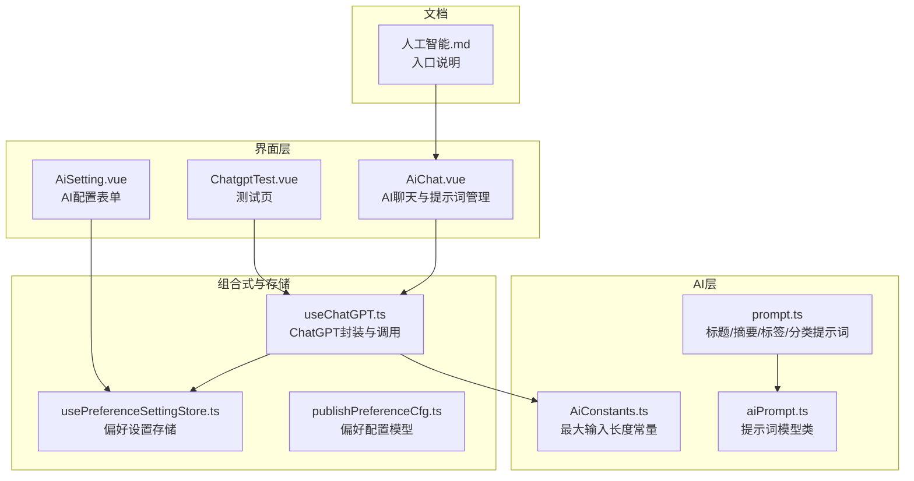
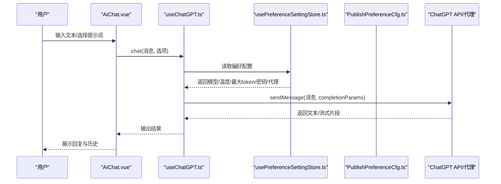
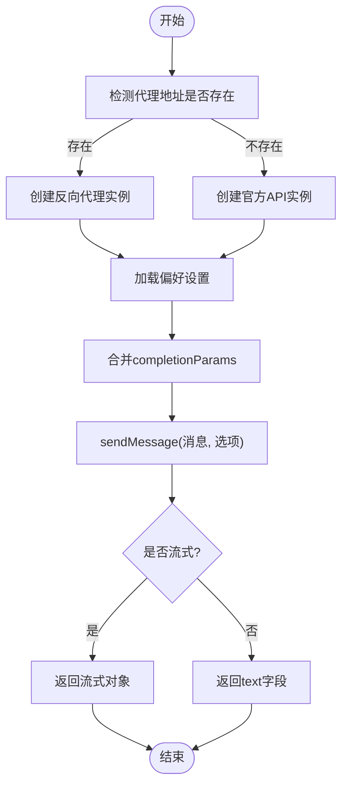
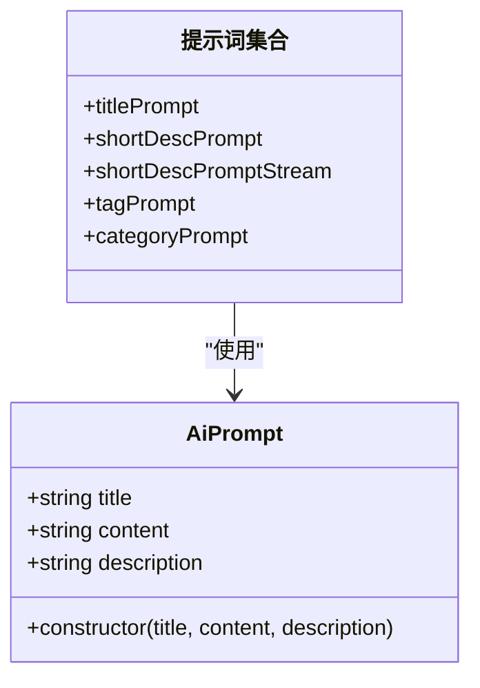
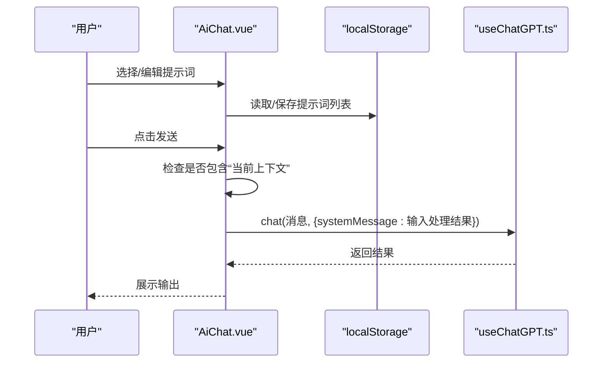
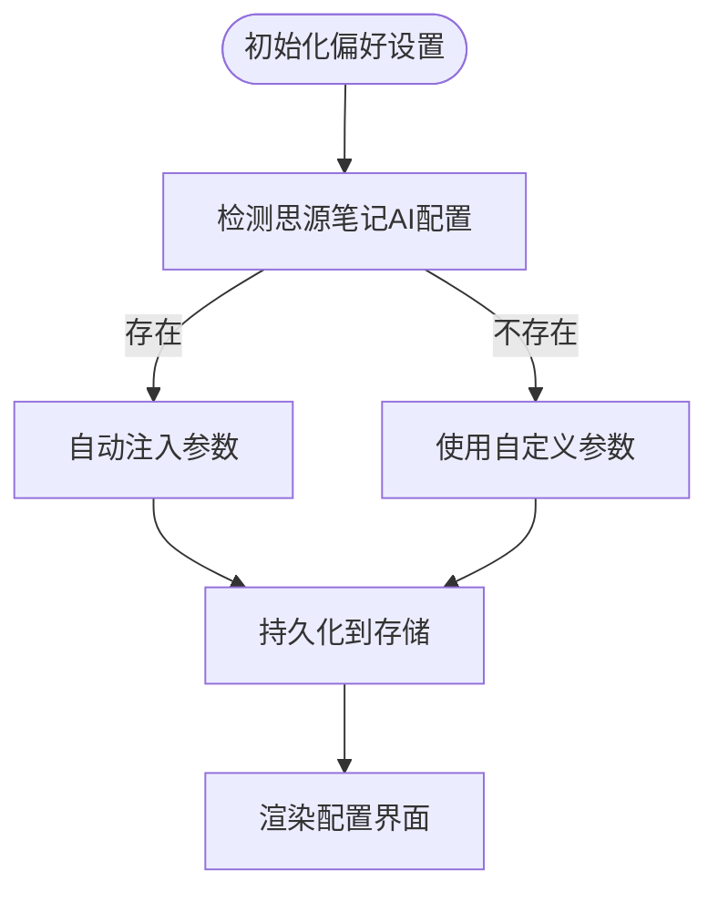
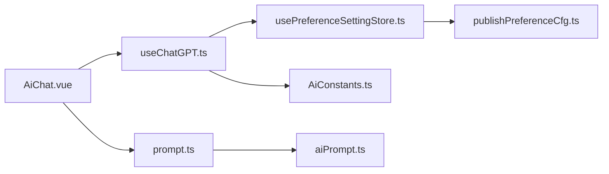

# AI辅助功能

<cite>
**本文引用的文件**
- [AiConstants.ts](file://src/ai/AiConstants.ts)
- [prompt.ts](file://src/ai/prompt.ts)
- [aiPrompt.ts](file://src/models/aiPrompt.ts)
- [useChatGPT.ts](file://src/composables/useChatGPT.ts)
- [AiSetting.vue](file://src/components/set/preference/AiSetting.vue)
- [usePreferenceSettingStore.ts](file://src/stores/usePreferenceSettingStore.ts)
- [publishPreferenceCfg.ts](file://src/models/publishPreferenceCfg.ts)
- [AiChat.vue](file://src/pages/AiChat.vue)
- [ChatgptTest.vue](file://src/components/test/ChatgptTest.vue)
- [人工智能.md](file://docs/人工智能.md)
</cite>

## 目录
1. [简介](#简介)
2. [项目结构](#项目结构)
3. [核心组件](#核心组件)
4. [架构总览](#架构总览)
5. [详细组件分析](#详细组件分析)
6. [依赖关系分析](#依赖关系分析)
7. [性能考量](#性能考量)
8. [故障排除指南](#故障排除指南)
9. [结论](#结论)
10. [附录](#附录)

## 简介
本文件系统性梳理本插件的AI辅助能力，重点覆盖以下方面：
- ChatGPT集成：API调用封装、认证与代理机制、消息处理流程
- 内容优化：标题提取、摘要生成、标签与分类建议
- 提示词管理：模板化提示词、参数注入、输出格式约束
- 配置项：模型、温度、最大token、代理与基础地址等
- 使用示例、最佳实践与故障排除
- 性能与限制说明

## 项目结构
围绕AI功能的关键目录与文件如下：
- ai层：常量与提示词模板
- models层：提示词数据模型
- composables层：useChatGPT封装
- stores层：偏好设置与全局配置
- pages与components：AI聊天界面与测试页面
- docs：入口与使用说明

图表来源
- [AiConstants.ts:1-26](file://src/ai/AiConstants.ts#L1-L26)
- [prompt.ts:1-109](file://src/ai/prompt.ts#L1-L109)
- [aiPrompt.ts:1-48](file://src/models/aiPrompt.ts#L1-L48)
- [useChatGPT.ts:1-130](file://src/composables/useChatGPT.ts#L1-L130)
- [usePreferenceSettingStore.ts:1-90](file://src/stores/usePreferenceSettingStore.ts#L1-L90)
- [publishPreferenceCfg.ts:1-101](file://src/models/publishPreferenceCfg.ts#L1-L101)
- [AiChat.vue:1-327](file://src/pages/AiChat.vue#L1-L327)
- [AiSetting.vue:1-121](file://src/components/set/preference/AiSetting.vue#L1-L121)
- [ChatgptTest.vue:1-89](file://src/components/test/ChatgptTest.vue#L1-L89)
- [人工智能.md:1-3](file://docs/人工智能.md#L1-L3)

章节来源
- [AiConstants.ts:1-26](file://src/ai/AiConstants.ts#L1-L26)
- [prompt.ts:1-109](file://src/ai/prompt.ts#L1-L109)
- [aiPrompt.ts:1-48](file://src/models/aiPrompt.ts#L1-L48)
- [useChatGPT.ts:1-130](file://src/composables/useChatGPT.ts#L1-L130)
- [usePreferenceSettingStore.ts:1-90](file://src/stores/usePreferenceSettingStore.ts#L1-L90)
- [publishPreferenceCfg.ts:1-101](file://src/models/publishPreferenceCfg.ts#L1-L101)
- [AiChat.vue:1-327](file://src/pages/AiChat.vue#L1-L327)
- [AiSetting.vue:1-121](file://src/components/set/preference/AiSetting.vue#L1-L121)
- [ChatgptTest.vue:1-89](file://src/components/test/ChatgptTest.vue#L1-L89)
- [人工智能.md:1-3](file://docs/人工智能.md#L1-L3)

## 核心组件
- ChatGPT封装（useChatGPT）：负责API实例化、认证参数注入、消息发送、流式与非流式响应处理、输入截断与HTML解析
- 提示词系统（prompt.ts + aiPrompt.ts）：提供标题、摘要、标签、分类等任务的提示词模板，支持JSON与纯文本两种输出格式
- 偏好设置（usePreferenceSettingStore + publishPreferenceCfg）：集中管理AI相关配置，支持从思源笔记内置AI配置自动注入
- 配置界面（AiSetting.vue）：提供密钥、基础地址、代理、模型、最大token、温度等参数的可视化配置
- 聊天界面（AiChat.vue）：提供提示词管理、上下文注入（当前文档）、发送与历史记录展示
- 测试页（ChatgptTest.vue）：简化版聊天测试入口

章节来源
- [useChatGPT.ts:1-130](file://src/composables/useChatGPT.ts#L1-L130)
- [prompt.ts:1-109](file://src/ai/prompt.ts#L1-L109)
- [aiPrompt.ts:1-48](file://src/models/aiPrompt.ts#L1-L48)
- [usePreferenceSettingStore.ts:1-90](file://src/stores/usePreferenceSettingStore.ts#L1-L90)
- [publishPreferenceCfg.ts:1-101](file://src/models/publishPreferenceCfg.ts#L1-L101)
- [AiSetting.vue:1-121](file://src/components/set/preference/AiSetting.vue#L1-L121)
- [AiChat.vue:1-327](file://src/pages/AiChat.vue#L1-L327)
- [ChatgptTest.vue:1-89](file://src/components/test/ChatgptTest.vue#L1-L89)

## 架构总览
下图展示了AI功能从用户交互到后端调用的整体流程。

图表来源
- [AiChat.vue:251-286](file://src/pages/AiChat.vue#L251-L286)
- [useChatGPT.ts:81-109](file://src/composables/useChatGPT.ts#L81-L109)
- [usePreferenceSettingStore.ts:34-66](file://src/stores/usePreferenceSettingStore.ts#L34-L66)
- [publishPreferenceCfg.ts:19-97](file://src/models/publishPreferenceCfg.ts#L19-L97)

## 详细组件分析

### ChatGPT集成与认证
- 实例化策略
  - 若配置了代理地址则使用反向代理实例；否则使用官方API实例
  - 支持通过环境变量或偏好设置注入密钥、基础地址、模型、最大token、温度
- 认证与参数
  - 密钥来源优先级：环境变量兜底偏好设置
  - completionParams合并策略：以调用方传入为主，未指定字段使用偏好设置
- 输入处理
  - 截断策略：按最大token常量截断Markdown原文
  - HTML解析：将HTML转换为可处理文本，避免超长与结构复杂导致的token溢出
- 错误处理
  - 初始化失败与调用异常均记录日志并提示用户检查配置

图表来源
- [useChatGPT.ts:33-67](file://src/composables/useChatGPT.ts#L33-L67)
- [useChatGPT.ts:87-104](file://src/composables/useChatGPT.ts#L87-L104)
- [AiConstants.ts:22](file://src/ai/AiConstants.ts#L22)

章节来源
- [useChatGPT.ts:1-130](file://src/composables/useChatGPT.ts#L1-L130)
- [AiConstants.ts:1-26](file://src/ai/AiConstants.ts#L1-L26)

### 内容优化功能（提示词模板）
- 标题提取：生成简洁、符合长度限制的标题，输出为JSON
- 摘要生成：提供JSON与纯文本两种输出，长度受控
- 标签建议：中文标签优先，英文标签小写并使用连字符连接，去重与长度限制
- 分类建议：中文分类优先，英文分类驼峰命名，长度与数量限制
- 输出格式控制：明确要求JSON键名与数组格式，确保可解析性

图表来源
- [aiPrompt.ts:17-45](file://src/models/aiPrompt.ts#L17-L45)
- [prompt.ts:100-106](file://src/ai/prompt.ts#L100-L106)

章节来源
- [prompt.ts:1-109](file://src/ai/prompt.ts#L1-L109)
- [aiPrompt.ts:1-48](file://src/models/aiPrompt.ts#L1-L48)

### 提示词管理系统
- 界面能力
  - 新增/编辑/删除自定义提示词，支持本地持久化
  - 预设提示词集合，包含“当前上下文”占位注入
  - 下拉选择提示词并自动填充输入框
- 上下文注入
  - 当提示词包含特定关键字时，自动启用“使用当前文档作为上下文”
  - 将当前文档Markdown与HTML经输入处理函数转换后注入为systemMessage

图表来源
- [AiChat.vue:153-178](file://src/pages/AiChat.vue#L153-L178)
- [AiChat.vue:240-249](file://src/pages/AiChat.vue#L240-L249)
- [AiChat.vue:261-272](file://src/pages/AiChat.vue#L261-L272)
- [useChatGPT.ts:117-121](file://src/composables/useChatGPT.ts#L117-L121)

章节来源
- [AiChat.vue:1-327](file://src/pages/AiChat.vue#L1-L327)

### 配置选项与界面
- 关键配置项
  - AI体验码（密钥）、基础地址、代理地址
  - 模型、最大token、温度
  - 是否使用思源笔记内置AI配置
- 自动注入
  - 若检测到思源笔记AI配置，自动填充上述参数
- 表单交互
  - 密钥输入密码态，滑块控制温度，数字输入控制最大token

图表来源
- [usePreferenceSettingStore.ts:40-57](file://src/stores/usePreferenceSettingStore.ts#L40-L57)
- [AiSetting.vue:23-89](file://src/components/set/preference/AiSetting.vue#L23-L89)
- [publishPreferenceCfg.ts:19-58](file://src/models/publishPreferenceCfg.ts#L19-L58)

章节来源
- [AiSetting.vue:1-121](file://src/components/set/preference/AiSetting.vue#L1-L121)
- [usePreferenceSettingStore.ts:1-90](file://src/stores/usePreferenceSettingStore.ts#L1-L90)
- [publishPreferenceCfg.ts:1-101](file://src/models/publishPreferenceCfg.ts#L1-L101)

### 使用示例与最佳实践
- 入口位置
  - 文档说明入口为“/#/manage”，结合页面组件定位
- 建议流程
  - 在偏好设置中配置密钥/代理/模型/温度/最大token
  - 在AI聊天页选择或编写提示词，必要时启用“使用当前文档作为上下文”
  - 对于标题/摘要/标签/分类等标准化任务，优先使用内置模板
- 输出解析
  - JSON模板需确保返回合法JSON，便于后续解析与赋值

章节来源
- [人工智能.md:1-3](file://docs/人工智能.md#L1-L3)
- [prompt.ts:19-28](file://src/ai/prompt.ts#L19-L28)
- [prompt.ts:36-58](file://src/ai/prompt.ts#L36-L58)
- [prompt.ts:63-77](file://src/ai/prompt.ts#L63-L77)
- [prompt.ts:82-95](file://src/ai/prompt.ts#L82-L95)

## 依赖关系分析
- 组件耦合
  - AiChat.vue依赖useChatGPT与本地存储，承担用户交互与提示词管理
  - useChatGPT依赖偏好设置存储与AI常量，负责统一的API调用逻辑
  - 提示词模板与模型类解耦，便于扩展与复用
- 外部依赖
  - chatgpt库：官方API与反向代理实例
  - Element Plus：表单与弹窗组件
  - UUID：提示词唯一标识
- 潜在风险
  - 代理与官方API切换的兼容性
  - 偏好设置缺失时的兜底策略
  - 提示词模板的输出稳定性与JSON解析健壮性

图表来源
- [AiChat.vue:128-140](file://src/pages/AiChat.vue#L128-L140)
- [useChatGPT.ts:10-16](file://src/composables/useChatGPT.ts#L10-L16)
- [usePreferenceSettingStore.ts:34-66](file://src/stores/usePreferenceSettingStore.ts#L34-L66)
- [publishPreferenceCfg.ts:19-58](file://src/models/publishPreferenceCfg.ts#L19-L58)
- [AiConstants.ts:18-23](file://src/ai/AiConstants.ts#L18-L23)
- [prompt.ts:100-106](file://src/ai/prompt.ts#L100-L106)
- [aiPrompt.ts:17-45](file://src/models/aiPrompt.ts#L17-L45)

## 性能考量
- 输入长度控制
  - 通过最大token常量限制输入长度，避免超限导致的错误与高延迟
- HTML解析与截断
  - 将HTML转换为文本并截断，减少token占用，提升稳定性
- 流式响应
  - 支持流式返回，改善用户体验，但需注意前端渲染与内存占用
- 配置优化
  - 合理设置最大token与温度，平衡质量与成本
  - 优先使用代理或官方直连，视网络与合规情况选择

章节来源
- [AiConstants.ts:22](file://src/ai/AiConstants.ts#L22)
- [useChatGPT.ts:117-121](file://src/composables/useChatGPT.ts#L117-L121)
- [useChatGPT.ts:96-104](file://src/composables/useChatGPT.ts#L96-L104)

## 故障排除指南
- 常见问题
  - 请求错误：检查密钥、基础地址、代理地址是否正确配置
  - 返回空：确认提示词模板与输出格式要求，确保返回合法JSON
  - 超时/不稳定：降低最大token或温度，或切换代理/官方直连
- 定位步骤
  - 查看偏好设置是否成功注入（特别是使用思源笔记配置时）
  - 在测试页单独发起请求，排除界面层干扰
  - 检查日志输出与Element提示信息
- 建议
  - 优先使用JSON模板并严格遵循键名与格式
  - 对于长文档，启用“使用当前文档作为上下文”并配合提示词中的上下文占位

章节来源
- [AiSetting.vue:23-89](file://src/components/set/preference/AiSetting.vue#L23-L89)
- [usePreferenceSettingStore.ts:40-57](file://src/stores/usePreferenceSettingStore.ts#L40-L57)
- [AiChat.vue:252-286](file://src/pages/AiChat.vue#L252-L286)
- [ChatgptTest.vue:30-53](file://src/components/test/ChatgptTest.vue#L30-L53)

## 结论
本插件通过统一的ChatGPT封装与完善的提示词模板，提供了稳定、可配置的AI辅助能力。结合本地化的提示词管理与直观的配置界面，既能满足日常写作优化需求，又便于扩展与维护。建议在生产环境中合理设置参数、规范提示词输出格式，并根据网络与合规条件选择合适的接入方式。

## 附录
- 入口参考：[人工智能.md:1-3](file://docs/人工智能.md#L1-L3)
- 聊天测试：[ChatgptTest.vue:1-89](file://src/components/test/ChatgptTest.vue#L1-L89)
- 提示词模板：[prompt.ts:1-109](file://src/ai/prompt.ts#L1-L109)
- 偏好设置模型：[publishPreferenceCfg.ts:1-101](file://src/models/publishPreferenceCfg.ts#L1-L101)