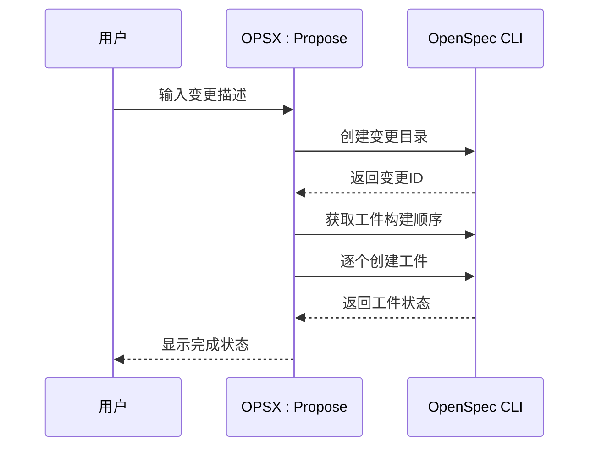
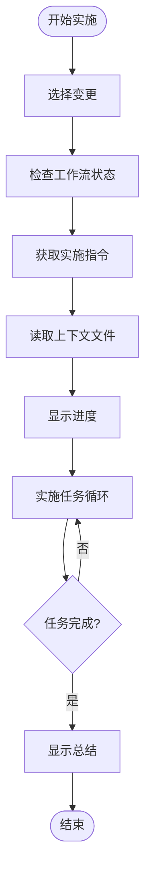
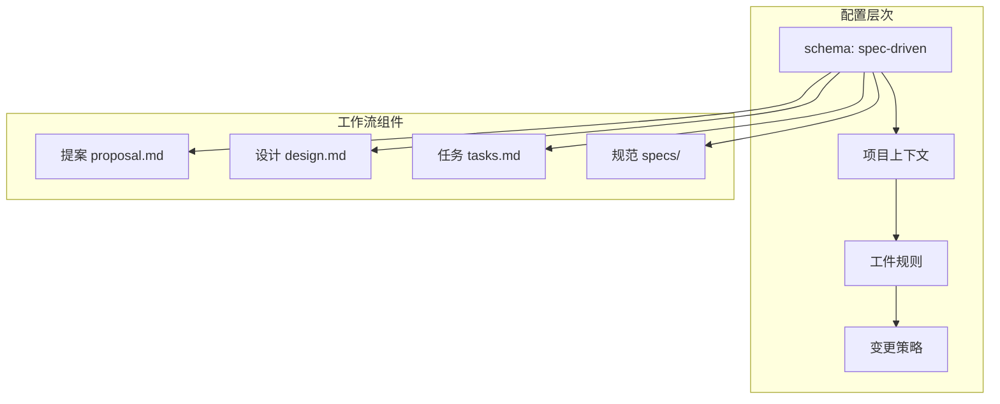
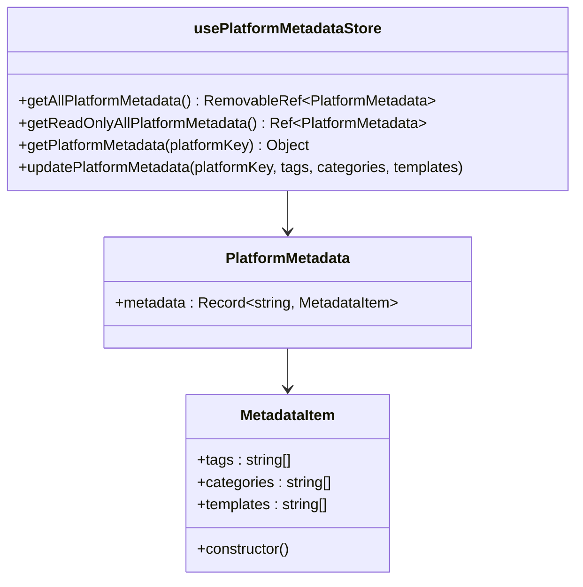
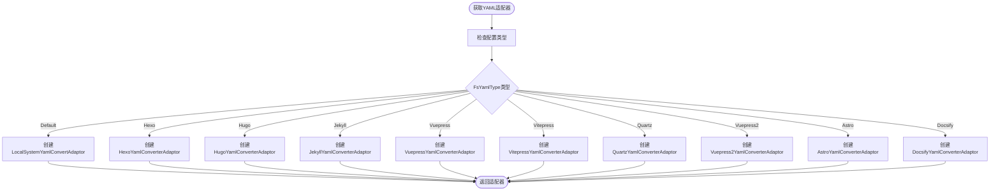
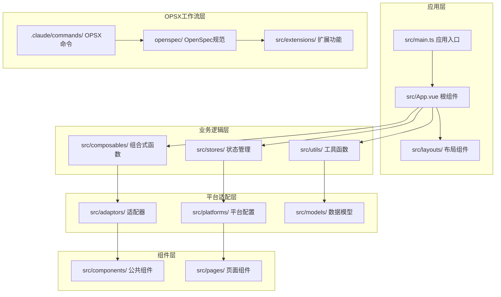
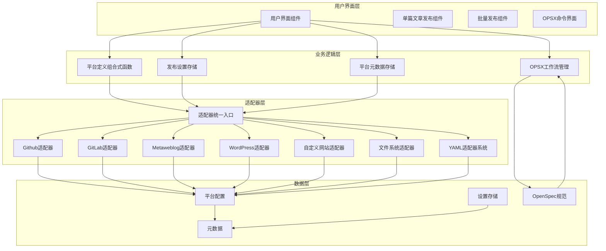
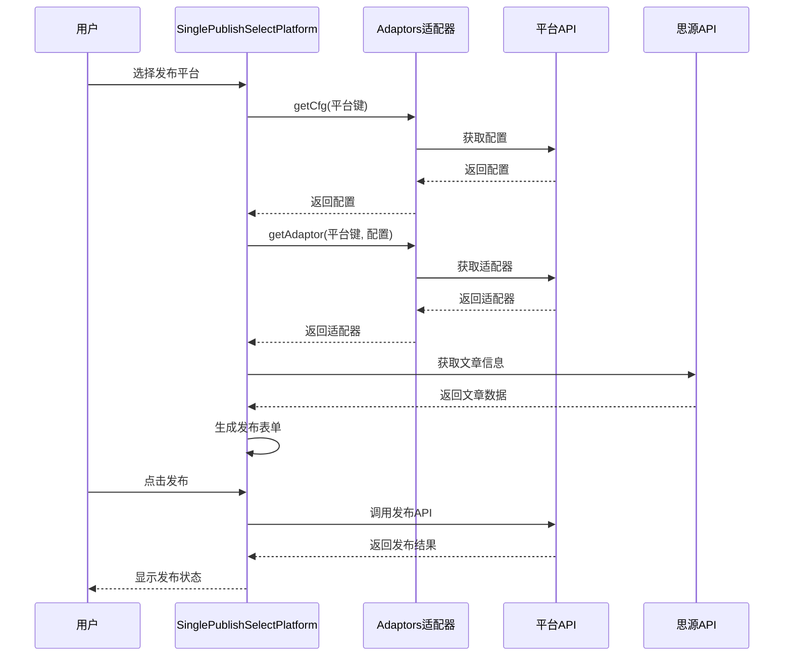
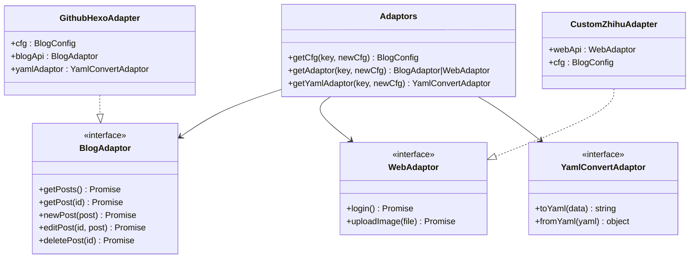
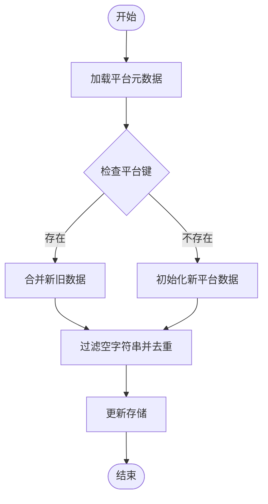

# OPSX实验性工作流

<cite>
**本文档中引用的文件**
- [README_zh_CN.md](file://README_zh_CN.md)
- [package.json](file://package.json)
- [DEVELOPMENT.md](file://DEVELOPMENT.md)
- [src/main.ts](file://src/main.ts)
- [src/bootstrap.ts](file://src/bootstrap.ts)
- [src/adaptors/index.ts](file://src/adaptors/index.ts)
- [src/platforms/pre.ts](file://src/platforms/pre.ts)
- [src/stores/usePlatformMetadataStore.ts](file://src/stores/usePlatformMetadataStore.ts)
- [src/composables/usePlatformDefine.ts](file://src/composables/usePlatformDefine.ts)
- [src/components/publish/SinglePublishSelectPlatform.vue](file://src/components/publish/SinglePublishSelectPlatform.vue)
- [src/pages/SinglePublish.vue](file://src/pages/SinglePublish.vue)
- [src/models/platformMetadata.ts](file://src/models/platformMetadata.ts)
- [src/utils/appLogger.ts](file://src/utils/appLogger.ts)
- [openspec/config.yaml](file://openspec/config.yaml)
- [.claude/commands/opsx/propose.md](file://.claude/commands/opsx/propose.md)
- [.claude/commands/opsx/apply.md](file://.claude/commands/opsx/apply.md)
- [.claude/commands/opsx/archive.md](file://.claude/commands/opsx/archive.md)
- [.claude/commands/opsx/explore.md](file://.claude/commands/opsx/explore.md)
- [openspec/changes/archive/2026-03-15-add-yaml-config/proposal.md](file://openspec/changes/archive/2026-03-15-add-yaml-config/proposal.md)
- [openspec/changes/refactor-ui-v2-foundation/proposal.md](file://openspec/changes/refactor-ui-v2-foundation/proposal.md)
- [src/adaptors/fs/LocalSystem/FsUtils.ts](file://src/adaptors/fs/LocalSystem/FsUtils.ts)
- [src/adaptors/fs/LocalSystem/LocalSystemConfig.ts](file://src/adaptors/fs/LocalSystem/LocalSystemConfig.ts)
- [src/adaptors/fs/LocalSystem/FsYamlType.ts](file://src/adaptors/fs/LocalSystem/FsYamlType.ts)
- [openspec/changes/archive/2026-03-15-add-yaml-config/specs/system-config/spec.md](file://openspec/changes/archive/2026-03-15-add-yaml-config/specs/system-config/spec.md)
</cite>

## 更新摘要
**所做更改**
- 新增OPSX命令系统章节，包含/opsx:propose、/opsx:apply、/opsx:archive、/opsx:explore四个核心命令
- 扩展配置框架章节，详细介绍新的config.yaml配置系统和OpenSpec规范驱动工作流
- 新增平台元数据存储章节，说明平台元数据的持久化管理和去重机制
- 更新架构概览，反映新的OPSX工作流集成
- 新增YAML配置框架章节，展示基于FsYamlType的动态适配器选择系统
- 扩展变更管理章节，包含具体的OpenSpec变更示例

## 目录
1. [简介](#简介)
2. [OPSX命令系统](#opsx命令系统)
3. [配置框架](#配置框架)
4. [平台元数据存储](#平台元数据存储)
5. [YAML配置框架](#yaml配置框架)
6. [项目结构](#项目结构)
7. [核心组件](#核心组件)
8. [架构概览](#架构概览)
9. [详细组件分析](#详细组件分析)
10. [依赖关系分析](#依赖关系分析)
11. [性能考虑](#性能考虑)
12. [故障排除指南](#故障排除指南)
13. [结论](#结论)

## 简介

OPSX实验性工作流是一个基于Vue 3构建的思源笔记发布工具，专门用于将思源笔记的文章发布到多个平台，包括语雀、Notion、WordPress、Typecho、Hexo、Hugo等多种博客平台和内容管理系统。该项目采用现代化的前端技术栈，支持多平台适配器模式，提供了完整的发布流程管理和元数据管理功能。

**更新** 该工作流现已集成了完整的OpenSpec规范驱动工作流，包括OPSX命令系统、配置框架和平台元数据存储等新特性。

该工作流的核心目标是简化从思源笔记到各种发布平台的内容迁移过程，通过统一的适配器接口实现对不同平台API的抽象封装，使得添加新的发布平台变得相对简单和标准化。新的OPSX命令系统进一步增强了开发效率，支持从提案到实现的完整工作流程管理。

## OPSX命令系统

OPSX命令系统是一套完整的实验性工作流管理工具，包含四个核心命令，支持从概念到实现的完整开发周期。

### /opsx:propose 命令

**用途**: 提出新变更 - 一步创建所有工件并生成完整的工作流

**工作流程**:
1. 接收用户描述或变更名称
2. 创建变更目录结构
3. 自动生成提案、设计和任务工件
4. 准备实施环境



**图表来源**
- [.claude/commands/opsx/propose.md:21-82](file://.claude/commands/opsx/propose.md#L21-L82)

### /opsx:apply 命令

**用途**: 从OpenSpec变更中实施任务

**核心功能**:
- 选择和激活变更
- 检查工作流状态和依赖关系
- 提供动态实施指导
- 管理任务执行进度



**图表来源**
- [.claude/commands/opsx/apply.md:12-85](file://.claude/commands/opsx/apply.md#L12-L85)

### /opsx:archive 命令

**用途**: 归档已完成的实验性变更

**归档流程**:
- 验证变更完整性
- 同步规范到主规范
- 移动到归档目录
- 生成归档报告

### /opsx:explore 命令

**用途**: 探索模式 - 深入思考、调查问题、澄清需求

**特点**:
- 专注于思考而非实现
- 支持自由探索和深度分析
- 可读取代码库进行调查
- 不进行实际代码实现

**章节来源**
- [.claude/commands/opsx/propose.md:1-107](file://.claude/commands/opsx/propose.md#L1-L107)
- [.claude/commands/opsx/apply.md:1-153](file://.claude/commands/opsx/apply.md#L1-L153)
- [.claude/commands/opsx/archive.md:1-148](file://.claude/commands/opsx/archive.md#L1-L148)
- [.claude/commands/opsx/explore.md:1-174](file://.claude/commands/opsx/explore.md#L1-L174)

## 配置框架

新的配置框架基于OpenSpec规范驱动方法论，提供了结构化的变更管理和工作流控制。

### config.yaml 配置系统

**核心特性**:
- 规范驱动(schema-driven)工作流
- 项目上下文配置
- 工件规则定制
- 变更管理策略



**图表来源**
- [openspec/config.yaml:1-21](file://openspec/config.yaml#L1-L21)

### OpenSpec 工作流

**变更管理**:
- 变更提案和设计分离
- 任务分解和跟踪
- 规范文档化
- 版本控制和归档

**章节来源**
- [openspec/config.yaml:1-21](file://openspec/config.yaml#L1-L21)

## 平台元数据存储

平台元数据存储系统负责管理每个平台的标签、分类和模板信息，提供持久化和去重功能。

### 数据模型



**图表来源**
- [src/models/platformMetadata.ts:16-47](file://src/models/platformMetadata.ts#L16-L47)
- [src/stores/usePlatformMetadataStore.ts:21-125](file://src/stores/usePlatformMetadataStore.ts#L21-L125)

### 存储机制

**持久化策略**:
- 使用本地存储进行数据持久化
- 支持只读访问模式
- 提供去重和过滤功能
- 自动处理空字符串和空白字符

**章节来源**
- [src/models/platformMetadata.ts:1-50](file://src/models/platformMetadata.ts#L1-L50)
- [src/stores/usePlatformMetadataStore.ts:1-127](file://src/stores/usePlatformMetadataStore.ts#L1-L127)

## YAML配置框架

新的YAML配置框架支持基于FsYamlType的动态适配器选择，为本地系统模式提供了强大的YAML生成能力。

### FsYamlType 枚举系统

支持的YAML类型包括：
- Default: 默认适配器
- Hexo: Hexo平台适配器
- Hugo: Hugo平台适配器
- Jekyll: Jekyll平台适配器
- Vuepress: VuePress平台适配器
- Vuepress2: VuePress2平台适配器
- Vitepress: VitePress平台适配器
- Quartz: Quartz平台适配器
- Astro: Astro平台适配器
- Docsify: Docsify平台适配器

### FsUtils 工具类



**图表来源**
- [src/adaptors/fs/LocalSystem/FsUtils.ts:31-98](file://src/adaptors/fs/LocalSystem/FsUtils.ts#L31-L98)

### 配置集成

**LocalSystemConfig 集成**:
- 新增fsYamlType配置项
- 支持FsYamlType枚举值
- 与现有yamlLinkEnabled功能兼容
- 提供默认适配器回退机制

**章节来源**
- [src/adaptors/fs/LocalSystem/FsUtils.ts:1-102](file://src/adaptors/fs/LocalSystem/FsUtils.ts#L1-L102)
- [src/adaptors/fs/LocalSystem/LocalSystemConfig.ts:1-45](file://src/adaptors/fs/LocalSystem/LocalSystemConfig.ts#L1-L45)
- [src/adaptors/fs/LocalSystem/FsYamlType.ts:1-69](file://src/adaptors/fs/LocalSystem/FsYamlType.ts#L1-L69)

## 项目结构

项目采用模块化的Vue 3应用架构，主要分为以下几个核心层次：



**图表来源**
- [src/main.ts:1-22](file://src/main.ts#L1-L22)
- [src/bootstrap.ts:1-53](file://src/bootstrap.ts#L1-L53)

**章节来源**
- [src/main.ts:1-22](file://src/main.ts#L1-L22)
- [src/bootstrap.ts:1-53](file://src/bootstrap.ts#L1-L53)

## 核心组件

### 应用启动器
应用通过`src/main.ts`启动，创建Vue应用实例并挂载到DOM元素中。启动过程中初始化国际化、状态管理、路由等核心服务。

### 适配器统一入口
`src/adaptors/index.ts`提供了统一的适配器管理接口，根据平台类型动态选择相应的API适配器。支持超过30种不同的发布平台，包括GitHub/GitLab托管的静态站点生成器、传统博客平台、自定义网站等。

### 平台配置管理
`src/platforms/pre.ts`定义了所有支持的平台配置，包括平台类型、认证方式、图标、域名等元数据信息。系统支持通用平台、GitHub平台、GitLab平台、Metaweblog平台、WordPress平台、自定义平台、文件系统平台等。

### 元数据存储
`src/stores/usePlatformMetadataStore.ts`实现了平台元数据的持久化存储，包括标签、分类、模板等信息的管理，支持去重和合并操作。

**更新** 新增OPSX命令系统集成，支持通过命令行工具进行工作流管理。

**章节来源**
- [src/adaptors/index.ts:1-605](file://src/adaptors/index.ts#L1-L605)
- [src/platforms/pre.ts:1-481](file://src/platforms/pre.ts#L1-L481)
- [src/stores/usePlatformMetadataStore.ts:1-128](file://src/stores/usePlatformMetadataStore.ts#L1-L128)

## 架构概览

项目采用了分层架构设计，通过适配器模式实现平台无关的发布功能，并集成了OPSX工作流管理系统：



**图表来源**
- [src/composables/usePlatformDefine.ts:1-83](file://src/composables/usePlatformDefine.ts#L1-L83)
- [src/adaptors/index.ts:58-489](file://src/adaptors/index.ts#L58-L489)

## 详细组件分析

### 单文章发布组件

`src/components/publish/SinglePublishSelectPlatform.vue`是核心的发布选择组件，提供了用户友好的平台选择界面：



**图表来源**
- [src/components/publish/SinglePublishSelectPlatform.vue:62-101](file://src/components/publish/SinglePublishSelectPlatform.vue#L62-L101)
- [src/adaptors/index.ts:67-275](file://src/adaptors/index.ts#L67-L275)

该组件的主要功能包括：
- 动态加载启用的平台配置
- 检查文章是否已发布到各个平台
- 提供一键预览功能
- 导航到具体的发布页面

### 平台适配器系统

适配器系统是整个架构的核心，通过统一的接口抽象不同平台的差异：



**图表来源**
- [src/adaptors/index.ts:58-605](file://src/adaptors/index.ts#L58-L605)

### 平台元数据管理

平台元数据存储系统负责管理每个平台的标签、分类和模板信息：



**图表来源**
- [src/stores/usePlatformMetadataStore.ts:83-122](file://src/stores/usePlatformMetadataStore.ts#L83-L122)

**章节来源**
- [src/components/publish/SinglePublishSelectPlatform.vue:1-272](file://src/components/publish/SinglePublishSelectPlatform.vue#L1-L272)
- [src/adaptors/index.ts:1-605](file://src/adaptors/index.ts#L1-L605)
- [src/stores/usePlatformMetadataStore.ts:1-128](file://src/stores/usePlatformMetadataStore.ts#L1-L128)

## 依赖关系分析

项目使用现代化的前端技术栈，主要依赖包括：

```mermaid
graph LR
subgraph "核心框架"
Vue[Vue 3.5.24]
TS[TypeScript 5.9.3]
Pinia[Pinia 3.0.4]
Router[Vue Router 4.6.3]
end
subgraph "UI组件库"
EP[Element Plus 2.11.8]
Icons[图标库]
end
subgraph "博客API"
ZBA[zhi-blog-api]
ZSI[zhi-siyuan-api]
ZSPM[zhi-siyuan-picgo]
end
subgraph "工具库"
Lodash[lodash-es 4.17.23]
Crypto[crypto-js 4.2.0]
UUID[uuid 13.0.0]
Fetch[cross-fetch 3.1.8]
end
subgraph "构建工具"
Vite[Vite 7.2.2]
ESLint[@terwer/eslint-config-custom]
Vitest[Vitest 4.0.9]
end
subgraph "OPSX工具"
OpenSpec[OpenSpec CLI]
Claude[Claude技能]
Codex[Codex技能]
end
Vue --> EP
Vue --> Pinia
Vue --> Router
ZBA --> ZSI
ZBA --> ZSPM
Vite --> ESLint
Vite --> Vitest
OpenSpec --> Claude
OpenSpec --> Codex
```

**图表来源**
- [package.json:32-68](file://package.json#L32-L68)
- [package.json:70-99](file://package.json#L70-L99)

**章节来源**
- [package.json:1-102](file://package.json#L1-L102)

## 性能考虑

项目在性能优化方面采用了多项策略：

1. **按需加载**: Element Plus组件库采用按需引入，减少初始包体积
2. **懒加载**: 平台适配器采用动态导入，避免一次性加载所有适配器
3. **缓存机制**: 平台元数据和配置信息使用本地存储缓存
4. **虚拟滚动**: 大列表渲染使用虚拟滚动优化
5. **代码分割**: 通过Vite实现代码分割和懒加载
6. **OPSX命令缓存**: 命令执行结果和状态缓存，提升响应速度

## 故障排除指南

### 常见问题及解决方案

1. **平台认证失败**
   - 检查平台配置中的API密钥或访问令牌
   - 确认网络连接正常
   - 查看日志获取详细错误信息

2. **发布失败**
   - 验证文章内容格式
   - 检查目标平台的限制条件
   - 确认有足够的权限

3. **适配器加载问题**
   - 确认平台键正确无误
   - 检查网络连接
   - 重新启动应用

4. **OPSX命令执行失败**
   - 确认OpenSpec CLI已正确安装
   - 检查变更目录是否存在
   - 验证工作流状态和依赖关系

5. **YAML配置错误**
   - 检查FsYamlType枚举值是否正确
   - 确认YAML适配器可用性
   - 验证配置文件格式

**章节来源**
- [src/utils/appLogger.ts:1-47](file://src/utils/appLogger.ts#L1-L47)

## 结论

OPSX实验性工作流是一个功能完整、架构清晰的多平台发布工具。通过模块化的组件设计和适配器模式，系统能够灵活地支持各种发布平台，同时保持良好的可维护性和扩展性。

**更新** 新版本显著增强了工作流管理能力，通过OPSX命令系统实现了从概念到实现的完整开发周期管理，配置框架提供了结构化的变更管理，平台元数据存储确保了数据的一致性和持久性，YAML配置框架则为多平台适配提供了强大的支持。

项目的主要优势包括：
- 完善的平台适配器系统
- 丰富的平台支持
- 用户友好的界面设计
- 强大的元数据管理功能
- 规范驱动的工作流管理
- 动态YAML配置支持
- 现代化的技术栈

未来的发展方向可以包括：
- 扩展OPSX命令系统的功能
- 增强OpenSpec规范的自定义能力
- 优化YAML配置框架的性能
- 改进平台元数据存储的同步机制
- 增加更多平台支持和适配器
- 增强自动化功能和智能推荐