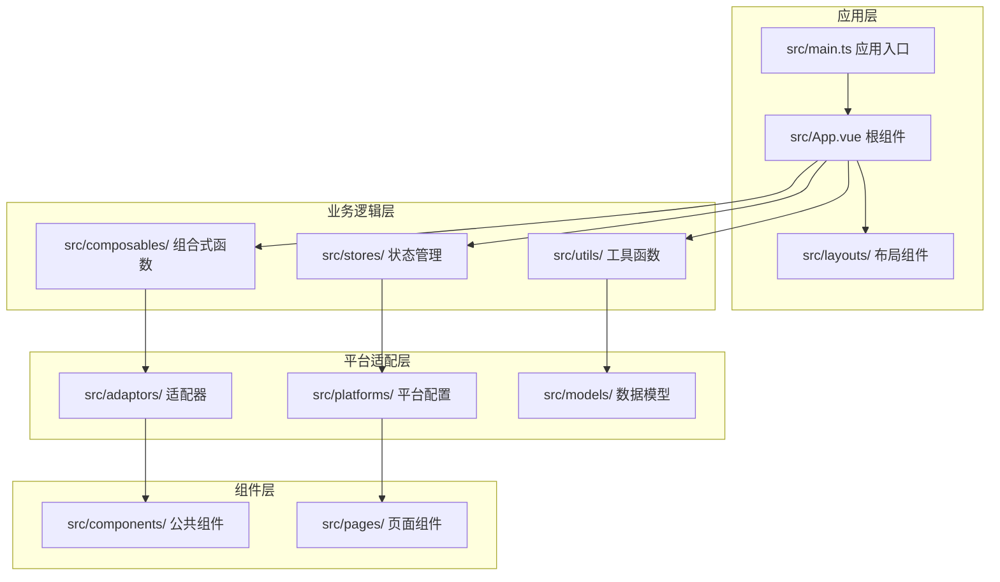
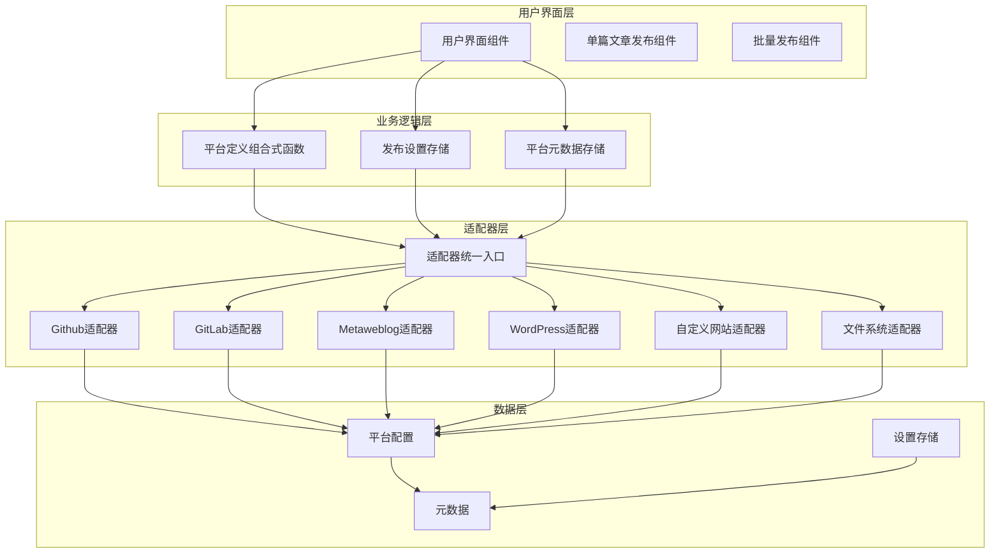
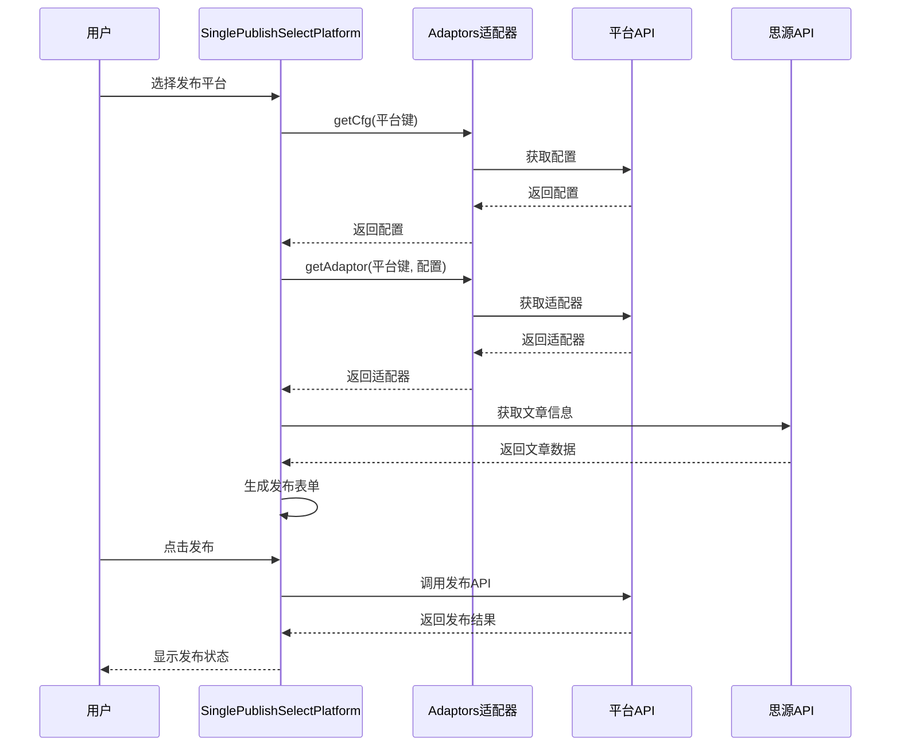
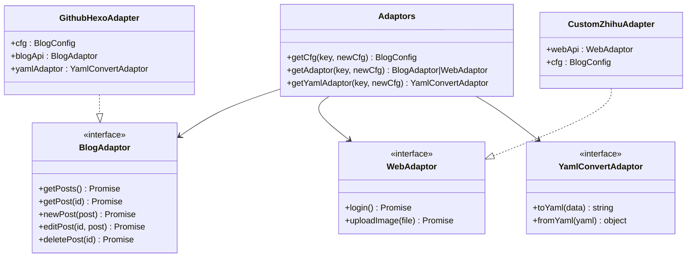

# OPSX实验性工作流

<cite>
**本文档中引用的文件**
- [README_zh_CN.md](file://README_zh_CN.md)
- [package.json](file://package.json)
- [DEVELOPMENT.md](file://DEVELOPMENT.md)
- [src/main.ts](file://src/main.ts)
- [src/bootstrap.ts](file://src/bootstrap.ts)
- [src/adaptors/index.ts](file://src/adaptors/index.ts)
- [src/platforms/pre.ts](file://src/platforms/pre.ts)
- [src/stores/usePlatformMetadataStore.ts](file://src/stores/usePlatformMetadataStore.ts)
- [src/composables/usePlatformDefine.ts](file://src/composables/usePlatformDefine.ts)
- [src/components/publish/SinglePublishSelectPlatform.vue](file://src/components/publish/SinglePublishSelectPlatform.vue)
- [src/pages/SinglePublish.vue](file://src/pages/SinglePublish.vue)
- [src/models/platformMetadata.ts](file://src/models/platformMetadata.ts)
- [src/utils/appLogger.ts](file://src/utils/appLogger.ts)
- [openspec/config.yaml](file://openspec/config.yaml)
</cite>

## 目录
1. [简介](#简介)
2. [项目结构](#项目结构)
3. [核心组件](#核心组件)
4. [架构概览](#架构概览)
5. [详细组件分析](#详细组件分析)
6. [依赖关系分析](#依赖关系分析)
7. [性能考虑](#性能考虑)
8. [故障排除指南](#故障排除指南)
9. [结论](#结论)

## 简介

OPSX实验性工作流是一个基于Vue 3构建的思源笔记发布工具，专门用于将思源笔记的文章发布到多个平台，包括语雀、Notion、WordPress、Typecho、Hexo、Hugo等多种博客平台和内容管理系统。该项目采用现代化的前端技术栈，支持多平台适配器模式，提供了完整的发布流程管理和元数据管理功能。

该工作流的核心目标是简化从思源笔记到各种发布平台的内容迁移过程，通过统一的适配器接口实现对不同平台API的抽象封装，使得添加新的发布平台变得相对简单和标准化。

## 项目结构

项目采用模块化的Vue 3应用架构，主要分为以下几个核心层次：



**图表来源**
- [src/main.ts:1-22](file://src/main.ts#L1-L22)
- [src/bootstrap.ts:1-53](file://src/bootstrap.ts#L1-L53)

**章节来源**
- [src/main.ts:1-22](file://src/main.ts#L1-L22)
- [src/bootstrap.ts:1-53](file://src/bootstrap.ts#L1-L53)

## 核心组件

### 应用启动器
应用通过`src/main.ts`启动，创建Vue应用实例并挂载到DOM元素中。启动过程中初始化国际化、状态管理、路由等核心服务。

### 适配器统一入口
`src/adaptors/index.ts`提供了统一的适配器管理接口，根据平台类型动态选择相应的API适配器。支持超过30种不同的发布平台，包括GitHub/GitLab托管的静态站点生成器、传统博客平台、自定义网站等。

### 平台配置管理
`src/platforms/pre.ts`定义了所有支持的平台配置，包括平台类型、认证方式、图标、域名等元数据信息。系统支持通用平台、GitHub平台、GitLab平台、Metaweblog平台、WordPress平台、自定义平台、文件系统平台等。

### 元数据存储
`src/stores/usePlatformMetadataStore.ts`实现了平台元数据的持久化存储，包括标签、分类、模板等信息的管理，支持去重和合并操作。

**章节来源**
- [src/adaptors/index.ts:1-605](file://src/adaptors/index.ts#L1-L605)
- [src/platforms/pre.ts:1-481](file://src/platforms/pre.ts#L1-L481)
- [src/stores/usePlatformMetadataStore.ts:1-128](file://src/stores/usePlatformMetadataStore.ts#L1-L128)

## 架构概览

项目采用了分层架构设计，通过适配器模式实现平台无关的发布功能：



**图表来源**
- [src/composables/usePlatformDefine.ts:1-83](file://src/composables/usePlatformDefine.ts#L1-L83)
- [src/adaptors/index.ts:58-489](file://src/adaptors/index.ts#L58-L489)

## 详细组件分析

### 单文章发布组件

`src/components/publish/SinglePublishSelectPlatform.vue`是核心的发布选择组件，提供了用户友好的平台选择界面：



**图表来源**
- [src/components/publish/SinglePublishSelectPlatform.vue:62-101](file://src/components/publish/SinglePublishSelectPlatform.vue#L62-L101)
- [src/adaptors/index.ts:67-275](file://src/adaptors/index.ts#L67-L275)

该组件的主要功能包括：
- 动态加载启用的平台配置
- 检查文章是否已发布到各个平台
- 提供一键预览功能
- 导航到具体的发布页面

### 平台适配器系统

适配器系统是整个架构的核心，通过统一的接口抽象不同平台的差异：



**图表来源**
- [src/adaptors/index.ts:58-605](file://src/adaptors/index.ts#L58-L605)

### 平台元数据管理

平台元数据存储系统负责管理每个平台的标签、分类和模板信息：


**图表来源**
- [src/stores/usePlatformMetadataStore.ts:83-122](file://src/stores/usePlatformMetadataStore.ts#L83-L122)

**章节来源**
- [src/components/publish/SinglePublishSelectPlatform.vue:1-272](file://src/components/publish/SinglePublishSelectPlatform.vue#L1-L272)
- [src/adaptors/index.ts:1-605](file://src/adaptors/index.ts#L1-L605)
- [src/stores/usePlatformMetadataStore.ts:1-128](file://src/stores/usePlatformMetadataStore.ts#L1-L128)

## 依赖关系分析

项目使用现代化的前端技术栈，主要依赖包括：

```mermaid
graph LR
subgraph "核心框架"
Vue[Vue 3.5.24]
TS[TypeScript 5.9.3]
Pinia[Pinia 3.0.4]
Router[Vue Router 4.6.3]
end
subgraph "UI组件库"
EP[Element Plus 2.11.8]
Icons[图标库]
end
subgraph "博客API"
ZBA[zhi-blog-api]
ZSI[zhi-siyuan-api]
ZSPM[zhi-siyuan-picgo]
end
subgraph "工具库"
Lodash[lodash-es 4.17.23]
Crypto[crypto-js 4.2.0]
UUID[uuid 13.0.0]
Fetch[cross-fetch 3.1.8]
end
subgraph "构建工具"
Vite[Vite 7.2.2]
ESLint[@terwer/eslint-config-custom]
Vitest[Vitest 4.0.9]
end
Vue --> EP
Vue --> Pinia
Vue --> Router
ZBA --> ZSI
ZBA --> ZSPM
Vite --> ESLint
Vite --> Vitest
```

**图表来源**
- [package.json:32-68](file://package.json#L32-L68)
- [package.json:70-99](file://package.json#L70-L99)

**章节来源**
- [package.json:1-102](file://package.json#L1-L102)

## 性能考虑

项目在性能优化方面采用了多项策略：

1. **按需加载**: Element Plus组件库采用按需引入，减少初始包体积
2. **懒加载**: 平台适配器采用动态导入，避免一次性加载所有适配器
3. **缓存机制**: 平台元数据和配置信息使用本地存储缓存
4. **虚拟滚动**: 大列表渲染使用虚拟滚动优化
5. **代码分割**: 通过Vite实现代码分割和懒加载

## 故障排除指南

### 常见问题及解决方案

1. **平台认证失败**
   - 检查平台配置中的API密钥或访问令牌
   - 确认网络连接正常
   - 查看日志获取详细错误信息

2. **发布失败**
   - 验证文章内容格式
   - 检查目标平台的限制条件
   - 确认有足够的权限

3. **适配器加载问题**
   - 确认平台键正确无误
   - 检查网络连接
   - 重新启动应用

**章节来源**
- [src/utils/appLogger.ts:1-47](file://src/utils/appLogger.ts#L1-L47)

## 结论

OPSX实验性工作流是一个功能完整、架构清晰的多平台发布工具。通过模块化的组件设计和适配器模式，系统能够灵活地支持各种发布平台，同时保持良好的可维护性和扩展性。

项目的主要优势包括：
- 完善的平台适配器系统
- 丰富的平台支持
- 用户友好的界面设计
- 强大的元数据管理功能
- 现代化的技术栈

未来的发展方向可以包括：
- 添加更多平台支持
- 优化性能表现
- 增强自动化功能
- 改进用户体验