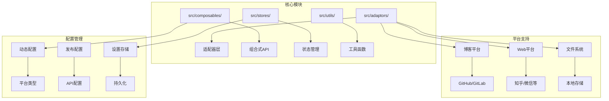
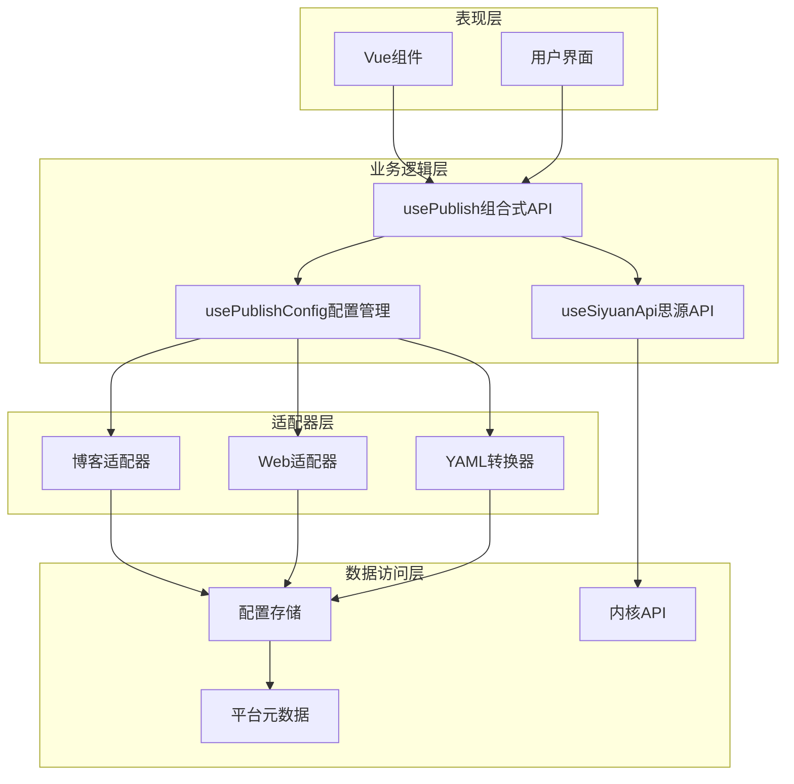
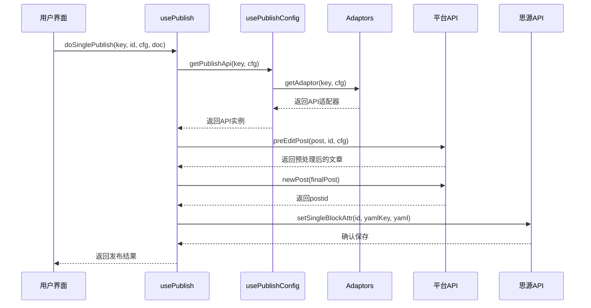
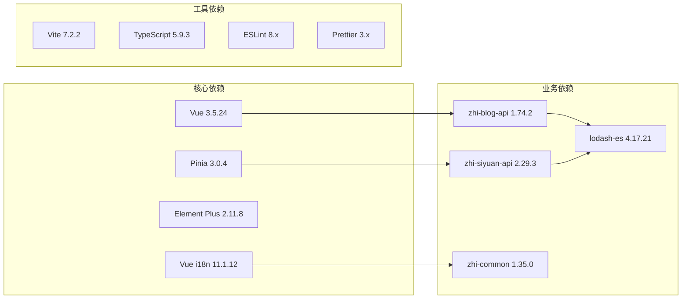
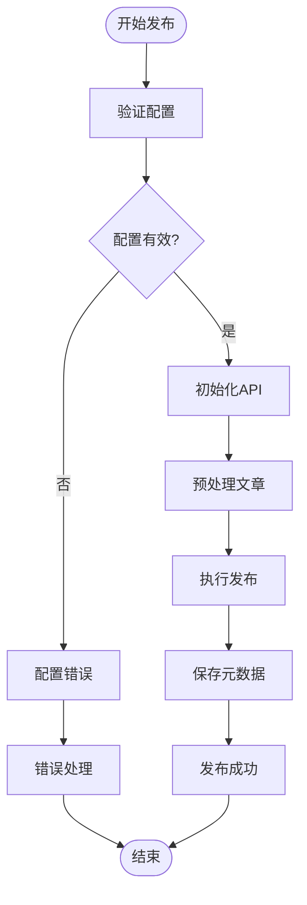

# API参考文档

<cite>
**本文档引用的文件**
- [src/adaptors/index.ts](file://src/adaptors/index.ts)
- [src/composables/usePublish.ts](file://src/composables/usePublish.ts)
- [src/composables/usePublishConfig.ts](file://src/composables/usePublishConfig.ts)
- [siyuan/api/kernel-api.ts](file://siyuan/api/kernel-api.ts)
- [src/types/IPublishCfg.ts](file://src/types/IPublishCfg.ts)
- [src/composables/useSiyuanApi.ts](file://src/composables/useSiyuanApi.ts)
- [src/platforms/dynamicConfig.ts](file://src/platforms/dynamicConfig.ts)
- [src/stores/usePublishSettingStore.ts](file://src/stores/usePublishSettingStore.ts)
- [src/utils/BaseErrors.ts](file://src/utils/BaseErrors.ts)
- [src/adaptors/api/hexo/useHexoApi.ts](file://src/adaptors/api/hexo/useHexoApi.ts)
- [src/adaptors/web/zhihu/useZhihuWeb.ts](file://src/adaptors/web/zhihu/useZhihuWeb.ts)
- [src/stores/usePlatformMetadataStore.ts](file://src/stores/usePlatformMetadataStore.ts)
- [src/utils/constants.ts](file://src/utils/constants.ts)
- [package.json](file://package.json)
</cite>

## 目录
1. [简介](#简介)
2. [项目结构](#项目结构)
3. [核心组件](#核心组件)
4. [架构概览](#架构概览)
5. [详细组件分析](#详细组件分析)
6. [依赖分析](#依赖分析)
7. [性能考虑](#性能考虑)
8. [故障排除指南](#故障排除指南)
9. [结论](#结论)
10. [附录](#附录)

## 简介

SiYuan插件发布器是一个功能强大的内容发布平台，允许用户将思源笔记内容发布到多个目标平台，包括语雀、Notion、CSDN、WordPress、Typecho、Hexo、知乎等。该项目采用模块化架构设计，提供了完整的API参考文档，涵盖发布API、配置API、平台API、工具API等多个方面。

## 项目结构

项目采用基于功能的模块化组织方式，主要分为以下几个核心部分：

**图表来源**
- [src/adaptors/index.ts:50-573](file://src/adaptors/index.ts#L50-L573)
- [src/composables/usePublish.ts:44-560](file://src/composables/usePublish.ts#L44-L560)
- [src/platforms/dynamicConfig.ts:13-534](file://src/platforms/dynamicConfig.ts#L13-L534)

**章节来源**
- [src/adaptors/index.ts:1-573](file://src/adaptors/index.ts#L1-L573)
- [src/composables/usePublish.ts:1-560](file://src/composables/usePublish.ts#L1-L560)
- [src/platforms/dynamicConfig.ts:1-534](file://src/platforms/dynamicConfig.ts#L1-L534)

## 核心组件

### 发布适配器系统

发布适配器系统是整个项目的核心，负责统一管理各种平台的API接口。该系统支持20多种不同的发布平台，包括：

- **博客平台**: Yuque、Notion、Halo、Telegraph、Confluence
- **GitHub平台**: Hexo、Hugo、Jekyll、Vuepress、Vitepress、Astro
- **GitLab平台**: 各种静态站点生成器的GitLab分支版本
- **Web平台**: 知乎、CSDN、微信公众号、简书、掘金等
- **文件系统**: 本地系统、FTP、SFTP等

每个适配器都实现了统一的接口规范，确保不同平台之间的兼容性。

**章节来源**
- [src/adaptors/index.ts:56-573](file://src/adaptors/index.ts#L56-L573)
- [src/platforms/dynamicConfig.ts:174-238](file://src/platforms/dynamicConfig.ts#L174-L238)

### 发布配置管理

发布配置管理系统提供了灵活的配置机制，支持动态平台配置和运行时配置更新。配置系统包含以下核心组件：

- **IPublishCfg接口**: 定义了发布配置的标准结构
- **动态配置**: 支持运行时添加、删除和修改平台配置
- **配置存储**: 提供持久化的配置管理能力

**章节来源**
- [src/types/IPublishCfg.ts:21-47](file://src/types/IPublishCfg.ts#L21-L47)
- [src/composables/usePublishConfig.ts:36-95](file://src/composables/usePublishConfig.ts#L36-L95)

## 架构概览

项目采用分层架构设计，确保各层之间的职责清晰分离：

**图表来源**
- [src/composables/usePublish.ts:44-560](file://src/composables/usePublish.ts#L44-L560)
- [src/composables/usePublishConfig.ts:26-95](file://src/composables/usePublishConfig.ts#L26-L95)
- [src/composables/useSiyuanApi.ts:20-76](file://src/composables/useSiyuanApi.ts#L20-L76)

## 详细组件分析

### 发布API组件

#### usePublish组合式API

`usePublish`是项目的核心发布组件，提供了统一的发布流程管理：

**主要功能**:
- 单篇文章发布和更新
- 文章删除和强制删除
- 发布前的数据预处理
- 预览链接生成
- 错误处理和状态管理

**核心方法**:
- `doSinglePublish()`: 执行单篇文章发布
- `doSingleDelete()`: 删除已发布文章
- `doForceSingleDelete()`: 强制删除发布信息
- `initPublishMethods`: 发布初始化方法集合

**图表来源**
- [src/composables/usePublish.ts:70-212](file://src/composables/usePublish.ts#L70-L212)
- [src/composables/usePublishConfig.ts:73-78](file://src/composables/usePublishConfig.ts#L73-L78)

**章节来源**
- [src/composables/usePublish.ts:44-560](file://src/composables/usePublish.ts#L44-L560)

#### 发布配置API

`usePublishConfig`提供了发布配置的统一管理接口：

**核心功能**:
- 获取平台发布配置
- 初始化平台API适配器
- 管理配置缓存和持久化

**主要方法**:
- `getPublishCfg()`: 获取发布配置
- `getPublishApi()`: 获取API实例

**章节来源**
- [src/composables/usePublishConfig.ts:26-95](file://src/composables/usePublishConfig.ts#L26-L95)

### 平台API组件

#### 博客平台API

项目支持多种博客平台的API集成：

**GitHub平台示例** (`useHexoApi`):
- 支持Hexo静态站点生成器
- 配置GitHub仓库连接
- 支持中间件代理
- YAML格式转换

**配置特性**:
- 标签支持
- 分类管理
- 知识空间支持
- 图床服务集成

**章节来源**
- [src/adaptors/api/hexo/useHexoApi.ts:22-102](file://src/adaptors/api/hexo/useHexoApi.ts#L22-L102)

#### Web平台API

Web平台API专门处理基于浏览器的发布平台：

**知乎平台示例** (`useZhihuWeb`):
- 支持Cookie认证
- 中间件代理支持
- 专栏管理
- 图床服务

**认证机制**:
- Cookie认证
- 退出登录支持
- 权限管理

**章节来源**
- [src/adaptors/web/zhihu/useZhihuWeb.ts:25-92](file://src/adaptors/web/zhihu/useZhihuWeb.ts#L25-L92)

### 工具API组件

#### 思源API组件

`useSiyuanApi`提供了思源笔记的统一API访问接口：

**核心功能**:
- 思源博客API访问
- 内核API调用
- 配置管理
- 设备检测

**配置选项**:
- API URL设置
- 认证令牌管理
- Cookie支持
- 偏好设置

**章节来源**
- [src/composables/useSiyuanApi.ts:20-76](file://src/composables/useSiyuanApi.ts#L20-L76)

#### 平台元数据管理

`usePlatformMetadataStore`负责管理各平台的元数据信息：

**功能特性**:
- 标签和分类的自动收集
- 模板信息管理
- 去重和合并机制
- 持久化存储

**数据结构**:
- `PlatformMetadata`: 平台元数据容器
- `MetadataItem`: 单个平台的元数据项

**章节来源**
- [src/stores/usePlatformMetadataStore.ts:21-128](file://src/stores/usePlatformMetadataStore.ts#L21-L128)

### 配置API组件

#### 动态配置管理

动态配置系统提供了灵活的平台配置管理能力：

**配置类型**:
- `DynamicConfig`: 动态配置类
- `DynamicJsonCfg`: JSON配置封装
- `PlatformType`: 平台类型枚举
- `SubPlatformType`: 子平台类型枚举

**核心功能**:
- 平台类型识别
- 配置验证
- 动态平台管理
- 配置转换

**章节来源**
- [src/platforms/dynamicConfig.ts:13-534](file://src/platforms/dynamicConfig.ts#L13-L534)

#### 设置存储API

设置存储系统提供了配置的持久化管理：

**功能特性**:
- Pinia状态管理集成
- 异步存储操作
- 缓存机制
- 数据迁移支持

**存储位置**:
- `/data/storage/syp/sy-p-plus-cfg.json`

**章节来源**
- [src/stores/usePublishSettingStore.ts:21-95](file://src/stores/usePublishSettingStore.ts#L21-L95)

## 依赖分析

项目使用了现代化的前端技术栈，主要依赖包括：

**图表来源**
- [package.json:59-96](file://package.json#L59-L96)

**章节来源**
- [package.json:1-99](file://package.json#L1-L99)

## 性能考虑

项目在设计时充分考虑了性能优化：

### 缓存策略
- 配置缓存：避免重复的配置加载
- API实例缓存：复用已创建的API实例
- 元数据缓存：减少重复的平台查询

### 异步处理
- 异步配置加载
- 并发API调用
- 流水线处理

### 内存管理
- 对象克隆避免副作用
- 及时清理临时数据
- 合理的垃圾回收

## 故障排除指南

### 常见错误处理

项目定义了基础错误类型和处理策略：

**错误类型**:
- `NO_PAGE_ID_FOUND_IN_MEDIA_MACRO_MODE`: 媒体宏模式下未找到pageId

**错误处理机制**:
- 统一的错误捕获和处理
- 用户友好的错误消息
- 日志记录和调试支持

**章节来源**
- [src/utils/BaseErrors.ts:13-21](file://src/utils/BaseErrors.ts#L13-L21)

### 发布流程错误处理

发布流程包含完善的错误处理机制：

**图表来源**
- [src/composables/usePublish.ts:78-204](file://src/composables/usePublish.ts#L78-L204)

### 调试和日志

项目提供了完整的调试和日志支持：

- 应用程序日志记录
- API调用跟踪
- 错误堆栈追踪
- 性能监控

**章节来源**
- [src/composables/usePublish.ts:45-46](file://src/composables/usePublish.ts#L45-L46)

## 结论

SiYuan插件发布器项目提供了一个功能完整、架构清晰的发布平台解决方案。通过模块化的组件设计和统一的API接口，项目能够支持多种发布平台，同时保持良好的可扩展性和维护性。

项目的主要优势包括：
- 完善的平台支持和适配器系统
- 灵活的配置管理和动态平台支持
- 统一的API接口和错误处理机制
- 现代化的技术栈和开发体验

## 附录

### 版本兼容性和废弃策略

项目遵循语义化版本控制，提供明确的版本兼容性说明：

**版本策略**:
- 主版本号：重大功能更新
- 次版本号：新功能添加
- 修订版本号：bug修复和小改进

**废弃策略**:
- 重要变更提前通知
- 提供迁移指南
- 保持向后兼容性

**当前版本**: 1.41.1

**章节来源**
- [package.json:3-3](file://package.json#L3-L3)

### 实际使用示例

项目提供了完整的使用示例和集成指南：

1. **基本发布流程**:
   - 配置平台参数
   - 初始化发布API
   - 执行文章发布
   - 处理发布结果

2. **高级功能**:
   - 自定义YAML格式
   - 图床服务集成
   - 批量发布支持
   - 元数据管理

3. **错误处理**:
   - 配置验证
   - API调用错误
   - 网络连接问题
   - 权限验证失败