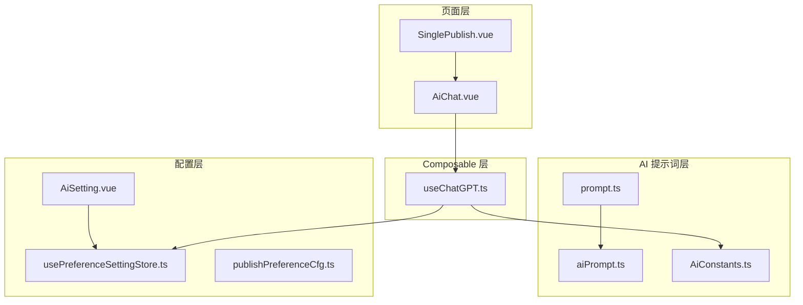
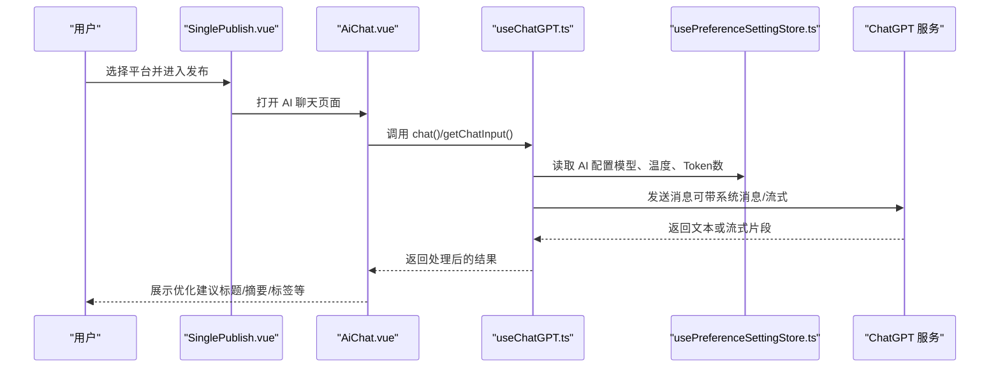
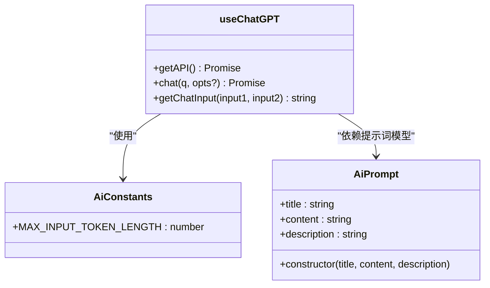
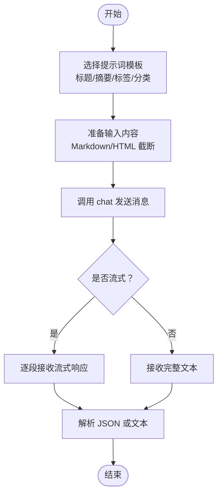
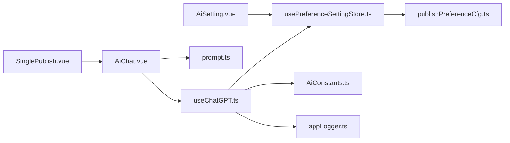

# AI辅助Composables

<cite>
**本文引用的文件**
- [useChatGPT.ts](file://src/composables/useChatGPT.ts)
- [AiConstants.ts](file://src/ai/AiConstants.ts)
- [prompt.ts](file://src/ai/prompt.ts)
- [aiPrompt.ts](file://src/models/aiPrompt.ts)
- [AiChat.vue](file://src/pages/AiChat.vue)
- [AiSetting.vue](file://src/components/set/preference/AiSetting.vue)
- [usePreferenceSettingStore.ts](file://src/stores/usePreferenceSettingStore.ts)
- [publishPreferenceCfg.ts](file://src/models/publishPreferenceCfg.ts)
- [SinglePublish.vue](file://src/pages/SinglePublish.vue)
</cite>

## 目录
1. [简介](#简介)
2. [项目结构](#项目结构)
3. [核心组件](#核心组件)
4. [架构总览](#架构总览)
5. [详细组件分析](#详细组件分析)
6. [依赖关系分析](#依赖关系分析)
7. [性能考虑](#性能考虑)
8. [故障排查指南](#故障排查指南)
9. [结论](#结论)
10. [附录](#附录)

## 简介
本文件面向“AI辅助Composables”的开发者与使用者，系统化梳理并记录 useChatGPT Composable 的完整接口与能力边界，涵盖 ChatGPT 集成、内容优化、智能摘要、内容改写等 AI 功能；同时覆盖 API 调用封装、消息管理、流式响应处理、配置管理、成本控制与错误处理等高级特性。文档还提供在发布流程中集成 AI 功能的具体示例，展示如何使用 AI 优化文章内容、生成标题、提取标签等场景。

## 项目结构
围绕 AI 辅助能力，本仓库的关键目录与文件如下：
- composable 层：useChatGPT.ts 提供与 ChatGPT 的交互封装
- AI 提示词层：prompt.ts 定义标题、摘要、标签、分类等提示词模板
- 模型层：aiPrompt.ts 定义提示词数据模型
- 常量层：AiConstants.ts 定义最大输入长度等常量
- 配置层：AiSetting.vue、usePreferenceSettingStore.ts、publishPreferenceCfg.ts 提供 AI 配置项与持久化
- 页面层：AiChat.vue 提供 AI 聊天界面与上下文注入
- 发布页面：SinglePublish.vue 作为发布入口，可结合 AI 能力进行内容优化

图表来源
- [useChatGPT.ts:1-130](file://src/composables/useChatGPT.ts#L1-L130)
- [prompt.ts:1-109](file://src/ai/prompt.ts#L1-L109)
- [aiPrompt.ts:1-48](file://src/models/aiPrompt.ts#L1-L48)
- [AiConstants.ts:1-26](file://src/ai/AiConstants.ts#L1-L26)
- [AiSetting.vue:1-121](file://src/components/set/preference/AiSetting.vue#L1-L121)
- [usePreferenceSettingStore.ts:1-90](file://src/stores/usePreferenceSettingStore.ts#L1-L90)
- [publishPreferenceCfg.ts:1-101](file://src/models/publishPreferenceCfg.ts#L1-L101)
- [AiChat.vue:1-327](file://src/pages/AiChat.vue#L1-L327)
- [SinglePublish.vue:1-22](file://src/pages/SinglePublish.vue#L1-L22)

章节来源
- [useChatGPT.ts:1-130](file://src/composables/useChatGPT.ts#L1-L130)
- [prompt.ts:1-109](file://src/ai/prompt.ts#L1-L109)
- [aiPrompt.ts:1-48](file://src/models/aiPrompt.ts#L1-L48)
- [AiConstants.ts:1-26](file://src/ai/AiConstants.ts#L1-L26)
- [AiSetting.vue:1-121](file://src/components/set/preference/AiSetting.vue#L1-L121)
- [usePreferenceSettingStore.ts:1-90](file://src/stores/usePreferenceSettingStore.ts#L1-L90)
- [publishPreferenceCfg.ts:1-101](file://src/models/publishPreferenceCfg.ts#L1-L101)
- [AiChat.vue:1-327](file://src/pages/AiChat.vue#L1-L327)
- [SinglePublish.vue:1-22](file://src/pages/SinglePublish.vue#L1-L22)

## 核心组件
- useChatGPT：提供 ChatGPT 客户端初始化、消息发送、上下文输入构建与日志记录
- prompt 与 aiPrompt：提供标题、摘要、标签、分类等提示词模板与模型
- AiSetting 与配置存储：提供 AI 相关参数的可视化配置与持久化
- AiChat 页面：提供 AI 聊天界面、上下文注入与提示词管理
- 发布流程集成：通过 SinglePublish.vue 入口，结合 AI 能力进行内容优化

章节来源
- [useChatGPT.ts:18-127](file://src/composables/useChatGPT.ts#L18-L127)
- [prompt.ts:16-108](file://src/ai/prompt.ts#L16-L108)
- [aiPrompt.ts:17-44](file://src/models/aiPrompt.ts#L17-L44)
- [AiSetting.vue:20-98](file://src/components/set/preference/AiSetting.vue#L20-L98)
- [usePreferenceSettingStore.ts:21-86](file://src/stores/usePreferenceSettingStore.ts#L21-L86)
- [publishPreferenceCfg.ts:19-97](file://src/models/publishPreferenceCfg.ts#L19-L97)
- [AiChat.vue:128-304](file://src/pages/AiChat.vue#L128-L304)
- [SinglePublish.vue:10-21](file://src/pages/SinglePublish.vue#L10-L21)

## 架构总览
下图展示了 AI 辅助在发布流程中的整体交互路径：用户在发布页面选择平台后，进入内容编辑与优化阶段；AI 能力通过 useChatGPT 注入标题、摘要、标签等建议，并支持流式响应与上下文增强。

图表来源
- [SinglePublish.vue:10-21](file://src/pages/SinglePublish.vue#L10-L21)
- [AiChat.vue:252-286](file://src/pages/AiChat.vue#L252-L286)
- [useChatGPT.ts:33-67](file://src/composables/useChatGPT.ts#L33-L67)
- [useChatGPT.ts:81-109](file://src/composables/useChatGPT.ts#L81-L109)
- [usePreferenceSettingStore.ts:34-66](file://src/stores/usePreferenceSettingStore.ts#L34-L66)

## 详细组件分析

### useChatGPT Composable 接口详解
- 目标与职责
  - 封装 ChatGPT 官方或反向代理客户端初始化
  - 统一消息发送逻辑，支持流式与非流式响应
  - 提供上下文输入构建方法，确保输入长度与格式符合预期
  - 记录调试日志并进行错误处理

- 关键函数与行为
  - getAPI：按需懒加载并初始化 ChatGPT 客户端
    - 若配置了代理地址则使用反向代理实例
    - 否则使用官方实例
    - 支持环境变量与偏好设置回退
  - chat：发送消息至 ChatGPT
    - 合并全局与调用时的 completionParams
    - 当 opts.stream 为真时返回流对象，否则返回纯文本
    - 对异常进行日志记录并通过 UI 提示
  - getChatInput：构建聊天输入
    - 截断 Markdown 输入至最大长度
    - 将 HTML 转换为安全文本并截断
    - 优先返回 Markdown，其次返回 HTML

- 参数与返回值
  - chat(q, opts?)
    - q: string，用户输入
    - opts: SendMessageOptions（可选），支持 completionParams、stream 等
    - 返回: Promise<string | any>，非流式返回字符串，流式返回流对象
  - getChatInput(input1, input2)
    - input1: string，Markdown 内容
    - input2: string，HTML 内容
    - 返回: string，经截断与转换后的输入

- 错误处理与日志
  - 初始化失败与调用异常均记录日志并提示用户
  - 开发模式下启用调试开关

- 流式响应处理
  - 通过 opts.stream 控制是否以流式方式接收响应
  - 流式场景适合实时渲染与长文本生成

- 成本控制要点
  - 通过 experimentalAIApiMaxTokens 限制单次最大 Token 数
  - 通过 AiConstants.MAX_INPUT_TOKEN_LENGTH 控制输入上限
  - 通过 temperature 控制创造性与稳定性平衡

章节来源
- [useChatGPT.ts:18-127](file://src/composables/useChatGPT.ts#L18-L127)
- [AiConstants.ts:18-23](file://src/ai/AiConstants.ts#L18-L23)

#### 类图：useChatGPT 与相关类型

图表来源
- [useChatGPT.ts:18-127](file://src/composables/useChatGPT.ts#L18-L127)
- [AiConstants.ts:18-23](file://src/ai/AiConstants.ts#L18-L23)
- [aiPrompt.ts:17-44](file://src/models/aiPrompt.ts#L17-L44)

### AI 提示词与模板
- 标题提取：从文章内容生成简洁且完整的标题，返回 JSON 结构
- 摘要提取：生成简明摘要，支持 JSON 与流式文本两种输出
- 标签提取：生成中文标签，限制数量与字符长度，返回 JSON 数组
- 分类提取：对内容进行分类，返回 JSON 数组

- 类型与模型
  - AiPrompt：封装标题、内容、描述三要素
  - prompt.ts：导出标题、摘要、标签、分类等提示词集合

章节来源
- [prompt.ts:16-108](file://src/ai/prompt.ts#L16-L108)
- [aiPrompt.ts:17-44](file://src/models/aiPrompt.ts#L17-L44)

#### 流程图：AI 提示词处理流程

图表来源
- [prompt.ts:16-108](file://src/ai/prompt.ts#L16-L108)
- [useChatGPT.ts:81-109](file://src/composables/useChatGPT.ts#L81-L109)
- [useChatGPT.ts:117-121](file://src/composables/useChatGPT.ts#L117-L121)

### 配置管理与成本控制
- 配置项
  - experimentalAICode：API 密钥
  - experimentalAIBaseUrl：API 基础地址
  - experimentalAIProxyUrl：代理地址
  - experimentalAIApiModel：模型名称
  - experimentalAIApiMaxTokens：最大 Token 数
  - experimentalAIApiTemperature：温度
  - experimentalUseSiyuanNoteAIConfig：是否使用思源笔记内置 AI 配置

- 配置来源
  - 本地持久化：usePreferenceSettingStore.ts 通过本地存储维护配置
  - 思源笔记集成：若检测到思源笔记 AI 配置，优先使用其值
  - 可视化界面：AiSetting.vue 提供表单控件与滑块

- 成本控制策略
  - 限制输入长度（AiConstants.MAX_INPUT_TOKEN_LENGTH）
  - 限制单次输出长度（experimentalAIApiMaxTokens）
  - 通过 temperature 控制生成多样性，间接影响 Token 消耗

章节来源
- [AiSetting.vue:20-98](file://src/components/set/preference/AiSetting.vue#L20-L98)
- [usePreferenceSettingStore.ts:34-66](file://src/stores/usePreferenceSettingStore.ts#L34-L66)
- [publishPreferenceCfg.ts:19-97](file://src/models/publishPreferenceCfg.ts#L19-L97)
- [AiConstants.ts:18-23](file://src/ai/AiConstants.ts#L18-L23)

### 在发布流程中集成 AI 功能
- 场景一：使用 AI 优化文章内容
  - 在 SinglePublish.vue 中进入发布流程
  - 打开 AiChat.vue，选择合适的提示词模板
  - 使用 getChatInput 构建上下文，调用 chat 获取优化建议
  - 将返回的标题、摘要、标签等应用到发布表单

- 场景二：智能摘要与内容改写
  - 选择摘要提示词，开启流式响应以提升交互体验
  - 将生成的摘要作为文章摘要字段
  - 对原文进行改写以提升可读性与一致性

- 场景三：标签与分类提取
  - 使用标签与分类提示词，确保标签与分类符合规范
  - 将 JSON 结果映射到发布表单的标签与分类字段

章节来源
- [SinglePublish.vue:10-21](file://src/pages/SinglePublish.vue#L10-L21)
- [AiChat.vue:252-286](file://src/pages/AiChat.vue#L252-L286)
- [useChatGPT.ts:81-109](file://src/composables/useChatGPT.ts#L81-L109)
- [prompt.ts:16-108](file://src/ai/prompt.ts#L16-L108)

## 依赖关系分析
- useChatGPT 依赖
  - usePreferenceSettingStore：读取 AI 配置
  - AiConstants：输入长度限制
  - HtmlUtil/StrUtil：输入截断与安全处理
  - Logger：调试与错误日志
- 页面层依赖
  - AiChat.vue 依赖 useChatGPT 与提示词模板
  - SinglePublish.vue 作为入口，串联发布与 AI 优化流程
- 配置层依赖
  - AiSetting.vue 与 usePreferenceSettingStore、publishPreferenceCfg 共同维护 AI 配置

图表来源
- [useChatGPT.ts:10-16](file://src/composables/useChatGPT.ts#L10-L16)
- [usePreferenceSettingStore.ts:21-86](file://src/stores/usePreferenceSettingStore.ts#L21-L86)
- [AiConstants.ts:18-23](file://src/ai/AiConstants.ts#L18-L23)
- [AiChat.vue:128-140](file://src/pages/AiChat.vue#L128-L140)
- [AiSetting.vue:10-17](file://src/components/set/preference/AiSetting.vue#L10-L17)
- [publishPreferenceCfg.ts:19-97](file://src/models/publishPreferenceCfg.ts#L19-L97)
- [SinglePublish.vue:10-21](file://src/pages/SinglePublish.vue#L10-L21)

## 性能考虑
- 按需初始化：getAPI 仅在首次调用时创建客户端，避免重复初始化开销
- 输入截断：通过 AiConstants.MAX_INPUT_TOKEN_LENGTH 与 getChatInput 截断输入，降低 Token 消耗
- 流式响应：在长文本生成场景使用流式响应，减少等待时间并提升用户体验
- 配置缓存：偏好设置通过本地存储持久化，减少重复读取

## 故障排查指南
- 初始化失败
  - 现象：无法创建 ChatGPT 客户端
  - 排查：检查 experimentalAICode、experimentalAIBaseUrl 或 experimentalAIProxyUrl 是否正确
  - 日志：查看初始化日志定位具体错误
- 请求无响应或空文本
  - 现象：chat 返回空字符串
  - 排查：确认密钥与代理配置、网络连通性、模型可用性
  - 建议：开启调试日志并重试
- Token 超限
  - 现象：请求被拒绝或响应异常
  - 排查：降低 experimentalAIApiMaxTokens 或缩短输入内容
- 上下文不生效
  - 现象：未使用当前文档作为上下文
  - 排查：确认 AiChat.vue 中 usePage 开关与提示词是否包含“当前上下文”关键字

章节来源
- [useChatGPT.ts:33-67](file://src/composables/useChatGPT.ts#L33-L67)
- [useChatGPT.ts:81-109](file://src/composables/useChatGPT.ts#L81-L109)
- [AiChat.vue:252-286](file://src/pages/AiChat.vue#L252-L286)

## 结论
useChatGPT Composable 为 AI 集成提供了简洁而强大的接口，配合完善的配置管理与提示词模板，可在发布流程中高效完成内容优化、智能摘要、标题与标签生成等任务。通过流式响应与成本控制策略，既能保证交互体验，又能有效控制资源消耗。建议在实际使用中结合业务场景合理设置模型参数与输入长度，并通过日志与错误提示快速定位问题。

## 附录
- 快速上手步骤
  - 在 AiSetting.vue 中配置 API Key、基础地址、代理地址与模型
  - 在 AiChat.vue 中选择提示词模板，必要时开启“使用当前文档作为上下文”
  - 调用 chat 获取优化建议，将结果应用到发布表单
- 常见提示词模板
  - 标题：从文章内容生成简洁标题
  - 摘要：生成简明摘要（支持 JSON 与流式文本）
  - 标签：生成中文标签，限制数量与字符长度
  - 分类：对内容进行分类，返回规范化分类名称