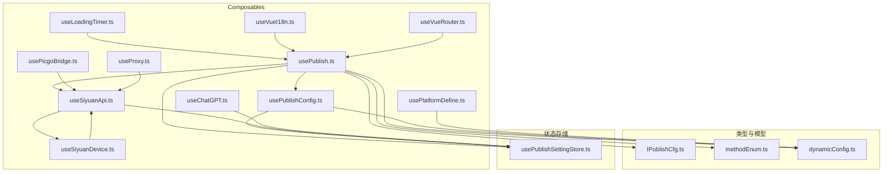
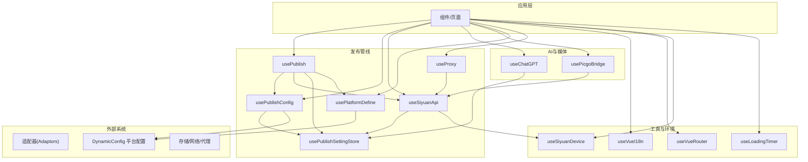
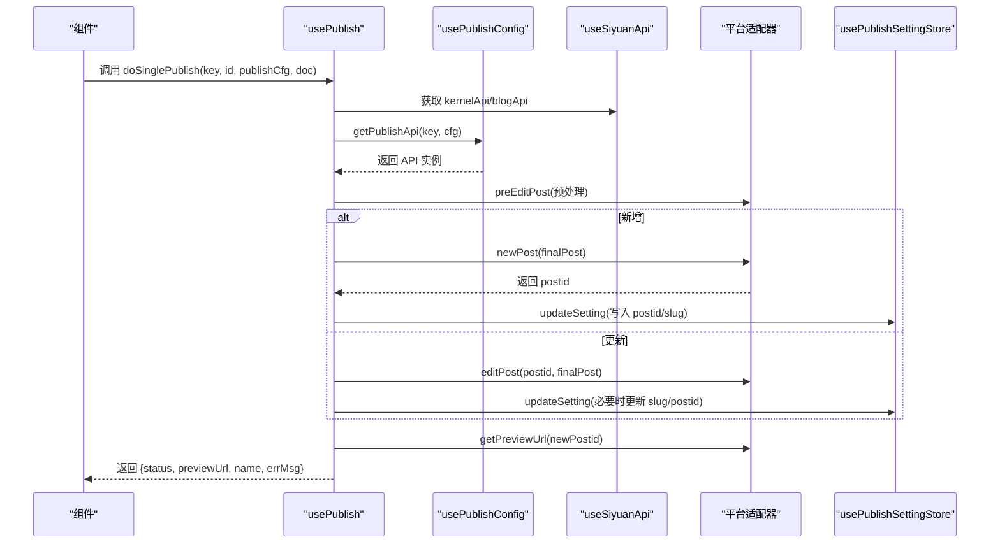
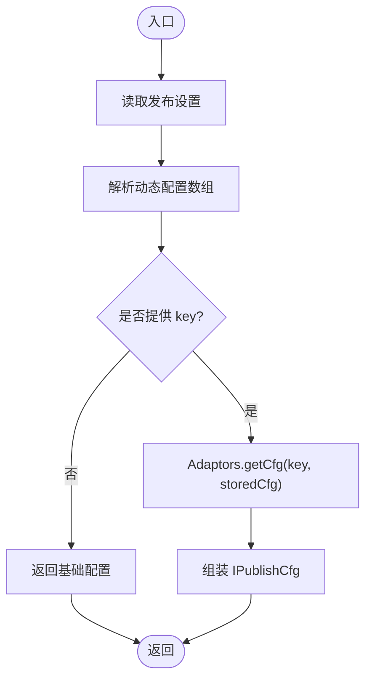
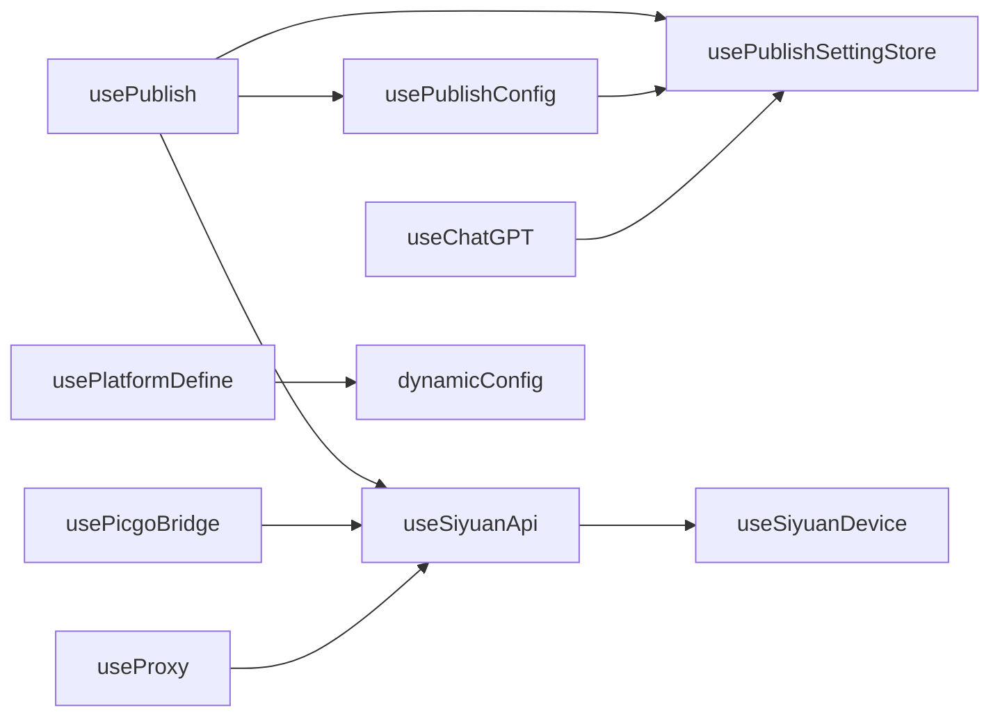

# Composables API

<cite>
**本文引用的文件**
- [usePublish.ts](file://src/composables/usePublish.ts)
- [usePublishConfig.ts](file://src/composables/usePublishConfig.ts)
- [useSiyuanApi.ts](file://src/composables/useSiyuanApi.ts)
- [useChatGPT.ts](file://src/composables/useChatGPT.ts)
- [usePicgoBridge.ts](file://src/composables/usePicgoBridge.ts)
- [usePlatformDefine.ts](file://src/composables/usePlatformDefine.ts)
- [useProxy.ts](file://src/composables/useProxy.ts)
- [useLoadingTimer.ts](file://src/composables/useLoadingTimer.ts)
- [useVueI18n.ts](file://src/composables/useVueI18n.ts)
- [useVueRouter.ts](file://src/composables/useVueRouter.ts)
- [useSiyuanDevice.ts](file://src/composables/useSiyuanDevice.ts)
- [IPublishCfg.ts](file://src/types/IPublishCfg.ts)
- [methodEnum.ts](file://src/models/methodEnum.ts)
- [dynamicConfig.ts](file://src/platforms/dynamicConfig.ts)
- [usePublishSettingStore.ts](file://src/stores/usePublishSettingStore.ts)
</cite>

## 目录
1. [简介](#简介)
2. [项目结构](#项目结构)
3. [核心组件](#核心组件)
4. [架构总览](#架构总览)
5. [详细组件分析](#详细组件分析)
6. [依赖分析](#依赖分析)
7. [性能考量](#性能考量)
8. [故障排查指南](#故障排查指南)
9. [结论](#结论)
10. [附录](#附录)

## 简介
本文件系统性梳理本项目中的 Vue 3 Composables API，覆盖发布相关 Composables、配置管理 Composables、思源 API Composables、AI 相关 Composables、平台与路由设备检测等。对每个 Composable 提供函数签名、参数说明、返回值类型、使用要点、响应式状态与副作用、组件内使用模式、最佳实践与性能建议，并阐明 Composable 间的依赖与组合使用方式。

## 项目结构
- Composables 位于 src/composables，按功能域划分：发布、配置、思源 API、AI、图片桥接、平台定义、代理、计时器、国际化、路由、设备检测等。
- 类型与模型位于 src/types 与 src/models，平台动态配置位于 src/platforms。
- 状态存储位于 src/stores，如发布设置存储。

图表来源
- [usePublish.ts:1-560](file://src/composables/usePublish.ts#L1-L560)
- [usePublishConfig.ts:1-99](file://src/composables/usePublishConfig.ts#L1-L99)
- [useSiyuanApi.ts:1-76](file://src/composables/useSiyuanApi.ts#L1-L76)
- [useChatGPT.ts:1-130](file://src/composables/useChatGPT.ts#L1-L130)
- [usePicgoBridge.ts:1-153](file://src/composables/usePicgoBridge.ts#L1-L153)
- [usePlatformDefine.ts:1-83](file://src/composables/usePlatformDefine.ts#L1-L83)
- [useProxy.ts:1-321](file://src/composables/useProxy.ts#L1-L321)
- [useLoadingTimer.ts:1-56](file://src/composables/useLoadingTimer.ts#L1-L56)
- [useVueI18n.ts:1-26](file://src/composables/useVueI18n.ts#L1-L26)
- [useVueRouter.ts:1-19](file://src/composables/useVueRouter.ts#L1-L19)
- [useSiyuanDevice.ts:1-83](file://src/composables/useSiyuanDevice.ts#L1-L83)
- [IPublishCfg.ts:1-50](file://src/types/IPublishCfg.ts#L1-L50)
- [methodEnum.ts:1-24](file://src/models/methodEnum.ts#L1-L24)
- [dynamicConfig.ts:1-534](file://src/platforms/dynamicConfig.ts#L1-L534)
- [usePublishSettingStore.ts:1-95](file://src/stores/usePublishSettingStore.ts#L1-L95)

章节来源
- [usePublish.ts:1-560](file://src/composables/usePublish.ts#L1-L560)
- [usePublishConfig.ts:1-99](file://src/composables/usePublishConfig.ts#L1-L99)
- [useSiyuanApi.ts:1-76](file://src/composables/useSiyuanApi.ts#L1-L76)
- [useChatGPT.ts:1-130](file://src/composables/useChatGPT.ts#L1-L130)
- [usePicgoBridge.ts:1-153](file://src/composables/usePicgoBridge.ts#L1-L153)
- [usePlatformDefine.ts:1-83](file://src/composables/usePlatformDefine.ts#L1-L83)
- [useProxy.ts:1-321](file://src/composables/useProxy.ts#L1-L321)
- [useLoadingTimer.ts:1-56](file://src/composables/useLoadingTimer.ts#L1-L56)
- [useVueI18n.ts:1-26](file://src/composables/useVueI18n.ts#L1-L26)
- [useVueRouter.ts:1-19](file://src/composables/useVueRouter.ts#L1-L19)
- [useSiyuanDevice.ts:1-83](file://src/composables/useSiyuanDevice.ts#L1-L83)
- [IPublishCfg.ts:1-50](file://src/types/IPublishCfg.ts#L1-L50)
- [methodEnum.ts:1-24](file://src/models/methodEnum.ts#L1-L24)
- [dynamicConfig.ts:1-534](file://src/platforms/dynamicConfig.ts#L1-L534)
- [usePublishSettingStore.ts:1-95](file://src/stores/usePublishSettingStore.ts#L1-L95)

## 核心组件
- 发布流程 Composable：统一处理“新增/编辑/删除/强制删除”、预处理、属性写入、元数据更新、预览链接生成与初始化合并。
- 配置管理 Composable：加载发布配置、获取适配器 API、构建博客/网站适配器。
- 思源 API Composable：封装 Siyuan Kernel/Blog API、设备检测、代理策略判断。
- AI 相关 Composable：封装 ChatGPT 客户端、流式/非流式对话、输入裁剪与 HTML 转换。
- 图片桥接 Composable：基于 PicGo 的图片上传与替换、图片项解析、图床服务类型判定。
- 平台定义 Composable：平台类型与预设平台列表、平台键集合、平台类型查询。
- 代理 Composable：通用代理 fetch、XML-RPC、CORS 代理、Siyuan 转发代理。
- 计时器 Composable：组件加载计时器，配合响应式控制。
- 国际化 Composable：CSP 友好翻译封装。
- 路由 Composable：创建路由实例。
- 设备检测 Composable：识别运行环境（主窗、挂件、浏览器、扩展）。

章节来源
- [usePublish.ts:44-557](file://src/composables/usePublish.ts#L44-L557)
- [usePublishConfig.ts:26-95](file://src/composables/usePublishConfig.ts#L26-L95)
- [useSiyuanApi.ts:20-75](file://src/composables/useSiyuanApi.ts#L20-L75)
- [useChatGPT.ts:26-127](file://src/composables/useChatGPT.ts#L26-L127)
- [usePicgoBridge.ts:25-150](file://src/composables/usePicgoBridge.ts#L25-L150)
- [usePlatformDefine.ts:18-82](file://src/composables/usePlatformDefine.ts#L18-L82)
- [useProxy.ts:27-318](file://src/composables/useProxy.ts#L27-L318)
- [useLoadingTimer.ts:20-55](file://src/composables/useLoadingTimer.ts#L20-L55)
- [useVueI18n.ts:16-25](file://src/composables/useVueI18n.ts#L16-L25)
- [useVueRouter.ts:13-18](file://src/composables/useVueRouter.ts#L13-L18)
- [useSiyuanDevice.ts:16-82](file://src/composables/useSiyuanDevice.ts#L16-L82)

## 架构总览
下图展示 Composables 间的主要依赖与协作关系，以及与外部系统的交互（适配器、平台动态配置、Pinia 存储、设备检测、代理层）。

图表来源
- [usePublish.ts:44-557](file://src/composables/usePublish.ts#L44-L557)
- [usePublishConfig.ts:26-95](file://src/composables/usePublishConfig.ts#L26-L95)
- [useSiyuanApi.ts:20-75](file://src/composables/useSiyuanApi.ts#L20-L75)
- [useChatGPT.ts:26-127](file://src/composables/useChatGPT.ts#L26-L127)
- [usePicgoBridge.ts:25-150](file://src/composables/usePicgoBridge.ts#L25-L150)
- [usePlatformDefine.ts:18-82](file://src/composables/usePlatformDefine.ts#L18-L82)
- [useProxy.ts:27-318](file://src/composables/useProxy.ts#L27-L318)
- [useLoadingTimer.ts:20-55](file://src/composables/useLoadingTimer.ts#L20-L55)
- [useVueI18n.ts:16-25](file://src/composables/useVueI18n.ts#L16-L25)
- [useVueRouter.ts:13-18](file://src/composables/useVueRouter.ts#L13-L18)
- [useSiyuanDevice.ts:16-82](file://src/composables/useSiyuanDevice.ts#L16-L82)
- [dynamicConfig.ts:13-534](file://src/platforms/dynamicConfig.ts#L13-L534)
- [usePublishSettingStore.ts:21-94](file://src/stores/usePublishSettingStore.ts#L21-L94)

## 详细组件分析

### 发布流程 Composable：usePublish
- 作用：统一处理单篇/批量发布、删除、强制删除；初始化文章（别名、摘要、标签、分类、YAML 转换）、预处理、属性与元数据写入、预览链接生成。
- 响应式状态
  - singleFormData：包含发布加载状态、处理状态、新增标记、错误消息。
- 关键函数
  - doSinglePublish(key, id, publishCfg, doc)：根据是否新增或更新调用对应 API，写入属性与元数据，返回发布结果与预览链接。
  - doSingleDelete(key, id, publishCfg)：删除平台文章并清理配置与属性。
  - doForceSingleDelete(key, id, publishCfg)：强制清理发布信息与属性。
  - getPostPreviewUrl(api, id, cfg)：根据最新 postid 与配置拼接绝对或相对预览链接。
  - initPublishMethods.assignInitSlug/doc/...：初始化别名、平台属性、从思源或远端平台初始化文章。
- 依赖
  - usePublishConfig：获取适配器与配置。
  - useSiyuanApi：获取 Kernel/Blog API。
  - usePublishSettingStore：读取/更新发布设置。
  - usePlatformDefine：判断内置平台。
  - useVueI18n：错误文案国际化。
- 使用模式
  - 在组件中调用 doSinglePublish/doSingleDelete，结合 loading 状态与消息提示。
  - 发布前先 initPublishMethods.assignInitAttrs 完成 YAML/属性初始化。
- 最佳实践
  - 发布前克隆 Post 对象，避免直接修改原始数据。
  - 更新 slug 时注意历史文章别名保留策略。
  - 目录变更导致 postid 变更时同步更新配置。
- 性能考虑
  - 避免重复初始化 API，复用 getPublishApi。
  - 批量合并标签/分类时去重，减少无效请求。

图表来源
- [usePublish.ts:70-212](file://src/composables/usePublish.ts#L70-L212)
- [usePublishConfig.ts:73-78](file://src/composables/usePublishConfig.ts#L73-L78)
- [useSiyuanApi.ts:42-43](file://src/composables/useSiyuanApi.ts#L42-L43)
- [usePublishSettingStore.ts:55-59](file://src/stores/usePublishSettingStore.ts#L55-L59)

章节来源
- [usePublish.ts:44-557](file://src/composables/usePublish.ts#L44-L557)
- [IPublishCfg.ts:21-47](file://src/types/IPublishCfg.ts#L21-L47)
- [methodEnum.ts:13-23](file://src/models/methodEnum.ts#L13-L23)
- [dynamicConfig.ts:456-463](file://src/platforms/dynamicConfig.ts#L456-L463)

### 配置管理 Composable：usePublishConfig
- 作用：加载发布配置、解析动态配置、获取适配器与 API 实例。
- 关键函数
  - getPublishCfg(key?)：返回包含 setting、dynamicConfigArray、cfg、dynCfg 的结构化配置。
  - getPublishApi(key, cfg?)：通过适配器工厂创建 API 实例。
- 依赖
  - usePublishSettingStore：读取配置。
  - dynamicConfig：动态平台配置与键规则。
- 使用模式
  - 在发布流程中先 getPublishCfg，再 getPublishApi。
- 最佳实践
  - key 为空时仅返回基础配置，避免不必要的解析。
  - cfg 传入时可复用已有配置，减少二次解析。

图表来源
- [usePublishConfig.ts:36-64](file://src/composables/usePublishConfig.ts#L36-L64)
- [IPublishCfg.ts:21-47](file://src/types/IPublishCfg.ts#L21-L47)
- [dynamicConfig.ts:336-392](file://src/platforms/dynamicConfig.ts#L336-L392)

章节来源
- [usePublishConfig.ts:26-95](file://src/composables/usePublishConfig.ts#L26-L95)
- [IPublishCfg.ts:14-47](file://src/types/IPublishCfg.ts#L14-L47)
- [dynamicConfig.ts:456-463](file://src/platforms/dynamicConfig.ts#L456-L463)

### 思源 API Composable：useSiyuanApi
- 作用：封装 Siyuan Kernel/Blog API，注入偏好设置，判断代理策略。
- 关键函数/属性
  - blogApi/kernelApi：对外暴露的 API 实例。
  - siyuanConfig：基于设置与环境变量构造的配置。
  - isStorageViaSiyuanApi/isUseSiyuanProxy：代理策略判断。
- 依赖
  - useSiyuanDevice：设备检测。
  - useSiyuanSettingStore/usePreferenceSettingStore：读取设置。
- 使用模式
  - 在发布与图片桥接中统一通过该 Composable 获取 API。
- 最佳实践
  - 优先使用 Kernel API 进行属性读写，Blog API 用于文章读取。
  - 根据 isUseSiyuanProxy 决定是否走代理。

章节来源
- [useSiyuanApi.ts:20-75](file://src/composables/useSiyuanApi.ts#L20-L75)
- [useSiyuanDevice.ts:16-82](file://src/composables/useSiyuanDevice.ts#L16-L82)

### AI 相关 Composable：useChatGPT
- 作用：封装 ChatGPT 官方或代理客户端，支持流式/非流式对话、参数覆盖、输入裁剪。
- 关键函数
  - getAPI()：延迟初始化客户端。
  - chat(q, opts?)：发送消息并返回文本或流。
  - getChatInput(input1, input2)：按长度限制裁剪输入。
- 依赖
  - usePreferenceSettingStore：读取 AI 相关偏好。
  - 环境变量：OPENAI_*、experimental* 等。
- 使用模式
  - 在 AI 辅助标题/摘要/润色场景中调用 chat。
- 最佳实践
  - 流式传输时处理 stream 场景，非流式时取 text 字段。
  - 参数优先使用偏好设置，必要时通过 opts 覆盖。

章节来源
- [useChatGPT.ts:26-127](file://src/composables/useChatGPT.ts#L26-L127)

### 图片桥接 Composable：usePicgoBridge
- 作用：基于 PicGo 的图片上传与替换、图片项解析、图床服务类型判定。
- 关键函数
  - handlePicgo(pageId, mdContent?)：拉取属性与正文，触发上传并返回替换后的 Markdown。
  - getImageItemsFromMd(pageId, md)：解析 Markdown 中的图片项。
  - getPicbedServiceType(cfg)：根据配置与安装状态选择图床服务。
  - checkPicgoInstalled()：检测插件是否安装。
- 依赖
  - useSiyuanApi：获取 Kernel/Blog API。
  - 设备/环境：isDev。
- 使用模式
  - 发布前调用 handlePicgo，确保图片上传与链接替换。
- 最佳实践
  - 仅当存在图片时才触发上传，避免无效请求。
  - 优先使用已安装的 PicGo 插件，否则回退到内置图床。

章节来源
- [usePicgoBridge.ts:25-150](file://src/composables/usePicgoBridge.ts#L25-L150)

### 平台定义 Composable：usePlatformDefine
- 作用：提供平台类型列表、预设平台集合、平台键集合、平台查询。
- 关键函数
  - getPlatformType(key)/getPrePlatform(key)/getPrePlatformList(type)/getAllPrePlatformList()。
  - getPrePlatformKeys()：返回所有预设平台 key。
- 依赖
  - useVueI18n：多语言平台名称。
  - pre/mainPre：平台预设数据。
- 使用模式
  - 在设置页与选择平台时使用。
- 最佳实践
  - 通过 getPrePlatformList 按类型筛选平台。
  - 使用 getAllPrePlatformList 构建全量平台列表。

章节来源
- [usePlatformDefine.ts:18-82](file://src/composables/usePlatformDefine.ts#L18-L82)
- [dynamicConfig.ts:13-534](file://src/platforms/dynamicConfig.ts#L13-L534)

### 代理 Composable：useProxy
- 作用：统一代理请求，支持 Siyuan 转发代理、中间件代理、CORS 代理、XML-RPC。
- 关键函数
  - proxyFetch(url, headers, params, method, contentType, forceProxy, payloadEncoding, responseEncoding)：通用代理 fetch。
  - proxyXmlrpc(url, reqMethod, reqParams, forceProxy)：XML-RPC 调用。
  - corsFetch(url, headers, params, method)：CORS 代理。
  - siyuanProxyFetch(...)：Siyuan 转发代理实现。
- 依赖
  - useSiyuanApi：获取 isUseSiyuanProxy 与 kernelApi。
  - CommonFetchClient：中间件代理。
- 使用模式
  - 在 Metaweblog/WordPress 等需要跨域或反爬的场景使用。
- 最佳实践
  - 根据 isUseSiyuanProxy 自动切换代理路径。
  - XML-RPC 使用 proxyXmlrpc，避免手动序列化。

章节来源
- [useProxy.ts:27-318](file://src/composables/useProxy.ts#L27-L318)

### 计时器 Composable：useLoadingTimer
- 作用：组件加载计时器，配合响应式控制开始/停止。
- 关键函数
  - startTimer()/stopTimer()：开始/停止计时。
  - loadingTime：Ref<number>，单位毫秒。
- 使用模式
  - 在组件挂载前启动，在初始化完成后停止，用于性能监控或 UI 占位。
- 最佳实践
  - 与 isTimerInit 响应式绑定，避免重复计时。

章节来源
- [useLoadingTimer.ts:20-55](file://src/composables/useLoadingTimer.ts#L20-L55)

### 国际化 Composable：useVueI18n
- 作用：CSP 友好的翻译封装，避免直接 eval。
- 关键函数
  - t(key)：翻译消息。
- 使用模式
  - 在发布错误提示、平台名称显示等场景使用。
- 最佳实践
  - 作为 i18n 的轻量封装，避免在模板中直接访问 messages。

章节来源
- [useVueI18n.ts:16-25](file://src/composables/useVueI18n.ts#L16-L25)

### 路由 Composable：useVueRouter
- 作用：创建路由实例，注入路由配置。
- 关键函数
  - useVueRouter()：返回 Router 实例。
- 使用模式
  - 在应用初始化时注入路由。
- 最佳实践
  - 与 Hash History 配合，适配不同运行环境。

章节来源
- [useVueRouter.ts:13-18](file://src/composables/useVueRouter.ts#L13-L18)

### 设备检测 Composable：useSiyuanDevice
- 作用：识别运行环境（主窗、挂件、浏览器、扩展），辅助代理策略与 UI 适配。
- 关键函数
  - isInSiyuanMainWin/isInSiyuanWidget/isInSiyuanBrowser/isInChromeExtension/isInSiyuanOrSiyuanNewWin/isInSiyuanWin。
- 使用模式
  - 在 useSiyuanApi 中用于判断是否使用代理。
- 最佳实践
  - 在条件渲染与代理开关中统一使用。

章节来源
- [useSiyuanDevice.ts:16-82](file://src/composables/useSiyuanDevice.ts#L16-L82)

## 依赖分析
- 组件耦合
  - usePublish 与 usePublishConfig、useSiyuanApi、usePublishSettingStore 高度耦合，构成发布主干。
  - usePicgoBridge 依赖 useSiyuanApi，形成媒体处理链路。
  - useProxy 为底层代理能力，被 useSiyuanApi 与部分平台适配器间接使用。
- 外部依赖
  - 适配器工厂（Adaptors）：动态创建平台 API。
  - Pinia 存储：发布设置、偏好设置、平台元数据。
  - 设备检测库：运行环境识别。
- 循环依赖
  - 当前设计未见循环依赖，各 Composable 通过明确的依赖注入与返回值解耦。

图表来源
- [usePublish.ts:48-52](file://src/composables/usePublish.ts#L48-L52)
- [usePublishConfig.ts:27-28](file://src/composables/usePublishConfig.ts#L27-L28)
- [useSiyuanApi.ts:22-23](file://src/composables/useSiyuanApi.ts#L22-L23)
- [usePicgoBridge.ts:27](file://src/composables/usePicgoBridge.ts#L27)
- [useProxy.ts:29](file://src/composables/useProxy.ts#L29)
- [useSiyuanDevice.ts:16](file://src/composables/useSiyuanDevice.ts#L16)
- [usePlatformDefine.ts:19](file://src/composables/usePlatformDefine.ts#L19)
- [dynamicConfig.ts:13](file://src/platforms/dynamicConfig.ts#L13)

章节来源
- [usePublish.ts:44-557](file://src/composables/usePublish.ts#L44-L557)
- [usePublishConfig.ts:26-95](file://src/composables/usePublishConfig.ts#L26-L95)
- [useSiyuanApi.ts:20-75](file://src/composables/useSiyuanApi.ts#L20-L75)
- [usePicgoBridge.ts:25-150](file://src/composables/usePicgoBridge.ts#L25-L150)
- [useProxy.ts:27-318](file://src/composables/useProxy.ts#L27-L318)
- [usePlatformDefine.ts:18-82](file://src/composables/usePlatformDefine.ts#L18-L82)
- [dynamicConfig.ts:13-534](file://src/platforms/dynamicConfig.ts#L13-L534)

## 性能考量
- API 初始化复用：在发布流程中复用 getPublishApi，避免重复创建。
- 数据克隆：发布前深拷贝 Post，避免副作用影响原始数据。
- 去重与最小化请求：批量合并标签/分类时去重，仅在存在图片时触发上传。
- 代理策略：根据 isUseSiyuanProxy 自动选择最优代理路径，减少跨域问题。
- 计时器：使用 useLoadingTimer 监控关键阶段耗时，定位性能瓶颈。
- 存储缓存：usePublishSettingStore 对设置进行缓存，减少频繁 IO。

## 故障排查指南
- 发布失败
  - 检查 posidKey 是否为空，确认配置正确。
  - 查看 errMsg 并结合国际化文案定位问题。
  - 使用 getPostPreviewUrl 生成预览链接，验证平台返回。
- 删除失败
  - 确认 postid 是否存在，必要时使用强制删除清理残留。
- 图片上传失败
  - 检查是否检测到图片，确认 PicGo 插件安装状态。
  - 观察日志输出，查看具体错误信息。
- 代理异常
  - 切换 isUseSiyuanProxy 或使用 corsFetch/proxyXmlrpc。
  - 核对环境变量与中间件配置。
- AI 对话异常
  - 检查 OPENAI_* 环境变量与 experimental* 偏好设置。
  - 流式传输时注意处理 stream 场景。

章节来源
- [usePublish.ts:195-203](file://src/composables/usePublish.ts#L195-L203)
- [usePublish.ts:265-273](file://src/composables/usePublish.ts#L265-L273)
- [usePicgoBridge.ts:71-74](file://src/composables/usePicgoBridge.ts#L71-L74)
- [useProxy.ts:79-98](file://src/composables/useProxy.ts#L79-L98)
- [useChatGPT.ts:105-109](file://src/composables/useChatGPT.ts#L105-L109)

## 结论
本项目的 Composables API 以“发布主干 + 配置/适配器 + 思源 API + 代理/媒体/AI 工具”的分层设计实现，既保证了发布流程的统一与可扩展，又提供了灵活的平台适配与运行环境适配能力。通过 Pinia 存储与设备检测等工具，进一步提升了跨环境一致性与可维护性。建议在实际使用中遵循“延迟初始化、最小化副作用、合理缓存与去重”的原则，以获得更优的性能与稳定性。

## 附录
- 类型与模型
  - IPublishCfg：发布配置结构化载体。
  - MethodEnum：新增/编辑方法枚举。
  - DynamicConfig/PlatformType/SubPlatformType：平台动态配置与类型体系。
- 存储
  - usePublishSettingStore：发布设置持久化与读写。

章节来源
- [IPublishCfg.ts:21-47](file://src/types/IPublishCfg.ts#L21-L47)
- [methodEnum.ts:13-23](file://src/models/methodEnum.ts#L13-L23)
- [dynamicConfig.ts:13-534](file://src/platforms/dynamicConfig.ts#L13-L534)
- [usePublishSettingStore.ts:21-94](file://src/stores/usePublishSettingStore.ts#L21-L94)