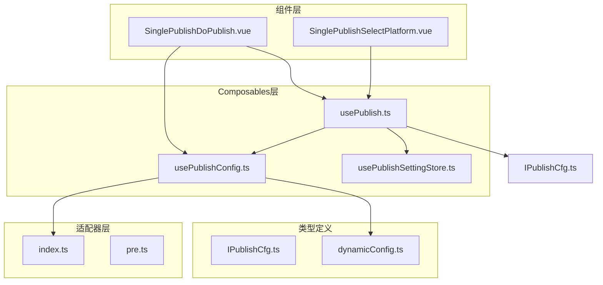
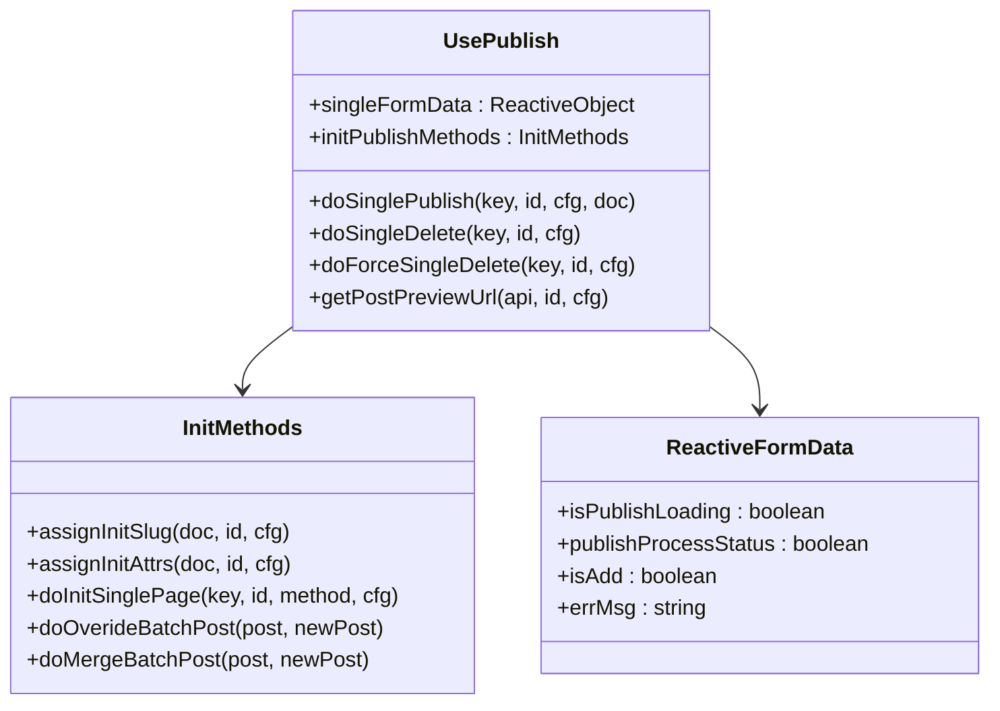
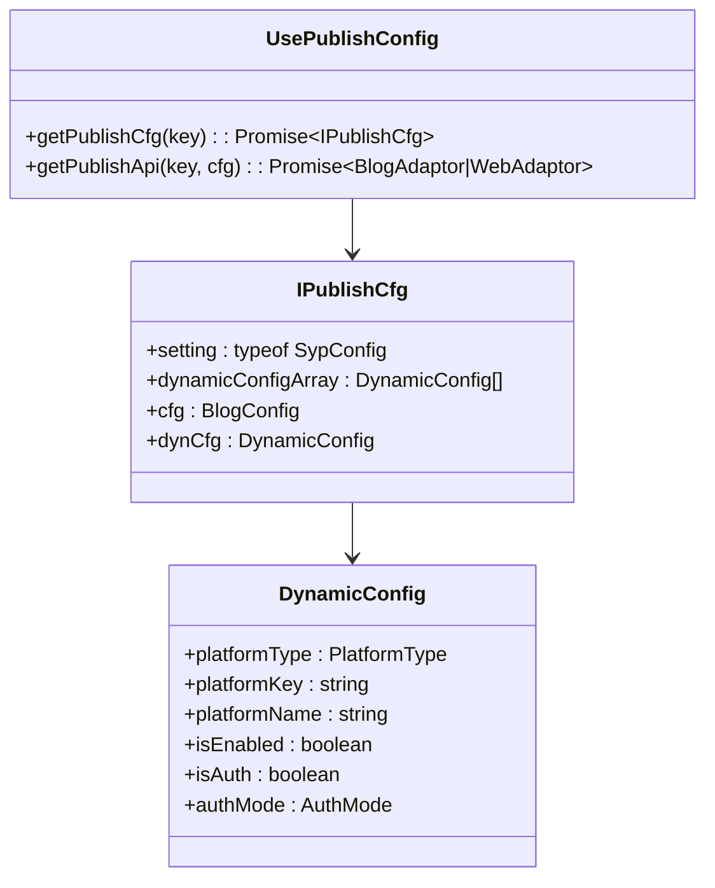
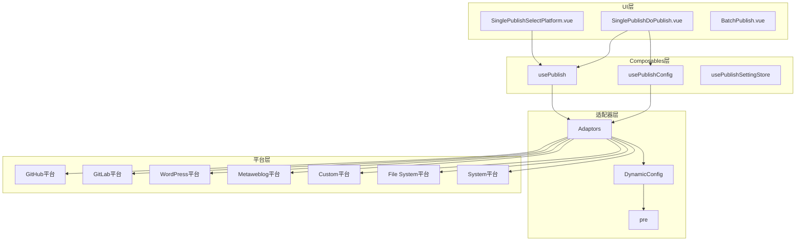
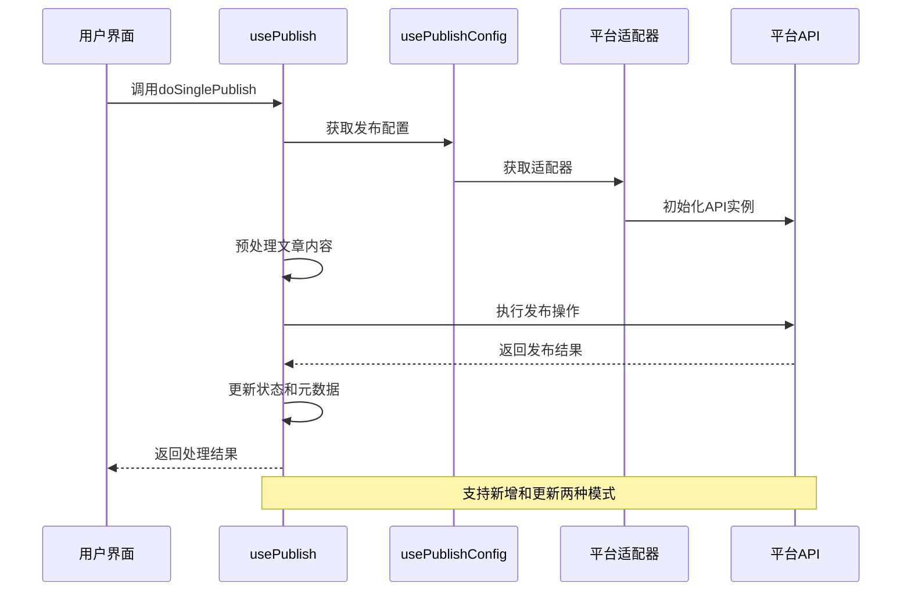
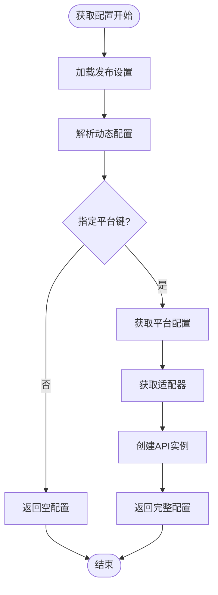
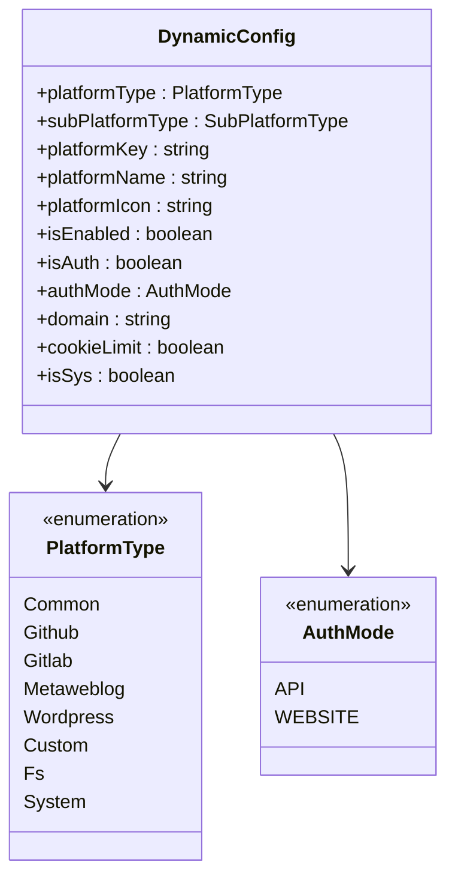
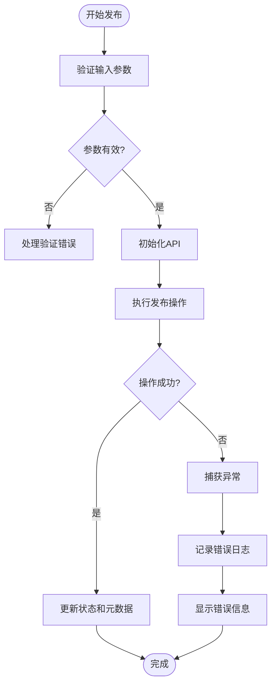
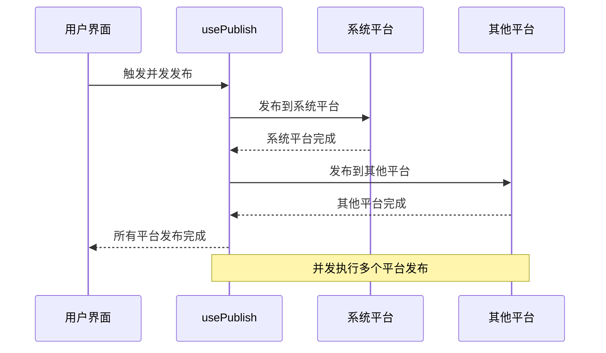
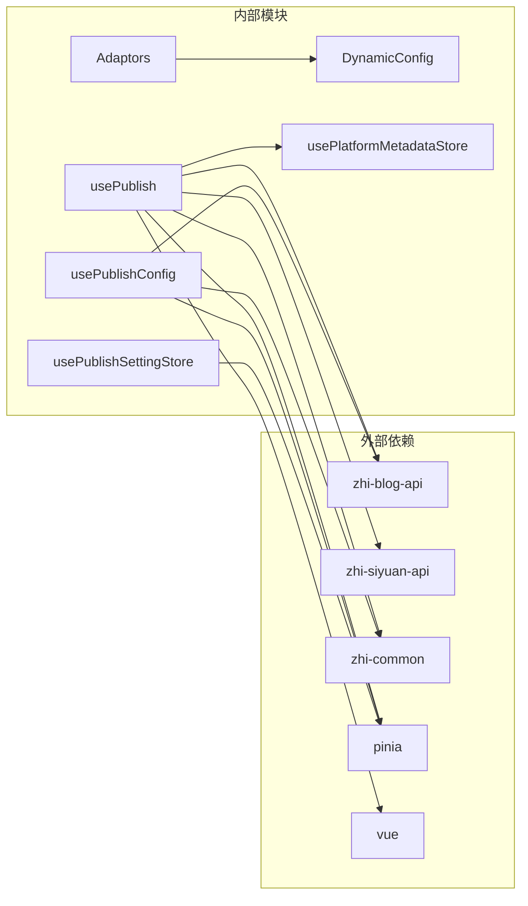

# 发布相关Composables

<cite>
**本文档引用的文件**
- [usePublish.ts](file://src/composables/usePublish.ts)
- [usePublishConfig.ts](file://src/composables/usePublishConfig.ts)
- [usePublishConfig.spec.ts](file://src/composables/usePublishConfig.spec.ts)
- [IPublishCfg.ts](file://src/types/IPublishCfg.ts)
- [usePublishSettingStore.ts](file://src/stores/usePublishSettingStore.ts)
- [dynamicConfig.ts](file://src/platforms/dynamicConfig.ts)
- [index.ts](file://src/adaptors/index.ts)
- [SinglePublishDoPublish.vue](file://src/components/publish/SinglePublishDoPublish.vue)
- [SinglePublishSelectPlatform.vue](file://src/components/publish/SinglePublishSelectPlatform.vue)
- [SinglePublish.vue](file://src/pages/SinglePublish.vue)
- [BatchPublish.vue](file://src/pages/BatchPublish.vue)
- [pre.ts](file://src/platforms/pre.ts)
- [usePlatformMetadataStore.ts](file://src/stores/usePlatformMetadataStore.ts)
- [constants.ts](file://src/utils/constants.ts)
</cite>

## 目录
1. [简介](#简介)
2. [项目结构](#项目结构)
3. [核心组件](#核心组件)
4. [架构概览](#架构概览)
5. [详细组件分析](#详细组件分析)
6. [依赖关系分析](#依赖关系分析)
7. [性能考虑](#性能考虑)
8. [故障排除指南](#故障排除指南)
9. [结论](#结论)

## 简介

本文档详细介绍了SiYuan插件发布系统中的两个核心Composables：`usePublish`和`usePublishConfig`。这两个Composables构成了整个发布系统的基础，提供了完整的发布流程控制、配置管理和错误处理功能。

发布系统支持多种平台适配器，包括GitHub、GitLab、WordPress、Metaweblog等主流博客平台，以及自定义网站平台。系统采用响应式状态管理，提供了完整的发布状态跟踪和并发控制机制。

## 项目结构

发布相关Composables位于项目的`src/composables`目录下，主要包含以下文件：

**图表来源**
- [usePublish.ts:1-560](file://src/composables/usePublish.ts#L1-L560)
- [usePublishConfig.ts:1-99](file://src/composables/usePublishConfig.ts#L1-L99)

**章节来源**
- [usePublish.ts:1-560](file://src/composables/usePublish.ts#L1-L560)
- [usePublishConfig.ts:1-99](file://src/composables/usePublishConfig.ts#L1-L99)

## 核心组件

### usePublish Composable

`usePublish`是发布系统的核心Composable，提供了完整的发布流程管理功能：

#### 主要功能模块

1. **发布操作管理**
   - `doSinglePublish`: 统一的单篇文章发布操作
   - `doSingleDelete`: 单篇文章删除操作
   - `doForceSingleDelete`: 强制删除操作

2. **初始化方法**
   - `assignInitSlug`: 初始化文章别名
   - `assignInitAttrs`: 初始化平台相关属性
   - `doInitSinglePage`: 初始化单篇文章发布页面

3. **状态管理**
   - `singleFormData`: 响应式发布状态数据
   - `publishProcessStatus`: 发布流程状态
   - `isPublishLoading`: 发布加载状态

#### 关键数据结构

**图表来源**
- [usePublish.ts:44-557](file://src/composables/usePublish.ts#L44-L557)

**章节来源**
- [usePublish.ts:44-557](file://src/composables/usePublish.ts#L44-L557)

### usePublishConfig Composable

`usePublishConfig`负责发布配置的获取和管理：

#### 核心功能

1. **配置获取**
   - `getPublishCfg`: 获取指定平台的发布配置
   - 解析动态配置数组
   - 加载平台特定配置

2. **API管理**
   - `getPublishApi`: 获取平台适配器API
   - 初始化博客适配器
   - 创建API实例

#### 配置数据结构

**图表来源**
- [usePublishConfig.ts:26-96](file://src/composables/usePublishConfig.ts#L26-L96)
- [IPublishCfg.ts:21-47](file://src/types/IPublishCfg.ts#L21-L47)

**章节来源**
- [usePublishConfig.ts:26-96](file://src/composables/usePublishConfig.ts#L26-L96)
- [IPublishCfg.ts:21-47](file://src/types/IPublishCfg.ts#L21-L47)

## 架构概览

发布系统采用分层架构设计，各层职责明确：

**图表来源**
- [SinglePublishSelectPlatform.vue:1-272](file://src/components/publish/SinglePublishSelectPlatform.vue#L1-L272)
- [SinglePublishDoPublish.vue:1-690](file://src/components/publish/SinglePublishDoPublish.vue#L1-L690)
- [usePublish.ts:10-36](file://src/composables/usePublish.ts#L10-L36)
- [index.ts:56-573](file://src/adaptors/index.ts#L56-L573)

## 详细组件分析

### 发布流程控制

发布流程采用异步处理机制，确保每个步骤的完整性和可靠性：

**图表来源**
- [usePublish.ts:70-212](file://src/composables/usePublish.ts#L70-L212)
- [usePublishConfig.ts:73-78](file://src/composables/usePublishConfig.ts#L73-L78)

#### 发布状态管理

系统提供了完整的状态跟踪机制：

| 状态属性 | 类型 | 描述 | 默认值 |
|---------|------|------|--------|
| `isPublishLoading` | boolean | 发布操作进行中 | false |
| `publishProcessStatus` | boolean | 发布流程状态 | false |
| `isAdd` | boolean | 是否为新增操作 | true |
| `errMsg` | string | 错误信息 | "" |

**章节来源**
- [usePublish.ts:55-60](file://src/composables/usePublish.ts#L55-L60)

### 配置管理系统

配置管理采用动态配置机制，支持运行时平台配置：

**图表来源**
- [usePublishConfig.ts:36-64](file://src/composables/usePublishConfig.ts#L36-L64)
- [usePublishConfig.ts:73-78](file://src/composables/usePublishConfig.ts#L73-L78)

#### 平台配置结构

**图表来源**
- [dynamicConfig.ts:13-113](file://src/platforms/dynamicConfig.ts#L13-L113)
- [dynamicConfig.ts:118-121](file://src/platforms/dynamicConfig.ts#L118-L121)

**章节来源**
- [dynamicConfig.ts:13-113](file://src/platforms/dynamicConfig.ts#L13-L113)
- [dynamicConfig.ts:118-121](file://src/platforms/dynamicConfig.ts#L118-L121)

### 错误处理机制

系统采用多层次的错误处理策略：

**图表来源**
- [usePublish.ts:195-203](file://src/composables/usePublish.ts#L195-L203)

#### 错误处理策略

1. **参数验证**: 在发布前验证所有必需参数
2. **API初始化**: 确保适配器正确初始化
3. **操作监控**: 实时监控发布过程的状态
4. **异常捕获**: 捕获并处理所有运行时异常
5. **用户反馈**: 通过消息提示和日志记录提供反馈

**章节来源**
- [usePublish.ts:195-203](file://src/composables/usePublish.ts#L195-L203)

### 并发控制机制

系统支持多平台并发发布，采用异步队列管理：

**图表来源**
- [SinglePublishDoPublish.vue:112-123](file://src/components/publish/SinglePublishDoPublish.vue#L112-L123)

**章节来源**
- [SinglePublishDoPublish.vue:112-123](file://src/components/publish/SinglePublishDoPublish.vue#L112-L123)

## 依赖关系分析

发布系统的核心依赖关系如下：

**图表来源**
- [usePublish.ts:10-35](file://src/composables/usePublish.ts#L10-L35)
- [usePublishConfig.ts:10-18](file://src/composables/usePublishConfig.ts#L10-L18)

### 组件耦合度分析

| 组件 | 内聚性 | 耦合度 | 说明 |
|------|--------|--------|------|
| usePublish | 高 | 中等 | 专注于发布逻辑，依赖适配器层 |
| usePublishConfig | 高 | 低 | 专门处理配置管理，独立性强 |
| usePublishSettingStore | 中等 | 低 | 简单的数据存储，耦合度低 |
| Adaptors | 高 | 高 | 与平台实现紧密相关 |

**章节来源**
- [usePublish.ts:10-35](file://src/composables/usePublish.ts#L10-L35)
- [usePublishConfig.ts:10-18](file://src/composables/usePublishConfig.ts#L10-L18)

## 性能考虑

### 内存管理

1. **响应式数据优化**: 使用`reactive`和`ref`确保最小化DOM更新
2. **对象克隆**: 使用深拷贝避免意外的数据共享
3. **缓存策略**: 配置数据采用懒加载和缓存机制

### 异步处理优化

1. **并发控制**: 合理控制同时进行的API调用数量
2. **超时处理**: 为长时间操作设置合理的超时机制
3. **重试机制**: 对网络请求失败的操作提供重试功能

### 网络性能

1. **连接复用**: 复用HTTP连接减少建立开销
2. **批量操作**: 支持批量发布提高效率
3. **增量更新**: 只更新必要的数据字段

## 故障排除指南

### 常见问题及解决方案

#### 发布配置错误

**问题**: 配置错误，posidKey不能为空，请检查配置
**解决方案**: 
1. 检查平台配置中的`posidKey`设置
2. 确认配置文件格式正确
3. 验证平台认证信息

#### API初始化失败

**问题**: 适配器初始化失败
**解决方案**:
1. 检查网络连接状态
2. 验证平台API端点配置
3. 确认认证凭据有效

#### 发布操作超时

**问题**: 发布操作长时间无响应
**解决方案**:
1. 检查服务器响应时间
2. 调整超时参数设置
3. 优化网络连接质量

**章节来源**
- [usePublish.ts:84-96](file://src/composables/usePublish.ts#L84-L96)
- [usePublish.ts:226-237](file://src/composables/usePublish.ts#L226-L237)

### 调试技巧

1. **启用详细日志**: 使用`createAppLogger`获取详细的执行日志
2. **状态检查**: 通过`singleFormData`监控发布状态
3. **错误追踪**: 利用`errMsg`属性定位具体错误原因

## 结论

`usePublish`和`usePublishConfig`两个Composables构成了SiYuan发布系统的核心基础。它们提供了完整的发布流程控制、灵活的配置管理、可靠的错误处理机制，以及高效的并发控制能力。

系统的设计充分考虑了扩展性和维护性，支持多种平台适配器，能够满足不同用户的需求。通过响应式状态管理和异步处理机制，系统提供了良好的用户体验和稳定的性能表现。

未来可以在以下方面进一步改进：
1. 增加更多的平台适配器支持
2. 优化并发发布的性能
3. 提供更丰富的配置选项
4. 增强错误恢复机制