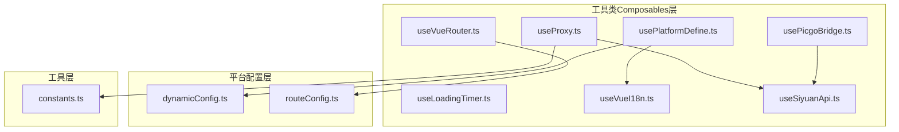
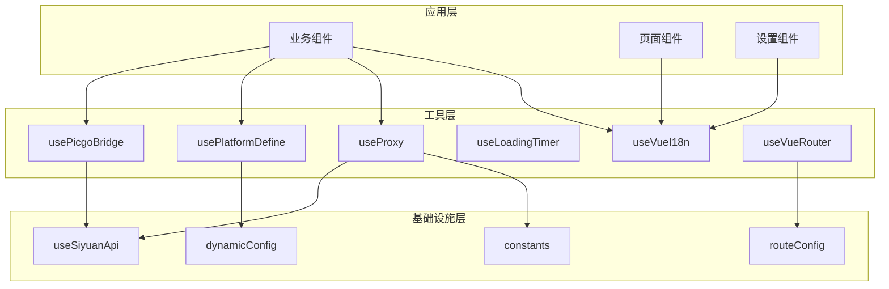
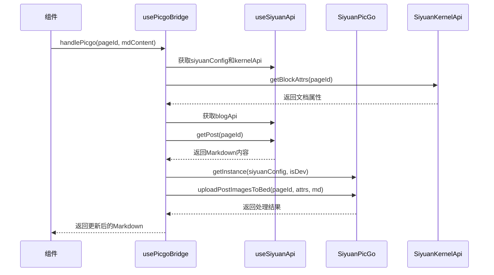
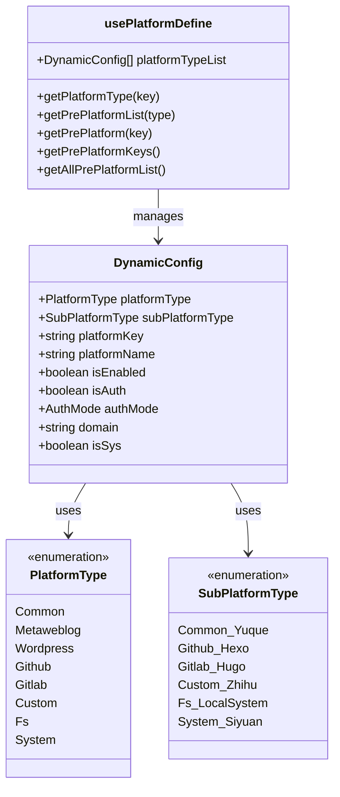
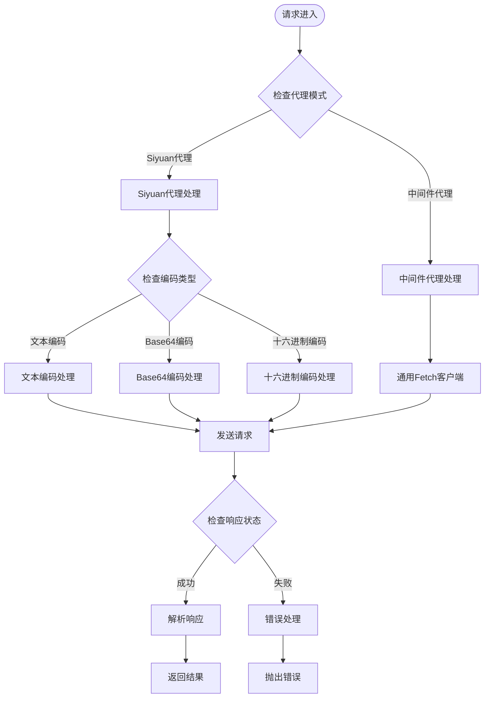
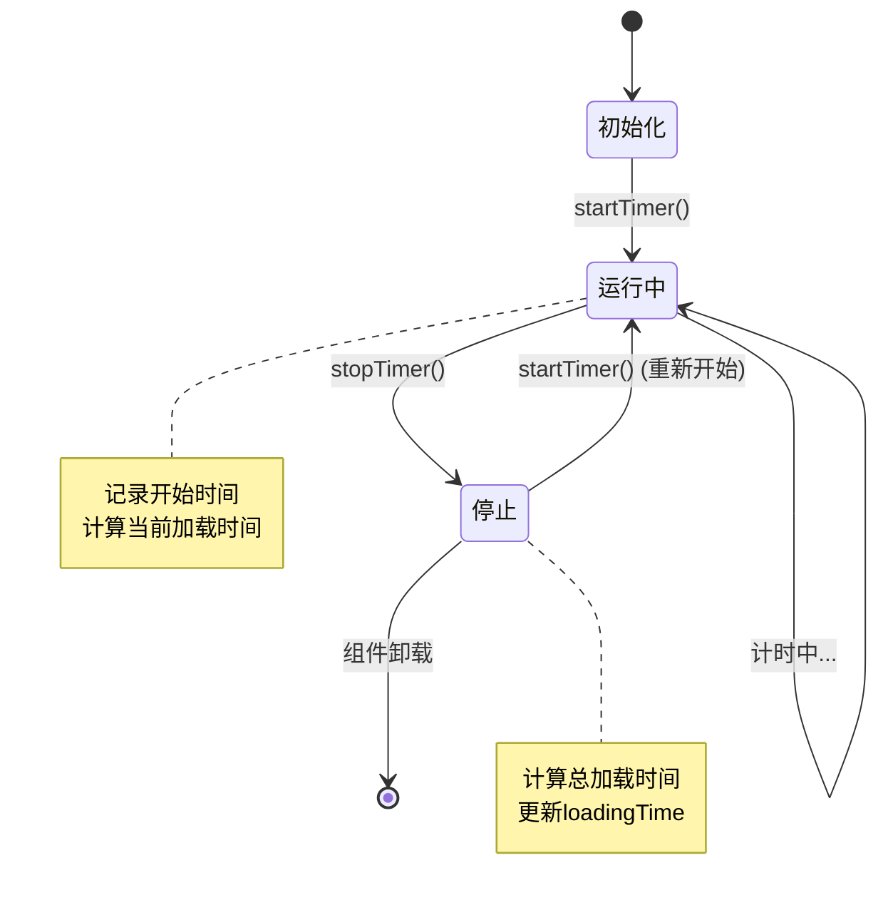
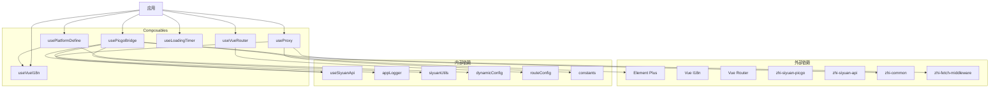

# 工具类Composables

<cite>
**本文档引用的文件**
- [usePicgoBridge.ts](file://src/composables/usePicgoBridge.ts)
- [usePlatformDefine.ts](file://src/composables/usePlatformDefine.ts)
- [useProxy.ts](file://src/composables/useProxy.ts)
- [useLoadingTimer.ts](file://src/composables/useLoadingTimer.ts)
- [useVueI18n.ts](file://src/composables/useVueI18n.ts)
- [useVueRouter.ts](file://src/composables/useVueRouter.ts)
- [useSiyuanApi.ts](file://src/composables/useSiyuanApi.ts)
- [dynamicConfig.ts](file://src/platforms/dynamicConfig.ts)
- [routeConfig.ts](file://src/routes/routeConfig.ts)
- [constants.ts](file://src/utils/constants.ts)
- [SourceMode.vue](file://src/components/publish/form/SourceMode.vue)
- [CommonBlogSetting.vue](file://src/components/set/publish/singleplatform/base/CommonBlogSetting.vue)
- [PicgoTest.vue](file://src/components/test/PicgoTest.vue)
- [CnblogsTest.vue](file://src/components/test/CnblogsTest.vue)
</cite>

## 目录
1. [简介](#简介)
2. [项目结构](#项目结构)
3. [核心组件](#核心组件)
4. [架构概览](#架构概览)
5. [详细组件分析](#详细组件分析)
6. [依赖关系分析](#依赖关系分析)
7. [性能考虑](#性能考虑)
8. [故障排除指南](#故障排除指南)
9. [结论](#结论)

## 简介

本文档详细介绍了Siyuan插件Publisher项目中的工具类Composables，包括usePicgoBridge、usePlatformDefine、useProxy、useLoadingTimer、useVueI18n和useVueRouter等通用工具Composables的完整API文档。这些工具Composables提供了图片桥接、平台定义、代理配置、加载定时器、国际化和路由管理等核心功能，旨在简化开发工作并提高代码复用性。

## 项目结构

项目采用模块化架构设计，工具类Composables位于`src/composables/`目录下，每个工具都是独立的功能模块，可以单独使用或组合使用。

**图表来源**
- [usePicgoBridge.ts:1-153](file://src/composables/usePicgoBridge.ts#L1-L153)
- [usePlatformDefine.ts:1-83](file://src/composables/usePlatformDefine.ts#L1-L83)
- [useProxy.ts:1-321](file://src/composables/useProxy.ts#L1-L321)
- [useVueRouter.ts:1-19](file://src/composables/useVueRouter.ts#L1-L19)

**章节来源**
- [usePicgoBridge.ts:1-153](file://src/composables/usePicgoBridge.ts#L1-L153)
- [usePlatformDefine.ts:1-83](file://src/composables/usePlatformDefine.ts#L1-L83)
- [useProxy.ts:1-321](file://src/composables/useProxy.ts#L1-L321)
- [useLoadingTimer.ts:1-56](file://src/composables/useLoadingTimer.ts#L1-L56)
- [useVueI18n.ts:1-26](file://src/composables/useVueI18n.ts#L1-L26)
- [useVueRouter.ts:1-19](file://src/composables/useVueRouter.ts#L1-L19)

## 核心组件

### 图片桥接工具 (usePicgoBridge)

usePicgoBridge是一个专门处理图片上传和替换的工具Composable，集成了PicGo图片托管服务，支持多种图床服务类型。

**主要功能：**
- 图片上传与替换
- Markdown图片解析
- 图床服务类型检测
- PicGo插件状态检查

**核心API：**
- `handlePicgo(pageId, mdContent?)`: 处理图片上传与替换
- `getImageItemsFromMd(pageId, md)`: 从Markdown中提取图片项
- `getPicbedServiceType(cfg)`: 获取当前图床服务类型
- `checkPicgoInstalled()`: 检查PicGo插件是否已安装

### 平台定义工具 (usePlatformDefine)

usePlatformDefine提供统一的平台定义管理，支持多种博客平台和发布平台的配置。

**主要功能：**
- 平台类型列表管理
- 预定义平台配置
- 平台类型查询
- 平台密钥管理

**核心API：**
- `platformTypeList`: 平台类型列表
- `getPlatformType(key)`: 根据键获取平台类型
- `getPrePlatformList(type)`: 根据类型获取预定义平台列表
- `getPrePlatform(key)`: 根据键获取预定义平台
- `getPrePlatformKeys()`: 获取所有预定义平台键集合
- `getAllPrePlatformList()`: 获取所有预定义平台列表

### 代理工具 (useProxy)

useProxy提供灵活的代理请求处理能力，支持多种代理模式和协议。

**主要功能：**
- 代理HTTP请求
- XML-RPC调用
- CORS代理处理
- 编码转换支持

**核心API：**
- `proxyFetch(url, headers, params, method, contentType, forceProxy, payloadEncoding, responseEncoding)`: 代理HTTP请求
- `proxyXmlrpc(url, reqMethod, reqParams, forceProxy)`: 代理XML-RPC调用
- `corsFetch(url, headers, params, method)`: CORS代理请求
- `isUseSiyuanProxy`: 代理模式标识

### 加载定时器 (useLoadingTimer)

useLoadingTimer提供简单的加载时间统计功能，用于性能监控和用户体验优化。

**主要功能：**
- 加载时间统计
- 计时器生命周期管理
- 自动启动和停止

**核心API：**
- `loadingTime`: 当前加载时间（毫秒）
- `startTimer()`: 开始计时
- `stopTimer()`: 结束计时

### 国际化工具 (useVueI18n)

useVueI18n是对vue-i18n的封装，解决了CSP（内容安全策略）相关问题。

**主要功能：**
- 简化的翻译函数
- 本地化消息获取
- 语言环境管理

**核心API：**
- `t(key)`: 翻译函数
- `locale`: 当前语言环境

### 路由工具 (useVueRouter)

useVueRouter提供Vue Router的初始化和配置功能。

**主要功能：**
- 路由实例创建
- 路由配置管理
- 历史模式设置

**核心API：**
- 返回Router实例，使用哈希历史模式

## 架构概览

**图表来源**
- [usePicgoBridge.ts:25-150](file://src/composables/usePicgoBridge.ts#L25-L150)
- [usePlatformDefine.ts:18-82](file://src/composables/usePlatformDefine.ts#L18-L82)
- [useProxy.ts:27-318](file://src/composables/useProxy.ts#L27-L318)
- [useVueRouter.ts:13-18](file://src/composables/useVueRouter.ts#L13-L18)

## 详细组件分析

### usePicgoBridge 组件分析

usePicgoBridge是图片处理的核心工具，集成了完整的图片上传和替换流程。

**图表来源**
- [usePicgoBridge.ts:35-77](file://src/composables/usePicgoBridge.ts#L35-L77)
- [useSiyuanApi.ts:20-75](file://src/composables/useSiyuanApi.ts#L20-L75)

**实现特点：**
- 支持多种图床服务类型自动检测
- 提供图片解析和转换功能
- 集成错误处理和日志记录
- 支持PicGo插件状态检查

**使用场景：**
- 文档发布前的图片处理
- Markdown内容的图片替换
- 图床服务的动态选择

**最佳实践：**
- 在发布流程开始前调用图片处理
- 处理大文档时注意性能影响
- 合理设置超时时间和重试机制

**章节来源**
- [usePicgoBridge.ts:19-150](file://src/composables/usePicgoBridge.ts#L19-L150)

### usePlatformDefine 组件分析

usePlatformDefine提供统一的平台配置管理，支持多种博客平台的标准化处理。

**图表来源**
- [dynamicConfig.ts:13-113](file://src/platforms/dynamicConfig.ts#L13-L113)
- [usePlatformDefine.ts:18-82](file://src/composables/usePlatformDefine.ts#L18-L82)

**实现特点：**
- 类型安全的平台配置管理
- 支持多级平台类型嵌套
- 提供完整的平台生命周期管理
- 集成国际化支持

**使用场景：**
- 平台配置的统一管理
- 平台类型的选择和验证
- 预定义平台的快速获取

**最佳实践：**
- 使用类型枚举确保配置正确性
- 合理组织平台配置层次结构
- 提供完善的错误处理机制

**章节来源**
- [usePlatformDefine.ts:14-82](file://src/composables/usePlatformDefine.ts#L14-L82)
- [dynamicConfig.ts:10-534](file://src/platforms/dynamicConfig.ts#L10-L534)

### useProxy 组件分析

useProxy提供灵活的网络代理解决方案，支持多种代理模式和协议转换。

**图表来源**
- [useProxy.ts:53-315](file://src/composables/useProxy.ts#L53-L315)

**实现特点：**
- 支持多种编码格式（text、base64、hex等）
- 自动处理Content-Type和请求体
- 集成XML-RPC协议支持
- 完善的错误处理和日志记录

**使用场景：**
- 跨域请求处理
- 协议转换和兼容性处理
- 网络请求的统一管理

**最佳实践：**
- 根据具体需求选择合适的编码方式
- 合理设置超时时间和重试策略
- 注意CORS代理的安全限制

**章节来源**
- [useProxy.ts:18-318](file://src/composables/useProxy.ts#L18-L318)

### useLoadingTimer 组件分析

useLoadingTimer提供简单的性能监控功能，帮助开发者了解应用的加载性能。

**图表来源**
- [useLoadingTimer.ts:20-55](file://src/composables/useLoadingTimer.ts#L20-L55)

**实现特点：**
- 基于Vue响应式的计时器
- 自动生命周期管理
- 精确的时间计算
- 简洁的API设计

**使用场景：**
- 页面加载性能监控
- 用户体验优化
- 性能调试和分析

**最佳实践：**
- 在关键操作前后使用计时器
- 合理设置计时粒度
- 注意性能开销

**章节来源**
- [useLoadingTimer.ts:12-56](file://src/composables/useLoadingTimer.ts#L12-L56)

### useVueI18n 组件分析

useVueI18n是对vue-i18n的轻量级封装，解决了CSP相关的问题。

**实现特点：**
- 简化的翻译函数接口
- 直接的消息访问
- 语言环境的直接暴露

**使用场景：**
- 组件内的本地化文本显示
- 动态语言切换
- 国际化内容的统一管理

**最佳实践：**
- 在组件初始化时调用
- 合理组织翻译键值
- 提供默认回退机制

**章节来源**
- [useVueI18n.ts:11-26](file://src/composables/useVueI18n.ts#L11-L26)

### useVueRouter 组件分析

useVueRouter提供Vue Router的标准化初始化。

**实现特点：**
- 使用哈希历史模式
- 集成路由配置
- 简洁的实例创建

**使用场景：**
- 应用路由系统的初始化
- 页面导航的统一管理
- 路由配置的集中维护

**最佳实践：**
- 在应用启动时初始化
- 合理组织路由层级
- 提供适当的路由守卫

**章节来源**
- [useVueRouter.ts:10-19](file://src/composables/useVueRouter.ts#L10-L19)

## 依赖关系分析

**图表来源**
- [usePicgoBridge.ts:10-17](file://src/composables/usePicgoBridge.ts#L10-L17)
- [useProxy.ts:10-16](file://src/composables/useProxy.ts#L10-L16)
- [usePlatformDefine.ts:10-12](file://src/composables/usePlatformDefine.ts#L10-L12)

**依赖特点：**
- 最小化外部依赖，提高可移植性
- 内部依赖清晰，便于测试和维护
- 模块化设计，支持按需引入
- 类型安全，提供完整的TypeScript支持

**章节来源**
- [usePicgoBridge.ts:10-17](file://src/composables/usePicgoBridge.ts#L10-L17)
- [useProxy.ts:10-16](file://src/composables/useProxy.ts#L10-L16)
- [usePlatformDefine.ts:10-12](file://src/composables/usePlatformDefine.ts#L10-L12)

## 性能考虑

### 图片处理性能
- 图片上传采用异步处理，避免阻塞UI线程
- 支持批量图片处理，减少网络请求次数
- 提供进度反馈和错误处理机制

### 代理请求优化
- 自动选择最优代理模式（Siyuan代理 vs 中间件代理）
- 支持多种编码格式，适应不同平台要求
- 集成缓存机制，减少重复请求

### 计时器性能
- 基于Vue响应式系统，自动优化更新
- 精确的时间计算，避免性能损耗
- 合理的生命周期管理

## 故障排除指南

### 图片处理问题
**常见问题：** 图片上传失败或格式不支持
**解决方案：** 
- 检查图床服务配置
- 验证PicGo插件状态
- 查看日志获取详细错误信息

### 代理请求错误
**常见问题：** 跨域请求失败或代理配置错误
**解决方案：**
- 验证代理URL配置
- 检查网络连接状态
- 查看代理服务器状态

### 国际化问题
**常见问题：** 翻译文本未显示或显示为键名
**解决方案：**
- 检查翻译文件完整性
- 验证语言环境设置
- 确认翻译键值正确性

**章节来源**
- [usePicgoBridge.ts:69-74](file://src/composables/usePicgoBridge.ts#L69-L74)
- [useProxy.ts:284-295](file://src/composables/useProxy.ts#L284-L295)

## 结论

这些工具类Composables为Siyuan插件Publisher项目提供了强大的基础功能支持。每个工具都经过精心设计，具有明确的职责边界和清晰的API接口。通过模块化的架构设计，开发者可以轻松地组合使用这些工具来满足各种复杂的业务需求。

推荐的最佳实践包括：
- 在组件初始化时正确调用相应的Composables
- 合理处理异步操作和错误情况
- 利用TypeScript的类型系统获得更好的开发体验
- 根据具体需求选择合适的工具组合

这些工具不仅提高了开发效率，还确保了代码的一致性和可维护性，为项目的长期发展奠定了坚实的基础。