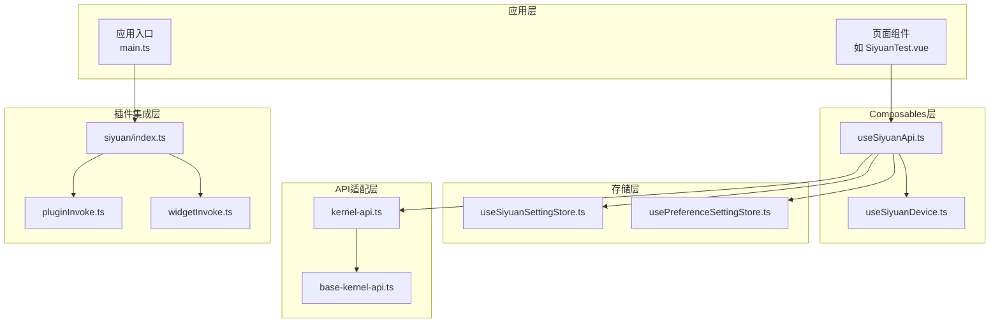
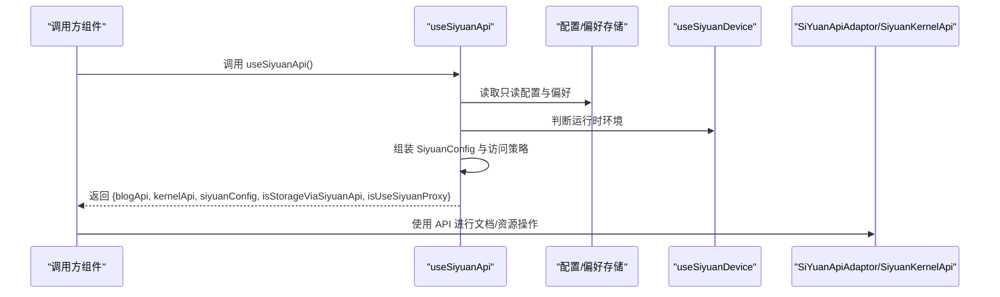
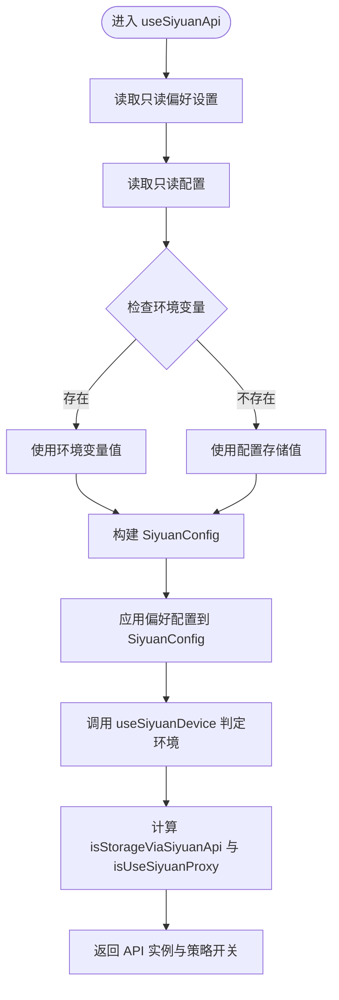
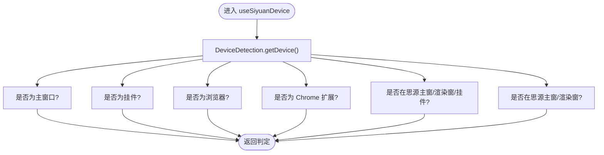
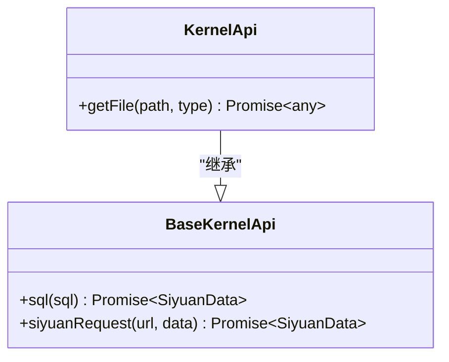
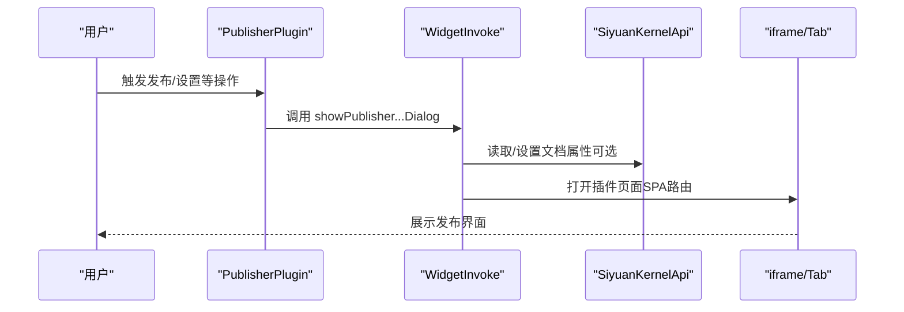
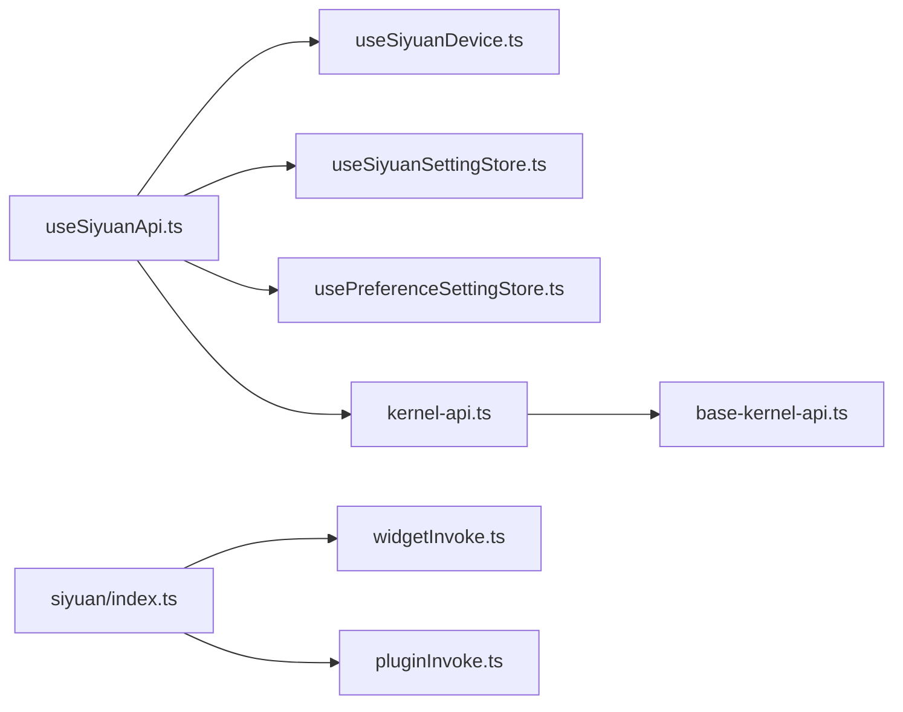
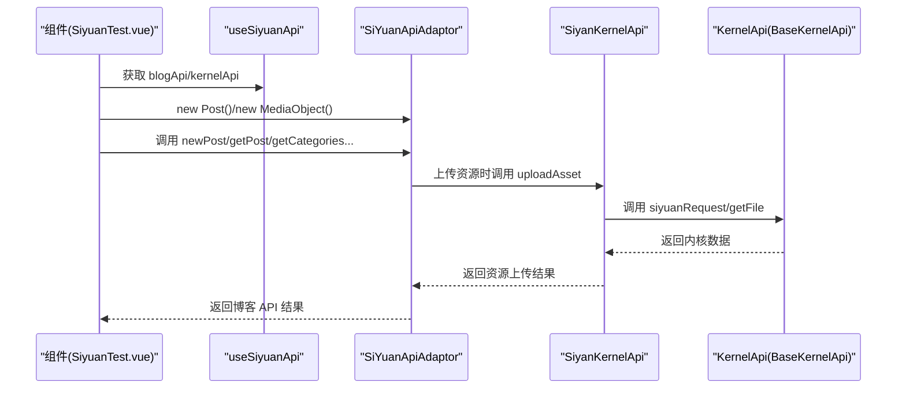

# 思源集成Composables

<cite>
**本文档引用的文件**
- [useSiyuanApi.ts](file://src/composables/useSiyuanApi.ts)
- [useSiyuanDevice.ts](file://src/composables/useSiyuanDevice.ts)
- [kernel-api.ts](file://siyuan/api/kernel-api.ts)
- [base-kernel-api.ts](file://siyuan/api/base-kernel-api.ts)
- [pluginInvoke.ts](file://siyuan/invoke/pluginInvoke.ts)
- [widgetInvoke.ts](file://siyuan/invoke/widgetInvoke.ts)
- [useSiyuanSettingStore.ts](file://src/stores/useSiyuanSettingStore.ts)
- [usePreferenceSettingStore.ts](file://src/stores/usePreferenceSettingStore.ts)
- [SiyuanTest.vue](file://src/components/test/SiyuanTest.vue)
- [index.ts](file://siyuan/index.ts)
- [main.ts](file://src/main.ts)
</cite>

## 目录
1. [简介](#简介)
2. [项目结构](#项目结构)
3. [核心组件](#核心组件)
4. [架构总览](#架构总览)
5. [详细组件分析](#详细组件分析)
6. [依赖关系分析](#依赖关系分析)
7. [性能考虑](#性能考虑)
8. [故障排除指南](#故障排除指南)
9. [结论](#结论)
10. [附录](#附录)

## 简介
本文件面向插件开发者，系统性梳理思源集成Composables的设计与实现，重点覆盖以下目标：
- 全面解析 useSiyuanApi 与 useSiyuanDevice 两大核心 Composables 的接口、行为与使用方式
- 说明与 zhi-siyuan-api 生态的集成点，包括 SiYuanApiAdaptor、SiyuanKernelApi、SiyuanConfig 等
- 展示在插件环境（桌面端、浏览器端、挂件）中的典型用法，涵盖文档内容获取、属性读取、命令执行等
- 解释与思源内核的通信机制、代理策略与数据同步要点
- 提供可直接参考的示例与最佳实践

## 项目结构
围绕“composables + API适配层 + 插件入口”的分层组织：
- composables：对外暴露 useSiyuanApi、useSiyuanDevice，负责配置装配与运行时环境判断
- siyuan/api：封装 BaseKernelApi 与 KernelApi，统一访问思源内核接口
- siyuan/invoke：封装插件与挂件的交互逻辑（对话框、Tab、权限控制）
- stores：提供只读配置与偏好设置，支撑 useSiyuanApi 的参数来源
- 测试组件：SiyuanTest.vue 展示了完整的 API 调用流程与参数传递

图表来源
- [useSiyuanApi.ts:1-76](file://src/composables/useSiyuanApi.ts#L1-L76)
- [useSiyuanDevice.ts:1-83](file://src/composables/useSiyuanDevice.ts#L1-L83)
- [base-kernel-api.ts:1-102](file://siyuan/api/base-kernel-api.ts#L1-L102)
- [kernel-api.ts:1-68](file://siyuan/api/kernel-api.ts#L1-L68)
- [pluginInvoke.ts:1-100](file://siyuan/invoke/pluginInvoke.ts#L1-L100)
- [widgetInvoke.ts:1-170](file://siyuan/invoke/widgetInvoke.ts#L1-L170)
- [useSiyuanSettingStore.ts:1-81](file://src/stores/useSiyuanSettingStore.ts#L1-L81)
- [usePreferenceSettingStore.ts:1-90](file://src/stores/usePreferenceSettingStore.ts#L1-L90)
- [main.ts:1-22](file://src/main.ts#L1-L22)
- [index.ts:1-190](file://siyuan/index.ts#L1-L190)

章节来源
- [useSiyuanApi.ts:1-76](file://src/composables/useSiyuanApi.ts#L1-L76)
- [useSiyuanDevice.ts:1-83](file://src/composables/useSiyuanDevice.ts#L1-L83)
- [base-kernel-api.ts:1-102](file://siyuan/api/base-kernel-api.ts#L1-L102)
- [kernel-api.ts:1-68](file://siyuan/api/kernel-api.ts#L1-L68)
- [pluginInvoke.ts:1-100](file://siyuan/invoke/pluginInvoke.ts#L1-L100)
- [widgetInvoke.ts:1-170](file://siyuan/invoke/widgetInvoke.ts#L1-L170)
- [useSiyuanSettingStore.ts:1-81](file://src/stores/useSiyuanSettingStore.ts#L1-L81)
- [usePreferenceSettingStore.ts:1-90](file://src/stores/usePreferenceSettingStore.ts#L1-L90)
- [main.ts:1-22](file://src/main.ts#L1-L22)
- [index.ts:1-190](file://siyuan/index.ts#L1-L190)

## 核心组件
本节聚焦两个核心 Composables 的职责边界、输入输出与内部协作。

- useSiyuanApi
  - 职责：装配并导出与思源交互所需的 API 实例与运行时开关
  - 关键产物：
    - blogApi：基于 SiYuanApiAdaptor 的博客 API 适配器
    - kernelApi：基于 SiyuanKernelApi 的内核 API
    - siyuanConfig：SiyuanConfig 配置对象（含 apiUrl、token、cookie、偏好配置）
    - isStorageViaSiyuanApi：判断是否通过“思源模式”存储/访问
    - isUseSiyuanProxy：在非插件 SPA 场景下决定是否走代理
  - 输入来源：环境变量、只读配置存储、偏好设置存储、设备检测

- useSiyuanDevice
  - 职责：提供运行时环境判定能力，区分主窗口、挂件、浏览器、扩展等场景
  - 关键函数：
    - isInSiyuanMainWin、isInSiyuanWidget、isInSiyuanBrowser、isInChromeExtension
    - isInSiyuanOrSiyuanNewWin、isInSiyuanWin

章节来源
- [useSiyuanApi.ts:17-76](file://src/composables/useSiyuanApi.ts#L17-L76)
- [useSiyuanDevice.ts:13-83](file://src/composables/useSiyuanDevice.ts#L13-L83)

## 架构总览
useSiyuanApi 作为装配器，结合 useSiyuanDevice 的环境判断与存储偏好，决定访问策略；同时通过 zhi-siyuan-api 的适配层与内核 API 完成与思源内核的通信。

图表来源
- [useSiyuanApi.ts:20-75](file://src/composables/useSiyuanApi.ts#L20-L75)
- [useSiyuanDevice.ts:16-82](file://src/composables/useSiyuanDevice.ts#L16-L82)
- [useSiyuanSettingStore.ts:26-78](file://src/stores/useSiyuanSettingStore.ts#L26-L78)
- [usePreferenceSettingStore.ts:21-87](file://src/stores/usePreferenceSettingStore.ts#L21-L87)

## 详细组件分析

### useSiyuanApi 组件分析
- 配置来源与优先级
  - 环境变量：VITE_SIYUAN_API_URL、VITE_SIYUAN_AUTH_TOKEN、VITE_SIYUAN_COOKIE
  - 本地存储：通过只读配置存储返回的 SiyuanConfig
  - 偏好设置：通过只读偏好存储注入到 SiyuanConfig.preferenceConfig
- 访问策略
  - isStorageViaSiyuanApi：依据 VITE_DEFAULT_TYPE 是否为 "siyuan" 判断
  - isUseSiyuanProxy：在非 Chrome Extension 且非“在思源内或新窗口”时启用
- 导出对象
  - blogApi：用于博客协议相关操作（如获取文章、分类、预览链接等）
  - kernelApi：用于内核接口（如上传资源、SQL 查询、文件读取等）

图表来源
- [useSiyuanApi.ts:20-75](file://src/composables/useSiyuanApi.ts#L20-L75)
- [useSiyuanSettingStore.ts:26-78](file://src/stores/useSiyuanSettingStore.ts#L26-L78)
- [usePreferenceSettingStore.ts:21-87](file://src/stores/usePreferenceSettingStore.ts#L21-L87)
- [useSiyuanDevice.ts:16-82](file://src/composables/useSiyuanDevice.ts#L16-L82)

章节来源
- [useSiyuanApi.ts:17-76](file://src/composables/useSiyuanApi.ts#L17-L76)

### useSiyuanDevice 组件分析
- 设备类型判定
  - 主窗口、挂件、浏览器、扩展等场景分别提供布尔判断函数
  - 新窗口与渲染窗口也被纳入“在思源内”的判断范围
- 应用场景
  - 用于决定是否启用代理、是否允许某些 UI 行为、是否需要特殊权限处理

图表来源
- [useSiyuanDevice.ts:16-82](file://src/composables/useSiyuanDevice.ts#L16-L82)

章节来源
- [useSiyuanDevice.ts:13-83](file://src/composables/useSiyuanDevice.ts#L13-L83)

### 内核 API 适配层分析
- BaseKernelApi
  - 统一封装 /api/query/sql 请求与通用 siyuanRequest 方法
  - 支持带 Token 的鉴权头注入
- KernelApi
  - 基于 BaseKernelApi，提供文件读取等常用内核接口
  - 通过全局常量获取 API 地址与 Token

图表来源
- [base-kernel-api.ts:49-101](file://siyuan/api/base-kernel-api.ts#L49-L101)
- [kernel-api.ts:38-65](file://siyuan/api/kernel-api.ts#L38-L65)

章节来源
- [base-kernel-api.ts:29-101](file://siyuan/api/base-kernel-api.ts#L29-L101)
- [kernel-api.ts:29-65](file://siyuan/api/kernel-api.ts#L29-L65)

### 插件与挂件交互分析
- 插件入口 PublisherPlugin
  - 持有 SiyuanKernelApi 实例，初始化顶部栏、自定义 Tab、事件监听
  - 暴露 openSetting 等入口方法
- WidgetInvoke
  - 提供批量发布、单篇发布、设置页、关于页等页面跳转
  - 支持在不同设备类型下打开 iframe 对话框或新建 Tab
- PluginInvoke
  - 提供博客/图床等插件的弹窗与权限回收逻辑

图表来源
- [index.ts:46-190](file://siyuan/index.ts#L46-L190)
- [widgetInvoke.ts:46-170](file://siyuan/invoke/widgetInvoke.ts#L46-L170)
- [pluginInvoke.ts:47-99](file://siyuan/invoke/pluginInvoke.ts#L47-L99)

章节来源
- [index.ts:46-190](file://siyuan/index.ts#L46-L190)
- [widgetInvoke.ts:37-170](file://siyuan/invoke/widgetInvoke.ts#L37-L170)
- [pluginInvoke.ts:36-99](file://siyuan/invoke/pluginInvoke.ts#L36-L99)

### 在插件环境中使用示例
以下示例展示了如何在插件/挂件环境中使用 useSiyuanApi 与相关 API：

- 获取文档内容与属性
  - 通过 SiyuanKernelApi 的 SQL 查询或文档属性接口读取
  - 参考：[index.ts:148-188](file://siyuan/index.ts#L148-L188)
- 读取/设置文档属性
  - 使用 PluginInvoke 的 setBlockAttrs 临时调整权限后回收
  - 参考：[pluginInvoke.ts:47-99](file://siyuan/invoke/pluginInvoke.ts#L47-L99)
- 执行命令与打开页面
  - 通过 WidgetInvoke 打开发布/设置/关于等页面
  - 参考：[widgetInvoke.ts:46-125](file://siyuan/invoke/widgetInvoke.ts#L46-L125)
- 博客 API 调用（测试组件）
  - 使用 SiYuanApiAdaptor 的 getUsersBlogs、getRecentPosts、newPost 等
  - 参考：[SiyuanTest.vue:169-314](file://src/components/test/SiyuanTest.vue#L169-L314)

章节来源
- [index.ts:148-188](file://siyuan/index.ts#L148-L188)
- [pluginInvoke.ts:47-99](file://siyuan/invoke/pluginInvoke.ts#L47-L99)
- [widgetInvoke.ts:46-125](file://siyuan/invoke/widgetInvoke.ts#L46-L125)
- [SiyuanTest.vue:169-314](file://src/components/test/SiyuanTest.vue#L169-L314)

## 依赖关系分析
- 组件耦合
  - useSiyuanApi 依赖 useSiyuanDevice、配置存储与偏好存储
  - 插件入口依赖 WidgetInvoke 与 PluginInvoke
- 外部依赖
  - zhi-siyuan-api：提供 SiYuanApiAdaptor、SiyuanKernelApi、SiyuanConfig
  - zhi-device：提供设备类型检测
  - zhi-lib-base：提供基础日志与工具能力

图表来源
- [useSiyuanApi.ts:10-15](file://src/composables/useSiyuanApi.ts#L10-L15)
- [useSiyuanDevice.ts:10](file://src/composables/useSiyuanDevice.ts#L10)
- [useSiyuanSettingStore.ts:10](file://src/stores/useSiyuanSettingStore.ts#L10)
- [usePreferenceSettingStore.ts:10](file://src/stores/usePreferenceSettingStore.ts#L10)
- [kernel-api.ts:26](file://siyuan/api/kernel-api.ts#L26)
- [base-kernel-api.ts:26](file://siyuan/api/base-kernel-api.ts#L26)
- [index.ts:26-36](file://siyuan/index.ts#L26-L36)
- [widgetInvoke.ts:26-32](file://siyuan/invoke/widgetInvoke.ts#L26-L32)
- [pluginInvoke.ts:26-31](file://siyuan/invoke/pluginInvoke.ts#L26-L31)

章节来源
- [useSiyuanApi.ts:10-15](file://src/composables/useSiyuanApi.ts#L10-L15)
- [useSiyuanDevice.ts:10](file://src/composables/useSiyuanDevice.ts#L10)
- [useSiyuanSettingStore.ts:10](file://src/stores/useSiyuanSettingStore.ts#L10)
- [usePreferenceSettingStore.ts:10](file://src/stores/usePreferenceSettingStore.ts#L10)
- [kernel-api.ts:26](file://siyuan/api/kernel-api.ts#L26)
- [base-kernel-api.ts:26](file://siyuan/api/base-kernel-api.ts#L26)
- [index.ts:26-36](file://siyuan/index.ts#L26-L36)
- [widgetInvoke.ts:26-32](file://siyuan/invoke/widgetInvoke.ts#L26-L32)
- [pluginInvoke.ts:26-31](file://siyuan/invoke/pluginInvoke.ts#L26-L31)

## 性能考虑
- 配置缓存与只读化
  - 通过只读引用避免意外修改，减少不必要的响应式更新
- 网络请求优化
  - 统一在 BaseKernelApi 中处理鉴权头与日志，便于集中优化
- 代理策略
  - 在非插件 SPA 场景下启用代理可降低跨域与鉴权复杂度，但需关注额外网络往返

## 故障排除指南
- 无法连接内核
  - 检查环境变量 VITE_SIYUAN_API_URL 与 VITE_SIYUAN_AUTH_TOKEN
  - 确认 isStorageViaSiyuanApi 与 isUseSiyuanProxy 的组合是否符合预期
- 权限不足
  - 在插件弹窗中临时提升权限后及时回收，避免长期暴露
- 设备类型误判
  - 使用 useSiyuanDevice 的布尔函数逐项排查当前运行环境

章节来源
- [useSiyuanApi.ts:44-66](file://src/composables/useSiyuanApi.ts#L44-L66)
- [pluginInvoke.ts:47-99](file://siyuan/invoke/pluginInvoke.ts#L47-L99)
- [useSiyuanDevice.ts:19-72](file://src/composables/useSiyuanDevice.ts#L19-L72)

## 结论
useSiyuanApi 与 useSiyuanDevice 为插件提供了统一的配置装配与环境感知能力，配合 zhi-siyuan-api 的适配层与内核 API，能够稳定地完成文档读写、属性管理与资源上传等核心任务。通过合理的代理策略与权限管理，可在多种运行环境下保持一致的用户体验。

## 附录

### API 调用序列（从组件到内核）

图表来源
- [SiyuanTest.vue:169-314](file://src/components/test/SiyuanTest.vue#L169-L314)
- [useSiyuanApi.ts:68-75](file://src/composables/useSiyuanApi.ts#L68-L75)
- [kernel-api.ts:45-64](file://siyuan/api/kernel-api.ts#L45-L64)
- [base-kernel-api.ts:74-100](file://siyuan/api/base-kernel-api.ts#L74-L100)