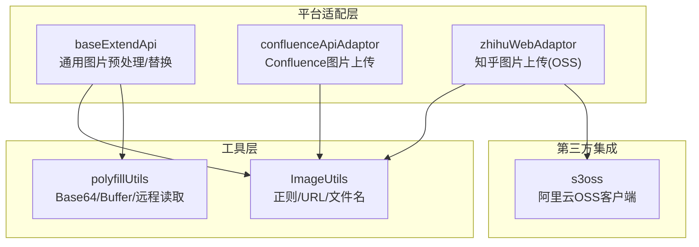
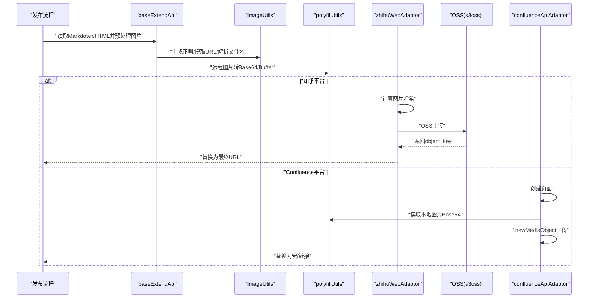
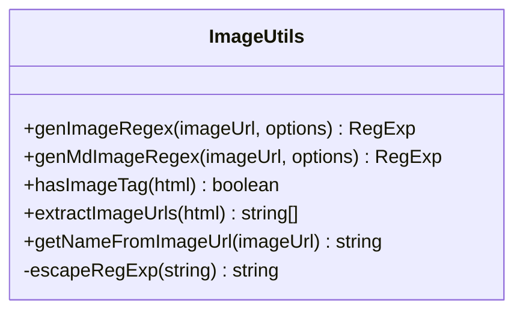
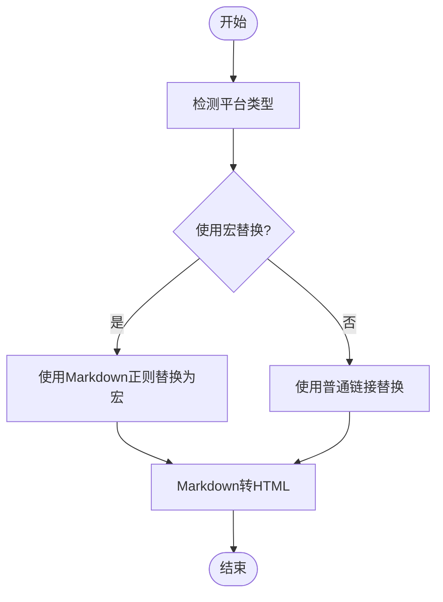
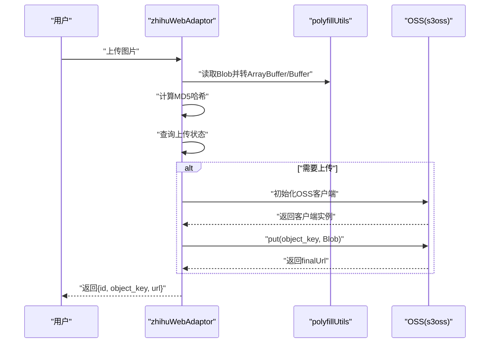
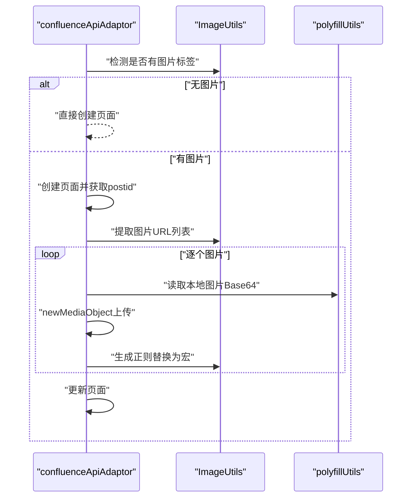
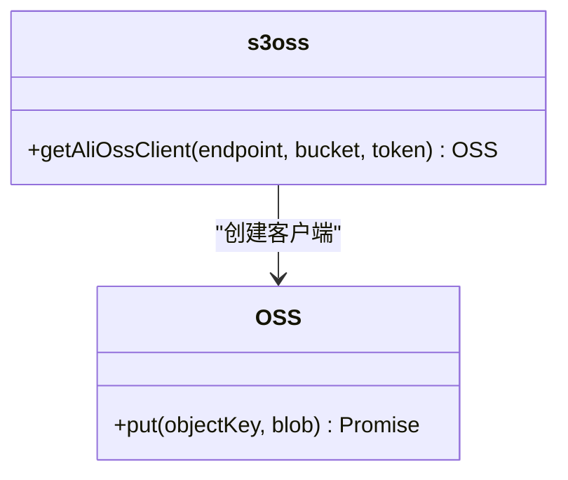
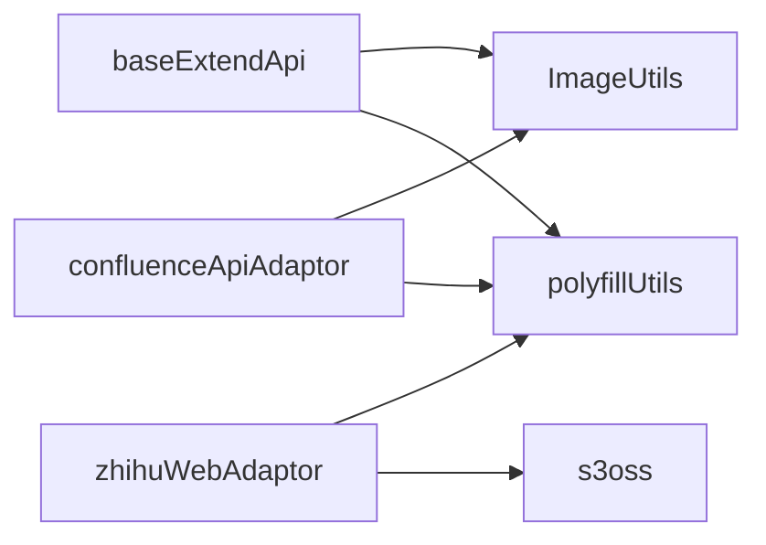

# 图片处理工具

<cite>
**本文档引用的文件**
- [ImageUtils.ts](file://src/utils/ImageUtils.ts)
- [s3oss.ts](file://src/vendors/alioss/s3oss.ts)
- [confluenceApiAdaptor.ts](file://src/adaptors/api/confluence/confluenceApiAdaptor.ts)
- [baseExtendApi.ts](file://src/adaptors/base/baseExtendApi.ts)
- [zhihuWebAdaptor.ts](file://src/adaptors/web/zhihu/zhihuWebAdaptor.ts)
- [polyfillUtils.ts](file://src/utils/polyfillUtils.ts)
</cite>

## 目录
1. [简介](#简介)
2. [项目结构](#项目结构)
3. [核心组件](#核心组件)
4. [架构总览](#架构总览)
5. [详细组件分析](#详细组件分析)
6. [依赖关系分析](#依赖关系分析)
7. [性能考量](#性能考量)
8. [故障排查指南](#故障排查指南)
9. [结论](#结论)
10. [附录](#附录)

## 简介
本文件面向“图片处理工具”的API文档，聚焦以下目标：
- 图片上传流程：从本地或远程资源读取、哈希计算、OSS上传、URL回填。
- 图片压缩与格式转换：通过平台适配器对图片进行预处理（如知乎的 GIF 扩展名处理）。
- OSS 存储集成：基于阿里云 OSS SDK 的客户端封装与上传。
- 正则匹配与替换：在 Markdown/HTML 中识别并替换图片链接。
- 质量控制与尺寸调整：结合平台特性进行图片优化。
- 错误处理与安全策略：异常捕获、重复文件检测、代理与跨域处理。

## 项目结构
围绕图片处理的相关模块分布如下：
- 工具层
  - ImageUtils：图片正则匹配、URL提取、文件名解析等。
  - polyfillUtils：Base64/Buffer 转换、远程图片读取等。
- 平台适配层
  - baseExtendApi：通用图片预处理、链接替换、远程图片读取。
  - confluenceApiAdaptor：Confluence 自带图片上传能力的流程。
  - zhihuWebAdaptor：知乎平台的图片上传流程（含阿里云 OSS）。
- 第三方集成
  - s3oss：阿里云 OSS 客户端封装。

**图表来源**
- [ImageUtils.ts:12-162](file://src/utils/ImageUtils.ts#L12-L162)
- [polyfillUtils.ts:55-90](file://src/utils/polyfillUtils.ts#L55-L90)
- [baseExtendApi.ts:550-596](file://src/adaptors/base/baseExtendApi.ts#L550-L596)
- [confluenceApiAdaptor.ts:49-96](file://src/adaptors/api/confluence/confluenceApiAdaptor.ts#L49-L96)
- [zhihuWebAdaptor.ts:268-320](file://src/adaptors/web/zhihu/zhihuWebAdaptor.ts#L268-L320)
- [s3oss.ts:20-40](file://src/vendors/alioss/s3oss.ts#L20-L40)

**章节来源**
- [ImageUtils.ts:12-162](file://src/utils/ImageUtils.ts#L12-L162)
- [polyfillUtils.ts:55-90](file://src/utils/polyfillUtils.ts#L55-L90)
- [baseExtendApi.ts:550-596](file://src/adaptors/base/baseExtendApi.ts#L550-L596)
- [confluenceApiAdaptor.ts:49-96](file://src/adaptors/api/confluence/confluenceApiAdaptor.ts#L49-L96)
- [zhihuWebAdaptor.ts:268-320](file://src/adaptors/web/zhihu/zhihuWebAdaptor.ts#L268-L320)
- [s3oss.ts:20-40](file://src/vendors/alioss/s3oss.ts#L20-L40)

## 核心组件
- ImageUtils
  - 功能：生成匹配 HTML/Markdown 图片的正则；提取 HTML 中的图片 URL；从 URL 解析文件名。
  - 关键方法：genImageRegex、genMdImageRegex、hasImageTag、extractImageUrls、getNameFromImageUrl。
- polyfillUtils
  - 功能：远程图片转 Base64、Base64 转 Buffer、ArrayBuffer 转 Buffer、提取 MIME 类型。
- baseExtendApi
  - 功能：通用图片预处理、Markdown/HTML 中的图片链接替换、远程图片读取（Siyuan/外部环境）。
- zhihuWebAdaptor
  - 功能：知乎平台图片上传，包含哈希计算、OSS 上传、GIF 扩展名处理。
- s3oss
  - 功能：阿里云 OSS 客户端初始化封装。

**章节来源**
- [ImageUtils.ts:12-162](file://src/utils/ImageUtils.ts#L12-L162)
- [polyfillUtils.ts:55-90](file://src/utils/polyfillUtils.ts#L55-L90)
- [baseExtendApi.ts:550-596](file://src/adaptors/base/baseExtendApi.ts#L550-L596)
- [zhihuWebAdaptor.ts:268-320](file://src/adaptors/web/zhihu/zhihuWebAdaptor.ts#L268-L320)
- [s3oss.ts:20-40](file://src/vendors/alioss/s3oss.ts#L20-L40)

## 架构总览
图片处理的整体流程分为三段：
- 预处理阶段：从 Markdown/HTML 中识别图片，必要时进行压缩/格式转换。
- 上传阶段：根据平台选择上传方式（Confluence 自带上传或 OSS 上传）。
- 回填阶段：将本地占位符替换为最终可访问的图片 URL。

**图表来源**
- [baseExtendApi.ts:550-596](file://src/adaptors/base/baseExtendApi.ts#L550-L596)
- [ImageUtils.ts:12-162](file://src/utils/ImageUtils.ts#L12-L162)
- [polyfillUtils.ts:55-90](file://src/utils/polyfillUtils.ts#L55-L90)
- [zhihuWebAdaptor.ts:268-320](file://src/adaptors/web/zhihu/zhihuWebAdaptor.ts#L268-L320)
- [s3oss.ts:20-40](file://src/vendors/alioss/s3oss.ts#L20-L40)
- [confluenceApiAdaptor.ts:49-96](file://src/adaptors/api/confluence/confluenceApiAdaptor.ts#L49-L96)

## 详细组件分析

### ImageUtils 组件分析
- 设计要点
  - 通过可配置的正则生成器，支持精确/模糊匹配、大小写敏感、查询参数允许等。
  - 提供 HTML 和 Markdown 两种图片匹配规则，便于在不同格式中定位图片。
  - 提供 URL 提取与文件名解析，辅助后续上传与替换。
- 关键流程
  - 生成正则：根据选项动态拼接模式串，构造 img 或 Markdown 图片语法的匹配规则。
  - URL 提取：从 HTML 中提取所有图片 src，过滤空值。
  - 文件名解析：从 URL 尾部截取文件名并去除扩展名，用于媒体对象命名。

**图表来源**
- [ImageUtils.ts:12-162](file://src/utils/ImageUtils.ts#L12-L162)

**章节来源**
- [ImageUtils.ts:12-162](file://src/utils/ImageUtils.ts#L12-L162)

### baseExtendApi 组件分析
- 设计要点
  - 统一的图片预处理入口，支持 Markdown/HTML 的图片链接替换。
  - 远程图片读取：在 Siyuan 环境内使用内置请求，在外部环境通过平台 API 代理。
  - 链接替换策略：支持宏替换（如 Confluence）与普通链接替换。
- 关键流程
  - 预处理：遍历 urlMap，按平台类型选择替换策略。
  - 读取 Base64：根据运行环境选择内置或代理方式。
  - 生成 HTML：将 Markdown 转换为 HTML 以供后续发布。

**图表来源**
- [baseExtendApi.ts:550-596](file://src/adaptors/base/baseExtendApi.ts#L550-L596)

**章节来源**
- [baseExtendApi.ts:550-596](file://src/adaptors/base/baseExtendApi.ts#L550-L596)
- [baseExtendApi.ts:607-639](file://src/adaptors/base/baseExtendApi.ts#L607-L639)

### zhihuWebAdaptor 组件分析
- 设计要点
  - 上传前计算图片 MD5 哈希，用于去重与状态查询。
  - 若需上传，通过阿里云 OSS 客户端 put 上传至指定 Bucket。
  - 对 GIF 图片追加 .gif 扩展名，确保正确渲染。
- 关键流程
  - 读取 Blob -> 计算哈希 -> 查询上传状态。
  - 若状态为待上传，则获取 OSS Token 并调用 put。
  - 返回 object_key 并拼接最终 URL。

**图表来源**
- [zhihuWebAdaptor.ts:268-320](file://src/adaptors/web/zhihu/zhihuWebAdaptor.ts#L268-L320)
- [polyfillUtils.ts:86-90](file://src/utils/polyfillUtils.ts#L86-L90)
- [s3oss.ts:20-40](file://src/vendors/alioss/s3oss.ts#L20-L40)

**章节来源**
- [zhihuWebAdaptor.ts:268-320](file://src/adaptors/web/zhihu/zhihuWebAdaptor.ts#L268-L320)
- [polyfillUtils.ts:86-90](file://src/utils/polyfillUtils.ts#L86-L90)
- [s3oss.ts:20-40](file://src/vendors/alioss/s3oss.ts#L20-L40)

### confluenceApiAdaptor 组件分析
- 设计要点
  - 若文章无图片，直接创建页面；若有图片，先创建页面，再逐张上传并替换为 Confluence 宏。
  - 从 HTML 中提取本地相对路径图片，转 Base64 后通过 newMediaObject 上传。
  - 使用正则替换占位符为返回的宏，保证富文本显示。
- 关键流程
  - 检测图片 -> 创建页面 -> 逐图上传 -> 替换宏 -> 更新页面。

**图表来源**
- [confluenceApiAdaptor.ts:49-96](file://src/adaptors/api/confluence/confluenceApiAdaptor.ts#L49-L96)
- [ImageUtils.ts:144-154](file://src/utils/ImageUtils.ts#L144-L154)
- [polyfillUtils.ts:55-60](file://src/utils/polyfillUtils.ts#L55-L60)

**章节来源**
- [confluenceApiAdaptor.ts:49-96](file://src/adaptors/api/confluence/confluenceApiAdaptor.ts#L49-L96)
- [ImageUtils.ts:144-154](file://src/utils/ImageUtils.ts#L144-L154)
- [polyfillUtils.ts:55-60](file://src/utils/polyfillUtils.ts#L55-L60)

### s3oss（阿里云 OSS）集成
- 设计要点
  - 通过传入 endpoint、bucket、token 初始化 OSS 客户端。
  - 与 zhihuWebAdaptor 协作，完成图片上传。
- 关键流程
  - 初始化客户端 -> put(object_key, Blob) -> 返回上传结果。

**图表来源**
- [s3oss.ts:20-40](file://src/vendors/alioss/s3oss.ts#L20-L40)

**章节来源**
- [s3oss.ts:20-40](file://src/vendors/alioss/s3oss.ts#L20-L40)

## 依赖关系分析
- 模块耦合
  - baseExtendApi 依赖 ImageUtils 与 polyfillUtils，负责通用图片处理与链接替换。
  - zhihuWebAdaptor 依赖 s3oss 与 polyfillUtils，负责知乎平台的图片上传。
  - confluenceApiAdaptor 依赖 ImageUtils 与 polyfillUtils，负责 Confluence 平台的图片上传。
- 外部依赖
  - OSS SDK：用于阿里云 OSS 上传。
  - Cheerio：用于 HTML/Markdown 的 DOM 操作（在其他适配器中使用）。

**图表来源**
- [baseExtendApi.ts:550-596](file://src/adaptors/base/baseExtendApi.ts#L550-L596)
- [ImageUtils.ts:12-162](file://src/utils/ImageUtils.ts#L12-L162)
- [polyfillUtils.ts:55-90](file://src/utils/polyfillUtils.ts#L55-L90)
- [zhihuWebAdaptor.ts:268-320](file://src/adaptors/web/zhihu/zhihuWebAdaptor.ts#L268-L320)
- [s3oss.ts:20-40](file://src/vendors/alioss/s3oss.ts#L20-L40)
- [confluenceApiAdaptor.ts:49-96](file://src/adaptors/api/confluence/confluenceApiAdaptor.ts#L49-L96)

**章节来源**
- [baseExtendApi.ts:550-596](file://src/adaptors/base/baseExtendApi.ts#L550-L596)
- [ImageUtils.ts:12-162](file://src/utils/ImageUtils.ts#L12-L162)
- [polyfillUtils.ts:55-90](file://src/utils/polyfillUtils.ts#L55-L90)
- [zhihuWebAdaptor.ts:268-320](file://src/adaptors/web/zhihu/zhihuWebAdaptor.ts#L268-L320)
- [s3oss.ts:20-40](file://src/vendors/alioss/s3oss.ts#L20-L40)
- [confluenceApiAdaptor.ts:49-96](file://src/adaptors/api/confluence/confluenceApiAdaptor.ts#L49-L96)

## 性能考量
- 图片体积与网络
  - 优先在客户端进行哈希与必要预处理，减少重复上传。
  - 对大图建议在上传前进行压缩或格式转换，降低带宽与存储成本。
- 并发与批处理
  - 多图上传时采用顺序或有限并发策略，避免触发平台限流。
- 缓存与复用
  - 基于哈希判断是否已存在，避免重复上传。
- 资源转换
  - Base64/Buffer 转换会产生额外内存开销，建议在可能的情况下直接使用 Blob/Buffer。

[本节为通用指导，无需列出章节来源]

## 故障排查指南
- 重复文件上传
  - Confluence：当出现“已有相同文件名附件”时，解析返回信息中的文件名并跳过重复上传。
- 远程图片读取失败
  - 检查代理与跨域设置；确认运行环境（Siyuan/外部）选择正确。
- OSS 上传失败
  - 校验 endpoint、bucket、token 是否正确；检查网络与权限。
- GIF 渲染异常
  - 确认 object_key 已追加 .gif 扩展名。

**章节来源**
- [confluenceApiAdaptor.ts:170-194](file://src/adaptors/api/confluence/confluenceApiAdaptor.ts#L170-L194)
- [baseExtendApi.ts:607-639](file://src/adaptors/base/baseExtendApi.ts#L607-L639)
- [zhihuWebAdaptor.ts:294-310](file://src/adaptors/web/zhihu/zhihuWebAdaptor.ts#L294-L310)

## 结论
本图片处理工具通过清晰的职责划分与平台适配，实现了从图片识别、预处理、上传到链接替换的完整闭环。ImageUtils 提供强大的正则与 URL 处理能力；baseExtendApi 统一了跨平台的图片预处理与替换策略；zhihuWebAdaptor 与 confluenceApiAdaptor 分别针对不同平台提供了高效的上传路径。配合 s3oss 的阿里云 OSS 集成，整体具备良好的扩展性与稳定性。

[本节为总结性内容，无需列出章节来源]

## 附录

### API 定义与使用示例（路径参考）
- ImageUtils
  - 生成 HTML 图片正则：[ImageUtils.ts:20-51](file://src/utils/ImageUtils.ts#L20-L51)
  - 生成 Markdown 图片正则：[ImageUtils.ts:53-85](file://src/utils/ImageUtils.ts#L53-L85)
  - 提取 HTML 图片 URL：[ImageUtils.ts:149-154](file://src/utils/ImageUtils.ts#L149-L154)
  - 从 URL 解析文件名：[ImageUtils.ts:156-161](file://src/utils/ImageUtils.ts#L156-L161)
- baseExtendApi
  - 图片预处理与链接替换：[baseExtendApi.ts:550-596](file://src/adaptors/base/baseExtendApi.ts#L550-L596)
  - 远程图片读取（Base64/Buffer）：[baseExtendApi.ts:607-639](file://src/adaptors/base/baseExtendApi.ts#L607-L639)
- zhihuWebAdaptor
  - 图片上传（含 OSS）：[zhihuWebAdaptor.ts:268-320](file://src/adaptors/web/zhihu/zhihuWebAdaptor.ts#L268-L320)
- s3oss
  - OSS 客户端初始化：[s3oss.ts:20-40](file://src/vendors/alioss/s3oss.ts#L20-L40)
- polyfillUtils
  - Base64/Buffer 转换：[polyfillUtils.ts:86-90](file://src/utils/polyfillUtils.ts#L86-L90)
  - 远程图片转 Base64：[polyfillUtils.ts:55-60](file://src/utils/polyfillUtils.ts#L55-L60)