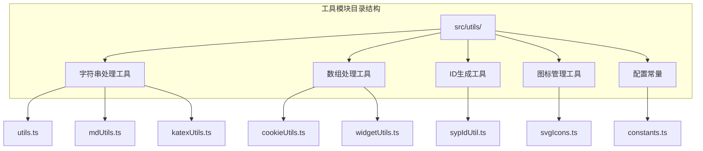
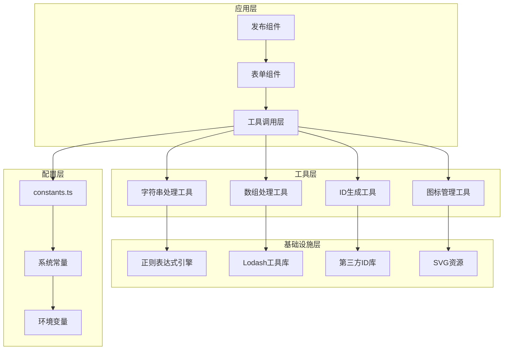
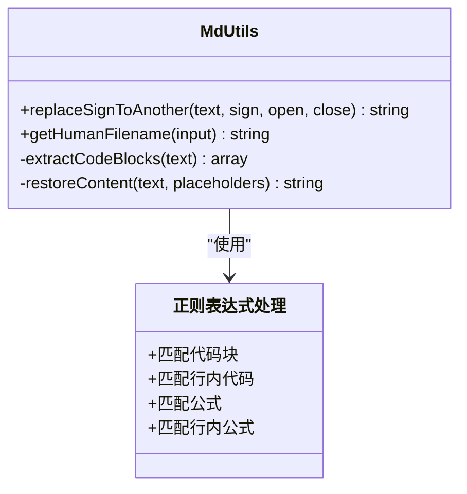
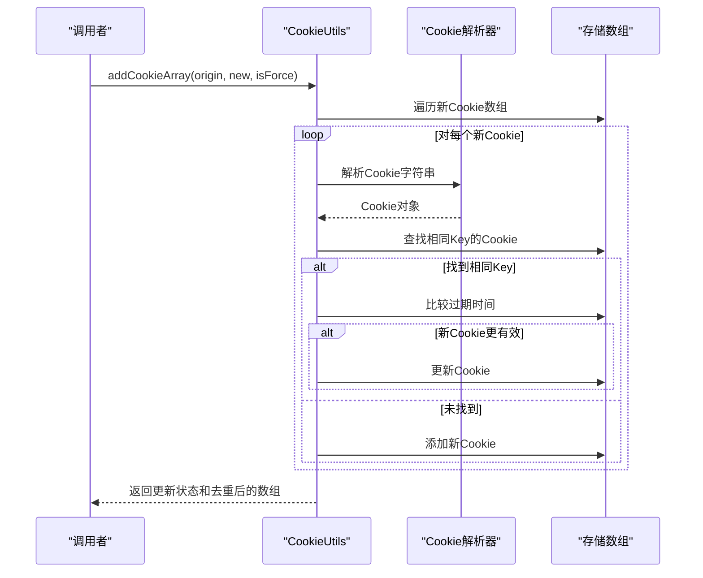
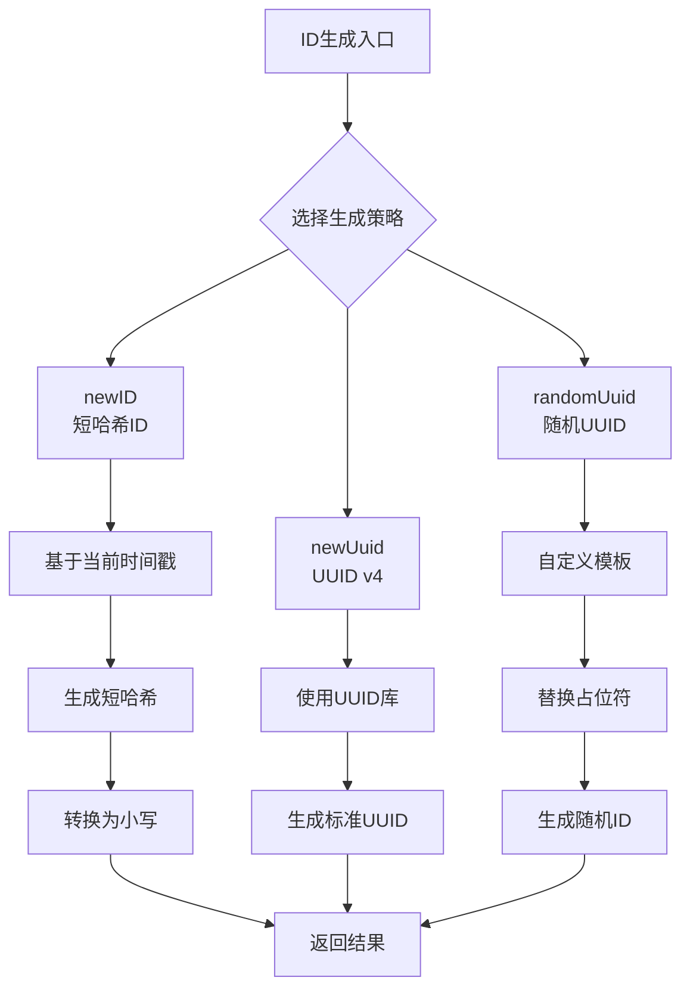
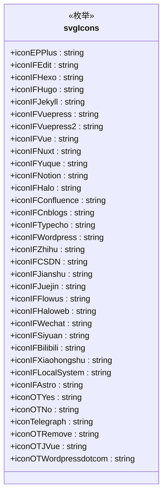
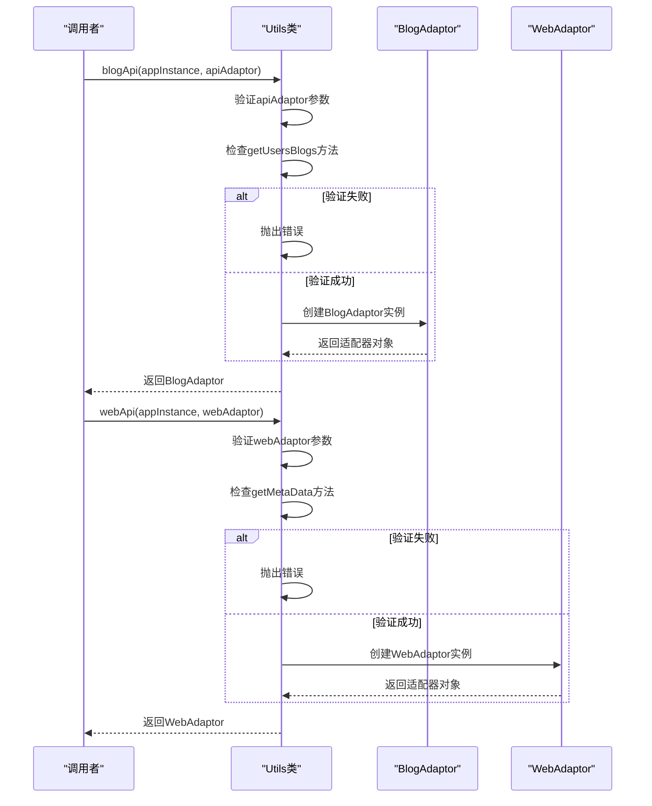
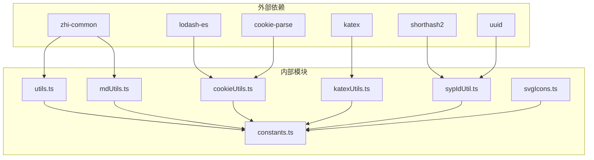

# 字符串和数组工具

<cite>
**本文档引用的文件**
- [utils.ts](file://src/utils/utils.ts)
- [constants.ts](file://src/utils/constants.ts)
- [sypIdUtil.ts](file://src/utils/sypIdUtil.ts)
- [svgIcons.ts](file://src/utils/svgIcons.ts)
- [mdUtils.ts](file://src/utils/mdUtils.ts)
- [cookieUtils.ts](file://src/utils/cookieUtils.ts)
- [katexUtils.ts](file://src/utils/katexUtils.ts)
- [widgetUtils.ts](file://src/utils/widgetUtils.ts)
- [mdUtils.spec.ts](file://src/utils/mdUtils.spec.ts)
- [cookieUtils.spec.ts](file://src/utils/cookieUtils.spec.ts)
- [katexUtils.spec.ts](file://src/utils/katexUtils.spec.ts)
</cite>

## 目录
1. [简介](#简介)
2. [项目结构](#项目结构)
3. [核心组件](#核心组件)
4. [架构概览](#架构概览)
5. [详细组件分析](#详细组件分析)
6. [依赖关系分析](#依赖关系分析)
7. [性能考虑](#性能考虑)
8. [故障排除指南](#故障排除指南)
9. [结论](#结论)

## 简介

本文档详细介绍了 Siyuan 插件发布器项目中的字符串和数组处理工具API。该工具集提供了丰富的字符串操作、数组处理、ID生成、SVG图标管理等功能，旨在为插件开发提供统一的工具支持。

项目采用模块化设计，将不同功能的工具函数组织在独立的文件中，便于维护和扩展。工具集涵盖了从基础字符串处理到复杂的数据操作，从ID生成到图标管理的全方位需求。

## 项目结构

工具模块位于 `src/utils/` 目录下，采用按功能分类的组织方式：

**图表来源**
- [utils.ts:1-97](file://src/utils/utils.ts#L1-L97)
- [mdUtils.ts:1-161](file://src/utils/mdUtils.ts#L1-L161)
- [sypIdUtil.ts:1-47](file://src/utils/sypIdUtil.ts#L1-L47)

## 核心组件

### 字符串处理工具

字符串处理工具主要集中在 `mdUtils.ts` 文件中，提供了强大的Markdown文本处理能力：

- **标记符号替换**：支持将指定标记符号替换为其他格式
- **人类可读文件名生成**：自动处理中英文混合命名
- **正则表达式安全处理**：避免在代码块和公式中误替换

### 数组处理工具

数组处理功能分布在多个文件中：

- **Cookie数组管理**：提供Cookie数组的增删改查功能
- **浏览器窗口管理**：处理Electron环境下的窗口操作
- **通用工具函数**：提供博客API和Web API的适配器

### ID生成工具

ID生成工具位于 `sypIdUtil.ts`，提供多种ID生成策略：

- **短哈希ID**：基于时间戳的短ID生成
- **UUID**：标准UUID v4生成
- **随机UUID**：自定义格式的随机ID生成

### SVG图标管理

图标管理系统位于 `svgIcons.ts`，提供丰富的图标资源：

- **平台专用图标**：支持各种博客平台的图标
- **第三方图标**：集成Element Plus、FontAwesome等图标库
- **自定义图标**：支持动态SVG图标生成

**章节来源**
- [mdUtils.ts:17-158](file://src/utils/mdUtils.ts#L17-L158)
- [cookieUtils.ts:18-118](file://src/utils/cookieUtils.ts#L18-L118)
- [sypIdUtil.ts:10-46](file://src/utils/sypIdUtil.ts#L10-L46)
- [svgIcons.ts:13-53](file://src/utils/svgIcons.ts#L13-L53)

## 架构概览

工具模块采用分层架构设计，各组件之间通过清晰的接口进行交互：

**图表来源**
- [utils.ts:23-96](file://src/utils/utils.ts#L23-L96)
- [constants.ts:10-54](file://src/utils/constants.ts#L10-L54)

## 详细组件分析

### 字符串处理工具类 (MdUtils)

MdUtils类提供了专业的Markdown文本处理功能：

**图表来源**
- [mdUtils.ts:17-158](file://src/utils/mdUtils.ts#L17-L158)

#### 核心功能特性

1. **智能标记符号替换**：能够识别并处理代码块、公式等特殊区域
2. **文件名规范化**：自动处理中英文混合命名，生成符合规范的文件名
3. **正则表达式安全**：避免在技术标记区域内进行误操作

**章节来源**
- [mdUtils.ts:52-129](file://src/utils/mdUtils.ts#L52-L129)

### Cookie管理工具类 (CookieUtils)

CookieUtils类提供了完整的Cookie数组管理功能：

**图表来源**
- [cookieUtils.ts:28-58](file://src/utils/cookieUtils.ts#L28-L58)

#### 主要功能

1. **Cookie数组合并**：智能合并两个Cookie数组
2. **过期时间比较**：自动比较并更新过期时间较长的Cookie
3. **强制更新模式**：支持强制覆盖现有Cookie
4. **Cookie对象解析**：将字符串格式的Cookie解析为对象

**章节来源**
- [cookieUtils.ts:28-115](file://src/utils/cookieUtils.ts#L28-L115)

### ID生成工具 (sypIdUtil)

ID生成工具提供了多种ID生成策略：

**图表来源**
- [sypIdUtil.ts:16-44](file://src/utils/sypIdUtil.ts#L16-L44)

#### 设计原则

1. **多样性**：提供多种ID生成策略满足不同场景需求
2. **安全性**：使用加密安全的随机数生成
3. **兼容性**：支持标准UUID格式和自定义格式

**章节来源**
- [sypIdUtil.ts:16-44](file://src/utils/sypIdUtil.ts#L16-L44)

### SVG图标管理器 (svgIcons)

SVG图标管理器提供了丰富的图标资源：

**图表来源**
- [svgIcons.ts:13-53](file://src/utils/svgIcons.ts#L13-L53)

#### 图标分类

1. **Element Plus图标**：官方UI组件库图标
2. **iconfont图标**：阿里巴巴图标字体库
3. **平台专用图标**：各博客平台特有图标
4. **第三方图标**：FontAwesome等图标库
5. **自定义图标**：项目专用图标

**章节来源**
- [svgIcons.ts:13-53](file://src/utils/svgIcons.ts#L13-L53)

### 通用工具类 (Utils)

通用工具类提供了博客API和Web API的适配器：

**图表来源**
- [utils.ts:26-50](file://src/utils/utils.ts#L26-L50)

#### API适配器功能

1. **博客API适配**：将第三方博客API标准化
2. **Web API适配**：提供统一的Web访问接口
3. **参数验证**：确保适配器实现必要的接口方法

**章节来源**
- [utils.ts:26-96](file://src/utils/utils.ts#L26-L96)

## 依赖关系分析

工具模块之间的依赖关系体现了清晰的分层架构：

**图表来源**
- [utils.ts:10-14](file://src/utils/utils.ts#L10-L14)
- [cookieUtils.ts:10-13](file://src/utils/cookieUtils.ts#L10-L13)

### 依赖特点

1. **最小依赖原则**：每个模块只引入必要的依赖
2. **功能分离**：不同功能使用不同的依赖库
3. **版本控制**：通过package.json统一管理依赖版本

**章节来源**
- [utils.ts:10-14](file://src/utils/utils.ts#L10-L14)
- [cookieUtils.ts:10-13](file://src/utils/cookieUtils.ts#L10-L13)

## 性能考虑

### 字符串处理性能优化

1. **正则表达式缓存**：避免重复编译复杂的正则表达式
2. **惰性加载**：按需加载大型依赖库
3. **内存管理**：及时释放不需要的字符串引用

### 数组处理性能优化

1. **批量操作**：支持批量Cookie数组处理
2. **去重算法**：使用高效的去重算法
3. **增量更新**：只更新发生变化的元素

### ID生成性能优化

1. **缓存机制**：缓存常用的ID生成结果
2. **异步处理**：对于耗时操作使用异步处理
3. **算法优化**：选择高效的ID生成算法

## 故障排除指南

### 常见问题及解决方案

#### 字符串处理问题

1. **正则表达式匹配异常**
   - 检查输入文本是否包含特殊字符
   - 验证正则表达式的正确性
   - 确认文本编码格式

2. **文件名生成不符合预期**
   - 检查输入字符串的字符类型
   - 验证正则表达式的替换规则
   - 确认输出格式要求

#### Cookie处理问题

1. **Cookie解析失败**
   - 检查Cookie字符串格式
   - 验证Cookie的有效性
   - 确认解析库的版本兼容性

2. **Cookie数组合并异常**
   - 检查数组元素格式
   - 验证过期时间比较逻辑
   - 确认去重算法的正确性

#### ID生成问题

1. **ID冲突**
   - 检查ID生成算法的唯一性保证
   - 验证随机数生成器的质量
   - 确认时间戳的精度

2. **ID格式错误**
   - 检查ID生成策略的选择
   - 验证格式化规则
   - 确认输出编码

**章节来源**
- [mdUtils.spec.ts:14-88](file://src/utils/mdUtils.spec.ts#L14-L88)
- [cookieUtils.spec.ts:14-45](file://src/utils/cookieUtils.spec.ts#L14-L45)
- [katexUtils.spec.ts:14-18](file://src/utils/katexUtils.spec.ts#L14-L18)

## 结论

本工具集为SiYuan插件发布器提供了全面的字符串和数组处理能力。通过模块化的架构设计和清晰的功能划分，实现了高内聚、低耦合的工具系统。

### 主要优势

1. **功能完整性**：涵盖了从基础字符串处理到复杂数据操作的全方位需求
2. **扩展性强**：模块化设计便于功能扩展和维护
3. **性能优化**：针对常见使用场景进行了性能优化
4. **错误处理**：完善的错误处理机制确保系统的稳定性

### 设计原则

1. **单一职责**：每个模块专注于特定的功能领域
2. **接口统一**：提供一致的API接口风格
3. **向后兼容**：保持API的向后兼容性
4. **文档完善**：详细的注释和使用说明

该工具集为插件开发提供了坚实的基础，支持各种复杂的发布场景需求，是项目成功的重要保障。