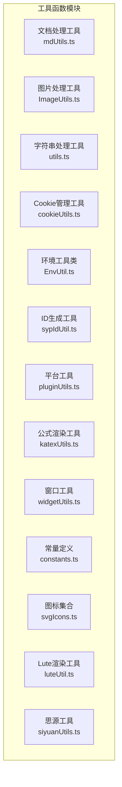
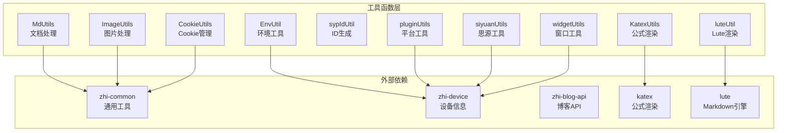
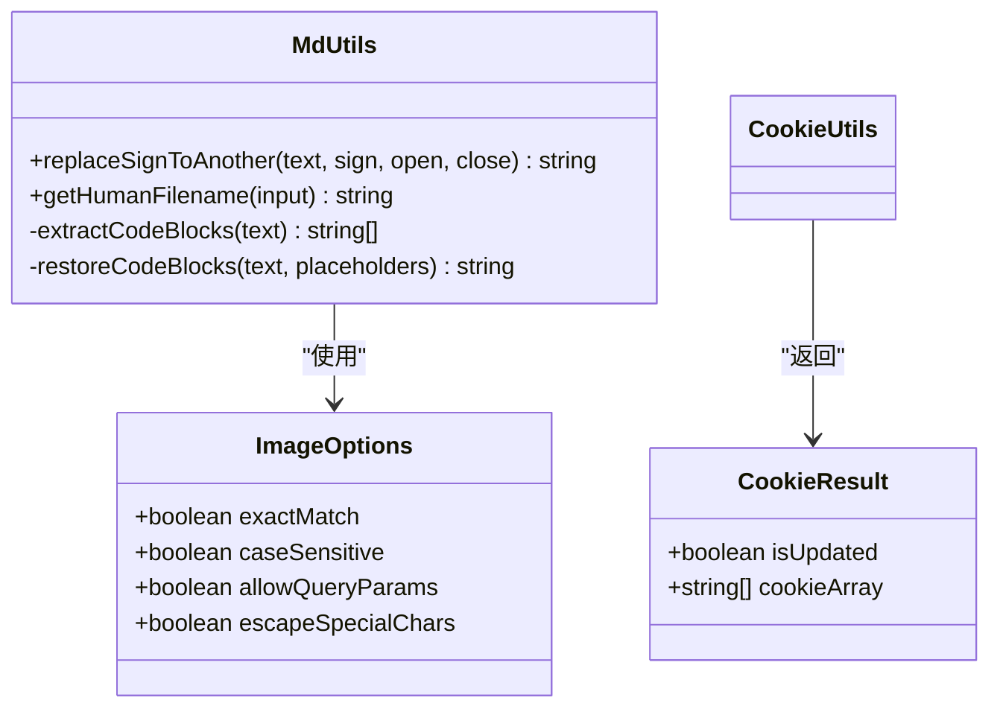
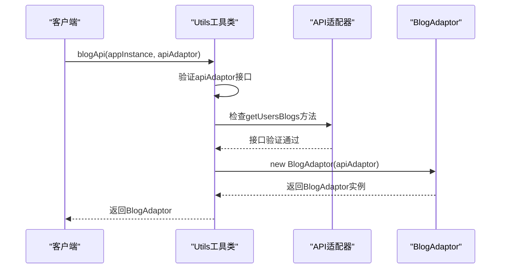
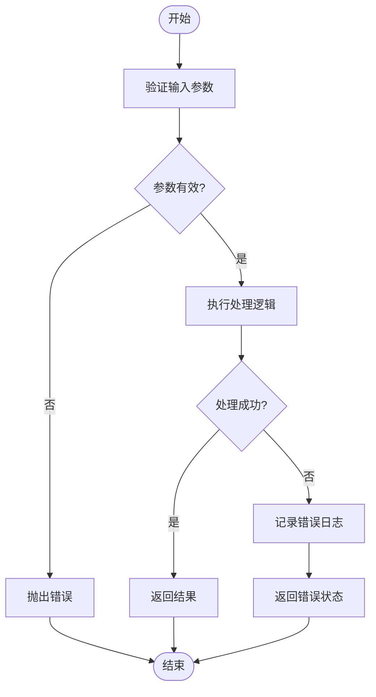
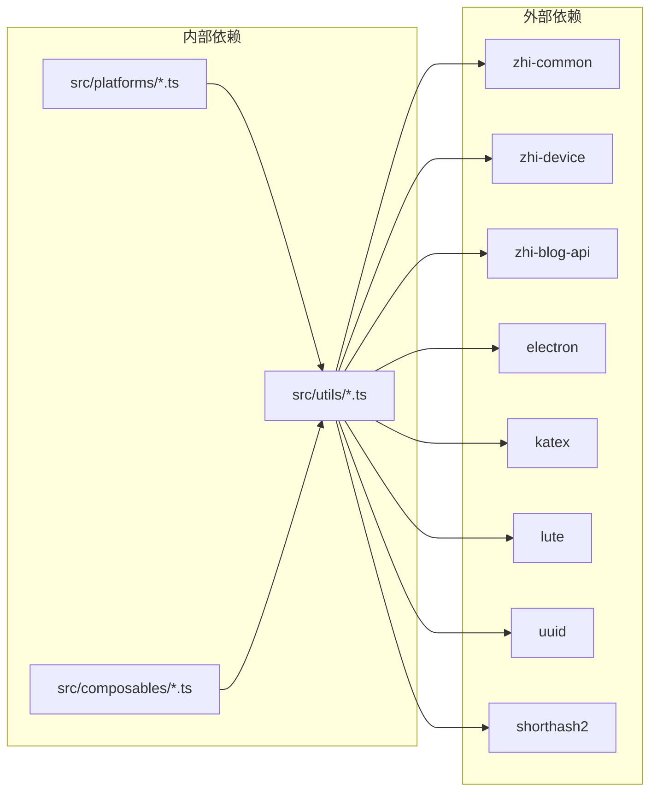

# 工具函数API

<cite>
**本文档引用的文件**
- [utils.ts](file://src/utils/utils.ts)
- [mdUtils.ts](file://src/utils/mdUtils.ts)
- [ImageUtils.ts](file://src/utils/ImageUtils.ts)
- [cookieUtils.ts](file://src/utils/cookieUtils.ts)
- [siyuanUtils.ts](file://src/utils/siyuanUtils.ts)
- [luteUtil.ts](file://src/utils/luteUtil.ts)
- [constants.ts](file://src/utils/constants.ts)
- [pluginUtils.ts](file://src/utils/pluginUtils.ts)
- [katexUtils.ts](file://src/utils/katexUtils.ts)
- [EnvUtil.ts](file://src/utils/EnvUtil.ts)
- [svgIcons.ts](file://src/utils/svgIcons.ts)
- [sypIdUtil.ts](file://src/utils/sypIdUtil.ts)
- [widgetUtils.ts](file://src/utils/widgetUtils.ts)
</cite>

## 目录
1. [简介](#简介)
2. [项目结构](#项目结构)
3. [核心组件](#核心组件)
4. [架构概览](#架构概览)
5. [详细组件分析](#详细组件分析)
6. [依赖关系分析](#依赖关系分析)
7. [性能考虑](#性能考虑)
8. [故障排除指南](#故障排除指南)
9. [结论](#结论)

## 简介

本文档详细记录了思源笔记发布插件中的工具函数API，涵盖了文档处理、图片处理、字符串处理、数组操作、Cookie管理、环境工具等多个功能模块。每个工具函数都提供了完整的函数签名、参数类型、返回值、使用示例、功能描述、适用场景、性能特性和注意事项。

## 项目结构

工具函数主要位于 `src/utils/` 目录下，按照功能模块进行组织：

**图表来源**
- [utils.ts:1-97](file://src/utils/utils.ts#L1-L97)
- [mdUtils.ts:1-161](file://src/utils/mdUtils.ts#L1-L161)
- [ImageUtils.ts:1-209](file://src/utils/ImageUtils.ts#L1-L209)

## 核心组件

### 文档处理工具 (MdUtils)

文档处理工具提供了Markdown文本处理功能，主要包括标记符号替换和文件名规范化。

**函数列表：**

1. **replaceSignToAnother**
   - 函数签名：`replaceSignToAnother(text: string, sign: string, open: string, close: string): string`
   - 参数：
     - `text`: 待处理的Markdown文本
     - `sign`: 要替换的标记符号
     - `open`: 替换后的开头内容
     - `close`: 替换后的结尾内容
   - 返回值：处理后的文本
   - 功能：将指定标记符号之间的内容替换为新的格式，同时避免在代码块、公式等特殊区域进行替换
   - 适用场景：Markdown格式转换、内容格式化

2. **getHumanFilename**
   - 函数签名：`getHumanFilename(input: string): string`
   - 参数：`input`: 输入字符串
   - 返回值：人类可读的文件名
   - 功能：将输入字符串转换为适合文件名使用的格式，自动处理中英文字符间的连接、非法字符过滤等
   - 适用场景：自动生成文件名、URL安全的文件名生成

### 图片处理工具 (ImageUtils)

图片处理工具提供了图片URL匹配、提取和处理功能。

**函数列表：**

1. **genImageRegex**
   - 函数签名：`genImageRegex(imageUrl: string, options?: ImageOptions): RegExp`
   - 参数：
     - `imageUrl`: 图片URL
     - `options`: 配置选项
   - 返回值：正则表达式对象
   - 功能：生成匹配包含指定图片URL的img标签的正则表达式
   - 适用场景：HTML中图片标签的查找和替换

2. **genMdImageRegex**
   - 函数签名：`genMdImageRegex(imageUrl: string, options?: ImageOptions): RegExp`
   - 参数：
     - `imageUrl`: 图片URL
     - `options`: 配置选项
   - 返回值：正则表达式对象
   - 功能：生成匹配Markdown图片语法的正则表达式
   - 适用场景：Markdown文本中图片链接的处理

3. **hasImageTag**
   - 函数签名：`hasImageTag(html: string): boolean`
   - 参数：`html`: HTML内容
   - 返回值：是否包含图片标签
   - 功能：检查HTML中是否包含图片标签
   - 适用场景：内容分析、图片存在性检测

4. **extractImageUrls**
   - 函数签名：`extractImageUrls(html: string): string[]`
   - 参数：`html`: HTML内容
   - 返回值：图片URL数组
   - 功能：从HTML中提取所有图片URL
   - 适用场景：批量图片处理、图片收集

5. **getNameFromImageUrl**
   - 函数签名：`getNameFromImageUrl(imageUrl: any): string`
   - 参数：`imageUrl`: 图片URL
   - 返回值：文件名（不含扩展名）
   - 功能：从图片URL中提取文件名
   - 适用场景：文件名提取、图片识别

### 字符串处理工具 (Utils)

通用字符串处理工具提供了博客API适配器创建和字符串处理功能。

**函数列表：**

1. **blogApi**
   - 函数签名：`blogApi(appInstance: PublisherAppInstance, apiAdaptor: any): BlogAdaptor`
   - 参数：
     - `appInstance`: 应用实例
     - `apiAdaptor`: API适配器
   - 返回值：BlogAdaptor实例
   - 功能：创建博客API适配器，验证适配器接口完整性
   - 适用场景：API适配器初始化、接口验证

2. **webApi**
   - 函数签名：`webApi(appInstance: PublisherAppInstance, webAdaptor: any): WebAdaptor`
   - 参数：
     - `appInstance`: 应用实例
     - `webAdaptor`: Web适配器
   - 返回值：WebAdaptor实例
   - 功能：创建Web API适配器，验证适配器接口完整性
   - 适用场景：Web API适配器初始化、接口验证

3. **emptyOrDefault**
   - 函数签名：`emptyOrDefault(value: any, defaultValue: any): any`
   - 参数：
     - `value`: 输入值
     - `defaultValue`: 默认值
   - 返回值：处理后的值
   - 功能：处理空值或空白字符串，返回默认值
   - 适用场景：数据验证、默认值处理

4. **emptyBooleanOrDefault**
   - 函数签名：`emptyBooleanOrDefault(value: any, defaultValue: any): any`
   - 参数：
     - `value`: 输入值
     - `defaultValue`: 默认值
   - 返回值：布尔值或原始值
   - 功能：处理未定义的布尔值，返回默认布尔值
   - 适用场景：布尔值验证、配置项处理

### Cookie管理工具 (CookieUtils)

Cookie管理工具提供了Cookie数组操作和Cookie解析功能。

**函数列表：**

1. **addCookieArray**
   - 函数签名：`addCookieArray(originCookieArray: string[], newCookieArray: string[], isForce: boolean = false): CookieResult`
   - 参数：
     - `originCookieArray`: 原始Cookie数组
     - `newCookieArray`: 新Cookie数组
     - `isForce`: 是否强制更新
   - 返回值：包含更新状态和去重后数组的对象
   - 功能：合并Cookie数组，根据过期时间智能更新
   - 适用场景：Cookie合并、去重处理

2. **getCookie**
   - 函数签名：`getCookie(cookieArray: string[], key: string): string | undefined`
   - 参数：
     - `cookieArray`: Cookie数组
     - `key`: Cookie键名
   - 返回值：匹配的Cookie字符串
   - 功能：根据键名从Cookie数组中获取Cookie
   - 适用场景：Cookie查找、身份验证

3. **getCookieFromString**
   - 函数签名：`getCookieFromString(cookieName: string, cookieString?: string): string`
   - 参数：
     - `cookieName`: Cookie名称
     - `cookieString`: Cookie字符串
   - 返回值：Cookie值
   - 功能：从字符串中解析指定名称的Cookie值
   - 适用场景：Cookie解析、字符串处理

4. **getCookieObject**
   - 函数签名：`getCookieObject(cookieArray: string[], key: string): any`
   - 参数：
     - `cookieArray`: Cookie数组
     - `key`: Cookie键名
   - 返回值：Cookie对象
   - 功能：获取指定Cookie的解析对象
   - 适用场景：Cookie对象化、数据访问

### 环境工具类 (EnvUtil)

环境工具类提供了文件系统操作和环境检测功能。

**函数列表：**

1. **isSiyuanElectron**
   - 函数签名：`isSiyuanElectron(): boolean`
   - 参数：无
   - 返回值：是否为思源Electron环境
   - 功能：检测当前运行环境是否为思源Electron
   - 适用场景：环境判断、功能启用控制

2. **ensurePath**
   - 函数签名：`ensurePath(path: string, ignorePath?: string): boolean`
   - 参数：
     - `path`: 路径
     - `ignorePath`: 忽略路径
   - 返回值：操作是否成功
   - 功能：确保路径存在，不存在则递归创建
   - 适用场景：目录创建、路径准备

3. **writeFile**
   - 函数签名：`writeFile(filePath: string, content: string): boolean`
   - 参数：
     - `filePath`: 文件路径
     - `content`: 文件内容
   - 返回值：写入是否成功
   - 功能：写入文件内容（假设目录已存在）
   - 适用场景：文件写入、内容保存

4. **deleteFile**
   - 函数签名：`deleteFile(filePath: string): boolean`
   - 参数：`filePath`: 文件路径
   - 返回值：删除是否成功
   - 功能：删除指定文件
   - 适用场景：文件清理、资源释放

5. **writeBinaryFile**
   - 函数签名：`writeBinaryFile(filePath: string, data: Uint8Array): boolean`
   - 参数：
     - `filePath`: 文件路径
     - `data`: 二进制数据
   - 返回值：写入是否成功
   - 功能：写入二进制文件
   - 适用场景：图片保存、文件传输

6. **dirname**
   - 函数签名：`dirname(filePath: string): string`
   - 参数：`filePath`: 文件路径
   - 返回值：目录名
   - 功能：获取文件所在目录
   - 适用场景：路径解析、目录操作

7. **sanitizeFilename**
   - 函数签名：`sanitizeFilename(filename: string): string`
   - 参数：`filename`: 原始文件名
   - 返回值：安全的文件名
   - 功能：清理文件名中的非法字符
   - 适用场景：文件名标准化、安全处理

8. **joinPath**
   - 函数签名：`joinPath(...parts: string[]): string`
   - 参数：`parts`: 路径组成部分
   - 返回值：拼接后的路径
   - 功能：拼接文件路径
   - 适用场景：路径组合、文件定位

### 公式渲染工具 (KatexUtils)

公式渲染工具提供了KaTeX公式渲染功能。

**函数列表：**

1. **renderToString**
   - 函数签名：`renderToString(mathExpression: string): string`
   - 参数：`mathExpression`: 数学表达式
   - 返回值：渲染后的HTML字符串
   - 功能：将KaTeX表达式渲染为HTML
   - 适用场景：数学公式显示、内容渲染

### 思源工具 (siyuanUtils)

思源工具提供了思源笔记相关功能。

**函数列表：**

1. **isFileExists**
   - 函数签名：`isFileExists(kernelApi: SiyuanKernelApi, p: string, type: "text" | "json"): Promise<boolean>`
   - 参数：
     - `kernelApi`: 思源内核API
     - `p`: 路径
     - `type`: 文件类型
   - 返回值：文件是否存在
   - 功能：检查文件是否存在
   - 适用场景：文件存在性检查、资源验证

2. **getSiyuanWidgetId**
   - 函数签名：`getSiyuanWidgetId(): string`
   - 参数：无
   - 返回值：挂件ID
   - 功能：获取挂件所在的块ID
   - 适用场景：挂件识别、页面定位

3. **getSiyuanPageId**
   - 函数签名：`getSiyuanPageId(pageId?: string, force?: boolean): Promise<string>`
   - 参数：
     - `pageId`: 页面ID
     - `force`: 是否强制
   - 返回值：页面ID
   - 功能：获取思源页面ID，支持多种获取方式
   - 适用场景：页面ID获取、上下文识别

### ID生成工具 (sypIdUtil)

ID生成工具提供了多种ID生成方法。

**函数列表：**

1. **newID**
   - 函数签名：`newID(): string`
   - 参数：无
   - 返回值：短哈希ID
   - 功能：基于当前时间生成短哈希ID
   - 适用场景：临时标识符、快速ID生成

2. **newUuid**
   - 函数签名：`newUuid(): string`
   - 参数：无
   - 返回值：UUID v4
   - 功能：生成标准UUID v4
   - 适用场景：全局唯一标识符、持久化ID

3. **randomUuid**
   - 函数签名：`randomUuid(): string`
   - 参数：无
   - 返回值：随机UUID
   - 功能：生成随机UUID
   - 适用场景：测试ID、临时标识符

### 平台工具 (pluginUtils)

平台工具提供了插件检测功能。

**函数列表：**

1. **preCheckPicgoPlugin**
   - 函数签名：`preCheckPicgoPlugin(): Promise<boolean>`
   - 参数：无
   - 返回值：插件是否存在
   - 功能：检测PicGo插件是否安装
   - 适用场景：插件依赖检查、功能启用

2. **preCheckBlogPlugin**
   - 函数签名：`preCheckBlogPlugin(): Promise<boolean>`
   - 参数：无
   - 返回值：插件是否存在
   - 功能：检测Blog插件是否安装
   - 适用场景：插件依赖检查、功能启用

### 窗口工具 (widgetUtils)

窗口工具提供了浏览器窗口管理和页面ID获取功能。

**函数列表：**

1. **openBrowserWindow**
   - 函数签名：`openBrowserWindow(url: string, dynCfg?: DynamicConfig, cookieCb?: any, extraScriptCb?: any, isDevMode?: boolean): void`
   - 参数：
     - `url`: 目标URL
     - `dynCfg`: 动态配置
     - `cookieCb`: Cookie回调
     - `extraScriptCb`: 额外脚本回调
     - `isDevMode`: 开发模式
   - 返回值：无
   - 功能：打开网页弹窗，支持多种配置选项
   - 适用场景：外部网站访问、认证流程

2. **getWidgetId**
   - 函数签名：`getWidgetId(): string | undefined`
   - 参数：无
   - 返回值：挂件ID
   - 功能：获取挂件所在的块ID
   - 适用场景：挂件识别、页面定位

### 常量定义 (constants.ts)

提供了系统常量和配置项。

**常量列表：**
- `isDev`: 开发模式标志
- `appBase`: 应用基础路径
- `aboutUrl`: 关于页面URL
- `DYNAMIC_CONFIG_KEY`: 动态配置键
- `CATE_AUTO_NAME`: 自动分类占位符
- `MAX_TITLE_LENGTH`: 标题最大长度
- `LEGENCY_SHARED_API`: 旧版通用API
- `LEGENCY_SHARED_PROXT_MIDDLEWARE`: 旧版代理中间件

### 图标集合 (svgIcons.ts)

提供了各种平台和功能的SVG图标。

**图标类别：**
- 博客平台图标：Hexo、Hugo、Jekyll、VuePress等
- 社交媒体图标：知乎、CSDN、简书、掘金等
- 技术平台图标：GitHub、GitLab、Confluence等
- 其他功能图标：本地系统、Astro、Telegraph等

### Lute渲染工具 (luteUtil.ts)

Lute渲染工具提供了Markdown到HTML的渲染功能。

**函数列表：**

1. **mdToHtml**
   - 函数签名：`mdToHtml(md: string): string`
   - 参数：`md`: Markdown内容
   - 返回值：HTML内容
   - 功能：使用Lute引擎渲染Markdown为HTML
   - 适用场景：内容渲染、格式转换

## 架构概览

**图表来源**
- [utils.ts:10-14](file://src/utils/utils.ts#L10-L14)
- [mdUtils.ts:10-16](file://src/utils/mdUtils.ts#L10-L16)
- [ImageUtils.ts:10-13](file://src/utils/ImageUtils.ts#L10-L13)

## 详细组件分析

### 文档处理工具详细分析

**图表来源**
- [mdUtils.ts:17-158](file://src/utils/mdUtils.ts#L17-L158)
- [ImageUtils.ts:20-85](file://src/utils/ImageUtils.ts#L20-L85)
- [cookieUtils.ts:28-58](file://src/utils/cookieUtils.ts#L28-L58)

### API调用流程图

**图表来源**
- [utils.ts:26-50](file://src/utils/utils.ts#L26-L50)

### 错误处理流程

**图表来源**
- [utils.ts:26-50](file://src/utils/utils.ts#L26-L50)
- [cookieUtils.ts:28-58](file://src/utils/cookieUtils.ts#L28-L58)

## 依赖关系分析

**图表来源**
- [utils.ts:10-15](file://src/utils/utils.ts#L10-L15)
- [widgetUtils.ts:9-16](file://src/utils/widgetUtils.ts#L9-L16)

### 组件耦合度分析

工具函数模块具有以下特点：

1. **低耦合设计**：各工具类相对独立，通过明确的接口进行交互
2. **单一职责**：每个工具类专注于特定功能领域
3. **可测试性**：函数式设计便于单元测试
4. **可扩展性**：遵循开放封闭原则，易于扩展新功能

**章节来源**
- [utils.ts:16-93](file://src/utils/utils.ts#L16-L93)
- [mdUtils.ts:17-158](file://src/utils/mdUtils.ts#L17-L158)
- [ImageUtils.ts:13-162](file://src/utils/ImageUtils.ts#L13-L162)

## 性能考虑

### 时间复杂度分析

1. **字符串处理函数**：通常为O(n)时间复杂度，其中n为字符串长度
2. **正则表达式匹配**：取决于输入大小和正则复杂度
3. **文件系统操作**：O(1)到O(log n)，取决于文件系统实现
4. **Cookie处理**：线性扫描数组，O(n)时间复杂度

### 内存使用优化

1. **正则表达式复用**：避免重复创建相同的正则表达式
2. **字符串缓冲区**：使用模板字符串减少中间对象创建
3. **异步操作**：文件操作采用异步方式避免阻塞主线程
4. **缓存策略**：对频繁使用的配置进行缓存

### 最佳实践建议

1. **输入验证**：始终验证函数参数的有效性
2. **错误处理**：提供详细的错误信息和回退机制
3. **资源管理**：及时释放文件句柄和网络连接
4. **日志记录**：适当的日志级别和信息量
5. **性能监控**：对关键路径进行性能监控

## 故障排除指南

### 常见问题及解决方案

1. **API适配器错误**
   - 症状：`apiAdaptor must implements BlogApi`
   - 解决方案：确保适配器实现必需的方法接口

2. **Cookie解析失败**
   - 症状：`Failed to parse cookie`
   - 解决方案：检查Cookie格式和编码

3. **文件系统操作失败**
   - 症状：文件写入或删除失败
   - 解决方案：检查文件权限和路径有效性

4. **正则表达式匹配异常**
   - 症状：图片URL匹配不准确
   - 解决方案：验证正则表达式和转义字符

### 调试技巧

1. **启用详细日志**：使用调试模式查看详细执行信息
2. **参数验证**：打印关键参数值确认正确性
3. **分步执行**：将复杂操作分解为多个简单步骤
4. **边界测试**：测试空值、特殊字符等边界情况

**章节来源**
- [utils.ts:31-36](file://src/utils/utils.ts#L31-L36)
- [cookieUtils.ts:105-115](file://src/utils/cookieUtils.ts#L105-L115)
- [EnvUtil.ts:68-71](file://src/utils/EnvUtil.ts#L68-L71)

## 结论

本文档全面介绍了思源笔记发布插件中的工具函数API，涵盖了从基础字符串处理到复杂的文件系统操作等各个层面。每个工具函数都经过精心设计，具有明确的职责分工、良好的错误处理机制和完善的性能考虑。

工具函数的设计遵循了以下原则：
- **单一职责**：每个函数专注于特定功能
- **接口清晰**：明确的参数和返回值约定
- **错误处理**：完善的异常处理和回退机制
- **性能优化**：考虑时间复杂度和内存使用
- **可扩展性**：易于添加新功能和修改现有功能

通过合理使用这些工具函数，开发者可以高效地构建和维护复杂的发布系统，同时确保代码的可维护性和可靠性。