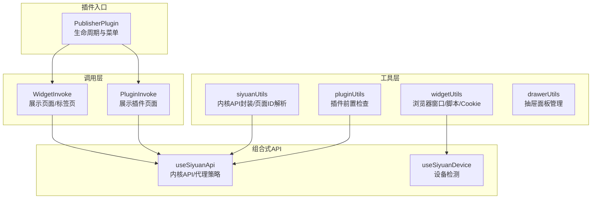
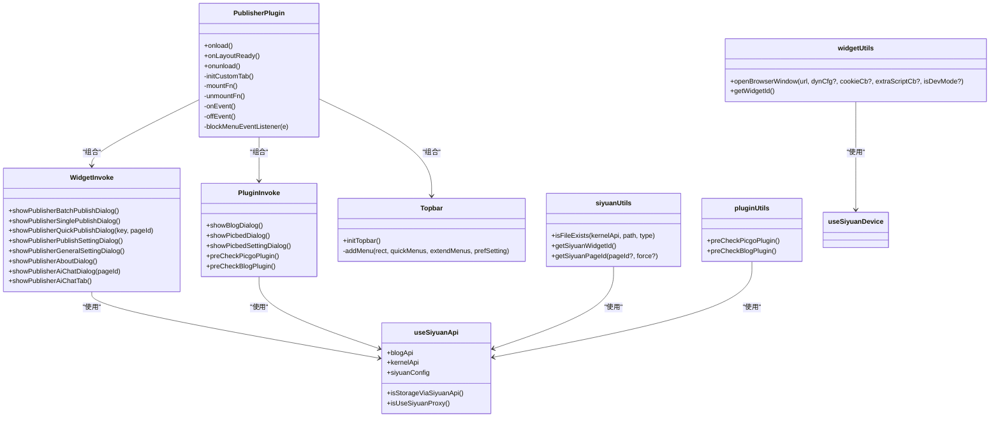
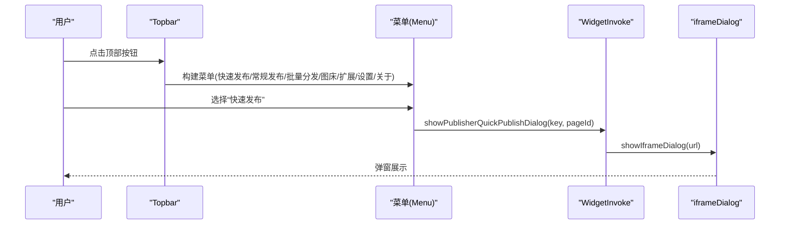
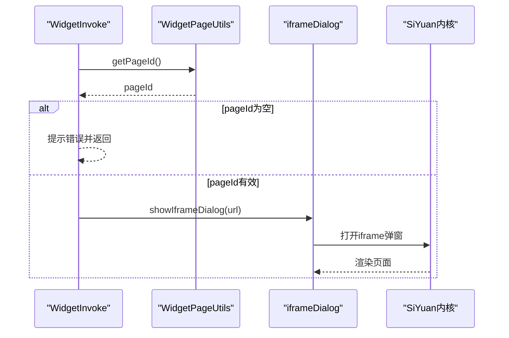
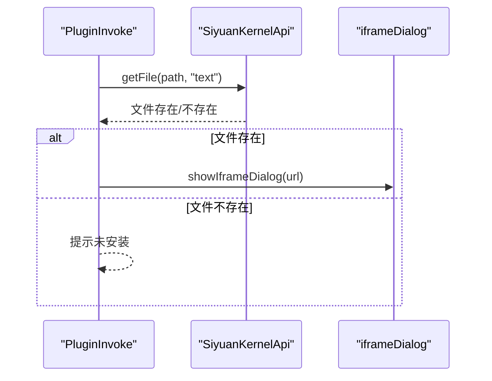
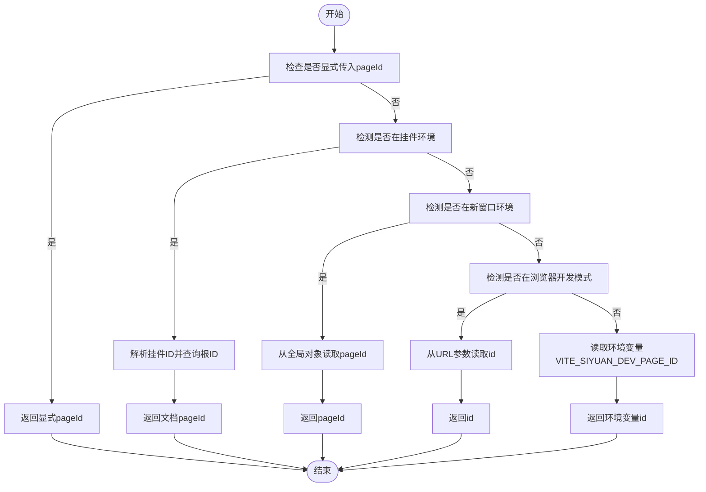
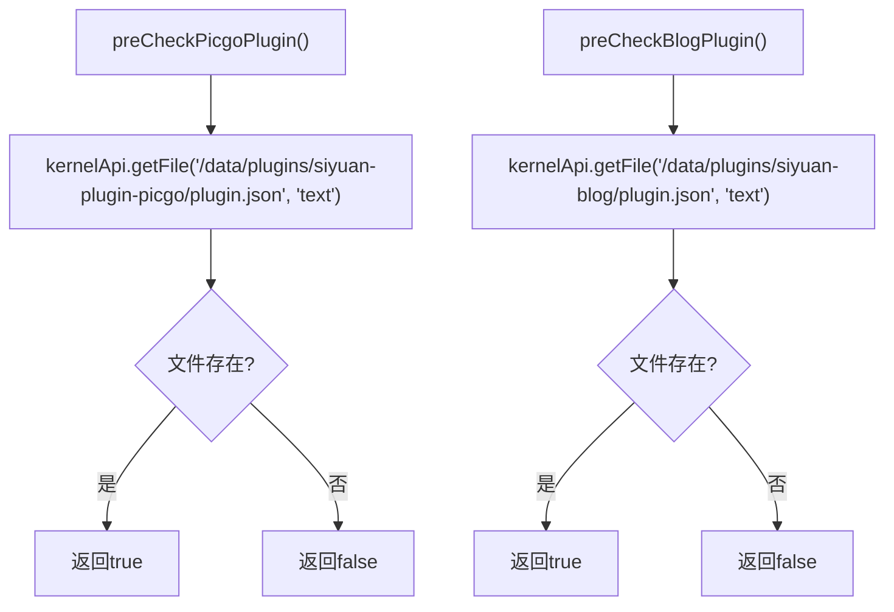
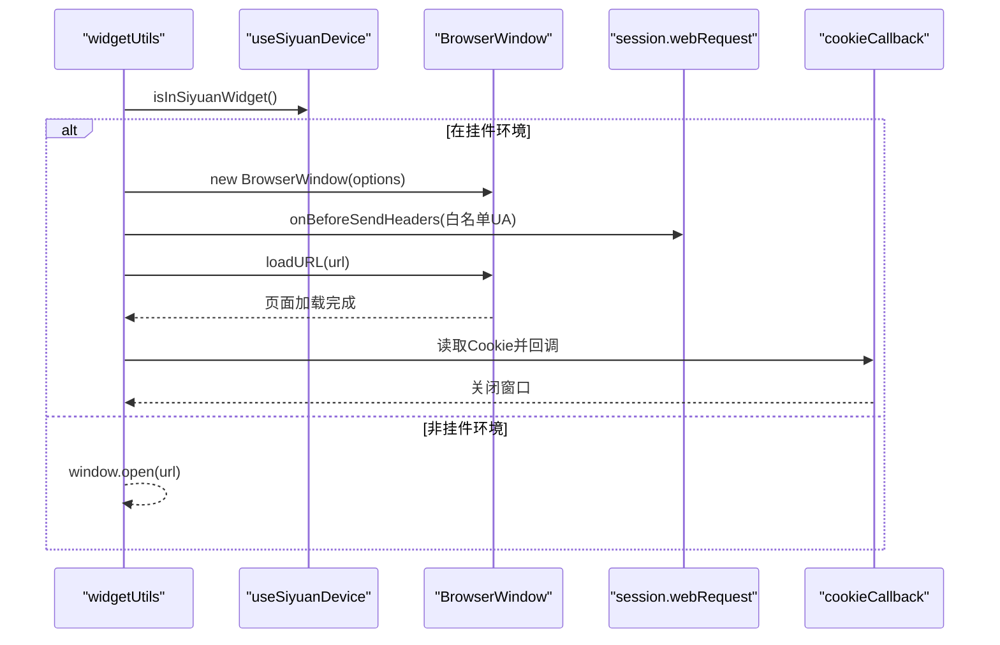
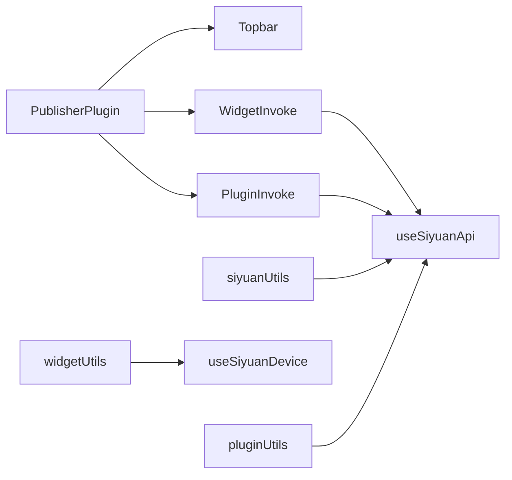

# 思源集成工具

<cite>
**本文引用的文件**
- [siyuan/index.ts](file://siyuan/index.ts)
- [siyuan/invoke/widgetInvoke.ts](file://siyuan/invoke/widgetInvoke.ts)
- [siyuan/invoke/pluginInvoke.ts](file://siyuan/invoke/pluginInvoke.ts)
- [siyuan/topbar.ts](file://siyuan/topbar.ts)
- [siyuan/iframeDialog.ts](file://siyuan/iframeDialog.ts)
- [siyuan/utils/widgetPageUtils.ts](file://siyuan/utils/widgetPageUtils.ts)
- [siyuan/utils/utils.ts](file://siyuan/utils/utils.ts)
- [src/utils/siyuanUtils.ts](file://src/utils/siyuanUtils.ts)
- [src/utils/pluginUtils.ts](file://src/utils/pluginUtils.ts)
- [src/utils/widgetUtils.ts](file://src/utils/widgetUtils.ts)
- [src/utils/drawerUtils.ts](file://src/utils/drawerUtils.ts)
- [src/composables/useSiyuanApi.ts](file://src/composables/useSiyuanApi.ts)
- [src/composables/useSiyuanDevice.ts](file://src/composables/useSiyuanDevice.ts)
- [src/platforms/dynamicConfig.ts](file://src/platforms/dynamicConfig.ts)
- [src/utils/utils.ts](file://src/utils/utils.ts)
</cite>

## 目录
1. [简介](#简介)
2. [项目结构](#项目结构)
3. [核心组件](#核心组件)
4. [架构总览](#架构总览)
5. [详细组件分析](#详细组件分析)
6. [依赖关系分析](#依赖关系分析)
7. [性能考量](#性能考量)
8. [故障排查指南](#故障排查指南)
9. [结论](#结论)
10. [附录](#附录)

## 简介
本文件为“思源笔记集成工具”的API文档，聚焦于与思源内核交互、插件开发、Widget集成、抽屉面板等工具函数。内容覆盖以下模块：
- siyuanUtils：封装思源内核API调用、页面ID解析、挂件ID解析等
- pluginUtils：插件前置检查（如PicGo、博客插件）
- widgetUtils：浏览器窗口打开、Cookie读取、挂件页面ID解析等
- drawerUtils：抽屉面板管理（当前为空实现，预留扩展）

同时，文档给出与思源内核交互、插件生命周期、Widget渲染的完整示例流程，并总结思源生态的集成模式与开发规范。

## 项目结构
该项目采用“插件入口 + 调用层 + 工具层 + 组合式API”的分层设计：
- 插件入口：负责生命周期、菜单初始化、事件绑定
- 调用层：封装Widget与Plugin的展示逻辑
- 工具层：提供设备检测、API封装、页面ID解析、窗口打开等通用能力
- 组合式API：集中管理配置、设备类型判断、代理策略等

图表来源
- [siyuan/index.ts:46-190](file://siyuan/index.ts#L46-L190)
- [siyuan/invoke/widgetInvoke.ts:37-170](file://siyuan/invoke/widgetInvoke.ts#L37-L170)
- [siyuan/invoke/pluginInvoke.ts:36-100](file://siyuan/invoke/pluginInvoke.ts#L36-L100)
- [src/utils/siyuanUtils.ts:17-119](file://src/utils/siyuanUtils.ts#L17-L119)
- [src/utils/pluginUtils.ts:19-31](file://src/utils/pluginUtils.ts#L19-L31)
- [src/utils/widgetUtils.ts:17-295](file://src/utils/widgetUtils.ts#L17-L295)
- [src/utils/drawerUtils.ts:10-12](file://src/utils/drawerUtils.ts#L10-L12)
- [src/composables/useSiyuanApi.ts:20-76](file://src/composables/useSiyuanApi.ts#L20-L76)
- [src/composables/useSiyuanDevice.ts:16-83](file://src/composables/useSiyuanDevice.ts#L16-L83)

章节来源
- [siyuan/index.ts:46-190](file://siyuan/index.ts#L46-L190)
- [src/composables/useSiyuanApi.ts:20-76](file://src/composables/useSiyuanApi.ts#L20-L76)
- [src/composables/useSiyuanDevice.ts:16-83](file://src/composables/useSiyuanDevice.ts#L16-L83)

## 核心组件
- PublisherPlugin：插件入口，负责生命周期、顶部栏菜单、自定义Tab、事件绑定
- WidgetInvoke：封装Widget展示逻辑（对话框、标签页、页面跳转）
- PluginInvoke：封装外部插件（如PicGo、博客）的展示与前置检查
- siyuanUtils：封装内核API、页面ID解析、挂件ID解析
- pluginUtils：插件前置检查（PicGo、博客）
- widgetUtils：浏览器窗口打开、Cookie读取、UA适配、额外脚本执行
- drawerUtils：抽屉面板管理（当前为空实现）
- useSiyuanApi：统一内核API与代理策略
- useSiyuanDevice：设备类型检测（主窗口、挂件、浏览器、扩展）

章节来源
- [siyuan/index.ts:46-190](file://siyuan/index.ts#L46-L190)
- [siyuan/invoke/widgetInvoke.ts:37-170](file://siyuan/invoke/widgetInvoke.ts#L37-L170)
- [siyuan/invoke/pluginInvoke.ts:36-100](file://siyuan/invoke/pluginInvoke.ts#L36-L100)
- [src/utils/siyuanUtils.ts:17-119](file://src/utils/siyuanUtils.ts#L17-L119)
- [src/utils/pluginUtils.ts:19-31](file://src/utils/pluginUtils.ts#L19-L31)
- [src/utils/widgetUtils.ts:17-295](file://src/utils/widgetUtils.ts#L17-L295)
- [src/utils/drawerUtils.ts:10-12](file://src/utils/drawerUtils.ts#L10-L12)
- [src/composables/useSiyuanApi.ts:20-76](file://src/composables/useSiyuanApi.ts#L20-L76)
- [src/composables/useSiyuanDevice.ts:16-83](file://src/composables/useSiyuanDevice.ts#L16-L83)

## 架构总览
整体架构围绕“插件入口”为中心，向上提供菜单与事件，向下通过调用层与工具层完成与思源内核、外部插件、浏览器窗口的交互。

图表来源
- [siyuan/index.ts:46-190](file://siyuan/index.ts#L46-L190)
- [siyuan/invoke/widgetInvoke.ts:37-170](file://siyuan/invoke/widgetInvoke.ts#L37-L170)
- [siyuan/invoke/pluginInvoke.ts:36-100](file://siyuan/invoke/pluginInvoke.ts#L36-L100)
- [src/composables/useSiyuanApi.ts:20-76](file://src/composables/useSiyuanApi.ts#L20-L76)
- [src/utils/siyuanUtils.ts:17-119](file://src/utils/siyuanUtils.ts#L17-L119)
- [src/utils/widgetUtils.ts:17-295](file://src/utils/widgetUtils.ts#L17-L295)
- [src/utils/pluginUtils.ts:19-31](file://src/utils/pluginUtils.ts#L19-L31)

## 详细组件分析

### 插件入口与生命周期（PublisherPlugin）
- 生命周期：onload、onLayoutReady、onunload
- 菜单：顶部栏按钮，点击后构建快速发布、常规发布、批量分发、图床管理、AI工具、扩展功能、设置、关于等菜单
- 自定义Tab：注册并复用自定义Tab实例
- 事件：监听编辑器标题图标点击，注入“快速发布”与“AI聊天”菜单

图表来源
- [siyuan/topbar.ts:52-259](file://siyuan/topbar.ts#L52-L259)
- [siyuan/invoke/widgetInvoke.ts:96-103](file://siyuan/invoke/widgetInvoke.ts#L96-L103)
- [siyuan/iframeDialog.ts:39-64](file://siyuan/iframeDialog.ts#L39-L64)

章节来源
- [siyuan/index.ts:81-100](file://siyuan/index.ts#L81-L100)
- [siyuan/topbar.ts:52-259](file://siyuan/topbar.ts#L52-L259)

### Widget集成（WidgetInvoke）
- 页面展示：支持带参数的页面跳转，可选择是否刷新
- 标签页展示：通过openTab创建自定义Tab，嵌入iframe
- 页面ID解析：通过WidgetPageUtils.getPageId()获取当前文档ID

图表来源
- [siyuan/invoke/widgetInvoke.ts:46-142](file://siyuan/invoke/widgetInvoke.ts#L46-L142)
- [siyuan/utils/widgetPageUtils.ts:30-37](file://siyuan/utils/widgetPageUtils.ts#L30-L37)
- [siyuan/iframeDialog.ts:39-64](file://siyuan/iframeDialog.ts#L39-L64)

章节来源
- [siyuan/invoke/widgetInvoke.ts:46-142](file://siyuan/invoke/widgetInvoke.ts#L46-L142)
- [siyuan/utils/widgetPageUtils.ts:30-37](file://siyuan/utils/widgetPageUtils.ts#L30-L37)

### 插件开发（PluginInvoke）
- 展示外部插件页面：博客、图床、图床设置
- 前置检查：检测PicGo与博客插件是否安装

图表来源
- [siyuan/invoke/pluginInvoke.ts:47-98](file://siyuan/invoke/pluginInvoke.ts#L47-L98)
- [siyuan/utils/utils.ts:36-46](file://siyuan/utils/utils.ts#L36-L46)

章节来源
- [siyuan/invoke/pluginInvoke.ts:47-98](file://siyuan/invoke/pluginInvoke.ts#L47-L98)
- [siyuan/utils/utils.ts:36-46](file://siyuan/utils/utils.ts#L36-L46)

### 思源内核交互（siyuanUtils）
- 文件存在性检查：基于内核API读取文件，判断文本或JSON
- 挂件ID解析：通过frameElement定位父容器，提取data-node-id
- 页面ID解析：优先显式传入；其次挂件/新窗口；再次浏览器开发模式参数；最后环境变量

图表来源
- [src/utils/siyuanUtils.ts:74-118](file://src/utils/siyuanUtils.ts#L74-L118)

章节来源
- [src/utils/siyuanUtils.ts:27-37](file://src/utils/siyuanUtils.ts#L27-L37)
- [src/utils/siyuanUtils.ts:42-62](file://src/utils/siyuanUtils.ts#L42-L62)
- [src/utils/siyuanUtils.ts:74-118](file://src/utils/siyuanUtils.ts#L74-L118)

### 插件开发工具（pluginUtils）
- 前置检查：检测PicGo与博客插件的plugin.json是否存在

图表来源
- [src/utils/pluginUtils.ts:20-29](file://src/utils/pluginUtils.ts#L20-L29)

章节来源
- [src/utils/pluginUtils.ts:20-29](file://src/utils/pluginUtils.ts#L20-L29)

### Widget集成工具（widgetUtils）
- 浏览器窗口打开：在Electron环境下创建BrowserWindow，支持UA适配、Cookie读取、额外脚本执行
- 挂件ID解析：通过父级document解析挂件所在块ID

图表来源
- [src/utils/widgetUtils.ts:34-265](file://src/utils/widgetUtils.ts#L34-L265)
- [src/composables/useSiyuanDevice.ts:16-83](file://src/composables/useSiyuanDevice.ts#L16-L83)

章节来源
- [src/utils/widgetUtils.ts:34-265](file://src/utils/widgetUtils.ts#L34-L265)
- [src/utils/widgetUtils.ts:290-294](file://src/utils/widgetUtils.ts#L290-L294)

### 抽屉面板管理（drawerUtils）
- 当前实现：预留方法占位，尚未实现具体逻辑

章节来源
- [src/utils/drawerUtils.ts:10-12](file://src/utils/drawerUtils.ts#L10-L12)

### 组合式API与设备检测
- useSiyuanApi：统一构造SiYuanConfig、SiYuanKernelApi、SiYuanApiAdaptor，决定是否使用代理
- useSiyuanDevice：设备类型检测（主窗口、挂件、浏览器、扩展、新窗口等）

章节来源
- [src/composables/useSiyuanApi.ts:20-76](file://src/composables/useSiyuanApi.ts#L20-L76)
- [src/composables/useSiyuanDevice.ts:16-83](file://src/composables/useSiyuanDevice.ts#L16-L83)

## 依赖关系分析
- 组件耦合
  - PublisherPlugin与Topbar、WidgetInvoke、PluginInvoke高内聚，通过组合方式注入
  - WidgetInvoke与PluginInvoke均依赖useSiyuanApi，形成稳定的API层
  - siyuanUtils与widgetUtils依赖useSiyuanDevice与useSiyuanApi，形成工具层
- 外部依赖
  - Electron远程模块用于创建BrowserWindow
  - Siyuan内核API用于文件读取、块属性读写
  - 设备检测库用于区分运行环境

图表来源
- [siyuan/index.ts:46-190](file://siyuan/index.ts#L46-L190)
- [src/composables/useSiyuanApi.ts:20-76](file://src/composables/useSiyuanApi.ts#L20-L76)
- [src/composables/useSiyuanDevice.ts:16-83](file://src/composables/useSiyuanDevice.ts#L16-L83)
- [src/utils/siyuanUtils.ts:17-119](file://src/utils/siyuanUtils.ts#L17-L119)
- [src/utils/widgetUtils.ts:17-295](file://src/utils/widgetUtils.ts#L17-L295)
- [src/utils/pluginUtils.ts:19-31](file://src/utils/pluginUtils.ts#L19-L31)

章节来源
- [siyuan/index.ts:46-190](file://siyuan/index.ts#L46-L190)
- [src/composables/useSiyuanApi.ts:20-76](file://src/composables/useSiyuanApi.ts#L20-L76)
- [src/composables/useSiyuanDevice.ts:16-83](file://src/composables/useSiyuanDevice.ts#L16-L83)

## 性能考量
- 代理策略：根据运行环境与默认类型决定是否通过Siyuan API访问，避免不必要的跨域与代理开销
- 窗口创建：仅在Electron环境下创建BrowserWindow，减少非必要资源占用
- Cookie读取：按需触发，避免频繁网络请求
- 设备检测：在工具层集中处理，降低重复计算

## 故障排查指南
- 页面ID为空
  - 确认已在文档中打开目标页面，或在开发模式下通过URL参数传入id
  - 参考路径：[src/utils/siyuanUtils.ts:74-118](file://src/utils/siyuanUtils.ts#L74-L118)
- 无法打开外部插件
  - 检查插件是否安装（PicGo、博客），参考前置检查
  - 参考路径：[src/utils/pluginUtils.ts:20-29](file://src/utils/pluginUtils.ts#L20-L29)
- 浏览器窗口无法创建
  - 确认运行环境为Electron或挂件环境
  - 参考路径：[src/utils/widgetUtils.ts:94-98](file://src/utils/widgetUtils.ts#L94-L98)
- Cookie读取失败
  - 检查目标域名与白名单UA配置，确认额外脚本执行成功
  - 参考路径：[src/utils/widgetUtils.ts:144-160](file://src/utils/widgetUtils.ts#L144-L160)

章节来源
- [src/utils/siyuanUtils.ts:74-118](file://src/utils/siyuanUtils.ts#L74-L118)
- [src/utils/pluginUtils.ts:20-29](file://src/utils/pluginUtils.ts#L20-L29)
- [src/utils/widgetUtils.ts:94-98](file://src/utils/widgetUtils.ts#L94-L98)
- [src/utils/widgetUtils.ts:144-160](file://src/utils/widgetUtils.ts#L144-L160)

## 结论
本项目通过清晰的分层设计与组合式API，实现了与思源内核、外部插件、浏览器窗口的稳定集成。siyuanUtils、pluginUtils、widgetUtils与drawerUtils分别承担内核交互、插件前置检查、Widget集成与抽屉面板管理职责，配合useSiyuanApi与useSiyuanDevice形成统一的设备与API抽象。建议在扩展新平台时遵循现有工具层与组合式API的设计模式，确保一致性与可维护性。

## 附录
- 平台类型与子类型：用于动态配置与平台管理
  - 参考路径：[src/platforms/dynamicConfig.ts:118-238](file://src/platforms/dynamicConfig.ts#L118-L238)
- 通用工具：Blog/Web适配器校验、空值处理
  - 参考路径：[src/utils/utils.ts:26-92](file://src/utils/utils.ts#L26-L92)