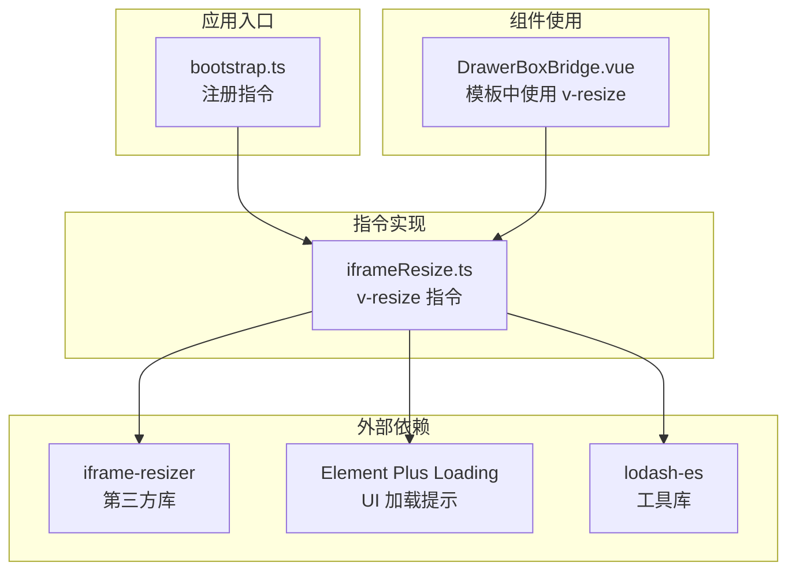
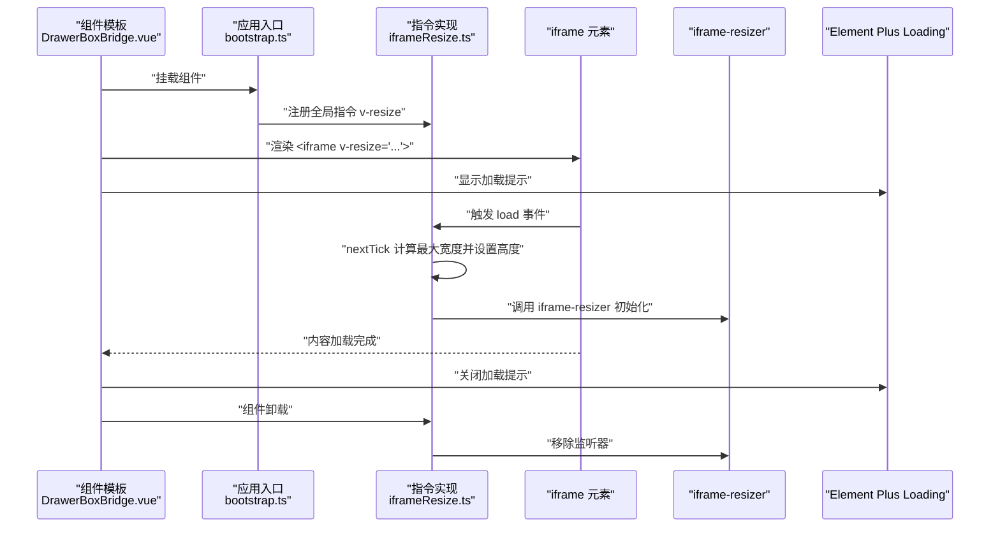
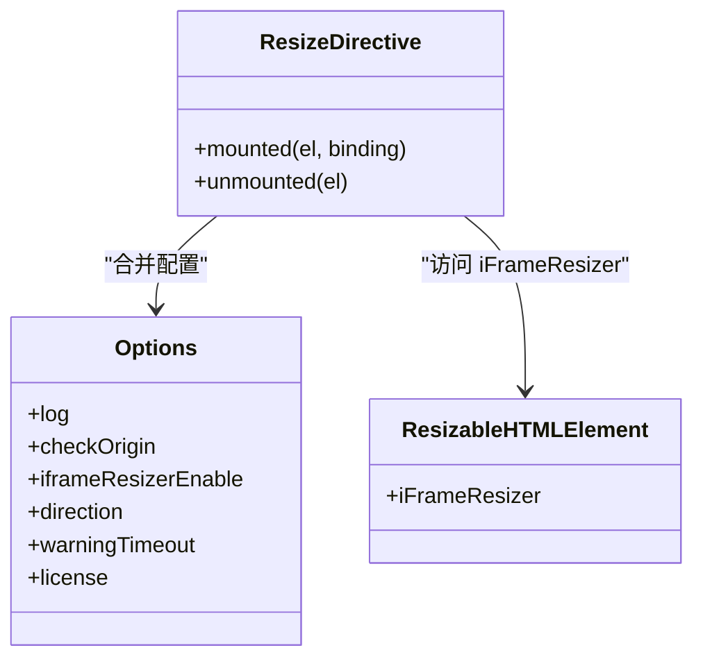
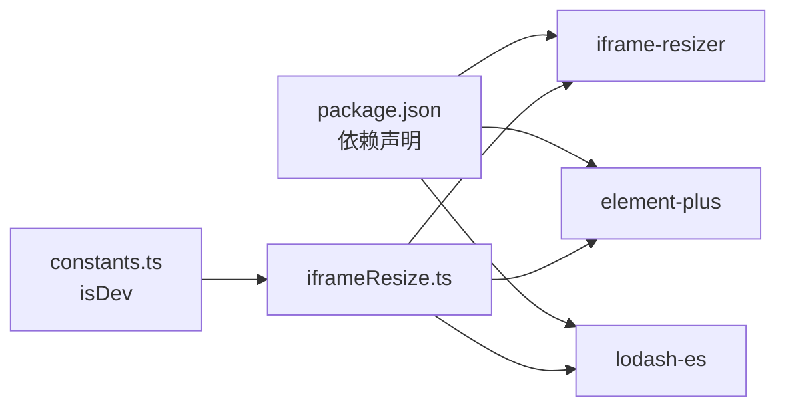

# 指令工具

<cite>
**本文引用的文件**
- [iframeResize.ts](file://src/utils/directives/iframeResize.ts)
- [bootstrap.ts](file://src/bootstrap.ts)
- [DrawerBoxBridge.vue](file://src/components/common/DrawerBoxBridge.vue)
- [constants.ts](file://src/utils/constants.ts)
- [package.json](file://package.json)
</cite>

## 目录
1. [简介](#简介)
2. [项目结构](#项目结构)
3. [核心组件](#核心组件)
4. [架构总览](#架构总览)
5. [详细组件分析](#详细组件分析)
6. [依赖分析](#依赖分析)
7. [性能考虑](#性能考虑)
8. [故障排查指南](#故障排查指南)
9. [结论](#结论)
10. [附录](#附录)

## 简介
本文件面向“指令工具”主题，聚焦于 Vue 指令相关的工具函数与集成方式，重点说明 iframe 自适应调整指令（v-resize）的实现原理、使用方法、配置选项与性能优化策略，并提供指令注册、参数传递、事件处理的实际示例，以及生命周期管理与最佳实践建议。

## 项目结构
与指令工具直接相关的核心位置如下：
- 指令定义：src/utils/directives/iframeResize.ts
- 应用入口注册：src/bootstrap.ts
- 指令使用示例：src/components/common/DrawerBoxBridge.vue
- 运行时常量：src/utils/constants.ts
- 依赖声明：package.json

图表来源
- [bootstrap.ts:46-47](file://src/bootstrap.ts#L46-L47)
- [iframeResize.ts:10-14](file://src/utils/directives/iframeResize.ts#L10-L14)
- [DrawerBoxBridge.vue:26-33](file://src/components/common/DrawerBoxBridge.vue#L26-L33)

章节来源
- [bootstrap.ts:15-47](file://src/bootstrap.ts#L15-L47)
- [iframeResize.ts:10-14](file://src/utils/directives/iframeResize.ts#L10-L14)
- [DrawerBoxBridge.vue:24-34](file://src/components/common/DrawerBoxBridge.vue#L24-L34)

## 核心组件
- v-resize 指令：基于 iframe-resizer 的自适应尺寸控制，负责在 iframe 内容加载后自动计算容器高度并启用双向通信以实现自适应滚动与尺寸同步；同时在卸载阶段清理监听器，避免内存泄漏。
- 注册入口：在应用初始化时通过 app.directive 将 v-resize 注册为全局指令，随后可在任意组件模板中使用。
- 使用示例：DrawerBoxBridge.vue 展示了如何在 iframe 上绑定 v-resize 并传入加载文案等参数。

章节来源
- [iframeResize.ts:22-68](file://src/utils/directives/iframeResize.ts#L22-L68)
- [bootstrap.ts:46-47](file://src/bootstrap.ts#L46-L47)
- [DrawerBoxBridge.vue:26-33](file://src/components/common/DrawerBoxBridge.vue#L26-L33)

## 架构总览
v-resize 指令的运行时交互流程如下：

图表来源
- [DrawerBoxBridge.vue:26-33](file://src/components/common/DrawerBoxBridge.vue#L26-L33)
- [bootstrap.ts:46-47](file://src/bootstrap.ts#L46-L47)
- [iframeResize.ts:23-67](file://src/utils/directives/iframeResize.ts#L23-L67)

## 详细组件分析

### 指令实现：v-resize（iframeResize）
- 类型与职责
  - 类型：Vue 指令（Directive）
  - 职责：在 mounted 阶段初始化加载提示、解析配置、监听 iframe load 事件、计算并设置高度、启动 iframe-resizer；在 unmounted 阶段清理监听器。
- 生命周期钩子
  - mounted：创建加载提示、合并默认配置、绑定 load 事件、在 nextTick 后计算最大宽度并设置 iframe 高度、调用 iframe-resizer；同时设置 onload 关闭加载提示。
  - unmounted：若存在 iFrameResizer 实例，则调用 removeListeners 移除监听器，防止内存泄漏。
- 参数与配置
  - 绑定值（binding.value）支持以下键：
    - loadText：加载提示文本
    - log：是否输出日志（默认跟随 isDev）
    - checkOrigin：是否检查来源（默认 false）
    - iframeResizerEnable：是否启用 iframe-resizer（默认 true）
    - direction：调整方向（默认 vertical）
    - warningTimeout：警告超时时间（默认 30000ms）
    - license：授权信息（固定 GPLv3）
- 外部依赖
  - iframe-resizer：用于与 iframe 内容进行通信并实现自适应
  - Element Plus Loading：用于显示加载状态
  - lodash-es：用于计算最大宽度
  - isDev：来自 constants.ts 的运行时常量，决定日志开关

图表来源
- [iframeResize.ts:16-20](file://src/utils/directives/iframeResize.ts#L16-L20)
- [iframeResize.ts:30-38](file://src/utils/directives/iframeResize.ts#L30-L38)
- [iframeResize.ts:61-67](file://src/utils/directives/iframeResize.ts#L61-L67)

章节来源
- [iframeResize.ts:22-68](file://src/utils/directives/iframeResize.ts#L22-L68)
- [constants.ts:10](file://src/utils/constants.ts#L10)

### 指令注册：全局注册与命名
- 注册位置：在应用入口通过 app.directive('resize', iframeResize) 完成注册
- 指令名称：v-resize（由注册时提供的键名决定）

章节来源
- [bootstrap.ts:46-47](file://src/bootstrap.ts#L46-L47)

### 使用示例：在组件中绑定 v-resize
- 组件：DrawerBoxBridge.vue
- 用法要点：
  - 在 iframe 上使用 v-resize 绑定对象字面量
  - 传入 loadText 作为加载提示文本
  - 可选地传入其他配置项（如 direction、checkOrigin 等）

章节来源
- [DrawerBoxBridge.vue:26-33](file://src/components/common/DrawerBoxBridge.vue#L26-L33)

### 配置选项详解
- loadText：字符串，用于设置加载提示文本
- log：布尔，是否开启日志，默认跟随 isDev
- checkOrigin：布尔，是否校验来源，默认 false
- iframeResizerEnable：布尔，是否启用 iframe-resizer，默认 true
- direction：字符串，可选值包含 vertical 等，用于控制调整方向
- warningTimeout：数值（毫秒），警告超时时间，默认 30000
- license：字符串，固定为 GPLv3

章节来源
- [iframeResize.ts:30-38](file://src/utils/directives/iframeResize.ts#L30-L38)
- [constants.ts:10](file://src/utils/constants.ts#L10)

### 事件处理与生命周期
- load 事件：当 iframe 内容加载完成后，指令会计算最大宽度并设置 iframe 高度，然后初始化 iframe-resizer
- onload：在 iframe 加载完成后关闭加载提示
- 卸载清理：在 unmounted 钩子中调用 removeListeners 移除监听器，确保无内存泄漏

章节来源
- [iframeResize.ts:40-59](file://src/utils/directives/iframeResize.ts#L40-L59)
- [iframeResize.ts:61-67](file://src/utils/directives/iframeResize.ts#L61-L67)

### 性能优化建议
- 合理设置 warningTimeout：根据目标页面复杂度适当提高或降低，避免长时间阻塞或过早超时
- 控制日志输出：在生产环境关闭 log，减少不必要的日志开销
- 仅在必要时启用 iframe-resizer：若不需要双向通信，可考虑禁用以减少额外开销
- 使用 direction 限制方向：仅启用必要的方向，减少计算量
- 避免频繁重设高度：指令会在 load 事件后统一设置一次高度，避免在业务逻辑中重复设置

章节来源
- [iframeResize.ts:30-38](file://src/utils/directives/iframeResize.ts#L30-L38)

## 依赖分析
- 第三方库
  - iframe-resizer：实现 iframe 与宿主之间的通信与自适应
  - element-plus：提供 Loading 服务用于显示加载提示
  - lodash-es：提供数学与集合运算能力（如取最大值）
- 运行时常量
  - isDev：决定日志开关的依据
- 包管理
  - package.json 中声明了上述依赖及其版本范围

图表来源
- [package.json:69-70](file://package.json#L69-L70)
- [package.json:69](file://package.json#L69)
- [package.json:70](file://package.json#L70)
- [constants.ts:10](file://src/utils/constants.ts#L10)
- [iframeResize.ts:10-14](file://src/utils/directives/iframeResize.ts#L10-L14)

章节来源
- [package.json:69-70](file://package.json#L69-L70)
- [package.json:70](file://package.json#L70)
- [constants.ts:10](file://src/utils/constants.ts#L10)
- [iframeResize.ts:10-14](file://src/utils/directives/iframeResize.ts#L10-L14)

## 性能考虑
- 日志与调试：在生产环境关闭 log，避免影响首屏渲染与交互流畅性
- 警告超时：合理设置 warningTimeout，避免长时间等待导致的卡顿
- 方向控制：仅启用必要的方向，减少计算与通信成本
- DOM 访问：尽量减少对 DOM 的频繁读写，指令已在合适时机集中处理
- 清理监听器：确保在组件卸载时移除监听器，避免内存泄漏与后台任务占用

## 故障排查指南
- 指令未生效
  - 检查是否在应用入口正确注册 v-resize
  - 确认组件模板中是否正确使用 v-resize
- iframe 无法自适应
  - 检查 iframeResizerEnable 是否为 true
  - 确认 iframe 内容是否允许跨域通信（checkOrigin）
  - 验证 direction 配置是否符合预期
- 加载提示不消失
  - 检查 iframe 的 onload 事件是否正常触发
  - 确认 ElLoading.service 的调用与关闭逻辑
- 卸载后仍有异常
  - 确保 unmounted 钩子中移除了监听器
  - 检查 iFrameResizer 实例是否存在

章节来源
- [bootstrap.ts:46-47](file://src/bootstrap.ts#L46-L47)
- [DrawerBoxBridge.vue:26-33](file://src/components/common/DrawerBoxBridge.vue#L26-L33)
- [iframeResize.ts:30-38](file://src/utils/directives/iframeResize.ts#L30-L38)
- [iframeResize.ts:61-67](file://src/utils/directives/iframeResize.ts#L61-L67)

## 结论
v-resize 指令通过封装 iframe-resizer 与 Element Plus 的加载提示，实现了 iframe 内容的自动适配与良好的用户体验。其设计遵循 Vue 指令生命周期，具备完善的参数配置与卸载清理机制。结合合理的配置与最佳实践，可以在保证性能的同时提升交互质量。

## 附录
- 指令注册与使用路径参考
  - 注册：[bootstrap.ts:46-47](file://src/bootstrap.ts#L46-L47)
  - 使用示例：[DrawerBoxBridge.vue:26-33](file://src/components/common/DrawerBoxBridge.vue#L26-L33)
  - 指令实现：[iframeResize.ts:22-68](file://src/utils/directives/iframeResize.ts#L22-L68)
- 依赖与常量
  - 依赖声明：[package.json:69-70](file://package.json#L69-L70)
  - 运行时常量：[constants.ts:10](file://src/utils/constants.ts#L10)