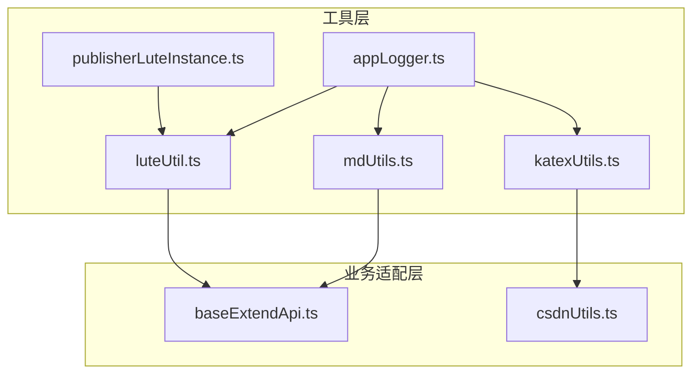
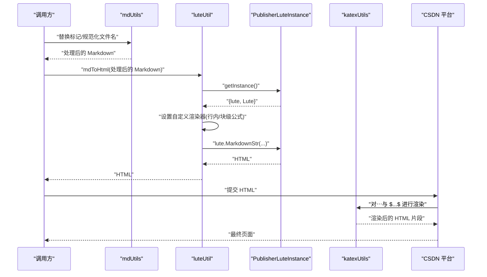
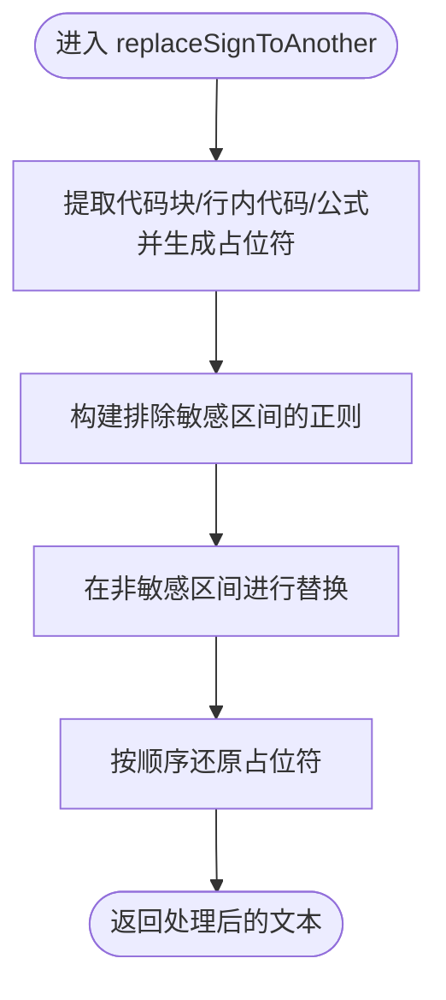
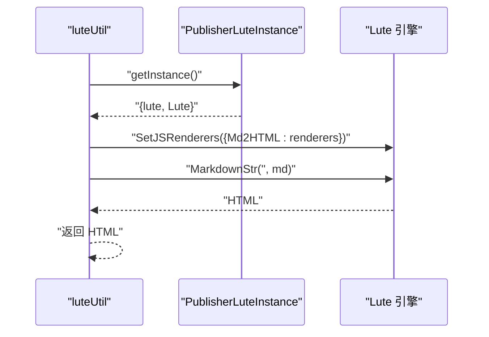
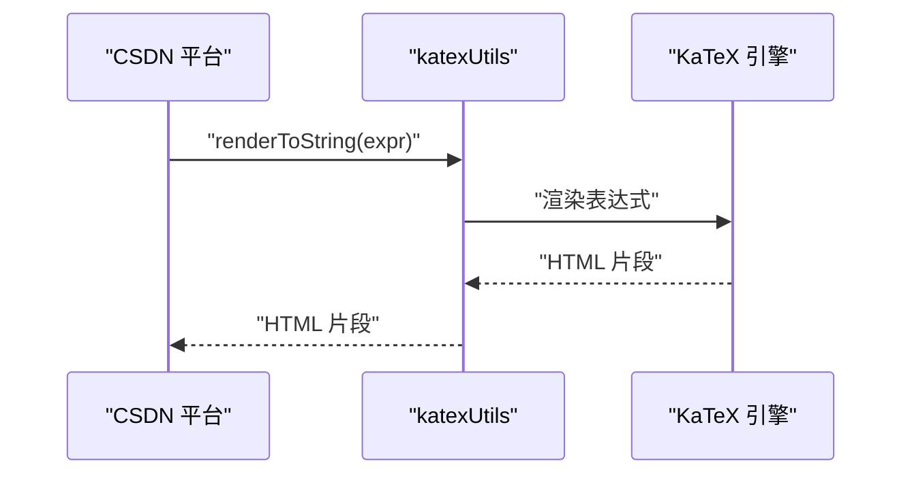
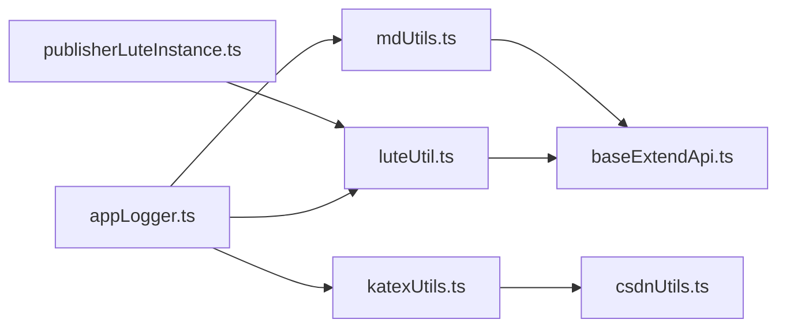

# 文档处理工具

<cite>
**本文引用的文件**
- [mdUtils.ts](file://src/utils/mdUtils.ts)
- [luteUtil.ts](file://src/utils/luteUtil.ts)
- [katexUtils.ts](file://src/utils/katexUtils.ts)
- [publisherLuteInstance.ts](file://src/publisherLuteInstance.ts)
- [appLogger.ts](file://src/utils/appLogger.ts)
- [mdUtils.spec.ts](file://src/utils/mdUtils.spec.ts)
- [katexUtils.spec.ts](file://src/utils/katexUtils.spec.ts)
- [baseExtendApi.ts](file://src/adaptors/base/baseExtendApi.ts)
- [csdnUtils.ts](file://src/adaptors/web/csdn/csdnUtils.ts)
</cite>

## 目录
1. [简介](#简介)
2. [项目结构](#项目结构)
3. [核心组件](#核心组件)
4. [架构总览](#架构总览)
5. [详细组件分析](#详细组件分析)
6. [依赖关系分析](#依赖关系分析)
7. [性能考量](#性能考量)
8. [故障排查指南](#故障排查指南)
9. [结论](#结论)
10. [附录](#附录)

## 简介
本文档面向“文档处理工具”子系统，聚焦以下三类工具函数与封装：
- Markdown 处理：mdUtils 中的文档转换、格式化、内容提取与安全替换能力
- Lute 解析：luteUtil 中对 Lute 引擎的统一封装与 HTML 渲染流程
- 数学公式渲染：katexUtils 中基于 KaTeX 的行内与块级公式渲染工具

文档将给出每个函数的完整签名、参数说明、返回值类型与实际使用示例，并总结最佳实践、性能优化建议与常见问题解决方案。

## 项目结构
围绕文档处理工具的相关文件组织如下：
- 工具层
  - mdUtils.ts：Markdown 文本处理与安全替换、人类可读文件名生成
  - luteUtil.ts：Lute 渲染器封装，支持行内/块级公式节点处理
  - katexUtils.ts：KaTeX 公式渲染工具
  - publisherLuteInstance.ts：统一获取 Lute 实例，负责运行环境与可用性检查
  - appLogger.ts：应用日志接口与实现
- 使用示例与集成点
  - baseExtendApi.ts：在发布流程中调用 mdUtils 与 luteUtil
  - csdnUtils.ts：在 Web 平台侧对 HTML 中的 KaTeX 公式进行二次渲染
  - mdUtils.spec.ts、katexUtils.spec.ts：单元测试样例

图表来源
- [mdUtils.ts:1-161](file://src/utils/mdUtils.ts#L1-L161)
- [luteUtil.ts:1-92](file://src/utils/luteUtil.ts#L1-L92)
- [katexUtils.ts:1-34](file://src/utils/katexUtils.ts#L1-L34)
- [publisherLuteInstance.ts:1-41](file://src/publisherLuteInstance.ts#L1-L41)
- [appLogger.ts:1-47](file://src/utils/appLogger.ts#L1-L47)
- [baseExtendApi.ts:190-389](file://src/adaptors/base/baseExtendApi.ts#L190-L389)
- [csdnUtils.ts:130-178](file://src/adaptors/web/csdn/csdnUtils.ts#L130-L178)

章节来源
- [mdUtils.ts:1-161](file://src/utils/mdUtils.ts#L1-L161)
- [luteUtil.ts:1-92](file://src/utils/luteUtil.ts#L1-L92)
- [katexUtils.ts:1-34](file://src/utils/katexUtils.ts#L1-L34)
- [publisherLuteInstance.ts:1-41](file://src/publisherLuteInstance.ts#L1-L41)
- [appLogger.ts:1-47](file://src/utils/appLogger.ts#L1-L47)
- [baseExtendApi.ts:190-389](file://src/adaptors/base/baseExtendApi.ts#L190-L389)
- [csdnUtils.ts:130-178](file://src/adaptors/web/csdn/csdnUtils.ts#L130-L178)

## 核心组件
- mdUtils：提供两类能力
  - 安全标记替换：将指定标记符号对替换为自定义前缀/后缀，同时避开代码块、行内代码、行内公式与块级公式的范围
  - 文件名规范化：将输入字符串转换为人类可读、URL 友好的文件名
- luteUtil：封装 Lute 渲染器，启用行内/块级公式节点的自定义渲染，输出 HTML
- katexUtils：提供 KaTeX 渲染入口，将数学表达式渲染为 HTML 片段

章节来源
- [mdUtils.ts:17-158](file://src/utils/mdUtils.ts#L17-L158)
- [luteUtil.ts:15-88](file://src/utils/luteUtil.ts#L15-L88)
- [katexUtils.ts:19-31](file://src/utils/katexUtils.ts#L19-L31)

## 架构总览
整体处理链路如下：
- 文档预处理：从原始 Markdown 中抽取正文、移除外链占位、将特定标记替换为标准 Markdown
- Lute 渲染：将处理后的 Markdown 交由 Lute 渲染为 HTML
- 公式渲染：在目标平台侧（如 CSDN），对 HTML 中的 KaTeX 表达式进行二次渲染
- 输出：根据页面类型选择 HTML 或 Markdown 作为描述内容

图表来源
- [baseExtendApi.ts:300-350](file://src/adaptors/base/baseExtendApi.ts#L300-L350)
- [luteUtil.ts:23-88](file://src/utils/luteUtil.ts#L23-L88)
- [publisherLuteInstance.ts:21-37](file://src/publisherLuteInstance.ts#L21-L37)
- [csdnUtils.ts:133-142](file://src/adaptors/web/csdn/csdnUtils.ts#L133-L142)
- [katexUtils.ts:27-30](file://src/utils/katexUtils.ts#L27-L30)

## 详细组件分析

### mdUtils 工具集
- replaceSignToAnother(text, sign, open, close)：将指定标记符号对替换为自定义前缀/后缀，同时避开代码块、行内代码、行内公式与块级公式的范围
  - 参数
    - text: string，待处理的 Markdown 文本
    - sign: string，要被替换的标记符号（如 “==”、“**”）
    - open: string，替换后的开头内容（如 “ **”）
    - close: string，替换后的结尾内容（如 “** ”）
  - 返回值
    - string，处理后的文本
  - 处理策略
    - 先提取并暂存代码块、行内代码、行内公式与块级公式，再在非敏感区域进行替换，最后还原
  - 使用示例（参考测试）
    - [mdUtils.spec.ts:56-60](file://src/utils/mdUtils.spec.ts#L56-L60)
    - [mdUtils.spec.ts:63-72](file://src/utils/mdUtils.spec.ts#L63-L72)
- getHumanFilename(input)：将输入字符串转换为人类可读、URL 友好的文件名
  - 参数
    - input: string，原始文件名或标题
  - 返回值
    - string，规范化后的文件名
  - 使用示例（参考测试）
    - [mdUtils.spec.ts:74-87](file://src/utils/mdUtils.spec.ts#L74-L87)

图表来源
- [mdUtils.ts:67-129](file://src/utils/mdUtils.ts#L67-L129)

章节来源
- [mdUtils.ts:52-129](file://src/utils/mdUtils.ts#L52-L129)
- [mdUtils.spec.ts:13-88](file://src/utils/mdUtils.spec.ts#L13-L88)

### luteUtil 渲染器封装
- mdToHtml(md)：使用 Lute 渲染 Markdown 为 HTML，并启用行内/块级公式节点的自定义渲染
  - 参数
    - md: string，Markdown 文本
  - 返回值
    - string，渲染后的 HTML
  - 关键步骤
    - 通过 PublisherLuteInstance 获取 Lute 实例（含环境校验）
    - 设置自定义渲染器（行内/块级公式节点）
    - 调用 lute.MarkdownStr(...) 执行渲染
  - 使用示例（参考业务集成）
    - [baseExtendApi.ts:342-343](file://src/adaptors/base/baseExtendApi.ts#L342-L343)
    - [baseExtendApi.ts:410-411](file://src/adaptors/base/baseExtendApi.ts#L410-L411)

图表来源
- [luteUtil.ts:23-88](file://src/utils/luteUtil.ts#L23-L88)
- [publisherLuteInstance.ts:21-37](file://src/publisherLuteInstance.ts#L21-L37)

章节来源
- [luteUtil.ts:15-88](file://src/utils/luteUtil.ts#L15-L88)
- [publisherLuteInstance.ts:18-37](file://src/publisherLuteInstance.ts#L18-L37)
- [baseExtendApi.ts:337-350](file://src/adaptors/base/baseExtendApi.ts#L337-L350)

### katexUtils 公式渲染工具
- renderToString(mathExpression)：将数学表达式渲染为 HTML 片段
  - 参数
    - mathExpression: string，LaTeX 数学表达式
  - 返回值
    - string，渲染后的 HTML
  - 使用示例（参考测试）
    - [katexUtils.spec.ts:14-18](file://src/utils/katexUtils.spec.ts#L14-L18)
  - 平台集成示例
    - [csdnUtils.ts:133-142](file://src/adaptors/web/csdn/csdnUtils.ts#L133-L142)

图表来源
- [katexUtils.ts:27-30](file://src/utils/katexUtils.ts#L27-L30)
- [csdnUtils.ts:133-142](file://src/adaptors/web/csdn/csdnUtils.ts#L133-L142)

章节来源
- [katexUtils.ts:19-31](file://src/utils/katexUtils.ts#L19-L31)
- [katexUtils.spec.ts:10-19](file://src/utils/katexUtils.spec.ts#L10-L19)
- [csdnUtils.ts:130-151](file://src/adaptors/web/csdn/csdnUtils.ts#L130-L151)

## 依赖关系分析
- 组件耦合
  - mdUtils 与 luteUtil、katexUtils 无直接依赖，分别服务于“文本处理”和“渲染输出”
  - luteUtil 依赖 publisherLuteInstance 进行 Lute 实例获取与环境校验
  - appLogger 为各工具提供统一日志能力
- 外部依赖
  - luteUtil 依赖浏览器全局 Lute 对象
  - katexUtils 依赖 KaTeX 库
- 业务集成
  - baseExtendApi 在发布流程中调用 mdUtils 与 luteUtil
  - csdnUtils 在平台侧对 HTML 中的公式进行二次渲染

图表来源
- [baseExtendApi.ts:300-350](file://src/adaptors/base/baseExtendApi.ts#L300-L350)
- [csdnUtils.ts:130-151](file://src/adaptors/web/csdn/csdnUtils.ts#L130-L151)
- [luteUtil.ts:23-88](file://src/utils/luteUtil.ts#L23-L88)
- [publisherLuteInstance.ts:21-37](file://src/publisherLuteInstance.ts#L21-L37)
- [appLogger.ts:37-39](file://src/utils/appLogger.ts#L37-L39)

章节来源
- [baseExtendApi.ts:190-389](file://src/adaptors/base/baseExtendApi.ts#L190-L389)
- [csdnUtils.ts:130-178](file://src/adaptors/web/csdn/csdnUtils.ts#L130-L178)
- [luteUtil.ts:15-88](file://src/utils/luteUtil.ts#L15-L88)
- [publisherLuteInstance.ts:18-37](file://src/publisherLuteInstance.ts#L18-L37)
- [appLogger.ts:23-39](file://src/utils/appLogger.ts#L23-L39)

## 性能考量
- 正则与替换
  - replaceSignToAnother 采用“提取-替换-还原”的三段式策略，避免在敏感区间误替换，复杂度与文本长度线性相关；建议在大文档场景下优先分段处理或缓存中间结果
- Lute 渲染
  - 渲染器设置仅需一次，后续重复调用复用同一实例；注意避免频繁重建 Lute 实例
  - 公式节点自定义渲染器仅影响公式节点，对整体渲染性能影响有限
- KaTeX 渲染
  - renderToString 为纯前端渲染，建议批量处理时合并请求或使用防抖策略，减少重复渲染
- 日志
  - appLogger 在开发环境开启调试日志，生产环境关闭，避免日志输出带来的额外开销

## 故障排查指南
- Lute 未找到或非浏览器环境
  - 现象：日志警告“不是浏览器环境，不渲染”或“未找到 Lute，不渲染”
  - 排查：确认页面已引入 Lute 资源，且在浏览器环境中运行
  - 参考
    - [publisherLuteInstance.ts:22-31](file://src/publisherLuteInstance.ts#L22-L31)
- 公式渲染异常
  - 现象：HTML 中的公式未正确显示
  - 排查：确认 katexUtils 的渲染入口是否被调用；检查平台侧二次渲染逻辑是否覆盖了所有公式标记
  - 参考
    - [csdnUtils.ts:133-142](file://src/adaptors/web/csdn/csdnUtils.ts#L133-L142)
- 标记替换误伤
  - 现象：代码块、行内代码、公式中的标记被错误替换
  - 排查：确认使用 replaceSignToAnother 的调用是否正确；必要时调整 open/close 参数以避免冲突
  - 参考
    - [mdUtils.ts:67-129](file://src/utils/mdUtils.ts#L67-L129)
- 文件名不合规
  - 现象：生成的文件名包含非法字符或过长
  - 排查：使用 getHumanFilename 规范化后再提交
  - 参考
    - [mdUtils.ts:136-157](file://src/utils/mdUtils.ts#L136-L157)

章节来源
- [publisherLuteInstance.ts:21-37](file://src/publisherLuteInstance.ts#L21-L37)
- [csdnUtils.ts:133-142](file://src/adaptors/web/csdn/csdnUtils.ts#L133-L142)
- [mdUtils.ts:67-129](file://src/utils/mdUtils.ts#L67-L129)
- [mdUtils.ts:136-157](file://src/utils/mdUtils.ts#L136-L157)

## 结论
本文档梳理了文档处理工具的核心能力与使用方式，明确了 mdUtils、luteUtil、katexUtils 的职责边界与集成路径。通过规范化的文本处理、稳定的 Lute 渲染与可控的公式渲染，可在多平台发布场景中获得一致、高质量的输出效果。建议在实际工程中结合本文的最佳实践与性能建议，持续优化处理链路与错误处理策略。

## 附录

### API 参考

- mdUtils
  - replaceSignToAnother(text, sign, open, close)
    - 参数
      - text: string
      - sign: string
      - open: string
      - close: string
    - 返回值: string
    - 示例: [mdUtils.spec.ts:56-72](file://src/utils/mdUtils.spec.ts#L56-L72)
  - getHumanFilename(input)
    - 参数
      - input: string
    - 返回值: string
    - 示例: [mdUtils.spec.ts:74-87](file://src/utils/mdUtils.spec.ts#L74-L87)

- luteUtil
  - mdToHtml(md)
    - 参数
      - md: string
    - 返回值: string
    - 示例: [baseExtendApi.ts:342-343](file://src/adaptors/base/baseExtendApi.ts#L342-L343)

- katexUtils
  - renderToString(mathExpression)
    - 参数
      - mathExpression: string
    - 返回值: string
    - 示例: [katexUtils.spec.ts:14-18](file://src/utils/katexUtils.spec.ts#L14-L18)
    - 平台集成: [csdnUtils.ts:133-142](file://src/adaptors/web/csdn/csdnUtils.ts#L133-L142)