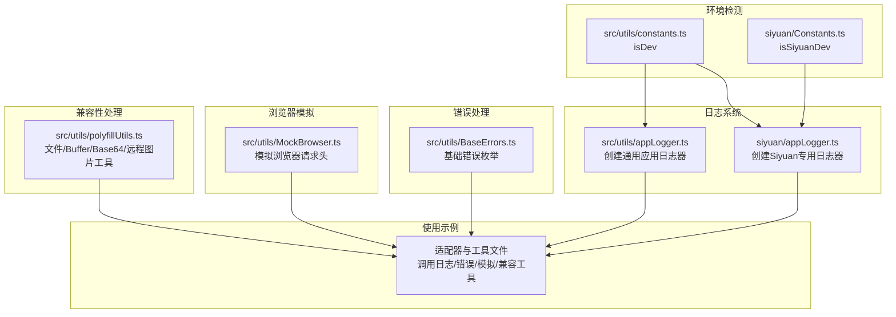
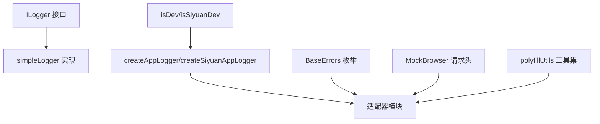
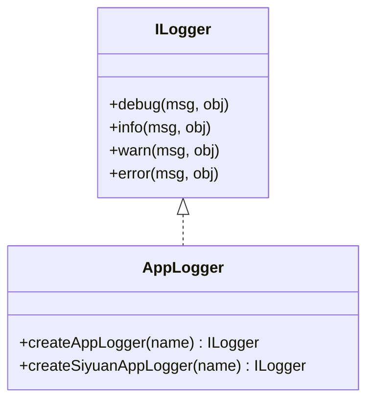
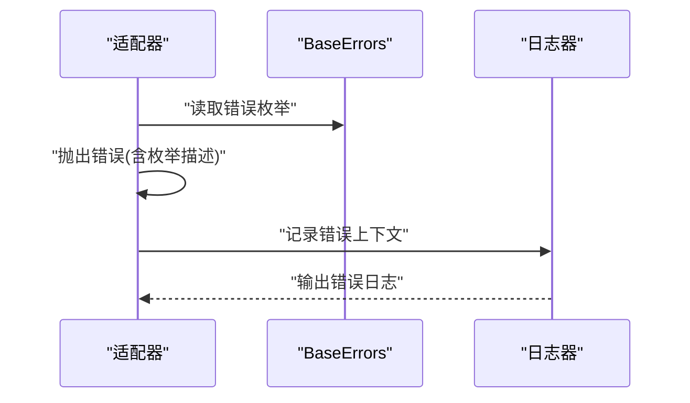
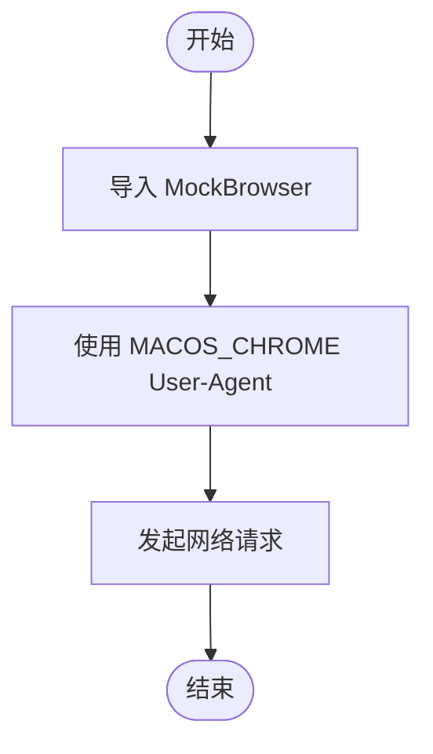
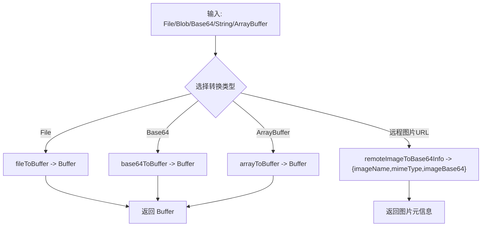
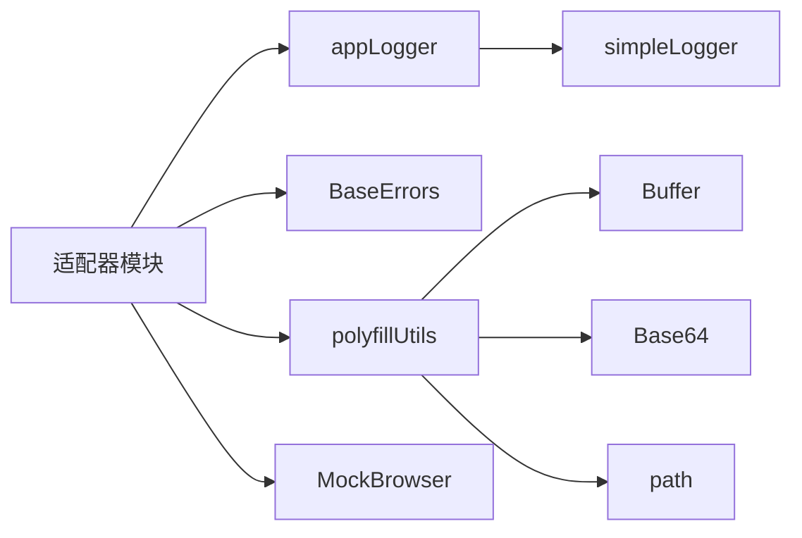

# 日志和调试工具

<cite>
**本文档引用的文件**
- [siyuan/appLogger.ts](file://siyuan/appLogger.ts)
- [src/utils/appLogger.ts](file://src/utils/appLogger.ts)
- [src/utils/BaseErrors.ts](file://src/utils/BaseErrors.ts)
- [src/utils/MockBrowser.ts](file://src/utils/MockBrowser.ts)
- [src/utils/polyfillUtils.ts](file://src/utils/polyfillUtils.ts)
- [src/utils/constants.ts](file://src/utils/constants.ts)
- [siyuan/Constants.ts](file://siyuan/Constants.ts)
- [src/adaptors/api/astro/astroYamlConverterAdaptor.ts](file://src/adaptors/api/astro/astroYamlConverterAdaptor.ts)
- [src/adaptors/api/confluence/confluenceApiAdaptor.ts](file://src/adaptors/api/confluence/confluenceApiAdaptor.ts)
- [src/adaptors/base/baseExtendApi.ts](file://src/adaptors/base/baseExtendApi.ts)
- [src/adaptors/web/bilibili/bilibiliWebAdaptor.ts](file://src/adaptors/web/bilibili/bilibiliWebAdaptor.ts)
- [src/adaptors/web/wechat/wechatWebAdaptor.ts](file://src/adaptors/web/wechat/wechatWebAdaptor.ts)
- [src/adaptors/web/zhihu/zhihuWebAdaptor.ts](file://src/adaptors/web/zhihu/zhihuWebAdaptor.ts)
- [src/utils/widgetUtils.ts](file://src/utils/widgetUtils.ts)
- [vite.config.ts](file://vite.config.ts)
</cite>

## 目录
1. [简介](#简介)
2. [项目结构](#项目结构)
3. [核心组件](#核心组件)
4. [架构总览](#架构总览)
5. [详细组件分析](#详细组件分析)
6. [依赖关系分析](#依赖关系分析)
7. [性能考量](#性能考量)
8. [故障排除指南](#故障排除指南)
9. [结论](#结论)

## 简介
本文件聚焦于日志与调试工具的API文档，涵盖以下方面：
- 日志系统：appLogger提供的日志接口与实现，以及在不同模块中的使用方式
- 错误处理：BaseErrors中的基础错误定义与在适配器中的错误抛出与捕获
- 浏览器模拟：MockBrowser对常见浏览器请求头的封装，用于网络请求兼容
- 兼容性处理：polyfillUtils中的文件到Buffer转换、Base64与Buffer互转、远程图片转Base64等工具函数
- 环境检测：isDev与isSiyuanDev常量在日志开关与功能启用中的作用
- 实用示例：如何在各适配器中进行日志分级、错误追踪、环境检测与调试技巧

## 项目结构
围绕日志与调试工具的相关文件主要分布在如下位置：
- 日志接口与实现：siyuan/appLogger.ts 与 src/utils/appLogger.ts
- 错误定义：src/utils/BaseErrors.ts
- 浏览器模拟：src/utils/MockBrowser.ts
- 兼容性工具：src/utils/polyfillUtils.ts
- 环境常量：src/utils/constants.ts 与 siyuan/Constants.ts
- 使用示例：多处适配器与工具文件中对上述工具的调用

**图表来源**
- [siyuan/appLogger.ts:1-57](file://siyuan/appLogger.ts#L1-L57)
- [src/utils/appLogger.ts:1-47](file://src/utils/appLogger.ts#L1-L47)
- [src/utils/BaseErrors.ts:1-21](file://src/utils/BaseErrors.ts#L1-L21)
- [src/utils/MockBrowser.ts:1-39](file://src/utils/MockBrowser.ts#L1-L39)
- [src/utils/polyfillUtils.ts:1-129](file://src/utils/polyfillUtils.ts#L1-L129)
- [src/utils/constants.ts:1-54](file://src/utils/constants.ts#L1-L54)
- [siyuan/Constants.ts:1-35](file://siyuan/Constants.ts#L1-L35)

**章节来源**
- [siyuan/appLogger.ts:1-57](file://siyuan/appLogger.ts#L1-L57)
- [src/utils/appLogger.ts:1-47](file://src/utils/appLogger.ts#L1-L47)
- [src/utils/BaseErrors.ts:1-21](file://src/utils/BaseErrors.ts#L1-L21)
- [src/utils/MockBrowser.ts:1-39](file://src/utils/MockBrowser.ts#L1-L39)
- [src/utils/polyfillUtils.ts:1-129](file://src/utils/polyfillUtils.ts#L1-L129)
- [src/utils/constants.ts:1-54](file://src/utils/constants.ts#L1-L54)
- [siyuan/Constants.ts:1-35](file://siyuan/Constants.ts#L1-L35)

## 核心组件
- 日志接口与实现
  - 接口定义：ILogger，包含 debug/info/warn/error 四个方法
  - 实现：通过 simpleLogger 创建日志器；根据 isDev/isSiyuanDev 控制输出级别
  - 使用：在各适配器中以 createAppLogger/createSiyuanAppLogger 初始化并记录日志
- 错误定义与处理
  - BaseError：基础错误枚举，如“媒体宏模式下未找到pageId”
  - 使用：在适配器中抛出或捕获错误，结合日志记录错误上下文
- 浏览器模拟
  - MockBrowser：提供常见浏览器请求头（如 macOS Chrome 的 User-Agent）
  - 使用：在网络请求时设置请求头，提升兼容性
- 兼容性处理
  - 文件到Buffer：fileToBuffer
  - Base64到Buffer：base64ToBuffer
  - ArrayBuffer到Buffer：arrayToBuffer
  - 远程图片转Base64信息：remoteImageToBase64Info、toBase64Info
  - Node path polyfill：导出 path 供浏览器使用
- 环境检测
  - isDev：来自 process.env.DEV_MODE 的布尔值
  - isSiyuanDev：来自 process.env.DEV_MODE 的布尔值
  - 两者分别影响日志器的输出级别

**章节来源**
- [siyuan/appLogger.ts:40-56](file://siyuan/appLogger.ts#L40-L56)
- [src/utils/appLogger.ts:23-39](file://src/utils/appLogger.ts#L23-L39)
- [src/utils/BaseErrors.ts:13-20](file://src/utils/BaseErrors.ts#L13-L20)
- [src/utils/MockBrowser.ts:13-38](file://src/utils/MockBrowser.ts#L13-L38)
- [src/utils/polyfillUtils.ts:22-123](file://src/utils/polyfillUtils.ts#L22-L123)
- [src/utils/constants.ts:10-10](file://src/utils/constants.ts#L10-L10)
- [siyuan/Constants.ts:26-26](file://siyuan/Constants.ts#L26-L26)

## 架构总览
日志与调试工具在系统中的交互关系如下：

**图表来源**
- [src/utils/appLogger.ts:23-39](file://src/utils/appLogger.ts#L23-L39)
- [siyuan/appLogger.ts:40-56](file://siyuan/appLogger.ts#L40-L56)
- [src/utils/constants.ts:10-10](file://src/utils/constants.ts#L10-L10)
- [siyuan/Constants.ts:26-26](file://siyuan/Constants.ts#L26-L26)
- [src/utils/BaseErrors.ts:13-20](file://src/utils/BaseErrors.ts#L13-L20)
- [src/utils/MockBrowser.ts:13-38](file://src/utils/MockBrowser.ts#L13-L38)
- [src/utils/polyfillUtils.ts:22-123](file://src/utils/polyfillUtils.ts#L22-L123)

## 详细组件分析

### 日志系统（appLogger）
- 设计要点
  - 统一的ILogger接口，便于在不同模块中替换实现
  - 通过 simpleLogger 创建日志器，并依据 isDev/isSiyuanDev 控制输出级别
  - 在各适配器中以构造函数内初始化 logger，贯穿生命周期
- 使用示例
  - 通用应用日志器：在适配器中通过 createAppLogger 初始化
  - Siyuan专用日志器：在 siyuan/index.ts 等入口文件中通过 createSiyuanAppLogger 初始化
- 日志分级建议
  - debug：调试阶段的详细信息
  - info：关键流程与状态
  - warn：潜在问题但可继续执行
  - error：异常与失败，附带上下文对象

**图表来源**
- [siyuan/appLogger.ts:40-56](file://siyuan/appLogger.ts#L40-L56)
- [src/utils/appLogger.ts:23-39](file://src/utils/appLogger.ts#L23-L39)

**章节来源**
- [siyuan/appLogger.ts:40-56](file://siyuan/appLogger.ts#L40-L56)
- [src/utils/appLogger.ts:23-39](file://src/utils/appLogger.ts#L23-L39)
- [src/adaptors/api/astro/astroYamlConverterAdaptor.ts:22-27](file://src/adaptors/api/astro/astroYamlConverterAdaptor.ts#L22-L27)
- [src/adaptors/base/baseExtendApi.ts:69-80](file://src/adaptors/base/baseExtendApi.ts#L69-L80)

### 错误处理（BaseErrors）
- 设计要点
  - BaseError 枚举集中定义基础错误类型
  - 在适配器中抛出错误时携带明确的错误信息
  - 结合日志记录错误上下文，便于定位问题
- 使用示例
  - Confluence 适配器在上传媒体失败时抛出包含 BaseError 的错误
  - 基类扩展适配器捕获错误消息并进行关键字匹配与日志记录

**图表来源**
- [src/adaptors/api/confluence/confluenceApiAdaptor.ts:151-153](file://src/adaptors/api/confluence/confluenceApiAdaptor.ts#L151-L153)
- [src/adaptors/base/baseExtendApi.ts:537-537](file://src/adaptors/base/baseExtendApi.ts#L537-L537)
- [src/utils/BaseErrors.ts:13-20](file://src/utils/BaseErrors.ts#L13-L20)

**章节来源**
- [src/utils/BaseErrors.ts:13-20](file://src/utils/BaseErrors.ts#L13-L20)
- [src/adaptors/api/confluence/confluenceApiAdaptor.ts:151-153](file://src/adaptors/api/confluence/confluenceApiAdaptor.ts#L151-L153)
- [src/adaptors/base/baseExtendApi.ts:537-537](file://src/adaptors/base/baseExtendApi.ts#L537-L537)

### 浏览器模拟（MockBrowser）
- 设计要点
  - 提供常见浏览器请求头（如 macOS Chrome 的 User-Agent）
  - 在网络请求中设置请求头，提高兼容性
- 使用示例
  - 多个 Web 适配器在请求头中使用 MockBrowser.HEADERS.MACOS_CHROME["User-Agent"]
  - 桌面端工具中通过 Electron 的 webContents.userAgent 或 requestHeaders 设置

**图表来源**
- [src/utils/MockBrowser.ts:13-38](file://src/utils/MockBrowser.ts#L13-L38)
- [src/adaptors/web/bilibili/bilibiliWebAdaptor.ts:468-496](file://src/adaptors/web/bilibili/bilibiliWebAdaptor.ts#L468-L496)
- [src/adaptors/web/wechat/wechatWebAdaptor.ts:538-561](file://src/adaptors/web/wechat/wechatWebAdaptor.ts#L538-L561)
- [src/adaptors/web/zhihu/zhihuWebAdaptor.ts:356-390](file://src/adaptors/web/zhihu/zhihuWebAdaptor.ts#L356-L390)
- [src/utils/widgetUtils.ts:138-155](file://src/utils/widgetUtils.ts#L138-L155)

**章节来源**
- [src/utils/MockBrowser.ts:13-38](file://src/utils/MockBrowser.ts#L13-L38)
- [src/adaptors/web/bilibili/bilibiliWebAdaptor.ts:468-496](file://src/adaptors/web/bilibili/bilibiliWebAdaptor.ts#L468-L496)
- [src/adaptors/web/wechat/wechatWebAdaptor.ts:538-561](file://src/adaptors/web/wechat/wechatWebAdaptor.ts#L538-L561)
- [src/adaptors/web/zhihu/zhihuWebAdaptor.ts:356-390](file://src/adaptors/web/zhihu/zhihuWebAdaptor.ts#L356-L390)
- [src/utils/widgetUtils.ts:138-155](file://src/utils/widgetUtils.ts#L138-L155)

### 兼容性处理（polyfillUtils）
- 设计要点
  - fileToBuffer：将 File 对象异步读取为 Buffer
  - base64ToBuffer：将 Base64 字符串转换为 Buffer
  - arrayToBuffer：将 ArrayBuffer 转换为 Buffer
  - remoteImageToBase64Info/toBase64Info：远程图片转 Base64 并提取文件名与 MIME 类型
  - path polyfill：导出 path 以在浏览器中使用 Node 风格的路径操作
- 使用示例
  - Web 适配器在上传图片时使用 fileToBuffer/arrayToBuffer
  - Confluence 适配器在处理媒体对象时使用 base64ToBuffer
  - 基类扩展适配器使用 remoteImageToBase64Info 进行远程图片处理

**图表来源**
- [src/utils/polyfillUtils.ts:22-123](file://src/utils/polyfillUtils.ts#L22-L123)

**章节来源**
- [src/utils/polyfillUtils.ts:22-123](file://src/utils/polyfillUtils.ts#L22-L123)
- [src/adaptors/base/baseExtendApi.ts:33-33](file://src/adaptors/base/baseExtendApi.ts#L33-L33)
- [src/adaptors/api/confluence/confluenceApiAdaptor.ts:16-16](file://src/adaptors/api/confluence/confluenceApiAdaptor.ts#L16-L16)
- [src/adaptors/web/bilibili/bilibiliWebAdaptor.ts:17-17](file://src/adaptors/web/bilibili/bilibiliWebAdaptor.ts#L17-L17)
- [src/adaptors/web/jianshu/jianshuWebAdaptor.ts:12-12](file://src/adaptors/web/jianshu/jianshuWebAdaptor.ts#L12-L12)
- [src/adaptors/web/wechat/wechatWebAdaptor.ts:15-15](file://src/adaptors/web/wechat/wechatWebAdaptor.ts#L15-L15)
- [src/adaptors/web/zhihu/zhihuWebAdaptor.ts:14-14](file://src/adaptors/web/zhihu/zhihuWebAdaptor.ts#L14-L14)

### 环境检测与日志开关
- 设计要点
  - isDev：由 process.env.DEV_MODE 控制，决定日志器的输出级别
  - isSiyuanDev：同样由 process.env.DEV_MODE 控制，用于 Siyuan 环境下的日志开关
- 使用示例
  - appLogger 与 siyuan/appLogger 在创建日志器时传入 isDev/isSiyuanDev
  - 在构建脚本中通过环境变量切换开发/生产模式

**章节来源**
- [src/utils/constants.ts:10-10](file://src/utils/constants.ts#L10-L10)
- [siyuan/Constants.ts:26-26](file://siyuan/Constants.ts#L26-L26)
- [src/utils/appLogger.ts:37-39](file://src/utils/appLogger.ts#L37-L39)
- [siyuan/appLogger.ts:54-56](file://siyuan/appLogger.ts#L54-L56)

## 依赖关系分析
- 组件耦合
  - 适配器依赖 appLogger 进行日志记录
  - 适配器依赖 BaseErrors 进行错误定义与抛出
  - 适配器依赖 polyfillUtils 进行数据转换
  - 适配器依赖 MockBrowser 进行请求头设置
- 外部依赖
  - simpleLogger：日志实现
  - Buffer、Base64、path：Node 生态 polyfill
  - fetch：浏览器原生网络能力

**图表来源**
- [src/adaptors/api/astro/astroYamlConverterAdaptor.ts:10-13](file://src/adaptors/api/astro/astroYamlConverterAdaptor.ts#L10-L13)
- [src/adaptors/base/baseExtendApi.ts:33-47](file://src/adaptors/base/baseExtendApi.ts#L33-L47)
- [src/utils/appLogger.ts:10-11](file://src/utils/appLogger.ts#L10-L11)
- [src/utils/polyfillUtils.ts:10-12](file://src/utils/polyfillUtils.ts#L10-L12)

**章节来源**
- [src/adaptors/api/astro/astroYamlConverterAdaptor.ts:10-13](file://src/adaptors/api/astro/astroYamlConverterAdaptor.ts#L10-L13)
- [src/adaptors/base/baseExtendApi.ts:33-47](file://src/adaptors/base/baseExtendApi.ts#L33-L47)
- [src/utils/appLogger.ts:10-11](file://src/utils/appLogger.ts#L10-L11)
- [src/utils/polyfillUtils.ts:10-12](file://src/utils/polyfillUtils.ts#L10-L12)

## 性能考量
- 日志开销
  - 在生产模式下，合理使用 debug/info/warn/error 的分级，避免在高频路径中输出大量 debug 信息
- 数据转换
  - fileToBuffer/remoteImageToBase64Info 会触发文件读取与网络请求，注意在批量处理时进行节流与并发控制
- 请求头设置
  - MockBrowser 的请求头设置应仅在必要场景启用，避免对所有请求统一注入带来的额外开销

## 故障排除指南
- 日志无法输出
  - 检查 isDev/isSiyuanDev 是否正确传递给日志器
  - 确认构建时 DEV_MODE 环境变量设置
- 错误信息不明确
  - 在抛出错误时附带上下文对象，便于日志检索
  - 使用 BaseError 枚举统一错误类型，便于集中处理
- 网络请求被拦截
  - 确认是否正确设置了 MockBrowser 的 User-Agent
  - 检查桌面端工具中 webContents.userAgent 或 requestHeaders 的设置
- 图片上传失败
  - 使用 polyfillUtils 的 fileToBuffer/base64ToBuffer 确保数据类型正确
  - 对远程图片使用 remoteImageToBase64Info 获取正确的文件名与 MIME 类型

**章节来源**
- [src/utils/constants.ts:10-10](file://src/utils/constants.ts#L10-L10)
- [siyuan/Constants.ts:26-26](file://siyuan/Constants.ts#L26-L26)
- [src/adaptors/api/confluence/confluenceApiAdaptor.ts:151-153](file://src/adaptors/api/confluence/confluenceApiAdaptor.ts#L151-L153)
- [src/adaptors/web/bilibili/bilibiliWebAdaptor.ts:468-496](file://src/adaptors/web/bilibili/bilibiliWebAdaptor.ts#L468-L496)
- [src/utils/polyfillUtils.ts:22-123](file://src/utils/polyfillUtils.ts#L22-L123)

## 结论
本文档梳理了日志与调试工具在项目中的设计与使用方式，包括：
- 通过 appLogger 提供统一的日志接口与实现
- 通过 BaseErrors 定义与传播基础错误
- 通过 MockBrowser 与 polyfillUtils 提升网络请求与数据处理的兼容性
- 结合环境常量实现灵活的日志开关与功能启用
建议在实际开发中遵循日志分级、错误统一化与环境检测的最佳实践，以提升系统的可观测性与可维护性。