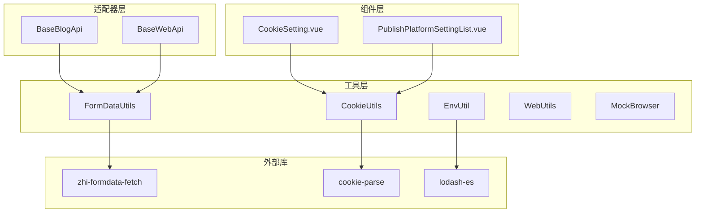
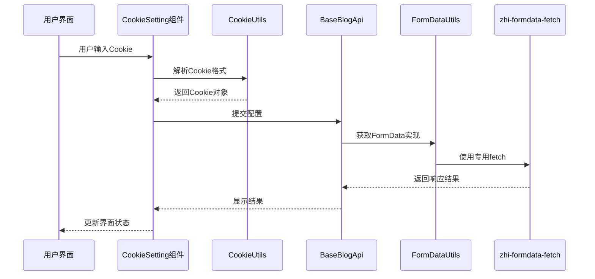
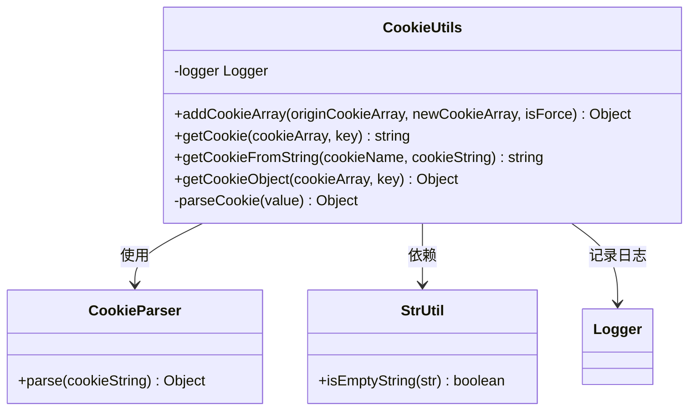
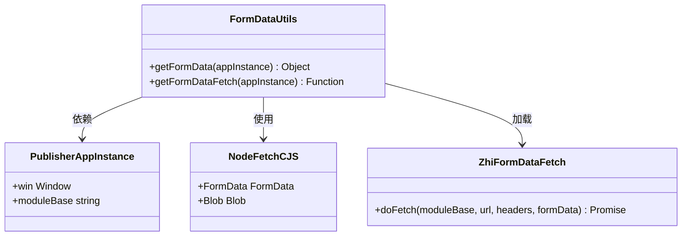
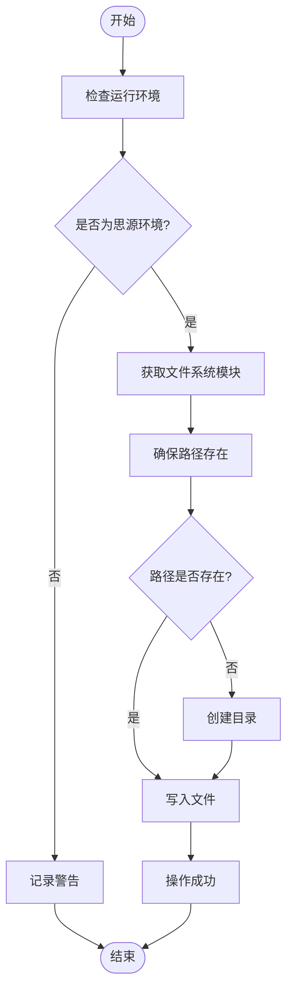
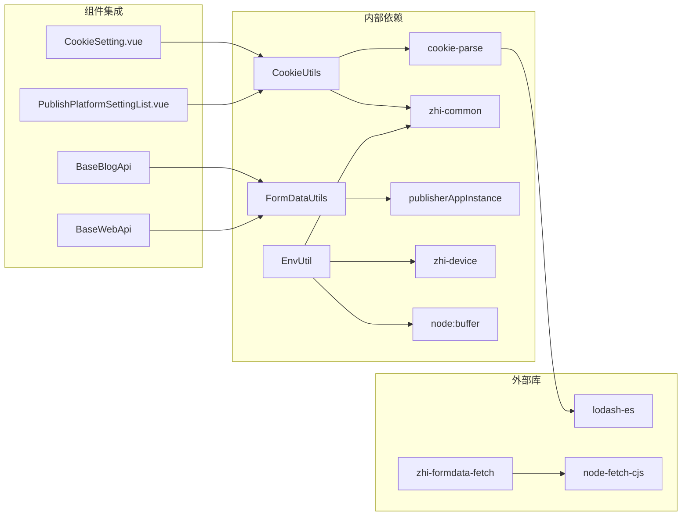

# 网络和Cookie工具

<cite>
**本文档引用的文件**
- [cookieUtils.ts](file://src/utils/cookieUtils.ts)
- [cookieUtils.spec.ts](file://src/utils/cookieUtils.spec.ts)
- [FormDataUtils.ts](file://src/utils/FormDataUtils.ts)
- [EnvUtil.ts](file://src/utils/EnvUtil.ts)
- [webUtils.ts](file://src/adaptors/web/base/webUtils.ts)
- [baseBlogApi.ts](file://src/adaptors/api/base/baseBlogApi.ts)
- [baseWebApi.ts](file://src/adaptors/web/base/baseWebApi.ts)
- [index.cjs](file://public/libs/zhi-formdata-fetch/index.cjs)
- [CookieSetting.vue](file://src/components/set/publish/singleplatform/base/CookieSetting.vue)
- [PublishPlatformSettingList.vue](file://src/components/set/publish/platform/PublishPlatformSettingList.vue)
- [MockBrowser.ts](file://src/utils/MockBrowser.ts)
</cite>

## 目录
1. [简介](#简介)
2. [项目结构](#项目结构)
3. [核心组件](#核心组件)
4. [架构概览](#架构概览)
5. [详细组件分析](#详细组件分析)
6. [依赖关系分析](#依赖关系分析)
7. [性能考虑](#性能考虑)
8. [故障排除指南](#故障排除指南)
9. [结论](#结论)

## 简介

本文档详细介绍了网络和Cookie管理工具API，涵盖了Cookie操作、表单数据处理、环境变量管理等核心功能。该工具集为思源笔记插件提供了完整的网络通信支持，包括Cookie会话管理、表单数据序列化、文件系统操作等功能。

主要工具包括：
- **CookieUtils**: 提供Cookie读写、删除、解析等操作
- **FormDataUtils**: 处理FormData序列化和HTTP请求
- **EnvUtil**: 环境配置管理和文件系统操作
- **WebUtils**: 网页Cookie解析工具
- **MockBrowser**: 模拟浏览器请求头

## 项目结构

该项目采用模块化的架构设计，将网络和Cookie管理功能组织在独立的工具类中：



**图表来源**
- [cookieUtils.ts:1-119](file://src/utils/cookieUtils.ts#L1-L119)
- [FormDataUtils.ts:1-50](file://src/utils/FormDataUtils.ts#L1-L50)
- [EnvUtil.ts:1-223](file://src/utils/EnvUtil.ts#L1-L223)

**章节来源**
- [cookieUtils.ts:1-119](file://src/utils/cookieUtils.ts#L1-L119)
- [FormDataUtils.ts:1-50](file://src/utils/FormDataUtils.ts#L1-L50)
- [EnvUtil.ts:1-223](file://src/utils/EnvUtil.ts#L1-L223)

## 核心组件

### CookieUtils - Cookie管理工具

CookieUtils类提供了完整的Cookie操作功能，包括数组管理、字符串解析、对象转换等。

**主要功能**:
- Cookie数组合并和去重
- Cookie键值查询
- Cookie字符串解析
- Cookie对象提取

**关键方法**:
- `addCookieArray()`: 合并Cookie数组，支持过期时间比较和强制更新
- `getCookie()`: 根据键获取Cookie字符串
- `getCookieFromString()`: 从字符串中解析特定Cookie
- `getCookieObject()`: 获取Cookie对象

### FormDataUtils - 表单数据处理

FormDataUtils专门处理FormData序列化和HTTP请求，支持多种运行环境。

**核心功能**:
- 动态获取FormData构造函数
- 获取FormData专用fetch实现
- 支持Node.js和浏览器环境

**重要特性**:
- 自动检测运行环境
- 支持Electron环境下的特殊处理
- 提供Blob支持

### EnvUtil - 环境配置管理

EnvUtil提供了完整的环境检测和文件系统操作能力。

**主要功能**:
- 环境检测（思源Electron环境识别）
- 文件系统操作（读写、删除、创建）
- 路径管理（标准化、拼接、目录获取）
- 文件名清理

**安全特性**:
- 路径标准化防止目录遍历攻击
- 文件名非法字符清理
- 错误日志记录

**章节来源**
- [cookieUtils.ts:15-119](file://src/utils/cookieUtils.ts#L15-L119)
- [FormDataUtils.ts:12-50](file://src/utils/FormDataUtils.ts#L12-L50)
- [EnvUtil.ts:15-223](file://src/utils/EnvUtil.ts#L15-L223)

## 架构概览

系统采用分层架构，各组件职责明确：



**图表来源**
- [CookieSetting.vue:50-80](file://src/components/set/publish/singleplatform/base/CookieSetting.vue#L50-L80)
- [baseBlogApi.ts:182-194](file://src/adaptors/api/base/baseBlogApi.ts#L182-L194)
- [FormDataUtils.ts:42-46](file://src/utils/FormDataUtils.ts#L42-L46)

## 详细组件分析

### CookieUtils 组件分析



**图表来源**
- [cookieUtils.ts:18-116](file://src/utils/cookieUtils.ts#L18-L116)

**实现特点**:
- 使用cookie-parse库进行Cookie解析
- 支持过期时间比较和智能更新
- 提供多种Cookie查询方式
- 包装错误处理和日志记录

**使用场景**:
- 平台认证和会话管理
- Cookie数据验证和清理
- 多平台Cookie兼容性处理

### FormDataUtils 组件分析



**图表来源**
- [FormDataUtils.ts:19-47](file://src/utils/FormDataUtils.ts#L19-L47)

**核心流程**:
1. 检测运行环境（浏览器 vs Node.js）
2. 动态加载相应的FormData实现
3. 提供统一的fetch接口
4. 支持二进制数据传输

**章节来源**
- [FormDataUtils.ts:19-47](file://src/utils/FormDataUtils.ts#L19-L47)

### EnvUtil 组件分析



**图表来源**
- [EnvUtil.ts:46-99](file://src/utils/EnvUtil.ts#L46-L99)

**安全考虑**:
- 路径标准化防止目录遍历
- 文件名非法字符清理
- 权限检查和错误处理
- 日志记录便于审计

**章节来源**
- [EnvUtil.ts:21-223](file://src/utils/EnvUtil.ts#L21-L223)

### WebUtils 组件分析

WebUtils提供了基础的Cookie解析功能，作为CookieUtils的补充：

```mermaid
classDiagram
class WebUtils {
<<static>>
+readCookie(key, cookieString) string
}
note for WebUtils : "简单字符串解析<br/>不支持复杂Cookie属性"
```

**图表来源**
- [webUtils.ts:15-41](file://src/adaptors/web/base/webUtils.ts#L15-L41)

**使用场景**:
- 简单的Cookie键值提取
- 兼容性处理
- 辅助解析

## 依赖关系分析



**图表来源**
- [cookieUtils.ts:10-13](file://src/utils/cookieUtils.ts#L10-L13)
- [FormDataUtils.ts:10](file://src/utils/FormDataUtils.ts#L10)
- [EnvUtil.ts:10-13](file://src/utils/EnvUtil.ts#L10-L13)

**依赖特点**:
- 最小化外部依赖
- 模块化设计便于测试
- 运行时动态加载
- 类型安全保证

**章节来源**
- [cookieUtils.ts:10-13](file://src/utils/cookieUtils.ts#L10-L13)
- [FormDataUtils.ts:10](file://src/utils/FormDataUtils.ts#L10)
- [EnvUtil.ts:10-13](file://src/utils/EnvUtil.ts#L10-L13)

## 性能考虑

### Cookie处理优化

- **内存管理**: 使用数组去重避免重复存储
- **解析缓存**: Cookie对象解析结果可复用
- **批量操作**: 支持一次性处理多个Cookie

### FormData传输优化

- **流式处理**: 支持大文件的流式传输
- **压缩支持**: 可选的Base64编码减少传输开销
- **连接复用**: 复用HTTP连接提高效率

### 环境检测优化

- **懒加载**: 外部库按需加载
- **缓存策略**: 环境信息缓存避免重复检测
- **降级处理**: 缺失功能时的优雅降级

## 故障排除指南

### Cookie相关问题

**常见问题**:
1. Cookie解析失败
   - 检查Cookie格式是否正确
   - 验证过期时间格式
   - 查看日志输出

2. Cookie丢失或覆盖
   - 检查过期时间比较逻辑
   - 确认isForce参数设置
   - 验证数组去重效果

**调试建议**:
- 启用详细日志记录
- 使用单元测试验证边界情况
- 检查浏览器兼容性

### FormData传输问题

**常见问题**:
1. 传输失败
   - 检查URL格式和权限
   - 验证请求头设置
   - 确认FormData格式

2. 数据损坏
   - 检查Base64编码/解码
   - 验证二进制数据完整性
   - 确认缓冲区大小

**调试建议**:
- 使用网络监控工具
- 检查服务器端日志
- 验证客户端配置

### 环境检测问题

**常见问题**:
1. 环境识别错误
   - 检查window对象可用性
   - 验证process对象存在
   - 确认模块加载状态

2. 文件系统操作失败
   - 检查权限设置
   - 验证路径格式
   - 确认磁盘空间

**章节来源**
- [cookieUtils.spec.ts:13-45](file://src/utils/cookieUtils.spec.ts#L13-L45)

## 结论

网络和Cookie管理工具集为思源笔记插件提供了完整的网络通信基础设施。通过模块化设计和清晰的职责分离，这些工具实现了：

**核心优势**:
- **安全性**: 完整的错误处理和日志记录
- **兼容性**: 支持多种运行环境和平台
- **可维护性**: 清晰的API设计和文档
- **可扩展性**: 模块化架构便于功能扩展

**最佳实践建议**:
1. 始终进行输入验证和错误处理
2. 使用适当的日志级别记录关键操作
3. 在生产环境中启用安全检查
4. 定期更新依赖库以获得最新修复

这些工具为复杂的网络操作提供了可靠的基础，确保了插件在各种环境下的稳定运行。