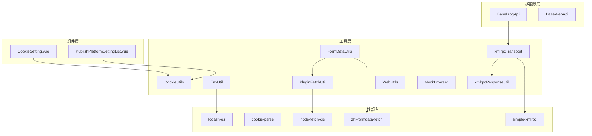
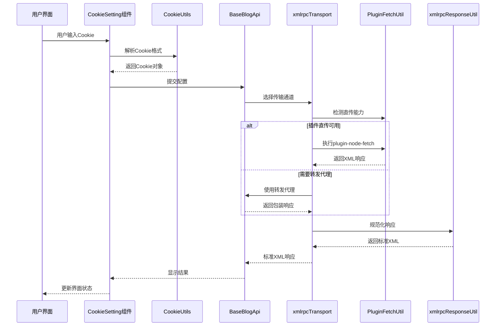
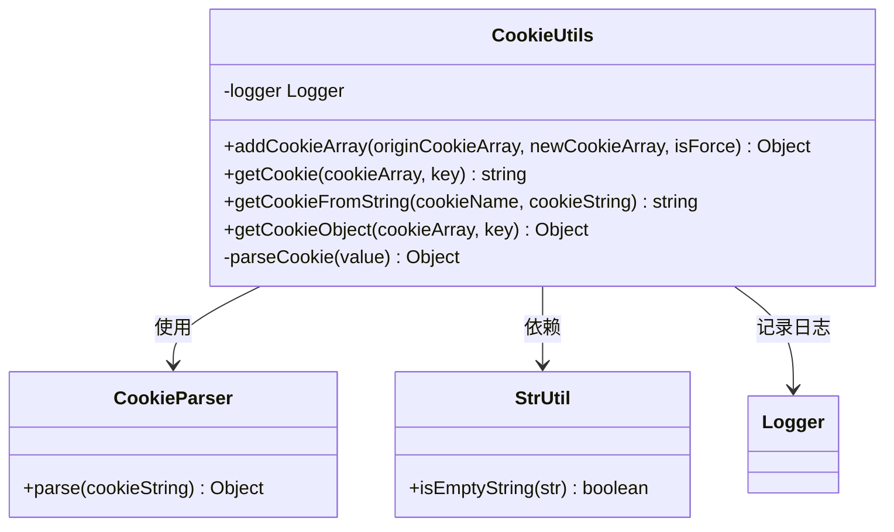
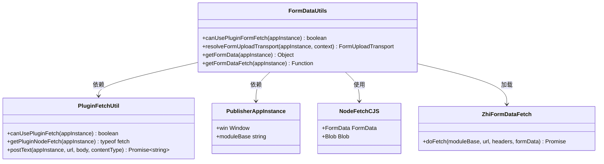
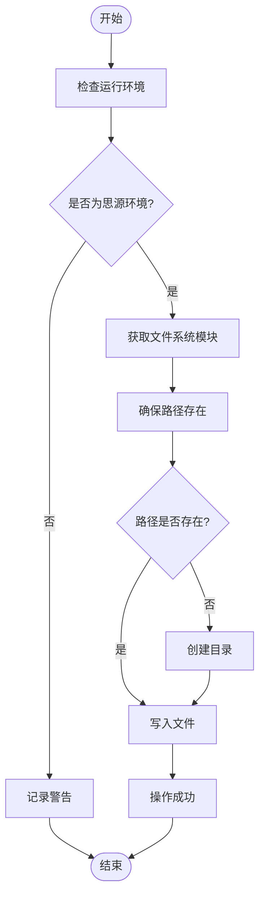
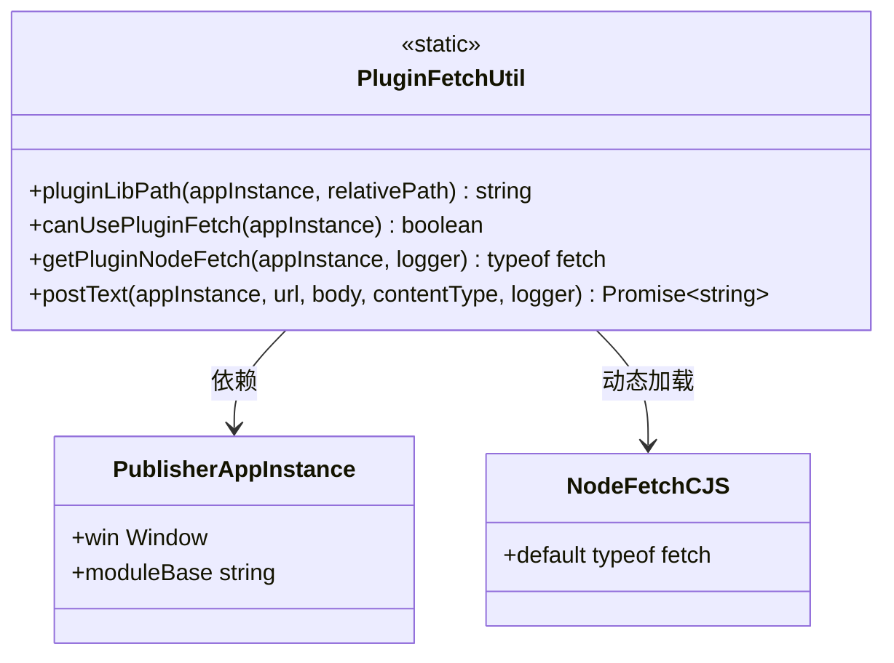
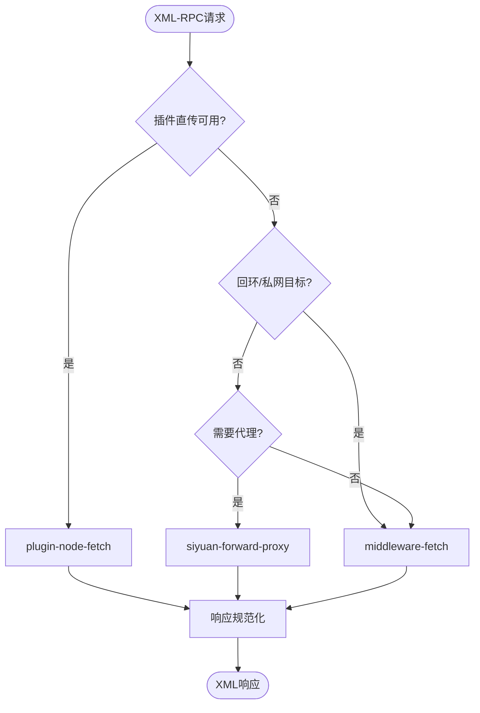
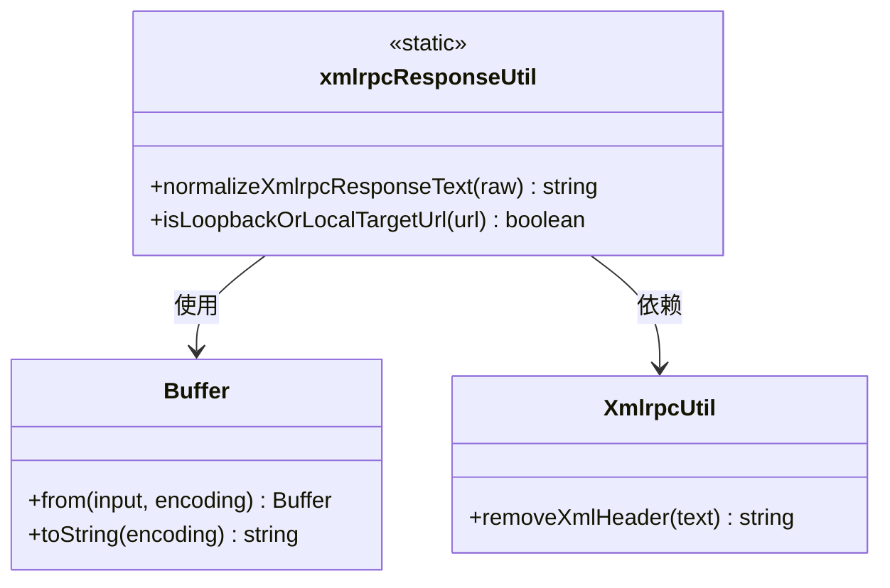
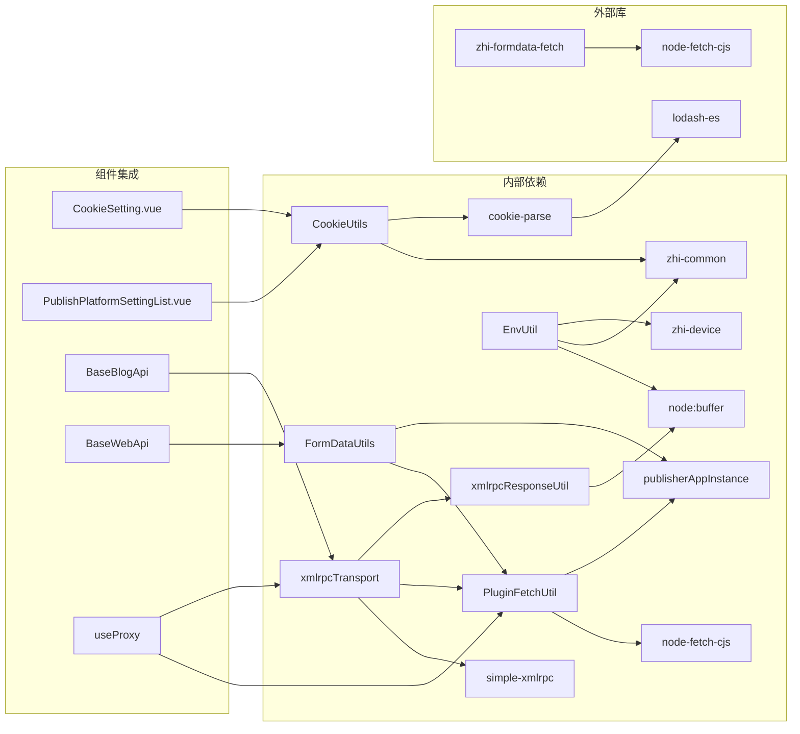

# 网络和Cookie工具

<cite>
**本文档引用的文件**
- [cookieUtils.ts](file://src/utils/cookieUtils.ts)
- [cookieUtils.spec.ts](file://src/utils/cookieUtils.spec.ts)
- [FormDataUtils.ts](file://src/utils/FormDataUtils.ts)
- [EnvUtil.ts](file://src/utils/EnvUtil.ts)
- [PluginFetchUtil.ts](file://src/utils/PluginFetchUtil.ts)
- [xmlrpcTransport.ts](file://src/utils/xmlrpcTransport.ts)
- [xmlrpcResponseUtil.ts](file://src/utils/xmlrpcResponseUtil.ts)
- [useProxy.ts](file://src/composables/useProxy.ts)
- [webUtils.ts](file://src/adaptors/web/base/webUtils.ts)
- [baseBlogApi.ts](file://src/adaptors/api/base/baseBlogApi.ts)
- [baseWebApi.ts](file://src/adaptors/web/base/baseWebApi.ts)
- [index.cjs](file://public/libs/zhi-formdata-fetch/index.cjs)
- [CookieSetting.vue](file://src/components/set/publish/singleplatform/base/CookieSetting.vue)
- [PublishPlatformSettingList.vue](file://src/components/set/publish/platform/PublishPlatformSettingList.vue)
- [MockBrowser.ts](file://src/utils/MockBrowser.ts)
</cite>

## 更新摘要
**所做更改**
- 新增PluginFetchUtil插件直传工具类，提供统一的node-fetch直传能力
- 引入XML-RPC三层传输架构，包括插件直传、思源转发代理和中间件回退
- 实现响应规范化处理，统一XML-RPC响应格式
- 新增回环地址检测功能，确保本地目标的安全传输
- 更新FormDataUtils以支持新的传输架构

## 目录
1. [简介](#简介)
2. [项目结构](#项目结构)
3. [核心组件](#核心组件)
4. [架构概览](#架构概览)
5. [详细组件分析](#详细组件分析)
6. [依赖关系分析](#依赖关系分析)
7. [性能考虑](#性能考虑)
8. [故障排除指南](#故障排除指南)
9. [结论](#结论)

## 简介

本文档详细介绍了网络和Cookie管理工具API，涵盖了Cookie操作、表单数据处理、环境变量管理以及新增的XML-RPC传输架构等核心功能。该工具集为思源笔记插件提供了完整的网络通信支持，包括Cookie会话管理、表单数据序列化、文件系统操作以及现代化的XML-RPC传输机制。

**新增功能**:
- **PluginFetchUtil**: 提供插件宿主内的node-fetch直传能力
- **XML-RPC三层传输架构**: 支持插件直传、思源转发代理和中间件回退
- **响应规范化处理**: 统一XML-RPC响应格式，处理包装对象和base64编码
- **回环地址检测**: 安全检测本地和私网目标地址

主要工具包括：
- **CookieUtils**: 提供Cookie读写、删除、解析等操作
- **FormDataUtils**: 处理FormData序列化和HTTP请求，支持新的传输架构
- **EnvUtil**: 环境配置管理和文件系统操作
- **PluginFetchUtil**: 插件宿主内的node-fetch直传工具
- **xmlrpcTransport**: XML-RPC传输通道选择和执行
- **xmlrpcResponseUtil**: XML-RPC响应规范化处理
- **WebUtils**: 网页Cookie解析工具
- **MockBrowser**: 模拟浏览器请求头

## 项目结构

该项目采用模块化的架构设计，将网络和Cookie管理功能组织在独立的工具类中，并引入了新的XML-RPC传输架构：

```mermaid
graph TB
subgraph "工具层"
CU[CookieUtils]
FDU[FormDataUtils]
EU[EnvUtil]
PFT[PluginFetchUtil]
XRT[xmlrpcTransport]
XRNU[xmlrpcResponseUtil]
WU[WebUtils]
MB[MockBrowser]
end
subgraph "适配器层"
BA[BaseBlogApi]
BWA[BaseWebApi]
end
subgraph "组件层"
CS[CookieSetting.vue]
PPSL[PublishPlatformSettingList.vue]
end
subgraph "外部库"
ZFD[zhi-formdata-fetch]
CP[cookie-parse]
LC[lodash-es]
NF[node-fetch-cjs]
SR[simple-xmlrpc]
end
PFT --> NF
XRT --> XRNU
FDU --> PFT
FDU --> ZFD
XRT --> SR
BA --> XRT
CS --> CU
PPSL --> CU
EU --> LC
```

**图表来源**
- [cookieUtils.ts:1-119](file://src/utils/cookieUtils.ts#L1-L119)
- [FormDataUtils.ts:1-88](file://src/utils/FormDataUtils.ts#L1-L88)
- [EnvUtil.ts:1-223](file://src/utils/EnvUtil.ts#L1-L223)
- [PluginFetchUtil.ts:1-67](file://src/utils/PluginFetchUtil.ts#L1-L67)
- [xmlrpcTransport.ts:1-80](file://src/utils/xmlrpcTransport.ts#L1-L80)
- [xmlrpcResponseUtil.ts:1-188](file://src/utils/xmlrpcResponseUtil.ts#L1-L188)

**章节来源**
- [cookieUtils.ts:1-119](file://src/utils/cookieUtils.ts#L1-L119)
- [FormDataUtils.ts:1-88](file://src/utils/FormDataUtils.ts#L1-L88)
- [EnvUtil.ts:1-223](file://src/utils/EnvUtil.ts#L1-L223)
- [PluginFetchUtil.ts:1-67](file://src/utils/PluginFetchUtil.ts#L1-L67)
- [xmlrpcTransport.ts:1-80](file://src/utils/xmlrpcTransport.ts#L1-L80)
- [xmlrpcResponseUtil.ts:1-188](file://src/utils/xmlrpcResponseUtil.ts#L1-L188)

## 核心组件

### CookieUtils - Cookie管理工具

CookieUtils类提供了完整的Cookie操作功能，包括数组管理、字符串解析、对象转换等。

**主要功能**:
- Cookie数组合并和去重
- Cookie键值查询
- Cookie字符串解析
- Cookie对象提取

**关键方法**:
- `addCookieArray()`: 合并Cookie数组，支持过期时间比较和强制更新
- `getCookie()`: 根据键获取Cookie字符串
- `getCookieFromString()`: 从字符串中解析特定Cookie
- `getCookieObject()`: 获取Cookie对象

### FormDataUtils - 表单数据处理

FormDataUtils专门处理FormData序列化和HTTP请求，支持多种运行环境和新的传输架构。

**核心功能**:
- 动态获取FormData构造函数
- 获取FormData专用fetch实现
- 支持插件直传和转发代理
- 支持Node.js和浏览器环境

**重要特性**:
- 自动检测运行环境和插件直传能力
- 支持Electron环境下的特殊处理
- 提供Blob支持
- 与PluginFetchUtil集成

### EnvUtil - 环境配置管理

EnvUtil提供了完整的环境检测和文件系统操作能力。

**主要功能**:
- 环境检测（思源Electron环境识别）
- 文件系统操作（读写、删除、创建）
- 路径管理（标准化、拼接、目录获取）
- 文件名清理

**安全特性**:
- 路径标准化防止目录遍历攻击
- 文件名非法字符清理
- 错误日志记录

### PluginFetchUtil - 插件直传工具

**新增组件**，提供插件宿主内的node-fetch直传能力，支持所有类型的网络请求。

**核心功能**:
- 检测插件直传能力（win.require）
- 获取插件内置的node-fetch实例
- 统一的文本POST请求处理
- 错误处理和降级机制

**关键方法**:
- `canUsePluginFetch()`: 检测是否具备插件直传能力
- `getPluginNodeFetch()`: 获取插件node-fetch实例
- `postText()`: 统一的文本POST请求

### xmlrpcTransport - XML-RPC传输架构

**新增组件**，实现三层XML-RPC传输架构，提供灵活的传输选择和执行机制。

**三层传输优先级**:
1. **plugin-node-fetch** - 插件直传（最高优先级）
2. **siyuan-forward-proxy** - 思源转发代理
3. **middleware-fetch** - 中间件回退

**核心功能**:
- 传输通道选择逻辑
- 统一的传输执行接口
- 与PluginFetchUtil集成
- 与useProxy组合使用

### xmlrpcResponseUtil - XML-RPC响应处理

**新增组件**，专门处理XML-RPC响应的规范化和解码。

**核心功能**:
- 响应文本提取和解码
- base64内容解码处理
- 包装对象字段提取
- 错误处理和异常抛出

**关键方法**:
- `normalizeXmlrpcResponseText()`: 规范化XML-RPC响应
- `isLoopbackOrLocalTargetUrl()`: 检测回环地址

**章节来源**
- [cookieUtils.ts:15-119](file://src/utils/cookieUtils.ts#L15-L119)
- [FormDataUtils.ts:12-88](file://src/utils/FormDataUtils.ts#L12-L88)
- [EnvUtil.ts:15-223](file://src/utils/EnvUtil.ts#L15-L223)
- [PluginFetchUtil.ts:14-67](file://src/utils/PluginFetchUtil.ts#L14-L67)
- [xmlrpcTransport.ts:12-80](file://src/utils/xmlrpcTransport.ts#L12-L80)
- [xmlrpcResponseUtil.ts:12-188](file://src/utils/xmlrpcResponseUtil.ts#L12-L188)

## 架构概览

系统采用分层架构，引入了新的XML-RPC传输架构，各组件职责明确：

```mermaid
sequenceDiagram
participant UI as 用户界面
participant CS as CookieSetting组件
participant CU as CookieUtils
participant BA as BaseBlogApi
participant XRT as xmlrpcTransport
participant PFT as PluginFetchUtil
participant XRNU as xmlrpcResponseUtil
UI->>CS : 用户输入Cookie
CS->>CU : 解析Cookie格式
CU-->>CS : 返回Cookie对象
CS->>BA : 提交配置
BA->>XRT : 选择传输通道
XRT->>PFT : 检测直传能力
alt 插件直传可用
XRT->>PFT : 执行plugin-node-fetch
PFT-->>XRT : 返回XML响应
else 需要转发代理
XRT->>BA : 使用转发代理
BA-->>XRT : 返回包装响应
end
XRT->>XRNU : 规范化响应
XRNU-->>XRT : 返回标准XML
XRT-->>BA : 标准XML响应
BA-->>CS : 显示结果
CS-->>UI : 更新界面状态
```

**图表来源**
- [CookieSetting.vue:50-80](file://src/components/set/publish/singleplatform/base/CookieSetting.vue#L50-L80)
- [baseBlogApi.ts:182-194](file://src/adaptors/api/base/baseBlogApi.ts#L182-L194)
- [xmlrpcTransport.ts:48-76](file://src/utils/xmlrpcTransport.ts#L48-L76)
- [useProxy.ts:116-142](file://src/composables/useProxy.ts#L116-L142)

## 详细组件分析

### CookieUtils 组件分析

```mermaid
classDiagram
class CookieUtils {
-logger Logger
+addCookieArray(originCookieArray, newCookieArray, isForce) Object
+getCookie(cookieArray, key) string
+getCookieFromString(cookieName, cookieString) string
+getCookieObject(cookieArray, key) Object
-parseCookie(value) Object
}
class CookieParser {
+parse(cookieString) Object
}
class StrUtil {
+isEmptyString(str) boolean
}
CookieUtils --> CookieParser : 使用
CookieUtils --> StrUtil : 依赖
CookieUtils --> Logger : 记录日志
```

**图表来源**
- [cookieUtils.ts:18-116](file://src/utils/cookieUtils.ts#L18-L116)

**实现特点**:
- 使用cookie-parse库进行Cookie解析
- 支持过期时间比较和智能更新
- 提供多种Cookie查询方式
- 包装错误处理和日志记录

**使用场景**:
- 平台认证和会话管理
- Cookie数据验证和清理
- 多平台Cookie兼容性处理

### FormDataUtils 组件分析

```mermaid
classDiagram
class FormDataUtils {
+canUsePluginFormFetch(appInstance) boolean
+resolveFormUploadTransport(appInstance, context) FormUploadTransport
+getFormData(appInstance) Object
+getFormDataFetch(appInstance) Function
}
class PluginFetchUtil {
+canUsePluginFetch(appInstance) boolean
+getPluginNodeFetch(appInstance) typeof fetch
+postText(appInstance, url, body, contentType) Promise~string~
}
class PublisherAppInstance {
+win Window
+moduleBase string
}
class NodeFetchCJS {
+FormData FormData
+Blob Blob
}
class ZhiFormDataFetch {
+doFetch(moduleBase, url, headers, formData) Promise
}
FormDataUtils --> PluginFetchUtil : 依赖
FormDataUtils --> PublisherAppInstance : 依赖
FormDataUtils --> NodeFetchCJS : 使用
FormDataUtils --> ZhiFormDataFetch : 加载
```

**图表来源**
- [FormDataUtils.ts:19-83](file://src/utils/FormDataUtils.ts#L19-L83)

**核心流程**:
1. 检测插件直传能力
2. 选择表单上传传输方式
3. 动态加载相应的FormData实现
4. 提供统一的fetch接口
5. 支持二进制数据传输

**更新** 新增对PluginFetchUtil的依赖，支持插件直传能力检测

**章节来源**
- [FormDataUtils.ts:19-83](file://src/utils/FormDataUtils.ts#L19-L83)

### EnvUtil 组件分析

```mermaid
flowchart TD
Start([开始]) --> CheckEnv["检查运行环境"]
CheckEnv --> IsSiyuan{"是否为思源环境?"}
IsSiyuan --> |是| GetFS["获取文件系统模块"]
IsSiyuan --> |否| LogWarn["记录警告"]
GetFS --> EnsurePath["确保路径存在"]
EnsurePath --> PathExists{"路径是否存在?"}
PathExists --> |否| CreateDir["创建目录"]
PathExists --> |是| WriteFile["写入文件"]
CreateDir --> WriteFile
WriteFile --> Success["操作成功"]
LogWarn --> End([结束])
Success --> End
```

**图表来源**
- [EnvUtil.ts:46-99](file://src/utils/EnvUtil.ts#L46-L99)

**安全考虑**:
- 路径标准化防止目录遍历
- 文件名非法字符清理
- 权限检查和错误处理
- 日志记录便于审计

**章节来源**
- [EnvUtil.ts:21-223](file://src/utils/EnvUtil.ts#L21-L223)

### PluginFetchUtil 组件分析

**新增组件**，提供插件宿主内的node-fetch直传能力。

```mermaid
classDiagram
class PluginFetchUtil {
<<static>>
+pluginLibPath(appInstance, relativePath) string
+canUsePluginFetch(appInstance) boolean
+getPluginNodeFetch(appInstance, logger) typeof fetch
+postText(appInstance, url, body, contentType, logger) Promise~string~
}
class PublisherAppInstance {
+win Window
+moduleBase string
}
class NodeFetchCJS {
+default typeof fetch
}
PluginFetchUtil --> PublisherAppInstance : 依赖
PluginFetchUtil --> NodeFetchCJS : 动态加载
```

**图表来源**
- [PluginFetchUtil.ts:17-63](file://src/utils/PluginFetchUtil.ts#L17-L63)

**核心功能**:
- 检测插件直传能力（win.require）
- 动态加载插件内置的node-fetch
- 统一的文本POST请求处理
- 错误处理和降级机制

**实现特点**:
- 使用win.require动态加载插件库
- 提供默认降级方案（appInstance.fetch）
- 统一的错误处理和日志记录
- 支持多种内容类型的POST请求

**章节来源**
- [PluginFetchUtil.ts:17-63](file://src/utils/PluginFetchUtil.ts#L17-L63)

### xmlrpcTransport 组件分析

**新增组件**，实现XML-RPC传输的三层架构。

```mermaid
flowchart TD
Start([XML-RPC请求]) --> CheckPlugin{"插件直传可用?"}
CheckPlugin --> |是| UsePlugin["plugin-node-fetch"]
CheckPlugin --> |否| CheckLoopback{"回环/私网目标?"}
CheckLoopback --> |是| UseMiddleware["middleware-fetch"]
CheckLoopback --> |否| CheckProxy{"需要代理?"}
CheckProxy --> |是| UseProxy["siyuan-forward-proxy"]
CheckProxy --> |否| UseMiddleware
UsePlugin --> Normalize["响应规范化"]
UseProxy --> Normalize
UseMiddleware --> Normalize
Normalize --> End([XML响应])
```

**图表来源**
- [xmlrpcTransport.ts:48-76](file://src/utils/xmlrpcTransport.ts#L48-L76)

**传输优先级**:
1. **plugin-node-fetch** - 插件直传（最高优先级）
2. **siyuan-forward-proxy** - 转发代理（需要代理且非回环）
3. **middleware-fetch** - 中间件回退（其他情况）

**实现特点**:
- 独立的传输选择逻辑
- 统一的执行接口
- 与PluginFetchUtil深度集成
- 支持响应规范化处理

**章节来源**
- [xmlrpcTransport.ts:48-76](file://src/utils/xmlrpcTransport.ts#L48-L76)

### xmlrpcResponseUtil 组件分析

**新增组件**，专门处理XML-RPC响应的规范化。

```mermaid
classDiagram
class xmlrpcResponseUtil {
<<static>>
+normalizeXmlrpcResponseText(raw) string
+isLoopbackOrLocalTargetUrl(url) boolean
}
class Buffer {
+from(input, encoding) Buffer
+toString(encoding) string
}
class XmlrpcUtil {
+removeXmlHeader(text) string
}
xmlrpcResponseUtil --> Buffer : 使用
xmlrpcResponseUtil --> XmlrpcUtil : 依赖
```

**图表来源**
- [xmlrpcResponseUtil.ts:128-157](file://src/utils/xmlrpcResponseUtil.ts#L128-L157)

**核心功能**:
- 从包装对象中提取XML文本
- base64内容解码处理
- 统一的XML响应格式
- 错误处理和异常抛出

**实现特点**:
- 支持多种包装对象格式
- 自动base64解码
- 深度搜索嵌套XML内容
- 清晰的错误信息

**章节来源**
- [xmlrpcResponseUtil.ts:128-157](file://src/utils/xmlrpcResponseUtil.ts#L128-L157)

### WebUtils 组件分析

WebUtils提供了基础的Cookie解析功能，作为CookieUtils的补充：

```mermaid
classDiagram
class WebUtils {
<<static>>
+readCookie(key, cookieString) string
}
note for WebUtils : "简单字符串解析<br/>不支持复杂Cookie属性"
```

**图表来源**
- [webUtils.ts:15-41](file://src/adaptors/web/base/webUtils.ts#L15-L41)

**使用场景**:
- 简单的Cookie键值提取
- 兼容性处理
- 辅助解析

## 依赖关系分析

```mermaid
graph LR
subgraph "内部依赖"
CU[CookieUtils] --> CP[cookie-parse]
CU --> SC[zhi-common]
FDU[FormDataUtils] --> PAI[publisherAppInstance]
FDU --> PFT[PluginFetchUtil]
EU[EnvUtil] --> SD[zhi-device]
EU --> SC
EU --> NB[node:buffer]
PFT --> PAI[publisherAppInstance]
PFT --> NF[node-fetch-cjs]
XRT[xmlrpcTransport] --> XRNU[xmlrpcResponseUtil]
XRT --> PFT
XRT --> SR[simple-xmlrpc]
XRNU --> NB
end
subgraph "外部库"
CP --> Lodash[lodash-es]
ZFD[zhi-formdata-fetch] --> NFetch[node-fetch-cjs]
end
subgraph "组件集成"
CS[CookieSetting.vue] --> CU
PPSL[PublishPlatformSettingList.vue] --> CU
BA[BaseBlogApi] --> XRT
BWA[BaseWebApi] --> FDU
UP[useProxy] --> XRT
UP --> PFT
end
```

**图表来源**
- [cookieUtils.ts:10-13](file://src/utils/cookieUtils.ts#L10-L13)
- [FormDataUtils.ts:10](file://src/utils/FormDataUtils.ts#L10)
- [EnvUtil.ts:10-13](file://src/utils/EnvUtil.ts#L10-L13)
- [PluginFetchUtil.ts:10-12](file://src/utils/PluginFetchUtil.ts#L10-L12)
- [xmlrpcTransport.ts:10](file://src/utils/xmlrpcTransport.ts#L10)
- [xmlrpcResponseUtil.ts:10](file://src/utils/xmlrpcResponseUtil.ts#L10)

**依赖特点**:
- 最小化外部依赖
- 模块化设计便于测试
- 运行时动态加载
- 类型安全保证
- **新增** PluginFetchUtil与外部node-fetch-cjs的集成

**章节来源**
- [cookieUtils.ts:10-13](file://src/utils/cookieUtils.ts#L10-L13)
- [FormDataUtils.ts:10](file://src/utils/FormDataUtils.ts#L10)
- [EnvUtil.ts:10-13](file://src/utils/EnvUtil.ts#L10-L13)
- [PluginFetchUtil.ts:10-12](file://src/utils/PluginFetchUtil.ts#L10-L12)
- [xmlrpcTransport.ts:10](file://src/utils/xmlrpcTransport.ts#L10)
- [xmlrpcResponseUtil.ts:10](file://src/utils/xmlrpcResponseUtil.ts#L10)

## 性能考虑

### Cookie处理优化

- **内存管理**: 使用数组去重避免重复存储
- **解析缓存**: Cookie对象解析结果可复用
- **批量操作**: 支持一次性处理多个Cookie

### FormData传输优化

- **流式处理**: 支持大文件的流式传输
- **压缩支持**: 可选的Base64编码减少传输开销
- **连接复用**: 复用HTTP连接提高效率
- **插件直传优化**: 直接使用插件内置的node-fetch，避免中间层开销

### XML-RPC传输优化

**新增优化特性**:
- **传输选择缓存**: 传输通道选择结果可缓存
- **响应规范化缓存**: 解码后的XML内容可复用
- **回环地址快速检测**: 使用正则表达式快速判断
- **插件直传优先**: 优先使用性能更好的直传方式

### 环境检测优化

- **懒加载**: 外部库按需加载
- **缓存策略**: 环境信息缓存避免重复检测
- **降级处理**: 缺失功能时的优雅降级

## 故障排除指南

### Cookie相关问题

**常见问题**:
1. Cookie解析失败
   - 检查Cookie格式是否正确
   - 验证过期时间格式
   - 查看日志输出

2. Cookie丢失或覆盖
   - 检查过期时间比较逻辑
   - 确认isForce参数设置
   - 验证数组去重效果

**调试建议**:
- 启用详细日志记录
- 使用单元测试验证边界情况
- 检查浏览器兼容性

### FormData传输问题

**常见问题**:
1. 传输失败
   - 检查URL格式和权限
   - 验证请求头设置
   - 确认FormData格式

2. 数据损坏
   - 检查Base64编码/解码
   - 验证二进制数据完整性
   - 确认缓冲区大小

**调试建议**:
- 使用网络监控工具
- 检查服务器端日志
- 验证客户端配置

### XML-RPC传输问题

**新增问题**:
1. **传输通道选择错误**
   - 检查PluginFetchUtil.canUsePluginFetch返回值
   - 验证URL是否为回环地址
   - 确认代理标志设置

2. **响应规范化失败**
   - 检查响应格式是否符合预期
   - 验证base64编码是否正确
   - 确认包装对象字段名称

3. **插件直传失败**
   - 检查win.require是否可用
   - 验证node-fetch库路径
   - 确认插件库是否正确打包

**调试建议**:
- 启用详细的XML-RPC日志
- 使用单元测试验证传输逻辑
- 检查不同环境下的行为差异

### 环境检测问题

**常见问题**:
1. 环境识别错误
   - 检查window对象可用性
   - 验证process对象存在
   - 确认模块加载状态

2. 文件系统操作失败
   - 检查权限设置
   - 验证路径格式
   - 确认磁盘空间

**章节来源**
- [cookieUtils.spec.ts:13-45](file://src/utils/cookieUtils.spec.ts#L13-L45)
- [xmlrpcTransport.spec.ts:17-61](file://src/utils/xmlrpcTransport.spec.ts#L17-L61)
- [xmlrpcResponseUtil.spec.ts:14-74](file://src/utils/xmlrpcResponseUtil.spec.ts#L14-L74)

## 结论

网络和Cookie管理工具集为思源笔记插件提供了完整的网络通信基础设施，通过模块化设计、清晰的职责分离和新增的XML-RPC传输架构，实现了：

**核心优势**:
- **安全性**: 完整的错误处理和日志记录，包含回环地址检测
- **兼容性**: 支持多种运行环境和平台，包括插件直传能力
- **可维护性**: 清晰的API设计和文档，模块化架构便于功能扩展
- **可扩展性**: 灵活的传输架构支持未来功能扩展
- **性能优化**: 插件直传优先策略，减少中间层开销

**新增架构优势**:
- **三层传输选择**: 根据环境和需求自动选择最优传输方式
- **统一响应处理**: 规范化XML-RPC响应，简化上层逻辑
- **安全传输保障**: 回环地址检测防止本地目标通过代理传输
- **插件能力利用**: 充分利用插件宿主的node-fetch能力

**最佳实践建议**:
1. 始终进行输入验证和错误处理
2. 使用适当的日志级别记录关键操作
3. 在生产环境中启用安全检查和回环地址检测
4. 优先使用插件直传能力以获得最佳性能
5. 定期更新依赖库以获得最新修复和功能

这些工具为复杂的网络操作提供了可靠的基础，确保了插件在各种环境下的稳定运行，特别是新增的XML-RPC传输架构为MetaWeblog API等服务提供了更加灵活和安全的通信方式。