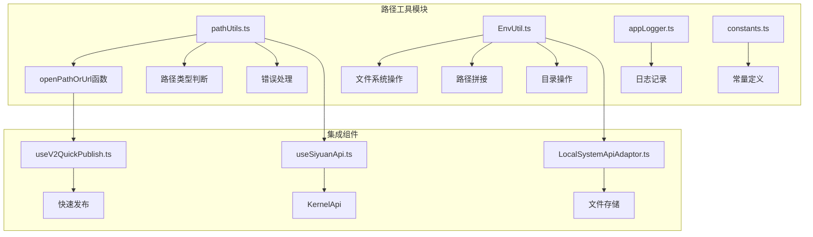
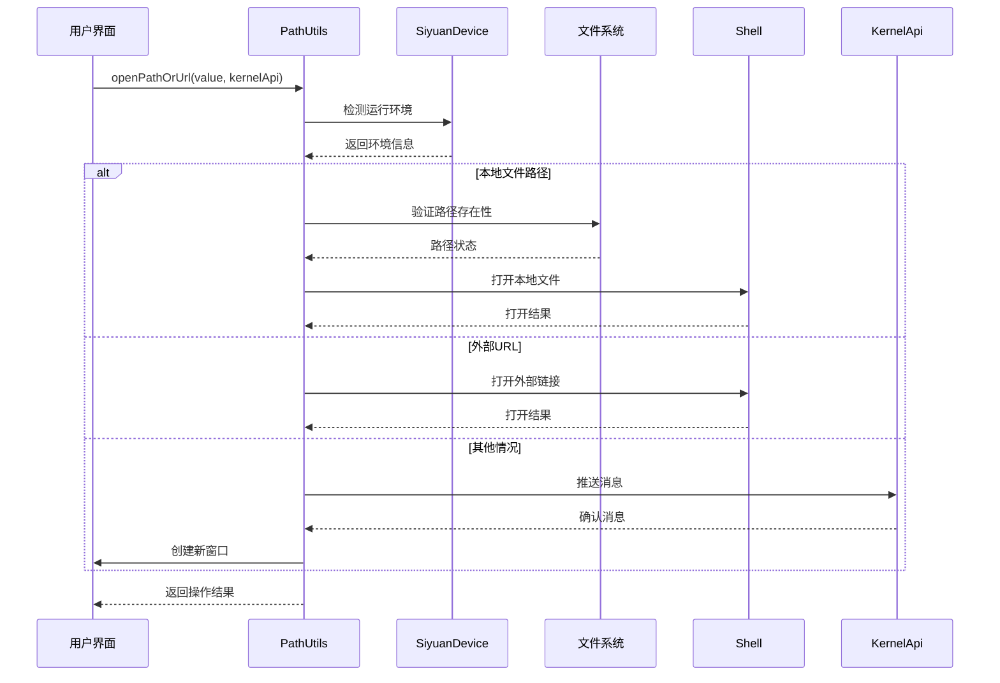
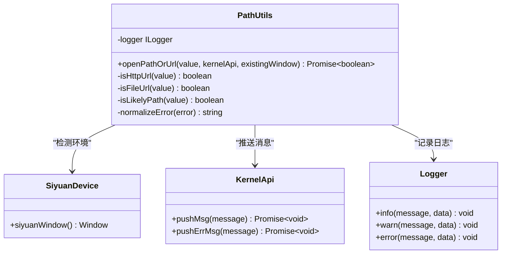
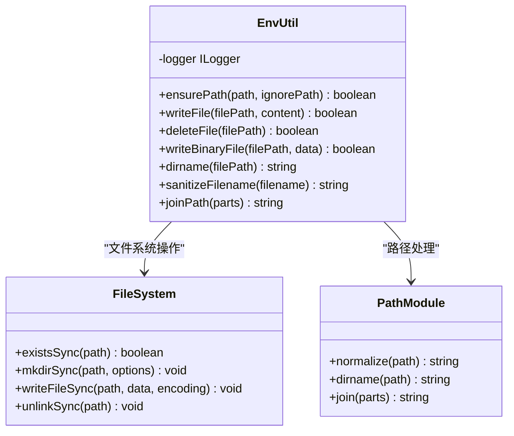
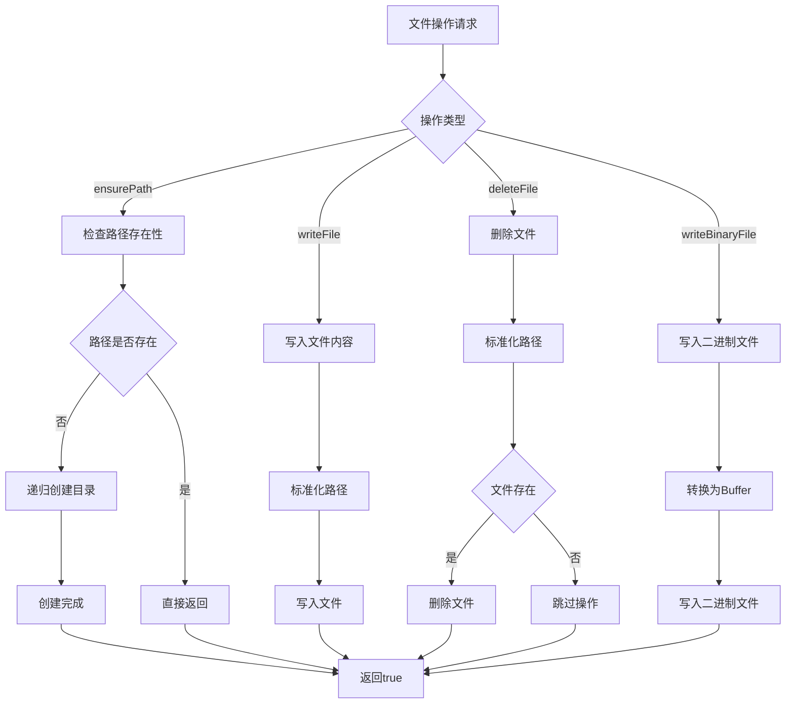
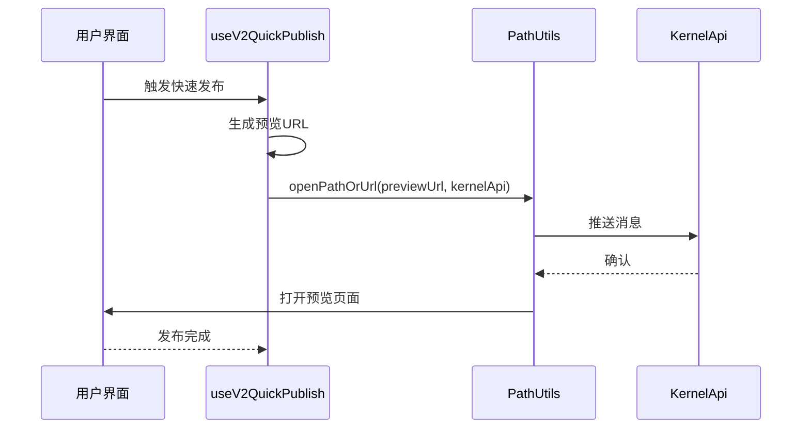
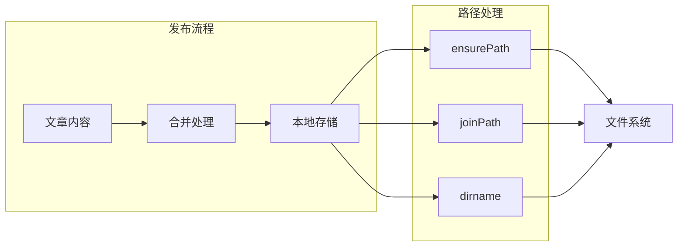
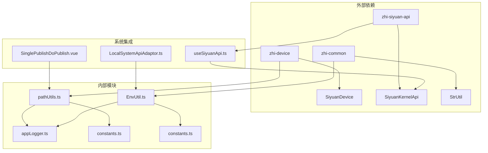

# 路径工具模块

<cite>
**本文档引用的文件**
- [pathUtils.ts](file://src/utils/pathUtils.ts)
- [EnvUtil.ts](file://src/utils/EnvUtil.ts)
- [appLogger.ts](file://src/utils/appLogger.ts)
- [constants.ts](file://src/utils/constants.ts)
- [kernel-api.ts](file://siyuan/api/kernel-api.ts)
- [useSiyuanApi.ts](file://src/composables/useSiyuanApi.ts)
- [useV2QuickPublish.ts](file://src/composables/v2/useV2QuickPublish.ts)
- [LocalSystemApiAdaptor.ts](file://src/adaptors/fs/LocalSystem/LocalSystemApiAdaptor.ts)
- [SinglePublishDoPublish.vue](file://src/components/publish/SinglePublishDoPublish.vue)
</cite>

## 目录
1. [简介](#简介)
2. [项目结构](#项目结构)
3. [核心组件](#核心组件)
4. [架构概览](#架构概览)
5. [详细组件分析](#详细组件分析)
6. [依赖关系分析](#依赖关系分析)
7. [性能考虑](#性能考虑)
8. [故障排除指南](#故障排除指南)
9. [结论](#结论)

## 简介

路径工具模块是思源笔记发布插件中的一个关键基础设施组件，主要负责处理文件路径和URL的统一打开逻辑。该模块提供了跨平台的路径解析、文件系统操作和外部链接处理能力，确保在不同运行环境中都能正确地打开本地文件和访问外部资源。

该模块的设计目标是在保持功能完整性的同时，提供简洁易用的API接口，支持多种路径格式和URL类型，并具备良好的错误处理机制和日志记录功能。

## 项目结构

路径工具模块位于项目的 `src/utils/` 目录下，与相关的环境工具类共同构成了完整的路径处理生态系统：



**图表来源**
- [pathUtils.ts:1-92](file://src/utils/pathUtils.ts#L1-L92)
- [EnvUtil.ts:1-223](file://src/utils/EnvUtil.ts#L1-L223)

**章节来源**
- [pathUtils.ts:1-92](file://src/utils/pathUtils.ts#L1-L92)
- [EnvUtil.ts:1-223](file://src/utils/EnvUtil.ts#L1-L223)

## 核心组件

### 主要功能模块

路径工具模块包含以下核心组件：

1. **路径识别器** - 用于判断输入值的类型（URL、文件路径等）
2. **统一打开器** - 统一处理本地文件和外部链接的打开逻辑
3. **环境适配器** - 根据运行环境选择合适的处理方式
4. **错误处理器** - 提供一致的错误处理和用户反馈机制

### 关键特性

- **跨平台兼容性** - 支持Electron、浏览器和思源笔记环境
- **智能路径识别** - 自动识别HTTP URL、file URL和本地路径
- **安全防护** - 防止打开危险的about:链接
- **降级处理** - 在不支持的环境中提供合理的回退方案
- **日志记录** - 完整的操作日志和错误追踪

**章节来源**
- [pathUtils.ts:16-91](file://src/utils/pathUtils.ts#L16-L91)

## 架构概览

路径工具模块采用分层架构设计，通过清晰的职责分离实现了高度的模块化：



**图表来源**
- [pathUtils.ts:16-91](file://src/utils/pathUtils.ts#L16-L91)
- [useSiyuanApi.ts:20-76](file://src/composables/useSiyuanApi.ts#L20-L76)

## 详细组件分析

### PathUtils 核心类

PathUtils类是路径工具模块的核心实现，提供了统一的路径处理接口：



**图表来源**
- [pathUtils.ts:16-91](file://src/utils/pathUtils.ts#L16-L91)

#### 路径类型识别机制

系统实现了多层次的路径类型识别：

```mermaid
flowchart TD
A[输入值] --> B{类型判断}
B --> |以"about:"开头| C[拒绝处理]
B --> |file://前缀| D[本地文件URL]
B --> |Windows路径| E[本地文件路径]
B --> |Unix/Linux路径| F[本地文件路径]
B --> |HTTP协议| G[外部URL]
B --> |其他| H[浏览器窗口]
D --> I[解码并打开]
E --> I
F --> I
G --> J[外部链接处理]
H --> K[新窗口打开]
I --> L[返回true]
J --> L
K --> L
C --> M[返回false]
```

**图表来源**
- [pathUtils.ts:5-8](file://src/utils/pathUtils.ts#L5-L8)

**章节来源**
- [pathUtils.ts:16-91](file://src/utils/pathUtils.ts#L16-L91)

### EnvUtil 环境工具类

EnvUtil类提供了丰富的文件系统操作功能，是路径工具模块的重要支撑：



**图表来源**
- [EnvUtil.ts:21-223](file://src/utils/EnvUtil.ts#L21-L223)

#### 文件系统操作流程

EnvUtil类实现了完整的文件系统操作流程：



**图表来源**
- [EnvUtil.ts:46-164](file://src/utils/EnvUtil.ts#L46-L164)

**章节来源**
- [EnvUtil.ts:21-223](file://src/utils/EnvUtil.ts#L21-L223)

### 集成使用场景

路径工具模块在多个组件中发挥重要作用：

#### 快速发布功能集成



**图表来源**
- [useV2QuickPublish.ts:228](file://src/composables/v2/useV2QuickPublish.ts#L228)
- [pathUtils.ts:16-91](file://src/utils/pathUtils.ts#L16-L91)

#### 本地系统适配器集成



**图表来源**
- [LocalSystemApiAdaptor.ts:58-59](file://src/adaptors/fs/LocalSystem/LocalSystemApiAdaptor.ts#L58-L59)
- [LocalSystemApiAdaptor.ts:186](file://src/adaptors/fs/LocalSystem/LocalSystemApiAdaptor.ts#L186)

**章节来源**
- [useV2QuickPublish.ts:10](file://src/composables/v2/useV2QuickPublish.ts#L10)
- [LocalSystemApiAdaptor.ts:58-59](file://src/adaptors/fs/LocalSystem/LocalSystemApiAdaptor.ts#L58-L59)

## 依赖关系分析

路径工具模块的依赖关系体现了清晰的层次结构：



**图表来源**
- [pathUtils.ts:1-3](file://src/utils/pathUtils.ts#L1-L3)
- [EnvUtil.ts:10-13](file://src/utils/EnvUtil.ts#L10-L13)

### 依赖注入和配置

系统通过依赖注入机制实现了灵活的配置管理：

| 依赖项 | 作用 | 配置来源 |
|--------|------|----------|
| SiyuanDevice | 环境检测 | 浏览器/Electron上下文 |
| SiyuanKernelApi | 消息推送 | 应用配置和环境变量 |
| StrUtil | 字符串工具 | zhi-common库 |
| createAppLogger | 日志记录 | appLogger配置 |

**章节来源**
- [pathUtils.ts:1-3](file://src/utils/pathUtils.ts#L1-L3)
- [EnvUtil.ts:10-13](file://src/utils/EnvUtil.ts#L10-L13)

## 性能考虑

路径工具模块在设计时充分考虑了性能优化：

### 内存管理
- 使用懒加载机制避免不必要的模块加载
- 及时释放临时对象和缓冲区
- 避免重复的路径解析操作

### 异步处理
- 所有文件系统操作都采用异步模式
- 错误处理不会阻塞主线程
- 支持超时机制防止长时间阻塞

### 缓存策略
- 对频繁使用的路径进行缓存
- 避免重复的文件系统查询
- 合理使用内存缓存提升性能

## 故障排除指南

### 常见问题及解决方案

#### 1. 无法打开本地文件
**症状**: 调用openPathOrUrl返回false且无错误提示  
**原因**: 当前环境不支持自动打开本地文件  
**解决方案**: 
- 检查是否在Electron环境中运行
- 确认@electron/remote模块可用
- 手动复制路径到文件管理器

#### 2. 路径解析错误
**症状**: 路径被错误识别或处理失败  
**原因**: 路径格式不符合预期  
**解决方案**:
- 确保使用标准的文件路径格式
- 避免包含特殊字符的路径
- 使用EnvUtil.joinPath进行路径拼接

#### 3. 权限不足
**症状**: 文件写入或创建失败  
**原因**: 文件系统权限限制  
**解决方案**:
- 检查目标目录的写入权限
- 确认路径不存在只读属性
- 使用管理员权限运行应用

**章节来源**
- [pathUtils.ts:47-54](file://src/utils/pathUtils.ts#L47-L54)
- [EnvUtil.ts:68-71](file://src/utils/EnvUtil.ts#L68-L71)

### 调试技巧

1. **启用详细日志**: 通过appLogger查看完整的操作记录
2. **检查环境变量**: 确认运行环境的正确性
3. **验证路径格式**: 使用正则表达式验证路径格式
4. **测试边界条件**: 验证各种异常情况的处理

## 结论

路径工具模块通过精心设计的架构和完善的错误处理机制，为思源笔记发布插件提供了可靠的路径处理能力。其跨平台兼容性和灵活的配置选项使其能够适应各种复杂的使用场景。

模块的主要优势包括：
- **统一的API接口**: 简化了路径处理的复杂性
- **强大的环境适配**: 支持多种运行环境
- **完善的错误处理**: 提供一致的用户体验
- **可扩展的设计**: 易于添加新的功能和特性

未来的发展方向可能包括：
- 增强对云存储服务的支持
- 优化大文件处理性能
- 扩展更多路径格式的识别能力
- 提供更详细的诊断和调试功能