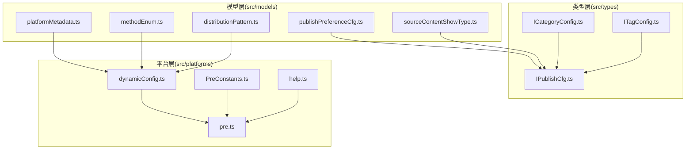
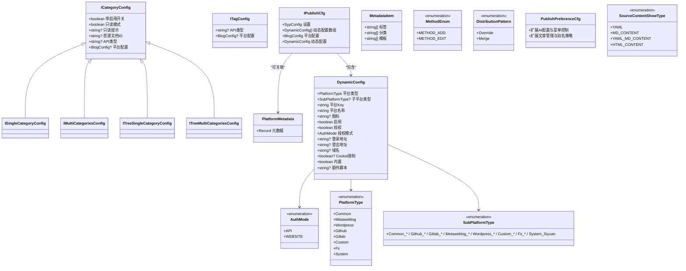
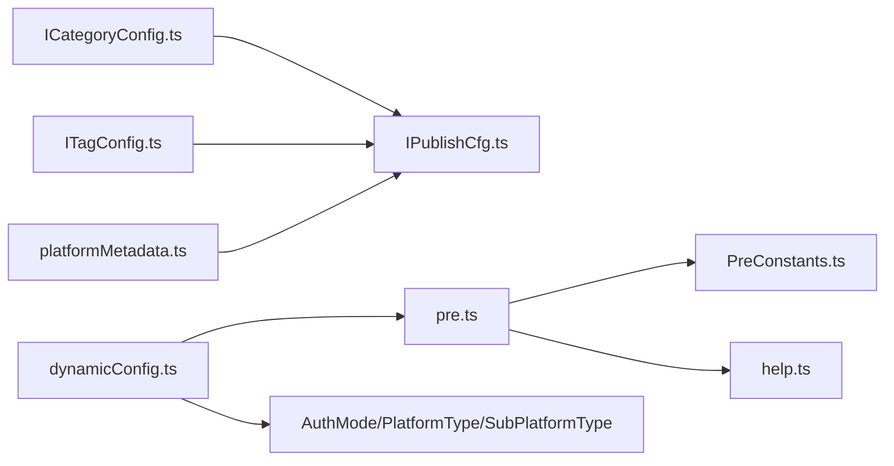

# 类型定义

<cite>
**本文引用的文件**
- [src/types/ICategoryConfig.ts](file://src/types/ICategoryConfig.ts)
- [src/types/IPublishCfg.ts](file://src/types/IPublishCfg.ts)
- [src/types/ITagConfig.ts](file://src/types/ITagConfig.ts)
- [src/models/platformMetadata.ts](file://src/models/platformMetadata.ts)
- [src/models/methodEnum.ts](file://src/models/methodEnum.ts)
- [src/models/distributionPattern.ts](file://src/models/distributionPattern.ts)
- [src/models/publishPreferenceCfg.ts](file://src/models/publishPreferenceCfg.ts)
- [src/models/sourceContentShowType.ts](file://src/models/sourceContentShowType.ts)
- [src/platforms/dynamicConfig.ts](file://src/platforms/dynamicConfig.ts)
- [src/platforms/pre.ts](file://src/platforms/pre.ts)
- [src/platforms/PreConstants.ts](file://src/platforms/PreConstants.ts)
- [src/platforms/help.ts](file://src/platforms/help.ts)
</cite>

## 目录
1. [简介](#简介)
2. [项目结构](#项目结构)
3. [核心组件](#核心组件)
4. [架构总览](#架构总览)
5. [详细组件分析](#详细组件分析)
6. [依赖分析](#依赖分析)
7. [性能考量](#性能考量)
8. [故障排查指南](#故障排查指南)
9. [结论](#结论)
10. [附录](#附录)

## 简介
本文件系统化梳理本仓库中的 TypeScript 类型定义，涵盖接口类型、枚举类型、类与组合关系，并结合实际代码中的数据模型、验证规则、安全性与扩展机制进行说明。目标是帮助开发者快速理解各类型的作用域、字段含义、约束条件与使用方式。

## 项目结构
围绕“类型定义”的相关文件主要分布在以下目录：
- src/types：对外暴露的接口类型，如分类、标签、发布配置等
- src/models：面向领域模型的类与枚举，如平台元数据、发布偏好、内容显示类型等
- src/platforms：平台动态配置、预设常量与帮助映射

图表来源
- [src/types/ICategoryConfig.ts:1-88](file://src/types/ICategoryConfig.ts#L1-L88)
- [src/types/IPublishCfg.ts:1-50](file://src/types/IPublishCfg.ts#L1-L50)
- [src/types/ITagConfig.ts:1-31](file://src/types/ITagConfig.ts#L1-L31)
- [src/models/platformMetadata.ts:1-50](file://src/models/platformMetadata.ts#L1-L50)
- [src/models/methodEnum.ts:1-24](file://src/models/methodEnum.ts#L1-L24)
- [src/models/distributionPattern.ts:1-26](file://src/models/distributionPattern.ts#L1-L26)
- [src/models/publishPreferenceCfg.ts:1-101](file://src/models/publishPreferenceCfg.ts#L1-L101)
- [src/models/sourceContentShowType.ts:1-19](file://src/models/sourceContentShowType.ts#L1-L19)
- [src/platforms/dynamicConfig.ts:1-534](file://src/platforms/dynamicConfig.ts#L1-L534)
- [src/platforms/pre.ts:1-463](file://src/platforms/pre.ts#L1-L463)
- [src/platforms/PreConstants.ts:1-20](file://src/platforms/PreConstants.ts#L1-L20)
- [src/platforms/help.ts:1-28](file://src/platforms/help.ts#L1-L28)

章节来源
- [src/types/ICategoryConfig.ts:1-88](file://src/types/ICategoryConfig.ts#L1-L88)
- [src/types/IPublishCfg.ts:1-50](file://src/types/IPublishCfg.ts#L1-L50)
- [src/types/ITagConfig.ts:1-31](file://src/types/ITagConfig.ts#L1-L31)
- [src/models/platformMetadata.ts:1-50](file://src/models/platformMetadata.ts#L1-L50)
- [src/models/methodEnum.ts:1-24](file://src/models/methodEnum.ts#L1-L24)
- [src/models/distributionPattern.ts:1-26](file://src/models/distributionPattern.ts#L1-L26)
- [src/models/publishPreferenceCfg.ts:1-101](file://src/models/publishPreferenceCfg.ts#L1-L101)
- [src/models/sourceContentShowType.ts:1-19](file://src/models/sourceContentShowType.ts#L1-L19)
- [src/platforms/dynamicConfig.ts:1-534](file://src/platforms/dynamicConfig.ts#L1-L534)
- [src/platforms/pre.ts:1-463](file://src/platforms/pre.ts#L1-L463)
- [src/platforms/PreConstants.ts:1-20](file://src/platforms/PreConstants.ts#L1-L20)
- [src/platforms/help.ts:1-28](file://src/platforms/help.ts#L1-L28)

## 核心组件
本节对关键类型进行逐项说明，包括接口、类、枚举及其字段、约束与典型用法。

- ICategoryConfig 及其变体
  - 用途：描述“类别”相关配置，支持单类别、多类别、树形单类别、树形多类别等场景
  - 关键字段：启用开关、只读模式、只读提示、页面ID、API类型、平台配置对象
  - 约束与关系：ISingleCategoryConfig/IMultiCategoriesConfig/ITreeSingleCategoryConfig/ITreeMultiCategoriesConfig 均继承自 ICategoryConfig，用于不同 UI 场景下的类型约束
  - 典型用法：在发布表单中根据场景选择对应接口以限定输入

- ITagConfig
  - 用途：描述“标签”相关配置
  - 关键字段：API类型、平台配置对象
  - 约束与关系：与 ICategoryConfig 类似，用于标签场景的统一建模

- IPublishCfg
  - 用途：聚合发布配置，连接静态设置、动态平台配置、平台配置对象与动态配置对象
  - 关键字段：设置对象、动态配置数组、平台配置对象、动态配置对象
  - 约束与关系：依赖外部模块的配置类型，确保发布流程的可组合性

- PlatformMetadata 与 MetadataItem
  - 用途：描述平台元数据，包含标签、分类、模板三类集合
  - 关键字段：标签列表、分类列表、模板列表；构造函数初始化为空数组
  - 约束与关系：PlatformMetadata 以字符串为键存储 MetadataItem

- MethodEnum
  - 用途：方法枚举，标识新增与编辑两种操作
  - 成员：新增、编辑

- DistributionPattern
  - 用途：分发模式枚举，覆盖与合并
  - 成员：覆盖、合并

- PublishPreferenceCfg
  - 用途：发布偏好设置，扩展基础偏好配置
  - 关键字段：AI 开关与参数、菜单显示控制、文章管理控制、块引用与别名策略等
  - 约束与关系：继承自外部偏好配置基类，提供默认值与扩展能力

- SourceContentShowType
  - 用途：源内容显示类型枚举
  - 成员：YAML、Markdown 内容、YAML+Markdown、HTML 内容

- DynamicConfig 及其枚举
  - 用途：动态平台配置的核心类，承载平台类型、子平台类型、授权模式、域名、图标、启用状态、认证状态、额外脚本等
  - 关键字段：平台类型、子平台类型、平台Key、平台名称、图标、启用、授权、授权模式、登录/登出地址、域名、Cookie限制、内置标记、额外脚本
  - 构造逻辑：根据平台Key自动推断授权模式；默认非内置、未授权、未启用、非Cookie限制
  - 枚举：AuthMode（API/WEBSITE）、PlatformType（通用/Common、Metaweblog、WordPress、GitHub、GitLab、自定义/Custom、文件系统/Fs、系统/System）、SubPlatformType（丰富的子平台枚举）
  - 工具函数：按类型归集、解析Key、生成新Key、校验Key唯一性、按Key查询/替换/删除、生成动态文章ID与YAML键、从文章ID键反查平台Key

- 平台预设与帮助
  - 预设：mainPre 定义主类目；pre 中包含各类平台的默认配置数组（含图标、授权模式、启用状态等）
  - 常量：PreConstants 统一管理部分平台Key常量
  - 帮助：help 将部分子平台映射到帮助文档链接

章节来源
- [src/types/ICategoryConfig.ts:18-87](file://src/types/ICategoryConfig.ts#L18-L87)
- [src/types/ITagConfig.ts:18-28](file://src/types/ITagConfig.ts#L18-L28)
- [src/types/IPublishCfg.ts:21-47](file://src/types/IPublishCfg.ts#L21-L47)
- [src/models/platformMetadata.ts:16-47](file://src/models/platformMetadata.ts#L16-L47)
- [src/models/methodEnum.ts:13-23](file://src/models/methodEnum.ts#L13-L23)
- [src/models/distributionPattern.ts:13-23](file://src/models/distributionPattern.ts#L13-L23)
- [src/models/publishPreferenceCfg.ts:19-98](file://src/models/publishPreferenceCfg.ts#L19-L98)
- [src/models/sourceContentShowType.ts:13-18](file://src/models/sourceContentShowType.ts#L13-L18)
- [src/platforms/dynamicConfig.ts:13-113](file://src/platforms/dynamicConfig.ts#L13-L113)
- [src/platforms/dynamicConfig.ts:118-166](file://src/platforms/dynamicConfig.ts#L118-L166)
- [src/platforms/dynamicConfig.ts:174-238](file://src/platforms/dynamicConfig.ts#L174-L238)
- [src/platforms/pre.ts:50-96](file://src/platforms/pre.ts#L50-L96)
- [src/platforms/pre.ts:101-462](file://src/platforms/pre.ts#L101-L462)
- [src/platforms/PreConstants.ts:10-17](file://src/platforms/PreConstants.ts#L10-L17)
- [src/platforms/help.ts:19-27](file://src/platforms/help.ts#L19-L27)

## 架构总览
下图展示类型与模型之间的关系，以及与平台层的交互：

图表来源
- [src/types/ICategoryConfig.ts:18-87](file://src/types/ICategoryConfig.ts#L18-L87)
- [src/types/ITagConfig.ts:18-28](file://src/types/ITagConfig.ts#L18-L28)
- [src/types/IPublishCfg.ts:21-47](file://src/types/IPublishCfg.ts#L21-L47)
- [src/models/platformMetadata.ts:16-47](file://src/models/platformMetadata.ts#L16-L47)
- [src/models/methodEnum.ts:13-23](file://src/models/methodEnum.ts#L13-L23)
- [src/models/distributionPattern.ts:13-23](file://src/models/distributionPattern.ts#L13-L23)
- [src/models/publishPreferenceCfg.ts:19-98](file://src/models/publishPreferenceCfg.ts#L19-L98)
- [src/models/sourceContentShowType.ts:13-18](file://src/models/sourceContentShowType.ts#L13-L18)
- [src/platforms/dynamicConfig.ts:13-113](file://src/platforms/dynamicConfig.ts#L13-L113)
- [src/platforms/dynamicConfig.ts:118-166](file://src/platforms/dynamicConfig.ts#L118-L166)
- [src/platforms/dynamicConfig.ts:174-238](file://src/platforms/dynamicConfig.ts#L174-L238)

## 详细组件分析

### 类型：ICategoryConfig 与 ITagConfig
- 设计要点
  - 采用接口抽象“类别/标签”配置，统一字段命名与可选性
  - 通过变体接口隔离不同 UI 场景（单/多、树形），提升类型安全
- 字段说明
  - 启用开关：控制功能是否生效
  - 只读模式与提示：用于 UI 层的只读约束与引导
  - 页面ID：绑定到思源笔记文档
  - API类型：平台类型标识
  - 平台配置：具体平台配置对象
- 使用示例（路径）
  - [类别配置接口定义:18-87](file://src/types/ICategoryConfig.ts#L18-L87)
  - [标签配置接口定义:18-28](file://src/types/ITagConfig.ts#L18-L28)

章节来源
- [src/types/ICategoryConfig.ts:18-87](file://src/types/ICategoryConfig.ts#L18-L87)
- [src/types/ITagConfig.ts:18-28](file://src/types/ITagConfig.ts#L18-L28)

### 类型：IPublishCfg
- 设计要点
  - 聚合发布所需的关键配置，便于在业务流程中传递与复用
  - 引入动态配置数组与动态配置对象，支持运行时平台扩展
- 字段说明
  - 设置对象：全局配置入口
  - 动态配置数组：平台集合
  - 平台配置对象：当前平台的配置
  - 动态配置对象：当前平台的动态配置
- 使用示例（路径）
  - [发布配置接口定义:21-47](file://src/types/IPublishCfg.ts#L21-L47)

章节来源
- [src/types/IPublishCfg.ts:21-47](file://src/types/IPublishCfg.ts#L21-L47)

### 类型：PlatformMetadata 与 MetadataItem
- 设计要点
  - 以键值对形式组织平台元数据，便于按平台检索
  - MetadataItem 聚合标签、分类、模板三类资源，便于统一管理
- 字段说明
  - 标签/分类/模板：字符串数组，初始为空
- 使用示例（路径）
  - [平台元数据类定义:16-47](file://src/models/platformMetadata.ts#L16-L47)

章节来源
- [src/models/platformMetadata.ts:16-47](file://src/models/platformMetadata.ts#L16-L47)

### 枚举：MethodEnum 与 DistributionPattern
- 设计要点
  - MethodEnum：统一新增与编辑操作标识
  - DistributionPattern：统一分发策略（覆盖/合并）
- 使用示例（路径）
  - [方法枚举定义:13-23](file://src/models/methodEnum.ts#L13-23)
  - [分发模式枚举定义:13-23](file://src/models/distributionPattern.ts#L13-23)

章节来源
- [src/models/methodEnum.ts:13-23](file://src/models/methodEnum.ts#L13-L23)
- [src/models/distributionPattern.ts:13-23](file://src/models/distributionPattern.ts#L13-L23)

### 类：PublishPreferenceCfg
- 设计要点
  - 继承外部偏好配置基类，扩展 AI 体验与菜单控制等
  - 提供默认值，降低初始化成本
- 字段说明（节选）
  - AI 开关与参数、菜单显示控制、文章管理控制、块引用与别名策略
- 使用示例（路径）
  - [发布偏好配置类定义:19-98](file://src/models/publishPreferenceCfg.ts#L19-98)

章节来源
- [src/models/publishPreferenceCfg.ts:19-98](file://src/models/publishPreferenceCfg.ts#L19-L98)

### 枚举：SourceContentShowType
- 设计要点
  - 统一源内容显示类型，便于 UI 层渲染策略控制
- 成员说明
  - YAML、Markdown 内容、YAML+Markdown、HTML 内容
- 使用示例（路径）
  - [源内容显示类型枚举定义:13-18](file://src/models/sourceContentShowType.ts#L13-18)

章节来源
- [src/models/sourceContentShowType.ts:13-18](file://src/models/sourceContentShowType.ts#L13-L18)

### 类与工具：DynamicConfig 及其枚举
- 设计要点
  - DynamicConfig 是平台配置的核心载体，包含平台类型、子平台类型、授权模式、域名、图标、启用/授权状态、内置标记、额外脚本等
  - 构造函数根据平台Key自动推断授权模式（如包含“Custom”则为网站授权）
- 字段说明
  - 平台类型/子平台类型：决定平台分类与子类
  - 平台Key/名称/图标：UI 展示与识别
  - 启用/授权/授权模式：运行时控制
  - 登录/登出地址/域名/Cookie限制：网络与认证相关
  - 内置标记：系统内置平台标识
  - 额外脚本：自定义平台的扩展脚本
- 工具函数与规则
  - 按类型归集：将动态配置按平台类型拆分为多个集合
  - 解析Key：从平台Key解析子平台类型
  - 生成新Key：按平台类型与子平台类型生成唯一Key
  - 校验唯一性：检测平台Key是否重复
  - 查询/替换/删除：按Key操作动态配置数组
  - 动态文章ID与YAML键：生成/解析自定义平台的持久化键
- 使用示例（路径）
  - [动态配置类与枚举定义:13-113](file://src/platforms/dynamicConfig.ts#L13-113)
  - [授权模式枚举:118-121](file://src/platforms/dynamicConfig.ts#L118-121)
  - [平台类型枚举:126-166](file://src/platforms/dynamicConfig.ts#L126-166)
  - [子平台类型枚举:174-238](file://src/platforms/dynamicConfig.ts#L174-238)
  - [按类型归集函数:336-392](file://src/platforms/dynamicConfig.ts#L336-392)
  - [子平台类型解析函数:397-418](file://src/platforms/dynamicConfig.ts#L397-418)
  - [生成新平台Key:428-437](file://src/platforms/dynamicConfig.ts#L428-437)
  - [Key唯一性检查:442-451](file://src/platforms/dynamicConfig.ts#L442-451)
  - [按Key查询/替换/删除:456-497](file://src/platforms/dynamicConfig.ts#L456-497)
  - [动态文章ID/YAML键生成/解析:504-533](file://src/platforms/dynamicConfig.ts#L504-533)

章节来源
- [src/platforms/dynamicConfig.ts:13-113](file://src/platforms/dynamicConfig.ts#L13-L113)
- [src/platforms/dynamicConfig.ts:118-121](file://src/platforms/dynamicConfig.ts#L118-L121)
- [src/platforms/dynamicConfig.ts:126-166](file://src/platforms/dynamicConfig.ts#L126-L166)
- [src/platforms/dynamicConfig.ts:174-238](file://src/platforms/dynamicConfig.ts#L174-L238)
- [src/platforms/dynamicConfig.ts:336-392](file://src/platforms/dynamicConfig.ts#L336-L392)
- [src/platforms/dynamicConfig.ts:397-418](file://src/platforms/dynamicConfig.ts#L397-L418)
- [src/platforms/dynamicConfig.ts:428-437](file://src/platforms/dynamicConfig.ts#L428-L437)
- [src/platforms/dynamicConfig.ts:442-451](file://src/platforms/dynamicConfig.ts#L442-L451)
- [src/platforms/dynamicConfig.ts:456-497](file://src/platforms/dynamicConfig.ts#L456-L497)
- [src/platforms/dynamicConfig.ts:504-533](file://src/platforms/dynamicConfig.ts#L504-L533)

### 平台预设与帮助
- 设计要点
  - mainPre 定义主类目标题与描述
  - pre 中提供各类平台的默认配置数组，包含图标、授权模式、启用状态等
  - PreConstants 统一管理部分平台Key常量
  - help 将部分子平台映射到帮助文档链接
- 使用示例（路径）
  - [主类目与描述:50-96](file://src/platforms/pre.ts#L50-96)
  - [平台预设配置数组:101-462](file://src/platforms/pre.ts#L101-462)
  - [平台Key常量:10-17](file://src/platforms/PreConstants.ts#L10-17)
  - [帮助文档映射:19-27](file://src/platforms/help.ts#L19-27)

章节来源
- [src/platforms/pre.ts:50-96](file://src/platforms/pre.ts#L50-L96)
- [src/platforms/pre.ts:101-462](file://src/platforms/pre.ts#L101-L462)
- [src/platforms/PreConstants.ts:10-17](file://src/platforms/PreConstants.ts#L10-L17)
- [src/platforms/help.ts:19-27](file://src/platforms/help.ts#L19-L27)

## 依赖分析
- 类型依赖
  - ICategoryConfig/ITagConfig/ICategoryConfig 的变体依赖于平台配置类型
  - IPublishCfg 依赖动态配置与平台配置类型
- 枚举依赖
  - DynamicConfig 依赖 AuthMode、PlatformType、SubPlatformType
- 运行时依赖
  - 预设配置依赖常量与图标工具
  - 动态配置工具函数依赖工具类与字符串工具

图表来源
- [src/types/ICategoryConfig.ts:18-87](file://src/types/ICategoryConfig.ts#L18-L87)
- [src/types/IPublishCfg.ts:21-47](file://src/types/IPublishCfg.ts#L21-L47)
- [src/types/ITagConfig.ts:18-28](file://src/types/ITagConfig.ts#L18-L28)
- [src/models/platformMetadata.ts:16-47](file://src/models/platformMetadata.ts#L16-L47)
- [src/platforms/dynamicConfig.ts:13-113](file://src/platforms/dynamicConfig.ts#L13-L113)
- [src/platforms/pre.ts:101-462](file://src/platforms/pre.ts#L101-L462)
- [src/platforms/PreConstants.ts:10-17](file://src/platforms/PreConstants.ts#L10-L17)
- [src/platforms/help.ts:19-27](file://src/platforms/help.ts#L19-L27)

章节来源
- [src/platforms/dynamicConfig.ts:118-166](file://src/platforms/dynamicConfig.ts#L118-L166)
- [src/platforms/dynamicConfig.ts:174-238](file://src/platforms/dynamicConfig.ts#L174-L238)
- [src/platforms/pre.ts:101-462](file://src/platforms/pre.ts#L101-L462)

## 性能考量
- 动态配置归集与查询
  - setDynamicJsonCfg 对数组进行一次遍历按类型归集，时间复杂度 O(n)，空间复杂度 O(n)
  - getDynCfgByKey 采用线性查找，时间复杂度 O(n)，建议在配置规模较大时引入索引或缓存
- Key 规则与解析
  - getSubPlatformTypeByKey 与 getNewPlatformKey 基于字符串处理，开销较小
- 预设配置
  - 预设数组在应用启动时一次性加载，对运行时性能影响可忽略

## 故障排查指南
- 动态配置Key异常
  - 现象：解析子平台类型失败或生成Key冲突
  - 排查：确认平台Key格式是否符合约定（平台类型_子平台-随机ID）；使用 isDynamicKeyExists 检查唯一性
  - 参考路径
    - [子平台类型解析函数:397-418](file://src/platforms/dynamicConfig.ts#L397-418)
    - [Key唯一性检查:442-451](file://src/platforms/dynamicConfig.ts#L442-451)
- 平台启用/授权状态不一致
  - 现象：启用状态与授权状态不一致
  - 排查：检查构造函数逻辑与外部调用是否正确设置 isEnabled/isAuth
  - 参考路径
    - [动态配置构造函数:91-113](file://src/platforms/dynamicConfig.ts#L91-113)
- 预设平台不可用
  - 现象：某些平台无法启用或登录
  - 排查：核对预设配置中的授权模式、登录地址、域名与UA/Cookie白名单
  - 参考路径
    - [平台预设配置数组:101-462](file://src/platforms/pre.ts#L101-462)
    - [预设常量:10-17](file://src/platforms/PreConstants.ts#L10-17)
    - [帮助文档映射:19-27](file://src/platforms/help.ts#L19-27)

章节来源
- [src/platforms/dynamicConfig.ts:397-418](file://src/platforms/dynamicConfig.ts#L397-L418)
- [src/platforms/dynamicConfig.ts:442-451](file://src/platforms/dynamicConfig.ts#L442-L451)
- [src/platforms/dynamicConfig.ts:91-113](file://src/platforms/dynamicConfig.ts#L91-L113)
- [src/platforms/pre.ts:101-462](file://src/platforms/pre.ts#L101-L462)
- [src/platforms/PreConstants.ts:10-17](file://src/platforms/PreConstants.ts#L10-L17)
- [src/platforms/help.ts:19-27](file://src/platforms/help.ts#L19-L27)

## 结论
本仓库的类型定义围绕“发布配置”与“平台配置”两大主题展开，通过接口、类与枚举实现强类型约束与可扩展设计。DynamicConfig 作为核心载体，配合预设与工具函数，支撑了多平台、多子平台的灵活配置与运行时控制。建议在大规模配置场景下引入索引与缓存优化查询性能，并持续完善类型注释与单元测试以保障向后兼容性与安全性。

## 附录
- 类型安全与向后兼容
  - 使用变体接口隔离不同场景，避免“万能接口”
  - 枚举集中管理取值范围，减少魔法字符串
  - 默认值与构造函数逻辑确保对象完整性
- 版本管理建议
  - 枚举新增成员时采用追加策略，避免破坏既有逻辑
  - 接口扩展采用可选字段与变体接口，保持向后兼容
  - 对外暴露的接口与类需标注版本号与变更说明