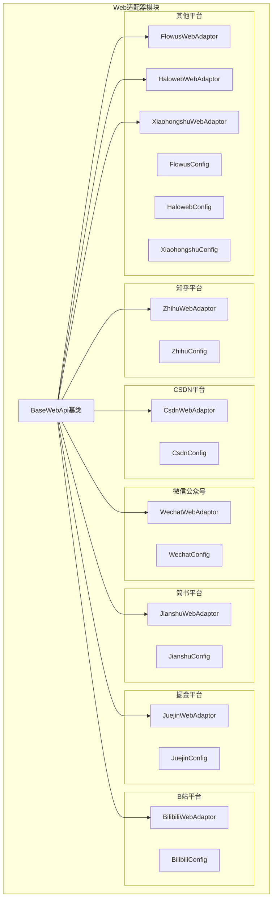
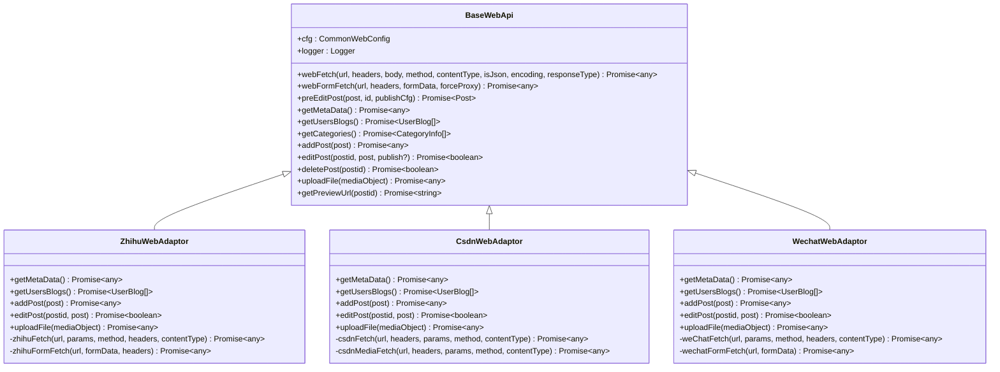
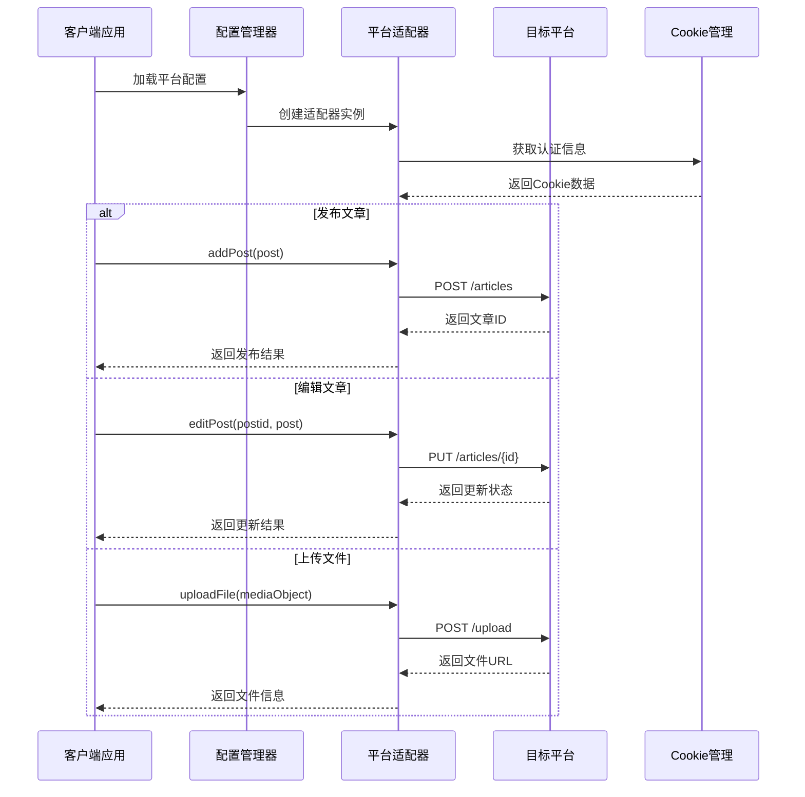
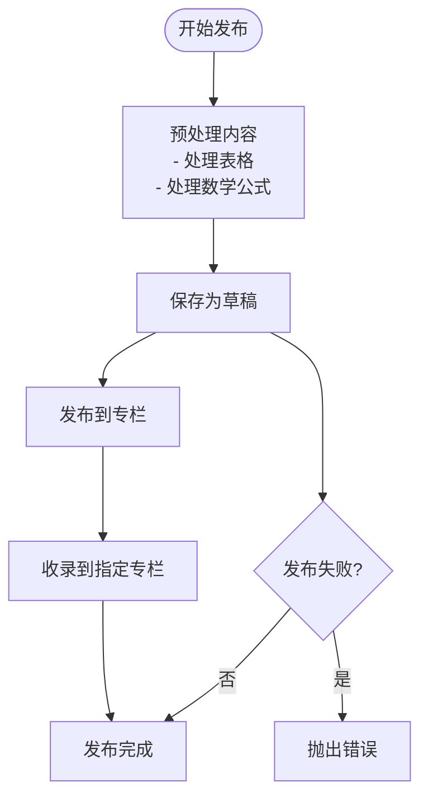
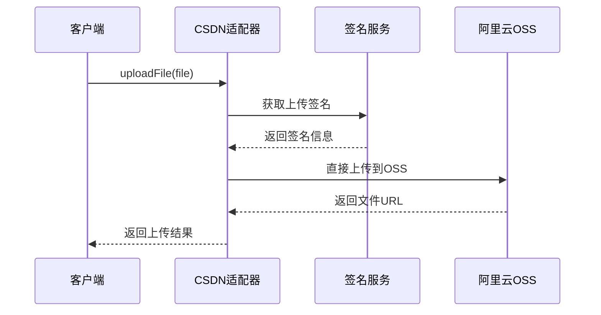
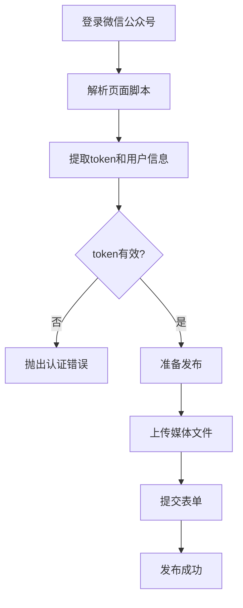
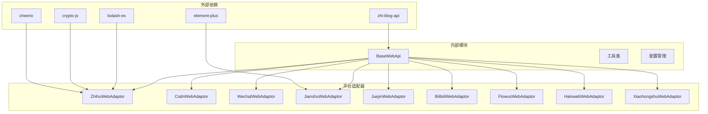

# Web平台适配器

<cite>
**本文档引用的文件**
- [zhihuWebAdaptor.ts](file://src/adaptors/web/zhihu/zhihuWebAdaptor.ts)
- [zhihuConfig.ts](file://src/adaptors/web/zhihu/zhihuConfig.ts)
- [csdnWebAdaptor.ts](file://src/adaptors/web/csdn/csdnWebAdaptor.ts)
- [csdnConfig.ts](file://src/adaptors/web/csdn/csdnConfig.ts)
- [wechatWebAdaptor.ts](file://src/adaptors/web/wechat/wechatWebAdaptor.ts)
- [wechatConfig.ts](file://src/adaptors/web/wechat/wechatConfig.ts)
- [jianshuWebAdaptor.ts](file://src/adaptors/web/jianshu/jianshuWebAdaptor.ts)
- [jianshuConfig.ts](file://src/adaptors/web/jianshu/jianshuConfig.ts)
- [juejinWebAdaptor.ts](file://src/adaptors/web/juejin/juejinWebAdaptor.ts)
- [juejinConfig.ts](file://src/adaptors/web/juejin/juejinConfig.ts)
- [bilibiliWebAdaptor.ts](file://src/adaptors/web/bilibili/bilibiliWebAdaptor.ts)
- [bilibiliConfig.ts](file://src/adaptors/web/bilibili/bilibiliConfig.ts)
- [flowusWebAdaptor.ts](file://src/adaptors/web/flowus/flowusWebAdaptor.ts)
- [flowusConfig.ts](file://src/adaptors/web/flowus/flowusConfig.ts)
- [HalowebWebAdaptor.ts](file://src/adaptors/web/haloweb/HalowebWebAdaptor.ts)
- [HalowebConfig.ts](file://src/adaptors/web/haloweb/HalowebConfig.ts)
- [XiaohongshuWebAdaptor.ts](file://src/adaptors/web/xiaohongshu/XiaohongshuWebAdaptor.ts)
- [xiaohongshuConfig.ts](file://src/adaptors/web/xiaohongshu/xiaohongshuConfig.ts)
</cite>

## 目录
1. [简介](#简介)
2. [项目结构](#项目结构)
3. [核心组件](#核心组件)
4. [架构概览](#架构概览)
5. [详细组件分析](#详细组件分析)
6. [依赖关系分析](#依赖关系分析)
7. [性能考虑](#性能考虑)
8. [故障排除指南](#故障排除指南)
9. [结论](#结论)

## 简介

Web平台适配器是Siyuan插件Publisher项目中的核心模块，负责与各种Web内容平台进行交互，实现文章的发布、编辑、删除和媒体文件上传等功能。该项目支持多个主流技术博客平台，包括知乎、CSDN、微信公众号、简书、掘金、哔哩哔哩、FlowUs、HaloWeb和小红书等。

每个适配器都实现了统一的接口规范，通过Cookie认证机制与目标平台进行通信，支持Markdown和HTML两种内容格式，并提供了完善的错误处理和日志记录功能。

## 项目结构

Web平台适配器模块采用按平台分层的组织方式，每个平台都有独立的适配器文件和配置文件：

**图表来源**
- [zhihuWebAdaptor.ts:1-459](file://src/adaptors/web/zhihu/zhihuWebAdaptor.ts#L1-L459)
- [csdnWebAdaptor.ts:1-558](file://src/adaptors/web/csdn/csdnWebAdaptor.ts#L1-L558)
- [wechatWebAdaptor.ts:1-571](file://src/adaptors/web/wechat/wechatWebAdaptor.ts#L1-L571)

**章节来源**
- [zhihuWebAdaptor.ts:1-459](file://src/adaptors/web/zhihu/zhihuWebAdaptor.ts#L1-L459)
- [csdnWebAdaptor.ts:1-558](file://src/adaptors/web/csdn/csdnWebAdaptor.ts#L1-L558)
- [wechatWebAdaptor.ts:1-571](file://src/adaptors/web/wechat/wechatWebAdaptor.ts#L1-L571)

## 核心组件

### 基础架构设计

所有Web适配器都继承自BaseWebApi基类，实现了统一的接口规范和通用功能：

**图表来源**
- [zhihuWebAdaptor.ts:29-459](file://src/adaptors/web/zhihu/zhihuWebAdaptor.ts#L29-L459)
- [csdnWebAdaptor.ts:25-558](file://src/adaptors/web/csdn/csdnWebAdaptor.ts#L25-L558)
- [wechatWebAdaptor.ts:29-571](file://src/adaptors/web/wechat/wechatWebAdaptor.ts#L29-L571)

### 统一配置管理

每个平台都提供了专门的配置类，继承自CommonWebConfig基类，包含平台特定的设置：

| 配置属性 | 类型 | 描述 | 示例值 |
|---------|------|------|--------|
| apiUrl | string | API基础URL | "https://api.example.com" |
| home | string | 平台主页URL | "https://example.com" |
| usernameEnabled | boolean | 是否启用用户名 | true/false |
| passwordType | PasswordType | 密码类型 | Cookie/Token |
| pageType | PageTypeEnum | 默认页面类型 | Markdown/Html |
| tagEnabled | boolean | 是否支持标签 | true/false |
| cateEnabled | boolean | 是否支持分类 | true/false |
| knowledgeSpaceEnabled | boolean | 是否支持知识空间 | true/false |

**章节来源**
- [zhihuConfig.ts:16-36](file://src/adaptors/web/zhihu/zhihuConfig.ts#L16-L36)
- [csdnConfig.ts:16-33](file://src/adaptors/web/csdn/csdnConfig.ts#L16-L33)
- [wechatConfig.ts:16-32](file://src/adaptors/web/wechat/wechatConfig.ts#L16-L32)

## 架构概览

Web平台适配器采用了分层架构设计，确保了代码的可维护性和扩展性：

**图表来源**
- [zhihuWebAdaptor.ts:131-198](file://src/adaptors/web/zhihu/zhihuWebAdaptor.ts#L131-L198)
- [csdnWebAdaptor.ts:157-251](file://src/adaptors/web/csdn/csdnWebAdaptor.ts#L157-L251)
- [wechatWebAdaptor.ts:95-234](file://src/adaptors/web/wechat/wechatWebAdaptor.ts#L95-L234)

## 详细组件分析

### 知乎平台适配器

#### 特色功能
- **专栏管理**：支持获取用户的所有专栏信息
- **内容格式处理**：专门处理表格和数学公式
- **草稿系统**：先保存为草稿，再发布到指定专栏

#### 认证方式
知乎适配器使用Cookie认证，通过`passwordType_Cookie`模式进行身份验证。

#### API调用特点
- 使用`zhihuFetch`方法处理API请求
- 通过`zhihuFormFetch`处理表单提交
- 支持图片上传到知乎图床

**图表来源**
- [zhihuWebAdaptor.ts:99-198](file://src/adaptors/web/zhihu/zhihuWebAdaptor.ts#L99-L198)

**章节来源**
- [zhihuWebAdaptor.ts:131-198](file://src/adaptors/web/zhihu/zhihuWebAdaptor.ts#L131-L198)
- [zhihuConfig.ts:16-36](file://src/adaptors/web/zhihu/zhihuConfig.ts#L16-L36)

### CSDN平台适配器

#### 特色功能
- **多格式支持**：同时支持Markdown和HTML格式
- **代码高亮**：集成Prism.js进行代码语法高亮
- **标签管理**：支持文章标签和分类管理

#### 认证方式
CSDN适配器使用特殊的X-Ca签名机制，包含动态生成的签名头。

#### API调用特点
- 使用`csdnFetch`和`csdnMediaFetch`区分普通API和媒体API
- 支持多种图片上传方式（2025版和传统版）
- 集成阿里云OSS直传功能

**图表来源**
- [csdnWebAdaptor.ts:322-381](file://src/adaptors/web/csdn/csdnWebAdaptor.ts#L322-L381)

**章节来源**
- [csdnWebAdaptor.ts:157-251](file://src/adaptors/web/csdn/csdnWebAdaptor.ts#L157-L251)
- [csdnConfig.ts:16-33](file://src/adaptors/web/csdn/csdnConfig.ts#L16-L33)

### 微信公众号适配器

#### 特色功能
- **JavaScript渲染**：通过解析页面脚本获取认证信息
- **完整表单提交**：支持复杂的表单字段提交
- **媒体文件上传**：集成微信公众号专用上传接口

#### 认证方式
微信公众号适配器通过解析页面中的JavaScript变量获取token和用户信息。

#### API调用特点
- 使用`weChatFetch`和`wechatFormFetch`处理不同类型的请求
- 支持复杂的表单字段（最多200+个字段）
- 集成文件上传和CDN存储

**图表来源**
- [wechatWebAdaptor.ts:30-63](file://src/adaptors/web/wechat/wechatWebAdaptor.ts#L30-L63)

**章节来源**
- [wechatWebAdaptor.ts:95-234](file://src/adaptors/web/wechat/wechatWebAdaptor.ts#L95-L234)
- [wechatConfig.ts:16-32](file://src/adaptors/web/wechat/wechatConfig.ts#L16-L32)

### 简书平台适配器

#### 特色功能
- **笔记本管理**：支持笔记本（Notebook）概念
- **版本控制**：自动管理文章版本更新
- **七牛云集成**：使用七牛云作为图片存储

#### 认证方式
简书适配器使用标准的Cookie认证机制。

#### API调用特点
- 支持文章初始化、更新和发布的完整流程
- 自动处理文章版本号递增
- 集成七牛云上传服务

**章节来源**
- [jianshuWebAdaptor.ts:90-174](file://src/adaptors/web/jianshu/jianshuWebAdaptor.ts#L90-L174)
- [jianshuConfig.ts:16-36](file://src/adaptors/web/jianshu/jianshuConfig.ts#L16-L36)

### 掘金平台适配器

#### 特色功能
- **草稿系统**：完整的草稿-发布流程
- **标签管理**：支持文章标签和分类
- **摘要处理**：自动处理摘要长度限制

#### 认证方式
掘金适配器使用标准的Cookie认证。

#### API调用特点
- 支持草稿创建和更新
- 自动处理摘要长度（50-100字符）
- 支持默认分类和标签回退机制

**章节来源**
- [juejinWebAdaptor.ts:74-179](file://src/adaptors/web/juejin/juejinWebAdaptor.ts#L74-L179)
- [juejinConfig.ts:16-37](file://src/adaptors/web/juejin/juejinConfig.ts#L16-L37)

### 哔哩哔哩平台适配器

#### 特色功能
- **动态系统**：基于B站动态系统的发布机制
- **内容格式转换**：专门的Markdown到B站格式转换
- **编辑限制处理**：自动处理编辑次数限制

#### 认证方式
B站适配器使用Cookie认证，自动处理CSRF令牌。

#### API调用特点
- 支持动态创建和编辑
- 自动生成功能ID（upload_id）
- 集成封面图片上传

**章节来源**
- [bilibiliWebAdaptor.ts:87-275](file://src/adaptors/web/bilibili/bilibiliWebAdaptor.ts#L87-L275)
- [bilibiliConfig.ts:19-52](file://src/adaptors/web/bilibili/bilibiliConfig.ts#L19-L52)

### FlowUs平台适配器

#### 特色功能
- **息流笔记**：基于FlowUs平台的笔记系统
- **空间视图**：支持多空间管理
- **现代化界面**：基于FlowUs的现代化设计

#### 认证方式
FlowUs适配器使用标准的Cookie认证。

**章节来源**
- [flowusWebAdaptor.ts:22-38](file://src/adaptors/web/flowus/flowusWebAdaptor.ts#L22-L38)
- [flowusConfig.ts:16-32](file://src/adaptors/web/flowus/flowusConfig.ts#L16-L32)

### HaloWeb平台适配器

#### 特色功能
- **Halo CMS集成**：直接集成Halo内容管理系统
- **多格式支持**：同时支持Markdown和HTML
- **标签分类管理**：完整的标签和分类系统

#### 认证方式
HaloWeb适配器使用标准的Cookie认证。

#### API调用特点
- 支持Halo的RESTful API
- 自动处理文章草稿和发布流程
- 集成附件上传功能

**章节来源**
- [HalowebWebAdaptor.ts:75-168](file://src/adaptors/web/haloweb/HalowebWebAdaptor.ts#L75-L168)
- [HalowebConfig.ts:16-34](file://src/adaptors/web/haloweb/HalowebConfig.ts#L16-L34)

### 小红书平台适配器

#### 特色功能
- **创作者平台**：基于小红书创作者平台
- **内容审核**：符合小红书的内容规范
- **发布流程**：标准化的发布流程

#### 认证方式
小红书适配器使用标准的Cookie认证。

**注意**：小红书适配器目前处于开发中状态。

**章节来源**
- [XiaohongshuWebAdaptor.ts:21-32](file://src/adaptors/web/xiaohongshu/XiaohongshuWebAdaptor.ts#L21-L32)
- [xiaohongshuConfig.ts:16-31](file://src/adaptors/web/xiaohongshu/xiaohongshuConfig.ts#L16-L31)

## 依赖关系分析

Web平台适配器模块具有清晰的依赖层次结构：

**图表来源**
- [zhihuWebAdaptor.ts:10-20](file://src/adaptors/web/zhihu/zhihuWebAdaptor.ts#L10-L20)
- [csdnWebAdaptor.ts:10-16](file://src/adaptors/web/csdn/csdnWebAdaptor.ts#L10-L16)
- [jianshuWebAdaptor.ts:10-15](file://src/adaptors/web/jianshu/jianshuWebAdaptor.ts#L10-L15)

### 关键依赖特性

| 依赖库 | 用途 | 版本要求 | 主要功能 |
|-------|------|----------|----------|
| zhi-blog-api | 博客API接口定义 | 最新版本 | 提供统一的数据模型和接口规范 |
| cheerio | 服务器端jQuery | ^1.0.0 | 解析HTML和提取页面信息 |
| crypto-js | 加密算法库 | ^4.1.1 | MD5哈希计算和加密功能 |
| lodash-es | 工具函数库 | ^4.17.21 | 数据处理和对象操作 |
| element-plus | Vue 3组件库 | ^2.0.0 | 用户界面组件 |

**章节来源**
- [zhihuWebAdaptor.ts:10-20](file://src/adaptors/web/zhihu/zhihuWebAdaptor.ts#L10-L20)
- [csdnWebAdaptor.ts:10-16](file://src/adaptors/web/csdn/csdnWebAdaptor.ts#L10-L16)
- [jianshuWebAdaptor.ts:10-15](file://src/adaptors/web/jianshu/jianshuWebAdaptor.ts#L10-L15)

## 性能考虑

### 请求优化策略

1. **Cookie复用**：所有API请求共享Cookie，减少重复认证开销
2. **缓存机制**：对用户信息和分类列表进行缓存
3. **批量操作**：支持批量发布和批量更新操作
4. **异步处理**：使用Promise和async/await提高并发性能

### 内存管理

- 及时清理临时变量和中间结果
- 合理使用Blob和ArrayBuffer进行文件处理
- 避免内存泄漏，特别是在长时间运行的应用中

### 网络优化

- 实现重试机制和超时处理
- 支持断点续传和增量更新
- 优化图片压缩和传输效率

## 故障排除指南

### 常见问题及解决方案

#### Cookie失效问题
**症状**：API调用返回401或认证失败
**解决方案**：
1. 检查Cookie是否过期
2. 重新登录目标平台
3. 更新配置中的Cookie信息

#### CSRF验证失败
**症状**：B站等平台返回CSRF相关错误
**解决方案**：
1. 确保正确设置CSRF令牌
2. 检查Referer头信息
3. 验证User-Agent设置

#### 文件上传失败
**症状**：图片或文件上传返回错误
**解决方案**：
1. 检查文件格式和大小限制
2. 验证上传签名和权限
3. 确认网络连接稳定

#### 内容格式问题
**症状**：发布内容显示异常或格式丢失
**解决方案**：
1. 检查Markdown或HTML格式
2. 验证平台支持的内容类型
3. 使用平台提供的预览功能

**章节来源**
- [bilibiliWebAdaptor.ts:266-273](file://src/adaptors/web/bilibili/bilibiliWebAdaptor.ts#L266-L273)
- [csdnWebAdaptor.ts:372-375](file://src/adaptors/web/csdn/csdnWebAdaptor.ts#L372-L375)

### 调试技巧

1. **启用详细日志**：查看API请求和响应详情
2. **使用开发者工具**：监控网络请求和响应
3. **模拟环境**：在测试环境中验证功能
4. **错误追踪**：使用try-catch捕获和处理异常

## 结论

Web平台适配器模块为Siyuan插件Publisher提供了强大的多平台内容发布能力。通过统一的架构设计和标准化的接口规范，实现了对9个主流技术博客平台的全面支持。

### 主要优势

1. **统一接口**：所有平台遵循相同的API规范
2. **灵活配置**：每个平台都有专门的配置类
3. **强大功能**：支持内容发布、编辑、删除和媒体上传
4. **安全可靠**：完善的认证和错误处理机制
5. **易于扩展**：清晰的架构便于添加新平台支持

### 未来发展方向

1. **平台扩展**：持续添加新的内容平台支持
2. **功能增强**：改进内容格式转换和优化
3. **性能优化**：提升并发处理和响应速度
4. **用户体验**：简化配置和使用流程
5. **自动化**：实现更智能的内容管理和发布流程

该模块为技术内容创作者提供了便捷的多平台发布解决方案，大大提高了内容发布的效率和质量。