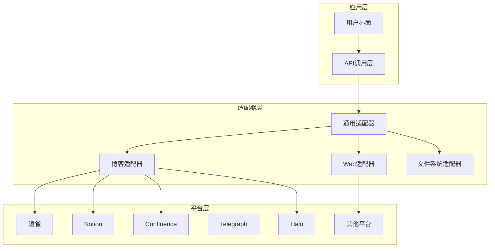
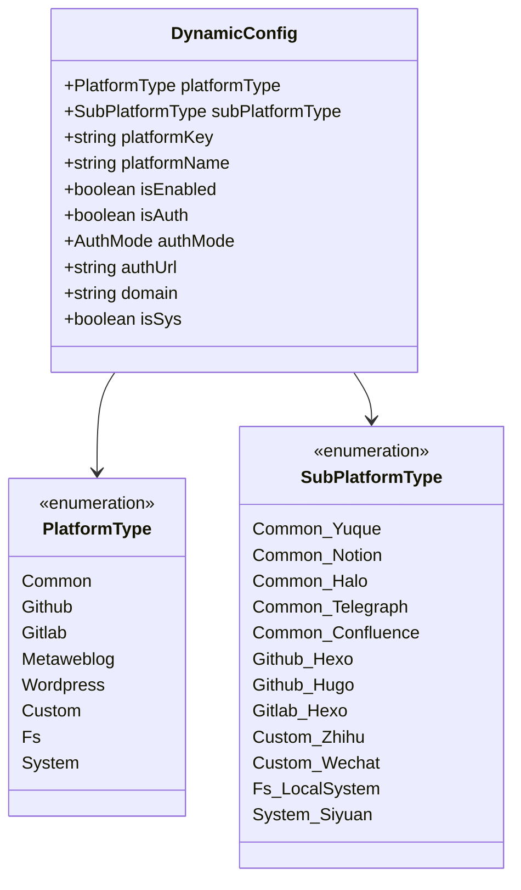
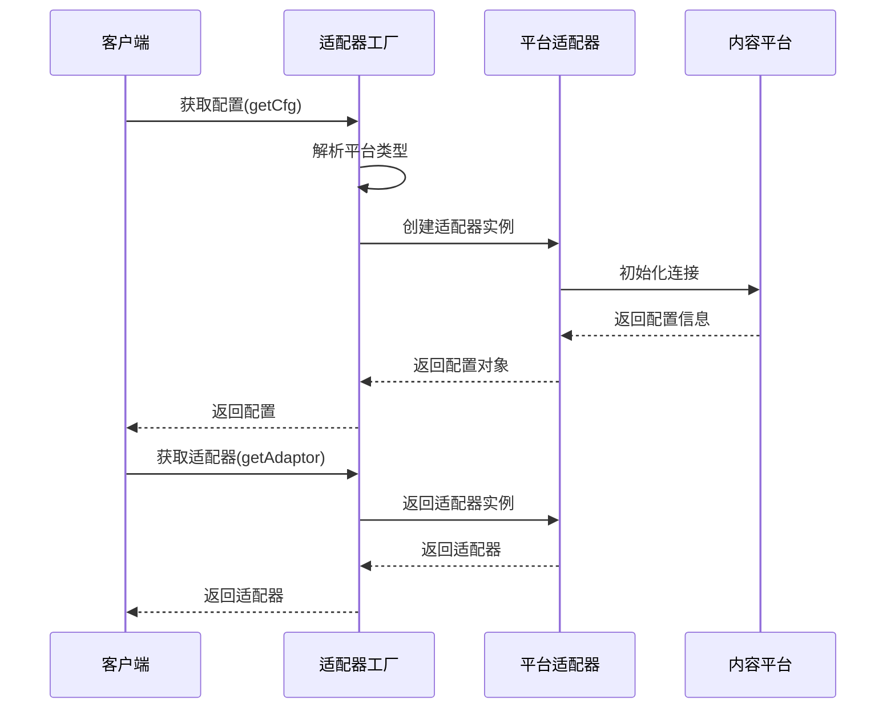
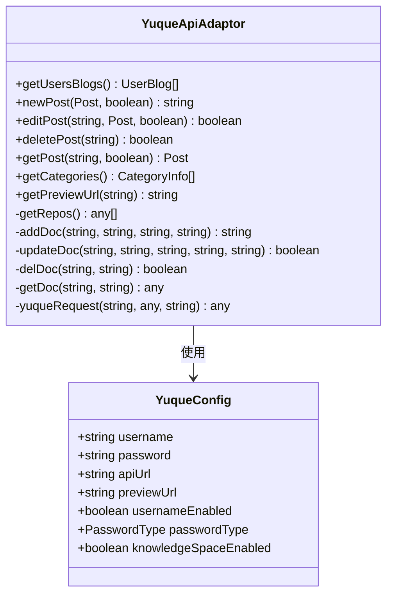
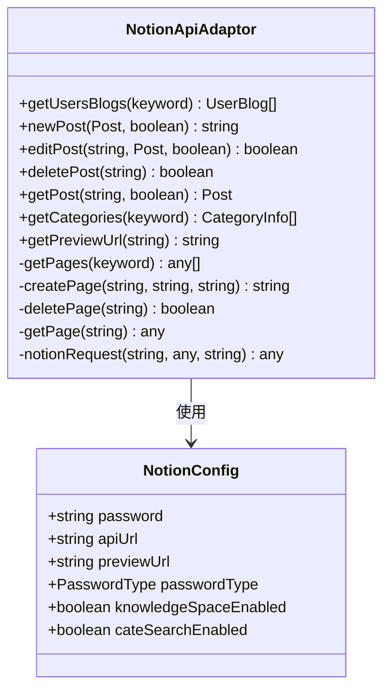
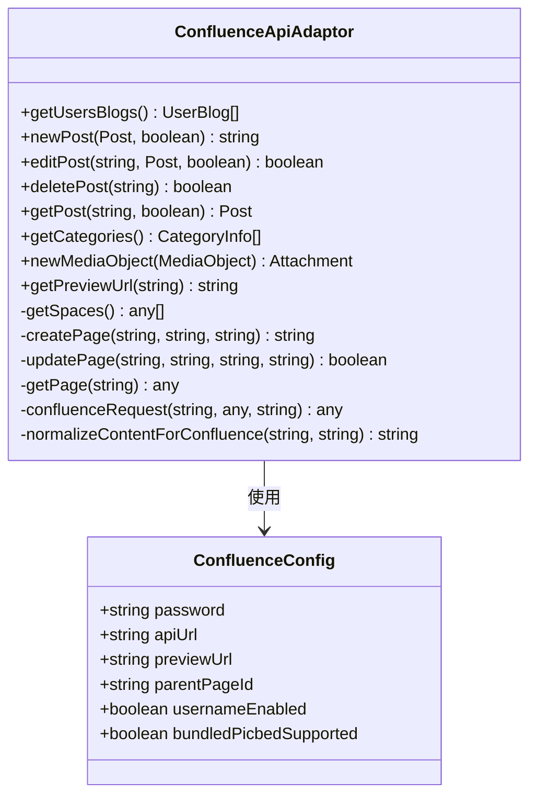
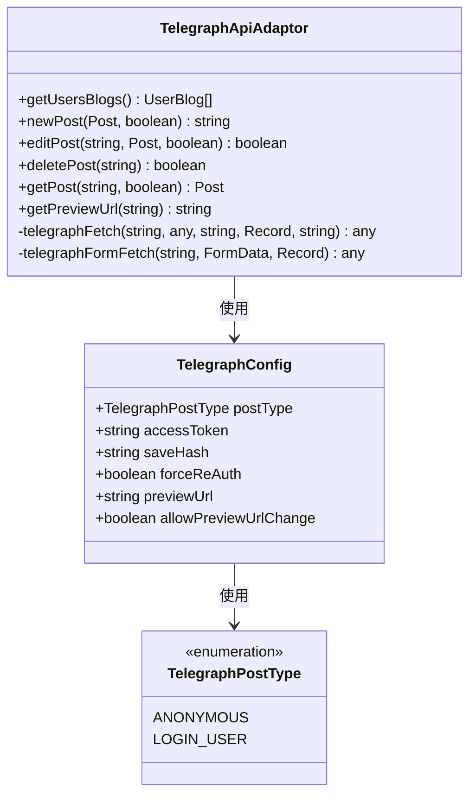
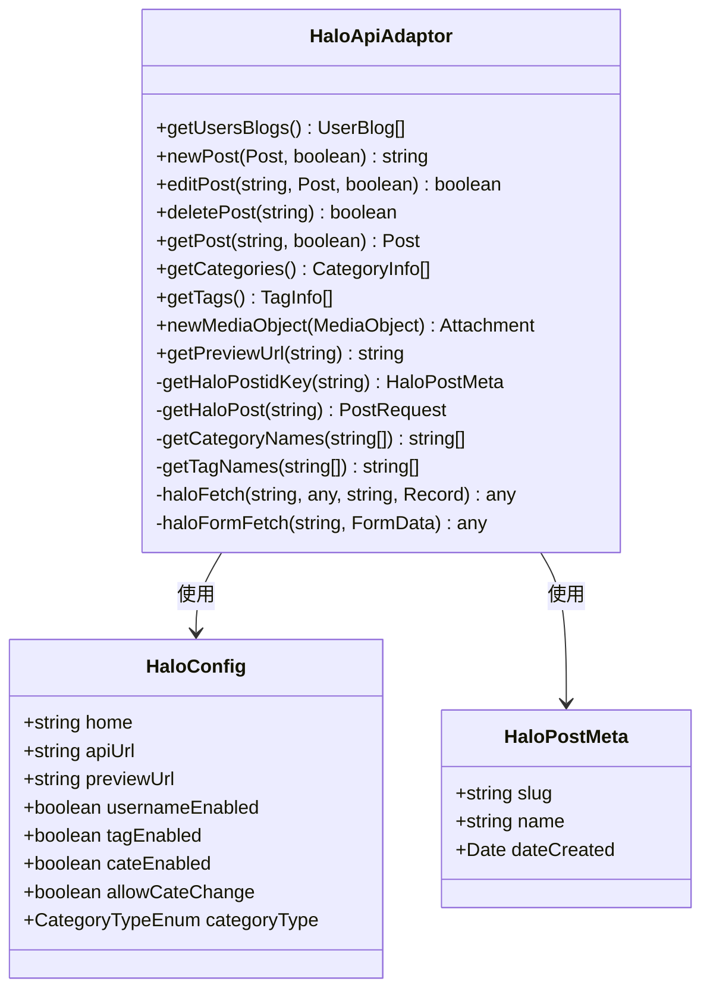
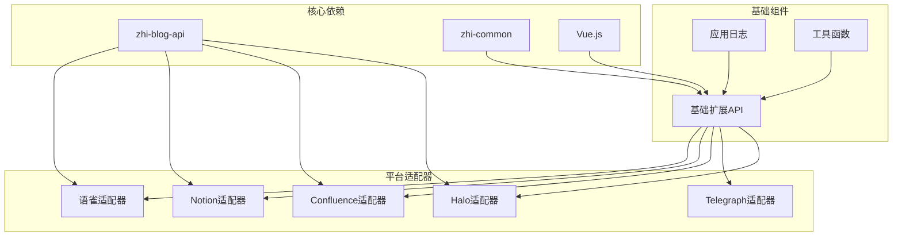

# 内容平台适配器

<cite>
**本文档引用的文件**
- [adaptors/index.ts](file://src/adaptors/index.ts)
- [base/baseExtendApi.ts](file://src/adaptors/base/baseExtendApi.ts)
- [platforms/pre.ts](file://src/platforms/pre.ts)
- [platforms/dynamicConfig.ts](file://src/platforms/dynamicConfig.ts)
- [models/platformMetadata.ts](file://src/models/platformMetadata.ts)
- [adaptors/api/yuque/yuqueApiAdaptor.ts](file://src/adaptors/api/yuque/yuqueApiAdaptor.ts)
- [adaptors/api/notion/notionApiAdaptor.ts](file://src/adaptors/api/notion/notionApiAdaptor.ts)
- [adaptors/api/confluence/confluenceApiAdaptor.ts](file://src/adaptors/api/confluence/confluenceApiAdaptor.ts)
- [adaptors/api/telegraph/telegraphApiAdaptor.ts](file://src/adaptors/api/telegraph/telegraphApiAdaptor.ts)
- [adaptors/api/halo/HaloApiAdaptor.ts](file://src/adaptors/api/halo/HaloApiAdaptor.ts)
- [adaptors/api/yuque/yuqueConfig.ts](file://src/adaptors/api/yuque/yuqueConfig.ts)
- [adaptors/api/notion/notionConfig.ts](file://src/adaptors/api/notion/notionConfig.ts)
- [adaptors/api/confluence/confluenceConfig.ts](file://src/adaptors/api/confluence/confluenceConfig.ts)
- [adaptors/api/telegraph/telegraphConfig.ts](file://src/adaptors/api/telegraph/telegraphConfig.ts)
- [adaptors/api/halo/HaloConfig.ts](file://src/adaptors/api/halo/HaloConfig.ts)
</cite>

## 目录
1. [简介](#简介)
2. [项目结构](#项目结构)
3. [核心组件](#核心组件)
4. [架构概览](#架构概览)
5. [详细组件分析](#详细组件分析)
6. [依赖关系分析](#依赖关系分析)
7. [性能考虑](#性能考虑)
8. [故障排除指南](#故障排除指南)
9. [结论](#结论)

## 简介

内容平台适配器是一个用于连接多种内容管理平台和协作平台的统一API接口层。该项目支持语雀、Notion、Confluence、Telegraph、Halo、印象笔记等多个平台，提供了标准化的文档发布、管理和协作功能。

该适配器采用模块化设计，通过统一的接口抽象不同平台的差异，为上层应用提供一致的编程体验。每个平台都有专门的适配器实现，负责处理特定平台的API调用、认证机制和数据格式转换。

## 项目结构

项目采用分层架构设计，主要包含以下层次：

**图表来源**
- [adaptors/index.ts:56-573](file://src/adaptors/index.ts#L56-L573)
- [platforms/dynamicConfig.ts:174-238](file://src/platforms/dynamicConfig.ts#L174-L238)

**章节来源**
- [adaptors/index.ts:1-573](file://src/adaptors/index.ts#L1-L573)
- [platforms/dynamicConfig.ts:1-534](file://src/platforms/dynamicConfig.ts#L1-L534)

## 核心组件

### 平台类型系统

项目实现了完整的平台类型枚举系统，支持多种平台类型的统一管理：

**图表来源**
- [platforms/dynamicConfig.ts:13-113](file://src/platforms/dynamicConfig.ts#L13-L113)
- [platforms/dynamicConfig.ts:126-166](file://src/platforms/dynamicConfig.ts#L126-L166)
- [platforms/dynamicConfig.ts:174-238](file://src/platforms/dynamicConfig.ts#L174-L238)

### 适配器工厂模式

适配器采用工厂模式设计，根据平台类型动态创建相应的适配器实例：

**章节来源**
- [adaptors/index.ts:56-573](file://src/adaptors/index.ts#L56-L573)

## 架构概览

项目采用分层架构，通过统一的适配器接口屏蔽底层平台差异：

**图表来源**
- [adaptors/index.ts:65-263](file://src/adaptors/index.ts#L65-L263)
- [adaptors/index.ts:271-467](file://src/adaptors/index.ts#L271-L467)

## 详细组件分析

### 语雀适配器 (Yuque)

语雀适配器提供了完整的文档管理功能，支持知识库级别的文档发布：

**图表来源**
- [adaptors/api/yuque/yuqueApiAdaptor.ts:20-298](file://src/adaptors/api/yuque/yuqueApiAdaptor.ts#L20-L298)
- [adaptors/api/yuque/yuqueConfig.ts:16-38](file://src/adaptors/api/yuque/yuqueConfig.ts#L16-L38)

**API特点**：
- 支持知识库级别的文档管理
- 使用API Token进行认证
- 支持Markdown格式文档
- 知识库作为文档分类单位

**配置要点**：
- 需要语雀个人访问令牌
- 支持自定义预览URL
- 知识库选择为必需参数

**章节来源**
- [adaptors/api/yuque/yuqueApiAdaptor.ts:1-298](file://src/adaptors/api/yuque/yuqueApiAdaptor.ts#L1-L298)
- [adaptors/api/yuque/yuqueConfig.ts:1-38](file://src/adaptors/api/yuque/yuqueConfig.ts#L1-L38)

### Notion适配器 (Notion)

Notion适配器实现了基于块的页面管理系统：

**图表来源**
- [adaptors/api/notion/notionApiAdaptor.ts:21-274](file://src/adaptors/api/notion/notionApiAdaptor.ts#L21-L274)
- [adaptors/api/notion/notionConfig.ts:16-38](file://src/adaptors/api/notion/notionConfig.ts#L16-L38)

**API特点**：
- 基于Notion块系统的页面管理
- 使用Bearer Token进行认证
- 支持复杂的页面嵌套结构
- 标题作为页面标识符

**配置要点**：
- 需要Notion集成令牌
- 支持根页面作为知识库
- 页面搜索功能支持

**章节来源**
- [adaptors/api/notion/notionApiAdaptor.ts:1-274](file://src/adaptors/api/notion/notionApiAdaptor.ts#L1-L274)
- [adaptors/api/notion/notionConfig.ts:1-38](file://src/adaptors/api/notion/notionConfig.ts#L1-L38)

### Confluence适配器 (Confluence)

Confluence适配器提供了企业级文档协作功能：

**图表来源**
- [adaptors/api/confluence/confluenceApiAdaptor.ts:24-573](file://src/adaptors/api/confluence/confluenceApiAdaptor.ts#L24-L573)
- [adaptors/api/confluence/confluenceConfig.ts:17-43](file://src/adaptors/api/confluence/confluenceConfig.ts#L17-L43)

**API特点**：
- 支持企业级空间管理
- 图片上传使用Confluence宏系统
- 版本控制和页面继承
- 父子页面关系管理

**配置要点**：
- 需要个人访问令牌
- 支持父页面指定
- 图片上传宏替换

**章节来源**
- [adaptors/api/confluence/confluenceApiAdaptor.ts:1-573](file://src/adaptors/api/confluence/confluenceApiAdaptor.ts#L1-L573)
- [adaptors/api/confluence/confluenceConfig.ts:1-43](file://src/adaptors/api/confluence/confluenceConfig.ts#L1-L43)

### Telegraph适配器 (Telegraph)

Telegraph适配器专注于快速内容发布：

**图表来源**
- [adaptors/api/telegraph/telegraphApiAdaptor.ts:22-361](file://src/adaptors/api/telegraph/telegraphApiAdaptor.ts#L22-L361)
- [adaptors/api/telegraph/telegraphConfig.ts:26-43](file://src/adaptors/api/telegraph/telegraphConfig.ts#L26-L43)

**API特点**：
- 支持匿名和登录两种发布模式
- 基于Cookie的会话管理
- 简化的Markdown到HTML转换
- 临时内容发布

**配置要点**：
- 支持设备切换重新验证
- Cookie自动管理
- 临时内容限制

**章节来源**
- [adaptors/api/telegraph/telegraphApiAdaptor.ts:1-361](file://src/adaptors/api/telegraph/telegraphApiAdaptor.ts#L1-L361)
- [adaptors/api/telegraph/telegraphConfig.ts:1-43](file://src/adaptors/api/telegraph/telegraphConfig.ts#L1-L43)

### Halo适配器 (Halo)

Halo适配器提供了现代化的内容管理系统：

**图表来源**
- [adaptors/api/halo/HaloApiAdaptor.ts:27-515](file://src/adaptors/api/halo/HaloApiAdaptor.ts#L27-L515)
- [adaptors/api/halo/HaloConfig.ts:16-43](file://src/adaptors/api/halo/HaloConfig.ts#L16-L43)

**API特点**：
- 支持标签和分类系统
- 基于Kubernetes的现代化架构
- 内容和元数据分离存储
- 插件化扩展支持

**配置要点**：
- 支持多租户部署
- 自定义域名支持
- 发布状态管理

**章节来源**
- [adaptors/api/halo/HaloApiAdaptor.ts:1-515](file://src/adaptors/api/halo/HaloApiAdaptor.ts#L1-L515)
- [adaptors/api/halo/HaloConfig.ts:1-43](file://src/adaptors/api/halo/HaloConfig.ts#L1-L43)

## 依赖关系分析

项目采用模块化设计，各组件之间的依赖关系清晰：

**图表来源**
- [base/baseExtendApi.ts:10-47](file://src/adaptors/base/baseExtendApi.ts#L10-L47)
- [adaptors/index.ts:10-18](file://src/adaptors/index.ts#L10-L18)

**章节来源**
- [base/baseExtendApi.ts:1-739](file://src/adaptors/base/baseExtendApi.ts#L1-L739)
- [adaptors/index.ts:1-573](file://src/adaptors/index.ts#L1-L573)

## 性能考虑

### 缓存策略

项目实现了多层次的缓存机制来提升性能：

1. **配置缓存**：平台配置信息缓存
2. **元数据缓存**：分类、标签等元数据缓存
3. **图片缓存**：已上传图片的URL缓存

### 并发处理

- 支持异步并发请求
- 图片上传采用批量处理
- API调用超时控制

### 错误重试

- 自动重试机制
- 失败降级策略
- 用户友好的错误提示

## 故障排除指南

### 常见问题及解决方案

**认证失败**
- 检查API令牌有效性
- 验证平台权限设置
- 确认网络连接状态

**图片上传失败**
- 检查文件大小限制
- 验证存储策略配置
- 确认目标平台支持

**API调用超时**
- 检查网络延迟
- 调整超时参数
- 使用代理服务器

**章节来源**
- [base/baseExtendApi.ts:535-551](file://src/adaptors/base/baseExtendApi.ts#L535-L551)

### 日志调试

项目提供了完整的日志记录机制：

- API请求详细日志
- 错误堆栈跟踪
- 性能指标监控

## 结论

内容平台适配器项目通过模块化设计和统一接口抽象，成功屏蔽了多个内容平台的技术差异。每个平台适配器都针对特定平台的特点进行了优化，提供了完整的文档管理、协作和发布功能。

项目的主要优势包括：

1. **统一接口**：为不同平台提供一致的编程体验
2. **模块化设计**：易于扩展新的平台支持
3. **完善的错误处理**：提供健壮的错误恢复机制
4. **灵活的配置系统**：支持各种部署场景

未来可以考虑的功能增强：

- 更多平台的支持
- AI辅助内容生成
- 实时协作功能
- 内容版本管理