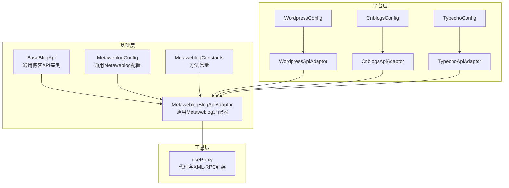
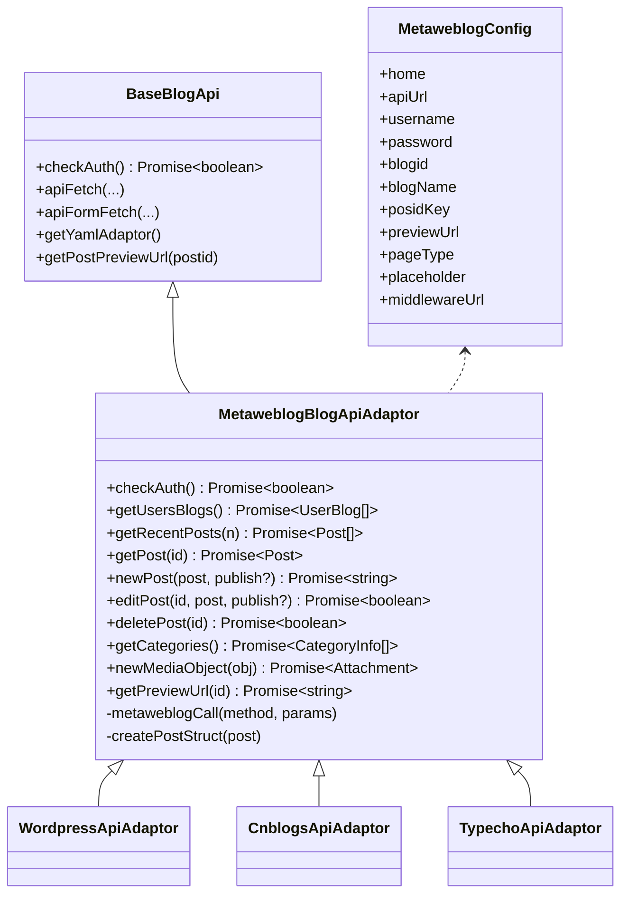
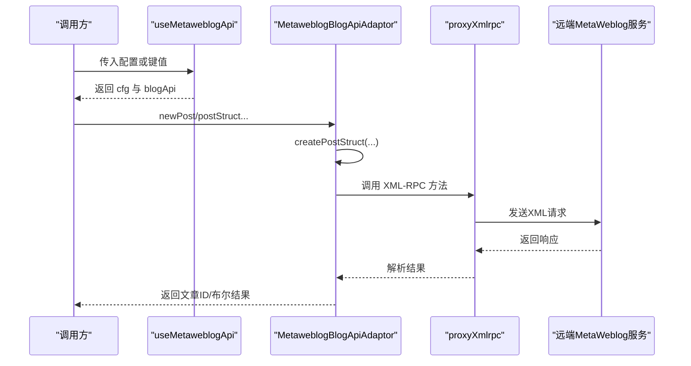
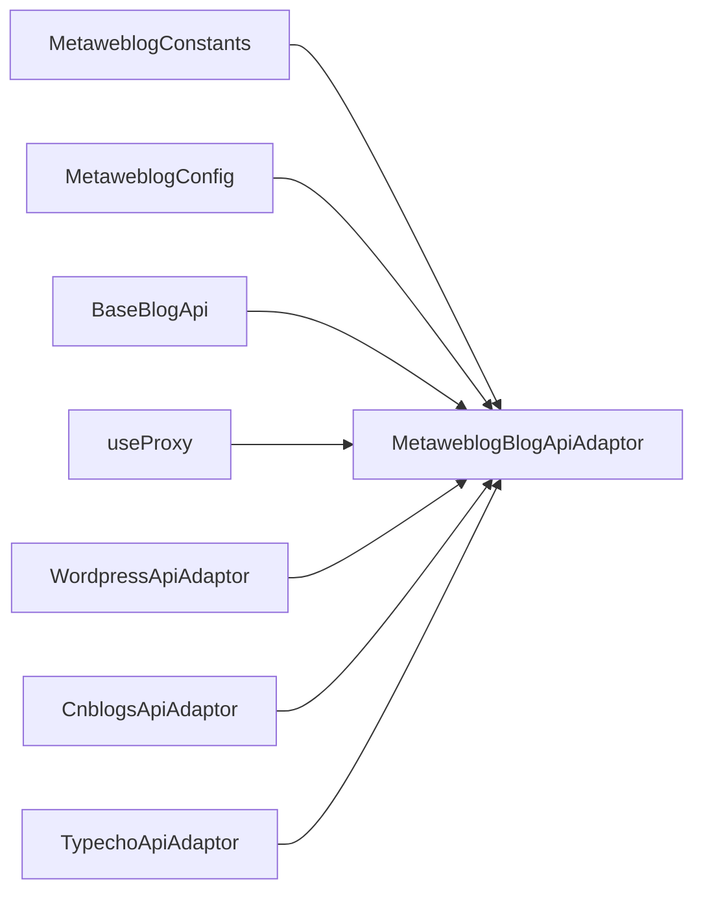

# 博客平台适配器

<cite>
**本文引用的文件**
- [useMetaweblogApi.ts](file://src/adaptors/api/metaweblog/useMetaweblogApi.ts)
- [metaweblogBlogApiAdaptor.ts](file://src/adaptors/api/base/metaweblog/metaweblogBlogApiAdaptor.ts)
- [metaweblogConfig.ts](file://src/adaptors/api/base/metaweblog/metaweblogConfig.ts)
- [metaweblogConstants.ts](file://src/adaptors/api/base/metaweblog/metaweblogConstants.ts)
- [baseBlogApi.ts](file://src/adaptors/api/base/baseBlogApi.ts)
- [wordpressApiAdaptor.ts](file://src/adaptors/api/wordpress/wordpressApiAdaptor.ts)
- [wordpressConfig.ts](file://src/adaptors/api/wordpress/wordpressConfig.ts)
- [cnblogsApiAdaptor.ts](file://src/adaptors/api/cnblogs/cnblogsApiAdaptor.ts)
- [cnblogsConfig.ts](file://src/adaptors/api/cnblogs/cnblogsConfig.ts)
- [typechoApiAdaptor.ts](file://src/adaptors/api/typecho/typechoApiAdaptor.ts)
- [typechoConfig.ts](file://src/adaptors/api/typecho/typechoConfig.ts)
</cite>

## 目录
1. [简介](#简介)
2. [项目结构](#项目结构)
3. [核心组件](#核心组件)
4. [架构总览](#架构总览)
5. [详细组件分析](#详细组件分析)
6. [依赖关系分析](#依赖关系分析)
7. [性能与可靠性](#性能与可靠性)
8. [故障排查指南](#故障排查指南)
9. [结论](#结论)
10. [附录：使用示例与最佳实践](#附录使用示例与最佳实践)

## 简介
本文件面向“博客平台适配器”模块，聚焦于基于 MetaWeblog API 的博客平台统一适配层，覆盖以下平台：
- WordPress（含官方自托管与 WordPress.com）
- 博客园（Cnblogs）
- Typecho
- Jvue（通用 Metaweblog 平台）
- 其他兼容 MetaWeblog 的平台

文档内容包括：
- MetaWeblog 协议在本项目中的实现要点（XML-RPC 调用、认证、文章管理）
- 各平台的配置差异、API 限制、错误处理与最佳实践
- 通过代码级流程图与类图展示适配器架构与调用链
- 提供可直接定位到源码位置的“使用示例路径”，便于快速上手

## 项目结构
围绕 Metaweblog 适配层，项目采用“基础适配器 + 平台特化适配器 + 配置对象”的分层设计：
- 基础层：通用博客 API 基类与 Metaweblog 通用适配器
- 平台层：各平台的适配器与配置对象
- 工具层：统一的代理与 XML-RPC 调用封装

图表来源
- [baseBlogApi.ts:1-205](file://src/adaptors/api/base/baseBlogApi.ts#L1-L205)
- [metaweblogBlogApiAdaptor.ts:1-321](file://src/adaptors/api/base/metaweblog/metaweblogBlogApiAdaptor.ts#L1-L321)
- [metaweblogConfig.ts:1-101](file://src/adaptors/api/base/metaweblog/metaweblogConfig.ts#L1-L101)
- [metaweblogConstants.ts:1-29](file://src/adaptors/api/base/metaweblog/metaweblogConstants.ts#L1-L29)
- [wordpressApiAdaptor.ts:1-37](file://src/adaptors/api/wordpress/wordpressApiAdaptor.ts#L1-L37)
- [wordpressConfig.ts:1-49](file://src/adaptors/api/wordpress/wordpressConfig.ts#L1-L49)
- [cnblogsApiAdaptor.ts:1-131](file://src/adaptors/api/cnblogs/cnblogsApiAdaptor.ts#L1-L131)
- [cnblogsConfig.ts:1-47](file://src/adaptors/api/cnblogs/cnblogsConfig.ts#L1-L47)
- [typechoApiAdaptor.ts:1-36](file://src/adaptors/api/typecho/typechoApiAdaptor.ts#L1-L36)
- [typechoConfig.ts:1-48](file://src/adaptors/api/typecho/typechoConfig.ts#L1-L48)

章节来源
- [baseBlogApi.ts:1-205](file://src/adaptors/api/base/baseBlogApi.ts#L1-L205)
- [metaweblogBlogApiAdaptor.ts:1-321](file://src/adaptors/api/base/metaweblog/metaweblogBlogApiAdaptor.ts#L1-L321)
- [metaweblogConfig.ts:1-101](file://src/adaptors/api/base/metaweblog/metaweblogConfig.ts#L1-L101)
- [metaweblogConstants.ts:1-29](file://src/adaptors/api/base/metaweblog/metaweblogConstants.ts#L1-L29)
- [wordpressApiAdaptor.ts:1-37](file://src/adaptors/api/wordpress/wordpressApiAdaptor.ts#L1-L37)
- [wordpressConfig.ts:1-49](file://src/adaptors/api/wordpress/wordpressConfig.ts#L1-L49)
- [cnblogsApiAdaptor.ts:1-131](file://src/adaptors/api/cnblogs/cnblogsApiAdaptor.ts#L1-L131)
- [cnblogsConfig.ts:1-47](file://src/adaptors/api/cnblogs/cnblogsConfig.ts#L1-L47)
- [typechoApiAdaptor.ts:1-36](file://src/adaptors/api/typecho/typechoApiAdaptor.ts#L1-L36)
- [typechoConfig.ts:1-48](file://src/adaptors/api/typecho/typechoConfig.ts#L1-L48)

## 核心组件
- 通用 Metaweblog 适配器：封装 metaWeblog.* 方法调用、文章结构映射、媒体上传、预览链接生成等
- 平台特化适配器：在通用适配器基础上覆盖特定行为（如博客园的 Markdown 分类注入、预览链接拼接）
- 配置对象：承载平台相关的 API 地址、用户名、密码、预览链接模板、页面类型、标签/分类开关等
- 基类 API：提供统一的代理请求、表单提交、鉴权检查等能力

章节来源
- [metaweblogBlogApiAdaptor.ts:19-321](file://src/adaptors/api/base/metaweblog/metaweblogBlogApiAdaptor.ts#L19-L321)
- [metaweblogConfig.ts:14-101](file://src/adaptors/api/base/metaweblog/metaweblogConfig.ts#L14-L101)
- [baseBlogApi.ts:20-205](file://src/adaptors/api/base/baseBlogApi.ts#L20-L205)

## 架构总览
MetaWeblog 适配器通过统一的 XML-RPC 调用入口，将不同平台的 API 统一为一致的对外接口。平台特化适配器仅在必要处覆写行为，保持核心逻辑复用。

图表来源
- [baseBlogApi.ts:27-205](file://src/adaptors/api/base/baseBlogApi.ts#L27-L205)
- [metaweblogBlogApiAdaptor.ts:26-321](file://src/adaptors/api/base/metaweblog/metaweblogBlogApiAdaptor.ts#L26-L321)
- [metaweblogConfig.ts:17-101](file://src/adaptors/api/base/metaweblog/metaweblogConfig.ts#L17-L101)
- [wordpressApiAdaptor.ts:22-37](file://src/adaptors/api/wordpress/wordpressApiAdaptor.ts#L22-L37)
- [cnblogsApiAdaptor.ts:27-131](file://src/adaptors/api/cnblogs/cnblogsApiAdaptor.ts#L27-L131)
- [typechoApiAdaptor.ts:22-36](file://src/adaptors/api/typecho/typechoApiAdaptor.ts#L22-L36)

## 详细组件分析

### 通用 Metaweblog 适配器（MetaweblogBlogApiAdaptor）
- 功能职责
  - 封装 metaWeblog.* 方法调用，统一通过代理执行 XML-RPC
  - 文章结构映射：标题、关键词、摘要、正文、别名、分类、状态、密码等
  - 媒体对象上传、最近文章查询、文章详情、分类列表、预览链接生成
  - 支持草稿与发布状态切换
- 关键点
  - 通过 useProxy 注入的 proxyXmlrpc 执行 XML-RPC 调用
  - 通过 createPostStruct 将通用 Post 映射为平台期望的结构
  - 预览链接通过配置的模板替换占位符生成

图表来源
- [useMetaweblogApi.ts:30-90](file://src/adaptors/api/metaweblog/useMetaweblogApi.ts#L30-L90)
- [metaweblogBlogApiAdaptor.ts:111-136](file://src/adaptors/api/base/metaweblog/metaweblogBlogApiAdaptor.ts#L111-L136)
- [metaweblogBlogApiAdaptor.ts:239-241](file://src/adaptors/api/base/metaweblog/metaweblogBlogApiAdaptor.ts#L239-L241)

章节来源
- [metaweblogBlogApiAdaptor.ts:19-321](file://src/adaptors/api/base/metaweblog/metaweblogBlogApiAdaptor.ts#L19-L321)
- [metaweblogConstants.ts:17-29](file://src/adaptors/api/base/metaweblog/metaweblogConstants.ts#L17-L29)
- [metaweblogConfig.ts:14-101](file://src/adaptors/api/base/metaweblog/metaweblogConfig.ts#L14-L101)

### WordPress 适配器（WordpressApiAdaptor）
- 特性
  - 继承通用 Metaweblog 适配器
  - 预设 blogid 为 “wordpress”
  - 通过配置解析首页与 API 地址，预览链接模板为 “/?p=[postid]”
- 最佳实践
  - 使用 WordPressConfig 自动解析 home 与 apiUrl
  - 若启用代理，请确保 middlewareUrl 正确配置

章节来源
- [wordpressApiAdaptor.ts:15-37](file://src/adaptors/api/wordpress/wordpressApiAdaptor.ts#L15-L37)
- [wordpressConfig.ts:20-49](file://src/adaptors/api/wordpress/wordpressConfig.ts#L20-L49)

### 博客园（Cnblogs）适配器（CnblogsApiAdaptor）
- 特性
  - 强制为文章添加 Markdown 分类标记，避免非 Markdown 文章被拒
  - 预览链接模板包含用户 ID 占位符 “[userid]”，需从配置的 apiUrl 中提取
  - 分类列表过滤掉内部的 Markdown 分类
- 最佳实践
  - 使用 CnblogsConfig 时，确保 apiUrl 包含用户标识以便正确生成预览链接
  - 若平台要求 Token 认证，注意配置 PasswordType 为 Token

章节来源
- [cnblogsApiAdaptor.ts:18-131](file://src/adaptors/api/cnblogs/cnblogsApiAdaptor.ts#L18-L131)
- [cnblogsConfig.ts:19-47](file://src/adaptors/api/cnblogs/cnblogsConfig.ts#L19-L47)

### Typecho 适配器（TypechoApiAdaptor）
- 特性
  - 继承通用 Metaweblog 适配器
  - 预设 blogid 为 “typecho”
  - 通过配置解析首页与 API 地址，预览链接模板为 “/index.php/archives/[postid]”
- 最佳实践
  - 使用 TypechoConfig 自动解析 home 与 apiUrl
  - 若遇到跨域问题，优先启用代理中间件

章节来源
- [typechoApiAdaptor.ts:15-36](file://src/adaptors/api/typecho/typechoApiAdaptor.ts#L15-L36)
- [typechoConfig.ts:20-48](file://src/adaptors/api/typecho/typechoConfig.ts#L20-L48)

### 通用配置（MetaweblogConfig）
- 字段说明（节选）
  - home：站点首页
  - apiUrl：MetaWeblog API 地址
  - username/password：认证凭据
  - blogid/blogName：平台标识与名称
  - posidKey：文章 ID 映射键
  - previewUrl：预览链接模板
  - pageType：页面类型（Markdown/Html）
  - placeholder/middlewareUrl：占位提示与代理中间件
  - tagEnabled/cateEnabled/categoryType/allowCateChange/knowledgeSpaceEnabled：标签/分类/知识空间相关开关
- 最佳实践
  - 预览链接模板中使用 “[postid]” 或 “[userid]” 等占位符
  - 对需要 Token 的平台，配置相应的 PasswordType

章节来源
- [metaweblogConfig.ts:14-101](file://src/adaptors/api/base/metaweblog/metaweblogConfig.ts#L14-L101)

### 通用基类（BaseBlogApi）
- 能力
  - 统一的代理请求与表单提交（支持 Base64 编解码）
  - 自动选择代理或直连模式
  - 预览链接生成、分类/标签获取的扩展能力
- 最佳实践
  - 在浏览器沙箱环境中优先使用代理
  - 表单上传时注意 payloadEncoding 与 responseEncoding 的一致性

章节来源
- [baseBlogApi.ts:20-205](file://src/adaptors/api/base/baseBlogApi.ts#L20-L205)

## 依赖关系分析
- 组件耦合
  - 平台特化适配器仅依赖通用适配器与配置对象，耦合度低
  - 通用适配器依赖常量与代理封装，形成清晰的边界
- 外部依赖
  - XML-RPC 通过 useProxy 注入的 proxyXmlrpc 执行
  - 日志、工具库来自 zhi-common、zhi-device、zhi-blog-api 等

图表来源
- [metaweblogConstants.ts:17-29](file://src/adaptors/api/base/metaweblog/metaweblogConstants.ts#L17-L29)
- [metaweblogBlogApiAdaptor.ts:26-42](file://src/adaptors/api/base/metaweblog/metaweblogBlogApiAdaptor.ts#L26-L42)
- [baseBlogApi.ts:42-54](file://src/adaptors/api/base/baseBlogApi.ts#L42-L54)
- [wordpressApiAdaptor.ts:22-33](file://src/adaptors/api/wordpress/wordpressApiAdaptor.ts#L22-L33)
- [cnblogsApiAdaptor.ts:27-40](file://src/adaptors/api/cnblogs/cnblogsApiAdaptor.ts#L27-L40)
- [typechoApiAdaptor.ts:22-33](file://src/adaptors/api/typecho/typechoApiAdaptor.ts#L22-L33)

## 性能与可靠性
- 代理与直连策略
  - 自动检测是否使用代理；在沙箱环境或强制代理场景下，统一走代理通道，减少跨域与证书问题
- 请求编码
  - 表单上传采用 Base64 编解码，确保二进制数据安全传输
- 错误处理
  - 适配器对媒体上传与分类获取设置了异常捕获与日志输出，便于定位问题

章节来源
- [baseBlogApi.ts:93-199](file://src/adaptors/api/base/baseBlogApi.ts#L93-L199)
- [metaweblogBlogApiAdaptor.ts:218-237](file://src/adaptors/api/base/metaweblog/metaweblogBlogApiAdaptor.ts#L218-L237)
- [metaweblogBlogApiAdaptor.ts:188-216](file://src/adaptors/api/base/metaweblog/metaweblogBlogApiAdaptor.ts#L188-L216)

## 故障排查指南
- 常见问题
  - 预览链接为空或不正确：检查配置中的 previewUrl 模板与占位符是否匹配
  - 分类/标签无法获取：确认平台是否支持对应方法，或查看日志中的错误信息
  - 跨域失败：启用 middlewareUrl 或调整代理策略
  - 博客园文章未显示为 Markdown：确认是否已注入 Markdown 分类
- 定位手段
  - 查看适配器日志输出（info/debug/error）
  - 使用 apiFetch/apiFormFetch 的返回值进行断点调试

章节来源
- [metaweblogBlogApiAdaptor.ts:182-186](file://src/adaptors/api/base/metaweblog/metaweblogBlogApiAdaptor.ts#L182-L186)
- [cnblogsApiAdaptor.ts:78-109](file://src/adaptors/api/cnblogs/cnblogsApiAdaptor.ts#L78-L109)
- [baseBlogApi.ts:56-58](file://src/adaptors/api/base/baseBlogApi.ts#L56-L58)

## 结论
该适配器体系以通用 Metaweblog 适配器为核心，通过平台特化适配器与配置对象实现对多平台的统一接入。其优势在于：
- 统一的 XML-RPC 调用与文章结构映射
- 明确的代理与编码策略
- 面向平台差异的最小化覆写

建议在实际使用中：
- 优先使用平台对应的 Config 自动解析 home 与 apiUrl
- 正确配置预览链接模板与占位符
- 在跨域与认证场景下，结合平台特性选择合适的代理与认证方式

## 附录：使用示例与最佳实践
以下示例均提供“代码片段路径”，请在 IDE 中打开相应文件定位具体实现：

- 初始化与使用 Metaweblog 适配器
  - 示例路径：[useMetaweblogApi.ts:30-90](file://src/adaptors/api/metaweblog/useMetaweblogApi.ts#L30-L90)
  - 说明：根据传入的 key 或 newCfg 获取配置并创建适配器实例

- 发布新文章（WordPress）
  - 示例路径：[wordpressApiAdaptor.ts:22-33](file://src/adaptors/api/wordpress/wordpressApiAdaptor.ts#L22-L33)
  - 示例路径：[metaweblogBlogApiAdaptor.ts:111-136](file://src/adaptors/api/base/metaweblog/metaweblogBlogApiAdaptor.ts#L111-L136)
  - 说明：构造 Post 对象后调用 newPost，publish 参数控制发布/草稿

- 编辑文章（Typecho/Cnblogs）
  - 示例路径：[typechoApiAdaptor.ts:22-33](file://src/adaptors/api/typecho/typechoApiAdaptor.ts#L22-L33)
  - 示例路径：[cnblogsApiAdaptor.ts:59-63](file://src/adaptors/api/cnblogs/cnblogsApiAdaptor.ts#L59-L63)
  - 说明：编辑前会注入必要的分类或预处理字段

- 删除文章
  - 示例路径：[metaweblogBlogApiAdaptor.ts:169-180](file://src/adaptors/api/base/metaweblog/metaweblogBlogApiAdaptor.ts#L169-L180)

- 获取最近文章/文章详情/分类列表
  - 示例路径：[metaweblogBlogApiAdaptor.ts:68-94](file://src/adaptors/api/base/metaweblog/metaweblogBlogApiAdaptor.ts#L68-L94)
  - 示例路径：[metaweblogBlogApiAdaptor.ts:96-103](file://src/adaptors/api/base/metaweblog/metaweblogBlogApiAdaptor.ts#L96-L103)
  - 示例路径：[metaweblogBlogApiAdaptor.ts:188-216](file://src/adaptors/api/base/metaweblog/metaweblogBlogApiAdaptor.ts#L188-L216)

- 上传媒体对象
  - 示例路径：[metaweblogBlogApiAdaptor.ts:218-237](file://src/adaptors/api/base/metaweblog/metaweblogBlogApiAdaptor.ts#L218-L237)

- 预览链接生成
  - 示例路径：[metaweblogBlogApiAdaptor.ts:182-186](file://src/adaptors/api/base/metaweblog/metaweblogBlogApiAdaptor.ts#L182-L186)
  - 示例路径：[cnblogsApiAdaptor.ts:111-116](file://src/adaptors/api/cnblogs/cnblogsApiAdaptor.ts#L111-L116)

- 平台配置要点
  - WordPress：[wordpressConfig.ts:20-49](file://src/adaptors/api/wordpress/wordpressConfig.ts#L20-L49)
  - 博客园：[cnblogsConfig.ts:19-47](file://src/adaptors/api/cnblogs/cnblogsConfig.ts#L19-L47)
  - Typecho：[typechoConfig.ts:20-48](file://src/adaptors/api/typecho/typechoConfig.ts#L20-L48)