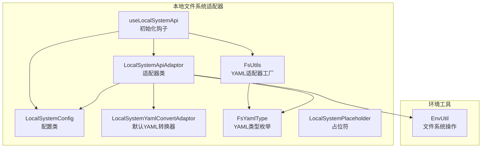
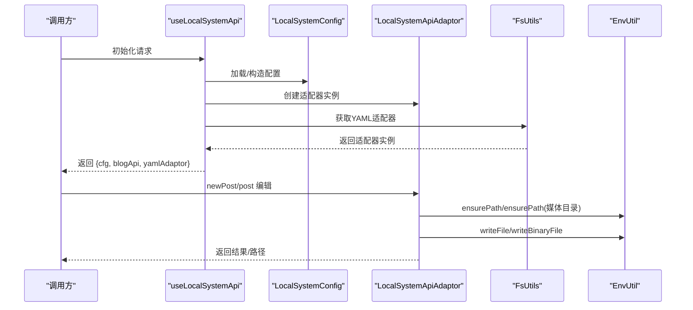
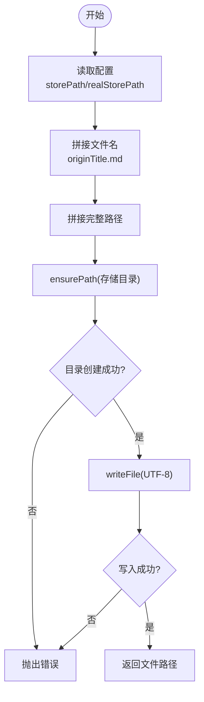
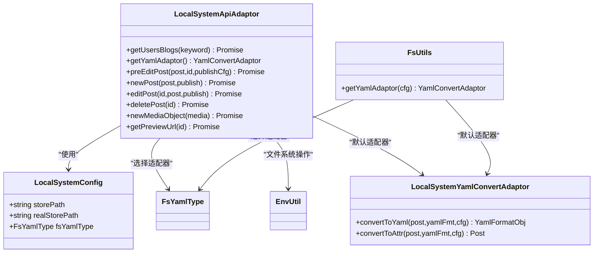

# 文件系统适配器

<cite>
**本文引用的文件**
- [LocalSystemApiAdaptor.ts](file://src/adaptors/fs/LocalSystem/LocalSystemApiAdaptor.ts)
- [LocalSystemConfig.ts](file://src/adaptors/fs/LocalSystem/LocalSystemConfig.ts)
- [FsUtils.ts](file://src/adaptors/fs/LocalSystem/FsUtils.ts)
- [useLocalSystemApi.ts](file://src/adaptors/fs/LocalSystem/useLocalSystemApi.ts)
- [LocalSystemYamlConvertAdaptor.ts](file://src/adaptors/fs/LocalSystem/LocalSystemYamlConvertAdaptor.ts)
- [FsYamlType.ts](file://src/adaptors/fs/LocalSystem/FsYamlType.ts)
- [LocalSystemPlaceholder.ts](file://src/adaptors/fs/LocalSystem/LocalSystemPlaceholder.ts)
- [EnvUtil.ts](file://src/utils/EnvUtil.ts)
- [发布设置.md](file://docs/发布设置.md)
- [常规发布.md](file://docs/常规发布.md)
</cite>

## 目录
1. [简介](#简介)
2. [项目结构](#项目结构)
3. [核心组件](#核心组件)
4. [架构总览](#架构总览)
5. [详细组件分析](#详细组件分析)
6. [依赖关系分析](#依赖关系分析)
7. [性能与可靠性](#性能与可靠性)
8. [故障排查指南](#故障排查指南)
9. [本地发布流程与配置](#本地发布流程与配置)
10. [结论](#结论)

## 简介
本文件系统适配器用于在本地文件系统中进行文章与媒体文件的读写、目录管理、路径处理以及YAML元信息转换。它基于统一的博客适配器接口设计，支持多种静态站点生成器的YAML格式转换，并通过工具类对YAML适配器进行按需选择与封装。

## 项目结构
本地文件系统适配器位于 src/adaptors/fs/LocalSystem 目录下，主要由以下模块组成：
- 配置类：LocalSystemConfig
- 适配器类：LocalSystemApiAdaptor
- 工具类：FsUtils
- 初始化钩子：useLocalSystemApi
- YAML转换器：LocalSystemYamlConvertAdaptor
- YAML类型枚举：FsYamlType
- 占位符类：LocalSystemPlaceholder
- 环境工具：EnvUtil（文件系统操作）

图表来源
- [LocalSystemApiAdaptor.ts:1-273](file://src/adaptors/fs/LocalSystem/LocalSystemApiAdaptor.ts#L1-L273)
- [LocalSystemConfig.ts:1-45](file://src/adaptors/fs/LocalSystem/LocalSystemConfig.ts#L1-L45)
- [FsUtils.ts:1-96](file://src/adaptors/fs/LocalSystem/FsUtils.ts#L1-L96)
- [useLocalSystemApi.ts:1-65](file://src/adaptors/fs/LocalSystem/useLocalSystemApi.ts#L1-L65)
- [LocalSystemYamlConvertAdaptor.ts:1-42](file://src/adaptors/fs/LocalSystem/LocalSystemYamlConvertAdaptor.ts#L1-L42)
- [FsYamlType.ts:1-63](file://src/adaptors/fs/LocalSystem/FsYamlType.ts#L1-L63)
- [LocalSystemPlaceholder.ts:1-21](file://src/adaptors/fs/LocalSystem/LocalSystemPlaceholder.ts#L1-L21)
- [EnvUtil.ts:1-223](file://src/utils/EnvUtil.ts#L1-L223)

章节来源
- [LocalSystemApiAdaptor.ts:1-273](file://src/adaptors/fs/LocalSystem/LocalSystemApiAdaptor.ts#L1-L273)
- [LocalSystemConfig.ts:1-45](file://src/adaptors/fs/LocalSystem/LocalSystemConfig.ts#L1-L45)
- [FsUtils.ts:1-96](file://src/adaptors/fs/LocalSystem/FsUtils.ts#L1-L96)
- [useLocalSystemApi.ts:1-65](file://src/adaptors/fs/LocalSystem/useLocalSystemApi.ts#L1-L65)
- [LocalSystemYamlConvertAdaptor.ts:1-42](file://src/adaptors/fs/LocalSystem/LocalSystemYamlConvertAdaptor.ts#L1-L42)
- [FsYamlType.ts:1-63](file://src/adaptors/fs/LocalSystem/FsYamlType.ts#L1-L63)
- [LocalSystemPlaceholder.ts:1-21](file://src/adaptors/fs/LocalSystem/LocalSystemPlaceholder.ts#L1-L21)
- [EnvUtil.ts:1-223](file://src/utils/EnvUtil.ts#L1-L223)

## 核心组件
- LocalSystemConfig：定义本地存储路径、真实存储路径、YAML类型等配置项，默认启用标签与分类、支持内置图床服务。
- LocalSystemApiAdaptor：实现博客适配器接口，负责文章与媒体文件的创建、编辑、删除、预览URL生成；根据配置动态选择YAML转换器。
- FsUtils：提供YAML适配器工厂方法，依据配置的FsYamlType返回对应适配器实例。
- useLocalSystemApi：初始化适配器与配置，从设置中心加载或构造配置，注入必要能力（标签、分类、图床）。
- LocalSystemYamlConvertAdaptor：默认YAML转换器，将Post对象转换为带YAML头的Markdown内容。
- FsYamlType：枚举支持的YAML类型（Default、Hexo、Hugo、Jekyll、Vuepress、Vuepress2、Vitepress、Quartz、Astro）。
- LocalSystemPlaceholder：本地系统占位符基类。
- EnvUtil：封装文件系统操作（确保路径存在、写入文本/二进制文件、删除文件、目录解析、文件名清理）。

章节来源
- [LocalSystemConfig.ts:22-42](file://src/adaptors/fs/LocalSystem/LocalSystemConfig.ts#L22-L42)
- [LocalSystemApiAdaptor.ts:42-273](file://src/adaptors/fs/LocalSystem/LocalSystemApiAdaptor.ts#L42-L273)
- [FsUtils.ts:30-96](file://src/adaptors/fs/LocalSystem/FsUtils.ts#L30-L96)
- [useLocalSystemApi.ts:27-65](file://src/adaptors/fs/LocalSystem/useLocalSystemApi.ts#L27-L65)
- [LocalSystemYamlConvertAdaptor.ts:14-42](file://src/adaptors/fs/LocalSystem/LocalSystemYamlConvertAdaptor.ts#L14-L42)
- [FsYamlType.ts:16-63](file://src/adaptors/fs/LocalSystem/FsYamlType.ts#L16-L63)
- [LocalSystemPlaceholder.ts:12-21](file://src/adaptors/fs/LocalSystem/LocalSystemPlaceholder.ts#L12-L21)
- [EnvUtil.ts:21-223](file://src/utils/EnvUtil.ts#L21-L223)

## 架构总览
本地文件系统适配器采用“配置驱动 + 工厂模式”的设计：
- useLocalSystemApi 负责装配配置与适配器；
- FsUtils 根据 FsYamlType 返回具体 YAML 转换器；
- LocalSystemApiAdaptor 在运行时根据配置决定存储路径、YAML格式与媒体文件落盘策略；
- EnvUtil 提供底层文件系统能力，保证路径安全与写入成功。

图表来源
- [useLocalSystemApi.ts:27-65](file://src/adaptors/fs/LocalSystem/useLocalSystemApi.ts#L27-L65)
- [FsUtils.ts:39-93](file://src/adaptors/fs/LocalSystem/FsUtils.ts#L39-L93)
- [LocalSystemApiAdaptor.ts:166-212](file://src/adaptors/fs/LocalSystem/LocalSystemApiAdaptor.ts#L166-L212)
- [EnvUtil.ts:46-164](file://src/utils/EnvUtil.ts#L46-L164)

## 详细组件分析

### LocalSystemApiAdaptor 组件
职责与行为
- 初始化阶段：确保文章与媒体存储目录存在，若失败抛出错误。
- YAML适配器选择：根据配置的 fsYamlType 动态选择对应适配器，未匹配时回退到默认适配器。
- 文章发布：生成安全文件名，写入 Markdown 文件，返回文件路径。
- 媒体上传：确保媒体目录存在，写入二进制文件，返回附件信息（含相对路径）。
- 编辑与删除：复用文章发布逻辑；删除文件后返回布尔值。
- 预览：返回 file:// 协议的本地预览链接。

关键流程图（文章发布）

图表来源
- [LocalSystemApiAdaptor.ts:166-203](file://src/adaptors/fs/LocalSystem/LocalSystemApiAdaptor.ts#L166-L203)
- [EnvUtil.ts:46-99](file://src/utils/EnvUtil.ts#L46-L99)

章节来源
- [LocalSystemApiAdaptor.ts:48-273](file://src/adaptors/fs/LocalSystem/LocalSystemApiAdaptor.ts#L48-L273)
- [EnvUtil.ts:46-164](file://src/utils/EnvUtil.ts#L46-L164)

### LocalSystemConfig 组件
- 字段：storePath、realStorePath、fsYamlType。
- 默认值：home 下的 Downloads/syp，媒体目录 assets，fsYamlType 默认 Default。
- 能力开关：启用标签与分类，启用内置图床。

章节来源
- [LocalSystemConfig.ts:22-42](file://src/adaptors/fs/LocalSystem/LocalSystemConfig.ts#L22-L42)

### FsUtils 工具类
- 方法：getYamlAdaptor(cfg)，根据 FsYamlType 返回对应 YAML 转换器，异常时回退到默认适配器。
- 设计要点：集中式适配器选择，便于扩展新类型。

章节来源
- [FsUtils.ts:30-96](file://src/adaptors/fs/LocalSystem/FsUtils.ts#L30-L96)
- [FsYamlType.ts:16-63](file://src/adaptors/fs/LocalSystem/FsYamlType.ts#L16-L63)

### useLocalSystemApi 初始化钩子
- 从设置中心加载配置，若为空则构造默认配置。
- 注入标签、分类、图床能力。
- 返回配置、适配器与YAML适配器实例。

章节来源
- [useLocalSystemApi.ts:27-65](file://src/adaptors/fs/LocalSystem/useLocalSystemApi.ts#L27-L65)

### LocalSystemYamlConvertAdaptor 默认YAML转换器
- convertToYaml：将 Post 的标题写入 YAML 头，生成格式化 YAML 与带 YAML 头的 Markdown。
- convertToAttr：当前直接返回 Post，不进行属性转换。

章节来源
- [LocalSystemYamlConvertAdaptor.ts:14-42](file://src/adaptors/fs/LocalSystem/LocalSystemYamlConvertAdaptor.ts#L14-L42)

### FsYamlType 枚举
- 支持类型：Default、Hexo、Hugo、Jekyll、Vuepress、Vuepress2、Vitepress、Quartz、Astro。

章节来源
- [FsYamlType.ts:16-63](file://src/adaptors/fs/LocalSystem/FsYamlType.ts#L16-L63)

### LocalSystemPlaceholder 占位符
- 继承通用占位符基类，用于本地系统场景下的占位符扩展点。

章节来源
- [LocalSystemPlaceholder.ts:12-21](file://src/adaptors/fs/LocalSystem/LocalSystemPlaceholder.ts#L12-L21)

### EnvUtil 文件系统工具
- ensurePath：标准化路径并递归创建目录。
- writeFile：以 UTF-8 写入文本文件。
- writeBinaryFile：写入二进制文件（媒体）。
- deleteFile：删除文件。
- dirname：解析目录路径。
- sanitizeFilename：清理文件名非法字符。

章节来源
- [EnvUtil.ts:21-223](file://src/utils/EnvUtil.ts#L21-L223)

## 依赖关系分析
- LocalSystemApiAdaptor 依赖：
  - LocalSystemConfig：读取存储路径与YAML类型。
  - FsYamlType：选择适配器类型。
  - EnvUtil：文件系统操作。
  - 各平台 YAML 转换器：当 fsYamlType 非 Default 时使用。
- FsUtils 依赖：
  - LocalSystemConfig、FsYamlType、各平台 YAML 转换器。
- useLocalSystemApi 依赖：
  - LocalSystemConfig、LocalSystemApiAdaptor、FsUtils、设置中心。

图表来源
- [LocalSystemApiAdaptor.ts:42-273](file://src/adaptors/fs/LocalSystem/LocalSystemApiAdaptor.ts#L42-L273)
- [LocalSystemConfig.ts:22-42](file://src/adaptors/fs/LocalSystem/LocalSystemConfig.ts#L22-L42)
- [FsUtils.ts:30-96](file://src/adaptors/fs/LocalSystem/FsUtils.ts#L30-L96)
- [LocalSystemYamlConvertAdaptor.ts:14-42](file://src/adaptors/fs/LocalSystem/LocalSystemYamlConvertAdaptor.ts#L14-L42)
- [FsYamlType.ts:16-63](file://src/adaptors/fs/LocalSystem/FsYamlType.ts#L16-L63)
- [EnvUtil.ts:21-223](file://src/utils/EnvUtil.ts#L21-L223)

## 性能与可靠性
- 目录创建与文件写入均在 Electron 环境的 Node fs 模块上执行，具备良好的跨平台兼容性。
- 文件名清理与路径标准化可避免非法字符与路径问题，降低写入失败概率。
- YAML 适配器选择采用工厂模式，便于扩展与替换，且具备异常回退机制。
- 建议：
  - 大量媒体文件上传时，优先使用二进制写入并确保父目录存在，减少多次 IO。
  - 对于频繁发布场景，建议预先创建好目标目录，避免运行时创建失败。

[本节为通用指导，无需特定文件来源]

## 故障排查指南
常见问题与定位步骤
- 存储路径不可用
  - 现象：初始化阶段抛出路径失败错误。
  - 排查：确认 storePath 与 imageStorePath 是否可写，检查 ensurePath 返回值。
  - 参考：[LocalSystemApiAdaptor.ts:53-65](file://src/adaptors/fs/LocalSystem/LocalSystemApiAdaptor.ts#L53-L65)、[EnvUtil.ts:46-72](file://src/utils/EnvUtil.ts#L46-L72)
- 文章写入失败
  - 现象：newPost 返回失败或抛错。
  - 排查：确认 ensurePath 成功、文件名安全、UTF-8 写入权限。
  - 参考：[LocalSystemApiAdaptor.ts:189-202](file://src/adaptors/fs/LocalSystem/LocalSystemApiAdaptor.ts#L189-L202)、[EnvUtil.ts:79-99](file://src/utils/EnvUtil.ts#L79-L99)
- 媒体文件写入失败
  - 现象：newMediaObject 抛错。
  - 排查：确认媒体目录 ensurePath 成功、二进制数据有效、父目录存在。
  - 参考：[LocalSystemApiAdaptor.ts:214-265](file://src/adaptors/fs/LocalSystem/LocalSystemApiAdaptor.ts#L214-L265)、[EnvUtil.ts:137-164](file://src/utils/EnvUtil.ts#L137-L164)
- YAML 适配器加载异常
  - 现象：getYamlAdaptor 抛错或回退默认适配器。
  - 排查：检查 fsYamlType 配置是否合法，对应适配器是否可用。
  - 参考：[FsUtils.ts:39-93](file://src/adaptors/fs/LocalSystem/FsUtils.ts#L39-L93)、[FsYamlType.ts:16-63](file://src/adaptors/fs/LocalSystem/FsYamlType.ts#L16-L63)

章节来源
- [LocalSystemApiAdaptor.ts:53-65](file://src/adaptors/fs/LocalSystem/LocalSystemApiAdaptor.ts#L53-L65)
- [LocalSystemApiAdaptor.ts:189-202](file://src/adaptors/fs/LocalSystem/LocalSystemApiAdaptor.ts#L189-L202)
- [LocalSystemApiAdaptor.ts:214-265](file://src/adaptors/fs/LocalSystem/LocalSystemApiAdaptor.ts#L214-L265)
- [FsUtils.ts:39-93](file://src/adaptors/fs/LocalSystem/FsUtils.ts#L39-L93)
- [FsYamlType.ts:16-63](file://src/adaptors/fs/LocalSystem/FsYamlType.ts#L16-L63)
- [EnvUtil.ts:46-164](file://src/utils/EnvUtil.ts#L46-L164)

## 本地发布流程与配置

### 发布流程概览
- 准备工作
  - 在偏好设置中配置本地发布平台（入口地址：/#/manage）。
  - 确认存储路径与媒体目录存在或允许自动创建。
- 发布步骤
  - 选择文章 → 触发发布 → 适配器生成安全文件名并写入 Markdown。
  - 若包含媒体，先创建媒体目录，再写入二进制文件并返回附件信息。
  - 预览：返回 file:// 协议链接，可在本地浏览器打开。

参考文档入口
- [发布设置.md:1-9](file://docs/发布设置.md#L1-L9)
- [常规发布.md:1-3](file://docs/常规发布.md#L1-L3)

章节来源
- [发布设置.md:1-9](file://docs/发布设置.md#L1-L9)
- [常规发布.md:1-3](file://docs/常规发布.md#L1-L3)

### 配置指南
- 存储路径
  - storePath：文章存储根目录，支持占位符（如 [auto]），默认位于用户家目录的 Downloads/syp。
  - realStorePath：占位符替换后的实际路径。
  - imageStorePath：媒体文件子目录，默认 assets。
- YAML 类型
  - fsYamlType：选择 YAML 格式类型（Default/Hugo/Jekyll/Vuepress/Vuepress2/Vitepress/Quartz/Astro）。
  - 未匹配时使用 LocalSystemYamlConvertAdaptor 作为默认适配器。
- 能力开关
  - tagEnabled、cateEnabled：启用标签与分类。
  - picgoPicbedSupported、bundledPicbedSupported：启用图床服务。

章节来源
- [LocalSystemConfig.ts:22-42](file://src/adaptors/fs/LocalSystem/LocalSystemConfig.ts#L22-L42)
- [FsYamlType.ts:16-63](file://src/adaptors/fs/LocalSystem/FsYamlType.ts#L16-L63)
- [LocalSystemYamlConvertAdaptor.ts:14-42](file://src/adaptors/fs/LocalSystem/LocalSystemYamlConvertAdaptor.ts#L14-L42)

### 文件监控、增量更新与冲突解决（设计原理）
- 文件监控
  - 当前实现通过直接写入文件完成发布，未内置文件系统事件监听。
  - 如需监控，可在外部集成文件系统监控库（如 chokidar），在文件变更时触发增量处理。
- 增量更新
  - 建议在写入前检查目标文件是否存在，若存在则对比内容或时间戳，仅在变更时更新。
  - 对于媒体文件，可基于文件大小或哈希进行去重与跳过。
- 冲突解决
  - 文件名冲突：使用 sanitizeFilename 清理非法字符；可引入命名空间或时间戳后缀。
  - 目录冲突：ensurePath 已支持递归创建，建议在多线程场景下增加互斥锁或队列。
  - YAML 冲突：不同平台 YAML 头字段差异较大，建议固定 fsYamlType 并保持一致的元信息结构。

[本节为设计原理与实践建议，不直接分析具体代码文件]

## 结论
本地文件系统适配器以清晰的配置驱动与工厂模式实现了对多种静态站点生成器YAML格式的支持，并通过 EnvUtil 提供了可靠的文件系统操作能力。结合 FsUtils 的适配器选择机制，用户可以灵活地在不同静态站点生态间切换。建议在生产环境中配合文件监控与增量更新策略，进一步提升发布效率与稳定性。