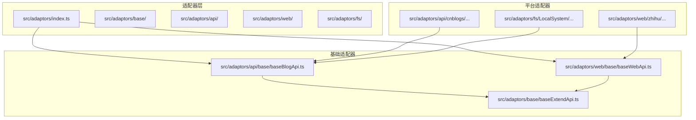
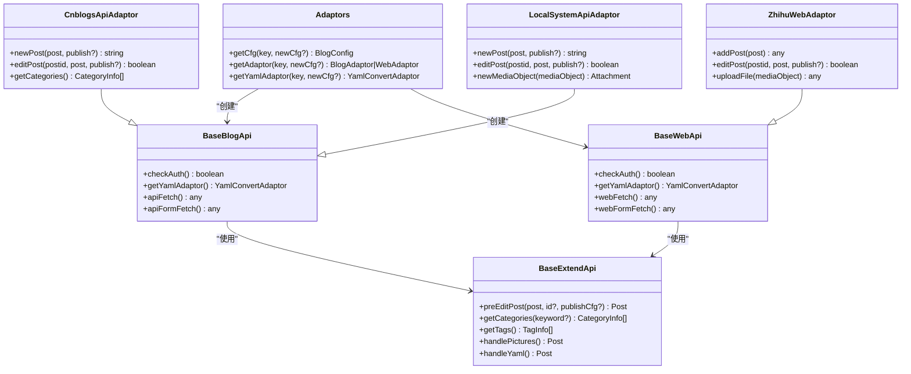
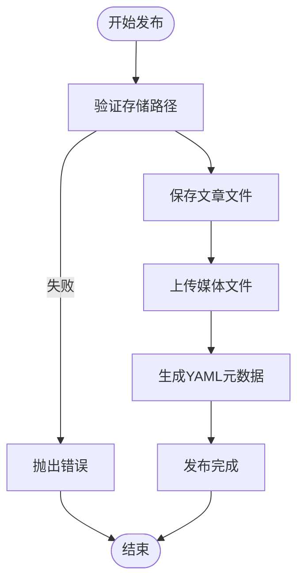
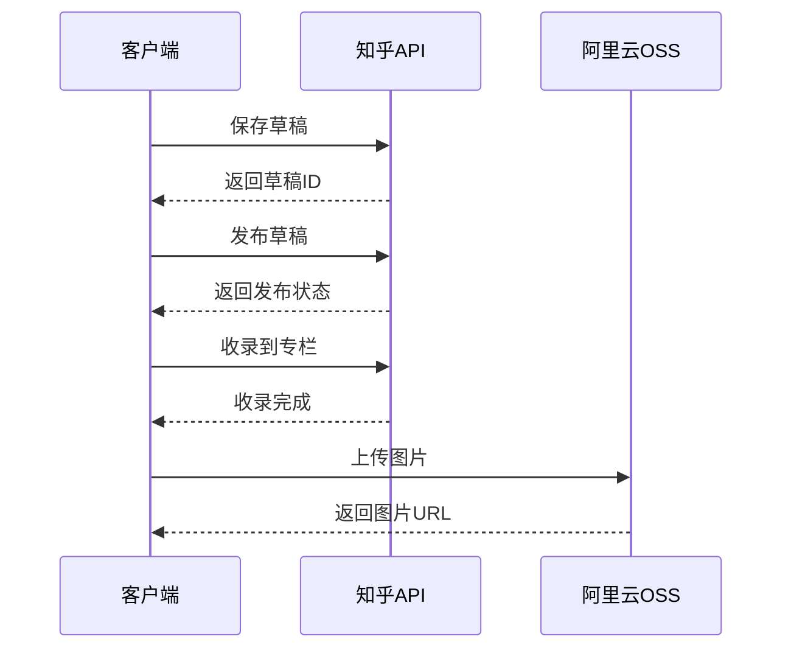
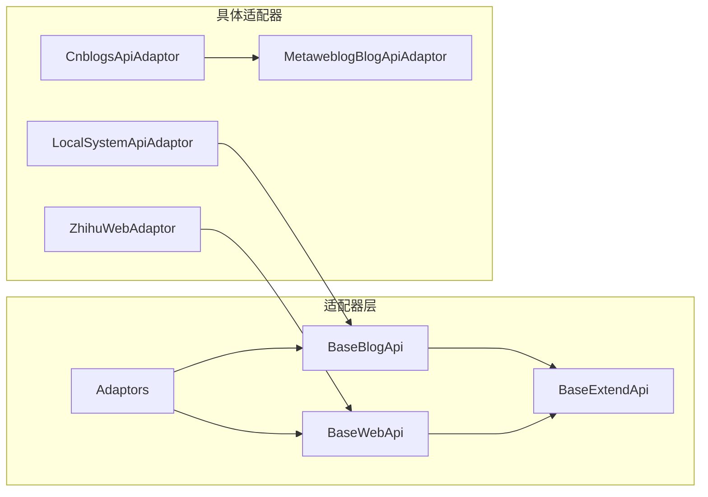

# 适配器API

<cite>
**本文档引用的文件**
- [src/adaptors/index.ts](file://src/adaptors/index.ts)
- [src/adaptors/base/baseExtendApi.ts](file://src/adaptors/base/baseExtendApi.ts)
- [src/adaptors/api/base/baseBlogApi.ts](file://src/adaptors/api/base/baseBlogApi.ts)
- [src/adaptors/web/base/baseWebApi.ts](file://src/adaptors/web/base/baseWebApi.ts)
- [src/adaptors/fs/LocalSystem/LocalSystemApiAdaptor.ts](file://src/adaptors/fs/LocalSystem/LocalSystemApiAdaptor.ts)
- [src/adaptors/api/base/metaweblog/metaweblogBlogApiAdaptor.ts](file://src/adaptors/api/base/metaweblog/metaweblogBlogApiAdaptor.ts)
- [src/adaptors/api/cnblogs/cnblogsApiAdaptor.ts](file://src/adaptors/api/cnblogs/cnblogsApiAdaptor.ts)
- [src/adaptors/api/cnblogs/cnblogsConfig.ts](file://src/adaptors/api/cnblogs/cnblogsConfig.ts)
- [src/adaptors/web/zhihu/zhihuWebAdaptor.ts](file://src/adaptors/web/zhihu/zhihuWebAdaptor.ts)
- [src/adaptors/web/zhihu/zhihuConfig.ts](file://src/adaptors/web/zhihu/zhihuConfig.ts)
- [src/platforms/dynamicConfig.ts](file://src/platforms/dynamicConfig.ts)
- [README.md](file://README.md)
</cite>

## 目录
1. [简介](#简介)
2. [项目结构](#项目结构)
3. [核心组件](#核心组件)
4. [架构概览](#架构概览)
5. [详细组件分析](#详细组件分析)
6. [依赖关系分析](#依赖关系分析)
7. [性能考虑](#性能考虑)
8. [故障排除指南](#故障排除指南)
9. [结论](#结论)
10. [附录](#附录)

## 简介
本文件为 Publisher 插件的适配器API文档，详细记录了所有平台适配器的公共接口，包括博客平台适配器、静态站点适配器、内容平台适配器、Web平台适配器等。文档涵盖每个适配器的完整API接口说明（方法签名、参数类型、返回值、错误处理）、配置选项、认证方式、请求格式和响应格式，并提供具体的使用示例和集成指南。同时说明适配器的生命周期、初始化过程、状态管理和错误恢复机制。

## 项目结构
该项目采用模块化设计，适配器按平台类型组织在不同的目录中：



**图表来源**
- [src/adaptors/index.ts:1-573](file://src/adaptors/index.ts#L1-L573)
- [src/adaptors/api/base/baseBlogApi.ts:1-205](file://src/adaptors/api/base/baseBlogApi.ts#L1-L205)
- [src/adaptors/web/base/baseWebApi.ts:1-256](file://src/adaptors/web/base/baseWebApi.ts#L1-L256)

**章节来源**
- [src/adaptors/index.ts:1-573](file://src/adaptors/index.ts#L1-L573)
- [src/platforms/dynamicConfig.ts:1-534](file://src/platforms/dynamicConfig.ts#L1-L534)

## 核心组件
本节介绍适配器系统的核心组件及其职责。

### 适配器统一入口
Adaptors 类提供统一的适配器获取接口，根据平台key动态选择对应的适配器实现。

主要功能：
- `getCfg(key, newCfg?)`: 获取平台配置
- `getAdaptor(key, newCfg?)`: 获取适配器实例
- `getYamlAdaptor(key, newCfg?)`: 获取YAML转换适配器

### 基础适配器
提供通用的API封装和扩展功能。

#### BaseBlogApi（博客API基类）
- 继承自 zhi-blog-api 的 BlogApi
- 提供统一的认证检查、YAML适配器获取、预处理等功能
- 实现了代理请求和表单请求的统一封装

#### BaseWebApi（Web API基类）
- 继承自 zhi-blog-api 的 WebApi
- 提供网页授权的统一封装
- 实现了Cookie处理、媒体对象上传等功能

#### BaseExtendApi（扩展基类）
- 实现 IBlogApi 和 IWebApi 接口
- 提供文章预处理的完整流程
- 包含图片处理、YAML处理、外链替换等高级功能

**章节来源**
- [src/adaptors/index.ts:56-573](file://src/adaptors/index.ts#L56-L573)
- [src/adaptors/api/base/baseBlogApi.ts:27-205](file://src/adaptors/api/base/baseBlogApi.ts#L27-L205)
- [src/adaptors/web/base/baseWebApi.ts:36-256](file://src/adaptors/web/base/baseWebApi.ts#L36-L256)
- [src/adaptors/base/baseExtendApi.ts:55-739](file://src/adaptors/base/baseExtendApi.ts#L55-L739)

## 架构概览
适配器系统采用分层架构设计，支持多种平台类型的统一管理：



**图表来源**
- [src/adaptors/index.ts:56-573](file://src/adaptors/index.ts#L56-L573)
- [src/adaptors/api/base/baseBlogApi.ts:27-205](file://src/adaptors/api/base/baseBlogApi.ts#L27-L205)
- [src/adaptors/web/base/baseWebApi.ts:36-256](file://src/adaptors/web/base/baseWebApi.ts#L36-L256)
- [src/adaptors/base/baseExtendApi.ts:55-739](file://src/adaptors/base/baseExtendApi.ts#L55-L739)
- [src/adaptors/api/cnblogs/cnblogsApiAdaptor.ts:27-131](file://src/adaptors/api/cnblogs/cnblogsApiAdaptor.ts#L27-L131)
- [src/adaptors/web/zhihu/zhihuWebAdaptor.ts:29-459](file://src/adaptors/web/zhihu/zhihuWebAdaptor.ts#L29-L459)
- [src/adaptors/fs/LocalSystem/LocalSystemApiAdaptor.ts:42-273](file://src/adaptors/fs/LocalSystem/LocalSystemApiAdaptor.ts#L42-L273)

## 详细组件分析

### 博客平台适配器

#### CnblogsApiAdaptor（博客园适配器）
博客园适配器基于 Metaweblog 协议实现，专门处理博客园的特殊需求。

**核心方法：**
- `getUsersBlogs()`: 获取用户博客列表
- `newPost(post, publish?)`: 创建新文章
- `editPost(postid, post, publish?)`: 编辑现有文章
- `deletePost(postid)`: 删除文章
- `getCategories()`: 获取分类列表

**特殊功能：**
- 自动添加 Markdown 分类标签
- 支持博客园特有的分类过滤

**配置选项：**
- `apiUrl`: API 地址
- `username`: 用户名
- `password`: 密码（令牌）
- `previewUrl`: 预览URL模板

**章节来源**
- [src/adaptors/api/cnblogs/cnblogsApiAdaptor.ts:27-131](file://src/adaptors/api/cnblogs/cnblogsApiAdaptor.ts#L27-L131)
- [src/adaptors/api/cnblogs/cnblogsConfig.ts:19-47](file://src/adaptors/api/cnblogs/cnblogsConfig.ts#L19-L47)

#### MetaweblogBlogApiAdaptor（MetaWeblog基类）
提供 MetaWeblog 协议的通用实现，支持多种基于 MetaWeblog 的博客平台。

**核心方法：**
- `getUsersBlogs()`: 获取用户博客
- `getRecentPosts(numOfPosts)`: 获取最近文章
- `getPost(postid)`: 获取单篇文章
- `newPost(post, publish?)`: 创建文章
- `editPost(postid, post, publish?)`: 编辑文章
- `deletePost(postid)`: 删除文章
- `getCategories()`: 获取分类
- `newMediaObject(mediaObject)`: 上传媒体

**请求格式：**
- XML-RPC 协议
- 支持代理转发
- 自动处理认证头

**响应格式：**
- 标准 MetaWeblog 数据结构
- 统一的 Post 对象映射

**章节来源**
- [src/adaptors/api/base/metaweblog/metaweblogBlogApiAdaptor.ts:26-321](file://src/adaptors/api/base/metaweblog/metaweblogBlogApiAdaptor.ts#L26-L321)

### 静态站点适配器

#### LocalSystemApiAdaptor（本地系统适配器）
将文章发布到本地文件系统，支持多种静态站点生成器。

**核心方法：**
- `getUsersBlogs()`: 验证存储路径
- `newPost(post, publish?)`: 保存文章到文件
- `editPost(postid, post, publish?)`: 编辑现有文章
- `deletePost(postid)`: 删除文章
- `newMediaObject(mediaObject)`: 上传媒体文件
- `getYamlAdaptor()`: 获取YAML转换器

**支持的静态站点生成器：**
- Hexo
- Hugo  
- Jekyll
- VuePress
- VitePress
- Quartz
- Astro

**配置选项：**
- `storePath`: 文章存储根路径
- `imageStorePath`: 媒体文件存储路径
- `fsYamlType`: YAML类型
- `realStorePath`: 实际存储路径

**发布流程：**


**图表来源**
- [src/adaptors/fs/LocalSystem/LocalSystemApiAdaptor.ts:166-273](file://src/adaptors/fs/LocalSystem/LocalSystemApiAdaptor.ts#L166-L273)

**章节来源**
- [src/adaptors/fs/LocalSystem/LocalSystemApiAdaptor.ts:42-273](file://src/adaptors/fs/LocalSystem/LocalSystemApiAdaptor.ts#L42-L273)

### Web平台适配器

#### ZhihuWebAdaptor（知乎网页适配器）
处理知乎平台的网页授权发布，支持HTML内容发布。

**核心方法：**
- `getMetaData()`: 获取用户元数据
- `getUsersBlogs()`: 获取专栏列表
- `addPost(post)`: 发布文章
- `editPost(postid, post, publish?)`: 编辑文章
- `deletePost(postid)`: 删除文章
- `uploadFile(mediaObject)`: 上传图片
- `getCategories()`: 获取专栏分类

**认证方式：**
- Cookie 认证
- 用户代理模拟
- 阿里云 OSS 图片上传

**请求流程：**


**图表来源**
- [src/adaptors/web/zhihu/zhihuWebAdaptor.ts:131-198](file://src/adaptors/web/zhihu/zhihuWebAdaptor.ts#L131-L198)

**配置选项：**
- `username`: 用户名
- `password`: Cookie值
- `previewUrl`: 预览URL模板
- `logoutUrl`: 登出URL

**章节来源**
- [src/adaptors/web/zhihu/zhihuWebAdaptor.ts:29-459](file://src/adaptors/web/zhihu/zhihuWebAdaptor.ts#L29-L459)
- [src/adaptors/web/zhihu/zhihuConfig.ts:16-39](file://src/adaptors/web/zhihu/zhihuConfig.ts#L16-L39)

### 基础适配器功能

#### BaseExtendApi（扩展基类）
提供文章发布的完整预处理流程，确保内容符合目标平台要求。

**预处理流程：**
1. 处理MD文件名
2. 处理摘要信息
3. 处理路径分类
4. 处理图片资源
5. 处理Markdown内容
6. 处理YAML元数据
7. 处理其他属性

**图片处理策略：**
- PicGO 图床上传
- 平台自带上传能力
- 在线图片忽略处理

**YAML处理：**
- 自定义自动模式
- 自定义手动模式
- 默认模式生成

**章节来源**
- [src/adaptors/base/baseExtendApi.ts:82-596](file://src/adaptors/base/baseExtendApi.ts#L82-L596)

## 依赖关系分析

### 平台类型系统
系统通过动态配置管理支持的平台类型：

```mermaid
graph TB
subgraph "平台类型"
A[Common - 通用平台]
B[Metaweblog - MetaWeblog]
C[Wordpress - WordPress]
D[Github - GitHub]
E[Gitlab - GitLab]
F[Custom - 自定义Web]
G[Fs - 文件系统]
H[System - 系统平台]
end
subgraph "子平台类型"
A1[Yuque - 语雀]
A2[Notion - Notion]
A3[Halo - Halo]
A4[Telegraph - Telegraph]
A5[Confluence - Confluence]
D1[Hexo - Hexo]
D2[Hugo - Hugo]
D3[Jekyll - Jekyll]
D4[Vuepress - VuePress]
D5[Vitepress - VitePress]
D6[Quartz - Quartz]
D7[Astro - Astro]
F1[Zhihu - 知乎]
F2[CSDN - CSDN]
F3[Wechat - 微信]
F4[Jianshu - 简书]
F5[Juejin - 掘金]
F6[Haloweb - Halo]
F7[Bilibili - 哔哩哔哩]
F8[Xiaohongshu - 小红书]
end
A --> A1
A --> A2
A --> A3
A --> A4
A --> A5
D --> D1
D --> D2
D --> D3
D --> D4
D --> D5
D --> D6
D --> D7
F --> F1
F --> F2
F --> F3
F --> F4
F --> F5
F --> F6
F --> F7
F --> F8
```



**图表来源**
- [src/platforms/dynamicConfig.ts:174-238](file://src/platforms/dynamicConfig.ts#L174-L238)

### 适配器依赖关系


**图表来源**
- [src/adaptors/index.ts:56-573](file://src/adaptors/index.ts#L56-L573)
- [src/adaptors/api/base/baseBlogApi.ts:27-205](file://src/adaptors/api/base/baseBlogApi.ts#L27-L205)
- [src/adaptors/web/base/baseWebApi.ts:36-256](file://src/adaptors/web/base/baseWebApi.ts#L36-L256)

**章节来源**
- [src/platforms/dynamicConfig.ts:1-534](file://src/platforms/dynamicConfig.ts#L1-L534)

## 性能考虑
1. **代理优化**: 自动选择最优的代理方式（SiYuan代理 vs CORS代理）
2. **缓存策略**: YAML转换结果缓存，避免重复计算
3. **批量处理**: 图片上传支持批量处理，减少网络请求次数
4. **异步操作**: 所有网络请求采用异步处理，避免阻塞UI
5. **内存管理**: 大文件上传使用流式处理，避免内存溢出

## 故障排除指南

### 常见问题及解决方案

#### 认证失败
- 检查用户名密码是否正确
- 确认平台API地址是否可用
- 验证代理配置是否正确

#### 图片上传失败
- 检查图片格式是否受支持
- 确认平台配额限制
- 验证网络连接状态

#### YAML生成错误
- 检查YAML格式是否正确
- 确认平台支持的元数据字段
- 验证自定义YAML配置

#### 预览链接无效
- 检查预览URL模板配置
- 确认文章ID是否正确
- 验证平台权限设置

**章节来源**
- [src/adaptors/base/baseExtendApi.ts:535-551](file://src/adaptors/base/baseExtendApi.ts#L535-L551)

## 结论
本适配器API系统提供了完整的多平台发布解决方案，具有以下特点：

1. **统一接口**: 所有适配器遵循相同的接口规范
2. **灵活扩展**: 支持新增平台类型和适配器
3. **强大功能**: 内置丰富的预处理和转换功能
4. **易于使用**: 提供清晰的配置和使用指南
5. **稳定可靠**: 完善的错误处理和恢复机制

系统支持从博客平台到静态站点生成器的广泛平台覆盖，满足不同用户的需求。

## 附录

### 使用示例

#### 基本使用流程
```typescript
// 1. 获取适配器配置
const cfg = await Adaptors.getCfg('github_hexo-123456');

// 2. 获取适配器实例
const adaptor = await Adaptors.getAdaptor('github_hexo-123456');

// 3. 预处理文章
const post = await adaptor.preEditPost(rawPost);

// 4. 发布文章
const postId = await adaptor.newPost(post);
```

#### 配置示例
```typescript
// 博客园配置示例
const cnblogsCfg = new CnblogsConfig(
    'https://rpc.cnblogs.com/metaweblog/username',
    'username',
    'password'
);

// 知乎配置示例
const zhihuCfg = new ZhihuConfig(
    'username',
    'cookie_value'
);
```

### 集成指南
1. **安装依赖**: 确保安装 zhi-blog-api 和相关依赖包
2. **配置平台**: 在设置界面添加平台配置
3. **测试连接**: 使用测试按钮验证连接状态
4. **发布测试**: 发布测试文章验证功能正常
5. **正式使用**: 配置完成后即可正常使用

**章节来源**
- [README.md:1-102](file://README.md#L1-L102)