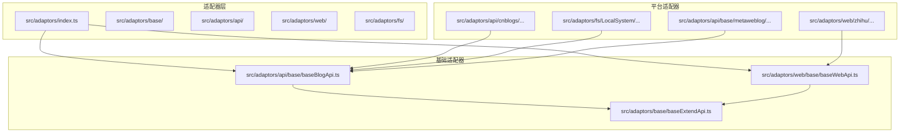
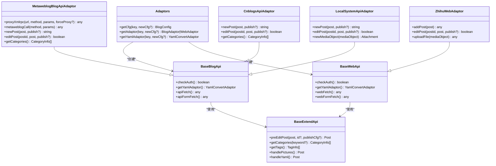
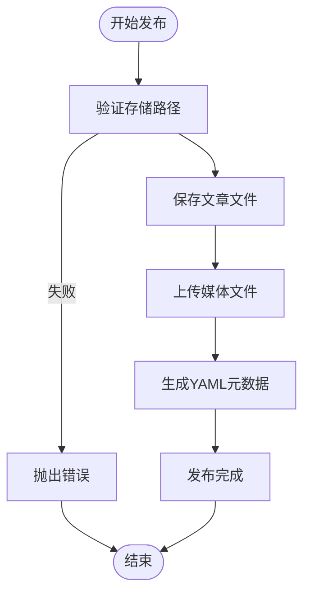
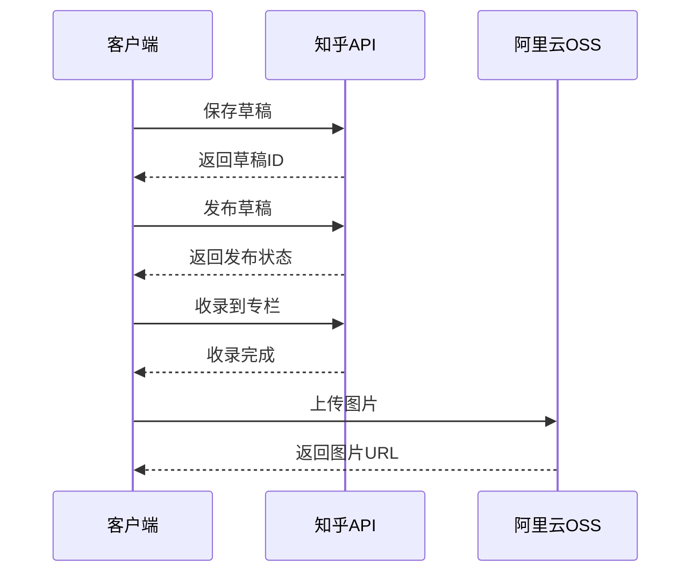
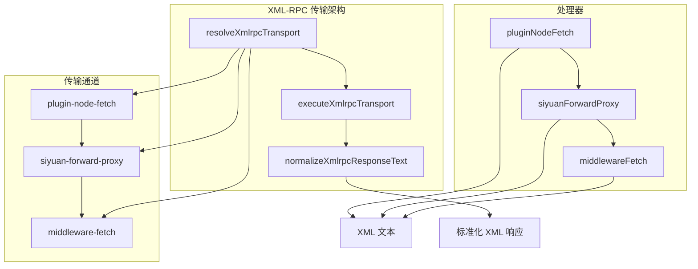
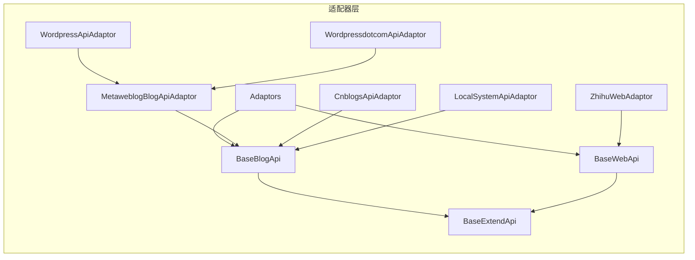

# 适配器API

<cite>
**本文档引用的文件**
- [package.json](file://package.json)
- [src/adaptors/index.ts](file://src/adaptors/index.ts)
- [src/adaptors/base/baseExtendApi.ts](file://src/adaptors/base/baseExtendApi.ts)
- [src/adaptors/api/base/baseBlogApi.ts](file://src/adaptors/api/base/baseBlogApi.ts)
- [src/adaptors/web/base/baseWebApi.ts](file://src/adaptors/web/base/baseWebApi.ts)
- [src/adaptors/api/base/metaweblog/metaweblogBlogApiAdaptor.ts](file://src/adaptors/api/base/metaweblog/metaweblogBlogApiAdaptor.ts)
- [src/adaptors/api/wordpress/wordpressApiAdaptor.ts](file://src/adaptors/api/wordpress/wordpressApiAdaptor.ts)
- [src/adaptors/api/wordpress-dot-com/wordpressdotcomApiAdaptor.ts](file://src/adaptors/api/wordpress-dot-com/wordpressdotcomApiAdaptor.ts)
- [src/adaptors/api/cnblogs/cnblogsApiAdaptor.ts](file://src/adaptors/api/cnblogs/cnblogsApiAdaptor.ts)
- [src/adaptors/api/cnblogs/cnblogsConfig.ts](file://src/adaptors/api/cnblogs/cnblogsConfig.ts)
- [src/adaptors/web/zhihu/zhihuWebAdaptor.ts](file://src/adaptors/web/zhihu/zhihuWebAdaptor.ts)
- [src/adaptors/web/zhihu/zhihuConfig.ts](file://src/adaptors/web/zhihu/zhihuConfig.ts)
- [src/platforms/dynamicConfig.ts](file://src/platforms/dynamicConfig.ts)
- [src/utils/xmlrpcTransport.ts](file://src/utils/xmlrpcTransport.ts)
- [src/utils/xmlrpcResponseUtil.ts](file://src/utils/xmlrpcResponseUtil.ts)
- [src/composables/useProxy.ts](file://src/composables/useProxy.ts)
- [README.md](file://README.md)
</cite>

## 更新摘要
**所做更改**
- 更新了依赖版本信息，反映 zhi-blog-api 从 1.78.0 升级到 1.79.0，zhi-siyuan-api 从 2.35.4 升级到 2.35.5
- 增强了认证处理和平台兼容性支持
- 改进了 XML-RPC 响应处理机制
- 优化了代理中间件的使用
- **新增** 实现了新的 XML-RPC 传输架构，采用 resolveXmlrpcTransport + executeXmlrpcTransport 模式
- **更新** MetaWeblog/XML-RPC 适配器现在遵循三层传输架构：选型层、执行层、响应层

## 目录
1. [简介](#简介)
2. [项目结构](#项目结构)
3. [核心组件](#核心组件)
4. [架构概览](#架构概览)
5. [详细组件分析](#详细组件分析)
6. [XML-RPC 传输架构](#xml-rpc-传输架构)
7. [依赖关系分析](#依赖关系分析)
8. [性能考虑](#性能考虑)
9. [故障排除指南](#故障排除指南)
10. [结论](#结论)
11. [附录](#附录)

## 简介
本文件为 Publisher 插件的适配器API文档，详细记录了所有平台适配器的公共接口，包括博客平台适配器、静态站点适配器、内容平台适配器、Web平台适配器等。文档涵盖每个适配器的完整API接口说明（方法签名、参数类型、返回值、错误处理）、配置选项、认证方式、请求格式和响应格式，并提供具体的使用示例和集成指南。同时说明适配器的生命周期、初始化过程、状态管理和错误恢复机制。

**更新** 本次更新反映了依赖版本升级带来的改进，包括 zhi-blog-api 1.79.0 和 zhi-siyuan-api 2.35.5 的认证处理增强和平台兼容性提升。**新增** 重要更新：MetaWeblog/XML-RPC 适配器现在必须遵循新的 resolveXmlrpcTransport + executeXmlrpcTransport 模式，替代原有的手动代理处理逻辑。

## 项目结构
该项目采用模块化设计，适配器按平台类型组织在不同的目录中：


```mermaid
graph TB
subgraph "适配器层"
A[src/adaptors/index.ts]
B[src/adaptors/base/]
C[src/adaptors/api/]
D[src/adaptors/web/]
E[src/adaptors/fs/]
end
subgraph "基础适配器"
F[src/adaptors/api/base/baseBlogApi.ts]
G[src/adaptors/web/base/baseWebApi.ts]
H[src/adaptors/base/baseExtendApi.ts]
end
subgraph "平台适配器"
I[src/adaptors/api/cnblogs/...]
J[src/adaptors/web/zhihu/...]
K[src/adaptors/fs/LocalSystem/...]
L[src/adaptors/api/base/metaweblog/...]
end
A --> F
A --> G
F --> H
G --> H
I --> F
J --> G
K --> F
L --> F
```

**图表来源**
- [src/adaptors/index.ts:1-616](file://src/adaptors/index.ts#L1-L616)
- [src/adaptors/api/base/baseBlogApi.ts:1-209](file://src/adaptors/api/base/baseBlogApi.ts#L1-L209)
- [src/adaptors/web/base/baseWebApi.ts:1-354](file://src/adaptors/web/base/baseWebApi.ts#L1-L354)

**章节来源**
- [src/adaptors/index.ts:1-616](file://src/adaptors/index.ts#L1-L616)
- [src/platforms/dynamicConfig.ts:1-200](file://src/platforms/dynamicConfig.ts#L1-L200)

## 核心组件
本节介绍适配器系统的核心组件及其职责。

### 适配器统一入口
Adaptors 类提供统一的适配器获取接口，根据平台key动态选择对应的适配器实现。

主要功能：
- `getCfg(key, newCfg?)`: 获取平台配置
- `getAdaptor(key, newCfg?)`: 获取适配器实例
- `getYamlAdaptor(key, newCfg?)`: 获取YAML转换适配器

### 基础适配器
提供通用的API封装和扩展功能。

#### BaseBlogApi（博客API基类）
- 继承自 zhi-blog-api 的 BlogApi
- 提供统一的认证检查、YAML适配器获取、预处理等功能
- 实现了代理请求和表单请求的统一封装
- **更新** 增强了 XML-RPC 响应处理机制，支持更稳定的非文本响应处理

#### BaseWebApi（Web API基类）
- 继承自 zhi-blog-api 的 WebApi
- 提供网页授权的统一封装
- 实现了Cookie处理、媒体对象上传等功能
- **更新** 改进了诊断信息收集和错误处理机制

#### BaseExtendApi（扩展基类）
- 实现 IBlogApi 和 IWebApi 接口
- 提供文章预处理的完整流程
- 包含图片处理、YAML处理、外链替换等高级功能
- **更新** 优化了图片上传错误处理和诊断信息输出

**章节来源**
- [src/adaptors/index.ts:59-616](file://src/adaptors/index.ts#L59-L616)
- [src/adaptors/api/base/baseBlogApi.ts:27-209](file://src/adaptors/api/base/baseBlogApi.ts#L27-L209)
- [src/adaptors/web/base/baseWebApi.ts:54-354](file://src/adaptors/web/base/baseWebApi.ts#L54-L354)
- [src/adaptors/base/baseExtendApi.ts:57-765](file://src/adaptors/base/baseExtendApi.ts#L57-L765)

## 架构概览
适配器系统采用分层架构设计，支持多种平台类型的统一管理：


```mermaid
classDiagram
class Adaptors {
+getCfg(key, newCfg?) BlogConfig
+getAdaptor(key, newCfg?) BlogAdaptor|WebAdaptor
+getYamlAdaptor(key, newCfg?) YamlConvertAdaptor
}
class BaseBlogApi {
+checkAuth() boolean
+getYamlAdaptor() YamlConvertAdaptor
+apiFetch() any
+apiFormFetch() any
}
class BaseWebApi {
+checkAuth() boolean
+getYamlAdaptor() YamlConvertAdaptor
+webFetch() any
+webFormFetch() any
}
class BaseExtendApi {
+preEditPost(post, id?, publishCfg?) Post
+getCategories(keyword?) CategoryInfo[]
+getTags() TagInfo[]
+handlePictures() Post
+handleYaml() Post
}
class MetaweblogBlogApiAdaptor {
+proxyXmlrpc(url, method, params, forceProxy?) any
+metaweblogCall(method, params) any
+newPost(post, publish?) string
+editPost(postid, post, publish?) boolean
+getCategories() CategoryInfo[]
}
class CnblogsApiAdaptor {
+newPost(post, publish?) string
+editPost(postid, post, publish?) boolean
+getCategories() CategoryInfo[]
}
class ZhihuWebAdaptor {
+addPost(post) any
+editPost(postid, post, publish?) boolean
+uploadFile(mediaObject) any
}
class LocalSystemApiAdaptor {
+newPost(post, publish?) string
+editPost(postid, post, publish?) boolean
+newMediaObject(mediaObject) Attachment
}
Adaptors --> BaseBlogApi : "创建"
Adaptors --> BaseWebApi : "创建"
BaseBlogApi --> BaseExtendApi : "使用"
BaseWebApi --> BaseExtendApi : "使用"
MetaweblogBlogApiAdaptor --|> BaseBlogApi
CnblogsApiAdaptor --|> BaseBlogApi
ZhihuWebAdaptor --|> BaseWebApi
LocalSystemApiAdaptor --|> BaseBlogApi
```

**图表来源**
- [src/adaptors/index.ts:59-616](file://src/adaptors/index.ts#L59-L616)
- [src/adaptors/api/base/baseBlogApi.ts:27-209](file://src/adaptors/api/base/baseBlogApi.ts#L27-L209)
- [src/adaptors/web/base/baseWebApi.ts:54-354](file://src/adaptors/web/base/baseWebApi.ts#L54-L354)
- [src/adaptors/base/baseExtendApi.ts:57-765](file://src/adaptors/base/baseExtendApi.ts#L57-L765)
- [src/adaptors/api/cnblogs/cnblogsApiAdaptor.ts:28-132](file://src/adaptors/api/cnblogs/cnblogsApiAdaptor.ts#L28-L132)
- [src/adaptors/web/zhihu/zhihuWebAdaptor.ts:30-460](file://src/adaptors/web/zhihu/zhihuWebAdaptor.ts#L30-L460)

## 详细组件分析

### 博客平台适配器

#### MetaweblogBlogApiAdaptor（MetaWeblog基类）
**更新** 该适配器现在必须遵循新的 XML-RPC 传输架构，采用 resolveXmlrpcTransport + executeXmlrpcTransport 模式。

**核心方法：**
- `proxyXmlrpc(url, method, params, forceProxy?)`: 通过新的传输架构发送 XML-RPC 请求
- `metaweblogCall(method, params)`: 内部调用 XML-RPC 方法的标准实现
- `getUsersBlogs()`: 获取用户博客列表
- `newPost(post, publish?)`: 创建新文章
- `editPost(postid, post, publish?)`: 编辑现有文章
- `deletePost(postid)`: 删除文章
- `getCategories()`: 获取分类列表

**新的传输架构：**
1. **选型层** (`resolveXmlrpcTransport`): 决定使用哪种传输通道
2. **执行层** (`executeXmlrpcTransport`): 统一执行传输并返回 XML 字符串
3. **响应层** (`normalizeXmlrpcResponseText`): 标准化响应格式

**传输通道优先级：**
1. `plugin-node-fetch` - 插件直传能力（最高优先级）
2. `siyuan-forward-proxy` - 思源转发代理
3. `middleware-fetch` - 浏览器 CORS 中间件

**配置选项：**
- `apiUrl`: XML-RPC 端点地址
- `username`: 用户名
- `password`: 密码（令牌）
- `blogid`: 博客ID
- `previewUrl`: 预览URL模板

**章节来源**
- [src/adaptors/api/base/metaweblog/metaweblogBlogApiAdaptor.ts:27-322](file://src/adaptors/api/base/metaweblog/metaweblogBlogApiAdaptor.ts#L27-L322)
- [src/utils/xmlrpcTransport.ts:12-79](file://src/utils/xmlrpcTransport.ts#L12-L79)
- [src/utils/xmlrpcResponseUtil.ts:124-157](file://src/utils/xmlrpcResponseUtil.ts#L124-L157)

#### CnblogsApiAdaptor（博客园适配器）
博客园适配器基于 Metaweblog 协议实现，专门处理博客园的特殊需求。

**核心方法：**
- `getUsersBlogs()`: 获取用户博客列表
- `newPost(post, publish?)`: 创建新文章
- `editPost(postid, post, publish?)`: 编辑现有文章
- `deletePost(postid)`: 删除文章
- `getCategories()`: 获取分类列表

**特殊功能：**
- 自动添加 Markdown 分类标签
- 支持博客园特有的分类过滤
- **更新** 改进了 XML-RPC 响应处理，增强了稳定性

**配置选项：**
- `apiUrl`: API 地址
- `username`: 用户名
- `password`: 密码（令牌）
- `previewUrl`: 预览URL模板

**章节来源**
- [src/adaptors/api/cnblogs/cnblogsApiAdaptor.ts:28-132](file://src/adaptors/api/cnblogs/cnblogsApiAdaptor.ts#L28-L132)
- [src/adaptors/api/cnblogs/cnblogsConfig.ts:19-46](file://src/adaptors/api/cnblogs/cnblogsConfig.ts#L19-L46)

#### WordPressApiAdaptor（WordPress适配器）
WordPress 适配器继承自 MetaweblogBlogApiAdaptor，专门处理 WordPress 平台的 XML-RPC 请求。

**核心方法：**
- 继承自父类的所有 XML-RPC 方法
- `getUsersBlogs()`: 获取用户博客列表
- `newPost(post, publish?)`: 创建新文章
- `editPost(postid, post, publish?)`: 编辑现有文章
- `deletePost(postid)`: 删除文章
- `getCategories()`: 获取分类列表

**特殊功能：**
- 使用 WordPress 特定的 blogid ("wordpress")
- 继承完整的 XML-RPC 传输架构

**章节来源**
- [src/adaptors/api/wordpress/wordpressApiAdaptor.ts:22-37](file://src/adaptors/api/wordpress/wordpressApiAdaptor.ts#L22-L37)

#### WordpressdotcomApiAdaptor（WordPress.com适配器）
WordPress.com 适配器继承自 MetaweblogBlogApiAdaptor，专门处理 WordPress.com 平台的 XML-RPC 请求。

**核心方法：**
- 继承自父类的所有 XML-RPC 方法
- `getUsersBlogs()`: 获取用户博客列表
- `deletePost(postid)`: 删除文章
- **更新** 重写 `metaweblogCall` 方法，强制使用代理模式

**特殊功能：**
- 使用 WordPress.com 特定的 blogid ("wordpress-dot-com")
- **更新** 强制代理模式：`metaweblogCall` 方法始终传递 `true` 作为 `forceProxy` 参数
- 继承完整的 XML-RPC 传输架构

**章节来源**
- [src/adaptors/api/wordpress-dot-com/wordpressdotcomApiAdaptor.ts:25-75](file://src/adaptors/api/wordpress-dot-com/wordpressdotcomApiAdaptor.ts#L25-L75)

### 静态站点适配器

#### LocalSystemApiAdaptor（本地系统适配器）
将文章发布到本地文件系统，支持多种静态站点生成器。

**核心方法：**
- `getUsersBlogs()`: 验证存储路径
- `newPost(post, publish?)`: 保存文章到文件
- `editPost(postid, post, publish?)`: 编辑现有文章
- `deletePost(postid)`: 删除文章
- `newMediaObject(mediaObject)`: 上传媒体文件
- `getYamlAdaptor()`: 获取YAML转换器

**支持的静态站点生成器：**
- Hexo
- Hugo  
- Jekyll
- VuePress
- VitePress
- Quartz
- Astro

**配置选项：**
- `storePath`: 文章存储根路径
- `imageStorePath`: 媒体文件存储路径
- `fsYamlType`: YAML类型
- `realStorePath`: 实际存储路径

**发布流程：**

```mermaid
flowchart TD
Start([开始发布]) --> Validate["验证存储路径"]
Validate --> SavePost["保存文章文件"]
SavePost --> UploadMedia["上传媒体文件"]
UploadMedia --> GenerateYaml["生成YAML元数据"]
GenerateYaml --> Success["发布完成"]
Validate --> |失败| Error["抛出错误"]
Error --> End([结束])
Success --> End
```

**图表来源**
- [src/adaptors/fs/LocalSystem/LocalSystemApiAdaptor.ts:166-273](file://src/adaptors/fs/LocalSystem/LocalSystemApiAdaptor.ts#L166-L273)

**章节来源**
- [src/adaptors/fs/LocalSystem/LocalSystemApiAdaptor.ts:42-273](file://src/adaptors/fs/LocalSystem/LocalSystemApiAdaptor.ts#L42-L273)

### Web平台适配器

#### ZhihuWebAdaptor（知乎网页适配器）
处理知乎平台的网页授权发布，支持HTML内容发布。

**核心方法：**
- `getMetaData()`: 获取用户元数据
- `getUsersBlogs()`: 获取专栏列表
- `addPost(post)`: 发布文章
- `editPost(postid, post, publish?)`: 编辑文章
- `deletePost(postid)`: 删除文章
- `uploadFile(mediaObject)`: 上传图片
- `getCategories()`: 获取专栏分类

**认证方式：**
- Cookie 认证
- 用户代理模拟
- 阿里云 OSS 图片上传

**请求流程：**

```mermaid
sequenceDiagram
participant Client as 客户端
participant Zhihu as 知乎API
participant OSS as 阿里云OSS
Client->>Zhihu : 保存草稿
Zhihu-->>Client : 返回草稿ID
Client->>Zhihu : 发布草稿
Zhihu-->>Client : 返回发布状态
Client->>Zhihu : 收录到专栏
Zhihu-->>Client : 收录完成
Client->>OSS : 上传图片
OSS-->>Client : 返回图片URL
```

**图表来源**
- [src/adaptors/web/zhihu/zhihuWebAdaptor.ts:132-166](file://src/adaptors/web/zhihu/zhihuWebAdaptor.ts#L132-L166)

**配置选项：**
- `username`: 用户名
- `password`: Cookie值
- `previewUrl`: 预览URL模板
- `logoutUrl`: 登出URL

**章节来源**
- [src/adaptors/web/zhihu/zhihuWebAdaptor.ts:30-460](file://src/adaptors/web/zhihu/zhihuWebAdaptor.ts#L30-L460)
- [src/adaptors/web/zhihu/zhihuConfig.ts:16-35](file://src/adaptors/web/zhihu/zhihuConfig.ts#L16-L35)

### 基础适配器功能

#### BaseExtendApi（扩展基类）
提供文章发布的完整预处理流程，确保内容符合目标平台要求。

**预处理流程：**
1. 处理MD文件名
2. 处理摘要信息
3. 处理路径分类
4. 处理图片资源
5. 处理Markdown内容
6. 处理YAML元数据
7. 处理其他属性

**图片处理策略：**
- PicGO 图床上传
- 平台自带上传能力
- 在线图片忽略处理

**YAML处理：**
- 自定义自动模式
- 自定义手动模式
- 默认模式生成

**更新** 增强了图片上传错误处理，改进了诊断信息收集机制

**章节来源**
- [src/adaptors/base/baseExtendApi.ts:92-765](file://src/adaptors/base/baseExtendApi.ts#L92-L765)

## XML-RPC 传输架构

**新增** MetaWeblog/XML-RPC 适配器现在遵循三层传输架构，与表单上传的传输架构保持一致。


```mermaid
graph TB
subgraph "XML-RPC 传输架构"
A[resolveXmlrpcTransport] --> B[executeXmlrpcTransport]
B --> C[normalizeXmlrpcResponseText]
end
subgraph "传输通道"
D[plugin-node-fetch] --> E[siyuan-forward-proxy]
E --> F[middleware-fetch]
end
subgraph "处理器"
G[pluginNodeFetch] --> H[siyuanForwardProxy]
H --> I[middlewareFetch]
end
A --> D
A --> E
A --> F
G --> J[XML 文本]
H --> J
I --> J
C --> K[标准化 XML 响应]
```

**图表来源**
- [src/utils/xmlrpcTransport.ts:48-76](file://src/utils/xmlrpcTransport.ts#L48-L76)
- [src/utils/xmlrpcResponseUtil.ts:128-157](file://src/utils/xmlrpcResponseUtil.ts#L128-L157)

### 传输选型规则

**resolveXmlrpcTransport** 函数负责决定使用哪种传输通道：

1. **plugin-node-fetch** (最高优先级)
   - 当 `canUsePluginFetch` 为 true 时
   - 适用于插件直传能力（Electron/V2、本地 WordPress、公网博客园）

2. **siyuan-forward-proxy**
   - 当目标不是回环/私网地址且需要代理时
   - 适用于外链访问思源 API 的场景

3. **middleware-fetch** (最低优先级)
   - 浏览器环境下的 CORS 回退方案

### 传输执行流程

**executeXmlrpcTransport** 函数统一执行传输并返回标准化的 XML 文本：

1. 根据选型结果调用相应的处理器
2. 执行网络请求并接收原始响应
3. 通过 `normalizeXmlrpcResponseText` 标准化响应格式

### 响应标准化

**normalizeXmlrpcResponseText** 函数处理各种可能的响应格式：

1. 直接字符串响应：进行 Base64 解码
2. 包装对象响应：提取 XML 文本字段
3. 空响应对象：抛出明确的错误信息
4. 非文本响应：转换为字符串并进行 Base64 解码

### 回环地址检测

**isLoopbackOrLocalTargetUrl** 函数检测目标地址是否为回环或私网地址：

- `localhost`、`127.0.0.1`、`[::1]`、`0.0.0.0`
- 私网地址段：`10.0.0.0/8`、`172.16.0.0/12`、`192.168.0.0/16`

**章节来源**
- [src/utils/xmlrpcTransport.ts:48-76](file://src/utils/xmlrpcTransport.ts#L48-L76)
- [src/utils/xmlrpcResponseUtil.ts:128-187](file://src/utils/xmlrpcResponseUtil.ts#L128-L187)
- [src/composables/useProxy.ts:116-142](file://src/composables/useProxy.ts#L116-L142)

## 依赖关系分析

### 平台类型系统
系统通过动态配置管理支持的平台类型：


```mermaid
graph TB
subgraph "平台类型"
A[Common - 通用平台]
B[Metaweblog - MetaWeblog]
C[Wordpress - WordPress]
D[GitHub - GitHub]
E[GitLab - GitLab]
F[Custom - 自定义Web]
G[Fs - 文件系统]
H[System - 系统平台]
end
subgraph "子平台类型"
A1[Yuque - 语雀]
A2[Notion - Notion]
A3[Halo - Halo]
A4[Telegraph - Telegraph]
A5[Confluence - Confluence]
D1[Hexo - Hexo]
D2[Hugo - Hugo]
D3[Jekyll - Jekyll]
D4[Vuepress - VuePress]
D5[Vitepress - VitePress]
D6[Quartz - Quartz]
D7[Astro - Astro]
F1[Zhihu - 知乎]
F2[CSDN - CSDN]
F3[Wechat - 微信]
F4[Jianshu - 简书]
F5[Juejin - 掘金]
F6[Haloweb - Halo]
F7[Bilibili - 哔哩哔哩]
F8[Xiaohongshu - 小红书]
C1[WordPress - WordPress]
C2[WordPress.com - WordPress.com]
end
A --> A1
A --> A2
A --> A3
A --> A4
A --> A5
D --> D1
D --> D2
D --> D3
D --> D4
D --> D5
D --> D6
D --> D7
F --> F1
F --> F2
F --> F3
F --> F4
F --> F5
F --> F6
F --> F7
F --> F8
B --> C1
B --> C2
```

**图表来源**
- [src/platforms/dynamicConfig.ts:158-198](file://src/platforms/dynamicConfig.ts#L158-L198)

### 适配器依赖关系

```mermaid
graph LR
subgraph "适配器层"
A[Adaptors]
B[BaseBlogApi]
C[BaseWebApi]
D[BaseExtendApi]
E[MetaweblogBlogApiAdaptor]
F[CnblogsApiAdaptor]
G[ZhihuWebAdaptor]
H[LocalSystemApiAdaptor]
I[WordpressApiAdaptor]
J[WordpressdotcomApiAdaptor]
end
A --> B
A --> C
B --> D
C --> D
E --> B
F --> B
G --> C
H --> B
I --> E
J --> E
```

**图表来源**
- [src/adaptors/index.ts:59-616](file://src/adaptors/index.ts#L59-L616)
- [src/adaptors/api/base/baseBlogApi.ts:27-209](file://src/adaptors/api/base/baseBlogApi.ts#L27-L209)
- [src/adaptors/web/base/baseWebApi.ts:54-354](file://src/adaptors/web/base/baseWebApi.ts#L54-L354)

**章节来源**
- [src/platforms/dynamicConfig.ts:1-200](file://src/platforms/dynamicConfig.ts#L1-L200)

## 性能考虑
1. **代理优化**: 自动选择最优的代理方式（SiYuan代理 vs CORS代理）
2. **缓存策略**: YAML转换结果缓存，避免重复计算
3. **批量处理**: 图片上传支持批量处理，减少网络请求次数
4. **异步操作**: 所有网络请求采用异步处理，避免阻塞UI
5. **内存管理**: 大文件上传使用流式处理，避免内存溢出
6. **更新** 优化了代理中间件的使用效率，减少了不必要的请求开销
7. **新增** XML-RPC 传输架构优化了网络请求的路由选择和响应处理

## 故障排除指南

### 常见问题及解决方案

#### 认证失败
- 检查用户名密码是否正确
- 确认平台API地址是否可用
- 验证代理配置是否正确
- **更新** 检查 zhi-blog-api 1.79.0 的认证处理改进

#### 图片上传失败
- 检查图片格式是否受支持
- 确认平台配额限制
- 验证网络连接状态
- **更新** 查看增强的诊断信息收集

#### YAML生成错误
- 检查YAML格式是否正确
- 确认平台支持的元数据字段
- 验证自定义YAML配置

#### 预览链接无效
- 检查预览URL模板配置
- 确认文章ID是否正确
- 验证平台权限设置

#### XML-RPC 响应问题
- **新增** 检查响应格式是否符合标准
- 验证 proxyXmlrpc 中间件配置
- 查看 zhi-blog-api 1.79.0 的响应处理改进
- **新增** 检查 XML-RPC 传输架构的三个层级是否正常工作

#### 传输通道选择问题
- **新增** 检查 `resolveXmlrpcTransport` 的条件判断
- 验证 `canUsePluginFetch`、`isUseSiyuanProxy`、`forceProxy` 参数
- 确认目标地址不是回环/私网地址

#### WordPress.com 强制代理问题
- **新增** 确认 `WordpressdotcomApiAdaptor` 的 `forceProxy` 参数始终为 `true`
- 验证 WordPress.com 特定的认证要求

**章节来源**
- [src/adaptors/base/baseExtendApi.ts:535-551](file://src/adaptors/base/baseExtendApi.ts#L535-L551)
- [src/utils/xmlrpcTransport.ts:48-76](file://src/utils/xmlrpcTransport.ts#L48-L76)
- [src/utils/xmlrpcResponseUtil.ts:128-157](file://src/utils/xmlrpcResponseUtil.ts#L128-L157)

## 结论
本适配器API系统提供了完整的多平台发布解决方案，具有以下特点：

1. **统一接口**: 所有适配器遵循相同的接口规范
2. **灵活扩展**: 支持新增平台类型和适配器
3. **强大功能**: 内置丰富的预处理和转换功能
4. **易于使用**: 提供清晰的配置和使用指南
5. **稳定可靠**: 完善的错误处理和恢复机制
6. **更新** 依赖版本升级带来了更好的认证处理和平台兼容性
7. **新增** XML-RPC 传输架构实现了三层解耦，提高了系统的可维护性和可靠性

系统支持从博客平台到静态站点生成器的广泛平台覆盖，满足不同用户的需求。

## 附录

### 使用示例

#### 基本使用流程
```typescript
// 1. 获取适配器配置
const cfg = await Adaptors.getCfg('github_hexo-123456');

// 2. 获取适配器实例
const adaptor = await Adaptors.getAdaptor('github_hexo-123456');

// 3. 预处理文章
const post = await adaptor.preEditPost(rawPost);

// 4. 发布文章
const postId = await adaptor.newPost(post);
```

#### XML-RPC 传输示例
```typescript
// 1. 获取 Metaweblog 适配器
const metaweblogAdaptor = new MetaweblogBlogApiAdaptor(appInstance, config);

// 2. 发送 XML-RPC 请求（自动选择传输通道）
const result = await metaweblogAdaptor.proxyXmlrpc(
  'https://rpc.cnblogs.com/metaweblog/',
  'wp.getUsersBlogs',
  ['blogid', 'username', 'password']
);

// 3. WordPress.com 强制代理请求
const wpResult = await metaweblogAdaptor.proxyXmlrpc(
  'https://public-api.wordpress.com/xmlrpc/',
  'wp.getUsersBlogs',
  ['blogid', 'username', 'password'],
  true // 强制代理
);
```

#### 配置示例
```typescript
// 博客园配置示例
const cnblogsCfg = new CnblogsConfig(
    'https://rpc.cnblogs.com/metaweblog/username',
    'username',
    'password'
);

// WordPress 配置示例
const wordpressCfg = new WordpressConfig(
    'https://example.com/xmlrpc.php',
    'username',
    'password'
);

// WordPress.com 配置示例
const wordpressDotComCfg = new WordpressConfig(
    'https://public-api.wordpress.com/xmlrpc/',
    'username',
    'password'
);

// 知乎配置示例
const zhihuCfg = new ZhihuConfig(
    'username',
    'cookie_value'
);
```

### 集成指南
1. **安装依赖**: 确保安装 zhi-blog-api 1.79.0 和 zhi-siyuan-api 2.35.5
2. **配置平台**: 在设置界面添加平台配置
3. **测试连接**: 使用测试按钮验证连接状态
4. **发布测试**: 发布测试文章验证功能正常
5. **正式使用**: 配置完成后即可正常使用
6. **XML-RPC 适配器**: 对于 MetaWeblog/XML-RPC 平台，系统会自动使用新的传输架构
7. **WordPress.com**: 系统会自动强制使用代理模式进行连接

**更新** 依赖版本升级后，建议重新测试所有平台的认证和发布功能

**章节来源**
- [README.md:1-102](file://README.md#L1-L102)
- [package.json:58-66](file://package.json#L58-L66)
- [src/adaptors/api/base/metaweblog/metaweblogBlogApiAdaptor.ts:240-242](file://src/adaptors/api/base/metaweblog/metaweblogBlogApiAdaptor.ts#L240-L242)
- [src/adaptors/api/wordpress-dot-com/wordpressdotcomApiAdaptor.ts:69-71](file://src/adaptors/api/wordpress-dot-com/wordpressdotcomApiAdaptor.ts#L69-L71)