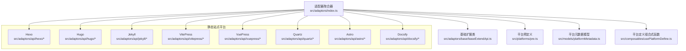
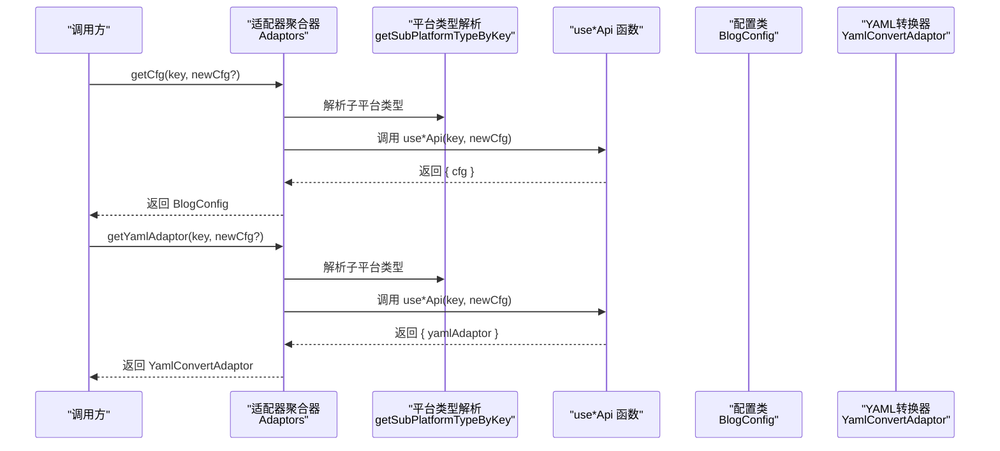
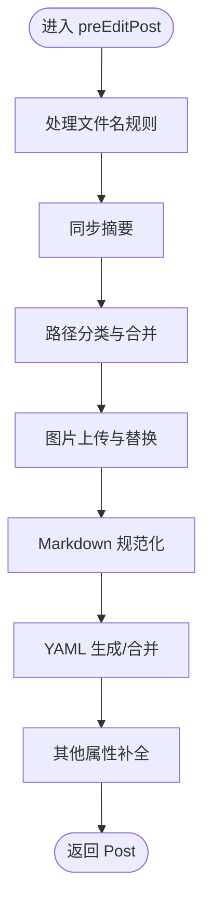
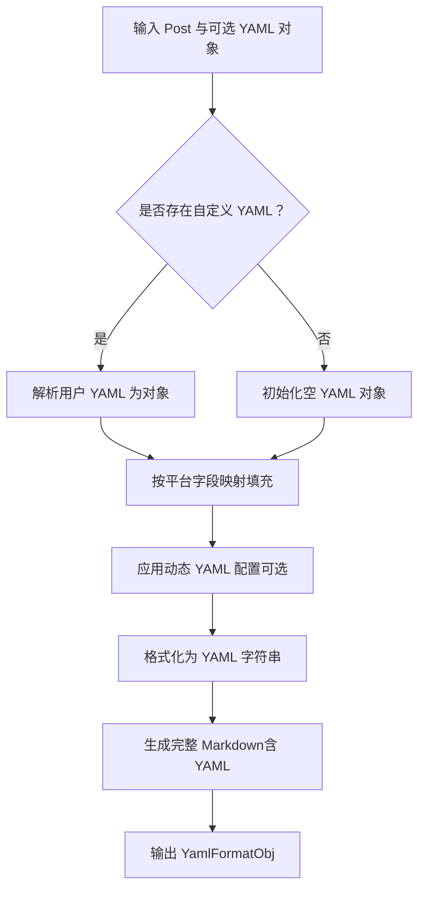
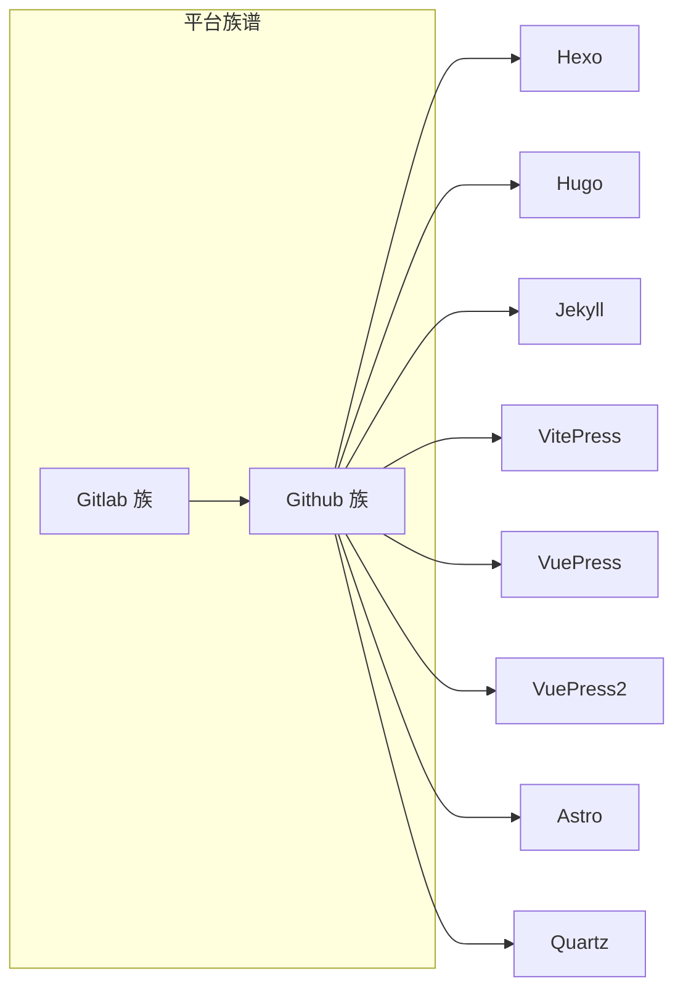

# 静态站点适配器

<cite>
**本文档引用的文件**
- [src/adaptors/index.ts](file://src/adaptors/index.ts)
- [src/adaptors/base/baseExtendApi.ts](file://src/adaptors/base/baseExtendApi.ts)
- [src/platforms/pre.ts](file://src/platforms/pre.ts)
- [src/models/platformMetadata.ts](file://src/models/platformMetadata.ts)
- [src/composables/usePlatformDefine.ts](file://src/composables/usePlatformDefine.ts)
- [src/adaptors/api/hexo/hexoConfig.ts](file://src/adaptors/api/hexo/hexoConfig.ts)
- [src/adaptors/api/hugo/hugoConfig.ts](file://src/adaptors/api/hugo/hugoConfig.ts)
- [src/adaptors/api/jekyll/jekyllConfig.ts](file://src/adaptors/api/jekyll/jekyllConfig.ts)
- [src/adaptors/api/vitepress/vitepressConfig.ts](file://src/adaptors/api/vitepress/vitepressConfig.ts)
- [src/adaptors/api/vuepress/vuepressConfig.ts](file://src/adaptors/api/vuepress/vuepressConfig.ts)
- [src/adaptors/api/quartz/quartzConfig.ts](file://src/adaptors/api/quartz/quartzConfig.ts)
- [src/adaptors/api/astro/astroConfig.ts](file://src/adaptors/api/astro/astroConfig.ts)
- [src/adaptors/api/docsify/docsifyConfig.ts](file://src/adaptors/api/docsify/docsifyConfig.ts)
- [src/adaptors/api/hexo/hexoYamlConverterAdaptor.ts](file://src/adaptors/api/hexo/hexoYamlConverterAdaptor.ts)
- [src/adaptors/api/hugo/hugoYamlConverterAdaptor.ts](file://src/adaptors/api/hugo/hugoYamlConverterAdaptor.ts)
- [src/adaptors/api/jekyll/jekyllYamlConverterAdaptor.ts](file://src/adaptors/api/jekyll/jekyllYamlConverterAdaptor.ts)
- [src/adaptors/api/vitepress/vitepressYamlConverterAdaptor.ts](file://src/adaptors/api/vitepress/vitepressYamlConverterAdaptor.ts)
- [src/adaptors/api/vuepress/vuepressYamlConverterAdaptor.ts](file://src/adaptors/api/vuepress/vuepressYamlConverterAdaptor.ts)
- [src/adaptors/api/quartz/quartzYamlConverterAdaptor.ts](file://src/adaptors/api/quartz/quartzYamlConverterAdaptor.ts)
- [src/adaptors/api/astro/astroYamlConverterAdaptor.ts](file://src/adaptors/api/astro/astroYamlConverterAdaptor.ts)
</cite>

## 目录
1. [简介](#简介)
2. [项目结构](#项目结构)
3. [核心组件](#核心组件)
4. [架构总览](#架构总览)
5. [详细组件分析](#详细组件分析)
6. [依赖关系分析](#依赖关系分析)
7. [性能考量](#性能考量)
8. [故障排查指南](#故障排查指南)
9. [结论](#结论)
10. [附录](#附录)

## 简介
本文件面向“静态站点适配器”模块，系统性梳理并说明各静态网站生成器平台的适配实现，覆盖 Hexo、Hugo、Jekyll、VitePress、VuePress、Quartz、Astro、Docsify 等。文档重点阐述：
- 各平台的构建流程与发布要点
- 配置文件格式与适配器行为
- YAML 转换器的工作机制与最佳实践
- GitHub Pages 与 GitLab Pages 的集成方式与 CI/CD 建议
- 适配器的统一入口与调用方式

## 项目结构
该适配器模块采用“平台维度+适配器维度”的组织方式，按平台类型划分子目录，并在每个平台下提供配置类与 YAML 转换器实现。统一入口通过适配器聚合器对外暴露。

图表来源
- [src/adaptors/index.ts:56-573](file://src/adaptors/index.ts#L56-L573)
- [src/adaptors/base/baseExtendApi.ts:55-739](file://src/adaptors/base/baseExtendApi.ts#L55-L739)
- [src/platforms/pre.ts:101-463](file://src/platforms/pre.ts#L101-L463)
- [src/models/platformMetadata.ts:16-50](file://src/models/platformMetadata.ts#L16-L50)
- [src/composables/usePlatformDefine.ts:18-83](file://src/composables/usePlatformDefine.ts#L18-L83)

章节来源
- [src/adaptors/index.ts:56-573](file://src/adaptors/index.ts#L56-L573)
- [src/platforms/pre.ts:101-463](file://src/platforms/pre.ts#L101-L463)

## 核心组件
- 适配器聚合器：根据平台 key 统一分发到具体平台的配置、适配器与 YAML 转换器实现。
- 基础扩展类：封装通用的发布前处理逻辑（文件名、摘要、分类、图片、YAML、外链替换等），并提供图片上传与代理能力。
- 平台预定义：集中声明各平台类型、子类型与启用状态，便于 UI 展示与动态配置。
- 平台元数据模型：抽象平台标签、分类、模板等元数据结构，支撑平台能力展示。

章节来源
- [src/adaptors/index.ts:65-263](file://src/adaptors/index.ts#L65-L263)
- [src/adaptors/base/baseExtendApi.ts:90-456](file://src/adaptors/base/baseExtendApi.ts#L90-L456)
- [src/platforms/pre.ts:101-463](file://src/platforms/pre.ts#L101-L463)
- [src/models/platformMetadata.ts:16-50](file://src/models/platformMetadata.ts#L16-L50)

## 架构总览
适配器统一入口负责：
- 按平台 key 解析子平台类型
- 返回对应的配置对象、博客适配器与 YAML 转换器
- 支持 GitHub 与 GitLab 的多平台族谱

图表来源
- [src/adaptors/index.ts:65-263](file://src/adaptors/index.ts#L65-L263)
- [src/adaptors/index.ts:475-569](file://src/adaptors/index.ts#L475-L569)

## 详细组件分析

### 适配器统一入口（Adaptors）
- 提供 getCfg/getAdaptor/getYamlAdaptor 三类方法，按子平台类型分派到具体 use*Api 实现。
- 支持 GitHub 与 GitLab 的 Hexo/Hugo/Jekyll/Vuepress/Vitepress/Astro 等平台族谱。
- 默认返回空配置或 null YAML 适配器，便于上层容错。

章节来源
- [src/adaptors/index.ts:65-263](file://src/adaptors/index.ts#L65-L263)
- [src/adaptors/index.ts:475-569](file://src/adaptors/index.ts#L475-L569)

### 基础扩展类（BaseExtendApi）
- 发布前处理：文件名规则、摘要同步、分类路径映射、图片上传与替换、Markdown 规范化、YAML 生成与合并、外链替换。
- 图片处理：支持外部环境代理与内置内核请求；支持平台自带上传与宏替换（如 Confluence）。
- 外链替换：基于发布配置与设置，将思源笔记块引用替换为平台预览链接，支持文件名/别名规则。
- YAML 处理：根据策略选择自动生成或保留用户自定义 YAML，并同步 HTML/Mardown 内容。

图表来源
- [src/adaptors/base/baseExtendApi.ts:90-456](file://src/adaptors/base/baseExtendApi.ts#L90-L456)

章节来源
- [src/adaptors/base/baseExtendApi.ts:90-456](file://src/adaptors/base/baseExtendApi.ts#L90-L456)

### 平台预定义与元数据
- 平台类型与子类型：涵盖 Common、Github、Gitlab、Metaweblog、Wordpress、Custom、Fs、System 等。
- 预定义平台清单：包含 Hexo、Hugo、Jekyll、VitePress、VuePress、VuePress2、Astro、Quartz、Docsify 等。
- 平台元数据：标签、分类、模板等，用于 UI 展示与能力提示。

章节来源
- [src/platforms/pre.ts:101-463](file://src/platforms/pre.ts#L101-L463)
- [src/models/platformMetadata.ts:16-50](file://src/models/platformMetadata.ts#L16-L50)
- [src/composables/usePlatformDefine.ts:18-83](file://src/composables/usePlatformDefine.ts#L18-L83)

### 静态站点平台配置与特性

#### Hexo
- 配置要点
  - 默认发布路径：source/_posts
  - 文件名规则：[filename].md
  - 图片存储与链接：source/images
  - 分类/标签：启用；多分类
  - 知识空间：树形单选，不支持修改发布目录
- YAML 转换器
  - 生成标准 Front Matter 字段（title/date/updated/excerpt/tags/categories/permalink 等）
  - 支持动态 YAML 配置合并

章节来源
- [src/adaptors/api/hexo/hexoConfig.ts:19-48](file://src/adaptors/api/hexo/hexoConfig.ts#L19-L48)
- [src/adaptors/api/hexo/hexoYamlConverterAdaptor.ts:26-119](file://src/adaptors/api/hexo/hexoYamlConverterAdaptor.ts#L26-L119)

#### Hugo
- 配置要点
  - 默认发布路径：content/post
  - 文件名规则：[slug].md
  - 图片存储与链接：static/images → images
  - 分类/标签：启用；多分类
  - 知识空间：树形单选，不支持修改发布目录
- YAML 转换器
  - 生成 date/lastmod/tags/categories/keywords/description 等字段
  - 支持动态 YAML 配置

章节来源
- [src/adaptors/api/hugo/hugoConfig.ts:19-48](file://src/adaptors/api/hugo/hugoConfig.ts#L19-L48)
- [src/adaptors/api/hugo/hugoYamlConverterAdaptor.ts:25-123](file://src/adaptors/api/hugo/hugoYamlConverterAdaptor.ts#L25-L123)

#### Jekyll
- 配置要点
  - 默认发布路径：_posts
  - 文件名规则：[yyyy]-[mm]-[dd]-[slug].md
  - 图片存储与链接：assets/images
  - 分类/标签：启用；多分类
  - 知识空间：树形单选，不支持修改发布目录
- YAML 转换器
  - 生成 date/permalink/tagline/tags/categories/layout/published 等字段
  - 支持动态 YAML 配置

章节来源
- [src/adaptors/api/jekyll/jekyllConfig.ts:19-49](file://src/adaptors/api/jekyll/jekyllConfig.ts#L19-L49)
- [src/adaptors/api/jekyll/jekyllYamlConverterAdaptor.ts:26-110](file://src/adaptors/api/jekyll/jekyllYamlConverterAdaptor.ts#L26-L110)

#### VitePress
- 配置要点
  - 默认发布路径：docs
  - 文件名规则：[slug].md
  - 图片存储与链接：[docpath]/images → ./images
  - 分类/标签：启用；多分类
  - 知识空间：树形单选，不支持修改发布目录
- YAML 转换器
  - 生成 title/description/date/head/categories 等字段
  - 支持动态 YAML 配置（outline/sidebar/prev/next）

章节来源
- [src/adaptors/api/vitepress/vitepressConfig.ts:19-48](file://src/adaptors/api/vitepress/vitepressConfig.ts#L19-L48)
- [src/adaptors/api/vitepress/vitepressYamlConverterAdaptor.ts:25-96](file://src/adaptors/api/vitepress/vitepressYamlConverterAdaptor.ts#L25-L96)

#### VuePress
- 配置要点
  - 默认发布路径：docs
  - 文件名规则：[filename].md
  - 图片存储与链接：docs/.vuepress/public/images → images
  - 分类/标签：启用；多分类
  - 知识空间：树形单选，不支持修改发布目录
- YAML 转换器
  - 生成 title/date/meta/tags/categories/permalink/author 等字段
  - 支持动态 YAML 配置

章节来源
- [src/adaptors/api/vuepress/vuepressConfig.ts:19-48](file://src/adaptors/api/vuepress/vuepressConfig.ts#L19-L48)
- [src/adaptors/api/vuepress/vuepressYamlConverterAdaptor.ts:26-148](file://src/adaptors/api/vuepress/vuepressYamlConverterAdaptor.ts#L26-L148)

#### Quartz
- 配置要点
  - 默认发布路径：content
  - 文件名规则：[filename].md
  - 图片存储与链接：assets/images
  - 分类/标签：启用；多分类
  - 知识空间：树形单选，支持修改发布目录（移动文章）
- YAML 转换器
  - 生成 title/date/updated/description/tags/categories/permalink 等字段
  - 支持动态 YAML 配置

章节来源
- [src/adaptors/api/quartz/quartzConfig.ts:19-49](file://src/adaptors/api/quartz/quartzConfig.ts#L19-L49)
- [src/adaptors/api/quartz/quartzYamlConverterAdaptor.ts:26-114](file://src/adaptors/api/quartz/quartzYamlConverterAdaptor.ts#L26-L114)

#### Astro
- 配置要点
  - 默认发布路径：src/content/blog
  - 文件名规则：[slug].md
  - 图片存储与链接：public/images → /images
  - 分类/标签：启用；多分类
  - 知识空间：树形单选，不支持修改发布目录
  - 图片上传：平台自带上传（Bundled）
- YAML 转换器
  - 生成 title/description/pubDate/tags/categories/keywords 等字段
  - 支持动态 YAML 配置

章节来源
- [src/adaptors/api/astro/astroConfig.ts:19-50](file://src/adaptors/api/astro/astroConfig.ts#L19-L50)
- [src/adaptors/api/astro/astroYamlConverterAdaptor.ts:25-99](file://src/adaptors/api/astro/astroYamlConverterAdaptor.ts#L25-L99)

#### Docsify
- 配置要点
  - 默认发布路径：由仓库结构决定
  - 文件名规则：可自定义
  - 图片存储与链接：可自定义
  - 分类/标签：启用；多分类
  - 知识空间：树形单选，不支持修改发布目录

章节来源
- [src/adaptors/api/docsify/docsifyConfig.ts:16-39](file://src/adaptors/api/docsify/docsifyConfig.ts#L16-L39)

### YAML 转换器工作流
YAML 转换器负责将 Post 对象与平台约定的 Front Matter 字段相互转换，并支持动态 YAML 配置合并。

图表来源
- [src/adaptors/api/hexo/hexoYamlConverterAdaptor.ts:26-119](file://src/adaptors/api/hexo/hexoYamlConverterAdaptor.ts#L26-L119)
- [src/adaptors/api/hugo/hugoYamlConverterAdaptor.ts:25-123](file://src/adaptors/api/hugo/hugoYamlConverterAdaptor.ts#L25-L123)
- [src/adaptors/api/jekyll/jekyllYamlConverterAdaptor.ts:26-110](file://src/adaptors/api/jekyll/jekyllYamlConverterAdaptor.ts#L26-L110)
- [src/adaptors/api/vitepress/vitepressYamlConverterAdaptor.ts:25-96](file://src/adaptors/api/vitepress/vitepressYamlConverterAdaptor.ts#L25-L96)
- [src/adaptors/api/vuepress/vuepressYamlConverterAdaptor.ts:26-148](file://src/adaptors/api/vuepress/vuepressYamlConverterAdaptor.ts#L26-L148)
- [src/adaptors/api/quartz/quartzYamlConverterAdaptor.ts:26-114](file://src/adaptors/api/quartz/quartzYamlConverterAdaptor.ts#L26-L114)
- [src/adaptors/api/astro/astroYamlConverterAdaptor.ts:25-99](file://src/adaptors/api/astro/astroYamlConverterAdaptor.ts#L25-L99)

章节来源
- [src/adaptors/api/hexo/hexoYamlConverterAdaptor.ts:26-119](file://src/adaptors/api/hexo/hexoYamlConverterAdaptor.ts#L26-L119)
- [src/adaptors/api/hugo/hugoYamlConverterAdaptor.ts:25-123](file://src/adaptors/api/hugo/hugoYamlConverterAdaptor.ts#L25-L123)
- [src/adaptors/api/jekyll/jekyllYamlConverterAdaptor.ts:26-110](file://src/adaptors/api/jekyll/jekyllYamlConverterAdaptor.ts#L26-L110)
- [src/adaptors/api/vitepress/vitepressYamlConverterAdaptor.ts:25-96](file://src/adaptors/api/vitepress/vitepressYamlConverterAdaptor.ts#L25-L96)
- [src/adaptors/api/vuepress/vuepressYamlConverterAdaptor.ts:26-148](file://src/adaptors/api/vuepress/vuepressYamlConverterAdaptor.ts#L26-L148)
- [src/adaptors/api/quartz/quartzYamlConverterAdaptor.ts:26-114](file://src/adaptors/api/quartz/quartzYamlConverterAdaptor.ts#L26-L114)
- [src/adaptors/api/astro/astroYamlConverterAdaptor.ts:25-99](file://src/adaptors/api/astro/astroYamlConverterAdaptor.ts#L25-L99)

## 依赖关系分析
- 平台族谱
  - Github 族：Hexo、Hugo、Jekyll、VitePress、VuePress、VuePress2、Astro、Quartz
  - Gitlab 族：Gitlabhexo、Gitlabhugo、Gitlabjekyll、Gitlabvuepress、Gitlabvuepress2、Gitlabvitepress、Gitlabastro
- 统一入口依赖子平台类型枚举与 use*Api 导出
- 基础扩展类依赖 zhi-blog-api 的接口与工具库

图表来源
- [src/adaptors/index.ts:95-169](file://src/adaptors/index.ts#L95-L169)

章节来源
- [src/adaptors/index.ts:95-169](file://src/adaptors/index.ts#L95-L169)

## 性能考量
- 图片上传：优先使用平台自带上传以减少跨域与代理开销；在外部环境可通过代理直传，避免大文件多次下载。
- YAML 生成：尽量复用已有 YAML 对象，仅在必要时重建，减少序列化与字符串拼接成本。
- 外链替换：对正则匹配与替换进行去重与批量处理，避免重复计算。
- 分类与标签：使用集合去重与一次性合并，降低后续渲染压力。

## 故障排查指南
- 图片上传失败
  - 检查图床服务类型与网络代理配置
  - 查看平台宏替换与链接替换逻辑是否正确
- 外链引用未发布
  - 若未发布被引用的文档，将抛出错误；可在偏好中配置忽略块链接
- YAML 合并异常
  - 确认用户自定义 YAML 是否合法；若为源码模式，将直接写入而不强制转换
- 预览链接不正确
  - 检查平台的 previewUrl/previewPostUrl 与 mdFilenameRule 配置

章节来源
- [src/adaptors/base/baseExtendApi.ts:535-551](file://src/adaptors/base/baseExtendApi.ts#L535-L551)
- [src/adaptors/base/baseExtendApi.ts:684-689](file://src/adaptors/base/baseExtendApi.ts#L684-L689)
- [src/adaptors/base/baseExtendApi.ts:366-415](file://src/adaptors/base/baseExtendApi.ts#L366-L415)

## 结论
该适配器模块通过统一入口与基础扩展类，实现了对多种静态站点平台的一致化接入。各平台的配置类与 YAML 转换器遵循统一的字段映射与动态配置机制，既保证了平台特性，又提升了可维护性与扩展性。结合平台预定义与元数据模型，能够为上层 UI 与发布流程提供稳定的能力支撑。

## 附录

### GitHub Pages 与 GitLab Pages 集成建议
- 分支管理
  - GitHub Pages：通常使用主分支的根目录或 docs 目录
  - GitLab Pages：通常使用主分支的根目录或特定目录
- 自动部署
  - 使用 CI/CD 流水线触发构建与部署
  - 构建步骤：安装依赖、执行静态站点生成命令、上传构建产物
  - 部署步骤：将生成产物推送到 Pages 分支或目录
- 适配器注意事项
  - 确保平台配置中的默认路径与 Pages 目录一致
  - 如需自定义预览链接，调整 previewUrl/previewPostUrl 与 mdFilenameRule

### YAML 配置转换器使用与最佳实践
- 自动生成策略
  - 使用 convertToYaml 生成符合平台约定的 Front Matter
  - 动态 YAML 配置通过 dynYamlCfg 注入，避免硬编码
- 保留用户自定义
  - 用户自定义 YAML 将被解析并合并，确保字段一致性
  - 源码模式下直接写入，不强制转换
- 字段映射
  - 标题、日期、摘要、标签、分类、永久链接等字段需按平台规范映射
  - SEO 相关字段（如 keywords/description）应按平台要求设置

章节来源
- [src/adaptors/api/hexo/hexoYamlConverterAdaptor.ts:26-119](file://src/adaptors/api/hexo/hexoYamlConverterAdaptor.ts#L26-L119)
- [src/adaptors/api/hugo/hugoYamlConverterAdaptor.ts:25-123](file://src/adaptors/api/hugo/hugoYamlConverterAdaptor.ts#L25-L123)
- [src/adaptors/api/jekyll/jekyllYamlConverterAdaptor.ts:26-110](file://src/adaptors/api/jekyll/jekyllYamlConverterAdaptor.ts#L26-L110)
- [src/adaptors/api/vitepress/vitepressYamlConverterAdaptor.ts:25-96](file://src/adaptors/api/vitepress/vitepressYamlConverterAdaptor.ts#L25-L96)
- [src/adaptors/api/vuepress/vuepressYamlConverterAdaptor.ts:26-148](file://src/adaptors/api/vuepress/vuepressYamlConverterAdaptor.ts#L26-L148)
- [src/adaptors/api/quartz/quartzYamlConverterAdaptor.ts:26-114](file://src/adaptors/api/quartz/quartzYamlConverterAdaptor.ts#L26-L114)
- [src/adaptors/api/astro/astroYamlConverterAdaptor.ts:25-99](file://src/adaptors/api/astro/astroYamlConverterAdaptor.ts#L25-L99)