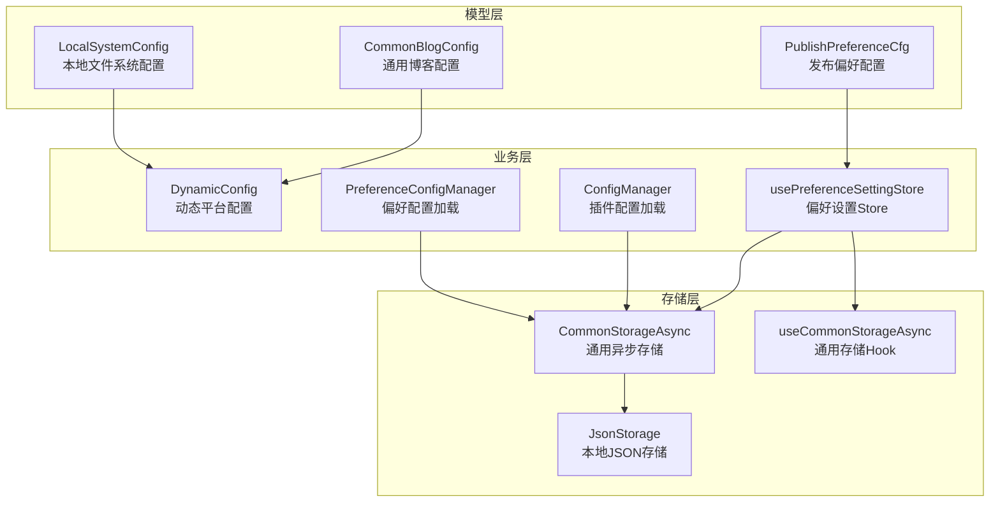
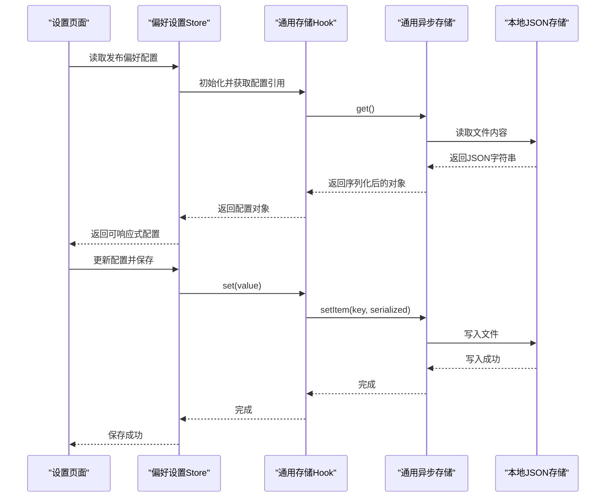
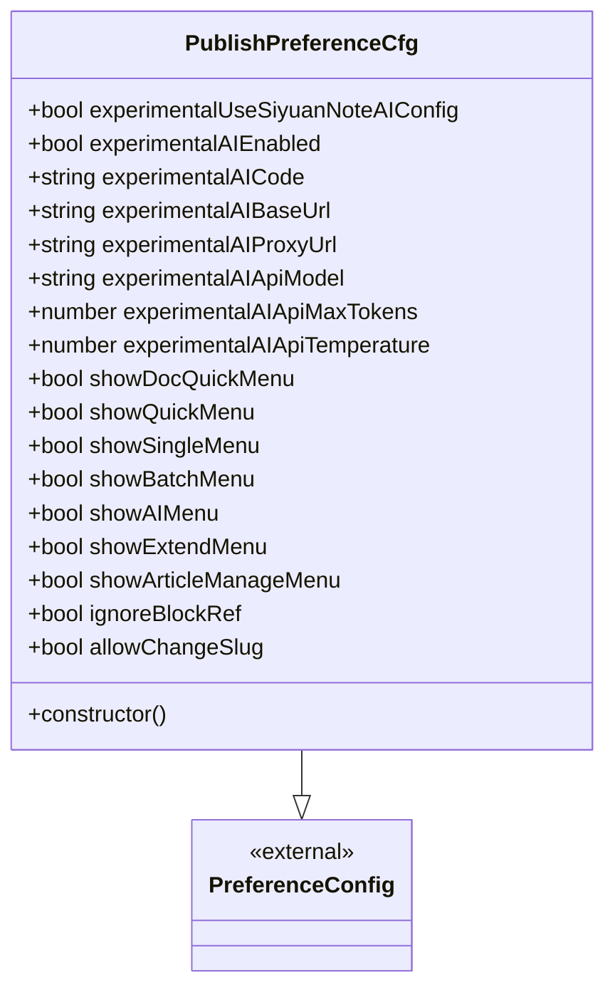
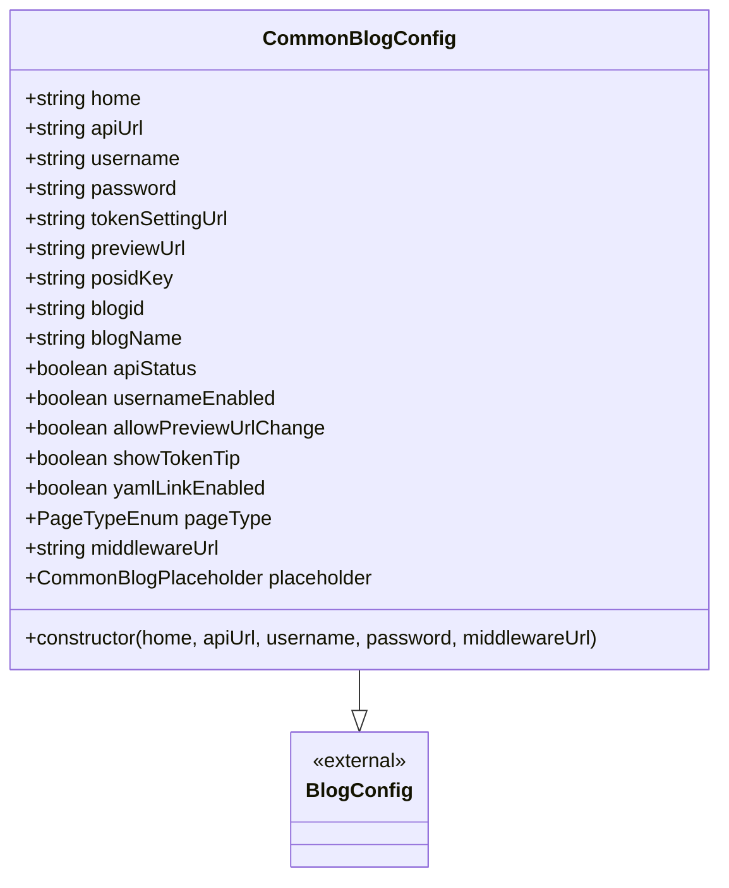
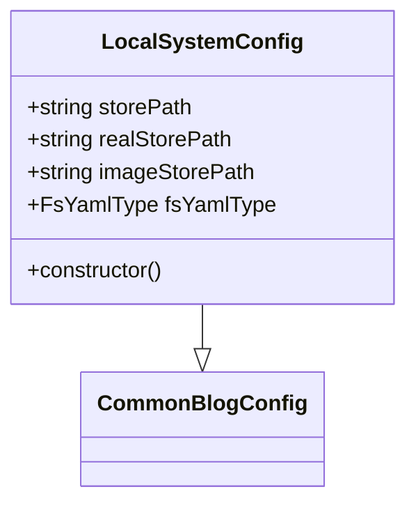
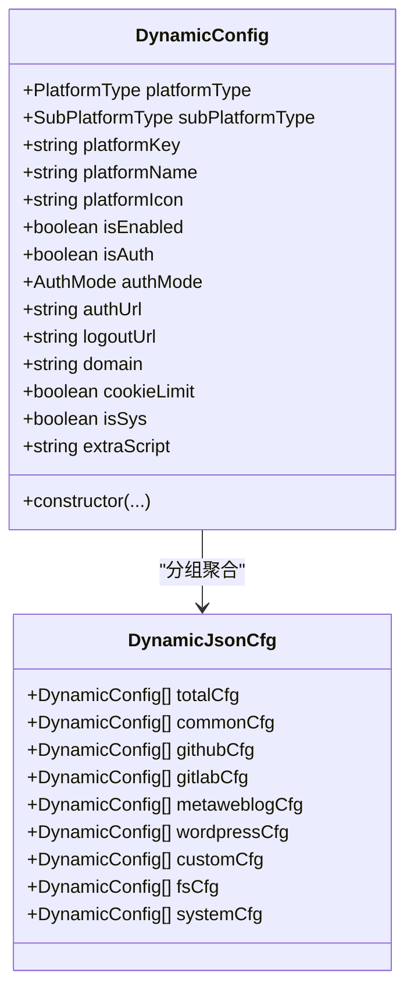
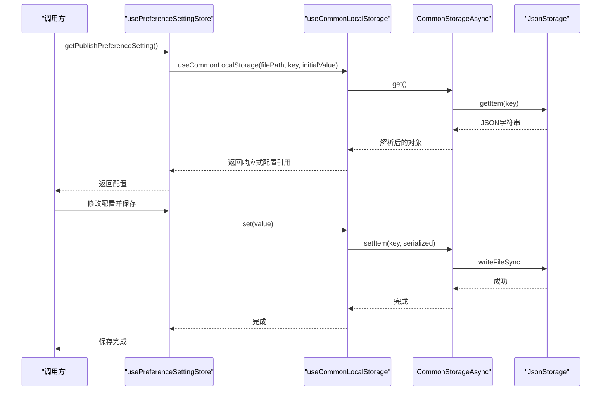
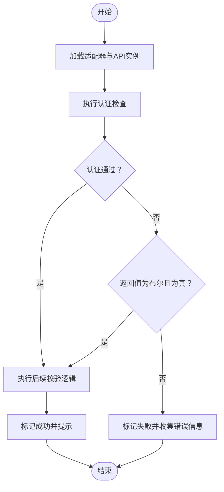
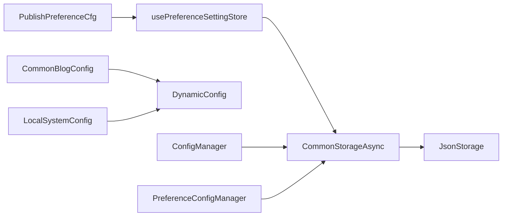

# 配置API

<cite>
**本文引用的文件**
- [config.ts](file://siyuan/store/config.ts)
- [preferenceConfigManager.ts](file://siyuan/store/preferenceConfigManager.ts)
- [dynamicConfig.ts](file://src/platforms/dynamicConfig.ts)
- [usePreferenceSettingStore.ts](file://src/stores/usePreferenceSettingStore.ts)
- [commonStorageAsync.ts](file://src/stores/common/commonStorageAsync.ts)
- [jsonStorage.ts](file://src/stores/common/jsonStorage.ts)
- [useCommonStorageAsync.ts](file://src/stores/common/useCommonStorageAsync.ts)
- [publishPreferenceCfg.ts](file://src/models/publishPreferenceCfg.ts)
- [commonBlogConfig.ts](file://src/adaptors/api/base/commonBlogConfig.ts)
- [LocalSystemConfig.ts](file://src/adaptors/fs/LocalSystem/LocalSystemConfig.ts)
- [CommonBlogSetting.vue](file://src/components/set/publish/singleplatform/base/CommonBlogSetting.vue)
- [baseWebApi.ts](file://src/adaptors/web/base/baseWebApi.ts)
</cite>

## 目录
1. [简介](#简介)
2. [项目结构](#项目结构)
3. [核心组件](#核心组件)
4. [架构总览](#架构总览)
5. [详细组件分析](#详细组件分析)
6. [依赖关系分析](#依赖关系分析)
7. [性能考量](#性能考量)
8. [故障排查指南](#故障排查指南)
9. [结论](#结论)
10. [附录](#附录)

## 简介
本文件面向“配置API”的设计与实现，覆盖以下主题：
- 动态配置加载与持久化
- 配置验证流程（以博客类平台为例）
- 配置存储与迁移策略
- 配置生命周期、优先级与缓存策略
- 配置文件格式、配置项说明与默认值
- 热更新机制、版本兼容性与迁移策略

目标是帮助开发者与维护者快速理解配置系统的结构、行为与扩展点。

## 项目结构
配置相关能力由“模型层”“存储层”“业务层”三部分协同完成：
- 模型层：定义配置数据结构与默认值（如发布偏好、平台基础配置等）
- 存储层：抽象统一的异步存储接口，支持在不同运行环境（浏览器/思源笔记）下切换实现
- 业务层：负责配置加载、验证、持久化与动态配置管理

图表来源
- [publishPreferenceCfg.ts:1-101](file://src/models/publishPreferenceCfg.ts#L1-L101)
- [commonBlogConfig.ts:1-42](file://src/adaptors/api/base/commonBlogConfig.ts#L1-L42)
- [LocalSystemConfig.ts:1-45](file://src/adaptors/fs/LocalSystem/LocalSystemConfig.ts#L1-L45)
- [commonStorageAsync.ts:1-117](file://src/stores/common/commonStorageAsync.ts#L1-L117)
- [jsonStorage.ts:1-110](file://src/stores/common/jsonStorage.ts#L1-L110)
- [useCommonStorageAsync.ts:43-84](file://src/stores/common/useCommonStorageAsync.ts#L43-L84)
- [dynamicConfig.ts:1-534](file://src/platforms/dynamicConfig.ts#L1-L534)
- [usePreferenceSettingStore.ts:1-90](file://src/stores/usePreferenceSettingStore.ts#L1-L90)
- [config.ts:1-47](file://siyuan/store/config.ts#L1-L47)
- [preferenceConfigManager.ts:1-52](file://siyuan/store/preferenceConfigManager.ts#L1-L52)

章节来源
- [publishPreferenceCfg.ts:1-101](file://src/models/publishPreferenceCfg.ts#L1-L101)
- [commonBlogConfig.ts:1-42](file://src/adaptors/api/base/commonBlogConfig.ts#L1-L42)
- [LocalSystemConfig.ts:1-45](file://src/adaptors/fs/LocalSystem/LocalSystemConfig.ts#L1-L45)
- [commonStorageAsync.ts:1-117](file://src/stores/common/commonStorageAsync.ts#L1-L117)
- [jsonStorage.ts:1-110](file://src/stores/common/jsonStorage.ts#L1-L110)
- [useCommonStorageAsync.ts:43-84](file://src/stores/common/useCommonStorageAsync.ts#L43-L84)
- [dynamicConfig.ts:1-534](file://src/platforms/dynamicConfig.ts#L1-L534)
- [usePreferenceSettingStore.ts:1-90](file://src/stores/usePreferenceSettingStore.ts#L1-L90)
- [config.ts:1-47](file://siyuan/store/config.ts#L1-L47)
- [preferenceConfigManager.ts:1-52](file://siyuan/store/preferenceConfigManager.ts#L1-L52)

## 核心组件
- 发布偏好配置模型与默认值：定义发布偏好、AI相关开关与界面菜单显示控制等字段及默认值
- 通用博客配置基类：统一博客类平台的基础配置字段与行为
- 本地文件系统配置：针对文件系统输出场景的路径、YAML类型等配置
- 动态平台配置：描述平台类型、子类型、授权模式、启用状态等，并提供平台键生成与查找工具
- 偏好设置Store：封装发布偏好配置的读写、默认值填充与与思源笔记AI配置的联动
- 通用异步存储：抽象跨环境的异步存储接口，支持在浏览器或思源笔记内核中切换实现
- JSON本地存储：基于文件系统实现的本地JSON存储，确保目录与文件存在性
- 通用存储Hook：对通用异步存储进行封装，提供初始值回填与序列化策略
- 插件配置加载：从内核文件系统加载插件配置
- 偏好配置加载：从内核文件系统加载偏好配置并提取目标键值

章节来源
- [publishPreferenceCfg.ts:19-98](file://src/models/publishPreferenceCfg.ts#L19-L98)
- [commonBlogConfig.ts:13-41](file://src/adaptors/api/base/commonBlogConfig.ts#L13-L41)
- [LocalSystemConfig.ts:22-41](file://src/adaptors/fs/LocalSystem/LocalSystemConfig.ts#L22-L41)
- [dynamicConfig.ts:13-113](file://src/platforms/dynamicConfig.ts#L13-L113)
- [usePreferenceSettingStore.ts:21-87](file://src/stores/usePreferenceSettingStore.ts#L21-L87)
- [commonStorageAsync.ts:24-114](file://src/stores/common/commonStorageAsync.ts#L24-L114)
- [jsonStorage.ts:23-107](file://src/stores/common/jsonStorage.ts#L23-L107)
- [useCommonStorageAsync.ts:43-84](file://src/stores/common/useCommonStorageAsync.ts#L43-L84)
- [config.ts:33-45](file://siyuan/store/config.ts#L33-L45)
- [preferenceConfigManager.ts:33-50](file://siyuan/store/preferenceConfigManager.ts#L33-L50)

## 架构总览
配置API围绕“模型-存储-业务”三层协作，形成可扩展、可迁移、可验证的配置体系。

图表来源
- [usePreferenceSettingStore.ts:34-67](file://src/stores/usePreferenceSettingStore.ts#L34-L67)
- [useCommonStorageAsync.ts:45-61](file://src/stores/common/useCommonStorageAsync.ts#L45-L61)
- [commonStorageAsync.ts:51-113](file://src/stores/common/commonStorageAsync.ts#L51-L113)
- [jsonStorage.ts:59-101](file://src/stores/common/jsonStorage.ts#L59-L101)

## 详细组件分析

### 发布偏好配置模型与默认值
- 数据模型：继承自通用偏好配置，新增实验性AI配置字段与界面菜单显示控制字段
- 默认值：构造函数中设定各字段默认值，保证首次使用时具备合理行为
- 与思源笔记联动：当检测到思源笔记AI配置可用时，自动注入相关字段

图表来源
- [publishPreferenceCfg.ts:19-98](file://src/models/publishPreferenceCfg.ts#L19-L98)

章节来源
- [publishPreferenceCfg.ts:19-98](file://src/models/publishPreferenceCfg.ts#L19-L98)

### 通用博客配置基类
- 字段覆盖：提供占位符、页面类型、预览URL、令牌设置URL等字段的默认值
- 行为约定：统一博客类平台的配置行为，便于后续适配器复用

图表来源
- [commonBlogConfig.ts:13-41](file://src/adaptors/api/base/commonBlogConfig.ts#L13-L41)

章节来源
- [commonBlogConfig.ts:13-41](file://src/adaptors/api/base/commonBlogConfig.ts#L13-L41)

### 本地文件系统配置
- 场景定制：针对本地文件系统输出，提供存储路径、真实路径、图片存储路径与YAML类型等字段
- 默认策略：默认使用用户主目录下的下载文件夹作为存储根路径

图表来源
- [LocalSystemConfig.ts:22-41](file://src/adaptors/fs/LocalSystem/LocalSystemConfig.ts#L22-L41)

章节来源
- [LocalSystemConfig.ts:22-41](file://src/adaptors/fs/LocalSystem/LocalSystemConfig.ts#L22-L41)

### 动态平台配置
- 平台类型与子类型：定义通用平台、GitHub/GitLab生态、Metaweblog、WordPress、自定义平台、文件系统、系统平台等类型与子类型
- 授权模式：支持API与WEBSITE两种授权模式
- 工具方法：提供平台键生成、去重检测、按键查找、替换、删除、YAML键生成等工具函数

图表来源
- [dynamicConfig.ts:13-113](file://src/platforms/dynamicConfig.ts#L13-L113)
- [dynamicConfig.ts:243-253](file://src/platforms/dynamicConfig.ts#L243-L253)

章节来源
- [dynamicConfig.ts:13-113](file://src/platforms/dynamicConfig.ts#L13-L113)
- [dynamicConfig.ts:255-392](file://src/platforms/dynamicConfig.ts#L255-L392)
- [dynamicConfig.ts:397-534](file://src/platforms/dynamicConfig.ts#L397-L534)

### 偏好设置Store与通用存储
- Store职责：提供发布偏好配置的读写、默认值填充、与思源笔记AI配置联动
- 存储策略：通过通用存储Hook与通用异步存储实现跨环境一致的读写行为
- 缓存策略：首次读取为空时回填初始值并持久化，避免重复初始化

图表来源
- [usePreferenceSettingStore.ts:34-67](file://src/stores/usePreferenceSettingStore.ts#L34-L67)
- [useCommonStorageAsync.ts:45-61](file://src/stores/common/useCommonStorageAsync.ts#L45-L61)
- [commonStorageAsync.ts:51-113](file://src/stores/common/commonStorageAsync.ts#L51-L113)
- [jsonStorage.ts:59-101](file://src/stores/common/jsonStorage.ts#L59-L101)

章节来源
- [usePreferenceSettingStore.ts:21-87](file://src/stores/usePreferenceSettingStore.ts#L21-L87)
- [useCommonStorageAsync.ts:43-84](file://src/stores/common/useCommonStorageAsync.ts#L43-L84)
- [commonStorageAsync.ts:24-114](file://src/stores/common/commonStorageAsync.ts#L24-L114)
- [jsonStorage.ts:23-107](file://src/stores/common/jsonStorage.ts#L23-L107)

### 配置验证流程（以博客类平台为例）
- 验证步骤：通过适配器获取API实例，执行认证检查，再执行后续校验逻辑
- 错误处理：捕获异常并根据布尔返回值区分“需要修正”与“直接失败”，最终给出用户提示

图表来源
- [CommonBlogSetting.vue:116-161](file://src/components/set/publish/singleplatform/base/CommonBlogSetting.vue#L116-L161)

章节来源
- [CommonBlogSetting.vue:116-161](file://src/components/set/publish/singleplatform/base/CommonBlogSetting.vue#L116-L161)

### 配置存储与迁移策略
- 存储介质：在思源笔记环境中通过内核API读写文本文件；在浏览器环境中通过localStorage
- 迁移策略：当键空间变化或字段结构调整时，可通过读取旧键并映射到新结构，再写回新键，实现平滑迁移
- 版本兼容：建议在配置对象中加入版本号字段，读取时判断版本并执行相应迁移函数

章节来源
- [commonStorageAsync.ts:30-43](file://src/stores/common/commonStorageAsync.ts#L30-L43)
- [commonStorageAsync.ts:51-113](file://src/stores/common/commonStorageAsync.ts#L51-L113)
- [jsonStorage.ts:29-51](file://src/stores/common/jsonStorage.ts#L29-L51)

## 依赖关系分析
- 模型层依赖外部库（如通用博客配置），通过继承实现扩展
- 存储层依赖运行环境探测（是否在思源笔记内），动态选择实现
- 业务层依赖存储层提供的统一接口，屏蔽环境差异
- 配置验证依赖适配器层提供的API实例

图表来源
- [publishPreferenceCfg.ts:19-98](file://src/models/publishPreferenceCfg.ts#L19-L98)
- [commonBlogConfig.ts:13-41](file://src/adaptors/api/base/commonBlogConfig.ts#L13-L41)
- [LocalSystemConfig.ts:22-41](file://src/adaptors/fs/LocalSystem/LocalSystemConfig.ts#L22-L41)
- [dynamicConfig.ts:13-113](file://src/platforms/dynamicConfig.ts#L13-L113)
- [usePreferenceSettingStore.ts:34-67](file://src/stores/usePreferenceSettingStore.ts#L34-L67)
- [commonStorageAsync.ts:24-114](file://src/stores/common/commonStorageAsync.ts#L24-L114)
- [jsonStorage.ts:23-107](file://src/stores/common/jsonStorage.ts#L23-L107)
- [config.ts:33-45](file://siyuan/store/config.ts#L33-L45)
- [preferenceConfigManager.ts:33-50](file://siyuan/store/preferenceConfigManager.ts#L33-L50)

章节来源
- [publishPreferenceCfg.ts:19-98](file://src/models/publishPreferenceCfg.ts#L19-L98)
- [commonBlogConfig.ts:13-41](file://src/adaptors/api/base/commonBlogConfig.ts#L13-L41)
- [LocalSystemConfig.ts:22-41](file://src/adaptors/fs/LocalSystem/LocalSystemConfig.ts#L22-L41)
- [dynamicConfig.ts:13-113](file://src/platforms/dynamicConfig.ts#L13-L113)
- [usePreferenceSettingStore.ts:21-87](file://src/stores/usePreferenceSettingStore.ts#L21-L87)
- [commonStorageAsync.ts:24-114](file://src/stores/common/commonStorageAsync.ts#L24-L114)
- [jsonStorage.ts:23-107](file://src/stores/common/jsonStorage.ts#L23-L107)
- [config.ts:33-45](file://siyuan/store/config.ts#L33-L45)
- [preferenceConfigManager.ts:33-50](file://siyuan/store/preferenceConfigManager.ts#L33-L50)

## 性能考量
- 读写开销：文件系统读写相比内存读写更慢，建议在频繁访问的场景下引入轻量缓存
- 序列化成本：大体量配置对象的序列化/反序列化会带来CPU开销，建议分模块拆分存储
- 网络/内核调用：在思源笔记环境中，内核API调用需考虑线程阻塞风险，尽量批量操作或异步化

## 故障排查指南
- 配置读取为空：通用存储Hook会在空值时回填初始值并持久化，若未生效，检查存储键与序列化策略
- 浏览器/内核环境差异：确认运行环境探测逻辑，确保在浏览器中使用localStorage而非内核API
- 配置验证失败：查看验证流程中的异常分支，区分“需要修正”与“直接失败”的提示信息
- 文件系统权限：本地JSON存储需确保目录存在且具备写权限

章节来源
- [useCommonStorageAsync.ts:45-61](file://src/stores/common/useCommonStorageAsync.ts#L45-L61)
- [commonStorageAsync.ts:51-113](file://src/stores/common/commonStorageAsync.ts#L51-L113)
- [CommonBlogSetting.vue:116-161](file://src/components/set/publish/singleplatform/base/CommonBlogSetting.vue#L116-L161)
- [jsonStorage.ts:42-50](file://src/stores/common/jsonStorage.ts#L42-L50)

## 结论
本配置API通过清晰的分层设计与跨环境适配，提供了稳定、可扩展的配置管理能力。结合默认值填充、环境探测与验证流程，能够满足多平台、多场景的配置需求。建议在后续版本中引入版本号与迁移框架，进一步增强向后兼容性与可维护性。

## 附录

### 配置文件格式与默认值
- 文件位置
  - 发布偏好配置：storage/syp/publish-preference-cfg.json
  - 插件配置：/data/storage/syp/sy-p-plus-cfg.json
  - 偏好配置：/data/storage/syp/publish-preference-cfg.json
- 默认值
  - 发布偏好：构造函数中设定各字段默认值
  - 通用博客：页面类型、预览URL、令牌设置URL等字段提供默认值
  - 本地文件系统：存储路径默认为主目录下载文件夹

章节来源
- [usePreferenceSettingStore.ts:23-38](file://src/stores/usePreferenceSettingStore.ts#L23-L38)
- [config.ts:34-45](file://siyuan/store/config.ts#L34-L45)
- [preferenceConfigManager.ts:34-50](file://siyuan/store/preferenceConfigManager.ts#L34-L50)
- [publishPreferenceCfg.ts:81-97](file://src/models/publishPreferenceCfg.ts#L81-L97)
- [commonBlogConfig.ts:19-40](file://src/adaptors/api/base/commonBlogConfig.ts#L19-L40)
- [LocalSystemConfig.ts:29-41](file://src/adaptors/fs/LocalSystem/LocalSystemConfig.ts#L29-L41)

### 配置生命周期与优先级
- 生命周期
  - 初始化：读取配置，若为空则回填初始值并持久化
  - 运行期：通过响应式引用暴露配置，支持热更新
  - 关闭/重启：配置持久化至文件，重启后重新加载
- 优先级
  - 思源笔记AI配置优先：当可用时覆盖实验性AI相关字段
  - 用户自定义配置次之：用户手动设置的值覆盖默认值
  - 默认值兜底：未设置时采用构造函数默认值

章节来源
- [usePreferenceSettingStore.ts:40-67](file://src/stores/usePreferenceSettingStore.ts#L40-L67)
- [useCommonStorageAsync.ts:45-61](file://src/stores/common/useCommonStorageAsync.ts#L45-L61)

### 热更新机制与迁移策略
- 热更新：通过响应式引用暴露配置，修改后立即生效
- 迁移：读取旧键映射到新结构，写回新键；建议引入版本号字段以指导迁移

章节来源
- [usePreferenceSettingStore.ts:34-67](file://src/stores/usePreferenceSettingStore.ts#L34-L67)
- [commonStorageAsync.ts:51-113](file://src/stores/common/commonStorageAsync.ts#L51-L113)