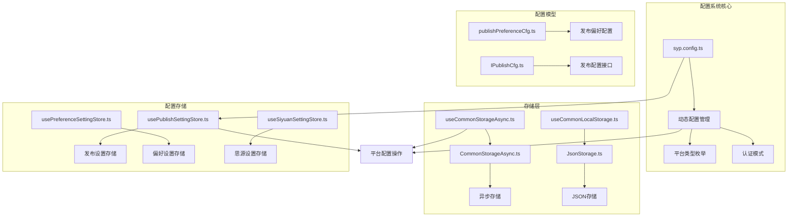
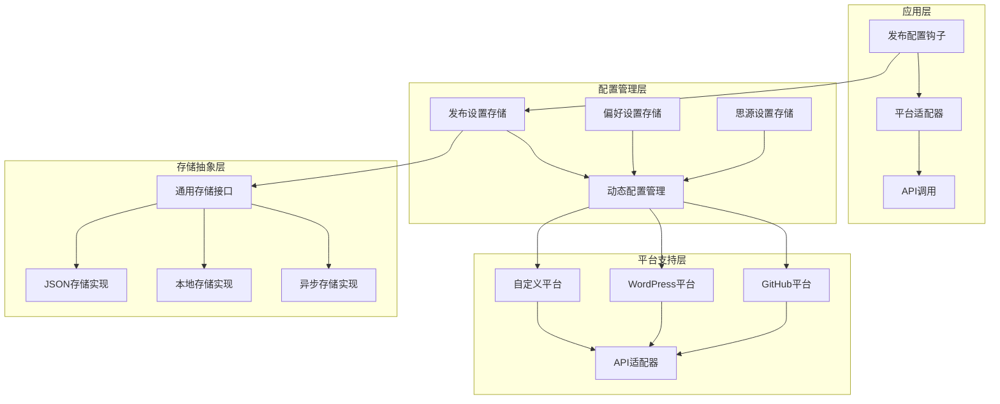
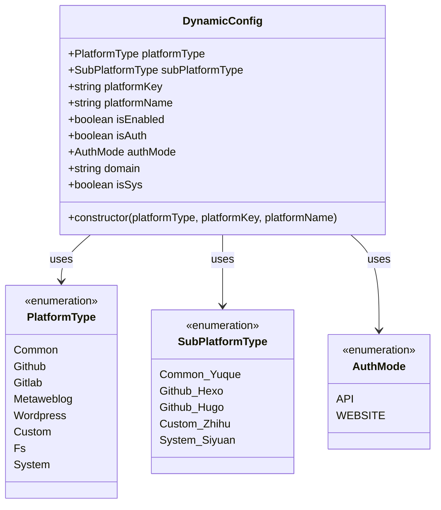
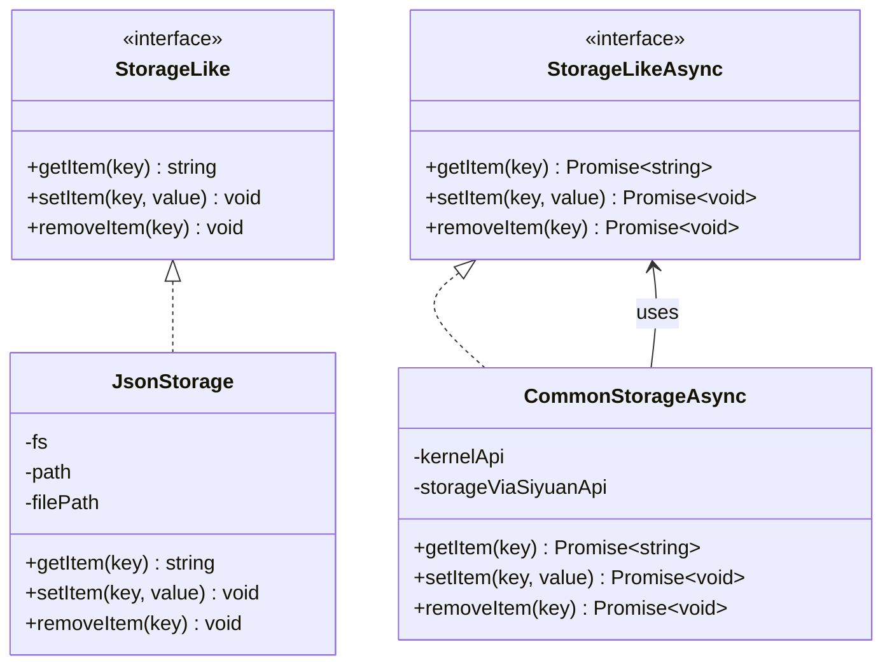
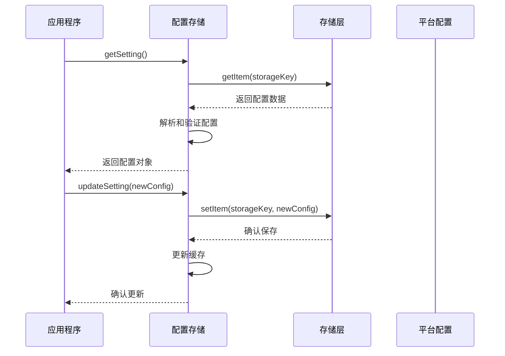
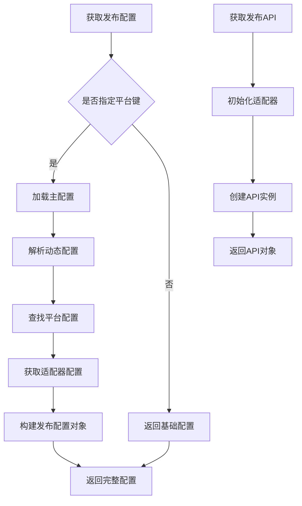

# 平台配置系统

<cite>
**本文档引用的文件**
- [syp.config.ts](file://syp.config.ts)
- [dynamicConfig.ts](file://src/platforms/dynamicConfig.ts)
- [usePublishSettingStore.ts](file://src/stores/usePublishSettingStore.ts)
- [usePreferenceSettingStore.ts](file://src/stores/usePreferenceSettingStore.ts)
- [useSiyuanSettingStore.ts](file://src/stores/useSiyuanSettingStore.ts)
- [useCommonLocalStorage.ts](file://src/stores/common/useCommonLocalStorage.ts)
- [useCommonStorageAsync.ts](file://src/stores/common/useCommonStorageAsync.ts)
- [commonStorageAsync.ts](file://src/stores/common/commonStorageAsync.ts)
- [jsonStorage.ts](file://src/stores/common/jsonStorage.ts)
- [constants.ts](file://src/utils/constants.ts)
- [usePublishConfig.ts](file://src/composables/usePublishConfig.ts)
- [publishPreferenceCfg.ts](file://src/models/publishPreferenceCfg.ts)
- [IPublishCfg.ts](file://src/types/IPublishCfg.ts)
- [config.ts](file://siyuan/store/config.ts)
- [preferenceConfigManager.ts](file://siyuan/store/preferenceConfigManager.ts)
- [utils.ts](file://src/utils/utils.ts)
</cite>

## 目录
1. [简介](#简介)
2. [项目结构](#项目结构)
3. [核心组件](#核心组件)
4. [架构概览](#架构概览)
5. [详细组件分析](#详细组件分析)
6. [依赖关系分析](#依赖关系分析)
7. [性能考虑](#性能考虑)
8. [故障排除指南](#故障排除指南)
9. [结论](#结论)

## 简介

平台配置系统是思源插件发布器的核心基础设施，负责管理各种发布平台的配置信息、用户偏好设置以及系统配置。该系统支持多种发布平台（如GitHub、GitLab、WordPress、自定义平台等），提供了统一的配置管理和存储机制。

系统采用模块化设计，通过动态配置管理、存储抽象层和适配器模式，实现了对不同平台配置的灵活支持。配置数据既可以在思源笔记环境中持久化存储，也可以在浏览器环境中使用本地存储。

## 项目结构

平台配置系统主要分布在以下目录结构中：



**图表来源**
- [syp.config.ts:1-52](file://syp.config.ts#L1-L52)
- [dynamicConfig.ts:1-534](file://src/platforms/dynamicConfig.ts#L1-L534)
- [usePublishSettingStore.ts:1-95](file://src/stores/usePublishSettingStore.ts#L1-L95)

**章节来源**
- [syp.config.ts:1-52](file://syp.config.ts#L1-L52)
- [dynamicConfig.ts:1-534](file://src/platforms/dynamicConfig.ts#L1-L534)

## 核心组件

### 配置模型层

系统定义了多个核心配置模型来管理不同类型的数据：

1. **SypConfig**: 主配置模型，包含语言设置和动态配置键
2. **DynamicConfig**: 动态平台配置模型，支持多种平台类型
3. **PublishPreferenceCfg**: 发布偏好设置模型，扩展基础配置
4. **IPublishCfg**: 发布配置接口，定义配置组合结构

### 存储管理层

系统提供了多层次的存储解决方案：

1. **异步存储**: 支持Promise的存储操作，适用于服务器端或异步场景
2. **本地存储**: 基于localStorage的响应式存储
3. **JSON存储**: 在思源笔记环境中使用的文件系统存储

### 配置管理器

系统包含专门的配置管理器来处理不同类型的配置：

1. **ConfigManager**: 基础配置管理器
2. **PreferenceConfigManager**: 偏好设置配置管理器
3. **平台特定配置管理器**: 针对不同平台的配置处理器

**章节来源**
- [publishPreferenceCfg.ts:1-101](file://src/models/publishPreferenceCfg.ts#L1-L101)
- [IPublishCfg.ts:1-50](file://src/types/IPublishCfg.ts#L1-L50)
- [config.ts:1-47](file://siyuan/store/config.ts#L1-L47)
- [preferenceConfigManager.ts:1-52](file://siyuan/store/preferenceConfigManager.ts#L1-L52)

## 架构概览

平台配置系统采用分层架构设计，确保了良好的可扩展性和维护性：



**图表来源**
- [usePublishConfig.ts:1-99](file://src/composables/usePublishConfig.ts#L1-L99)
- [usePublishSettingStore.ts:1-95](file://src/stores/usePublishSettingStore.ts#L1-L95)
- [dynamicConfig.ts:1-534](file://src/platforms/dynamicConfig.ts#L1-L534)

系统架构特点：

1. **分层设计**: 清晰的层次结构，便于维护和扩展
2. **抽象接口**: 统一的存储接口，支持多种存储后端
3. **平台无关**: 通过适配器模式支持多种发布平台
4. **响应式更新**: 基于Vue响应式的配置管理

## 详细组件分析

### 动态配置管理系统

动态配置系统是整个配置系统的核心，负责管理各种发布平台的配置信息。



**图表来源**
- [dynamicConfig.ts:13-166](file://src/platforms/dynamicConfig.ts#L13-L166)

动态配置系统的主要功能：

1. **平台类型管理**: 支持8种主要平台类型
2. **子平台细分**: 每个平台类型下支持多个具体平台
3. **认证模式**: 支持API和WEBSITE两种认证方式
4. **配置验证**: 提供配置完整性和有效性的验证机制

**章节来源**
- [dynamicConfig.ts:1-534](file://src/platforms/dynamicConfig.ts#L1-L534)

### 存储抽象层

存储抽象层提供了统一的存储接口，支持多种存储后端：



**图表来源**
- [commonStorageAsync.ts:24-117](file://src/stores/common/commonStorageAsync.ts#L24-L117)
- [jsonStorage.ts:23-110](file://src/stores/common/jsonStorage.ts#L23-L110)

存储层的设计优势：

1. **环境适配**: 自动检测运行环境并选择合适的存储方案
2. **统一接口**: 提供一致的API接口，简化上层代码
3. **错误处理**: 完善的异常处理机制
4. **日志记录**: 详细的日志记录便于调试和监控

**章节来源**
- [useCommonStorageAsync.ts:1-85](file://src/stores/common/useCommonStorageAsync.ts#L1-L85)
- [useCommonLocalStorage.ts:1-58](file://src/stores/common/useCommonLocalStorage.ts#L1-L58)

### 配置存储管理器

配置存储管理器提供了针对不同配置类型的专用存储解决方案：



**图表来源**
- [usePublishSettingStore.ts:21-95](file://src/stores/usePublishSettingStore.ts#L21-L95)
- [usePreferenceSettingStore.ts:21-90](file://src/stores/usePreferenceSettingStore.ts#L21-L90)

配置存储管理器的功能特性：

1. **智能初始化**: 自动检测和初始化配置数据
2. **类型安全**: 编译时类型检查，减少运行时错误
3. **缓存机制**: 内存缓存提高访问性能
4. **异步操作**: 支持非阻塞的配置操作

**章节来源**
- [usePublishSettingStore.ts:1-95](file://src/stores/usePublishSettingStore.ts#L1-L95)
- [usePreferenceSettingStore.ts:1-90](file://src/stores/usePreferenceSettingStore.ts#L1-L90)
- [useSiyuanSettingStore.ts:1-81](file://src/stores/useSiyuanSettingStore.ts#L1-L81)

### 发布配置管理器

发布配置管理器是系统的核心组件，负责协调各个配置组件的工作：



**图表来源**
- [usePublishConfig.ts:26-99](file://src/composables/usePublishConfig.ts#L26-L99)

发布配置管理器的核心功能：

1. **配置聚合**: 将多个配置源的数据整合为统一的配置对象
2. **平台适配**: 根据平台类型提供相应的配置和适配器
3. **动态加载**: 支持运行时动态添加和修改平台配置
4. **错误处理**: 完善的异常处理和回退机制

**章节来源**
- [usePublishConfig.ts:1-99](file://src/composables/usePublishConfig.ts#L1-L99)

## 依赖关系分析

平台配置系统的依赖关系体现了清晰的分层架构：

```mermaid
graph TB
subgraph "外部依赖"
A[zhi-blog-api]
B[@vueuse/core]
C[zhi-common]
D[zhi-device]
E[zhi-siyuan-api]
end
subgraph "内部模块"
F[配置模型]
G[存储层]
H[配置管理]
I[平台支持]
end
subgraph "应用层"
J[发布配置钩子]
K[设置界面]
L[平台适配器]
end
A --> F
B --> G
C --> F
D --> G
E --> F
F --> G
G --> H
H --> I
I --> J
J --> K
J --> L
```

**图表来源**
- [dynamicConfig.ts:1-534](file://src/platforms/dynamicConfig.ts#L1-L534)
- [usePublishSettingStore.ts:1-95](file://src/stores/usePublishSettingStore.ts#L1-L95)

依赖关系特点：

1. **最小依赖**: 外部依赖数量有限，降低维护成本
2. **接口隔离**: 通过接口定义明确模块边界
3. **循环依赖避免**: 设计上避免了循环依赖问题
4. **可测试性**: 清晰的依赖关系便于单元测试

**章节来源**
- [constants.ts:1-54](file://src/utils/constants.ts#L1-L54)

## 性能考虑

平台配置系统在设计时充分考虑了性能优化：

### 存储性能优化

1. **缓存策略**: 配置数据在内存中有缓存，减少重复读取
2. **懒加载**: 配置按需加载，避免不必要的初始化
3. **批量操作**: 支持批量配置更新，减少存储操作次数

### 内存管理

1. **响应式更新**: 使用Vue响应式系统，只在必要时更新UI
2. **对象复用**: 配置对象在内存中复用，减少垃圾回收压力
3. **类型优化**: TypeScript类型检查在编译时完成，运行时无额外开销

### 网络优化

1. **异步操作**: 所有网络请求都是异步的，不阻塞主线程
2. **错误重试**: 网络错误有适当的重试机制
3. **超时控制**: 请求超时和取消机制防止资源泄露

## 故障排除指南

### 常见问题及解决方案

#### 配置加载失败

**问题症状**: 应用启动时配置无法加载

**可能原因**:
1. 存储权限问题
2. 配置文件损坏
3. 网络连接异常

**解决步骤**:
1. 检查存储权限设置
2. 验证配置文件格式
3. 确认网络连接状态

#### 平台配置无效

**问题症状**: 添加的平台配置无法使用

**可能原因**:
1. 认证信息错误
2. 平台类型选择错误
3. 网络连接问题

**解决步骤**:
1. 重新输入认证信息
2. 确认平台类型正确
3. 测试网络连接

#### 性能问题

**问题症状**: 应用响应缓慢

**可能原因**:
1. 配置数据过大
2. 存储操作频繁
3. 内存泄漏

**解决步骤**:
1. 清理不必要的配置
2. 减少存储操作频率
3. 检查内存使用情况

**章节来源**
- [utils.ts:1-97](file://src/utils/utils.ts#L1-L97)

## 结论

平台配置系统通过精心设计的架构和实现，为思源插件发布器提供了强大而灵活的配置管理能力。系统的主要优势包括：

1. **高度模块化**: 清晰的模块划分便于维护和扩展
2. **多环境支持**: 同时支持思源笔记和浏览器环境
3. **类型安全**: 完整的TypeScript类型定义
4. **性能优化**: 多层次的性能优化策略
5. **易于使用**: 简洁的API设计和丰富的配置选项

该系统为未来的功能扩展奠定了坚实的基础，能够支持更多发布平台的集成和更复杂的配置需求。通过持续的优化和改进，平台配置系统将继续为用户提供优秀的配置管理体验。