# 平台配置系统

<cite>
**本文档引用的文件**
- [syp.config.ts](file://syp.config.ts)
- [dynamicConfig.ts](file://src/platforms/dynamicConfig.ts)
- [usePublishSettingStore.ts](file://src/stores/usePublishSettingStore.ts)
- [usePreferenceSettingStore.ts](file://src/stores/usePreferenceSettingStore.ts)
- [useSiyuanSettingStore.ts](file://src/stores/useSiyuanSettingStore.ts)
- [useCommonLocalStorage.ts](file://src/stores/common/useCommonLocalStorage.ts)
- [useCommonStorageAsync.ts](file://src/stores/common/useCommonStorageAsync.ts)
- [commonStorageAsync.ts](file://src/stores/common/commonStorageAsync.ts)
- [jsonStorage.ts](file://src/stores/common/jsonStorage.ts)
- [constants.ts](file://src/utils/constants.ts)
- [usePublishConfig.ts](file://src/composables/usePublishConfig.ts)
- [publishPreferenceCfg.ts](file://src/models/publishPreferenceCfg.ts)
- [IPublishCfg.ts](file://src/types/IPublishCfg.ts)
- [config.ts](file://siyuan/store/config.ts)
- [preferenceConfigManager.ts](file://siyuan/store/preferenceConfigManager.ts)
- [utils.ts](file://src/utils/utils.ts)
- [pre.ts](file://src/platforms/pre.ts)
- [docsifyApiAdaptor.ts](file://src/adaptors/api/docsify/docsifyApiAdaptor.ts)
- [gitlabdocsifyApiAdaptor.ts](file://src/adaptors/api/gitlab-docsify/gitlabdocsifyApiAdaptor.ts)
- [docsifyConfig.ts](file://src/adaptors/api/docsify/docsifyConfig.ts)
- [gitlabdocsifyConfig.ts](file://src/adaptors/api/gitlab-docsify/gitlabdocsifyConfig.ts)
- [adaptors/index.ts](file://src/adaptors/index.ts)
- [svgIcons.ts](file://src/utils/svgIcons.ts)
- [SypErrorDetailsPanel.vue](file://src/components/v2/common/SypErrorDetailsPanel.vue)
- [SypErrorDetailsPanel.spec.ts](file://src/components/v2/common/SypErrorDetailsPanel.spec.ts)
- [V2App.vue](file://src/components/v2/V2App.vue)
- [V2PlatformConfigBridge.vue](file://src/components/v2/settings/V2PlatformConfigBridge.vue)
- [platformConfigActionBridge.ts](file://src/components/v2/settings/bridge/platformConfigActionBridge.ts)
- [CommonBlogSetting.vue](file://src/components/set/publish/singleplatform/base/CommonBlogSetting.vue)
- [sensitiveLogSanitizer.ts](file://src/utils/sensitiveLogSanitizer.ts)
- [useV2ErrorDetails.ts](file://src/composables/v2/useV2ErrorDetails.ts)
- [v2ConfigValidatedFlow.spec.ts](file://src/components/v2/v2ConfigValidatedFlow.spec.ts)
- [design.md](file://openspec/changes/expose-v2-platform-config-validation-errors/design.md)
- [proposal.md](file://openspec/changes/expose-v2-platform-config-validation-errors/proposal.md)
- [tasks.md](file://openspec/changes/expose-v2-platform-config-validation-errors/tasks.md)
- [v2-hosted-error-details/spec.md](file://openspec/changes/expose-v2-platform-config-validation-errors/specs/v2-hosted-error-details/spec.md)
- [v2-platform-config-validation-feedback/spec.md](file://openspec/changes/expose-v2-platform-config-validation-errors/specs/v2-platform-config-validation-feedback/spec.md)
- [bridgeRegistry.ts](file://src/components/v2/settings/bridge/bridgeRegistry.ts)
</cite>

## 更新摘要
**变更内容**
- 新增平台配置验证错误详情面板，提供更详细的错误诊断信息
- 替代之前的简单错误消息，实现统一的错误展示机制
- 引入敏感信息脱敏处理，确保安全的错误信息展示
- 建立完整的错误验证契约和事件透传机制
- 实现 V2 错误详情面板的统一调度和管理
- 增强 V1 表单与 V2 桥接的错误处理集成

## 目录
1. [简介](#简介)
2. [项目结构](#项目结构)
3. [核心组件](#核心组件)
4. [架构概览](#架构概览)
5. [详细组件分析](#详细组件分析)
6. [平台配置验证错误详情面板](#平台配置验证错误详情面板)
7. [Docsify 子平台支持](#docsify-子平台支持)
8. [依赖关系分析](#依赖关系分析)
9. [性能考虑](#性能考虑)
10. [故障排除指南](#故障排除指南)
11. [结论](#结论)

## 简介

平台配置系统是思源插件发布器的核心基础设施，负责管理各种发布平台的配置信息、用户偏好设置以及系统配置。该系统支持多种发布平台（如GitHub、GitLab、WordPress、自定义平台等），提供了统一的配置管理和存储机制。

系统采用模块化设计，通过动态配置管理、存储抽象层和适配器模式，实现了对不同平台配置的灵活支持。配置数据既可以在思源笔记环境中持久化存储，也可以在浏览器环境中使用本地存储。

**更新** 新增平台配置验证错误详情面板功能，提供更详细的错误诊断信息，替代之前的简单错误消息。该功能基于 `SypErrorDetailsPanel` 组件，实现了统一的错误展示机制，支持敏感信息脱敏和可复制的诊断信息，并通过 `useV2ErrorDetails` 组合式函数提供完整的错误状态管理。

## 项目结构

平台配置系统主要分布在以下目录结构中：

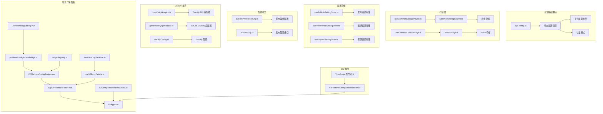
```mermaid
graph TB
subgraph "配置系统核心"
A[syp.config.ts] --> B[动态配置管理]
B --> C[平台类型枚举]
B --> D[认证模式]
end
subgraph "存储层"
E[useCommonStorageAsync.ts] --> F[CommonStorageAsync.ts]
G[useCommonLocalStorage.ts] --> H[JsonStorage.ts]
F --> I[异步存储]
H --> J[JSON存储]
end
subgraph "配置存储"
K[usePublishSettingStore.ts] --> L[发布设置存储]
M[usePreferenceSettingStore.ts] --> N[偏好设置存储]
O[useSiyuanSettingStore.ts] --> P[思源设置存储]
end
subgraph "配置模型"
Q[publishPreferenceCfg.ts] --> R[发布偏好配置]
S[IPublishCfg.ts] --> T[发布配置接口]
end
subgraph "Docsify 支持"
U[docsifyApiAdaptor.ts] --> V[Docsify API 适配器]
W[gitlabdocsifyApiAdaptor.ts] --> X[GitLab Docsify 适配器]
Y[docsifyConfig.ts] --> Z[Docsify 配置]
end
subgraph "错误详情面板"
AA[SypErrorDetailsPanel.vue] --> BB[V2App.vue]
CC[V2PlatformConfigBridge.vue] --> AA
DD[platformConfigActionBridge.ts] --> CC
EE[CommonBlogSetting.vue] --> DD
FF[useV2ErrorDetails.ts] --> AA
GG[sensitiveLogSanitizer.ts] --> FF
HH[v2ConfigValidatedFlow.spec.ts] --> BB
II[bridgeRegistry.ts] --> CC
end
subgraph "验证契约"
JJ[V2PlatformConfigValidationResult] --> BB
KK[TypeScript 类型定义] --> JJ
end
```

**图表来源**
- [syp.config.ts:1-52](file://syp.config.ts#L1-L52)
- [dynamicConfig.ts:1-534](file://src/platforms/dynamicConfig.ts#L1-L534)
- [usePublishSettingStore.ts:1-95](file://src/stores/usePublishSettingStore.ts#L1-L95)
- [docsifyApiAdaptor.ts:1-63](file://src/adaptors/api/docsify/docsifyApiAdaptor.ts#L1-L63)
- [gitlabdocsifyApiAdaptor.ts:1-63](file://src/adaptors/api/gitlab-docsify/gitlabdocsifyApiAdaptor.ts#L1-L63)
- [SypErrorDetailsPanel.vue:1-267](file://src/components/v2/common/SypErrorDetailsPanel.vue#L1-L267)
- [V2App.vue:178-190](file://src/components/v2/V2App.vue#L178-L190)
- [platformConfigActionBridge.ts:12-17](file://src/components/v2/settings/bridge/platformConfigActionBridge.ts#L12-L17)
- [useV2ErrorDetails.ts:20-67](file://src/composables/v2/useV2ErrorDetails.ts#L20-L67)
- [sensitiveLogSanitizer.ts:12-62](file://src/utils/sensitiveLogSanitizer.ts#L12-L62)
- [v2ConfigValidatedFlow.spec.ts:40-63](file://src/components/v2/v2ConfigValidatedFlow.spec.ts#L40-L63)

**章节来源**
- [syp.config.ts:1-52](file://syp.config.ts#L1-L52)
- [dynamicConfig.ts:1-534](file://src/platforms/dynamicConfig.ts#L1-L534)

## 核心组件

### 配置模型层

系统定义了多个核心配置模型来管理不同类型的数据：

1. **SypConfig**: 主配置模型，包含语言设置和动态配置键
2. **DynamicConfig**: 动态平台配置模型，支持多种平台类型
3. **PublishPreferenceCfg**: 发布偏好设置模型，扩展基础配置
4. **IPublishCfg**: 发布配置接口，定义配置组合结构

### 存储管理层

系统提供了多层次的存储解决方案：

1. **异步存储**: 支持Promise的存储操作，适用于服务器端或异步场景
2. **本地存储**: 基于localStorage的响应式存储
3. **JSON存储**: 在思源笔记环境中使用的文件系统存储

### 配置管理器

系统包含专门的配置管理器来处理不同类型的配置：

1. **ConfigManager**: 基础配置管理器
2. **PreferenceConfigManager**: 偏好设置配置管理器
3. **平台特定配置管理器**: 针对不同平台的配置处理器

**章节来源**
- [publishPreferenceCfg.ts:1-101](file://src/models/publishPreferenceCfg.ts#L1-L101)
- [IPublishCfg.ts:1-50](file://src/types/IPublishCfg.ts#L1-L50)
- [config.ts:1-47](file://siyuan/store/config.ts#L1-L47)
- [preferenceConfigManager.ts:1-52](file://siyuan/store/preferenceConfigManager.ts#L1-L52)

## 架构概览

平台配置系统采用分层架构设计，确保了良好的可扩展性和维护性：

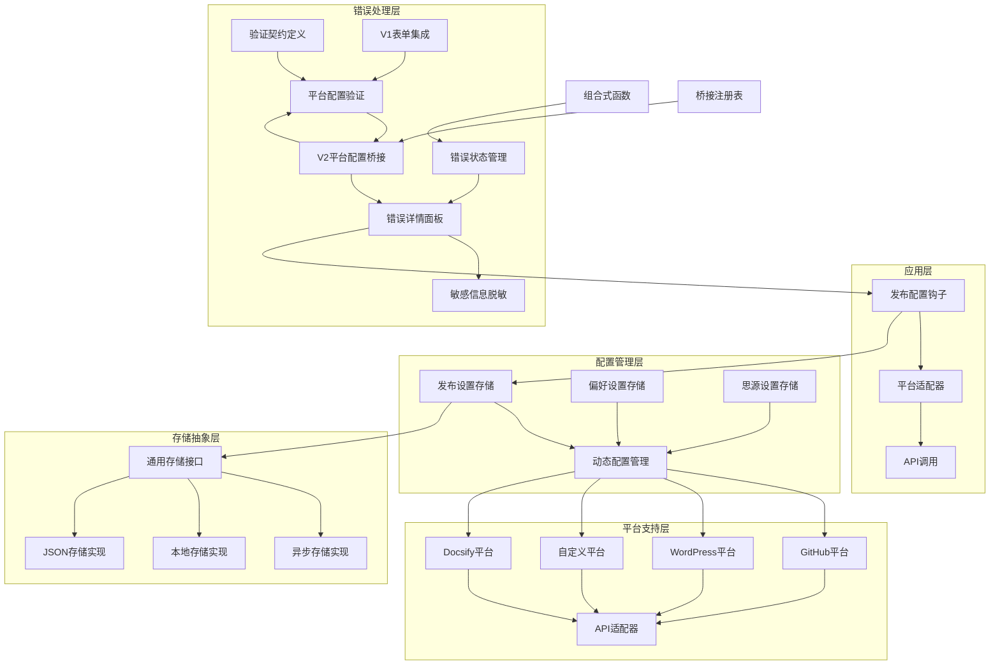
```mermaid
graph TB
subgraph "应用层"
A[发布配置钩子] --> B[平台适配器]
B --> C[API调用]
end
subgraph "配置管理层"
D[发布设置存储] --> E[动态配置管理]
F[偏好设置存储] --> E
G[思源设置存储] --> E
end
subgraph "存储抽象层"
H[通用存储接口] --> I[异步存储实现]
H --> J[本地存储实现]
H --> K[JSON存储实现]
end
subgraph "平台支持层"
L[GitHub平台] --> M[API适配器]
N[WordPress平台] --> M
O[自定义平台] --> M
P[Docsify平台] --> M
end
subgraph "错误处理层"
Q[平台配置验证] --> R[V2平台配置桥接]
R --> S[错误详情面板]
S --> T[敏感信息脱敏]
U[验证契约定义] --> Q
V[错误状态管理] --> S
W[V1表单集成] --> Q
end
A --> D
D --> H
E --> L
E --> N
E --> O
E --> P
R --> Q
S --> A
X[组合式函数] --> V
Y[桥接注册表] --> R
```

**图表来源**
- [usePublishConfig.ts:1-99](file://src/composables/usePublishConfig.ts#L1-L99)
- [usePublishSettingStore.ts:1-95](file://src/stores/usePublishSettingStore.ts#L1-L95)
- [dynamicConfig.ts:1-534](file://src/platforms/dynamicConfig.ts#L1-L534)
- [V2PlatformConfigBridge.vue:1-264](file://src/components/v2/settings/V2PlatformConfigBridge.vue#L1-L264)
- [SypErrorDetailsPanel.vue:1-267](file://src/components/v2/common/SypErrorDetailsPanel.vue#L1-L267)
- [platformConfigActionBridge.ts:12-17](file://src/components/v2/settings/bridge/platformConfigActionBridge.ts#L12-L17)
- [useV2ErrorDetails.ts:20-67](file://src/composables/v2/useV2ErrorDetails.ts#L20-L67)
- [bridgeRegistry.ts:1-85](file://src/components/v2/settings/bridge/bridgeRegistry.ts#L1-L85)

系统架构特点：

1. **分层设计**: 清晰的层次结构，便于维护和扩展
2. **抽象接口**: 统一的存储接口，支持多种存储后端
3. **平台无关**: 通过适配器模式支持多种发布平台
4. **响应式更新**: 基于Vue响应式的配置管理
5. **错误处理**: 完整的错误处理和诊断机制
6. **契约约束**: 通过 TypeScript 接口确保类型安全
7. **状态管理**: 通过组合式函数提供集中式状态管理

## 详细组件分析

### 动态配置管理系统

动态配置系统是整个配置系统的核心，负责管理各种发布平台的配置信息。

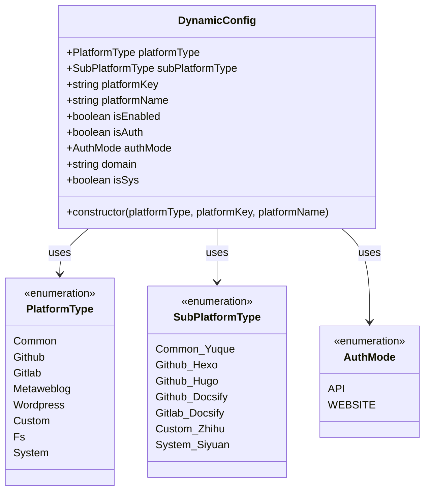
```mermaid
classDiagram
class DynamicConfig {
+PlatformType platformType
+SubPlatformType subPlatformType
+string platformKey
+string platformName
+boolean isEnabled
+boolean isAuth
+AuthMode authMode
+string domain
+boolean isSys
+constructor(platformType, platformKey, platformName)
}
class PlatformType {
<<enumeration>>
Common
Github
Gitlab
Metaweblog
Wordpress
Custom
Fs
System
}
class SubPlatformType {
<<enumeration>>
Common_Yuque
Github_Hexo
Github_Hugo
Github_Docsify
Gitlab_Docsify
Custom_Zhihu
System_Siyuan
}
class AuthMode {
<<enumeration>>
API
WEBSITE
}
DynamicConfig --> PlatformType : uses
DynamicConfig --> SubPlatformType : uses
DynamicConfig --> AuthMode : uses
```

**图表来源**
- [dynamicConfig.ts:13-166](file://src/platforms/dynamicConfig.ts#L13-L166)

动态配置系统的主要功能：

1. **平台类型管理**: 支持8种主要平台类型
2. **子平台细分**: 每个平台类型下支持多个具体平台，包括新增的 Docsify 子平台
3. **认证模式**: 支持API和WEBSITE两种认证方式
4. **配置验证**: 提供配置完整性和有效性的验证机制

**更新** 新增 Docsify 子平台类型，包括：
- `Github_Docsify`: GitHub 上的 Docsify 静态站点
- `Gitlab_Docsify`: GitLab 上的 Docsify 静态站点

**章节来源**
- [dynamicConfig.ts:1-534](file://src/platforms/dynamicConfig.ts#L1-L534)

### 存储抽象层

存储抽象层提供了统一的存储接口，支持多种存储后端：

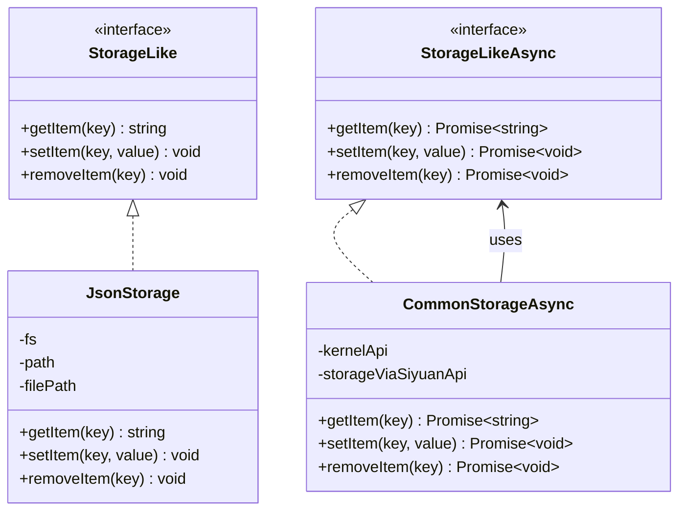
```mermaid
classDiagram
class StorageLike {
<<interface>>
+getItem(key) string
+setItem(key, value) void
+removeItem(key) void
}
class StorageLikeAsync {
<<interface>>
+getItem(key) Promise~string~
+setItem(key, value) Promise~void~
+removeItem(key) Promise~void~
}
class CommonStorageAsync {
-kernelApi
-storageViaSiyuanApi
+getItem(key) Promise~string~
+setItem(key, value) Promise~void~
+removeItem(key) Promise~void~
}
class JsonStorage {
-fs
-path
-filePath
+getItem(key) string
+setItem(key, value) void
+removeItem(key) void
}
StorageLike <|.. JsonStorage
StorageLikeAsync <|.. CommonStorageAsync
CommonStorageAsync --> StorageLikeAsync : uses
```

**图表来源**
- [commonStorageAsync.ts:24-117](file://src/stores/common/commonStorageAsync.ts#L24-L117)
- [jsonStorage.ts:23-110](file://src/stores/common/jsonStorage.ts#L23-L110)

存储层的设计优势：

1. **环境适配**: 自动检测运行环境并选择合适的存储方案
2. **统一接口**: 提供一致的API接口，简化上层代码
3. **错误处理**: 完善的异常处理机制
4. **日志记录**: 详细的日志记录便于调试和监控

**章节来源**
- [useCommonStorageAsync.ts:1-85](file://src/stores/common/useCommonStorageAsync.ts#L1-L85)
- [useCommonLocalStorage.ts:1-58](file://src/stores/common/useCommonLocalStorage.ts#L1-L58)

### 配置存储管理器

配置存储管理器提供了针对不同配置类型的专用存储解决方案：

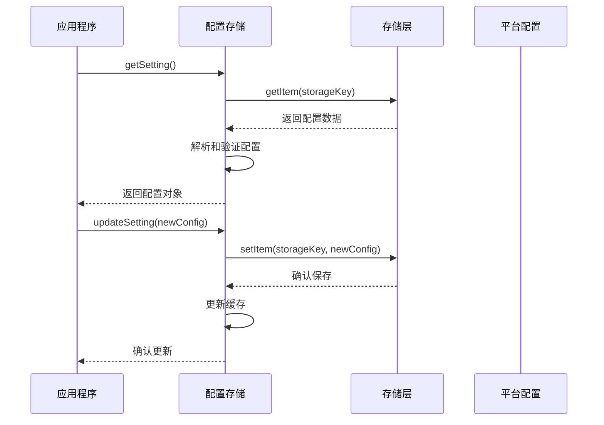
```mermaid
sequenceDiagram
participant App as 应用程序
participant Store as 配置存储
participant Storage as 存储层
participant Platform as 平台配置
App->>Store : getSetting()
Store->>Storage : getItem(storageKey)
Storage-->>Store : 返回配置数据
Store->>Store : 解析和验证配置
Store-->>App : 返回配置对象
App->>Store : updateSetting(newConfig)
Store->>Storage : setItem(storageKey, newConfig)
Storage-->>Store : 确认保存
Store->>Store : 更新缓存
Store-->>App : 确认更新
```

**图表来源**
- [usePublishSettingStore.ts:21-95](file://src/stores/usePublishSettingStore.ts#L21-L95)
- [usePreferenceSettingStore.ts:21-90](file://src/stores/usePreferenceSettingStore.ts#L21-L90)

配置存储管理器的功能特性：

1. **智能初始化**: 自动检测和初始化配置数据
2. **类型安全**: 编译时类型检查，减少运行时错误
3. **缓存机制**: 内存缓存提高访问性能
4. **异步操作**: 支持非阻塞的配置操作

**章节来源**
- [usePublishSettingStore.ts:1-95](file://src/stores/usePublishSettingStore.ts#L1-L95)
- [usePreferenceSettingStore.ts:1-90](file://src/stores/usePreferenceSettingStore.ts#L1-L90)
- [useSiyuanSettingStore.ts:1-81](file://src/stores/useSiyuanSettingStore.ts#L1-L81)

### 发布配置管理器

发布配置管理器是系统的核心组件，负责协调各个配置组件的工作：

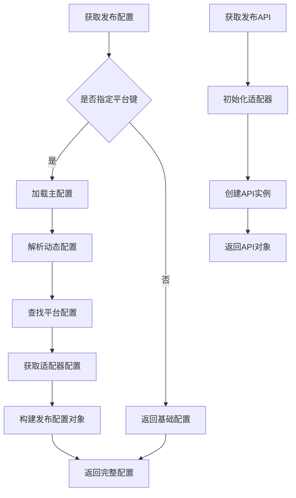
```mermaid
flowchart TD
A[获取发布配置] --> B{是否指定平台键}
B --> |是| C[加载主配置]
B --> |否| D[返回基础配置]
C --> E[解析动态配置]
E --> F[查找平台配置]
F --> G[获取适配器配置]
G --> H[构建发布配置对象]
H --> I[返回完整配置]
D --> I
J[获取发布API] --> K[初始化适配器]
K --> L[创建API实例]
L --> M[返回API对象]
```

**图表来源**
- [usePublishConfig.ts:26-99](file://src/composables/usePublishConfig.ts#L26-L99)

发布配置管理器的核心功能：

1. **配置聚合**: 将多个配置源的数据整合为统一的配置对象
2. **平台适配**: 根据平台类型提供相应的配置和适配器
3. **动态加载**: 支持运行时动态添加和修改平台配置
4. **错误处理**: 完善的异常处理和回退机制

**章节来源**
- [usePublishConfig.ts:1-99](file://src/composables/usePublishConfig.ts#L1-L99)

## 平台配置验证错误详情面板

**新增** 平台配置验证错误详情面板功能，提供详细的错误诊断信息，替代之前的简单错误消息。

### 错误详情面板组件

`SypErrorDetailsPanel` 是一个功能完整的错误详情展示组件，支持友好的错误摘要和详细的诊断信息：

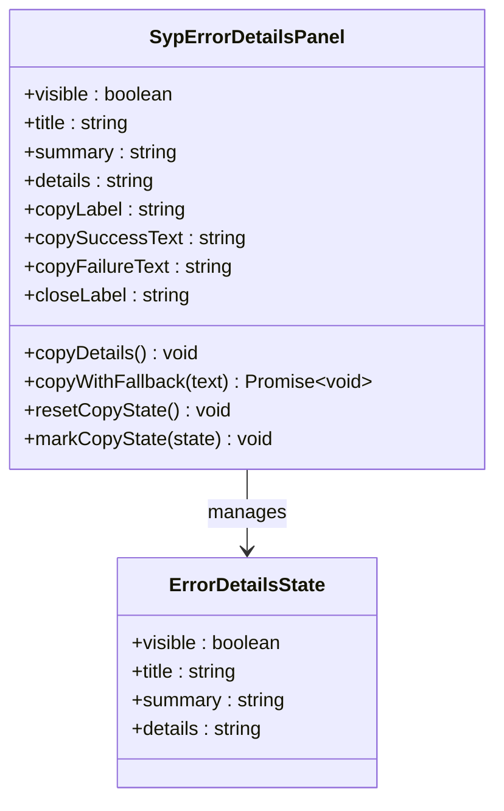
```mermaid
classDiagram
class SypErrorDetailsPanel {
+visible : boolean
+title : string
+summary : string
+details : string
+copyLabel : string
+copySuccessText : string
+copyFailureText : string
+closeLabel : string
+copyDetails() void
+copyWithFallback(text) Promise~void~
+resetCopyState() void
+markCopyState(state) void
}
class ErrorDetailsState {
+visible : boolean
+title : string
+summary : string
+details : string
}
SypErrorDetailsPanel --> ErrorDetailsState : manages
```

**图表来源**
- [SypErrorDetailsPanel.vue:56-161](file://src/components/v2/common/SypErrorDetailsPanel.vue#L56-L161)

错误详情面板的主要特性：

1. **友好的用户界面**: 支持标题、摘要和详细信息的分层展示
2. **可复制的诊断信息**: 提供一键复制功能，支持现代 Clipboard API 和回退方案
3. **敏感信息脱敏**: 自动识别和脱敏 Cookie、Authorization、Token 等敏感字段
4. **无障碍支持**: 支持键盘导航和屏幕阅读器
5. **动画过渡**: 提供平滑的显示和隐藏动画效果

### V2 应用程序集成

`V2App` 组件集成了错误详情面板，作为统一的错误处理中心：

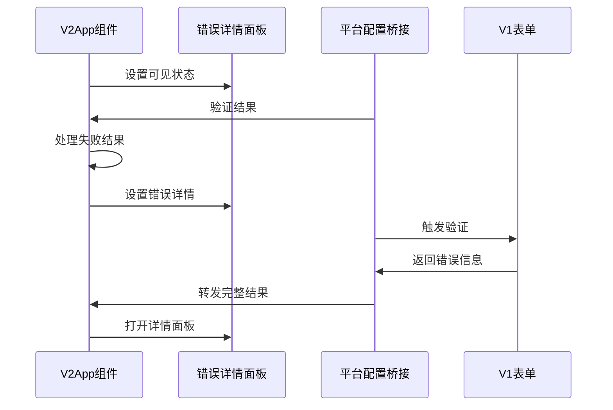
```mermaid
sequenceDiagram
participant V2App as V2App组件
participant ErrorPanel as 错误详情面板
participant ConfigBridge as 平台配置桥接
participant CommonBlog as V1表单
V2App->>ErrorPanel : 设置可见状态
ConfigBridge->>V2App : 验证结果
V2App->>V2App : 处理失败结果
V2App->>ErrorPanel : 设置错误详情
ConfigBridge->>CommonBlog : 触发验证
CommonBlog->>ConfigBridge : 返回错误信息
ConfigBridge->>V2App : 转发完整结果
V2App->>ErrorPanel : 打开详情面板
```

**图表来源**
- [V2App.vue:178-190](file://src/components/v2/V2App.vue#L178-L190)
- [V2PlatformConfigBridge.vue:147-153](file://src/components/v2/settings/V2PlatformConfigBridge.vue#L147-L153)

V2 应用程序的错误处理流程：

1. **统一调度**: 所有验证失败都由 `V2App` 统一处理
2. **状态管理**: 维护 `errorDetailsState` 来跟踪错误状态
3. **面板展示**: 自动打开共享的错误详情面板
4. **生命周期管理**: 自动清理和重置错误状态

### 平台配置桥接层

`V2PlatformConfigBridge` 负责桥接 V1 表单和 V2 应用程序：

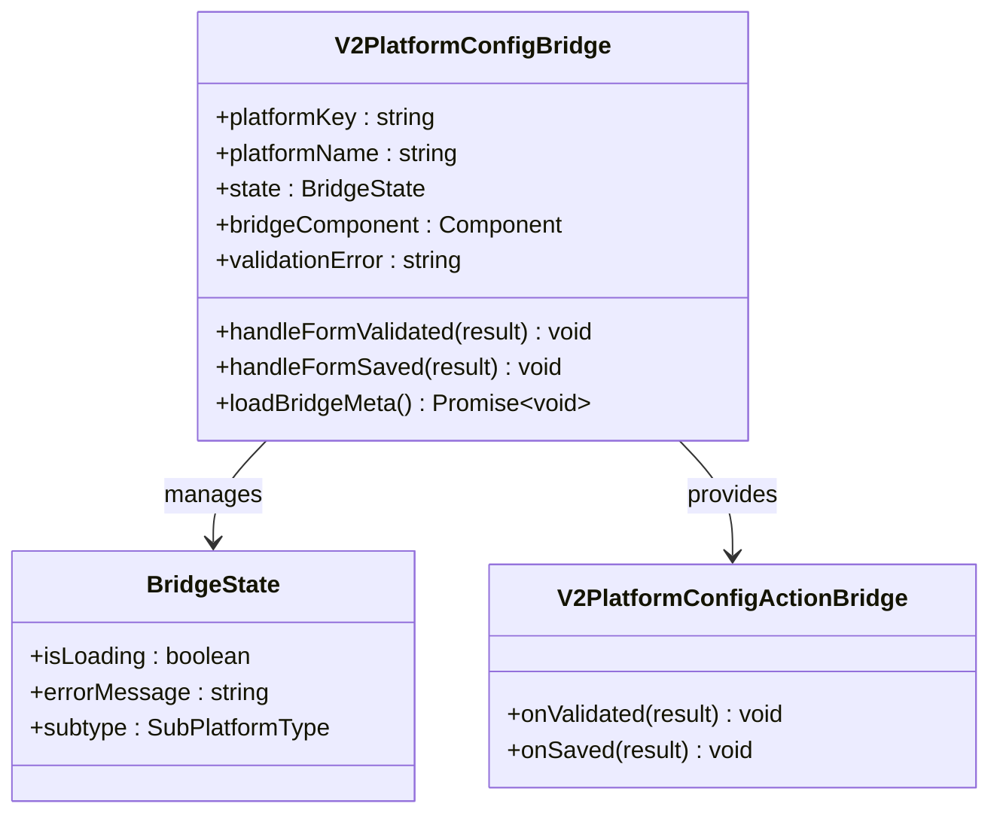
```mermaid
classDiagram
class V2PlatformConfigBridge {
+platformKey : string
+platformName : string
+state : BridgeState
+bridgeComponent : Component
+validationError : string
+handleFormValidated(result) void
+handleFormSaved(result) void
+loadBridgeMeta() Promise~void~
}
class BridgeState {
+isLoading : boolean
+errorMessage : string
+subtype : SubPlatformType
}
class V2PlatformConfigActionBridge {
+onValidated(result) void
+onSaved(result) void
}
V2PlatformConfigBridge --> BridgeState : manages
V2PlatformConfigBridge --> V2PlatformConfigActionBridge : provides
```

**图表来源**
- [V2PlatformConfigBridge.vue:65-154](file://src/components/v2/settings/V2PlatformConfigBridge.vue#L65-L154)
- [platformConfigActionBridge.ts:12-19](file://src/components/v2/settings/bridge/platformConfigActionBridge.ts#L12-L19)

桥接层的关键功能：

1. **动态组件加载**: 根据平台类型动态加载对应的 V1 表单组件
2. **事件透传**: 完整转发验证和保存事件，不剥离任何字段
3. **状态管理**: 管理加载状态和错误信息显示
4. **注入提供**: 通过依赖注入提供 V2 平台配置动作桥接
5. **内联错误显示**: 在配置区域显示友好的错误摘要和查看详情按钮

### V1 表单集成

`CommonBlogSetting` 组件集成了新的验证事件契约：

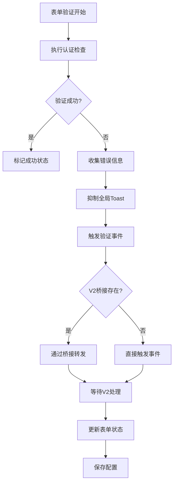
```mermaid
flowchart TD
A[表单验证开始] --> B[执行认证检查]
B --> C{验证成功?}
C --> |是| D[标记成功状态]
C --> |否| E[收集错误信息]
E --> F[抑制全局Toast]
F --> G[触发验证事件]
G --> H{V2桥接存在?}
H --> |是| I[通过桥接转发]
H --> |否| J[直接触发事件]
I --> K[等待V2处理]
J --> K
K --> L[更新表单状态]
L --> M[保存配置]
```

**图表来源**
- [CommonBlogSetting.vue:143-200](file://src/components/set/publish/singleplatform/base/CommonBlogSetting.vue#L143-L200)

V1 表单的改进：

1. **完整事件载荷**: 传递 `errorMessage` 和 `errorDetails` 字段
2. **条件 Toast**: 在 V2 桥接模式下抑制全局 Toast
3. **双向兼容**: 保持与 V1 独立设置页面的兼容性
4. **错误状态同步**: 同步 `apiStatus` 和 `isAuth` 状态

### 敏感信息脱敏

系统使用 `sensitiveLogSanitizer` 工具进行敏感信息脱敏：

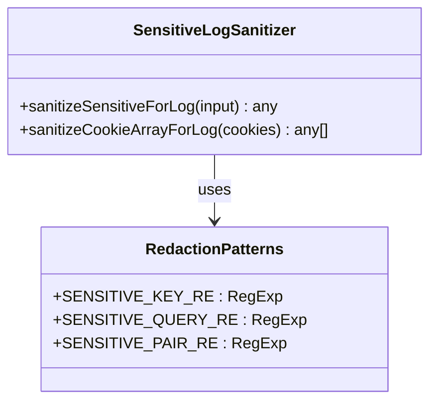
```mermaid
classDiagram
class SensitiveLogSanitizer {
+sanitizeSensitiveForLog(input) any
+sanitizeCookieArrayForLog(cookies) any[]
}
class RedactionPatterns {
+SENSITIVE_KEY_RE : RegExp
+SENSITIVE_QUERY_RE : RegExp
+SENSITIVE_PAIR_RE : RegExp
}
SensitiveLogSanitizer --> RedactionPatterns : uses
```

**图表来源**
- [sensitiveLogSanitizer.ts:12-62](file://src/utils/sensitiveLogSanitizer.ts#L12-L62)

脱敏策略：

1. **多层脱敏**: 支持查询参数、头部字段和 JSON 对象的递归脱敏
2. **安全保护**: 自动识别 Cookie、Authorization、Token 等敏感字段
3. **一致性**: 与发布链路的脱敏策略保持一致
4. **性能优化**: 避免不必要的字符串操作

### 错误验证契约

系统定义了标准的 `V2PlatformConfigValidationResult` 契约：

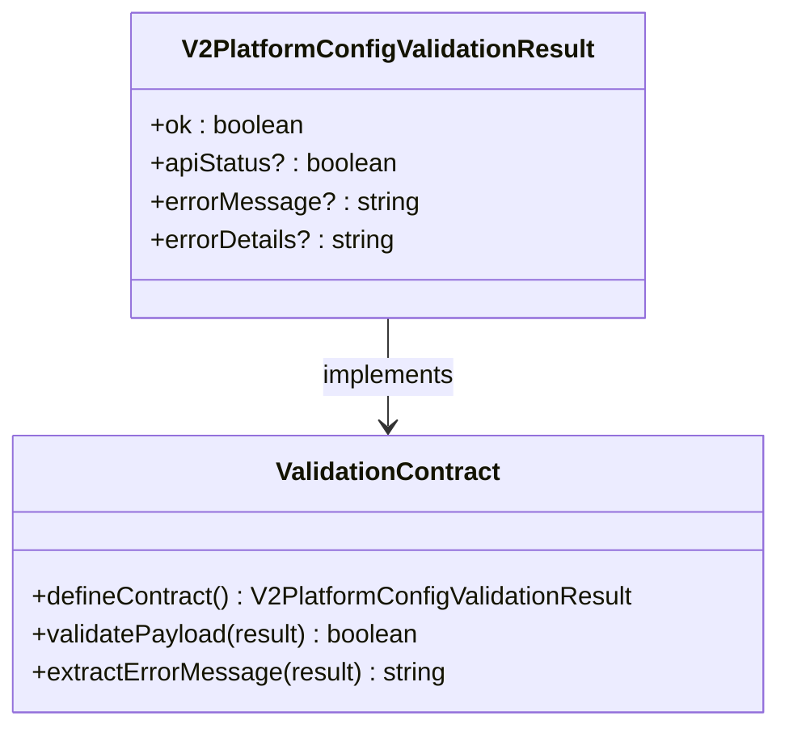
```mermaid
classDiagram
class V2PlatformConfigValidationResult {
+ok : boolean
+apiStatus? : boolean
+errorMessage? : string
+errorDetails? : string
}
class ValidationContract {
+defineContract() V2PlatformConfigValidationResult
+validatePayload(result) boolean
+extractErrorMessage(result) string
}
V2PlatformConfigValidationResult --> ValidationContract : implements
```

**图表来源**
- [platformConfigActionBridge.ts:12-15](file://src/components/v2/settings/bridge/platformConfigActionBridge.ts#L12-L15)

契约要求：

1. **必需字段**: `ok` 字段必须始终存在
2. **可选字段**: `apiStatus`、`errorMessage`、`errorDetails` 可选
3. **类型安全**: TypeScript 接口确保类型一致性
4. **向后兼容**: 保持与现有代码的兼容性

### 错误状态管理

系统通过 `useV2ErrorDetails` 组合式函数提供统一的错误状态管理：

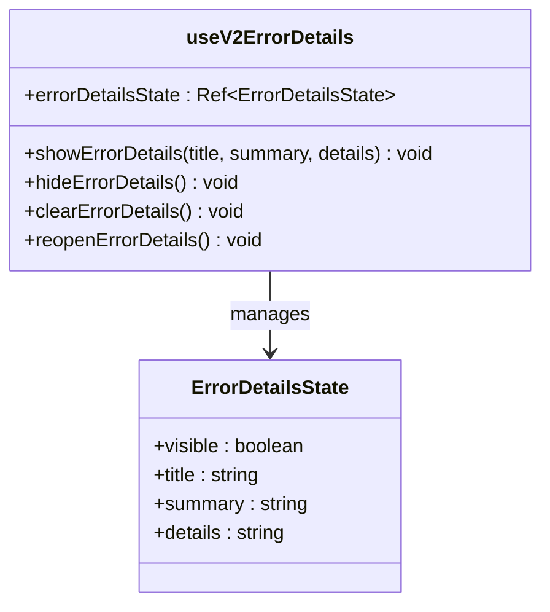
```mermaid
classDiagram
class useV2ErrorDetails {
+errorDetailsState : Ref~ErrorDetailsState~
+showErrorDetails(title, summary, details) void
+hideErrorDetails() void
+clearErrorDetails() void
+reopenErrorDetails() void
}
class ErrorDetailsState {
+visible : boolean
+title : string
+summary : string
+details : string
}
useV2ErrorDetails --> ErrorDetailsState : manages
```

**图表来源**
- [useV2ErrorDetails.ts:20-67](file://src/composables/v2/useV2ErrorDetails.ts#L20-L67)

状态管理功能：

1. **集中状态**: 统一管理错误详情的状态
2. **脱敏处理**: 自动对错误信息进行敏感信息脱敏
3. **生命周期管理**: 提供显示、隐藏、清理和重新打开功能
4. **响应式更新**: 基于 Vue 响应式系统的状态管理

### 验证流程测试

系统包含完整的测试覆盖，确保验证流程的正确性：

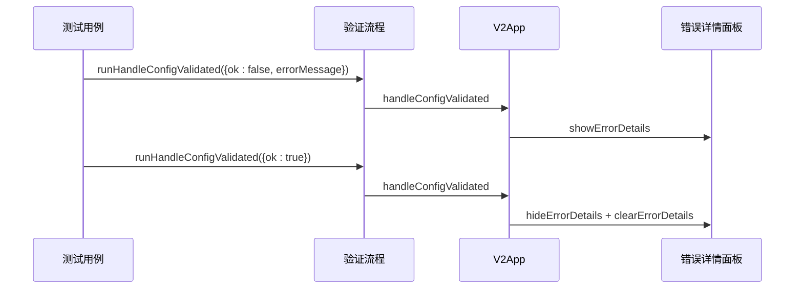
```mermaid
sequenceDiagram
participant Test as 测试用例
participant Flow as 验证流程
participant App as V2App
participant Panel as 错误详情面板
Test->>Flow : runHandleConfigValidated({ok : false, errorMessage})
Flow->>App : handleConfigValidated
App->>Panel : showErrorDetails
Test->>Flow : runHandleConfigValidated({ok : true})
Flow->>App : handleConfigValidated
App->>Panel : hideErrorDetails + clearErrorDetails
```

**图表来源**
- [v2ConfigValidatedFlow.spec.ts:40-63](file://src/components/v2/v2ConfigValidatedFlow.spec.ts#L40-L63)

测试覆盖范围：

1. **失败场景**: 验证失败时显示错误详情面板
2. **成功场景**: 验证成功时隐藏并清理错误状态
3. **状态保持**: 隐藏时保留标题以便重新打开
4. **完整性**: 确保所有状态都被正确清理

**章节来源**
- [SypErrorDetailsPanel.vue:1-267](file://src/components/v2/common/SypErrorDetailsPanel.vue#L1-L267)
- [V2App.vue:178-190](file://src/components/v2/V2App.vue#L178-L190)
- [V2PlatformConfigBridge.vue:1-264](file://src/components/v2/settings/V2PlatformConfigBridge.vue#L1-L264)
- [platformConfigActionBridge.ts:1-20](file://src/components/v2/settings/bridge/platformConfigActionBridge.ts#L1-L20)
- [CommonBlogSetting.vue:1-200](file://src/components/set/publish/singleplatform/base/CommonBlogSetting.vue#L1-L200)
- [sensitiveLogSanitizer.ts:1-63](file://src/utils/sensitiveLogSanitizer.ts#L1-L63)
- [useV2ErrorDetails.ts:1-67](file://src/composables/v2/useV2ErrorDetails.ts#L1-L67)
- [v2ConfigValidatedFlow.spec.ts:1-82](file://src/components/v2/v2ConfigValidatedFlow.spec.ts#L1-L82)
- [design.md:16-31](file://openspec/changes/expose-v2-platform-config-validation-errors/design.md#L16-L31)
- [proposal.md:13-31](file://openspec/changes/expose-v2-platform-config-validation-errors/proposal.md#L13-L31)
- [tasks.md:1-30](file://openspec/changes/expose-v2-platform-config-validation-errors/tasks.md#L1-L30)
- [v2-hosted-error-details/spec.md:1-52](file://openspec/changes/expose-v2-platform-config-validation-errors/specs/v2-hosted-error-details/spec.md#L1-L52)
- [v2-platform-config-validation-feedback/spec.md:31-52](file://openspec/changes/expose-v2-platform-config-validation-errors/specs/v2-platform-config-validation-feedback/spec.md#L31-L52)

## Docsify 子平台支持

**新增** Docsify 子平台支持为静态网站生成器提供了完整的发布能力。

### Docsify 平台类型定义

Docsify 子平台类型在 `SubPlatformType` 枚举中定义：

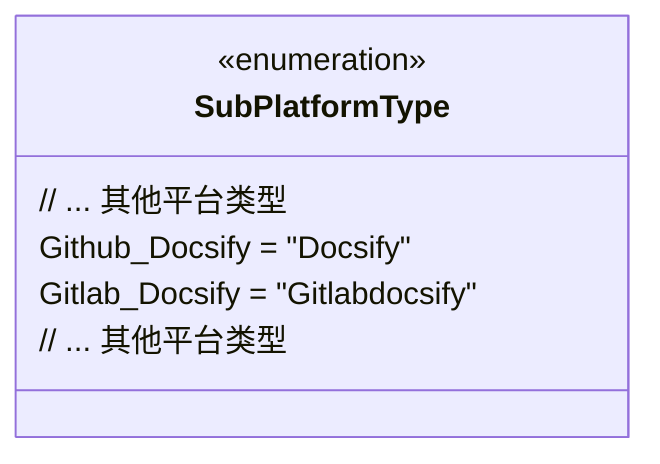
```mermaid
classDiagram
class SubPlatformType {
<<enumeration>>
// ... 其他平台类型
Github_Docsify = "Docsify"
Gitlab_Docsify = "Gitlabdocsify"
// ... 其他平台类型
}
```

**图表来源**
- [dynamicConfig.ts:192](file://src/platforms/dynamicConfig.ts#L192)
- [dynamicConfig.ts:203](file://src/platforms/dynamicConfig.ts#L203)

### Docsify 平台预定义配置

Docsify 平台在 `pre.ts` 文件中进行了预定义配置：

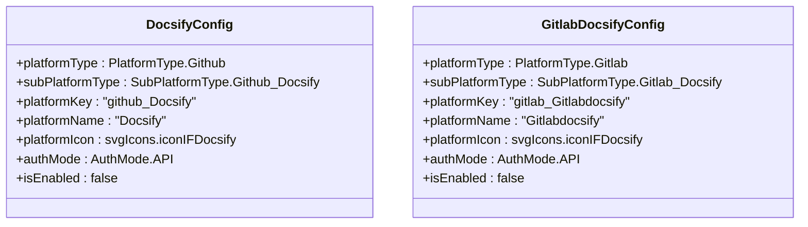
```mermaid
classDiagram
class DocsifyConfig {
+platformType : PlatformType.Github
+subPlatformType : SubPlatformType.Github_Docsify
+platformKey : "github_Docsify"
+platformName : "Docsify"
+platformIcon : svgIcons.iconIFDocsify
+authMode : AuthMode.API
+isEnabled : false
}
class GitlabDocsifyConfig {
+platformType : PlatformType.Gitlab
+subPlatformType : SubPlatformType.Gitlab_Docsify
+platformKey : "gitlab_Gitlabdocsify"
+platformName : "Gitlabdocsify"
+platformIcon : svgIcons.iconIFDocsify
+authMode : AuthMode.API
+isEnabled : false
}
```

**图表来源**
- [pre.ts:224](file://src/platforms/pre.ts#L224)
- [pre.ts:298](file://src/platforms/pre.ts#L298)

### Docsify API 适配器实现

Docsify 平台提供了专门的 API 适配器：

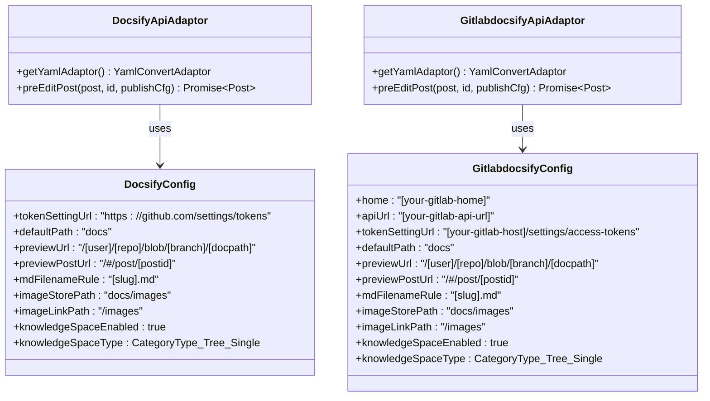
```mermaid
classDiagram
class DocsifyApiAdaptor {
+getYamlAdaptor() YamlConvertAdaptor
+preEditPost(post, id, publishCfg) Promise~Post~
}
class GitlabdocsifyApiAdaptor {
+getYamlAdaptor() YamlConvertAdaptor
+preEditPost(post, id, publishCfg) Promise~Post~
}
class DocsifyConfig {
+tokenSettingUrl : "https : //github.com/settings/tokens"
+defaultPath : "docs"
+previewUrl : "/[user]/[repo]/blob/[branch]/[docpath]"
+previewPostUrl : "/#/post/[postid]"
+mdFilenameRule : "[slug].md"
+imageStorePath : "docs/images"
+imageLinkPath : "/images"
+knowledgeSpaceEnabled : true
+knowledgeSpaceType : CategoryType_Tree_Single
}
class GitlabdocsifyConfig {
+home : "[your-gitlab-home]"
+apiUrl : "[your-gitlab-api-url]"
+tokenSettingUrl : "[your-gitlab-host]/settings/access-tokens"
+defaultPath : "docs"
+previewUrl : "/[user]/[repo]/blob/[branch]/[docpath]"
+previewPostUrl : "/#/post/[postid]"
+mdFilenameRule : "[slug].md"
+imageStorePath : "docs/images"
+imageLinkPath : "/images"
+knowledgeSpaceEnabled : true
+knowledgeSpaceType : CategoryType_Tree_Single
}
DocsifyApiAdaptor --> DocsifyConfig : uses
GitlabdocsifyApiAdaptor --> GitlabdocsifyConfig : uses
```

**图表来源**
- [docsifyApiAdaptor.ts:23](file://src/adaptors/api/docsify/docsifyApiAdaptor.ts#L23)
- [gitlabdocsifyApiAdaptor.ts:23](file://src/adaptors/api/gitlab-docsify/gitlabdocsifyApiAdaptor.ts#L23)
- [docsifyConfig.ts:19](file://src/adaptors/api/docsify/docsifyConfig.ts#L19)
- [gitlabdocsifyConfig.ts:20](file://src/adaptors/api/gitlab-docsify/gitlabdocsifyConfig.ts#L20)

### Docsify 适配器索引配置

Docsify 适配器在适配器索引中进行了注册：

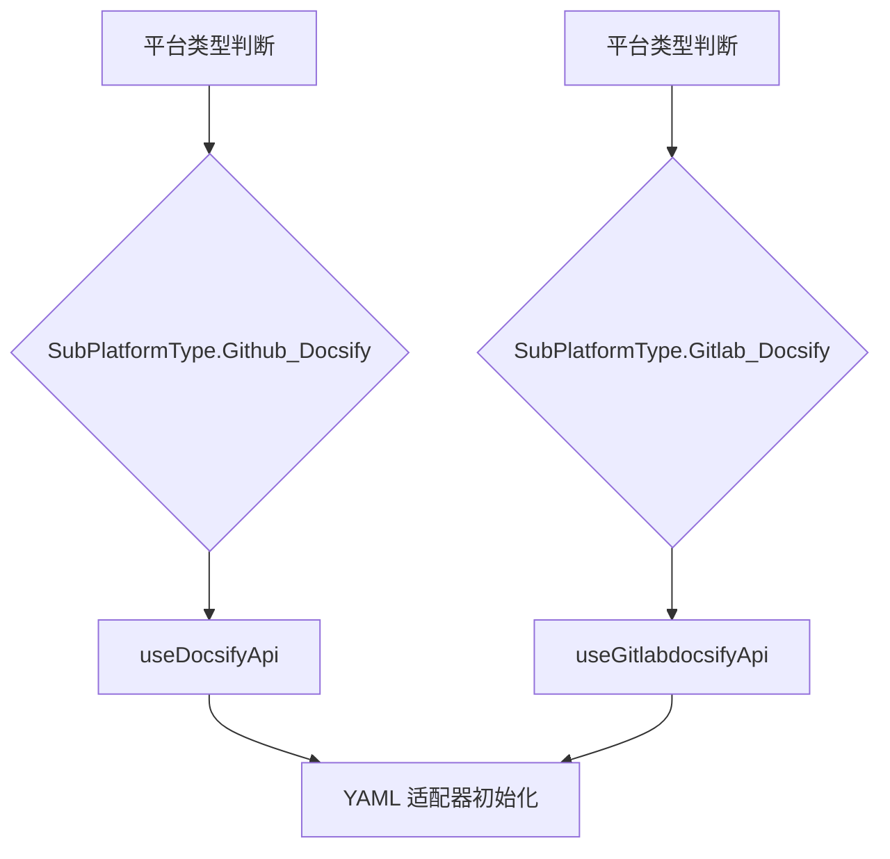
```mermaid
flowchart TD
A[平台类型判断] --> B{SubPlatformType.Github_Docsify}
B --> C[useDocsifyApi]
D[平台类型判断] --> E{SubPlatformType.Gitlab_Docsify}
E --> F[useGitlabdocsifyApi]
C --> G[YAML 适配器初始化]
F --> G
```

**图表来源**
- [adaptors/index.ts:542](file://src/adaptors/index.ts#L542)
- [adaptors/index.ts:582](file://src/adaptors/index.ts#L582)

### Docsify 图标支持

Docsify 平台使用专门的 SVG 图标：

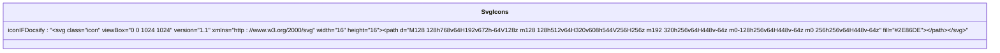
```mermaid
classDiagram
class SvgIcons {
iconIFDocsify : "<svg t='1773592921880' class='icon' viewBox='0 0 1024 1024' version='1.1' xmlns='http : //www.w3.org/2000/svg' p-id='7893' width='16' height='16'><path d='M128 128h768v64H192v672h-64V128z m128 128h512v64H320v608h544V256H256z m192 320h256v64H448v-64z m0-128h256v64H448v-64z m0 256h256v64H448v-64z' fill='#2E86DE' p-id='7894'></path></svg>"
}
```

**图表来源**
- [svgIcons.ts:53](file://src/utils/svgIcons.ts#L53)

**章节来源**
- [dynamicConfig.ts:174-242](file://src/platforms/dynamicConfig.ts#L174-L242)
- [pre.ts:222-304](file://src/platforms/pre.ts#L222-L304)
- [docsifyApiAdaptor.ts:1-63](file://src/adaptors/api/docsify/docsifyApiAdaptor.ts#L1-L63)
- [gitlabdocsifyApiAdaptor.ts:1-63](file://src/adaptors/api/gitlab-docsify/gitlabdocsifyApiAdaptor.ts#L1-L63)
- [docsifyConfig.ts:1-53](file://src/adaptors/api/docsify/docsifyConfig.ts#L1-L53)
- [gitlabdocsifyConfig.ts:1-56](file://src/adaptors/api/gitlab-docsify/gitlabdocsifyConfig.ts#L1-L56)
- [adaptors/index.ts:540-605](file://src/adaptors/index.ts#L540-L605)
- [svgIcons.ts:50-55](file://src/utils/svgIcons.ts#L50-L55)

## 依赖关系分析

平台配置系统的依赖关系体现了清晰的分层架构：

```mermaid
graph TB
subgraph "外部依赖"
A[zhi-blog-api]
B[@vueuse/core]
C[zhi-common]
D[zhi-device]
E[zhi-siyuan-api]
end
subgraph "内部模块"
F[配置模型]
G[存储层]
H[配置管理]
I[平台支持]
J[Docsify 适配器]
K[错误详情面板]
L[脱敏工具]
M[平台配置桥接]
N[V1表单集成]
O[错误状态管理]
P[验证契约]
Q[桥接注册表]
R[测试覆盖]
end
subgraph "应用层"
S[发布配置钩子]
T[设置界面]
U[平台适配器]
V[Docsify API]
W[V2应用程序]
X[错误处理]
Y[V1表单]
Z[V2桥接]
end
A --> F
B --> G
C --> F
D --> G
E --> F
F --> G
G --> H
H --> I
I --> J
J --> V
V --> S
S --> T
S --> U
U --> W
W --> K
K --> O
M --> N
N --> X
P --> X
Q --> M
R --> W
```

**图表来源**
- [dynamicConfig.ts:1-534](file://src/platforms/dynamicConfig.ts#L1-L534)
- [usePublishSettingStore.ts:1-95](file://src/stores/usePublishSettingStore.ts#L1-L95)
- [SypErrorDetailsPanel.vue:1-267](file://src/components/v2/common/SypErrorDetailsPanel.vue#L1-L267)
- [platformConfigActionBridge.ts:1-20](file://src/components/v2/settings/bridge/platformConfigActionBridge.ts#L1-L20)
- [bridgeRegistry.ts:1-85](file://src/components/v2/settings/bridge/bridgeRegistry.ts#L1-L85)

依赖关系特点：

1. **最小依赖**: 外部依赖数量有限，降低维护成本
2. **接口隔离**: 通过接口定义明确模块边界
3. **循环依赖避免**: 设计上避免了循环依赖问题
4. **可测试性**: 清晰的依赖关系便于单元测试
5. **错误处理**: 新增的错误处理层提供完整的依赖关系
6. **类型安全**: 通过 TypeScript 接口确保类型一致性
7. **状态管理**: 通过组合式函数提供集中式状态管理

**章节来源**
- [constants.ts:1-54](file://src/utils/constants.ts#L1-L54)

## 性能考虑

平台配置系统在设计时充分考虑了性能优化：

### 存储性能优化

1. **缓存策略**: 配置数据在内存中有缓存，减少重复读取
2. **懒加载**: 配置按需加载，避免不必要的初始化
3. **批量操作**: 支持批量配置更新，减少存储操作次数

### 内存管理

1. **响应式更新**: 使用Vue响应式系统，只在必要时更新UI
2. **对象复用**: 配置对象在内存中复用，减少垃圾回收压力
3. **类型优化**: TypeScript类型检查在编译时完成，运行时无额外开销

### 网络优化

1. **异步操作**: 所有网络请求都是异步的，不阻塞主线程
2. **错误重试**: 网络错误有适当的重试机制
3. **超时控制**: 请求超时和取消机制防止资源泄露

### 错误处理性能

1. **延迟初始化**: 错误详情面板按需初始化，避免不必要的渲染
2. **虚拟滚动**: 错误详情内容使用虚拟滚动，支持大量文本的高效显示
3. **防抖处理**: 错误状态切换使用防抖，避免频繁的UI更新
4. **内存清理**: 错误状态自动清理，防止内存泄漏
5. **脱敏优化**: 敏感信息脱敏使用高效的正则表达式，避免性能瓶颈

## 故障排除指南

### 常见问题及解决方案

#### 配置加载失败

**问题症状**: 应用启动时配置无法加载

**可能原因**:
1. 存储权限问题
2. 配置文件损坏
3. 网络连接异常

**解决步骤**:
1. 检查存储权限设置
2. 验证配置文件格式
3. 确认网络连接状态

#### 平台配置无效

**问题症状**: 添加的平台配置无法使用

**可能原因**:
1. 认证信息错误
2. 平台类型选择错误
3. 网络连接问题

**解决步骤**:
1. 重新输入认证信息
2. 确认平台类型正确
3. 测试网络连接

#### Docsify 平台问题

**问题症状**: Docsify 平台配置或发布失败

**可能原因**:
1. Docsify 配置路径错误
2. YAML 前言元数据格式问题
3. 知识空间配置不匹配

**解决步骤**:
1. 检查 Docsify 配置路径设置
2. 验证 Markdown 文件的 YAML 前言格式
3. 确认知识空间树形结构配置

#### 错误详情面板问题

**问题症状**: 错误详情面板无法显示或显示异常

**可能原因**:
1. 错误状态未正确设置
2. 敏感信息脱敏导致内容异常
3. 面板组件渲染问题

**解决步骤**:
1. 检查 `errorDetailsState` 的设置
2. 验证错误信息的格式和内容
3. 确认面板组件的依赖注入

#### 平台配置验证失败

**问题症状**: 平台配置验证失败但无详细错误信息

**可能原因**:
1. V2 桥接未正确配置
2. 验证事件未正确透传
3. 错误信息格式不符合契约

**解决步骤**:
1. 检查 V2 平台配置桥接的注入
2. 验证 `emitValidated` 的事件载荷
3. 确认错误信息符合 `V2PlatformConfigValidationResult` 契约

#### V1 表单 Toast 重复

**问题症状**: V1 表单在 V2 桥接模式下出现重复的 Toast 提示

**可能原因**:
1. V1 表单未正确检测 V2 桥接的存在
2. 错误的条件判断逻辑

**解决步骤**:
1. 检查 `v2ActionBridge` 的注入状态
2. 验证条件 Toast 的逻辑判断
3. 确认仅在 V2 桥接不存在时显示 Toast

#### 错误状态管理问题

**问题症状**: 错误状态无法正确清理或重新打开

**可能原因**:
1. `useV2ErrorDetails` 组合式函数使用不当
2. 错误状态生命周期管理问题

**解决步骤**:
1. 检查 `clearErrorDetails` 的调用时机
2. 验证 `reopenErrorDetails` 的使用场景
3. 确认错误状态的响应式更新

#### 性能问题

**问题症状**: 应用响应缓慢

**可能原因**:
1. 配置数据过大
2. 存储操作频繁
3. 内存泄漏
4. 错误详情面板渲染性能问题
5. 敏感信息脱敏性能瓶颈

**解决步骤**:
1. 清理不必要的配置
2. 减少存储操作频率
3. 检查内存使用情况
4. 优化错误详情面板的渲染
5. 检查脱敏算法的性能表现

**章节来源**
- [utils.ts:1-97](file://src/utils/utils.ts#L1-L97)
- [SypErrorDetailsPanel.spec.ts:1-62](file://src/components/v2/common/SypErrorDetailsPanel.spec.ts#L1-L62)

## 结论

平台配置系统通过精心设计的架构和实现，为思源插件发布器提供了强大而灵活的配置管理能力。系统的主要优势包括：

1. **高度模块化**: 清晰的模块划分便于维护和扩展
2. **多环境支持**: 同时支持思源笔记和浏览器环境
3. **类型安全**: 完整的TypeScript类型定义
4. **性能优化**: 多层次的性能优化策略
5. **易于使用**: 简洁的API设计和丰富的配置选项

**更新** 新增的平台配置验证错误详情面板功能进一步增强了系统的用户体验和诊断能力。该功能的主要改进包括：

- **统一错误展示**: 基于 `SypErrorDetailsPanel` 组件提供一致的错误展示体验
- **详细诊断信息**: 支持完整的错误摘要和可复制的详细诊断
- **敏感信息脱敏**: 自动识别和脱敏 Cookie、Authorization、Token 等敏感字段
- **V2 桥接集成**: 与现有的 V2 平台配置桥接无缝集成
- **向后兼容**: 保持与 V1 表单的兼容性，逐步迁移
- **类型安全**: 通过 `V2PlatformConfigValidationResult` 接口确保契约一致性
- **状态管理**: 通过 `useV2ErrorDetails` 提供集中式的错误状态管理
- **测试覆盖**: 完整的单元测试确保验证流程的正确性

该系统为未来的功能扩展奠定了坚实的基础，能够支持更多发布平台的集成和更复杂的配置需求。通过持续的优化和改进，平台配置系统将继续为用户提供优秀的配置管理体验。

**新增功能特性总结**:

1. **错误详情面板**: 提供详细的错误诊断信息，替代简单的错误消息
2. **统一错误处理**: 在 `.syp-v2` 容器内展示错误详情，避免全局 Toast 的限制
3. **敏感信息保护**: 自动脱敏敏感字段，确保安全的错误信息展示
4. **可复制诊断**: 支持一键复制完整的错误详情，便于用户反馈问题
5. **无障碍支持**: 支持键盘导航和屏幕阅读器，提升可访问性
6. **性能优化**: 按需渲染和虚拟滚动，支持大量错误信息的高效展示
7. **类型安全**: 完整的 TypeScript 类型定义，确保契约的一致性
8. **向后兼容**: 保持与现有代码的兼容性，支持渐进式迁移
9. **状态管理**: 通过组合式函数提供集中式的错误状态管理
10. **测试保障**: 完整的单元测试覆盖验证流程的各个方面

这些改进显著提升了平台配置系统的用户体验和诊断能力，为用户提供了更好的问题排查和故障排除体验。