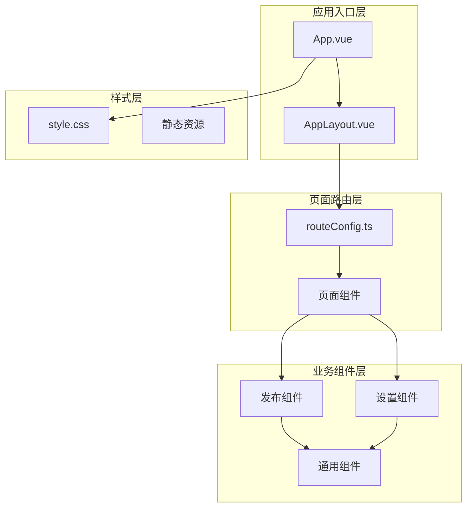
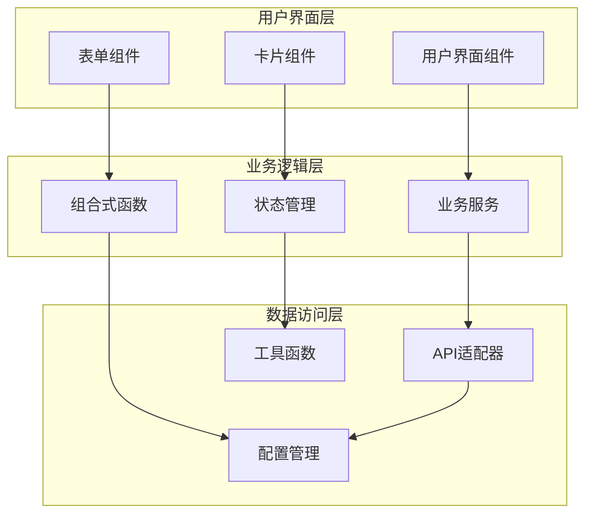
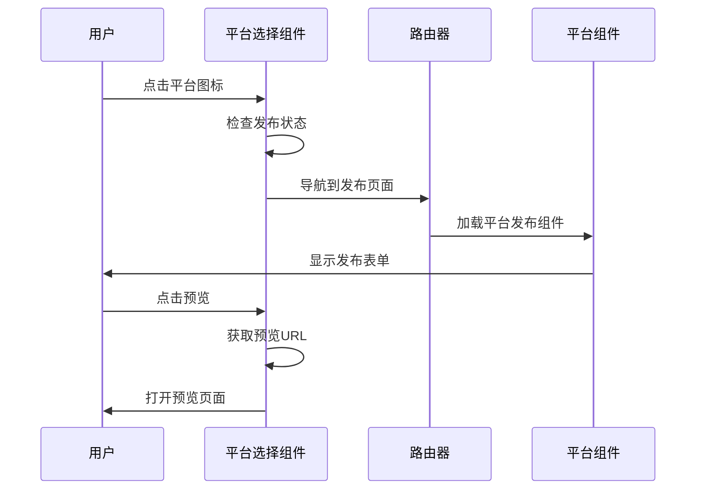
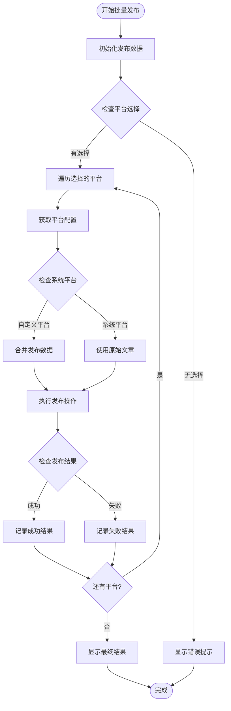
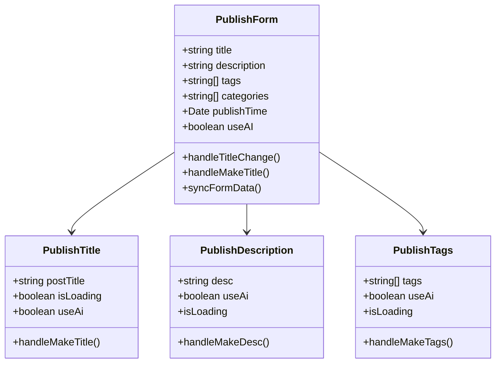
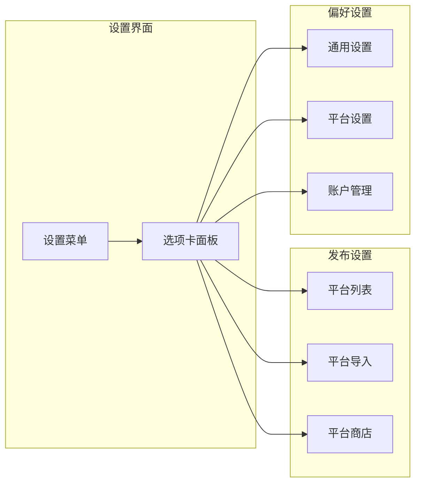
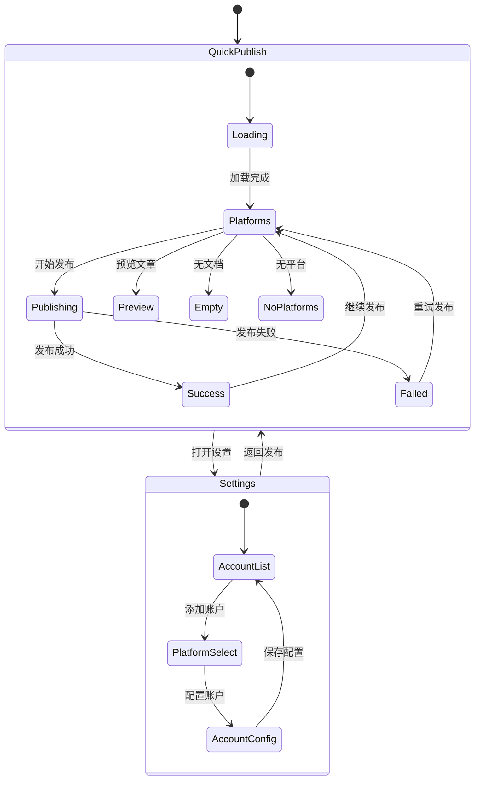
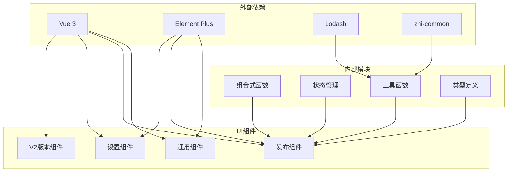

# 用户界面组件

<cite>
**本文档引用的文件**
- [README_zh_CN.md](file://README_zh_CN.md)
- [App.vue](file://src/App.vue)
- [AppLayout.vue](file://src/layouts/AppLayout.vue)
- [routeConfig.ts](file://src/routes/routeConfig.ts)
- [SinglePublish.vue](file://src/pages/SinglePublish.vue)
- [BatchPublish.vue](file://src/pages/BatchPublish.vue)
- [SinglePublishSelectPlatform.vue](file://src/components/publish/SinglePublishSelectPlatform.vue)
- [BatchPublishIndex.vue](file://src/components/publish/BatchPublishIndex.vue)
- [BackPage.vue](file://src/components/common/BackPage.vue)
- [PublishTitle.vue](file://src/components/publish/form/PublishTitle.vue)
- [PublishSetting.vue](file://src/components/set/PublishSetting.vue)
- [SetIndex.vue](file://src/components/set/SetIndex.vue)
- [V2App.vue](file://src/components/v2/V2App.vue)
- [style.css](file://src/assets/style.css)
</cite>

## 目录
1. [简介](#简介)
2. [项目结构](#项目结构)
3. [核心组件](#核心组件)
4. [架构概览](#架构概览)
5. [详细组件分析](#详细组件分析)
6. [依赖关系分析](#依赖关系分析)
7. [性能考虑](#性能考虑)
8. [故障排除指南](#故障排除指南)
9. [结论](#结论)

## 简介

思源笔记发布工具是一个基于 Vue 3 的现代化发布平台集成应用，支持将思源笔记内容发布到多个平台，包括语雀、WordPress、Hugo、Hexo 等。该应用采用模块化设计，提供了完整的用户界面组件体系，涵盖单篇文章发布、批量分发、设置管理等功能模块。

## 项目结构

该项目采用清晰的分层架构设计，主要包含以下几个核心层次：

**图表来源**
- [App.vue:10-25](file://src/App.vue#L10-L25)
- [AppLayout.vue:10-24](file://src/layouts/AppLayout.vue#L10-L24)
- [routeConfig.ts:42-151](file://src/routes/routeConfig.ts#L42-L151)

**章节来源**
- [App.vue:10-25](file://src/App.vue#L10-L25)
- [AppLayout.vue:18-23](file://src/layouts/AppLayout.vue#L18-L23)
- [routeConfig.ts:42-151](file://src/routes/routeConfig.ts#L42-L151)

## 核心组件

### 应用主组件

应用的根组件负责整体布局和样式管理，采用 Suspense 模式确保组件的异步加载。

### 页面路由系统

应用通过 Vue Router 实现多页面路由管理，支持以下主要路由：

- **极速发布**: `/publish/quickSelect` - 快速发布选择平台
- **常规发布**: `/publish/singlePublish` - 单文章发布流程
- **批量分发**: `/publish/batchPublish` - 多平台批量发布
- **设置管理**: `/setting` - 应用设置界面
- **测试页面**: `/test` - 各平台测试功能

### 发布组件体系

应用提供完整的发布组件生态系统，包括：

- **平台选择组件**: 支持多种发布平台的可视化选择
- **表单组件**: 包含标题、描述、标签、分类等发布表单
- **批量处理组件**: 支持多平台同时发布和管理
- **设置组件**: 平台配置、偏好设置等管理功能

**章节来源**
- [SinglePublishSelectPlatform.vue:10-272](file://src/components/publish/SinglePublishSelectPlatform.vue#L10-L272)
- [BatchPublishIndex.vue:10-586](file://src/components/publish/BatchPublishIndex.vue#L10-L586)
- [PublishTitle.vue:10-132](file://src/components/publish/form/PublishTitle.vue#L10-L132)

## 架构概览

应用采用组件化的架构设计，通过组合模式实现功能模块的灵活组合：

**图表来源**
- [SinglePublishSelectPlatform.vue:10-272](file://src/components/publish/SinglePublishSelectPlatform.vue#L10-L272)
- [BatchPublishIndex.vue:10-586](file://src/components/publish/BatchPublishIndex.vue#L10-L586)

## 详细组件分析

### 单文章发布组件

SinglePublishSelectPlatform 是核心的发布选择组件，提供平台选择和预览功能：

**图表来源**
- [SinglePublishSelectPlatform.vue:62-122](file://src/components/publish/SinglePublishSelectPlatform.vue#L62-L122)

#### 组件特性

- **平台状态显示**: 通过徽章状态显示平台授权和发布状态
- **一键预览功能**: 支持批量预览已发布文章
- **响应式布局**: 支持不同屏幕尺寸的自适应显示
- **国际化支持**: 完整的多语言界面支持

**章节来源**
- [SinglePublishSelectPlatform.vue:152-206](file://src/components/publish/SinglePublishSelectPlatform.vue#L152-L206)

### 批量发布组件

BatchPublishIndex 提供强大的批量发布功能，支持多平台同时操作：

**图表来源**
- [BatchPublishIndex.vue:104-177](file://src/components/publish/BatchPublishIndex.vue#L104-L177)

#### 核心功能

- **分发模式**: 支持覆盖和合并两种发布模式
- **批量操作**: 同时处理多个平台的发布任务
- **结果跟踪**: 实时显示发布进度和结果
- **错误处理**: 完善的异常处理和恢复机制

**章节来源**
- [BatchPublishIndex.vue:333-354](file://src/components/publish/BatchPublishIndex.vue#L333-L354)

### 发布表单组件

发布表单组件提供完整的文章发布配置功能：

**图表来源**
- [PublishTitle.vue:10-132](file://src/components/publish/form/PublishTitle.vue#L10-L132)

#### 组件特点

- **AI集成**: 内置智能标题生成和内容优化功能
- **实时预览**: 支持Markdown和HTML实时预览
- **数据同步**: 自动同步到思源笔记属性
- **模板支持**: 支持发布模板和快捷方式

**章节来源**
- [PublishTitle.vue:79-115](file://src/components/publish/form/PublishTitle.vue#L79-L115)

### 设置管理组件

设置管理组件提供完整的平台配置和偏好设置功能：

**图表来源**
- [PublishSetting.vue:25-62](file://src/components/set/PublishSetting.vue#L25-L62)

**章节来源**
- [PublishSetting.vue:10-70](file://src/components/set/PublishSetting.vue#L10-L70)

### V2 版本组件

V2 版本引入了全新的用户界面设计和交互体验：

**图表来源**
- [V2App.vue:139-315](file://src/components/v2/V2App.vue#L139-L315)

#### 设计特色

- **现代化界面**: 采用简洁直观的设计语言
- **状态管理**: 完善的状态管理和错误处理
- **响应式设计**: 适配不同设备和屏幕尺寸
- **无障碍支持**: 完整的无障碍访问支持

**章节来源**
- [V2App.vue:1-492](file://src/components/v2/V2App.vue#L1-L492)

## 依赖关系分析

应用的组件依赖关系呈现清晰的层次结构：

**图表来源**
- [SinglePublishSelectPlatform.vue:10-29](file://src/components/publish/SinglePublishSelectPlatform.vue#L10-L29)
- [BatchPublishIndex.vue:10-35](file://src/components/publish/BatchPublishIndex.vue#L10-L35)

**章节来源**
- [SinglePublishSelectPlatform.vue:10-29](file://src/components/publish/SinglePublishSelectPlatform.vue#L10-L29)
- [BatchPublishIndex.vue:10-35](file://src/components/publish/BatchPublishIndex.vue#L10-L35)

## 性能考虑

应用在设计时充分考虑了性能优化：

### 渲染优化
- **Suspense 异步加载**: 使用 Suspense 模式优化组件异步渲染
- **懒加载策略**: 路由级别的代码分割和按需加载
- **虚拟滚动**: 大列表数据的虚拟滚动优化

### 数据处理
- **响应式数据**: 使用 Vue 3 的响应式系统优化数据更新
- **缓存机制**: 重要数据的内存缓存和持久化存储
- **批处理**: 大量操作的批处理和防抖处理

### 网络优化
- **请求合并**: 多平台操作的请求合并和去重
- **超时控制**: 网络请求的超时和重试机制
- **离线支持**: 部分功能的离线工作能力

## 故障排除指南

### 常见问题及解决方案

**平台连接问题**
- 检查平台认证状态和API密钥配置
- 验证网络连接和防火墙设置
- 查看平台API限制和配额情况

**发布失败处理**
- 查看详细的错误日志和错误码
- 验证文章内容格式和大小限制
- 检查目标平台的特殊要求和限制

**界面显示异常**
- 清除浏览器缓存和Cookie
- 检查浏览器兼容性和JavaScript启用状态
- 验证CSS样式文件的正确加载

**性能问题诊断**
- 使用浏览器开发者工具监控性能指标
- 检查内存使用和垃圾回收情况
- 分析网络请求和API调用频率

**章节来源**
- [SinglePublishSelectPlatform.vue:86-122](file://src/components/publish/SinglePublishSelectPlatform.vue#L86-L122)
- [BatchPublishIndex.vue:166-177](file://src/components/publish/BatchPublishIndex.vue#L166-L177)

## 结论

思源笔记发布工具的用户界面组件体系展现了现代前端应用的最佳实践。通过模块化设计、组件化架构和完善的用户体验设计，该应用成功地将复杂的多平台发布功能包装成了直观易用的界面。

### 主要优势

- **模块化架构**: 清晰的组件分层和职责分离
- **用户体验**: 直观的界面设计和流畅的交互体验
- **扩展性**: 灵活的架构支持新平台和功能的添加
- **性能优化**: 多层次的性能优化策略

### 技术亮点

- **Vue 3 Composition API**: 现代化的开发模式和更好的类型支持
- **TypeScript 集成**: 完整的类型安全和开发体验
- **响应式设计**: 适配多种设备和屏幕尺寸
- **国际化支持**: 完整的多语言界面支持

该应用为思源笔记用户提供了强大而便捷的内容发布解决方案，是前端组件化开发的优秀案例。