# V2账户列表组件

<cite>
**本文档引用的文件**
- [V2AccountList.vue](file://src/components/v2/settings/V2AccountList.vue)
- [useV2Settings.ts](file://src/composables/v2/useV2Settings.ts)
- [V2PlatformConfigBridge.vue](file://src/components/v2/settings/V2PlatformConfigBridge.vue)
- [V2PlatformSelect.vue](file://src/components/v2/settings/V2PlatformSelect.vue)
- [V2App.vue](file://src/components/v2/V2App.vue)
- [UnifiedWorkspaceShell.vue](file://src/components/v2/layout/UnifiedWorkspaceShell.vue)
- [DrawerBoxBridge.vue](file://src/components/common/DrawerBoxBridge.vue)
- [base.styl](file://src/assets/v2/base.styl)
- [variables.styl](file://src/assets/v2/variables.styl)
- [design.md](file://openspec/changes/refactor-ui-v2-foundation/design.md)
- [zh_CN.json](file://siyuan/i18n/zh_CN.json)
- [en_US.json](file://siyuan/i18n/en_US.json)
</cite>

## 更新摘要
**变更内容**
- V2AccountList组件集成了Element Plus的ElMessageBox确认对话框，提供安全的删除操作确认
- 新增了iOS风格的切换开关控件，提供直观的状态控制体验
- 增强了状态徽章系统，支持四种状态的颜色反馈和视觉提示
- 优化了响应式布局，在小屏幕设备上提供更好的用户体验
- 改进了按钮样式系统，支持警告和危险状态的视觉反馈

## 目录
1. [简介](#简介)
2. [项目结构](#项目结构)
3. [核心组件](#核心组件)
4. [架构概览](#架构概览)
5. [详细组件分析](#详细组件分析)
6. [现代化UI增强功能](#现代化ui增强功能)
7. [交互体验改进](#交互体验改进)
8. [依赖关系分析](#依赖关系分析)
9. [性能考虑](#性能考虑)
10. [故障排除指南](#故障排除指南)
11. [结论](#结论)

## 简介

V2账户列表组件是思源笔记发布工具V2版本中的核心功能模块，负责管理和展示用户配置的各种平台账号。该组件提供了完整的账号生命周期管理，包括账号添加、配置、启用/禁用切换、删除等操作，并通过直观的UI界面展示了每个账号的状态信息。

**重大架构重构**：
- **从iframe通信迁移到直接组件组合**：完全移除了复杂的跨iframe通信机制，采用Vue 3的直接组件通信模式
- **统一工作空间壳体架构**：所有设置页面都基于UnifiedWorkspaceShell进行统一布局和导航
- **新增平台配置桥接组件**：V2PlatformConfigBridge作为平台配置的直接桥接，替代了原有的iframe配置页面
- **简化的组件通信**：通过Vue事件系统实现组件间通信，无需额外的通信层
- **现代化UI增强**：引入Element Plus的确认对话框、iOS风格切换开关和增强的状态徽章系统

该组件采用现代化的设计理念，支持多种平台类型（WordPress、博客园、GitHub、GitLab、自定义平台等），并通过全新的状态徽章系统清晰地展示了每个账号的授权和启用状态。

## 项目结构

V2账户列表组件位于重构后的统一架构中，与相关的设置和平台管理功能紧密集成：

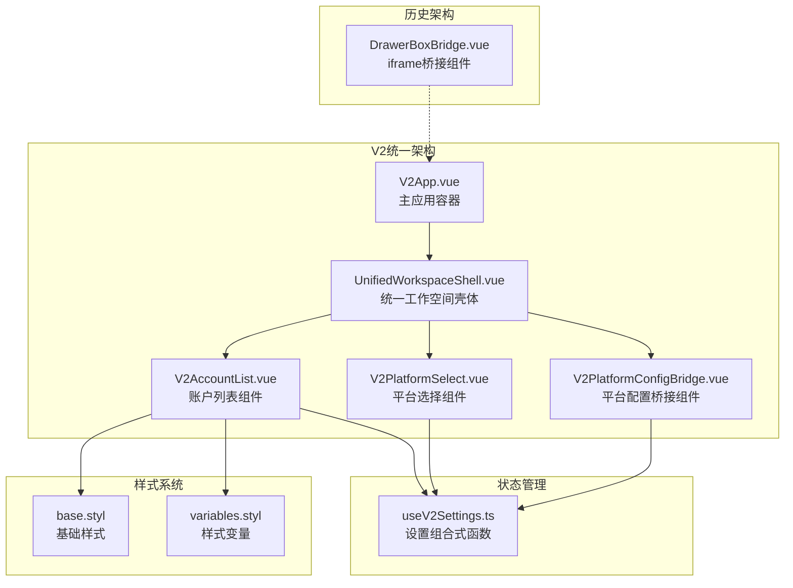

**图表来源**
- [V2App.vue:111-129](file://src/components/v2/V2App.vue#L111-L129)
- [UnifiedWorkspaceShell.vue:1-49](file://src/components/v2/layout/UnifiedWorkspaceShell.vue#L1-L49)
- [V2AccountList.vue:1-287](file://src/components/v2/settings/V2AccountList.vue#L1-L287)
- [V2PlatformConfigBridge.vue:1-175](file://src/components/v2/settings/V2PlatformConfigBridge.vue#L1-L175)

**章节来源**
- [V2App.vue:111-129](file://src/components/v2/V2App.vue#L111-L129)
- [UnifiedWorkspaceShell.vue:1-49](file://src/components/v2/layout/UnifiedWorkspaceShell.vue#L1-L49)

## 核心组件

### V2AccountList组件

V2AccountList是账户列表的主要展示组件，负责渲染和管理所有已配置的平台账号。

#### 主要特性

1. **Element Plus确认对话框**：使用ElMessageBox提供安全的删除操作确认
2. **iOS风格切换开关**：提供直观的状态控制体验，支持启用/禁用切换
3. **增强的状态徽章系统**：支持四种状态的颜色反馈和视觉提示
4. **响应式UI设计**：通过媒体查询优化不同屏幕尺寸的显示效果
5. **改进的按钮样式**：支持警告和危险状态的视觉反馈
6. **直接组件通信**：通过Vue事件系统直接与父组件通信
7. **统一状态管理**：使用useV2Settings组合式函数集中管理账户状态
8. **操作按钮集成**：提供添加、配置、删除和启用/禁用切换功能
9. **空状态处理**：当没有配置任何账号时显示友好的提示信息
10. **图标支持**：支持SVG图标和平台名称首字母作为账号图标

#### 数据结构

组件接收`V2AccountItem`类型的数组作为输入，每个项目包含以下关键字段：

| 字段名 | 类型 | 描述 |
|--------|------|------|
| platformKey | string | 平台唯一标识符 |
| platformName | string | 平台显示名称 |
| platformIcon | string | SVG图标代码 |
| isEnabled | boolean | 是否已启用 |
| isAuth | boolean | 是否已授权 |
| statusType | "success" \| "warning" \| "error" \| "neutral" | 状态类型 |
| statusLabel | string | 状态标签文本 |
| statusText | string | 状态详细说明 |

**章节来源**
- [V2AccountList.vue:20-123](file://src/components/v2/settings/V2AccountList.vue#L20-L123)
- [useV2Settings.ts:20-29](file://src/composables/v2/useV2Settings.ts#L20-L29)

## 架构概览

V2账户列表组件采用了统一的架构设计，移除了复杂的iframe通信模式：

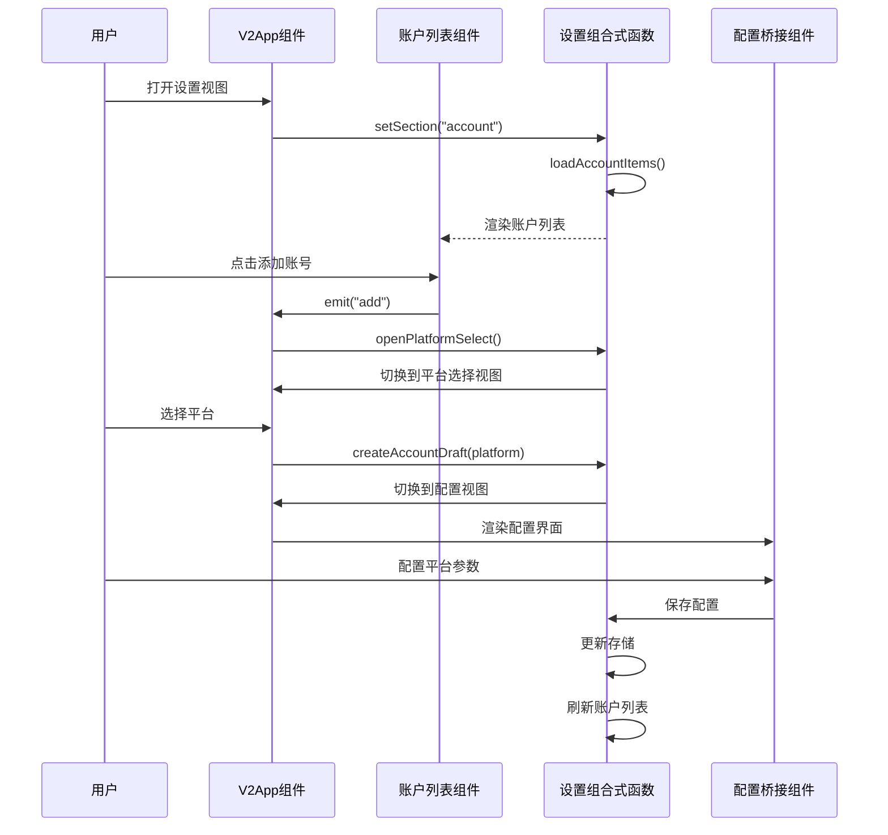

**图表来源**
- [V2App.vue:111-129](file://src/components/v2/V2App.vue#L111-L129)
- [useV2Settings.ts:126-140](file://src/composables/v2/useV2Settings.ts#L126-L140)

### 状态管理流程

组件的状态管理遵循Vue 3的响应式设计原则，通过组合式函数实现状态的集中管理：

**图表来源**
- [useV2Settings.ts:80-124](file://src/composables/v2/useV2Settings.ts#L80-L124)
- [useV2Settings.ts:158-171](file://src/composables/v2/useV2Settings.ts#L158-L171)

**章节来源**
- [useV2Settings.ts:43-59](file://src/composables/v2/useV2Settings.ts#L43-L59)
- [useV2Settings.ts:80-124](file://src/composables/v2/useV2Settings.ts#L80-L124)

## 详细组件分析

### V2AccountList组件实现

#### 模板结构分析

组件采用语义化的HTML结构，通过CSS类名实现统一的视觉风格：

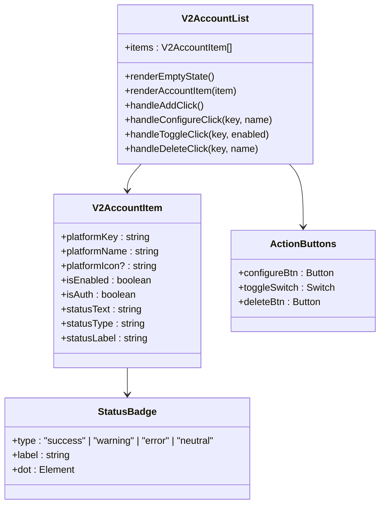

**图表来源**
- [V2AccountList.vue:19-100](file://src/components/v2/settings/V2AccountList.vue#L19-L100)
- [useV2Settings.ts:20-29](file://src/composables/v2/useV2Settings.ts#L20-L29)

#### 样式系统设计

组件采用了基于Stylus的全新样式系统，实现了响应式的UI设计：

**飞书/字节设计令牌**：
| 设计令牌 | 值 | 用途 |
|----------|----|------|
| `$color-success` | `#00B42A` | 成功状态颜色 |
| `$color-success-bg` | `#E8FFEA` | 成功状态背景色 |
| `$color-warning` | `#FF7D00` | 警告状态颜色 |
| `$color-warning-bg` | `#FFF7E8` | 警告状态背景色 |
| `$color-error` | `#F53F3F` | 错误状态颜色 |
| `$color-error-bg` | `#FFECE8` | 错误状态背景色 |
| `$color-neutral` | `#86909C` | 中性状态颜色 |
| `$color-neutral-bg` | `#F2F3F5` | 中性状态背景色 |
| `$text-primary` | `#1D2129` | 主要文字颜色 |
| `$text-secondary` | `#4E5969` | 次要文字颜色 |
| `$text-tertiary` | `#86909C` | 第三文字颜色 |
| `$border-color` | `#E5E6EB` | 边框颜色 |
| `$bg-hover` | `#F7F8FA` | 悬停背景色 |
| `$bg-card` | `#FFFFFF` | 卡片背景色 |
| `$radius-sm` | `6px` | 小圆角半径 |
| `$radius-md` | `8px` | 中圆角半径 |
| `$radius-lg` | `12px` | 大圆角半径 |
| `$gap-sm` | `8px` | 小间距 |
| `$gap-md` | `12px` | 中间距 |
| `$gap-lg` | `16px` | 大间距 |

**章节来源**
- [V2AccountList.vue:103-287](file://src/components/v2/settings/V2AccountList.vue#L103-L287)

### 状态计算逻辑

组件的核心状态计算逻辑位于`useV2Settings`组合式函数中，实现了复杂的业务逻辑：

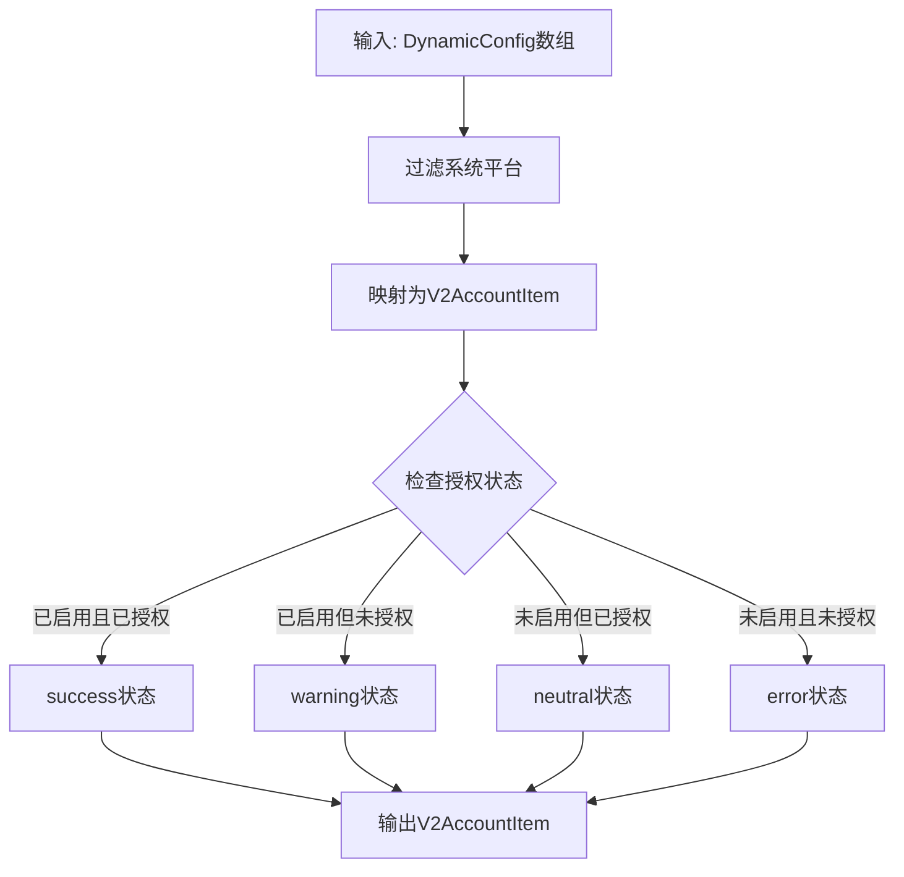

**图表来源**
- [useV2Settings.ts:87-123](file://src/composables/v2/useV2Settings.ts#L87-L123)

#### 状态转换规则

| 启用状态 | 授权状态 | 状态类型 | 标签 | 提示文本 | 徽章颜色 |
|----------|----------|----------|------|----------|----------|
| true | true | success | 运行中 | 已启用 · 已授权 | 绿色背景 |
| true | false | warning | 需授权 | 已启用 · 未授权 | 橙色背景 |
| false | true | neutral | 已禁用 | 未启用 · 已授权 | 灰色背景 |
| false | false | error | 未启用 | 未启用 · 未授权 | 红色背景 |

**章节来源**
- [useV2Settings.ts:95-111](file://src/composables/v2/useV2Settings.ts#L95-L111)

### 平台选择功能

V2平台选择组件提供了用户友好的平台添加体验：

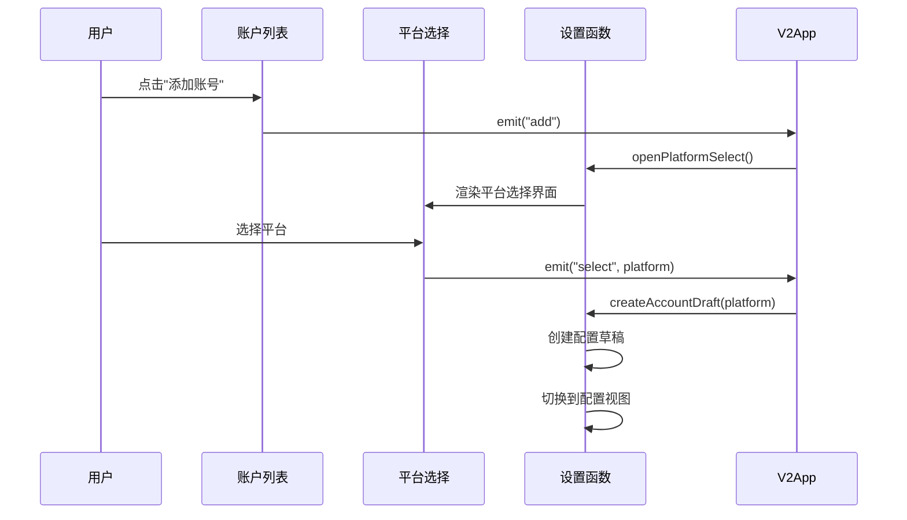

**图表来源**
- [V2PlatformSelect.vue:12-28](file://src/components/v2/settings/V2PlatformSelect.vue#L12-L28)
- [useV2Settings.ts:173-210](file://src/composables/v2/useV2Settings.ts#L173-L210)

**章节来源**
- [V2PlatformSelect.vue:1-106](file://src/components/v2/settings/V2PlatformSelect.vue#L1-L106)
- [useV2Settings.ts:173-210](file://src/composables/v2/useV2Settings.ts#L173-L210)

### 平台配置桥接组件

**新增** V2PlatformConfigBridge组件作为平台配置的直接桥接，替代了原有的iframe配置机制：

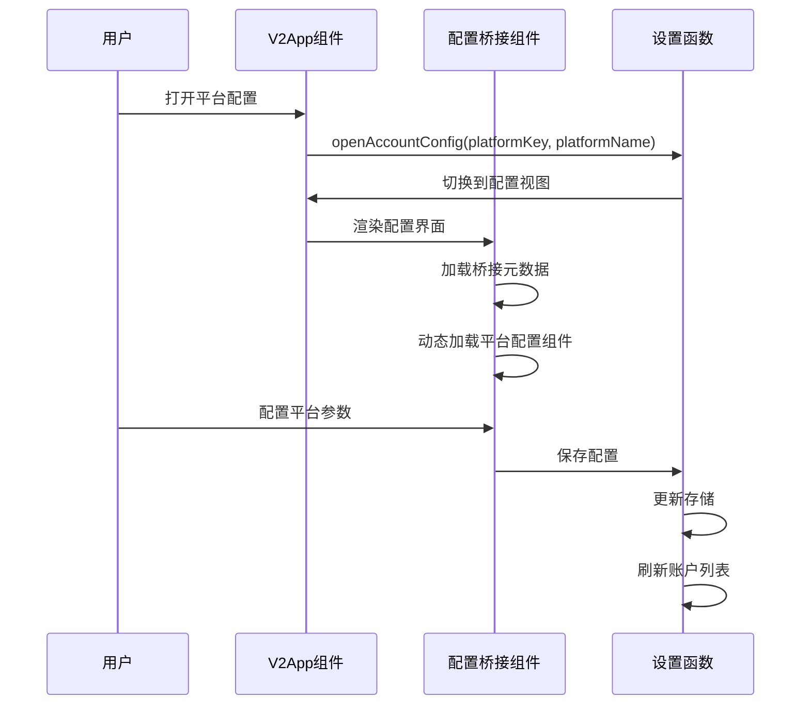

**图表来源**
- [V2PlatformConfigBridge.vue:98-152](file://src/components/v2/settings/V2PlatformConfigBridge.vue#L98-L152)
- [V2App.vue:125-129](file://src/components/v2/V2App.vue#L125-L129)

**章节来源**
- [V2PlatformConfigBridge.vue:1-175](file://src/components/v2/settings/V2PlatformConfigBridge.vue#L1-L175)

## 现代化UI增强功能

### Element Plus确认对话框集成

V2AccountList组件集成了Element Plus的ElMessageBox，为删除操作提供了标准的确认对话框：

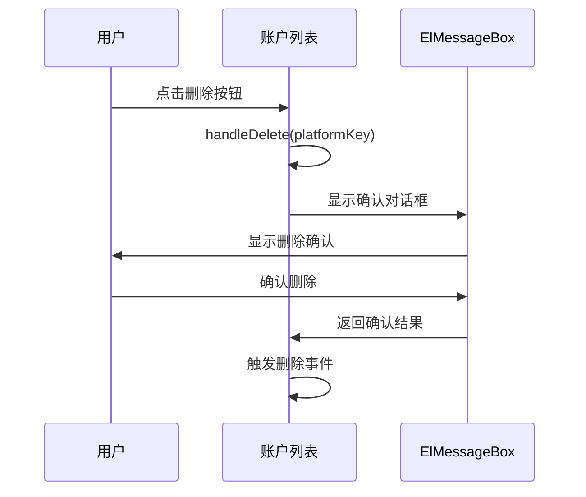

**图表来源**
- [V2AccountList.vue:104-119](file://src/components/v2/settings/V2AccountList.vue#L104-L119)

#### 对话框特性

- **警告类型**：使用`type: "warning"`突出删除操作的危险性
- **国际化支持**：标题和按钮文本都支持多语言
- **确认按钮**：使用`confirmButtonText: t("main.opt.ok")`显示确认文本
- **取消按钮**：使用`cancelButtonText: t("main.opt.cancel")`显示取消文本
- **异步处理**：对话框返回Promise，支持异步确认流程
- **安全删除**：防止误删操作，提供明确的操作确认

### iOS风格切换开关

V2AccountList组件引入了全新的iOS风格切换控件，提供了更直观的状态控制体验：

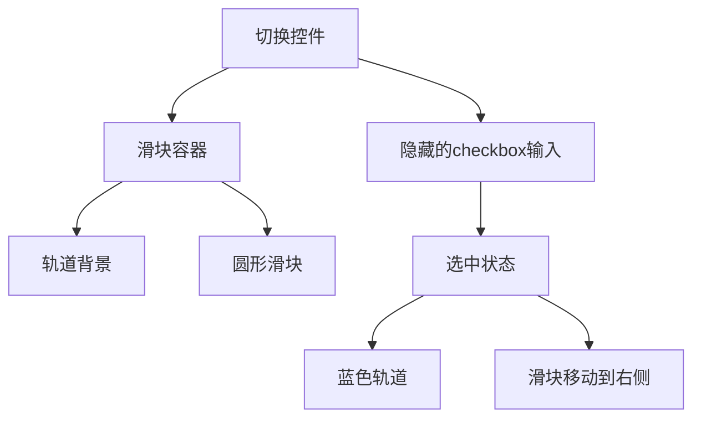

**图表来源**
- [V2AccountList.vue:57-66](file://src/components/v2/settings/V2AccountList.vue#L57-L66)
- [base.styl:87-124](file://src/assets/v2/base.styl#L87-L124)

#### 切换控件特性

- **44px宽度 × 24px高度**：符合iOS设计规范的尺寸
- **平滑过渡动画**：0.3秒的切换动画，提供流畅的用户体验
- **圆角轨道设计**：24px圆角的轨道背景
- **白色圆形滑块**：18px直径的圆形滑块，带有50%透明度
- **状态指示**：选中状态下轨道变为蓝色，滑块位置移动到右侧
- **无障碍支持**：使用`aria-label`提供屏幕阅读器支持

### 增强的状态徽章系统

组件的状态徽章系统得到了显著改进，提供了更清晰的视觉反馈：

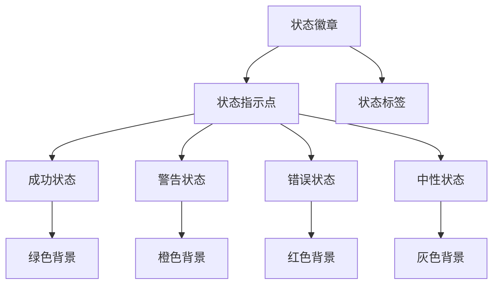

**图表来源**
- [V2AccountList.vue:29-36](file://src/components/v2/settings/V2AccountList.vue#L29-L36)
- [V2AccountList.vue:203-231](file://src/components/v2/settings/V2AccountList.vue#L203-L231)

#### 状态徽章设计

- **圆点状指示器**：6px直径的小圆点，提供即时状态识别
- **紧凑布局**：内边距仅为2px，水平间距4px，节省空间
- **彩色背景系统**：每种状态都有对应的背景色和文本色
- **圆角设计**：999px的圆角半径，形成胶囊形状
- **状态颜色方案**：
  - 成功：`#00B42A` 绿色背景，`#E8FFEA` 绿色背景
  - 警告：`#FF7D00` 橙色背景，`#FFF7E8` 橙色背景
  - 错误：`#F53F3F` 红色背景，`#FFECE8` 红色背景
  - 中性：`#86909C` 灰色背景，`#F2F3F5` 灰色背景

### 改进的按钮样式系统

组件的按钮样式得到了全面优化，提供了更好的视觉反馈：

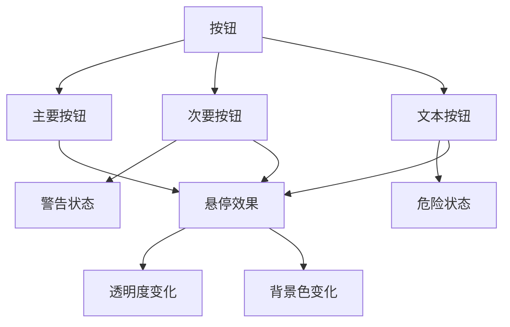

**图表来源**
- [V2AccountList.vue:44-76](file://src/components/v2/settings/V2AccountList.vue#L44-L76)
- [V2AccountList.vue:251-277](file://src/components/v2/settings/V2AccountList.vue#L251-L277)

#### 按钮设计特性

- **主要按钮**：蓝色背景，白色文字，用于添加账号等重要操作
- **次要按钮**：浅色背景，深色文字，用于配置和授权操作
- **文本按钮**：透明背景，深色文字，用于删除等危险操作
- **警告状态**：当平台未授权时，配置按钮变为橙色警告样式
- **危险状态**：删除按钮使用红色，提供视觉警示
- **悬停效果**：所有按钮都支持悬停时的视觉反馈

### 响应式布局优化

组件的样式系统针对不同屏幕尺寸进行了优化：

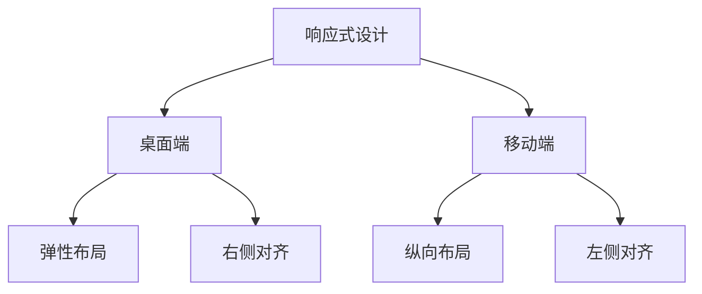

**图表来源**
- [V2AccountList.vue:278-286](file://src/components/v2/settings/V2AccountList.vue#L278-L286)
- [base.styl:399-431](file://src/assets/v2/base.styl#L399-L431)

#### 移动端适配特性

- **自动换行**：按钮区域在小屏幕上自动换行
- **全宽布局**：操作按钮区域在小屏幕上占据100%宽度
- **左对齐**：操作按钮在小屏幕上左对齐，提高可点击性
- **字体调整**：标题字体在小屏幕上自动缩小
- **间距优化**：在小屏幕上增加间距，改善触摸体验

## 交互体验改进

### 安全的删除操作流程

V2AccountList组件通过Element Plus的ElMessageBox实现了安全的删除操作：

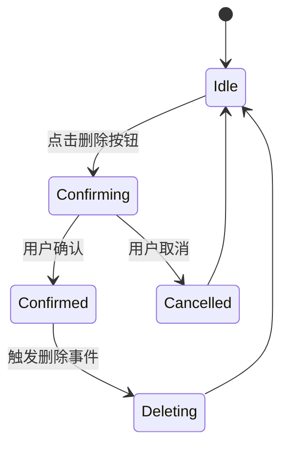

**图表来源**
- [V2AccountList.vue:104-119](file://src/components/v2/settings/V2AccountList.vue#L104-L119)

#### 删除操作特性

- **确认对话框**：使用ElMessageBox.confirm创建标准确认对话框
- **国际化标题**：使用`v2.account.action.deleteConfirmTitle`作为对话框标题
- **动态消息**：使用`v2.account.action.deleteConfirmText`显示动态平台名称
- **类型安全**：设置`type: "warning"`突出删除操作的危险性
- **按钮本地化**：确认和取消按钮使用本地化文本
- **异步处理**：对话框返回Promise，支持异步确认流程

### 改进的切换控件交互

iOS风格的切换控件提供了更直观的状态控制体验：

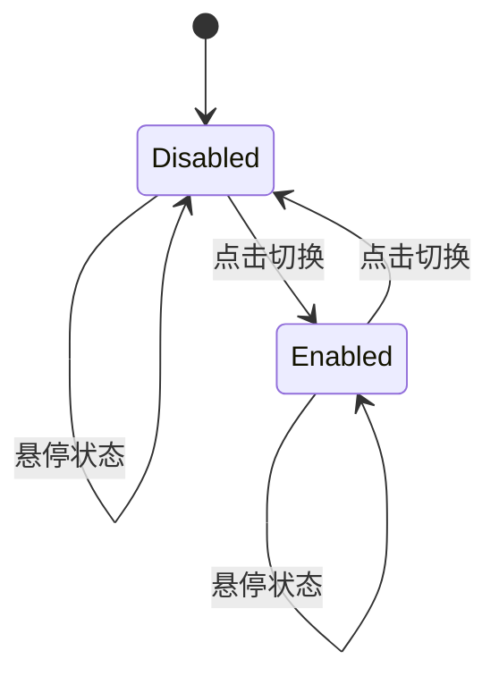

**图表来源**
- [V2AccountList.vue:57-66](file://src/components/v2/settings/V2AccountList.vue#L57-L66)

#### 交互特性

- **标题提示**：根据当前状态显示不同的提示信息
- **无障碍支持**：使用`aria-label`提供屏幕阅读器支持
- **事件处理**：通过`@change`事件监听状态变化
- **状态同步**：实时同步到父组件的状态管理
- **视觉反馈**：提供平滑的切换动画和视觉反馈

### 增强的按钮样式系统

组件的按钮样式系统支持多种状态和视觉反馈：

**图表来源**
- [V2AccountList.vue:251-277](file://src/components/v2/settings/V2AccountList.vue#L251-L277)

#### 按钮状态系统

- **主要按钮**：用于重要操作，如添加账号
- **次要按钮**：用于常规操作，如配置和授权
- **文本按钮**：用于危险操作，如删除
- **警告状态**：当平台未授权时的特殊样式
- **危险状态**：删除按钮的红色强调样式
- **悬停效果**：提供即时的视觉反馈

## 依赖关系分析

### 核心依赖关系

V2账户列表组件的依赖关系体现了统一的架构设计：

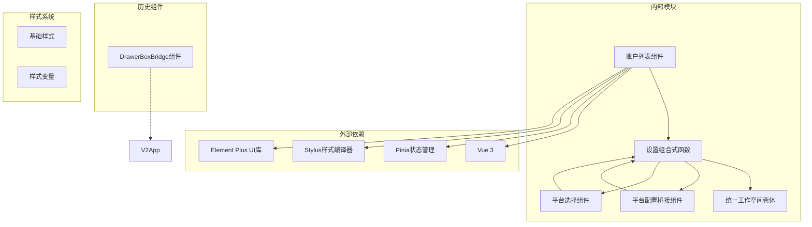

**图表来源**
- [useV2Settings.ts:1-15](file://src/composables/v2/useV2Settings.ts#L1-L15)
- [V2App.vue:144-148](file://src/components/v2/V2App.vue#L144-L148)

### 数据流向分析

组件的数据流遵循单向数据绑定原则，确保了数据的一致性和可预测性：

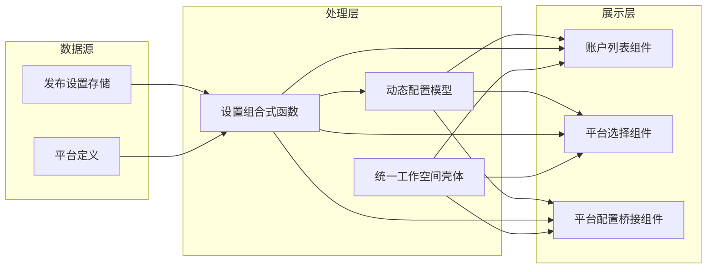

**图表来源**
- [useV2Settings.ts:44-45](file://src/composables/v2/useV2Settings.ts#L44-L45)
- [useV2Settings.ts:46-46](file://src/composables/v2/useV2Settings.ts#L46-L46)

**章节来源**
- [useV2Settings.ts:1-15](file://src/composables/v2/useV2Settings.ts#L1-L15)

## 性能考虑

### 渲染优化

组件采用了多项性能优化策略：

1. **直接组件通信**：移除了iframe通信的性能开销，采用Vue事件系统直接通信
2. **虚拟滚动支持**：对于大量账号的场景，可以考虑实现虚拟滚动以提升渲染性能
3. **懒加载图标**：SVG图标采用延迟加载机制，减少初始渲染时间
4. **状态缓存**：通过组合式函数的响应式特性，避免不必要的重新计算
5. **Suspense支持**：V2PlatformConfigBridge使用Suspense实现异步组件加载
6. **CSS作用域**：使用scoped样式，避免样式冲突和全局污染
7. **媒体查询优化**：响应式设计只在必要时应用，减少样式计算开销
8. **Element Plus按需加载**：ElMessageBox仅在需要时加载，减少初始包体积

### 存储优化

发布设置存储采用了高效的序列化机制：

- 使用JSON格式存储配置数据
- 支持增量更新，避免全量重写
- 提供异步操作支持，不影响UI响应
- 状态变更时自动触发重新渲染

### 网络优化

平台配置的获取和更新都支持异步操作：

- 配置加载采用Promise链式调用
- 支持并发操作优化
- 错误处理机制确保操作的可靠性
- Suspense组件提供优雅的加载状态

### 交互性能

**统一工作空间壳体**：
- 基于单一DOM树的布局系统，避免iframe的性能损耗
- 统一的导航和布局逻辑，提升用户体验
- 响应式设计支持不同屏幕尺寸

**直接组件通信**：
- Vue事件系统的高性能事件传递
- 避免了跨iframe通信的复杂性和性能开销
- 更简洁的组件间通信机制

**Element Plus集成**：
- ElMessageBox采用虚拟DOM渲染，性能优异
- 按需加载组件，减少初始包体积
- 优化的动画和过渡效果

## 故障排除指南

### 常见问题及解决方案

#### 账号状态显示异常

**问题描述**：账号状态徽章显示不正确或状态标签错误

**可能原因**：
1. 动态配置数据格式不正确
2. 授权状态检测逻辑异常
3. 平台类型识别错误
4. 状态徽章样式类名绑定错误

**解决步骤**：
1. 检查动态配置中的`isEnabled`和`isAuth`字段
2. 验证平台类型枚举值的正确性
3. 确认状态计算逻辑的执行顺序
4. 检查`.syp-status-badge.is-${item.statusType}`类名绑定

#### 账号切换功能失效

**问题描述**：启用/禁用切换按钮无法正常工作

**可能原因**：
1. 存储更新操作失败
2. 状态同步机制异常
3. 权限验证失败
4. 切换开关事件绑定错误
5. Element Plus样式冲突

**解决步骤**：
1. 检查`toggleAccountEnabled`方法的实现
2. 验证存储更新操作的日志输出
3. 确认状态刷新机制的触发
4. 检查事件绑定是否正确传递到父组件
5. 验证Element Plus样式是否正确加载

#### Element Plus确认对话框显示异常

**问题描述**：删除确认对话框无法正常显示或样式异常

**可能原因**：
1. Element Plus未正确安装或导入
2. 国际化配置缺失
3. 样式冲突
4. 异步操作处理错误
5. 对话框配置参数错误

**解决步骤**：
1. 检查Element Plus的安装和导入
2. 验证`v2.account.action.deleteConfirmTitle`和`v2.account.action.deleteConfirmText`的国际化配置
3. 确认样式文件的正确加载
4. 检查异步操作的Promise处理
5. 验证对话框配置参数的正确性

#### iOS风格切换开关样式问题

**问题描述**：切换控件样式显示异常或动画不流畅

**可能原因**：
1. 基础样式文件未正确加载
2. CSS变量未定义
3. 媒体查询冲突
4. 浏览器兼容性问题
5. 动画性能问题

**解决步骤**：
1. 检查base.styl文件的正确加载
2. 验证CSS变量的定义和使用
3. 确认媒体查询的优先级
4. 测试不同浏览器的兼容性
5. 检查动画性能和硬件加速

#### 响应式布局问题

**问题描述**：在小屏幕设备上布局显示异常

**可能原因**：
1. 媒体查询断点设置不当
2. 样式优先级冲突
3. Flexbox布局问题
4. 媒体查询未正确触发

**解决步骤**：
1. 检查@media查询的断点设置
2. 验证样式优先级和覆盖规则
3. 确认Flexbox属性的正确使用
4. 测试不同屏幕尺寸下的布局表现

**章节来源**
- [useV2Settings.ts:158-171](file://src/composables/v2/useV2Settings.ts#L158-L171)
- [V2AccountList.vue:97-100](file://src/components/v2/settings/V2AccountList.vue#L97-L100)

## 结论

V2账户列表组件展现了现代前端开发的最佳实践，通过统一的架构设计、直接的组件通信和优秀的用户体验，为用户提供了强大而易用的平台账号管理功能。

**主要优势包括**：

1. **统一架构设计**：通过UnifiedWorkspaceShell实现了统一的布局和导航
2. **直接组件通信**：移除了复杂的iframe通信机制，采用Vue事件系统
3. **模块化设计**：通过组合式函数实现了关注点分离，提高了代码的可维护性
4. **响应式状态管理**：利用Vue 3的响应式系统，确保了数据的一致性和UI的实时更新
5. **现代化UI设计**：全新的Element Plus确认对话框、iOS风格切换开关和增强的状态徽章系统
6. **增强的交互体验**：安全的删除操作确认、直观的状态控制和丰富的视觉反馈
7. **扩展性强**：支持多种平台类型，易于添加新的平台支持
8. **用户体验优秀**：直观的状态显示和操作反馈，提升了用户的使用体验
9. **性能优化**：采用多项性能优化策略，移除了iframe通信的性能开销
10. **响应式设计**：针对不同屏幕尺寸的优化，提供一致的用户体验

**现代化UI增强总结**：
- **Element Plus确认对话框**：提供标准的安全删除操作确认
- **iOS风格切换开关**：提供直观的状态控制体验
- **增强的状态徽章系统**：更清晰的视觉反馈和状态识别
- **优化的按钮样式系统**：更好的视觉反馈和交互体验
- **响应式布局优化**：针对不同设备的适配和优化

**重大架构重构总结**：
- **从iframe通信迁移到直接组件组合**：完全移除了复杂的跨iframe通信机制
- **统一工作空间壳体架构**：所有设置页面都基于UnifiedWorkspaceShell进行统一布局
- **新增平台配置桥接组件**：V2PlatformConfigBridge作为平台配置的直接桥接
- **简化的组件通信**：通过Vue事件系统实现组件间通信，无需额外的通信层

未来可以考虑的改进方向：
- 实现虚拟滚动以支持大量账号的高效渲染
- 添加搜索和筛选功能
- 增强批量操作能力
- 优化移动端的触摸交互体验
- 扩展更多状态类型以支持复杂的业务场景
- 进一步优化Suspense组件的加载体验
- 集成更多的Element Plus组件以提升用户体验
- 实现暗黑模式支持
- 增加键盘导航支持