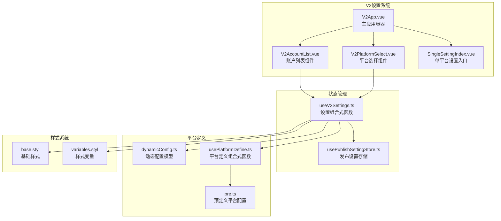
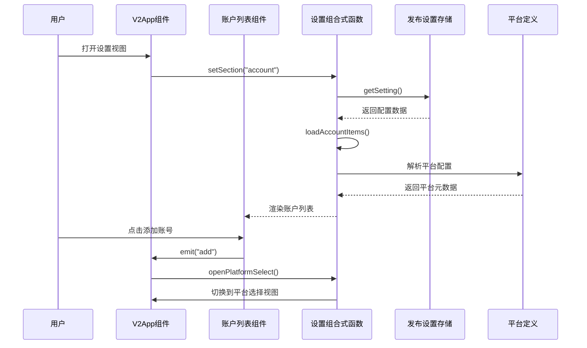
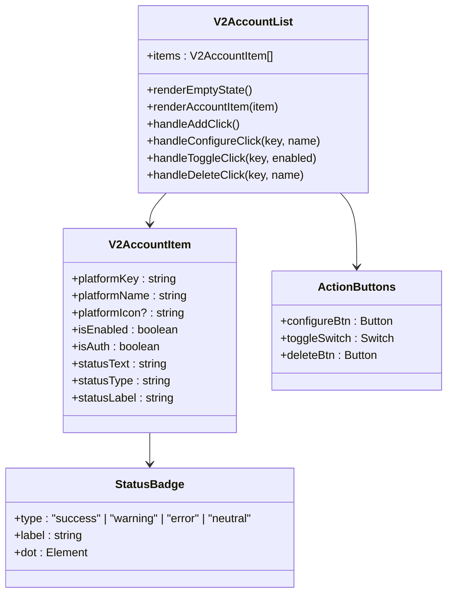
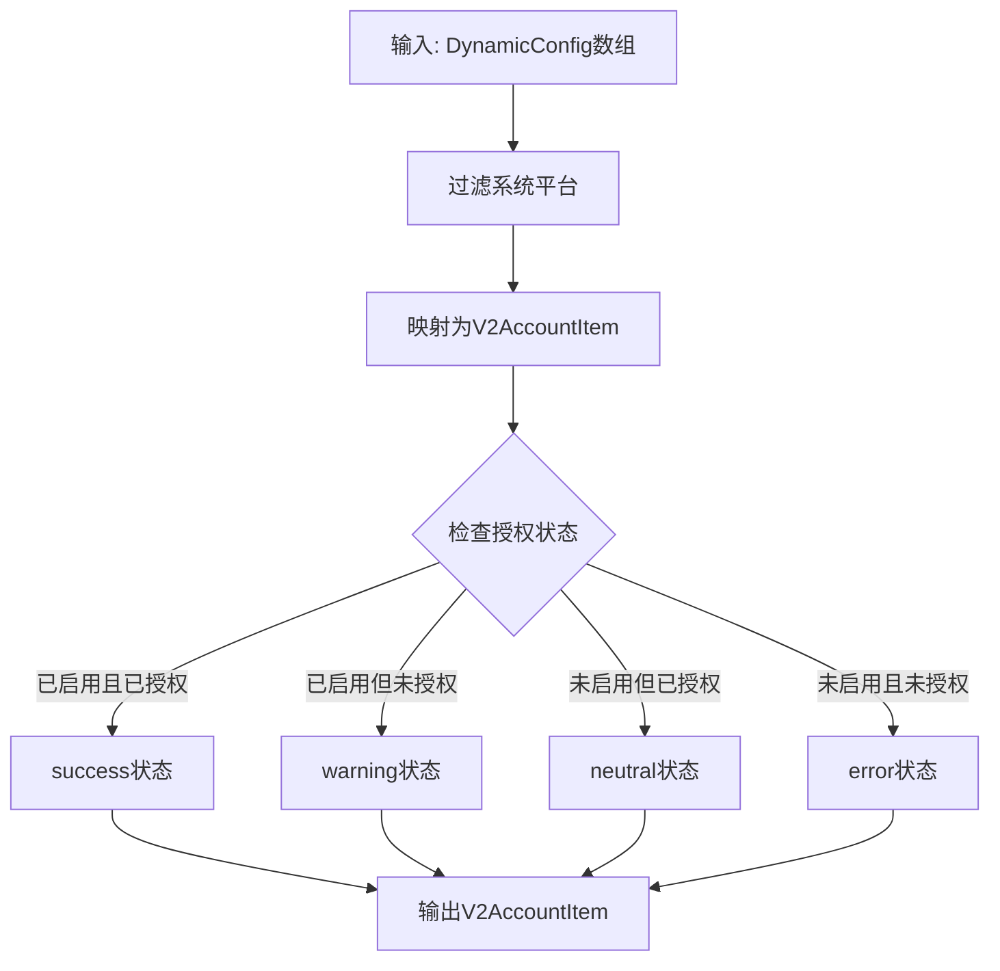
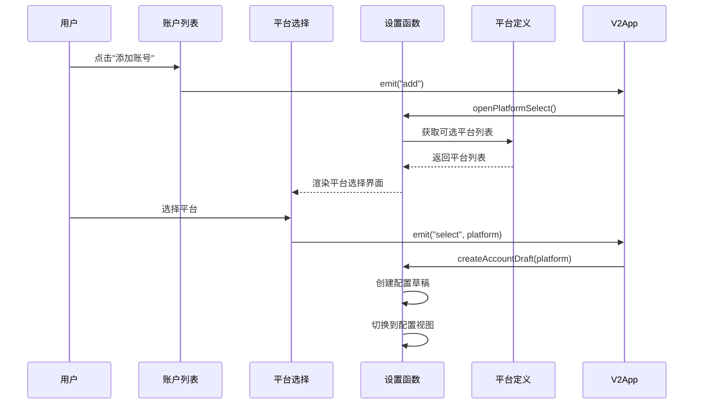
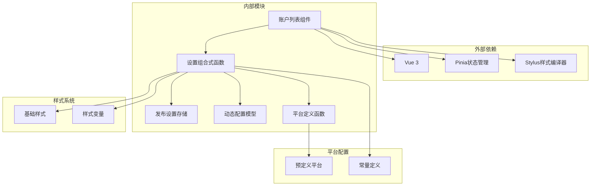
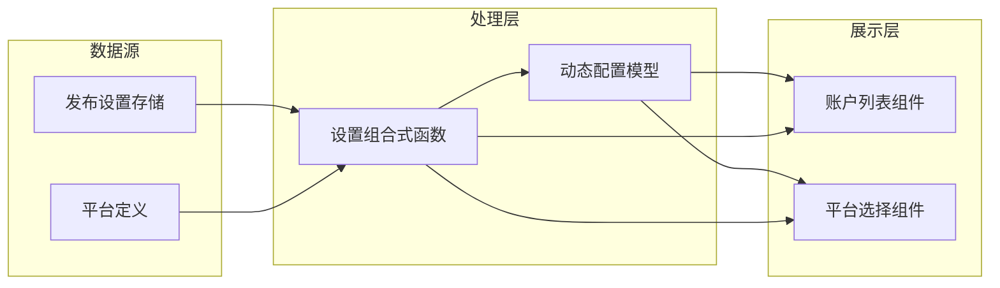

# V2账户列表组件

<cite>
**本文档引用的文件**
- [V2AccountList.vue](file://src/components/v2/settings/V2AccountList.vue)
- [useV2Settings.ts](file://src/composables/v2/useV2Settings.ts)
- [dynamicConfig.ts](file://src/platforms/dynamicConfig.ts)
- [usePublishSettingStore.ts](file://src/stores/usePublishSettingStore.ts)
- [V2PlatformSelect.vue](file://src/components/v2/settings/V2PlatformSelect.vue)
- [SingleSettingIndex.vue](file://src/components/set/publish/singleplatform/SingleSettingIndex.vue)
- [usePlatformDefine.ts](file://src/composables/usePlatformDefine.ts)
- [pre.ts](file://src/platforms/pre.ts)
- [constants.ts](file://src/utils/constants.ts)
- [V2App.vue](file://src/components/v2/V2App.vue)
- [base.styl](file://src/assets/v2/base.styl)
- [variables.styl](file://src/assets/v2/variables.styl)
</cite>

## 更新摘要
**变更内容**
- 新增完整的.syp-btn按钮样式系统，替代Material Design b3-button样式
- 引入四状态徽章系统（success、warning、error、neutral），每个状态都有相应的背景颜色和点指示器
- 完全重新设计的iOS风格纯图形化切换开关
- 通过徽章显示账号状态而非传统边框样式
- 更新状态计算逻辑和UI交互设计

## 目录
1. [简介](#简介)
2. [项目结构](#项目结构)
3. [核心组件](#核心组件)
4. [架构概览](#架构概览)
5. [详细组件分析](#详细组件分析)
6. [依赖关系分析](#依赖关系分析)
7. [性能考虑](#性能考虑)
8. [故障排除指南](#故障排除指南)
9. [结论](#结论)

## 简介

V2账户列表组件是思源笔记发布工具V2版本中的核心功能模块，负责管理和展示用户配置的各种平台账号。该组件提供了完整的账号生命周期管理，包括账号添加、配置、启用/禁用切换、删除等操作，并通过直观的UI界面展示了每个账号的状态信息。

**重大功能增强**：
- **全新的.syp-btn按钮样式系统**：完全替代Material Design b3-button样式，提供更现代的视觉效果和交互体验
- **四状态徽章系统**：success（成功）、warning（警告）、error（错误）、neutral（中性），每个状态都有独特的背景颜色和点指示器
- **iOS风格纯图形化切换开关**：无文字标签的纯图形化设计，提供流畅的动画过渡效果
- **状态徽章替代边框设计**：通过徽章清晰展示账号状态，不再使用传统的边框样式

该组件采用现代化的设计理念，支持多种平台类型（WordPress、博客园、GitHub、GitLab、自定义平台等），并通过全新的状态徽章系统清晰地展示了每个账号的授权和启用状态。

## 项目结构

V2账户列表组件位于项目的组件层次结构中，与相关的设置和平台管理功能紧密集成：

**图表来源**
- [V2AccountList.vue:1-431](file://src/components/v2/settings/V2AccountList.vue#L1-L431)
- [useV2Settings.ts:1-235](file://src/composables/v2/useV2Settings.ts#L1-L235)
- [V2App.vue:106-144](file://src/components/v2/V2App.vue#L106-L144)
- [base.styl:1-262](file://src/assets/v2/base.styl#L1-L262)
- [variables.styl:1-58](file://src/assets/v2/variables.styl#L1-L58)

**章节来源**
- [V2AccountList.vue:1-431](file://src/components/v2/settings/V2AccountList.vue#L1-L431)
- [V2App.vue:106-144](file://src/components/v2/V2App.vue#L106-L144)

## 核心组件

### V2AccountList组件

V2AccountList是账户列表的主要展示组件，负责渲染和管理所有已配置的平台账号。

#### 主要特性

1. **全新的.syp-btn按钮样式系统**：提供primary、text、warning、danger等多种按钮样式
2. **四状态徽章系统**：通过success、warning、error、neutral四种状态清晰展示账号状态
3. **iOS风格切换开关**：纯图形化设计，无文字标签，提供流畅的动画效果
4. **响应式状态显示**：通过状态徽章替代传统边框样式展示账号状态
5. **操作按钮集成**：提供添加、配置、删除和启用/禁用切换功能
6. **空状态处理**：当没有配置任何账号时显示友好的提示信息
7. **图标支持**：支持SVG图标和平台名称首字母作为账号图标

#### 数据结构

组件接收`V2AccountItem`类型的数组作为输入，每个项目包含以下关键字段：

| 字段名 | 类型 | 描述 |
|--------|------|------|
| platformKey | string | 平台唯一标识符 |
| platformName | string | 平台显示名称 |
| platformIcon | string | SVG图标代码 |
| isEnabled | boolean | 是否已启用 |
| isAuth | boolean | 是否已授权 |
| statusType | "success" \| "warning" \| "error" \| "neutral" | 状态类型 |
| statusLabel | string | 状态标签文本 |
| statusText | string | 状态详细说明 |

**章节来源**
- [V2AccountList.vue:19-123](file://src/components/v2/settings/V2AccountList.vue#L19-L123)
- [useV2Settings.ts:19-28](file://src/composables/v2/useV2Settings.ts#L19-L28)

## 架构概览

V2账户列表组件采用了清晰的分层架构设计，确保了良好的可维护性和扩展性：

**图表来源**
- [V2App.vue:273-293](file://src/components/v2/V2App.vue#L273-L293)
- [useV2Settings.ts:125-139](file://src/composables/v2/useV2Settings.ts#L125-L139)

### 状态管理流程

组件的状态管理遵循Vue 3的响应式设计原则，通过组合式函数实现状态的集中管理：

**图表来源**
- [useV2Settings.ts:78-123](file://src/composables/v2/useV2Settings.ts#L78-L123)
- [useV2Settings.ts:157-170](file://src/composables/v2/useV2Settings.ts#L157-L170)

**章节来源**
- [useV2Settings.ts:42-57](file://src/composables/v2/useV2Settings.ts#L42-L57)
- [useV2Settings.ts:78-123](file://src/composables/v2/useV2Settings.ts#L78-L123)

## 详细组件分析

### V2AccountList组件实现

#### 模板结构分析

组件采用语义化的HTML结构，通过CSS类名实现统一的视觉风格：

**图表来源**
- [V2AccountList.vue:19-92](file://src/components/v2/settings/V2AccountList.vue#L19-L92)
- [useV2Settings.ts:19-28](file://src/composables/v2/useV2Settings.ts#L19-L28)

#### 样式系统设计

组件采用了基于Stylus的全新样式系统，实现了响应式的UI设计：

**飞书/字节设计令牌**：
| 设计令牌 | 值 | 用途 |
|----------|----|------|
| `$color-success` | `#00B42A` | 成功状态颜色 |
| `$color-success-bg` | `#E8FFEA` | 成功状态背景色 |
| `$color-warning` | `#FF7D00` | 警告状态颜色 |
| `$color-warning-bg` | `#FFF7E8` | 警告状态背景色 |
| `$color-error` | `#F53F3F` | 错误状态颜色 |
| `$color-error-bg` | `#FFECE8` | 错误状态背景色 |
| `$color-neutral` | `#86909C` | 中性状态颜色 |
| `$color-neutral-bg` | `#F2F3F5` | 中性状态背景色 |
| `$text-primary` | `#1D2129` | 主要文字颜色 |
| `$text-secondary` | `#4E5969` | 次要文字颜色 |
| `$text-tertiary` | `#86909C` | 第三文字颜色 |
| `$border-color` | `#E5E6EB` | 边框颜色 |
| `$bg-hover` | `#F7F8FA` | 悬停背景色 |
| `$bg-card` | `#FFFFFF` | 卡片背景色 |
| `$radius-sm` | `6px` | 小圆角半径 |
| `$radius-md` | `8px` | 中圆角半径 |
| `$radius-lg` | `12px` | 大圆角半径 |
| `$gap-sm` | `8px` | 小间距 |
| `$gap-md` | `12px` | 中间距 |
| `$gap-lg` | `16px` | 大间距 |

**全新的.syp-btn按钮样式系统**：
- `.syp-btn`：基础按钮样式，支持flex布局和过渡动画
- `.syp-btn-primary`：主要按钮样式，深色背景配白色文字
- `.syp-btn-text`：文本按钮样式，透明背景配灰色文字
- `.syp-btn-text.is-warning`：警告状态文本按钮
- `.syp-btn-text.is-danger`：危险状态文本按钮

**iOS风格切换开关**：
- `.syp-switch`：切换开关容器，支持焦点可见性和触摸高亮
- `.syp-switch__track`：轨道样式，支持圆角和背景色过渡
- `.syp-switch__thumb`：拇指样式，支持阴影和变换动画
- `.syp-switch.is-on`：开启状态样式，轨道变为绿色，拇指向右移动

**四状态徽章系统**：
- `.syp-status-badge`：徽章基础样式，支持内联flex布局
- `.syp-status-badge__dot`：徽章点指示器，圆形6px大小
- `.syp-status-badge.is-success`：成功状态徽章，绿色背景和点
- `.syp-status-badge.is-warning`：警告状态徽章，橙色背景和点
- `.syp-status-badge.is-error`：错误状态徽章，红色背景和点
- `.syp-status-badge.is-neutral`：中性状态徽章，灰色背景和点

**章节来源**
- [V2AccountList.vue:111-430](file://src/components/v2/settings/V2AccountList.vue#L111-L430)

### 状态计算逻辑

组件的核心状态计算逻辑位于`useV2Settings`组合式函数中，实现了复杂的业务逻辑：

**图表来源**
- [useV2Settings.ts:89-122](file://src/composables/v2/useV2Settings.ts#L89-L122)

#### 状态转换规则

| 启用状态 | 授权状态 | 状态类型 | 标签 | 提示文本 | 徽章颜色 |
|----------|----------|----------|------|----------|----------|
| true | true | success | 运行中 | 已启用 · 已授权 | 绿色背景 |
| true | false | warning | 需授权 | 已启用 · 未授权 | 橙色背景 |
| false | true | neutral | 已禁用 | 未启用 · 已授权 | 灰色背景 |
| false | false | error | 未启用 | 未启用 · 未授权 | 红色背景 |

**章节来源**
- [useV2Settings.ts:94-110](file://src/composables/v2/useV2Settings.ts#L94-L110)

### 平台选择功能

V2平台选择组件提供了用户友好的平台添加体验：

**图表来源**
- [V2PlatformSelect.vue:10-27](file://src/components/v2/settings/V2PlatformSelect.vue#L10-L27)
- [useV2Settings.ts:172-209](file://src/composables/v2/useV2Settings.ts#L172-L209)

**章节来源**
- [V2PlatformSelect.vue:1-119](file://src/components/v2/settings/V2PlatformSelect.vue#L1-L119)
- [useV2Settings.ts:172-209](file://src/composables/v2/useV2Settings.ts#L172-L209)

## 依赖关系分析

### 核心依赖关系

V2账户列表组件的依赖关系体现了清晰的关注点分离：

**图表来源**
- [useV2Settings.ts:1-15](file://src/composables/v2/useV2Settings.ts#L1-L15)
- [usePublishSettingStore.ts:10-25](file://src/stores/usePublishSettingStore.ts#L10-L25)

### 数据流向分析

组件的数据流遵循单向数据绑定原则，确保了数据的一致性和可预测性：

**图表来源**
- [useV2Settings.ts:43-44](file://src/composables/v2/useV2Settings.ts#L43-L44)
- [useV2Settings.ts:46-57](file://src/composables/v2/useV2Settings.ts#L46-L57)

**章节来源**
- [useV2Settings.ts:1-15](file://src/composables/v2/useV2Settings.ts#L1-L15)
- [dynamicConfig.ts:13-113](file://src/platforms/dynamicConfig.ts#L13-L113)

## 性能考虑

### 渲染优化

组件采用了多项性能优化策略：

1. **虚拟滚动支持**：对于大量账号的场景，可以考虑实现虚拟滚动以提升渲染性能
2. **懒加载图标**：SVG图标采用延迟加载机制，减少初始渲染时间
3. **状态缓存**：通过组合式函数的响应式特性，避免不必要的重新计算
4. **CSS变量优化**：使用Stylus变量系统，减少重复计算和内存占用

### 存储优化

发布设置存储采用了高效的序列化机制：

- 使用JSON格式存储配置数据
- 支持增量更新，避免全量重写
- 提供异步操作支持，不影响UI响应
- 状态变更时自动触发重新渲染

### 网络优化

平台配置的获取和更新都支持异步操作：

- 配置加载采用Promise链式调用
- 支持并发操作优化
- 错误处理机制确保操作的可靠性
- 状态徽章的快速更新提升用户体验

### 交互性能

**iOS风格切换开关**：
- 使用CSS3硬件加速，确保流畅的动画效果
- cubic-bezier缓动函数提供自然的过渡体验
- 触摸反馈优化，支持不同设备的交互习惯
- 焦点管理确保键盘导航的可达性

## 故障排除指南

### 常见问题及解决方案

#### 账号状态显示异常

**问题描述**：账号状态徽章显示不正确或状态标签错误

**可能原因**：
1. 动态配置数据格式不正确
2. 授权状态检测逻辑异常
3. 平台类型识别错误
4. 状态徽章样式类名绑定错误

**解决步骤**：
1. 检查动态配置中的`isEnabled`和`isAuth`字段
2. 验证平台类型枚举值的正确性
3. 确认状态计算逻辑的执行顺序
4. 检查`.syp-status-badge.is-${item.statusType}`类名绑定

#### 账号切换功能失效

**问题描述**：启用/禁用切换按钮无法正常工作

**可能原因**：
1. 存储更新操作失败
2. 状态同步机制异常
3. 权限验证失败
4. 切换开关事件绑定错误

**解决步骤**：
1. 检查`toggleAccountEnabled`方法的实现
2. 验证存储更新操作的日志输出
3. 确认状态刷新机制的触发
4. 检查`.syp-switch.is-on`类名的动态切换

#### 按钮样式显示问题

**问题描述**：.syp-btn按钮样式无法正确显示

**可能原因**：
1. CSS变量未正确导入
2. 样式优先级冲突
3. 按钮类名拼写错误
4. Stylus编译错误

**解决步骤**：
1. 验证`base.styl`和`variables.styl`的正确导入
2. 检查按钮类名的正确拼写（如`syp-btn-primary`）
3. 确认样式文件的编译和加载
4. 检查是否存在CSS优先级冲突

#### 切换开关交互异常

**问题描述**：iOS风格切换开关无法正常切换

**可能原因**：
1. 事件监听器绑定错误
2. CSS过渡动画冲突
3. 焦点管理问题
4. 触摸事件处理异常

**解决步骤**：
1. 检查`@click="$emit('toggle', item.platformKey, !item.isEnabled)"`事件绑定
2. 验证`.syp-switch__track`和`.syp-switch__thumb`的CSS动画
3. 确认`:focus-visible`伪类的正确应用
4. 检查触摸事件的兼容性处理

**章节来源**
- [useV2Settings.ts:157-170](file://src/composables/v2/useV2Settings.ts#L157-L170)
- [V2AccountList.vue:290-293](file://src/components/v2/settings/V2AccountList.vue#L290-L293)

## 结论

V2账户列表组件展现了现代前端开发的最佳实践，通过全新的样式系统、完善的错误处理机制和优秀的用户体验，为用户提供了强大而易用的平台账号管理功能。

**主要优势包括**：

1. **模块化设计**：通过组合式函数实现了关注点分离，提高了代码的可维护性
2. **响应式状态管理**：利用Vue 3的响应式系统，确保了数据的一致性和UI的实时更新
3. **现代化UI设计**：全新的.syp-btn按钮样式系统、四状态徽章系统和iOS风格切换开关
4. **扩展性强**：支持多种平台类型，易于添加新的平台支持
5. **用户体验优秀**：直观的状态显示和操作反馈，提升了用户的使用体验
6. **性能优化**：采用多项性能优化策略，确保在大数据量下的流畅体验

**重大功能增强总结**：
- **全新的.syp-btn按钮样式系统**：提供更现代的视觉效果和交互体验
- **四状态徽章系统**：success、warning、error、neutral四种状态，每种都有独特的视觉表现
- **iOS风格切换开关**：纯图形化设计，提供流畅的动画过渡效果
- **状态徽章替代边框**：通过徽章清晰展示账号状态，提升视觉一致性

未来可以考虑的改进方向：
- 实现虚拟滚动以支持大量账号的高效渲染
- 添加搜索和筛选功能
- 增强批量操作能力
- 优化移动端的触摸交互体验
- 扩展更多状态类型以支持复杂的业务场景