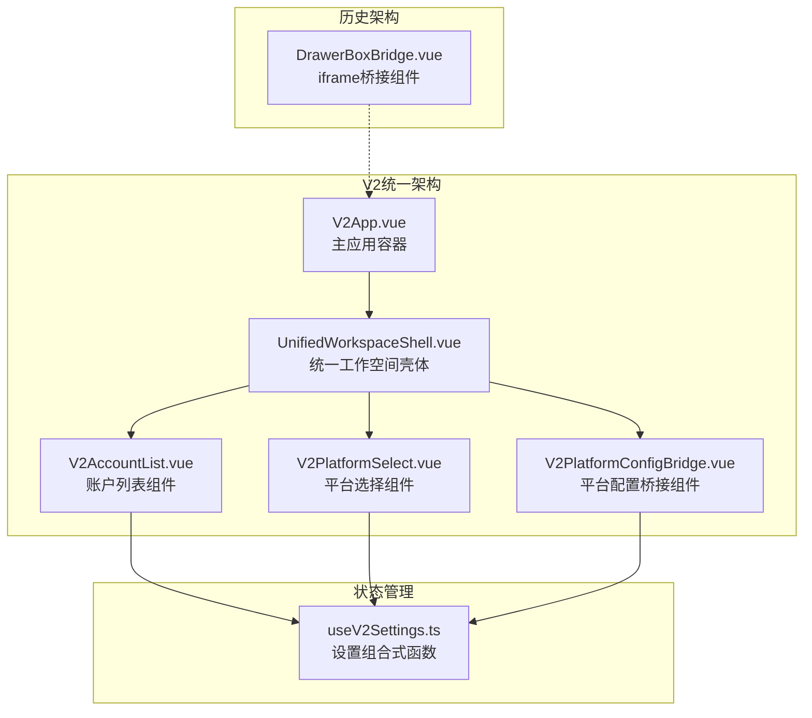
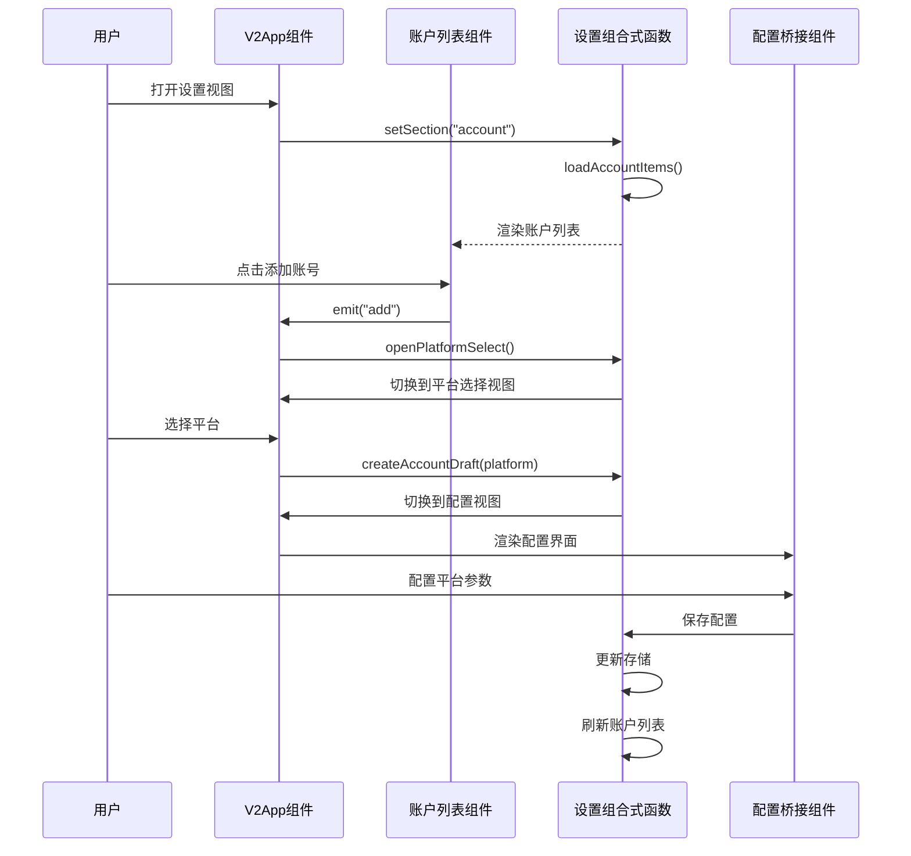
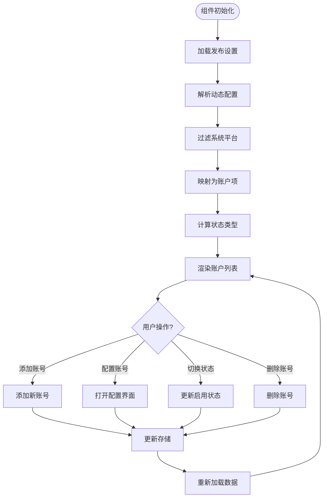
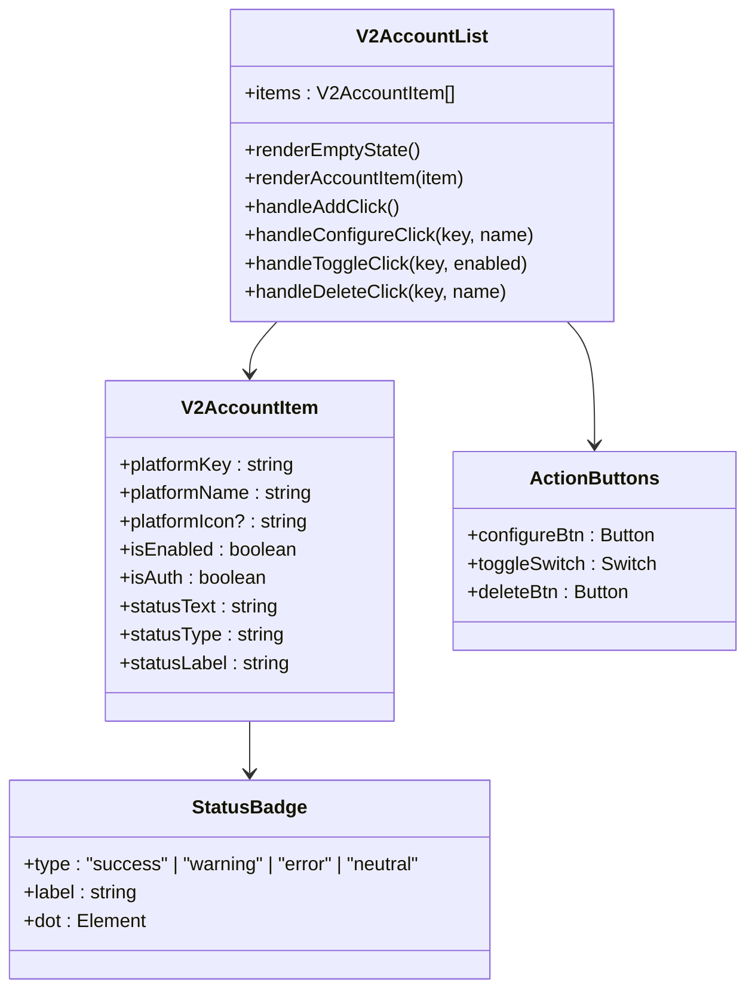
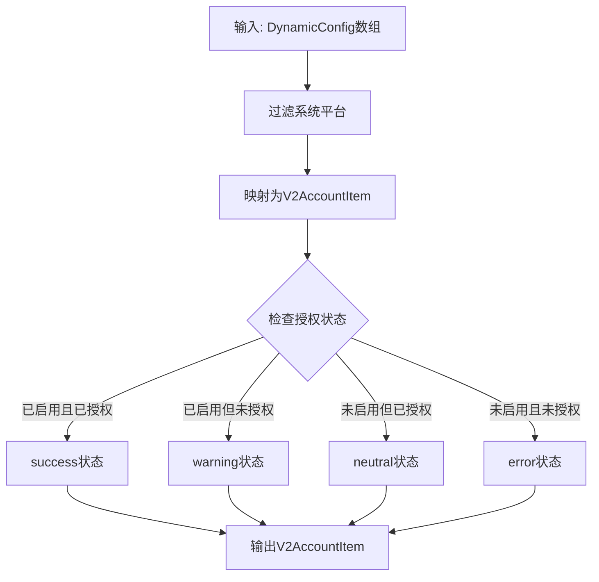
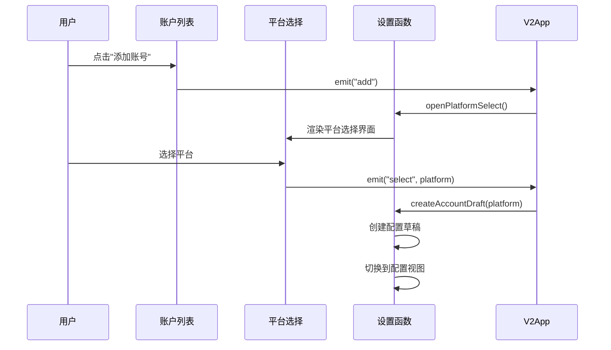
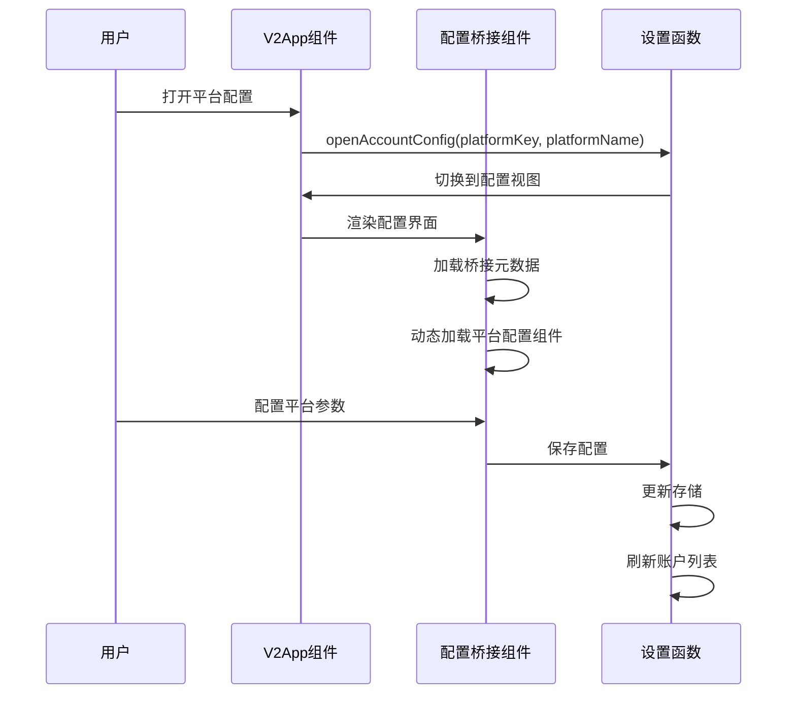
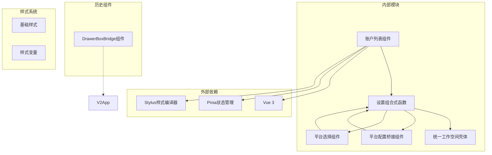
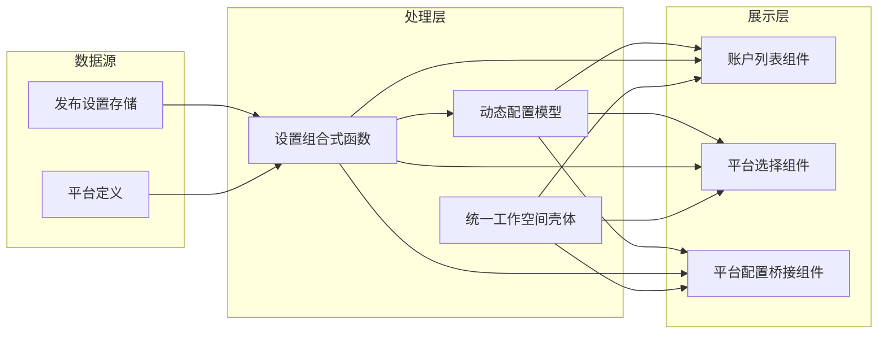

# V2账户列表组件

<cite>
**本文档引用的文件**
- [V2AccountList.vue](file://src/components/v2/settings/V2AccountList.vue)
- [useV2Settings.ts](file://src/composables/v2/useV2Settings.ts)
- [V2PlatformConfigBridge.vue](file://src/components/v2/settings/V2PlatformConfigBridge.vue)
- [V2PlatformSelect.vue](file://src/components/v2/settings/V2PlatformSelect.vue)
- [V2App.vue](file://src/components/v2/V2App.vue)
- [UnifiedWorkspaceShell.vue](file://src/components/v2/layout/UnifiedWorkspaceShell.vue)
- [DrawerBoxBridge.vue](file://src/components/common/DrawerBoxBridge.vue)
- [design.md](file://openspec/changes/refactor-ui-v2-foundation/design.md)
</cite>

## 更新摘要
**变更内容**
- V2AccountList组件从复杂的iframe通信模式迁移到直接组件组合架构
- 移除了旧的DrawerBoxBridge iframe通信机制
- 新增了V2PlatformConfigBridge组件作为平台配置的直接桥接
- 重构了账户管理流程，采用统一的工作空间壳体架构
- 简化了组件间的通信方式，从跨iframe通信改为直接事件传递

## 目录
1. [简介](#简介)
2. [项目结构](#项目结构)
3. [核心组件](#核心组件)
4. [架构概览](#架构概览)
5. [详细组件分析](#详细组件分析)
6. [依赖关系分析](#依赖关系分析)
7. [性能考虑](#性能考虑)
8. [故障排除指南](#故障排除指南)
9. [结论](#结论)

## 简介

V2账户列表组件是思源笔记发布工具V2版本中的核心功能模块，负责管理和展示用户配置的各种平台账号。该组件提供了完整的账号生命周期管理，包括账号添加、配置、启用/禁用切换、删除等操作，并通过直观的UI界面展示了每个账号的状态信息。

**重大架构重构**：
- **从iframe通信迁移到直接组件组合**：完全移除了复杂的跨iframe通信机制，采用Vue 3的直接组件通信模式
- **统一工作空间壳体架构**：所有设置页面都基于UnifiedWorkspaceShell进行统一布局和导航
- **新增平台配置桥接组件**：V2PlatformConfigBridge作为平台配置的直接桥接，替代了原有的iframe配置页面
- **简化的组件通信**：通过Vue事件系统实现组件间通信，无需额外的通信层

该组件采用现代化的设计理念，支持多种平台类型（WordPress、博客园、GitHub、GitLab、自定义平台等），并通过全新的状态徽章系统清晰地展示了每个账号的授权和启用状态。

## 项目结构

V2账户列表组件位于重构后的统一架构中，与相关的设置和平台管理功能紧密集成：

**图表来源**
- [V2App.vue:111-129](file://src/components/v2/V2App.vue#L111-L129)
- [UnifiedWorkspaceShell.vue:1-49](file://src/components/v2/layout/UnifiedWorkspaceShell.vue#L1-L49)
- [V2AccountList.vue:1-275](file://src/components/v2/settings/V2AccountList.vue#L1-L275)
- [V2PlatformConfigBridge.vue:1-175](file://src/components/v2/settings/V2PlatformConfigBridge.vue#L1-L175)

**章节来源**
- [V2App.vue:111-129](file://src/components/v2/V2App.vue#L111-L129)
- [UnifiedWorkspaceShell.vue:1-49](file://src/components/v2/layout/UnifiedWorkspaceShell.vue#L1-L49)

## 核心组件

### V2AccountList组件

V2AccountList是账户列表的主要展示组件，负责渲染和管理所有已配置的平台账号。

#### 主要特性

1. **直接组件通信**：通过Vue事件系统直接与父组件通信，无需iframe桥接
2. **统一状态管理**：使用useV2Settings组合式函数集中管理账户状态
3. **响应式UI设计**：通过状态徽章清晰展示账号状态
4. **操作按钮集成**：提供添加、配置、删除和启用/禁用切换功能
5. **空状态处理**：当没有配置任何账号时显示友好的提示信息
6. **图标支持**：支持SVG图标和平台名称首字母作为账号图标

#### 数据结构

组件接收`V2AccountItem`类型的数组作为输入，每个项目包含以下关键字段：

| 字段名 | 类型 | 描述 |
|--------|------|------|
| platformKey | string | 平台唯一标识符 |
| platformName | string | 平台显示名称 |
| platformIcon | string | SVG图标代码 |
| isEnabled | boolean | 是否已启用 |
| isAuth | boolean | 是否已授权 |
| statusType | "success" \| "warning" \| "error" \| "neutral" | 状态类型 |
| statusLabel | string | 状态标签文本 |
| statusText | string | 状态详细说明 |

**章节来源**
- [V2AccountList.vue:20-123](file://src/components/v2/settings/V2AccountList.vue#L20-L123)
- [useV2Settings.ts:20-29](file://src/composables/v2/useV2Settings.ts#L20-L29)

## 架构概览

V2账户列表组件采用了统一的架构设计，移除了复杂的iframe通信模式：

**图表来源**
- [V2App.vue:111-129](file://src/components/v2/V2App.vue#L111-L129)
- [useV2Settings.ts:126-140](file://src/composables/v2/useV2Settings.ts#L126-L140)

### 状态管理流程

组件的状态管理遵循Vue 3的响应式设计原则，通过组合式函数实现状态的集中管理：

**图表来源**
- [useV2Settings.ts:80-124](file://src/composables/v2/useV2Settings.ts#L80-L124)
- [useV2Settings.ts:158-171](file://src/composables/v2/useV2Settings.ts#L158-L171)

**章节来源**
- [useV2Settings.ts:43-59](file://src/composables/v2/useV2Settings.ts#L43-L59)
- [useV2Settings.ts:80-124](file://src/composables/v2/useV2Settings.ts#L80-L124)

## 详细组件分析

### V2AccountList组件实现

#### 模板结构分析

组件采用语义化的HTML结构，通过CSS类名实现统一的视觉风格：

**图表来源**
- [V2AccountList.vue:19-100](file://src/components/v2/settings/V2AccountList.vue#L19-L100)
- [useV2Settings.ts:20-29](file://src/composables/v2/useV2Settings.ts#L20-L29)

#### 样式系统设计

组件采用了基于Stylus的全新样式系统，实现了响应式的UI设计：

**飞书/字节设计令牌**：
| 设计令牌 | 值 | 用途 |
|----------|----|------|
| `$color-success` | `#00B42A` | 成功状态颜色 |
| `$color-success-bg` | `#E8FFEA` | 成功状态背景色 |
| `$color-warning` | `#FF7D00` | 警告状态颜色 |
| `$color-warning-bg` | `#FFF7E8` | 警告状态背景色 |
| `$color-error` | `#F53F3F` | 错误状态颜色 |
| `$color-error-bg` | `#FFECE8` | 错误状态背景色 |
| `$color-neutral` | `#86909C` | 中性状态颜色 |
| `$color-neutral-bg` | `#F2F3F5` | 中性状态背景色 |
| `$text-primary` | `#1D2129` | 主要文字颜色 |
| `$text-secondary` | `#4E5969` | 次要文字颜色 |
| `$text-tertiary` | `#86909C` | 第三文字颜色 |
| `$border-color` | `#E5E6EB` | 边框颜色 |
| `$bg-hover` | `#F7F8FA` | 悬停背景色 |
| `$bg-card` | `#FFFFFF` | 卡片背景色 |
| `$radius-sm` | `6px` | 小圆角半径 |
| `$radius-md` | `8px` | 中圆角半径 |
| `$radius-lg` | `12px` | 大圆角半径 |
| `$gap-sm` | `8px` | 小间距 |
| `$gap-md` | `12px` | 中间距 |
| `$gap-lg` | `16px` | 大间距 |

**章节来源**
- [V2AccountList.vue:103-275](file://src/components/v2/settings/V2AccountList.vue#L103-L275)

### 状态计算逻辑

组件的核心状态计算逻辑位于`useV2Settings`组合式函数中，实现了复杂的业务逻辑：

**图表来源**
- [useV2Settings.ts:87-123](file://src/composables/v2/useV2Settings.ts#L87-L123)

#### 状态转换规则

| 启用状态 | 授权状态 | 状态类型 | 标签 | 提示文本 | 徽章颜色 |
|----------|----------|----------|------|----------|----------|
| true | true | success | 运行中 | 已启用 · 已授权 | 绿色背景 |
| true | false | warning | 需授权 | 已启用 · 未授权 | 橙色背景 |
| false | true | neutral | 已禁用 | 未启用 · 已授权 | 灰色背景 |
| false | false | error | 未启用 | 未启用 · 未授权 | 红色背景 |

**章节来源**
- [useV2Settings.ts:95-111](file://src/composables/v2/useV2Settings.ts#L95-L111)

### 平台选择功能

V2平台选择组件提供了用户友好的平台添加体验：

**图表来源**
- [V2PlatformSelect.vue:12-28](file://src/components/v2/settings/V2PlatformSelect.vue#L12-L28)
- [useV2Settings.ts:173-210](file://src/composables/v2/useV2Settings.ts#L173-L210)

**章节来源**
- [V2PlatformSelect.vue:1-106](file://src/components/v2/settings/V2PlatformSelect.vue#L1-L106)
- [useV2Settings.ts:173-210](file://src/composables/v2/useV2Settings.ts#L173-L210)

### 平台配置桥接组件

**新增** V2PlatformConfigBridge组件作为平台配置的直接桥接，替代了原有的iframe配置机制：

**图表来源**
- [V2PlatformConfigBridge.vue:98-152](file://src/components/v2/settings/V2PlatformConfigBridge.vue#L98-L152)
- [V2App.vue:125-129](file://src/components/v2/V2App.vue#L125-L129)

**章节来源**
- [V2PlatformConfigBridge.vue:1-175](file://src/components/v2/settings/V2PlatformConfigBridge.vue#L1-L175)

## 依赖关系分析

### 核心依赖关系

V2账户列表组件的依赖关系体现了统一的架构设计：

**图表来源**
- [useV2Settings.ts:1-15](file://src/composables/v2/useV2Settings.ts#L1-L15)
- [V2App.vue:144-148](file://src/components/v2/V2App.vue#L144-L148)

### 数据流向分析

组件的数据流遵循单向数据绑定原则，确保了数据的一致性和可预测性：

**图表来源**
- [useV2Settings.ts:44-45](file://src/composables/v2/useV2Settings.ts#L44-L45)
- [useV2Settings.ts:46-46](file://src/composables/v2/useV2Settings.ts#L46-L46)

**章节来源**
- [useV2Settings.ts:1-15](file://src/composables/v2/useV2Settings.ts#L1-L15)

## 性能考虑

### 渲染优化

组件采用了多项性能优化策略：

1. **直接组件通信**：移除了iframe通信的性能开销，采用Vue事件系统直接通信
2. **虚拟滚动支持**：对于大量账号的场景，可以考虑实现虚拟滚动以提升渲染性能
3. **懒加载图标**：SVG图标采用延迟加载机制，减少初始渲染时间
4. **状态缓存**：通过组合式函数的响应式特性，避免不必要的重新计算
5. **Suspense支持**：V2PlatformConfigBridge使用Suspense实现异步组件加载

### 存储优化

发布设置存储采用了高效的序列化机制：

- 使用JSON格式存储配置数据
- 支持增量更新，避免全量重写
- 提供异步操作支持，不影响UI响应
- 状态变更时自动触发重新渲染

### 网络优化

平台配置的获取和更新都支持异步操作：

- 配置加载采用Promise链式调用
- 支持并发操作优化
- 错误处理机制确保操作的可靠性
- Suspense组件提供优雅的加载状态

### 交互性能

**统一工作空间壳体**：
- 基于单一DOM树的布局系统，避免iframe的性能损耗
- 统一的导航和布局逻辑，提升用户体验
- 响应式设计支持不同屏幕尺寸

**直接组件通信**：
- Vue事件系统的高性能事件传递
- 避免了跨iframe通信的复杂性和性能开销
- 更简洁的组件间通信机制

## 故障排除指南

### 常见问题及解决方案

#### 账号状态显示异常

**问题描述**：账号状态徽章显示不正确或状态标签错误

**可能原因**：
1. 动态配置数据格式不正确
2. 授权状态检测逻辑异常
3. 平台类型识别错误
4. 状态徽章样式类名绑定错误

**解决步骤**：
1. 检查动态配置中的`isEnabled`和`isAuth`字段
2. 验证平台类型枚举值的正确性
3. 确认状态计算逻辑的执行顺序
4. 检查`.syp-status-badge.is-${item.statusType}`类名绑定

#### 账号切换功能失效

**问题描述**：启用/禁用切换按钮无法正常工作

**可能原因**：
1. 存储更新操作失败
2. 状态同步机制异常
3. 权限验证失败
4. 切换开关事件绑定错误

**解决步骤**：
1. 检查`toggleAccountEnabled`方法的实现
2. 验证存储更新操作的日志输出
3. 确认状态刷新机制的触发
4. 检查事件绑定是否正确传递到父组件

#### 组件通信问题

**问题描述**：V2AccountList组件无法接收来自父组件的事件

**可能原因**：
1. 事件监听器绑定错误
2. 父组件事件发射不正确
3. 组件间通信机制异常
4. Vue事件系统配置问题

**解决步骤**：
1. 检查`defineEmits`的事件定义
2. 验证父组件的事件发射语法
3. 确认组件间的父子关系
4. 检查Vue版本兼容性

#### 配置桥接组件加载失败

**问题描述**：V2PlatformConfigBridge无法正确加载平台配置组件

**可能原因**：
1. 平台键值不正确
2. 桥接元数据加载失败
3. 动态组件加载异常
4. Suspense组件配置错误

**解决步骤**：
1. 检查`platformKey`参数的正确性
2. 验证`getPublishCfg`函数的返回值
3. 确认平台配置组件的导入路径
4. 检查Suspense的fallback配置

**章节来源**
- [useV2Settings.ts:158-171](file://src/composables/v2/useV2Settings.ts#L158-L171)
- [V2AccountList.vue:97-100](file://src/components/v2/settings/V2AccountList.vue#L97-L100)

## 结论

V2账户列表组件展现了现代前端开发的最佳实践，通过统一的架构设计、直接的组件通信和优秀的用户体验，为用户提供了强大而易用的平台账号管理功能。

**主要优势包括**：

1. **统一架构设计**：通过UnifiedWorkspaceShell实现了统一的布局和导航
2. **直接组件通信**：移除了复杂的iframe通信机制，采用Vue事件系统
3. **模块化设计**：通过组合式函数实现了关注点分离，提高了代码的可维护性
4. **响应式状态管理**：利用Vue 3的响应式系统，确保了数据的一致性和UI的实时更新
5. **现代化UI设计**：全新的.syp-btn按钮样式系统、四状态徽章系统和iOS风格切换开关
6. **扩展性强**：支持多种平台类型，易于添加新的平台支持
7. **用户体验优秀**：直观的状态显示和操作反馈，提升了用户的使用体验
8. **性能优化**：采用多项性能优化策略，移除了iframe通信的性能开销

**重大架构重构总结**：
- **从iframe通信迁移到直接组件组合**：完全移除了复杂的跨iframe通信机制
- **统一工作空间壳体架构**：所有设置页面都基于UnifiedWorkspaceShell进行统一布局
- **新增平台配置桥接组件**：V2PlatformConfigBridge作为平台配置的直接桥接
- **简化的组件通信**：通过Vue事件系统实现组件间通信，无需额外的通信层

未来可以考虑的改进方向：
- 实现虚拟滚动以支持大量账号的高效渲染
- 添加搜索和筛选功能
- 增强批量操作能力
- 优化移动端的触摸交互体验
- 扩展更多状态类型以支持复杂的业务场景
- 进一步优化Suspense组件的加载体验