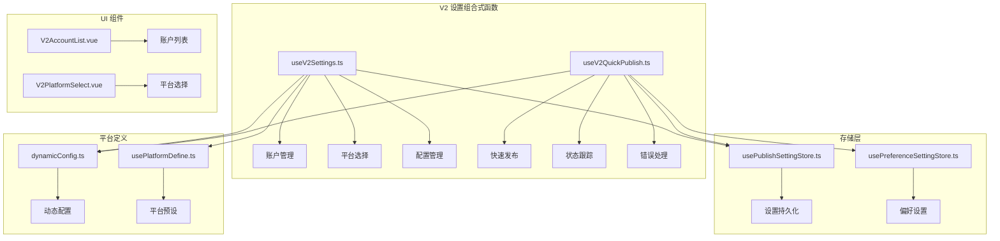
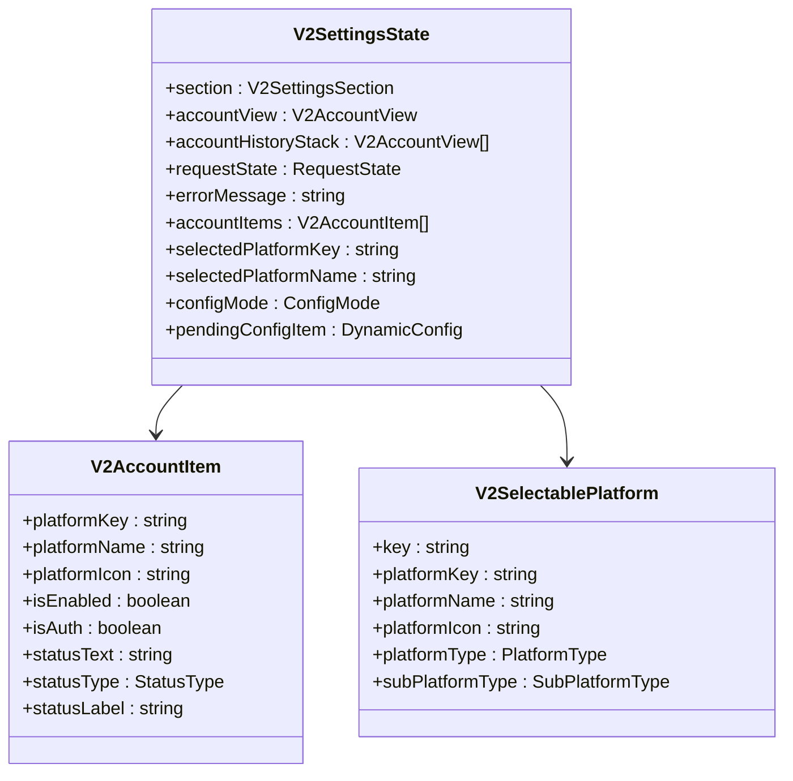
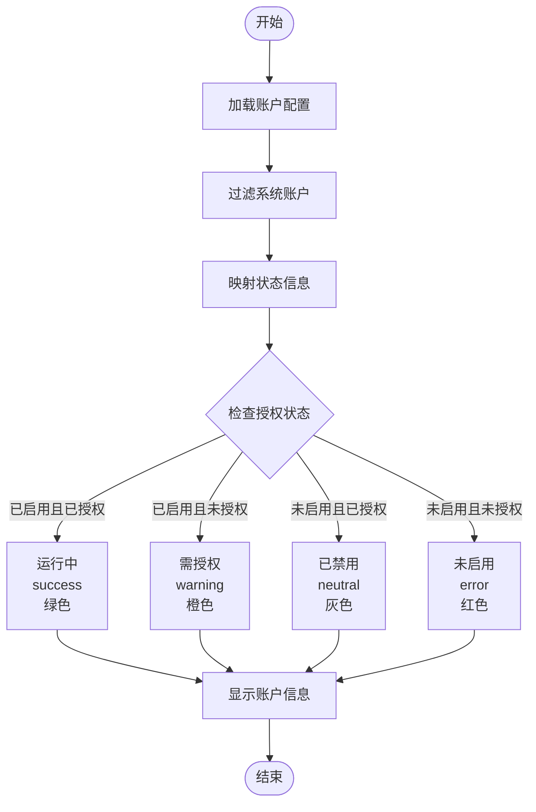
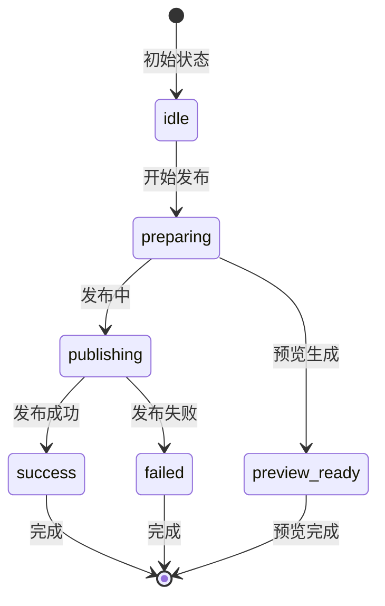
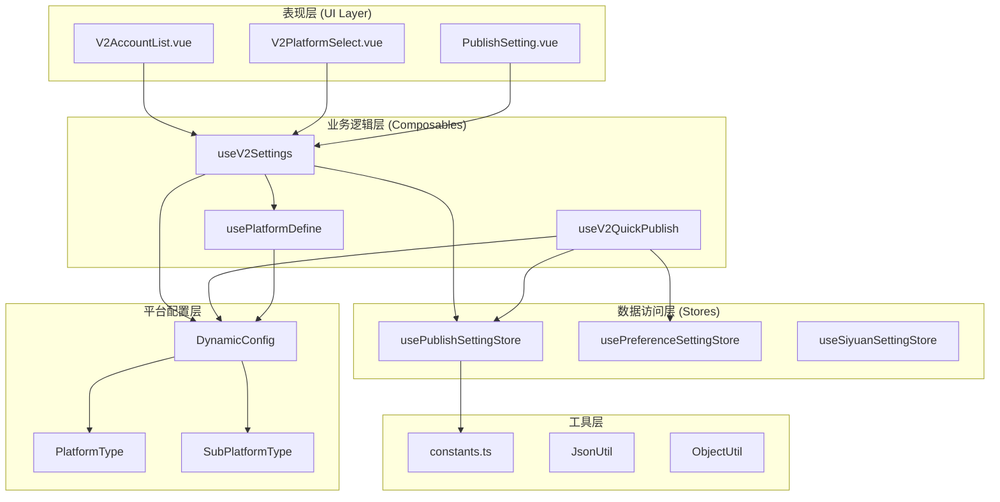
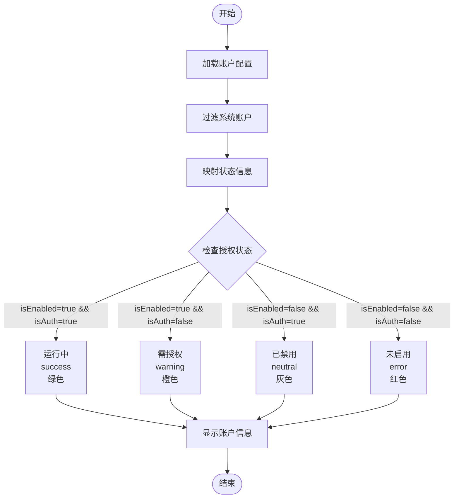
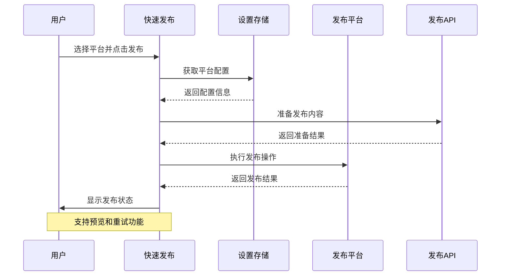
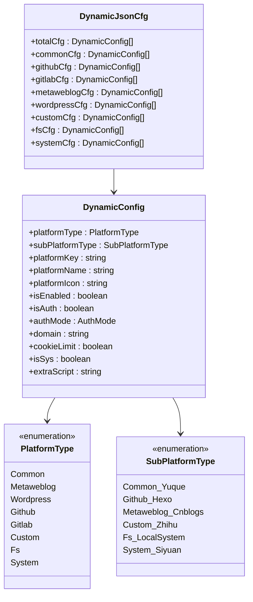
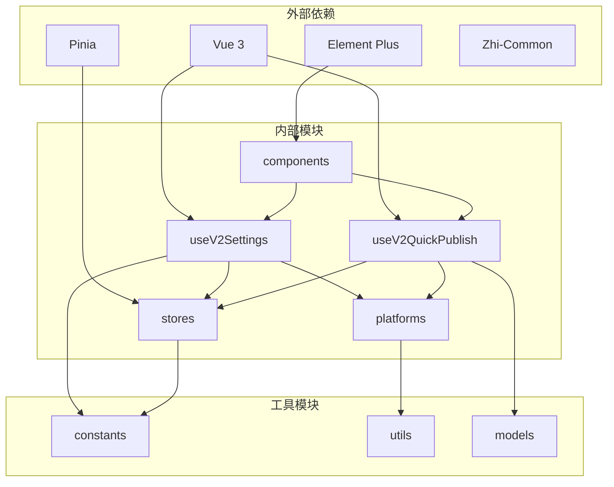

# V2 设置组合式函数

<cite>
**本文档引用的文件**
- [useV2Settings.ts](file://src/composables/v2/useV2Settings.ts)
- [useV2QuickPublish.ts](file://src/composables/v2/useV2QuickPublish.ts)
- [usePublishSettingStore.ts](file://src/stores/usePublishSettingStore.ts)
- [usePreferenceSettingStore.ts](file://src/stores/usePreferenceSettingStore.ts)
- [dynamicConfig.ts](file://src/platforms/dynamicConfig.ts)
- [constants.ts](file://src/utils/constants.ts)
- [usePlatformDefine.ts](file://src/composables/usePlatformDefine.ts)
- [V2AccountList.vue](file://src/components/v2/settings/V2AccountList.vue)
- [V2PlatformSelect.vue](file://src/components/v2/settings/V2PlatformSelect.vue)
- [PublishSetting.vue](file://src/components/set/PublishSetting.vue)
</cite>

## 更新摘要
**变更内容**
- 更新了账号项目处理逻辑，增加了更详细的状态标签系统
- 扩展了状态计算逻辑以处理四种不同状态（运行中、需授权、已禁用、未启用）
- 增强了视觉表示和用户友好标签的显示
- 改进了状态类型的分类和颜色编码

## 目录
1. [简介](#简介)
2. [项目结构](#项目结构)
3. [核心组件](#核心组件)
4. [架构概览](#架构概览)
5. [详细组件分析](#详细组件分析)
6. [依赖关系分析](#依赖关系分析)
7. [性能考虑](#性能考虑)
8. [故障排除指南](#故障排除指南)
9. [结论](#结论)

## 简介

V2 设置组合式函数是 SiYuan 插件发布器中的核心功能模块，负责管理平台账户设置、配置管理和发布流程控制。该模块采用 Vue 3 的组合式 API 设计，提供了完整的账户生命周期管理、平台配置管理和快速发布功能。

该系统支持多种发布平台（WordPress、博客园、GitHub Pages、GitLab Pages 等），并通过动态配置机制实现了灵活的平台扩展能力。通过组合式函数的设计，实现了状态管理、业务逻辑和 UI 组件的解耦，提高了代码的可维护性和可测试性。

**更新** 新增了改进的账号项目处理逻辑，根据平台启用状态和授权状态生成更具描述性的状态标签，提供四种明确的状态分类和相应的视觉表示。

## 项目结构

V2 设置模块位于项目的 `src/composables/v2/` 目录下，主要包含以下关键文件：

**图表来源**
- [useV2Settings.ts:1-235](file://src/composables/v2/useV2Settings.ts#L1-L235)
- [useV2QuickPublish.ts:1-310](file://src/composables/v2/useV2QuickPublish.ts#L1-L310)

**章节来源**
- [useV2Settings.ts:1-235](file://src/composables/v2/useV2Settings.ts#L1-L235)
- [useV2QuickPublish.ts:1-310](file://src/composables/v2/useV2QuickPublish.ts#L1-L310)

## 核心组件

### V2 设置组合式函数

`useV2Settings` 是 V2 设置系统的核心组合式函数，提供了完整的账户管理功能：

#### 主要功能特性

1. **账户状态管理**：管理账户的启用/禁用状态、授权状态
2. **平台选择**：支持 WordPress 和博客园等平台的选择
3. **配置创建**：基于预设模板创建新的平台配置
4. **状态跟踪**：提供详细的账户状态信息和视觉反馈

#### 数据结构设计

**图表来源**
- [useV2Settings.ts:46-57](file://src/composables/v2/useV2Settings.ts#L46-L57)
- [useV2Settings.ts:19-28](file://src/composables/v2/useV2Settings.ts#L19-L28)
- [useV2Settings.ts:30-37](file://src/composables/v2/useV2Settings.ts#L30-L37)

**章节来源**
- [useV2Settings.ts:42-234](file://src/composables/v2/useV2Settings.ts#L42-L234)

### 改进的账号状态处理逻辑

**更新** 账号项目现在支持四种明确的状态分类，每种状态都有对应的视觉表示和用户友好标签：

#### 状态分类系统

**图表来源**
- [useV2Settings.ts:89-122](file://src/composables/v2/useV2Settings.ts#L89-L122)

#### 状态标签和视觉表示

| 状态类型 | 状态标签 | 状态文本 | 视觉颜色 | 状态类型 |
|---------|---------|---------|---------|---------|
| 运行中 | 运行中 | 已启用 · 已授权 | 成功绿色 | success |
| 需授权 | 需授权 | 已启用 · 未授权 | 警告橙色 | warning |
| 已禁用 | 已禁用 | 未启用 · 已授权 | 中性灰色 | neutral |
| 未启用 | 未启用 | 未启用 · 未授权 | 错误红色 | error |

**章节来源**
- [useV2Settings.ts:89-122](file://src/composables/v2/useV2Settings.ts#L89-L122)

### V2 快速发布组合式函数

`useV2QuickPublish` 提供了快速发布功能，集成了发布状态跟踪和错误处理：

#### 核心功能

1. **发布状态管理**：跟踪发布过程中的各个阶段状态
2. **平台集成**：支持多个平台的统一发布接口
3. **预览功能**：提供文章预览链接生成功能
4. **重试机制**：支持发布失败后的自动重试

#### 发布流程状态

**图表来源**
- [useV2QuickPublish.ts:22-24](file://src/composables/v2/useV2QuickPublish.ts#L22-L24)

**章节来源**
- [useV2QuickPublish.ts:25-309](file://src/composables/v2/useV2QuickPublish.ts#L25-L309)

## 架构概览

V2 设置系统采用了分层架构设计，确保了各组件间的职责分离和松耦合：

**图表来源**
- [useV2Settings.ts:1-15](file://src/composables/v2/useV2Settings.ts#L1-L15)
- [useV2QuickPublish.ts:1-12](file://src/composables/v2/useV2QuickPublish.ts#L1-L12)

## 详细组件分析

### 账户管理组件

账户管理是 V2 设置系统的核心功能，提供了完整的账户生命周期管理：

#### 改进的账户状态转换流程

**更新** 新增了四状态分类系统，替代了原有的二状态判断：

**图表来源**
- [useV2Settings.ts:89-122](file://src/composables/v2/useV2Settings.ts#L89-L122)

#### 账户操作流程

账户管理支持以下主要操作：

1. **账户切换**：启用/禁用现有账户
2. **平台选择**：从可用平台中选择新平台
3. **配置创建**：基于预设模板创建新配置
4. **配置编辑**：修改现有账户配置
5. **账户删除**：删除不需要的账户配置

**章节来源**
- [useV2Settings.ts:125-220](file://src/composables/v2/useV2Settings.ts#L125-L220)

### 快速发布组件

快速发布功能提供了简化的发布流程，特别针对单篇文档的快速发布场景：

#### 发布流程序列

**图表来源**
- [useV2QuickPublish.ts:145-198](file://src/composables/v2/useV2QuickPublish.ts#L145-L198)

#### 错误处理机制

快速发布组件实现了完善的错误处理机制：

1. **配置验证**：检查平台配置的完整性
2. **网络异常处理**：捕获和处理网络请求错误
3. **状态恢复**：在错误发生后恢复到安全状态
4. **用户反馈**：提供清晰的错误信息和解决方案

**章节来源**
- [useV2QuickPublish.ts:190-197](file://src/composables/v2/useV2QuickPublish.ts#L190-L197)

### 平台配置管理

平台配置管理是整个系统的基础，负责管理各种发布平台的配置信息：

#### 配置数据模型

**图表来源**
- [dynamicConfig.ts:13-113](file://src/platforms/dynamicConfig.ts#L13-L113)
- [dynamicConfig.ts:247-257](file://src/platforms/dynamicConfig.ts#L247-L257)
- [dynamicConfig.ts:126-166](file://src/platforms/dynamicConfig.ts#L126-L166)
- [dynamicConfig.ts:174-242](file://src/platforms/dynamicConfig.ts#L174-L242)

**章节来源**
- [dynamicConfig.ts:1-540](file://src/platforms/dynamicConfig.ts#L1-L540)

## 依赖关系分析

V2 设置系统具有清晰的依赖关系层次结构：

**图表来源**
- [useV2Settings.ts:1-15](file://src/composables/v2/useV2Settings.ts#L1-L15)
- [useV2QuickPublish.ts:1-12](file://src/composables/v2/useV2QuickPublish.ts#L1-L12)

### 核心依赖关系

1. **状态管理依赖**：组合式函数依赖 Pinia 进行状态管理
2. **平台配置依赖**：动态配置系统提供平台类型定义
3. **存储层依赖**：设置存储提供持久化功能
4. **UI 组件依赖**：Vue 组件提供用户界面交互

**章节来源**
- [usePublishSettingStore.ts:10-25](file://src/stores/usePublishSettingStore.ts#L10-L25)
- [usePreferenceSettingStore.ts:10-16](file://src/stores/usePreferenceSettingStore.ts#L10-L16)

## 性能考虑

V2 设置系统在设计时充分考虑了性能优化：

### 状态管理优化

1. **响应式状态**：使用 Vue 3 的响应式系统实现高效的状态更新
2. **计算属性缓存**：利用 computed 属性避免不必要的重新计算
3. **按需加载**：只在需要时加载和解析配置数据

### 数据访问优化

1. **缓存策略**：设置存储实现了本地缓存机制
2. **异步加载**：配置数据采用异步加载方式
3. **增量更新**：支持部分数据的增量更新

### UI 性能优化

1. **虚拟滚动**：账户列表支持大量数据的虚拟滚动
2. **懒加载组件**：非关键组件采用懒加载策略
3. **事件防抖**：输入事件采用防抖处理减少重绘

## 故障排除指南

### 常见问题及解决方案

#### 账户状态异常

**问题描述**：账户状态显示不正确或状态切换失效

**可能原因**：
1. 配置数据损坏
2. 状态同步问题
3. 缓存数据过期

**解决步骤**：
1. 检查配置文件格式
2. 清除应用缓存
3. 重新加载设置页面

#### 发布失败处理

**问题描述**：快速发布过程中出现错误

**解决方法**：
1. 检查网络连接状态
2. 验证平台配置信息
3. 查看错误日志详情
4. 尝试重新发布

#### 平台配置丢失

**问题描述**：平台配置在重启后丢失

**预防措施**：
1. 定期备份配置文件
2. 使用云同步服务
3. 验证存储权限设置

**章节来源**
- [useV2QuickPublish.ts:55-60](file://src/composables/v2/useV2QuickPublish.ts#L55-L60)
- [useV2Settings.ts:157-170](file://src/composables/v2/useV2Settings.ts#L157-L170)

## 结论

V2 设置组合式函数为 SiYuan 插件发布器提供了强大而灵活的设置管理功能。通过模块化的架构设计和清晰的职责分离，该系统实现了：

1. **高度可扩展性**：支持多种发布平台和自定义扩展
2. **良好的用户体验**：直观的界面设计和流畅的操作流程
3. **可靠的稳定性**：完善的错误处理和状态管理机制
4. **优秀的性能表现**：优化的数据访问和状态更新策略

**更新** 新增的四状态分类系统显著提升了用户体验，用户现在可以更精确地了解每个平台账户的当前状态，并获得相应的视觉反馈。这种改进使得用户能够更有效地管理他们的发布平台配置，提高了整体的使用效率和满意度。

该系统的成功实施为类似的内容发布工具提供了宝贵的参考经验，特别是在组合式 API 的应用、状态管理和平台扩展方面都具有重要的借鉴意义。