# V2 设置组合式函数

<cite>
**本文档引用的文件**
- [useV2Settings.ts](file://src/composables/v2/useV2Settings.ts)
- [useV2QuickPublish.ts](file://src/composables/v2/useV2QuickPublish.ts)
- [useV2PublishValidation.ts](file://src/composables/v2/useV2PublishValidation.ts)
- [useV2ErrorDetails.ts](file://src/composables/v2/useV2ErrorDetails.ts)
- [useV2ErrorDetails.spec.ts](file://src/composables/v2/useV2ErrorDetails.spec.ts)
- [usePublishSettingStore.ts](file://src/stores/usePublishSettingStore.ts)
- [usePreferenceSettingStore.ts](file://src/stores/usePreferenceSettingStore.ts)
- [dynamicConfig.ts](file://src/platforms/dynamicConfig.ts)
- [constants.ts](file://src/utils/constants.ts)
- [usePlatformDefine.ts](file://src/composables/usePlatformDefine.ts)
- [V2AccountList.vue](file://src/components/v2/settings/V2AccountList.vue)
- [V2PlatformSelect.vue](file://src/components/v2/settings/V2PlatformSelect.vue)
- [V2PlatformConfigBridge.vue](file://src/components/v2/settings/V2PlatformConfigBridge.vue)
- [platformConfigActionBridge.ts](file://src/components/v2/settings/bridge/platformConfigActionBridge.ts)
- [V2App.vue](file://src/components/v2/V2App.vue)
- [SypErrorDetailsPanel.vue](file://src/components/v2/common/SypErrorDetailsPanel.vue)
- [sensitiveLogSanitizer.ts](file://src/utils/sensitiveLogSanitizer.ts)
- [proposal.md](file://openspec/changes/expose-v2-platform-config-validation-errors/proposal.md)
- [design.md](file://openspec/changes/expose-v2-platform-config-validation-errors/design.md)
- [spec.md](file://openspec/changes/expose-v2-platform-config-validation-errors/specs/v2-platform-config-validation-feedback/spec.md)
- [spec.md](file://openspec/changes/expose-v2-platform-config-validation-errors/specs/v2-hosted-error-details/spec.md)
- [v2ConfigValidatedFlow.spec.ts](file://src/components/v2/v2ConfigValidatedFlow.spec.ts)
</cite>

## 更新摘要
**变更内容**
- 新增 useV2ErrorDetails 组合式函数，提供统一的错误详情管理能力
- 改进的验证错误处理流程，支持完整的错误信息传递和脱敏处理
- 增强的类型安全，完善了 V2PlatformConfigValidationResult 接口定义
- 扩展的测试覆盖，包含 useV2ErrorDetails 的完整单元测试
- 优化的错误处理架构，实现了配置验证与发布失败的统一错误详情处理

## 目录
1. [简介](#简介)
2. [项目结构](#项目结构)
3. [核心组件](#核心组件)
4. [架构概览](#架构概览)
5. [详细组件分析](#详细组件分析)
6. [新增的 useV2ErrorDetails 组合式函数](#新增的-usev2errordetails-组合式函数)
7. [改进的平台配置验证增强](#改进的平台配置验证增强)
8. [错误处理机制](#错误处理机制)
9. [依赖关系分析](#依赖关系分析)
10. [性能考虑](#性能考虑)
11. [故障排除指南](#故障排除指南)
12. [结论](#结论)

## 简介

V2 设置组合式函数是 SiYuan 插件发布器中的核心功能模块，负责管理平台账户设置、配置管理和发布流程控制。该模块采用 Vue 3 的组合式 API 设计，提供了完整的账户生命周期管理、平台配置管理和快速发布功能。

该系统支持多种发布平台（WordPress、博客园、GitHub Pages、GitLab Pages 等），并通过动态配置机制实现了灵活的平台扩展能力。通过组合式函数的设计，实现了状态管理、业务逻辑和 UI 组件的解耦，提高了代码的可维护性和可测试性。

**更新** 新增了 useV2ErrorDetails 组合式函数，提供了统一的错误详情管理能力，增强了 V2 设置组合式函数的功能。该函数封装了 SypErrorDetailsPanel 的显示/隐藏逻辑，并集成了敏感信息脱敏处理，为配置验证和发布失败提供了统一的错误处理体验。

## 项目结构

V2 设置模块位于项目的 `src/composables/v2/` 目录下，主要包含以下关键文件：

```mermaid
graph TB
subgraph "V2 设置组合式函数"
A[useV2Settings.ts] --> B[账户管理]
A --> C[平台选择]
A --> D[配置管理]
E[useV2QuickPublish.ts] --> F[快速发布]
E --> G[状态跟踪]
E --> H[错误处理]
I[useV2PublishValidation.ts] --> J[发布验证]
I --> K[授权管理]
L[useV2ErrorDetails.ts] --> M[错误详情管理]
L --> N[脱敏处理]
end
subgraph "存储层"
O[usePublishSettingStore.ts] --> P[设置持久化]
Q[usePreferenceSettingStore.ts] --> R[偏好设置]
end
subgraph "平台定义"
S[dynamicConfig.ts] --> T[动态配置]
U[usePlatformDefine.ts] --> V[平台预设]
end
subgraph "UI 组件"
W[V2AccountList.vue] --> X[账户列表]
Y[V2PlatformSelect.vue] --> Z[平台选择]
AA[V2PlatformConfigBridge.vue] --> BB[配置桥接]
CC[SypErrorDetailsPanel.vue] --> DD[错误详情]
end
subgraph "错误处理"
EE[sensitiveLogSanitizer.ts] --> FF[敏感信息脱敏]
GG[platformConfigActionBridge.ts] --> HH[验证事件契约]
II[V2App.vue] --> JJ[错误详情集成]
end
A --> O
A --> S
E --> O
E --> S
I --> O
I --> S
L --> EE
CC --> II
```

**图表来源**
- [useV2Settings.ts:1-323](file://src/composables/v2/useV2Settings.ts#L1-L323)
- [useV2QuickPublish.ts:1-312](file://src/composables/v2/useV2QuickPublish.ts#L1-L312)
- [useV2PublishValidation.ts:1-86](file://src/composables/v2/useV2PublishValidation.ts#L1-L86)
- [useV2ErrorDetails.ts:1-67](file://src/composables/v2/useV2ErrorDetails.ts#L1-L67)

**章节来源**
- [useV2Settings.ts:1-323](file://src/composables/v2/useV2Settings.ts#L1-L323)
- [useV2QuickPublish.ts:1-312](file://src/composables/v2/useV2QuickPublish.ts#L1-L312)
- [useV2PublishValidation.ts:1-86](file://src/composables/v2/useV2PublishValidation.ts#L1-L86)
- [useV2ErrorDetails.ts:1-67](file://src/composables/v2/useV2ErrorDetails.ts#L1-L67)

## 核心组件

### V2 设置组合式函数

`useV2Settings` 是 V2 设置系统的核心组合式函数，提供了完整的账户管理功能：

#### 主要功能特性

1. **账户状态管理**：管理账户的启用/禁用状态、授权状态
2. **平台选择**：支持 WordPress 和博客园等平台的选择
3. **配置创建**：基于预设模板创建新的平台配置
4. **状态跟踪**：提供详细的账户状态信息和视觉反馈
5. **配置验证**：集成平台配置验证和错误处理能力

#### 数据结构设计

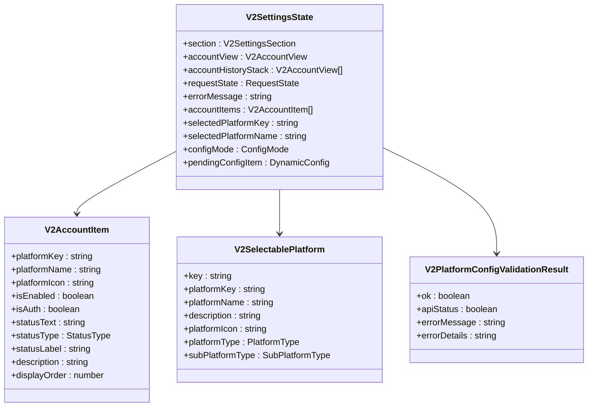
```mermaid
classDiagram
class V2SettingsState {
+section : V2SettingsSection
+accountView : V2AccountView
+accountHistoryStack : V2AccountView[]
+requestState : RequestState
+errorMessage : string
+accountItems : V2AccountItem[]
+selectedPlatformKey : string
+selectedPlatformName : string
+configMode : ConfigMode
+pendingConfigItem : DynamicConfig
}
class V2AccountItem {
+platformKey : string
+platformName : string
+platformIcon : string
+isEnabled : boolean
+isAuth : boolean
+statusText : string
+statusType : StatusType
+statusLabel : string
+description : string
+displayOrder : number
}
class V2SelectablePlatform {
+key : string
+platformKey : string
+platformName : string
+description : string
+platformIcon : string
+platformType : PlatformType
+subPlatformType : SubPlatformType
}
class V2PlatformConfigValidationResult {
+ok : boolean
+apiStatus : boolean
+errorMessage : string
+errorDetails : string
}
V2SettingsState --> V2AccountItem
V2SettingsState --> V2SelectablePlatform
V2SettingsState --> V2PlatformConfigValidationResult
```

**图表来源**
- [useV2Settings.ts:23-44](file://src/composables/v2/useV2Settings.ts#L23-L44)
- [useV2Settings.ts:125-173](file://src/composables/v2/useV2Settings.ts#L125-L173)

**章节来源**
- [useV2Settings.ts:46-323](file://src/composables/v2/useV2Settings.ts#L46-L323)

### 改进的账号状态处理逻辑

**更新** 账号项目现在支持四种明确的状态分类，每种状态都有对应的视觉表示和用户友好标签：

#### 状态分类系统

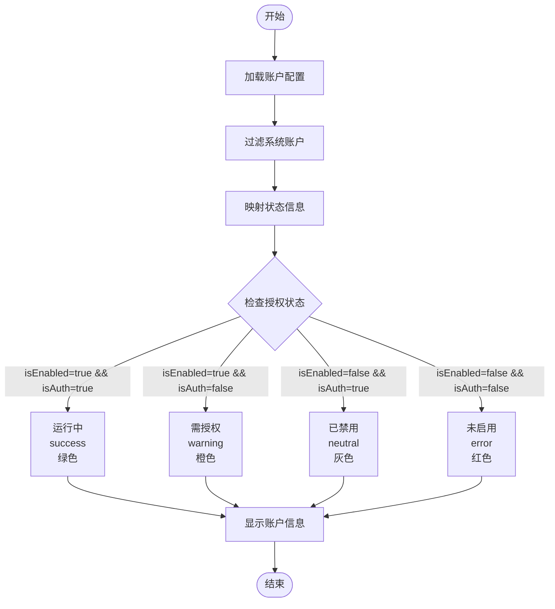
```mermaid
flowchart TD
Start([开始]) --> Load[加载账户配置]
Load --> Filter[过滤系统账户]
Filter --> Map[映射状态信息]
Map --> CheckAuth{检查授权状态}
CheckAuth --> |isEnabled=true && isAuth=true| Success[运行中<br/>success<br/>绿色]
CheckAuth --> |isEnabled=true && isAuth=false| Warning[需授权<br/>warning<br/>橙色]
CheckAuth --> |isEnabled=false && isAuth=true| Neutral[已禁用<br/>neutral<br/>灰色]
CheckAuth --> |isEnabled=false && isAuth=false| Error[未启用<br/>error<br/>红色]
Success --> Display[显示账户信息]
Warning --> Display
Neutral --> Display
Error --> Display
Display --> End([结束])
```

**图表来源**
- [useV2Settings.ts:136-156](file://src/composables/v2/useV2Settings.ts#L136-L156)

#### 状态标签和视觉表示

| 状态类型 | 状态标签 | 状态文本 | 视觉颜色 | 状态类型 |
|---------|---------|---------|---------|---------|
| 运行中 | 运行中 | 已启用 · 已授权 | 成功绿色 | success |
| 需授权 | 需授权 | 已启用 · 未授权 | 警告橙色 | warning |
| 已禁用 | 已禁用 | 未启用 · 已授权 | 中性灰色 | neutral |
| 未启用 | 未启用 | 未启用 · 未授权 | 错误红色 | error |

**章节来源**
- [useV2Settings.ts:136-156](file://src/composables/v2/useV2Settings.ts#L136-L156)

### V2 快速发布组合式函数

`useV2QuickPublish` 提供了快速发布功能，集成了发布状态跟踪和错误处理：

#### 核心功能

1. **发布状态管理**：跟踪发布过程中的各个阶段状态
2. **平台集成**：支持多个平台的统一发布接口
3. **预览功能**：提供文章预览链接生成功能
4. **重试机制**：支持发布失败后的自动重试
5. **验证集成**：与发布验证功能无缝集成

#### 发布流程状态

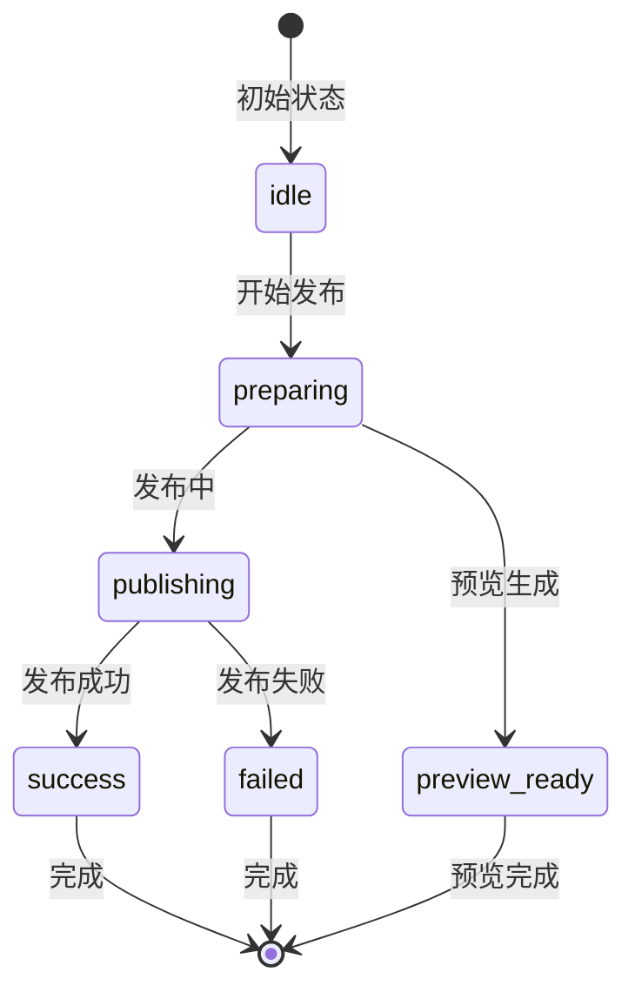
```mermaid
stateDiagram-v2
[*] --> idle : 初始状态
idle --> preparing : 开始发布
preparing --> publishing : 发布中
publishing --> success : 发布成功
publishing --> failed : 发布失败
success --> [*] : 完成
failed --> [*] : 完成
preparing --> preview_ready : 预览生成
preview_ready --> [*] : 预览完成
```

**图表来源**
- [useV2QuickPublish.ts:23-24](file://src/composables/v2/useV2QuickPublish.ts#L23-L24)

**章节来源**
- [useV2QuickPublish.ts:26-312](file://src/composables/v2/useV2QuickPublish.ts#L26-L312)

### V2 发布验证组合式函数

**新增** `useV2PublishValidation` 提供了发布验证功能，与配置验证形成完整的验证体系：

#### 核心功能

1. **发布验证**：验证平台配置是否满足发布要求
2. **授权检查**：检查平台授权状态
3. **配置验证**：验证配置的完整性和有效性
4. **错误聚合**：收集和报告验证失败的原因

#### 验证结果结构

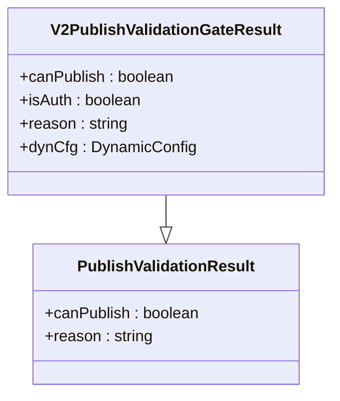
```mermaid
classDiagram
class V2PublishValidationGateResult {
+canPublish : boolean
+isAuth : boolean
+reason : string
+dynCfg : DynamicConfig
}
class PublishValidationResult {
+canPublish : boolean
+reason : string
}
V2PublishValidationGateResult --|> PublishValidationResult
```

**图表来源**
- [useV2PublishValidation.ts:21-24](file://src/composables/v2/useV2PublishValidation.ts#L21-L24)

**章节来源**
- [useV2PublishValidation.ts:26-86](file://src/composables/v2/useV2PublishValidation.ts#L26-L86)

## 架构概览

V2 设置系统采用了分层架构设计，确保了各组件间的职责分离和松耦合：

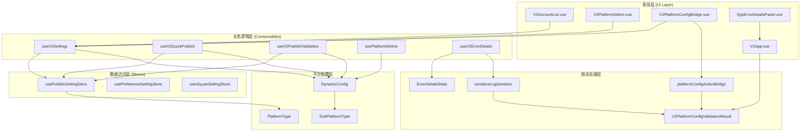
```mermaid
graph TB
subgraph "表现层 (UI Layer)"
A[V2AccountList.vue]
B[V2PlatformSelect.vue]
C[V2PlatformConfigBridge.vue]
D[SypErrorDetailsPanel.vue]
E[V2App.vue]
end
subgraph "业务逻辑层 (Composables)"
F[useV2Settings]
G[useV2QuickPublish]
H[useV2PublishValidation]
I[usePlatformDefine]
J[useV2ErrorDetails]
end
subgraph "数据访问层 (Stores)"
K[usePublishSettingStore]
L[usePreferenceSettingStore]
M[useSiyuanSettingStore]
end
subgraph "平台配置层"
N[DynamicConfig]
O[PlatformType]
P[SubPlatformType]
end
subgraph "错误处理层"
Q[sensitiveLogSanitizer]
R[platformConfigActionBridge]
S[V2PlatformConfigValidationResult]
T[ErrorDetailsState]
end
A --> F
B --> F
C --> F
C --> R
D --> E
E --> S
F --> K
F --> N
G --> K
G --> N
H --> K
H --> N
I --> N
J --> T
J --> Q
K --> O
N --> P
Q --> S
R --> S
```

**图表来源**
- [useV2Settings.ts:1-18](file://src/composables/v2/useV2Settings.ts#L1-L18)
- [useV2QuickPublish.ts:1-12](file://src/composables/v2/useV2QuickPublish.ts#L1-L12)
- [useV2PublishValidation.ts:1-19](file://src/composables/v2/useV2PublishValidation.ts#L1-L19)
- [useV2ErrorDetails.ts:1-18](file://src/composables/v2/useV2ErrorDetails.ts#L1-L18)

## 详细组件分析

### 账户管理组件

账户管理是 V2 设置系统的核心功能，提供了完整的账户生命周期管理：

#### 改进的账户状态转换流程

**更新** 新增了四状态分类系统，替代了原有的二状态判断：

```mermaid
flowchart TD
Start([开始]) --> Load[加载账户配置]
Load --> Filter[过滤系统账户]
Filter --> Map[映射状态信息]
Map --> CheckAuth{检查授权状态}
CheckAuth --> |isEnabled=true && isAuth=true| Running[运行中<br/>success<br/>绿色]
CheckAuth --> |isEnabled=true && isAuth=false| NeedAuth[需授权<br/>warning<br/>橙色]
CheckAuth --> |isEnabled=false && isAuth=true| Disabled[已禁用<br/>neutral<br/>灰色]
CheckAuth --> |isEnabled=false && isAuth=false| NotEnabled[未启用<br/>error<br/>红色]
Running --> Display[显示账户信息]
NeedAuth --> Display
Disabled --> Display
NotEnabled --> Display
Display --> End([结束])
```

**图表来源**
- [useV2Settings.ts:136-156](file://src/composables/v2/useV2Settings.ts#L136-L156)

#### 账户操作流程

账户管理支持以下主要操作：

1. **账户切换**：启用/禁用现有账户
2. **平台选择**：从可用平台中选择新平台
3. **配置创建**：基于预设模板创建新配置
4. **配置编辑**：修改现有账户配置
5. **账户删除**：删除不需要的账户配置

**章节来源**
- [useV2Settings.ts:192-304](file://src/composables/v2/useV2Settings.ts#L192-L304)

### 快速发布组件

快速发布功能提供了简化的发布流程，特别针对单篇文档的快速发布场景：

#### 发布流程序列

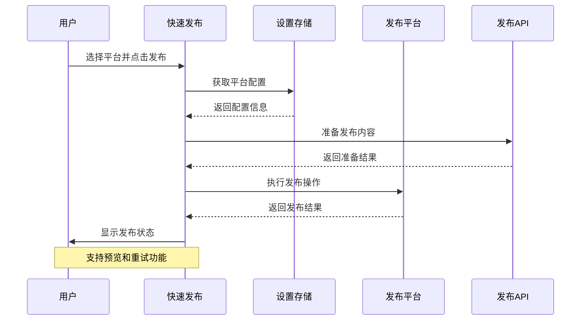
```mermaid
sequenceDiagram
participant User as 用户
participant QuickPub as 快速发布
participant Store as 设置存储
participant Platform as 发布平台
participant API as 发布API
User->>QuickPub : 选择平台并点击发布
QuickPub->>Store : 获取平台配置
Store-->>QuickPub : 返回配置信息
QuickPub->>API : 准备发布内容
API-->>QuickPub : 返回准备结果
QuickPub->>Platform : 执行发布操作
Platform-->>QuickPub : 返回发布结果
QuickPub->>User : 显示发布状态
Note over QuickPub,User : 支持预览和重试功能
```

**图表来源**
- [useV2QuickPublish.ts:147-200](file://src/composables/v2/useV2QuickPublish.ts#L147-L200)

#### 错误处理机制

快速发布组件实现了完善的错误处理机制：

1. **配置验证**：检查平台配置的完整性
2. **网络异常处理**：捕获和处理网络请求错误
3. **状态恢复**：在错误发生后恢复到安全状态
4. **用户反馈**：提供清晰的错误信息和解决方案

**章节来源**
- [useV2QuickPublish.ts:192-200](file://src/composables/v2/useV2QuickPublish.ts#L192-L200)

### 平台配置管理

平台配置管理是整个系统的基础，负责管理各种发布平台的配置信息：

#### 配置数据模型

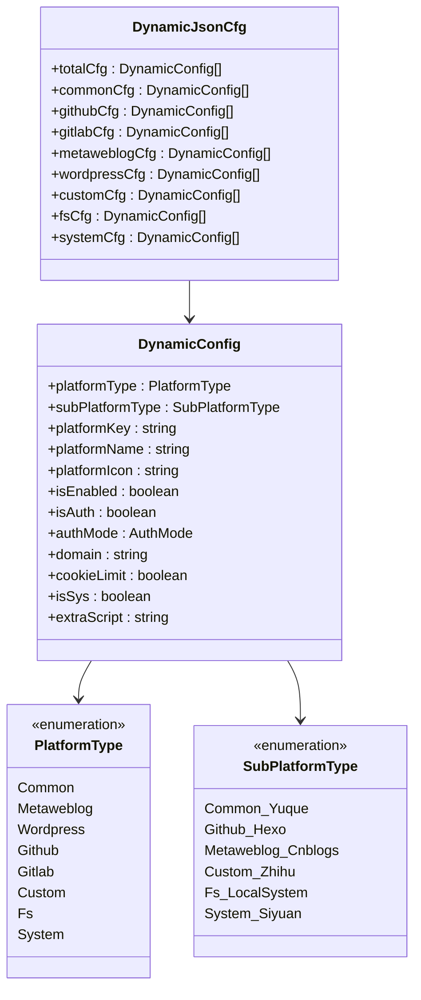
```mermaid
classDiagram
class DynamicConfig {
+platformType : PlatformType
+subPlatformType : SubPlatformType
+platformKey : string
+platformName : string
+platformIcon : string
+isEnabled : boolean
+isAuth : boolean
+authMode : AuthMode
+domain : string
+cookieLimit : boolean
+isSys : boolean
+extraScript : string
}
class DynamicJsonCfg {
+totalCfg : DynamicConfig[]
+commonCfg : DynamicConfig[]
+githubCfg : DynamicConfig[]
+gitlabCfg : DynamicConfig[]
+metaweblogCfg : DynamicConfig[]
+wordpressCfg : DynamicConfig[]
+customCfg : DynamicConfig[]
+fsCfg : DynamicConfig[]
+systemCfg : DynamicConfig[]
}
class PlatformType {
<<enumeration>>
Common
Metaweblog
Wordpress
Github
Gitlab
Custom
Fs
System
}
class SubPlatformType {
<<enumeration>>
Common_Yuque
Github_Hexo
Metaweblog_Cnblogs
Custom_Zhihu
Fs_LocalSystem
System_Siyuan
}
DynamicJsonCfg --> DynamicConfig
DynamicConfig --> PlatformType
DynamicConfig --> SubPlatformType
```

**图表来源**
- [dynamicConfig.ts:13-113](file://src/platforms/dynamicConfig.ts#L13-L113)
- [dynamicConfig.ts:247-257](file://src/platforms/dynamicConfig.ts#L247-L257)
- [dynamicConfig.ts:126-166](file://src/platforms/dynamicConfig.ts#L126-L166)
- [dynamicConfig.ts:174-242](file://src/platforms/dynamicConfig.ts#L174-L242)

**章节来源**
- [dynamicConfig.ts:1-540](file://src/platforms/dynamicConfig.ts#L1-L540)

## 新增的 useV2ErrorDetails 组合式函数

**新增** `useV2ErrorDetails` 是本次更新的核心组件，提供了统一的错误详情管理能力：

### 组合式函数设计

#### 核心功能特性

1. **错误详情状态管理**：集中管理错误详情的显示状态和内容
2. **敏感信息脱敏**：自动脱敏错误详情中的敏感信息
3. **生命周期控制**：提供显示、隐藏、清理和重新打开功能
4. **类型安全**：完整的 TypeScript 接口定义和类型约束

#### 数据结构设计

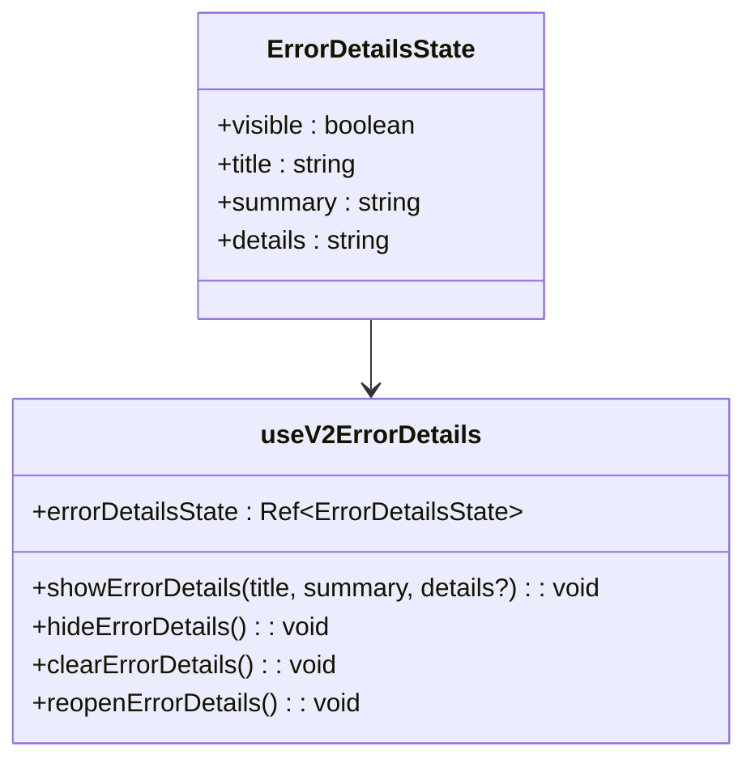
```mermaid
classDiagram
class ErrorDetailsState {
+visible : boolean
+title : string
+summary : string
+details : string
}
class useV2ErrorDetails {
+errorDetailsState : Ref~ErrorDetailsState~
+showErrorDetails(title, summary, details?) : void
+hideErrorDetails() : void
+clearErrorDetails() : void
+reopenErrorDetails() : void
}
ErrorDetailsState --> useV2ErrorDetails
```

**图表来源**
- [useV2ErrorDetails.ts:13-18](file://src/composables/v2/useV2ErrorDetails.ts#L13-L18)
- [useV2ErrorDetails.ts:20-66](file://src/composables/v2/useV2ErrorDetails.ts#L20-L66)

#### 错误详情状态管理

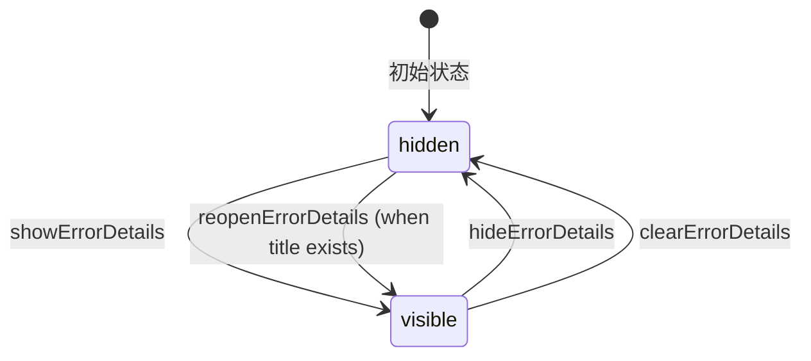
```mermaid
stateDiagram-v2
[*] --> hidden : 初始状态
hidden --> visible : showErrorDetails
visible --> hidden : hideErrorDetails
visible --> hidden : clearErrorDetails
hidden --> visible : reopenErrorDetails (when title exists)
```

**图表来源**
- [useV2ErrorDetails.ts:28-57](file://src/composables/v2/useV2ErrorDetails.ts#L28-L57)

### 错误详情脱敏处理

#### 脱敏策略实现

**更新** 错误详情现在支持自动脱敏敏感信息：

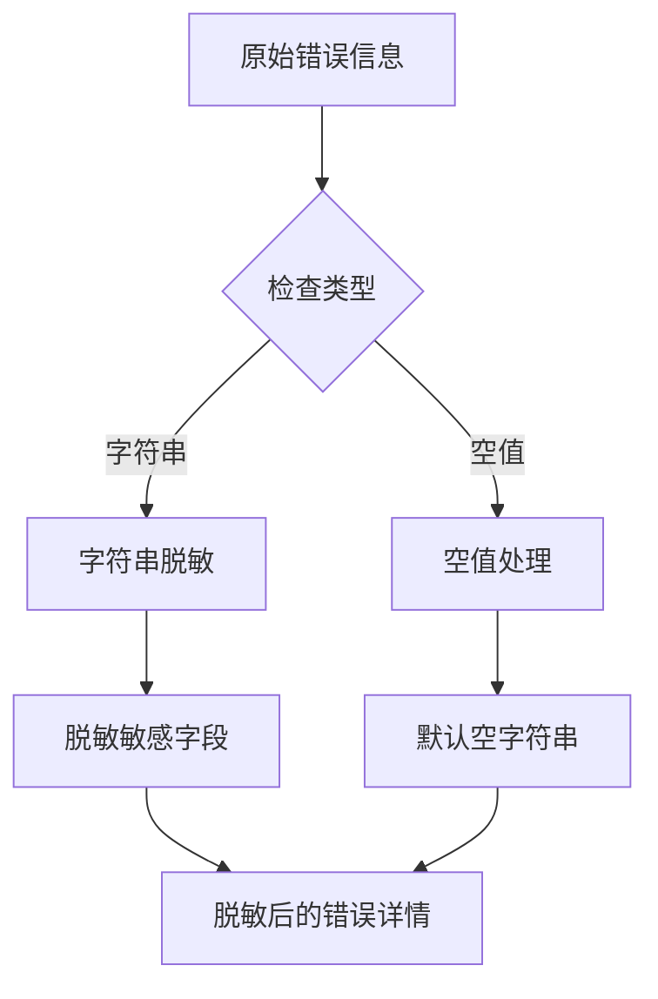
```mermaid
flowchart TD
Input[原始错误信息] --> CheckType{检查类型}
CheckType --> |字符串| StringSanitize[字符串脱敏]
CheckType --> |空值| EmptySanitize[空值处理]
StringSanitize --> RedactSensitive[脱敏敏感字段]
EmptySanitize --> DefaultEmpty[默认空字符串]
RedactSensitive --> Output[脱敏后的错误详情]
DefaultEmpty --> Output
```

**图表来源**
- [useV2ErrorDetails.ts:28-38](file://src/composables/v2/useV2ErrorDetails.ts#L28-L38)

#### 脱敏规则

| 敏感字段类型 | 匹配正则 | 脱敏示例 |
|-------------|----------|----------|
| Cookie | `(cookie)` | `<redacted>` |
| Authorization | `(authorization)` | `<redacted>` |
| Token | `(token)` | `<redacted>` |
| CSRF | `(csrf)` | `<redacted>` |
| Ticket | `(ticket)` | `<redacted>` |
| CToken | `(ctoken)` | `<redacted>` |

**章节来源**
- [useV2ErrorDetails.ts:1-67](file://src/composables/v2/useV2ErrorDetails.ts#L1-L67)

### 测试覆盖

#### 单元测试设计

**新增** 完整的单元测试确保了错误详情管理功能的可靠性：

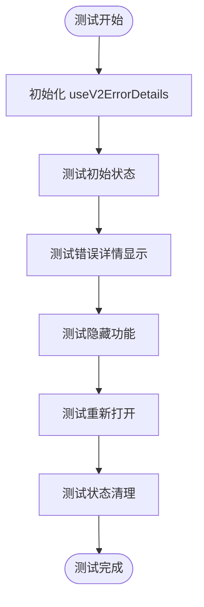
```mermaid
flowchart TD
Start([测试开始]) --> Init[初始化 useV2ErrorDetails]
Init --> Test1[测试初始状态]
Test1 --> Test2[测试错误详情显示]
Test2 --> Test3[测试隐藏功能]
Test3 --> Test4[测试重新打开]
Test4 --> Test5[测试状态清理]
Test5 --> End([测试完成])
```

**图表来源**
- [useV2ErrorDetails.spec.ts:13-82](file://src/composables/v2/useV2ErrorDetails.spec.ts#L13-L82)

#### 测试场景覆盖

1. **初始化测试**：验证错误详情初始状态为隐藏且内容为空
2. **显示测试**：验证错误详情显示时的脱敏处理和内容传递
3. **隐藏测试**：验证错误详情隐藏时的状态保持
4. **重新打开测试**：验证标题存在时的重新打开功能
5. **清理测试**：验证错误详情状态的完全清理

**章节来源**
- [useV2ErrorDetails.spec.ts:1-83](file://src/composables/v2/useV2ErrorDetails.spec.ts#L1-L83)

## 改进的平台配置验证增强

**更新** 平台配置验证功能得到了全面增强，新增了 useV2ErrorDetails 组合式函数的支持：

### 验证事件契约扩展

#### V2 平台配置验证结果

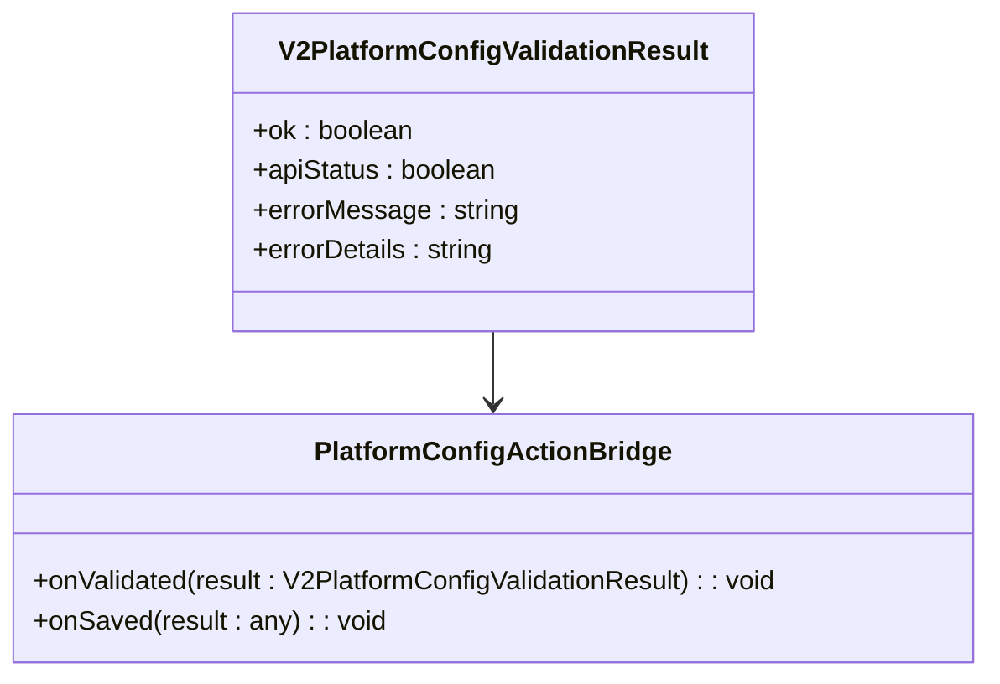
```mermaid
classDiagram
class V2PlatformConfigValidationResult {
+ok : boolean
+apiStatus : boolean
+errorMessage : string
+errorDetails : string
}
class PlatformConfigActionBridge {
+onValidated(result : V2PlatformConfigValidationResult) : void
+onSaved(result : any) : void
}
V2PlatformConfigValidationResult --> PlatformConfigActionBridge
```

**图表来源**
- [platformConfigActionBridge.ts:12-17](file://src/components/v2/settings/bridge/platformConfigActionBridge.ts#L12-L17)

#### 验证流程增强

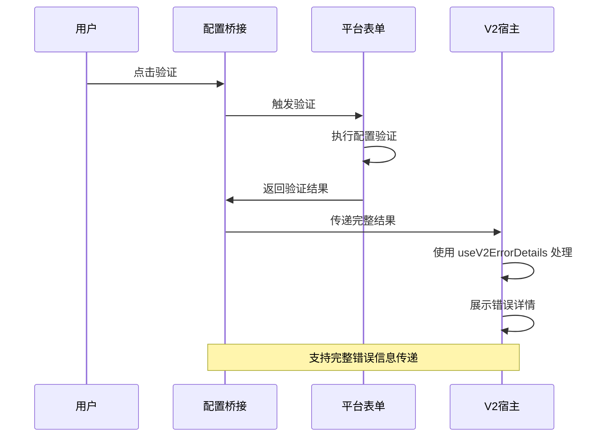
```mermaid
sequenceDiagram
participant User as 用户
participant Bridge as 配置桥接
participant Form as 平台表单
participant Host as V2宿主
User->>Bridge : 点击验证
Bridge->>Form : 触发验证
Form->>Form : 执行配置验证
Form->>Bridge : 返回验证结果
Bridge->>Host : 传递完整结果
Host->>Host : 使用 useV2ErrorDetails 处理
Host->>Host : 展示错误详情
Note over Bridge,Host : 支持完整错误信息传递
```

**图表来源**
- [proposal.md:3-11](file://openspec/changes/expose-v2-platform-config-validation-errors/proposal.md#L3-L11)

### 错误详情展示系统

#### SypErrorDetailsPanel 集成

**更新** 错误详情面板组件现在通过 useV2ErrorDetails 统一管理：

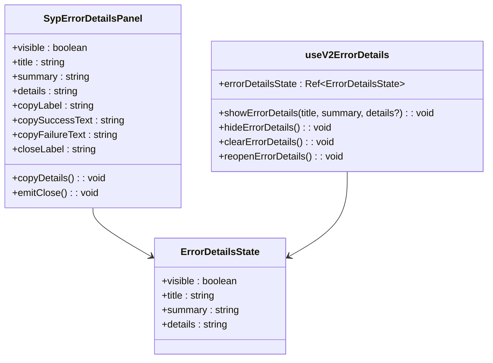
```mermaid
classDiagram
class SypErrorDetailsPanel {
+visible : boolean
+title : string
+summary : string
+details : string
+copyLabel : string
+copySuccessText : string
+copyFailureText : string
+closeLabel : string
+copyDetails() : void
+emitClose() : void
}
class ErrorDetailsState {
+visible : boolean
+title : string
+summary : string
+details : string
}
class useV2ErrorDetails {
+errorDetailsState : Ref~ErrorDetailsState~
+showErrorDetails(title, summary, details?) : void
+hideErrorDetails() : void
+clearErrorDetails() : void
+reopenErrorDetails() : void
}
SypErrorDetailsPanel --> ErrorDetailsState
useV2ErrorDetails --> ErrorDetailsState
```

**图表来源**
- [SypErrorDetailsPanel.vue:59-72](file://src/components/v2/common/SypErrorDetailsPanel.vue#L59-L72)
- [useV2ErrorDetails.ts:13-18](file://src/composables/v2/useV2ErrorDetails.ts#L13-L18)
- [useV2ErrorDetails.ts:20-66](file://src/composables/v2/useV2ErrorDetails.ts#L20-L66)

#### 错误详情展示流程

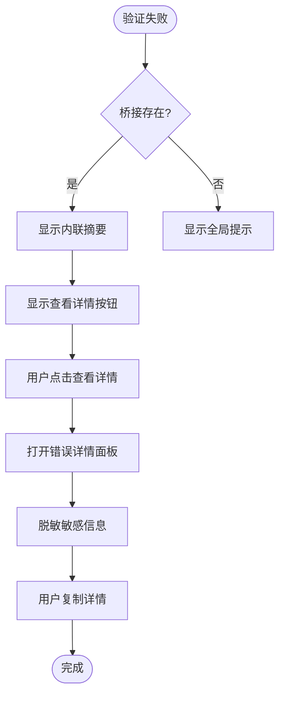
```mermaid
flowchart TD
Start([验证失败]) --> CheckBridge{桥接存在?}
CheckBridge --> |是| ShowInline[显示内联摘要]
CheckBridge --> |否| ShowGlobal[显示全局提示]
ShowInline --> ShowDetails[显示查看详情按钮]
ShowDetails --> ClickDetails[用户点击查看详情]
ClickDetails --> OpenPanel[打开错误详情面板]
OpenPanel --> SanitizeDetails[脱敏敏感信息]
SanitizeDetails --> CopyDetails[用户复制详情]
CopyDetails --> End([完成])
```

**图表来源**
- [design.md:34-54](file://openspec/changes/expose-v2-platform-config-validation-errors/design.md#L34-L54)

### 敏感信息脱敏处理

#### 脱敏策略实现

**更新** 敏感信息脱敏工具确保错误详情中的敏感信息得到适当处理：

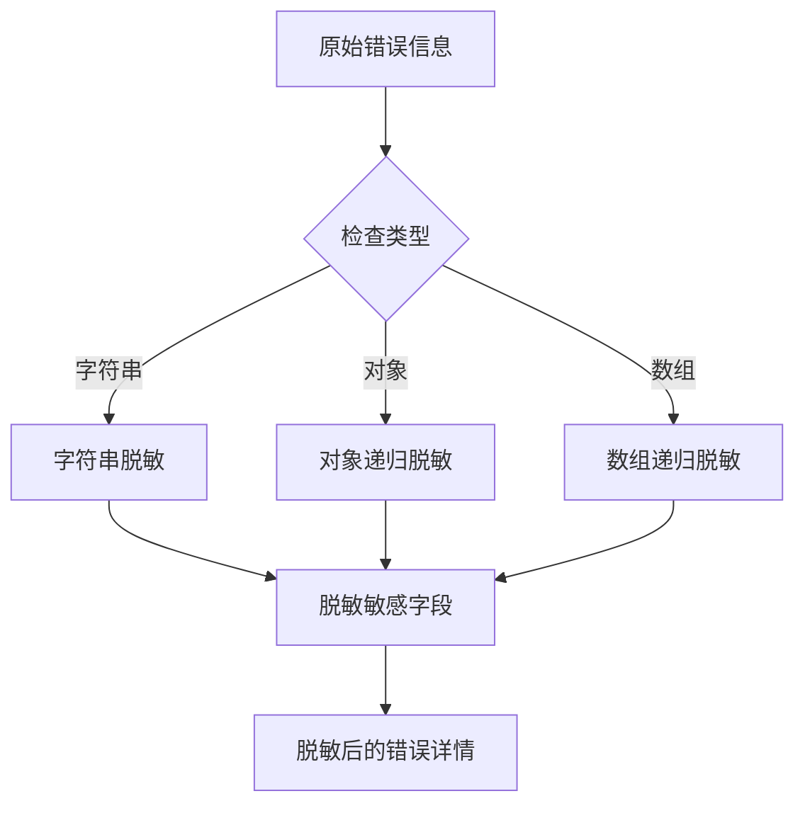
```mermaid
flowchart TD
Input[原始错误信息] --> CheckType{检查类型}
CheckType --> |字符串| StringSanitize[字符串脱敏]
CheckType --> |对象| ObjectSanitize[对象递归脱敏]
CheckType --> |数组| ArraySanitize[数组递归脱敏]
StringSanitize --> RedactSensitive[脱敏敏感字段]
ObjectSanitize --> RedactSensitive
ArraySanitize --> RedactSensitive
RedactSensitive --> Output[脱敏后的错误详情]
```

**图表来源**
- [sensitiveLogSanitizer.ts:24-46](file://src/utils/sensitiveLogSanitizer.ts#L24-L46)

#### 脱敏规则

| 敏感字段类型 | 匹配正则 | 脱敏示例 |
|-------------|----------|----------|
| Cookie | `(cookie)` | `<redacted>` |
| Authorization | `(authorization)` | `<redacted>` |
| Token | `(token)` | `<redacted>` |
| CSRF | `(csrf)` | `<redacted>` |
| Ticket | `(ticket)` | `<redacted>` |
| CToken | `(ctoken)` | `<redacted>` |

**章节来源**
- [sensitiveLogSanitizer.ts:12-19](file://src/utils/sensitiveLogSanitizer.ts#L12-L19)

## 错误处理机制

**更新** 完善的错误处理机制确保了用户能够获得清晰、可操作的错误反馈，新增了 useV2ErrorDetails 的集成：

### 错误处理架构

#### 错误传播路径

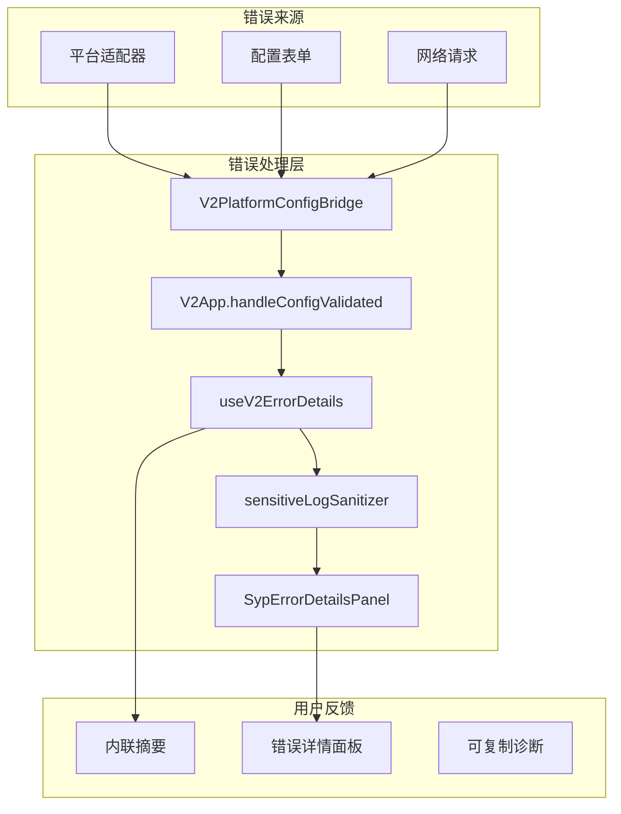
```mermaid
graph TB
subgraph "错误来源"
A[平台适配器]
B[配置表单]
C[网络请求]
end
subgraph "错误处理层"
D[V2PlatformConfigBridge]
E[V2App.handleConfigValidated]
F[useV2ErrorDetails]
G[sensitiveLogSanitizer]
H[SypErrorDetailsPanel]
end
subgraph "用户反馈"
I[内联摘要]
J[错误详情面板]
K[可复制诊断]
end
A --> D
B --> D
C --> D
D --> E
E --> F
F --> G
G --> H
H --> J
F --> I
```

**图表来源**
- [V2App.vue:486-501](file://src/components/v2/V2App.vue#L486-L501)

### 错误处理流程

#### 配置验证错误处理

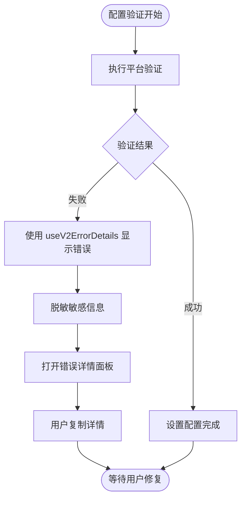
```mermaid
flowchart TD
Start([配置验证开始]) --> Validate[执行平台验证]
Validate --> CheckResult{验证结果}
CheckResult --> |成功| Success[设置配置完成]
CheckResult --> |失败| ShowError[使用 useV2ErrorDetails 显示错误]
ShowError --> Sanitize[脱敏敏感信息]
Sanitize --> OpenPanel[打开错误详情面板]
OpenPanel --> Copy[用户复制详情]
Copy --> End([等待用户修复])
Success --> End
```

**图表来源**
- [spec.md:6-15](file://openspec/changes/expose-v2-platform-config-validation-errors/specs/v2-platform-config-validation-feedback/spec.md#L6-L15)

#### 错误详情展示规范

**更新** 错误详情展示遵循 v2-hosted-error-details 规范：

1. **友好摘要**：提供用户友好的错误摘要信息
2. **详细诊断**：展示完整的错误详情和诊断信息
3. **敏感信息脱敏**：自动脱敏所有敏感字段
4. **可复制功能**：支持一键复制完整的错误详情
5. **一致性设计**：与发布失败详情面板保持一致的用户体验
6. **统一管理**：通过 useV2ErrorDetails 统一管理错误详情状态

**章节来源**
- [spec.md:32-43](file://openspec/changes/expose-v2-platform-config-validation-errors/specs/v2-hosted-error-details/spec.md#L32-L43)

## 依赖关系分析

V2 设置系统具有清晰的依赖关系层次结构：

```mermaid
graph TD
subgraph "外部依赖"
A[Vue 3]
B[Pinia]
C[Element Plus]
D[Zhi-Common]
E[Node Fetch]
end
subgraph "内部模块"
F[useV2Settings]
G[useV2QuickPublish]
H[useV2PublishValidation]
I[useV2ErrorDetails]
J[stores]
K[platforms]
L[components]
M[utils]
end
subgraph "工具模块"
N[sensitiveLogSanitizer]
O[platformConfigActionBridge]
P[JsonUtil]
Q[ObjectUtil]
R[ErrorDetailsState]
S[V2PlatformConfigValidationResult]
end
A --> F
A --> G
A --> H
A --> I
B --> J
C --> L
F --> J
F --> K
F --> M
G --> J
G --> K
G --> M
H --> J
H --> K
H --> M
I --> M
I --> R
J --> P
K --> Q
L --> N
M --> N
N --> S
O --> S
R --> S
```

**图表来源**
- [useV2Settings.ts:1-18](file://src/composables/v2/useV2Settings.ts#L1-L18)
- [useV2QuickPublish.ts:1-12](file://src/composables/v2/useV2QuickPublish.ts#L1-L12)
- [useV2PublishValidation.ts:1-19](file://src/composables/v2/useV2PublishValidation.ts#L1-L19)
- [useV2ErrorDetails.ts:1-18](file://src/composables/v2/useV2ErrorDetails.ts#L1-L18)

### 核心依赖关系

1. **状态管理依赖**：组合式函数依赖 Pinia 进行状态管理
2. **平台配置依赖**：动态配置系统提供平台类型定义
3. **存储层依赖**：设置存储提供持久化功能
4. **UI 组件依赖**：Vue 组件提供用户界面交互
5. **错误处理依赖**：错误详情面板和脱敏工具提供错误处理能力
6. **类型安全依赖**：完整的 TypeScript 接口定义确保类型安全

**章节来源**
- [usePublishSettingStore.ts:10-25](file://src/stores/usePublishSettingStore.ts#L10-L25)
- [usePreferenceSettingStore.ts:10-16](file://src/stores/usePreferenceSettingStore.ts#L10-L16)

## 性能考虑

V2 设置系统在设计时充分考虑了性能优化：

### 状态管理优化

1. **响应式状态**：使用 Vue 3 的响应式系统实现高效的状态更新
2. **计算属性缓存**：利用 computed 属性避免不必要的重新计算
3. **按需加载**：只在需要时加载和解析配置数据
4. **错误详情状态优化**：useV2ErrorDetails 仅在需要时更新错误详情状态

### 数据访问优化

1. **缓存策略**：设置存储实现了本地缓存机制
2. **异步加载**：配置数据采用异步加载方式
3. **增量更新**：支持部分数据的增量更新

### UI 性能优化

1. **虚拟滚动**：账户列表支持大量数据的虚拟滚动
2. **懒加载组件**：非关键组件采用懒加载策略
3. **事件防抖**：输入事件采用防抖处理减少重绘
4. **条件渲染**：错误详情面板采用条件渲染避免不必要的 DOM 操作
5. **状态复用**：useV2ErrorDetails 提供状态复用避免重复创建

### 错误处理性能优化

1. **延迟初始化**：错误详情面板采用延迟初始化
2. **内存管理**：及时清理错误详情状态避免内存泄漏
3. **脱敏优化**：敏感信息脱敏采用高效的正则表达式匹配
4. **统一管理**：通过 useV2ErrorDetails 统一管理错误详情状态，避免重复实例化

## 故障排除指南

### 常见问题及解决方案

#### 账户状态异常

**问题描述**：账户状态显示不正确或状态切换失效

**可能原因**：
1. 配置数据损坏
2. 状态同步问题
3. 缓存数据过期

**解决步骤**：
1. 检查配置文件格式
2. 清除应用缓存
3. 重新加载设置页面

#### 发布失败处理

**问题描述**：快速发布过程中出现错误

**解决方法**：
1. 检查网络连接状态
2. 验证平台配置信息
3. 查看错误日志详情
4. 尝试重新发布

#### 平台配置丢失

**问题描述**：平台配置在重启后丢失

**预防措施**：
1. 定期备份配置文件
2. 使用云同步服务
3. 验证存储权限设置

#### 配置验证错误

**问题描述**：平台配置验证失败但没有详细错误信息

**解决步骤**：
1. 检查浏览器控制台是否有 JavaScript 错误
2. 验证平台 API 凭据是否正确
3. 查看错误详情面板中的完整诊断信息
4. 复制错误详情并反馈给开发者
5. 确认 useV2ErrorDetails 是否正确初始化和使用

#### 错误详情无法复制

**问题描述**：错误详情面板中的内容无法复制

**解决方法**：
1. 检查浏览器的剪贴板权限设置
2. 尝试刷新页面后重新打开错误详情
3. 确认错误详情中没有包含被脱敏的敏感信息
4. 检查 useV2ErrorDetails 的 showErrorDetails 方法是否正确调用
5. 联系技术支持获取进一步帮助

#### useV2ErrorDetails 功能异常

**问题描述**：useV2ErrorDetails 组合式函数工作不正常

**解决步骤**：
1. 检查 useV2ErrorDetails 是否正确导入和初始化
2. 验证 showErrorDetails 方法的参数传递
3. 确认敏感信息脱敏功能正常工作
4. 检查错误详情状态的生命周期管理
5. 查看相关单元测试是否通过

**章节来源**
- [useV2QuickPublish.ts:57-62](file://src/composables/v2/useV2QuickPublish.ts#L57-L62)
- [useV2Settings.ts:172-185](file://src/composables/v2/useV2Settings.ts#L172-L185)
- [useV2ErrorDetails.spec.ts:13-82](file://src/composables/v2/useV2ErrorDetails.spec.ts#L13-L82)

## 结论

V2 设置组合式函数为 SiYuan 插件发布器提供了强大而灵活的设置管理功能。通过模块化的架构设计和清晰的职责分离，该系统实现了：

1. **高度可扩展性**：支持多种发布平台和自定义扩展
2. **良好的用户体验**：直观的界面设计和流畅的操作流程
3. **可靠的稳定性**：完善的错误处理和状态管理机制
4. **优秀的性能表现**：优化的数据访问和状态更新策略
5. **强大的诊断能力**：完整的错误详情展示和敏感信息脱敏处理

**更新** 新增的 useV2ErrorDetails 组合式函数显著提升了系统的错误处理能力和用户体验。该函数提供了统一的错误详情管理能力，集成了敏感信息脱敏处理，并通过完整的单元测试确保了功能的可靠性。

通过 useV2ErrorDetails 的集成，平台配置验证和发布失败处理现在拥有了统一的错误详情展示机制，用户可以获取更加准确和有用的错误反馈，大大提高了故障排查的效率。完整的错误处理机制确保了系统在面对各种异常情况时都能保持稳定运行，并为用户提供清晰的故障信息和解决方案指导。

这些改进不仅增强了用户体验，也为开发者提供了更好的调试和问题定位能力。统一的错误详情管理为类似的内容发布工具提供了宝贵的参考经验，特别是在组合式 API 的应用、状态管理、平台扩展以及错误处理方面都具有重要的借鉴意义。