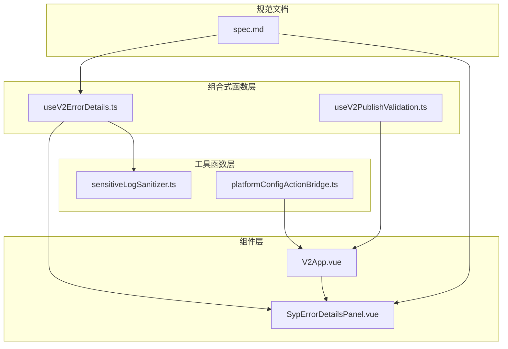
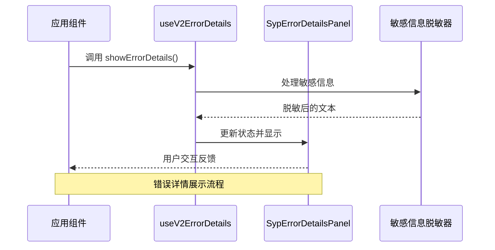
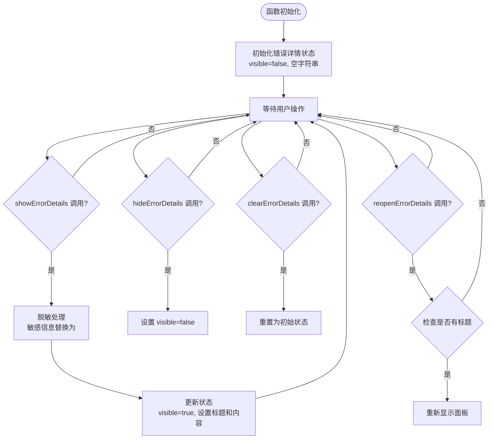
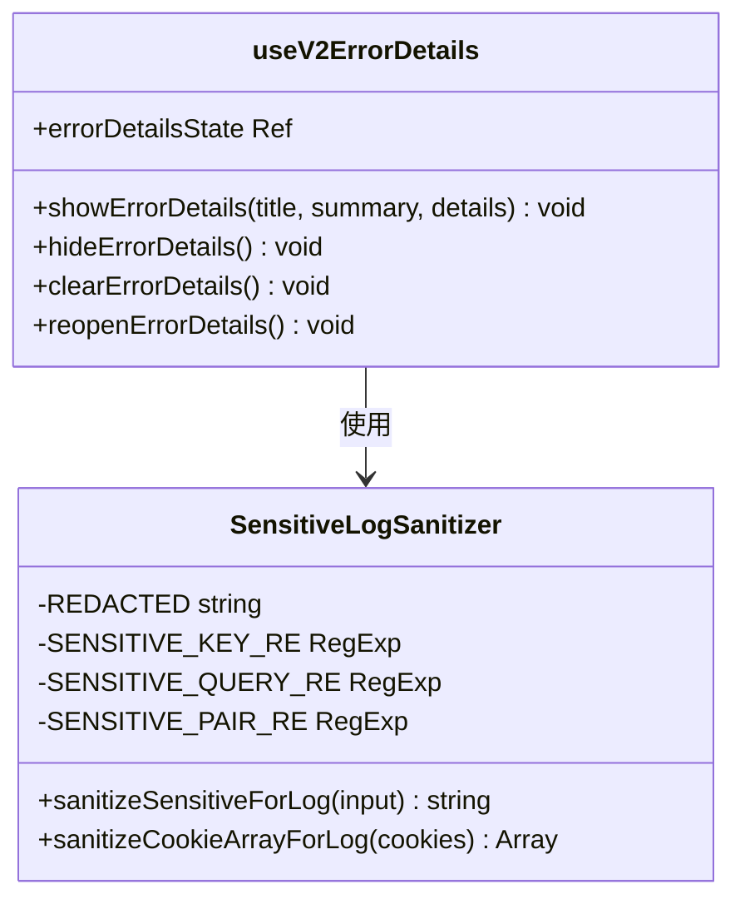
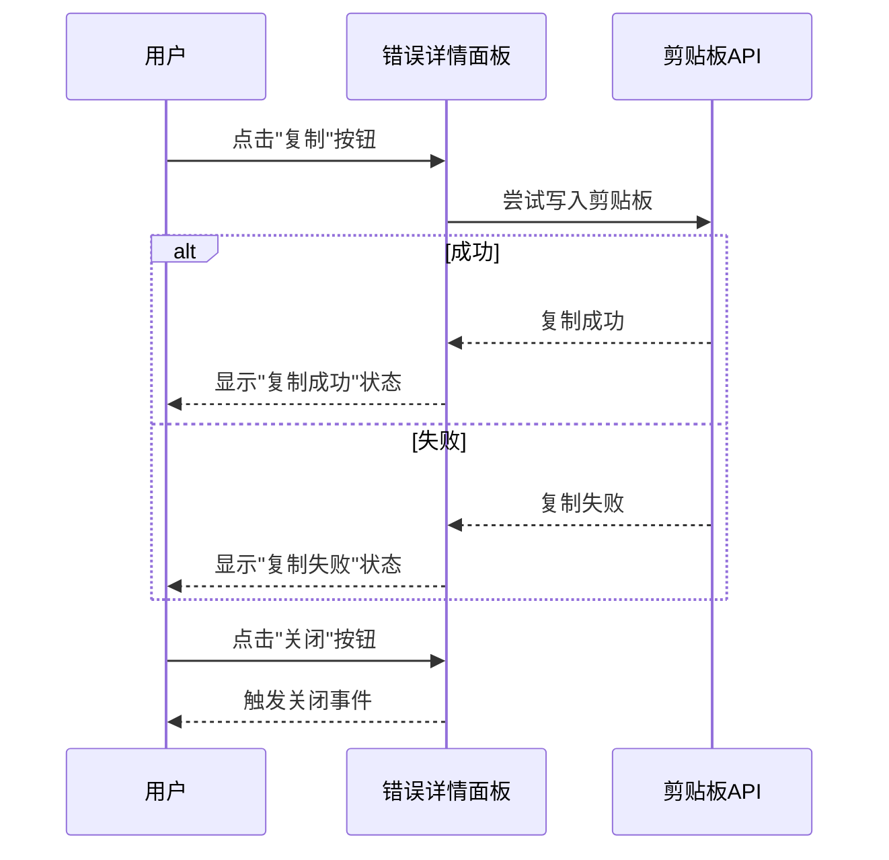
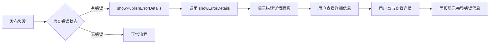
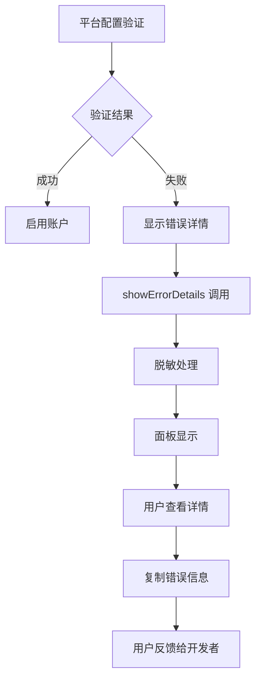
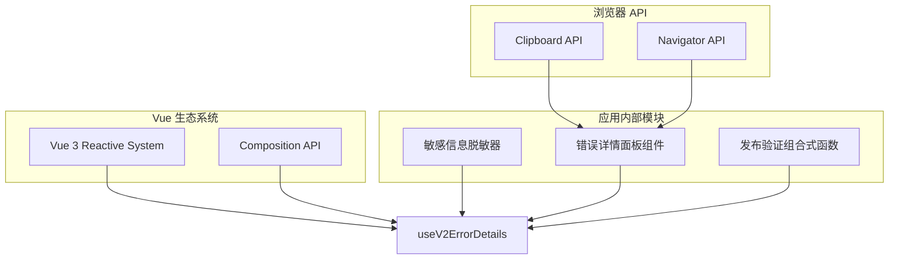

# useV2ErrorDetails 组合式函数

<cite>
**本文档引用的文件**
- [useV2ErrorDetails.ts](file://src/composables/v2/useV2ErrorDetails.ts)
- [useV2ErrorDetails.spec.ts](file://src/composables/v2/useV2ErrorDetails.spec.ts)
- [SypErrorDetailsPanel.vue](file://src/components/v2/common/SypErrorDetailsPanel.vue)
- [sensitiveLogSanitizer.ts](file://src/utils/sensitiveLogSanitizer.ts)
- [V2App.vue](file://src/components/v2/V2App.vue)
- [useV2PublishValidation.ts](file://src/composables/v2/useV2PublishValidation.ts)
- [platformConfigActionBridge.ts](file://src/components/v2/settings/bridge/platformConfigActionBridge.ts)
- [spec.md](file://openspec/changes/expose-v2-platform-config-validation-errors/specs/v2-hosted-error-details/spec.md)
</cite>

## 目录
1. [简介](#简介)
2. [项目结构](#项目结构)
3. [核心组件](#核心组件)
4. [架构概览](#架构概览)
5. [详细组件分析](#详细组件分析)
6. [依赖关系分析](#依赖关系分析)
7. [性能考虑](#性能考虑)
8. [故障排除指南](#故障排除指南)
9. [结论](#结论)

## 简介

`useV2ErrorDetails` 是一个 Vue 3 组合式函数，专门用于管理和展示 V2 版本中的错误详情信息。该函数提供了完整的错误详情状态管理、脱敏处理和用户交互功能，确保敏感信息得到适当保护，同时为用户提供详细的诊断信息。

该组合式函数是思源插件发布器 V2 架构中的重要组成部分，支持快速发布失败和平台配置验证失败两种主要场景，实现了统一的错误详情展示机制。

## 项目结构

`useV2ErrorDetails` 函数位于项目的组合式函数目录中，与相关的组件和工具函数共同构成了完整的错误处理生态系统：



**图表来源**
- [useV2ErrorDetails.ts:1-67](file://src/composables/v2/useV2ErrorDetails.ts#L1-L67)
- [SypErrorDetailsPanel.vue:1-267](file://src/components/v2/common/SypErrorDetailsPanel.vue#L1-L267)
- [sensitiveLogSanitizer.ts:1-63](file://src/utils/sensitiveLogSanitizer.ts#L1-L63)

**章节来源**
- [useV2ErrorDetails.ts:1-67](file://src/composables/v2/useV2ErrorDetails.ts#L1-L67)
- [SypErrorDetailsPanel.vue:1-267](file://src/components/v2/common/SypErrorDetailsPanel.vue#L1-L267)

## 核心组件

### ErrorDetailsState 接口

`useV2ErrorDetails` 函数的核心数据结构是一个响应式的错误详情状态对象：

```typescript
interface ErrorDetailsState {
  visible: boolean
  title: string
  summary: string
  details: string
}
```

该接口定义了错误详情面板的所有必要属性：
- `visible`: 控制面板的显示/隐藏状态
- `title`: 错误详情的标题
- `summary`: 简要的错误摘要
- `details`: 详细的诊断信息

### 主要方法

函数返回以下核心方法：

1. **showErrorDetails(title, summary, details?)**: 显示错误详情面板
2. **hideErrorDetails()**: 隐藏错误详情面板
3. **clearErrorDetails()**: 清空所有错误详情状态
4. **reopenErrorDetails()**: 重新打开之前设置的错误详情

**章节来源**
- [useV2ErrorDetails.ts:13-66](file://src/composables/v2/useV2ErrorDetails.ts#L13-L66)

## 架构概览

`useV2ErrorDetails` 函数在整个应用架构中扮演着关键角色，连接了状态管理、UI 组件和安全处理：



**图表来源**
- [useV2ErrorDetails.ts:28-38](file://src/composables/v2/useV2ErrorDetails.ts#L28-L38)
- [SypErrorDetailsPanel.vue:102-160](file://src/components/v2/common/SypErrorDetailsPanel.vue#L102-L160)

## 详细组件分析

### 组合式函数实现

`useV2ErrorDetails` 函数采用 Vue 3 的响应式系统，提供了完整的错误详情管理功能：

#### 状态管理
函数内部维护一个响应式的 `errorDetailsState` 对象，确保 UI 能够自动更新：



**图表来源**
- [useV2ErrorDetails.ts:20-66](file://src/composables/v2/useV2ErrorDetails.ts#L20-L66)

#### 脱敏处理机制

函数集成了强大的敏感信息脱敏功能，确保不会泄露敏感数据：



**图表来源**
- [useV2ErrorDetails.ts:10-11](file://src/composables/v2/useV2ErrorDetails.ts#L10-L11)
- [sensitiveLogSanitizer.ts:12-19](file://src/utils/sensitiveLogSanitizer.ts#L12-L19)

**章节来源**
- [useV2ErrorDetails.ts:28-38](file://src/composables/v2/useV2ErrorDetails.ts#L28-L38)
- [sensitiveLogSanitizer.ts:24-46](file://src/utils/sensitiveLogSanitizer.ts#L24-L46)

### UI 组件集成

`SypErrorDetailsPanel` 组件提供了完整的错误详情展示界面：

#### 组件特性
- **本地化展示**: 不依赖全局 UI 库，完全在 V2 容器内渲染
- **可访问性**: 支持键盘导航和屏幕阅读器
- **复制功能**: 一键复制详细的诊断信息
- **响应式设计**: 适配不同屏幕尺寸

#### 交互流程


**图表来源**
- [SypErrorDetailsPanel.vue:153-160](file://src/components/v2/common/SypErrorDetailsPanel.vue#L153-L160)

**章节来源**
- [SypErrorDetailsPanel.vue:10-54](file://src/components/v2/common/SypErrorDetailsPanel.vue#L10-L54)
- [SypErrorDetailsPanel.vue:125-160](file://src/components/v2/common/SypErrorDetailsPanel.vue#L125-L160)

### 应用集成

在 `V2App.vue` 中，`useV2ErrorDetails` 与发布流程深度集成：

#### 快速发布错误处理


**图表来源**
- [V2App.vue:421-427](file://src/components/v2/V2App.vue#L421-L427)

#### 配置验证错误处理


**图表来源**
- [V2App.vue:486-501](file://src/components/v2/V2App.vue#L486-L501)

**章节来源**
- [V2App.vue:421-431](file://src/components/v2/V2App.vue#L421-L431)
- [V2App.vue:486-501](file://src/components/v2/V2App.vue#L486-L501)

## 依赖关系分析

### 外部依赖

`useV2ErrorDetails` 函数依赖于以下外部模块：



**图表来源**
- [useV2ErrorDetails.ts:10-11](file://src/composables/v2/useV2ErrorDetails.ts#L10-L11)
- [SypErrorDetailsPanel.vue:125-151](file://src/components/v2/common/SypErrorDetailsPanel.vue#L125-L151)

### 内部耦合关系

函数与应用其他部分的耦合关系：

1. **状态共享**: 通过响应式 ref 实现状态共享
2. **事件通信**: 通过组件事件实现解耦
3. **数据流**: 单向数据流，从组合式函数流向组件

**章节来源**
- [useV2ErrorDetails.ts:20-66](file://src/composables/v2/useV2ErrorDetails.ts#L20-L66)
- [SypErrorDetailsPanel.vue:70-72](file://src/components/v2/common/SypErrorDetailsPanel.vue#L70-L72)

## 性能考虑

### 内存管理
- 使用响应式 ref 确保内存高效管理
- 面板隐藏时不会占用额外的 DOM 节点
- 脱敏处理只在需要时执行

### 渲染优化
- 条件渲染确保面板仅在需要时挂载
- 计算属性优化细节文本的渲染
- 动画过渡使用 CSS 实现硬件加速

### 安全考虑
- 敏感信息在显示前进行脱敏处理
- 支持多种脱敏策略（查询参数、头部字段、Cookie）
- 提供统一的安全处理接口

## 故障排除指南

### 常见问题

1. **错误详情不显示**
   - 检查 `visible` 状态是否正确设置
   - 确认 `title` 和 `summary` 是否为空
   - 验证组件是否正确接收 props

2. **敏感信息未正确脱敏**
   - 检查脱敏正则表达式是否匹配
   - 确认输入数据格式是否正确
   - 验证脱敏函数的调用时机

3. **复制功能失效**
   - 检查浏览器是否支持 Clipboard API
   - 确认页面是否在 HTTPS 环境
   - 验证权限设置

### 调试技巧

1. **状态检查**: 使用 Vue DevTools 检查 `errorDetailsState` 的值
2. **日志输出**: 添加适当的日志记录点
3. **单元测试**: 运行现有的测试套件验证功能

**章节来源**
- [useV2ErrorDetails.spec.ts:13-82](file://src/composables/v2/useV2ErrorDetails.spec.ts#L13-L82)

## 结论

`useV2ErrorDetails` 组合式函数为思源插件发布器 V2 架构提供了强大而灵活的错误详情管理能力。通过精心设计的状态管理、安全的脱敏处理和用户友好的界面，该函数成功解决了发布过程中的错误处理挑战。

该函数的主要优势包括：

1. **统一的错误处理**: 支持多种错误场景的一致处理方式
2. **安全性优先**: 内置敏感信息脱敏机制，保护用户隐私
3. **用户体验优秀**: 提供详细的诊断信息和便捷的复制功能
4. **易于集成**: 简洁的 API 设计，便于与其他组件集成
5. **可测试性强**: 完整的单元测试覆盖，确保功能可靠性

随着 V2 架构的不断发展，`useV2ErrorDetails` 函数将继续发挥重要作用，为用户提供更好的错误处理体验。