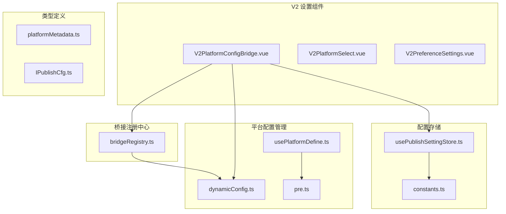
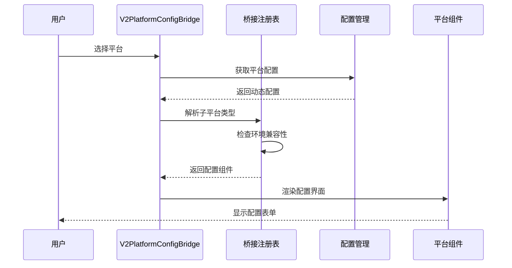
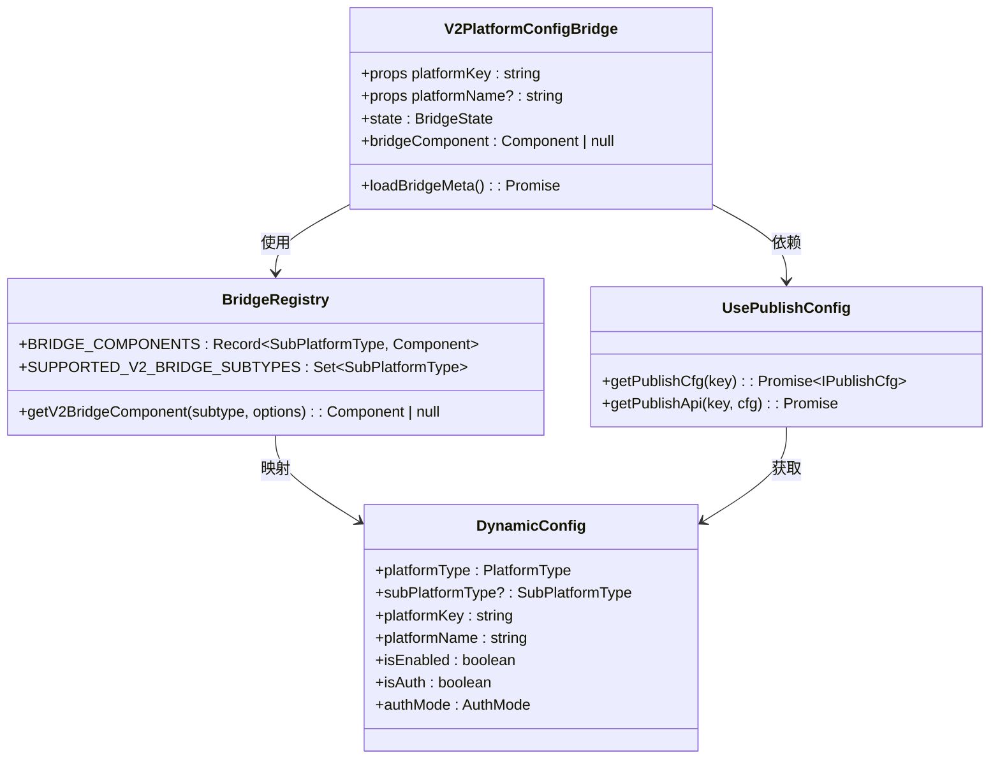
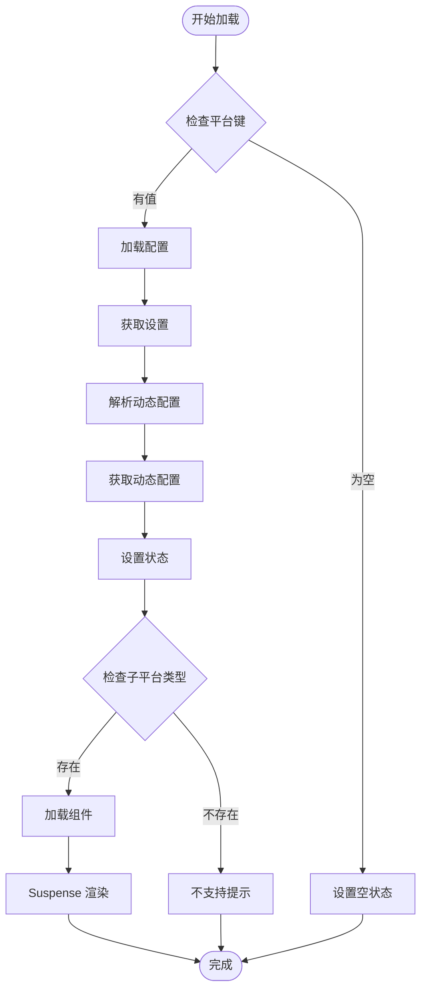
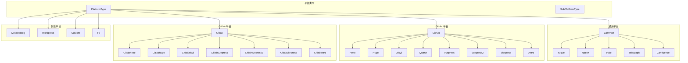
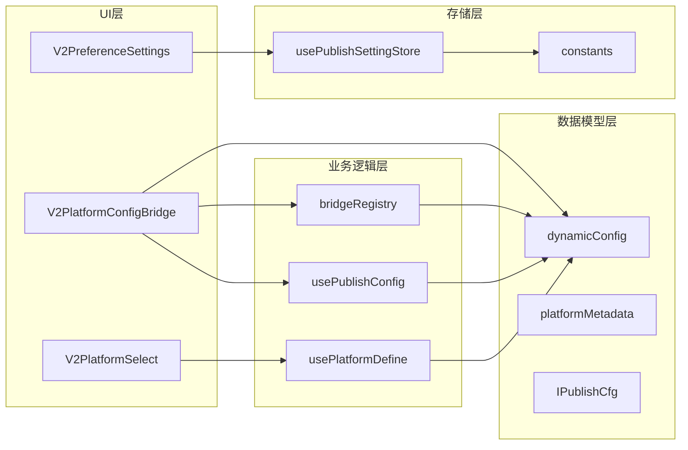
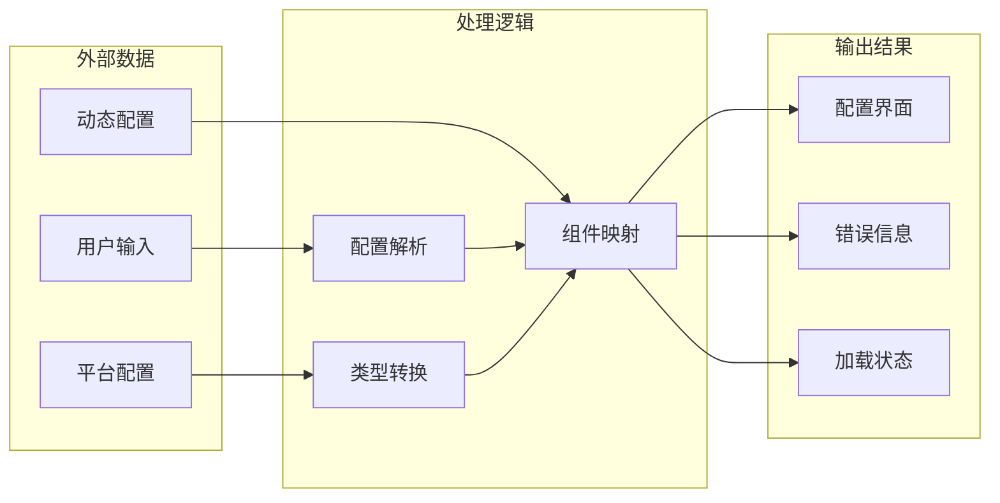

# V2 平台配置桥组件

<cite>
**本文档引用的文件**
- [V2PlatformConfigBridge.vue](file://src/components/v2/settings/V2PlatformConfigBridge.vue)
- [bridgeRegistry.ts](file://src/components/v2/settings/bridge/bridgeRegistry.ts)
- [dynamicConfig.ts](file://src/platforms/dynamicConfig.ts)
- [usePublishConfig.ts](file://src/composables/usePublishConfig.ts)
- [usePlatformDefine.ts](file://src/composables/usePlatformDefine.ts)
- [pre.ts](file://src/platforms/pre.ts)
- [V2PlatformSelect.vue](file://src/components/v2/settings/V2PlatformSelect.vue)
- [V2PreferenceSettings.vue](file://src/components/v2/settings/V2PreferenceSettings.vue)
- [usePublishSettingStore.ts](file://src/stores/usePublishSettingStore.ts)
- [constants.ts](file://src/utils/constants.ts)
- [platformMetadata.ts](file://src/models/platformMetadata.ts)
- [IPublishCfg.ts](file://src/types/IPublishCfg.ts)
</cite>

## 目录
1. [简介](#简介)
2. [项目结构](#项目结构)
3. [核心组件](#核心组件)
4. [架构概览](#架构概览)
5. [详细组件分析](#详细组件分析)
6. [依赖关系分析](#依赖关系分析)
7. [性能考虑](#性能考虑)
8. [故障排除指南](#故障排除指南)
9. [结论](#结论)

## 简介

V2 平台配置桥组件是思源笔记发布工具中的核心配置管理模块，负责动态加载和渲染不同平台的配置界面。该组件采用桥接模式设计，能够根据平台类型动态选择相应的配置组件，实现了高度可扩展的平台配置管理架构。

该组件支持多种平台类型，包括通用平台（语雀、Notion、Halo等）、GitHub平台（Hexo、Hugo、Jekyll等）、GitLab平台、Metaweblog平台、WordPress平台、自定义平台和文件系统平台。通过统一的接口和动态组件加载机制，为用户提供了一致的配置体验。

## 项目结构

基于仓库的实际结构，V2 平台配置桥组件位于以下路径：

**图表来源**
- [V2PlatformConfigBridge.vue:1-206](file://src/components/v2/settings/V2PlatformConfigBridge.vue#L1-L206)
- [bridgeRegistry.ts:1-80](file://src/components/v2/settings/bridge/bridgeRegistry.ts#L1-L80)
- [dynamicConfig.ts:1-540](file://src/platforms/dynamicConfig.ts#L1-L540)

**章节来源**
- [V2PlatformConfigBridge.vue:1-206](file://src/components/v2/settings/V2PlatformConfigBridge.vue#L1-L206)
- [bridgeRegistry.ts:1-80](file://src/components/v2/settings/bridge/bridgeRegistry.ts#L1-L80)
- [dynamicConfig.ts:1-540](file://src/platforms/dynamicConfig.ts#L1-L540)

## 核心组件

### V2PlatformConfigBridge 组件

V2PlatformConfigBridge 是整个配置桥的核心组件，负责：

1. **动态组件加载**：根据平台类型动态加载对应的配置组件
2. **状态管理**：处理加载状态、错误状态和配置数据
3. **国际化支持**：提供多语言支持
4. **环境检测**：区分 Electron 和 Web 环境

该组件采用 Suspense 模式处理异步组件加载，提供了良好的用户体验。

**章节来源**
- [V2PlatformConfigBridge.vue:46-108](file://src/components/v2/settings/V2PlatformConfigBridge.vue#L46-L108)

### 桥接注册表

bridgeRegistry.ts 提供了完整的桥接组件注册机制：

1. **组件映射**：将平台子类型映射到具体的配置组件
2. **条件加载**：支持基于环境的组件加载（如本地系统仅在 Electron 环境可用）
3. **类型安全**：使用 TypeScript 枚举确保类型安全

**章节来源**
- [bridgeRegistry.ts:69-79](file://src/components/v2/settings/bridge/bridgeRegistry.ts#L69-L79)

### 动态配置管理

dynamicConfig.ts 定义了完整的平台配置模型：

1. **平台类型枚举**：定义了所有支持的平台类型
2. **子平台类型**：细化到具体的平台实现
3. **配置模型**：包含平台的基本信息、认证信息等
4. **工具方法**：提供平台配置的各种操作方法

**章节来源**
- [dynamicConfig.ts:174-242](file://src/platforms/dynamicConfig.ts#L174-L242)

## 架构概览

**图表来源**
- [V2PlatformConfigBridge.vue:85-108](file://src/components/v2/settings/V2PlatformConfigBridge.vue#L85-L108)
- [bridgeRegistry.ts:69-79](file://src/components/v2/settings/bridge/bridgeRegistry.ts#L69-L79)
- [usePublishConfig.ts:36-64](file://src/composables/usePublishConfig.ts#L36-L64)

该架构采用了典型的桥接模式，将平台配置的显示逻辑与具体平台的实现分离，实现了高内聚低耦合的设计。

## 详细组件分析

### 组件类图

**图表来源**
- [V2PlatformConfigBridge.vue:54-72](file://src/components/v2/settings/V2PlatformConfigBridge.vue#L54-L72)
- [bridgeRegistry.ts:31-79](file://src/components/v2/settings/bridge/bridgeRegistry.ts#L31-L79)
- [dynamicConfig.ts:13-113](file://src/platforms/dynamicConfig.ts#L13-L113)
- [usePublishConfig.ts:26-95](file://src/composables/usePublishConfig.ts#L26-L95)

### 配置加载流程

**图表来源**
- [V2PlatformConfigBridge.vue:85-108](file://src/components/v2/settings/V2PlatformConfigBridge.vue#L85-L108)
- [usePublishConfig.ts:36-64](file://src/composables/usePublishConfig.ts#L36-L64)

### 平台类型层次结构

**图表来源**
- [dynamicConfig.ts:126-242](file://src/platforms/dynamicConfig.ts#L126-L242)

**章节来源**
- [dynamicConfig.ts:126-335](file://src/platforms/dynamicConfig.ts#L126-L335)

## 依赖关系分析

### 组件依赖图

**图表来源**
- [V2PlatformConfigBridge.vue:48-52](file://src/components/v2/settings/V2PlatformConfigBridge.vue#L48-L52)
- [bridgeRegistry.ts:29](file://src/components/v2/settings/bridge/bridgeRegistry.ts#L29)
- [usePublishConfig.ts:10-18](file://src/composables/usePublishConfig.ts#L10-L18)

### 数据流分析

**图表来源**
- [usePublishConfig.ts:36-64](file://src/composables/usePublishConfig.ts#L36-L64)
- [bridgeRegistry.ts:69-79](file://src/components/v2/settings/bridge/bridgeRegistry.ts#L69-L79)

**章节来源**
- [usePublishConfig.ts:26-95](file://src/composables/usePublishConfig.ts#L26-L95)
- [bridgeRegistry.ts:1-80](file://src/components/v2/settings/bridge/bridgeRegistry.ts#L1-L80)

## 性能考虑

### 异步加载优化

V2 平台配置桥组件采用了多种性能优化策略：

1. **Suspense 异步加载**：使用 Vue Suspense 处理异步组件加载，提供更好的用户体验
2. **懒加载机制**：只有在需要时才加载特定平台的配置组件
3. **状态缓存**：避免重复的配置加载操作
4. **条件渲染**：根据平台类型动态决定是否渲染配置界面

### 内存管理

1. **组件卸载清理**：正确处理组件的生命周期，避免内存泄漏
2. **事件监听器清理**：及时移除不必要的事件监听器
3. **计算属性优化**：使用 Vue 的响应式系统优化计算属性的重新计算

## 故障排除指南

### 常见问题及解决方案

#### 平台配置加载失败

**问题描述**：平台配置无法正确加载或显示

**可能原因**：
1. 平台键无效或不存在
2. 动态配置解析失败
3. 组件映射错误

**解决步骤**：
1. 检查平台键格式是否正确
2. 验证动态配置是否存在于存储中
3. 确认平台类型是否在支持列表中

#### 组件渲染异常

**问题描述**：配置组件无法正常渲染

**可能原因**：
1. 环境不兼容（如本地系统仅在 Electron 环境可用）
2. 组件加载超时
3. 依赖包版本冲突

**解决步骤**：
1. 检查当前运行环境
2. 验证组件依赖是否正确安装
3. 查看浏览器控制台错误信息

#### 国际化问题

**问题描述**：界面文本显示异常

**解决步骤**：
1. 检查语言包是否正确加载
2. 验证翻译键是否存在
3. 确认语言切换逻辑是否正常工作

**章节来源**
- [V2PlatformConfigBridge.vue:18-42](file://src/components/v2/settings/V2PlatformConfigBridge.vue#L18-L42)
- [V2PlatformConfigBridge.vue:85-108](file://src/components/v2/settings/V2PlatformConfigBridge.vue#L85-L108)

## 结论

V2 平台配置桥组件是一个设计精良的配置管理模块，具有以下特点：

1. **高度可扩展性**：通过桥接模式支持任意数量的平台配置
2. **类型安全**：使用 TypeScript 枚举确保类型安全
3. **环境适应性**：支持多种运行环境（Electron、Web）
4. **用户体验友好**：提供异步加载和错误处理机制
5. **维护性良好**：清晰的代码结构和模块化设计

该组件为思源笔记发布工具提供了强大的平台配置管理能力，是整个系统的重要基础设施。通过合理的架构设计和实现，确保了系统的稳定性和可扩展性。

未来可以考虑的改进方向：
1. 添加更多的平台类型支持
2. 优化组件加载性能
3. 增强错误处理和日志记录
4. 提供更丰富的配置验证机制