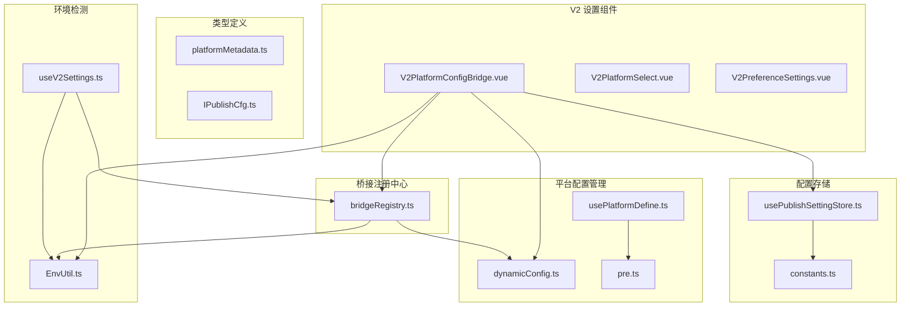
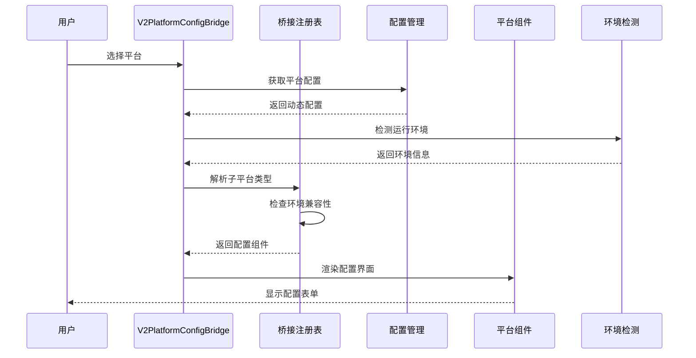
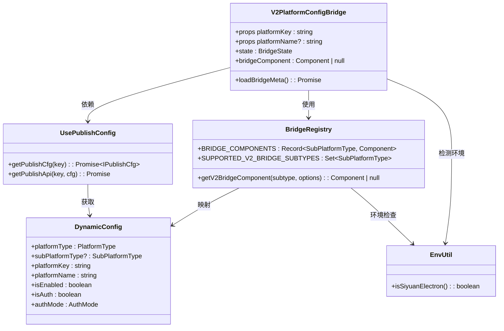
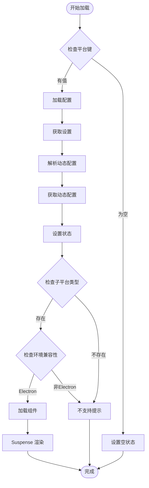
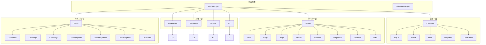
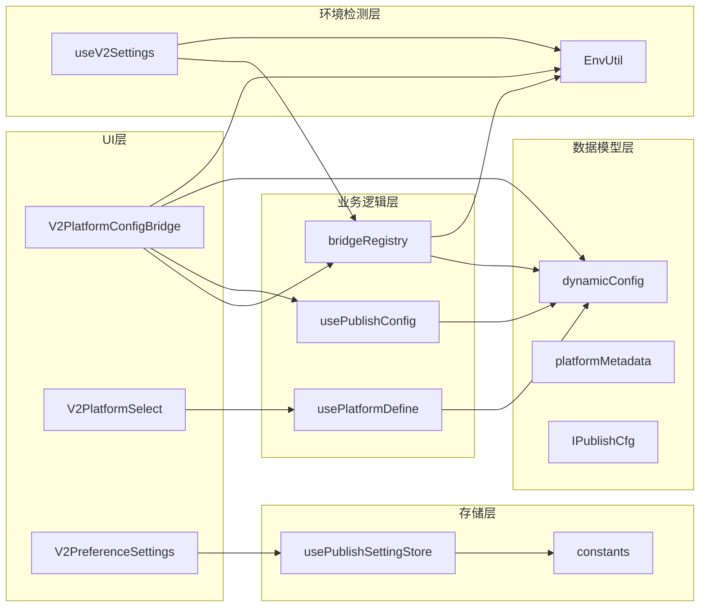
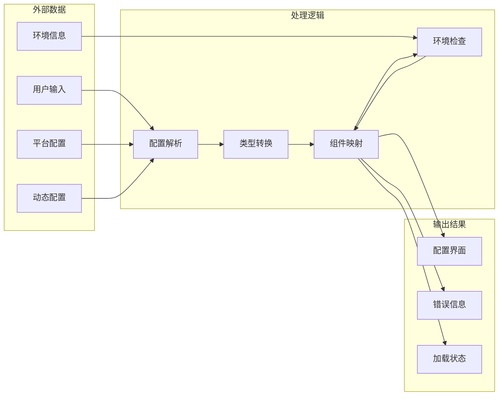

# V2 平台配置桥组件

<cite>
**本文档引用的文件**
- [V2PlatformConfigBridge.vue](file://src/components/v2/settings/V2PlatformConfigBridge.vue)
- [bridgeRegistry.ts](file://src/components/v2/settings/bridge/bridgeRegistry.ts)
- [dynamicConfig.ts](file://src/platforms/dynamicConfig.ts)
- [usePublishConfig.ts](file://src/composables/usePublishConfig.ts)
- [usePlatformDefine.ts](file://src/composables/usePlatformDefine.ts)
- [pre.ts](file://src/platforms/pre.ts)
- [V2PlatformSelect.vue](file://src/components/v2/settings/V2PlatformSelect.vue)
- [V2PreferenceSettings.vue](file://src/components/v2/settings/V2PreferenceSettings.vue)
- [usePublishSettingStore.ts](file://src/stores/usePublishSettingStore.ts)
- [constants.ts](file://src/utils/constants.ts)
- [platformMetadata.ts](file://src/models/platformMetadata.ts)
- [IPublishCfg.ts](file://src/types/IPublishCfg.ts)
- [EnvUtil.ts](file://src/utils/EnvUtil.ts)
- [useV2Settings.ts](file://src/composables/v2/useV2Settings.ts)
- [design.md](file://openspec/changes/refactor-ui-v2-foundation/design.md)
</cite>

## 更新摘要
**变更内容**
- 新增 bridgeRegistry.ts 集中管理平台配置组件映射
- 从硬编码平台映射迁移到动态注册表系统
- 增强了平台配置组件的可扩展性和维护性
- 改进了环境兼容性检查机制，特别是Fs_LocalSystem的Electron限制
- 新增 SUPPORTED_V2_BRIDGE_SUBTYPES 集合用于动态跟踪支持的平台类型
- 实现了统一的环境检测守卫机制

## 目录
1. [简介](#简介)
2. [项目结构](#项目结构)
3. [核心组件](#核心组件)
4. [架构概览](#架构概览)
5. [详细组件分析](#详细组件分析)
6. [依赖关系分析](#依赖关系分析)
7. [性能考虑](#性能考虑)
8. [故障排除指南](#故障排除指南)
9. [结论](#结论)

## 简介

V2 平台配置桥组件是思源笔记发布工具中的核心配置管理模块，负责动态加载和渲染不同平台的配置界面。该组件采用桥接模式设计，能够根据平台类型动态选择相应的配置组件，实现了高度可扩展的平台配置管理架构。

**更新** 该组件现已采用全新的动态注册表系统，替代了之前的硬编码平台映射方式，提供了更好的可维护性和扩展性。新的注册表系统通过集中式管理平台配置组件映射，显著增强了系统的模块化程度和可维护性。

**更新** 新的架构增强了环境兼容性检查机制，特别是对Fs_LocalSystem平台的Electron环境限制，确保了在不同运行环境下的稳定性和安全性。

该组件支持多种平台类型，包括通用平台（语雀、Notion、Halo等）、GitHub平台（Hexo、Hugo、Jekyll等）、GitLab平台、Metaweblog平台、WordPress平台、自定义平台和文件系统平台。通过统一的接口和动态组件加载机制，为用户提供了一致的配置体验。

## 项目结构

基于仓库的实际结构，V2 平台配置桥组件位于以下路径：

**图表来源**
- [V2PlatformConfigBridge.vue:1-208](file://src/components/v2/settings/V2PlatformConfigBridge.vue#L1-L208)
- [bridgeRegistry.ts:1-80](file://src/components/v2/settings/bridge/bridgeRegistry.ts#L1-L80)
- [dynamicConfig.ts:1-540](file://src/platforms/dynamicConfig.ts#L1-L540)
- [useV2Settings.ts:1-250](file://src/composables/v2/useV2Settings.ts#L1-L250)

**章节来源**
- [V2PlatformConfigBridge.vue:1-208](file://src/components/v2/settings/V2PlatformConfigBridge.vue#L1-L208)
- [bridgeRegistry.ts:1-80](file://src/components/v2/settings/bridge/bridgeRegistry.ts#L1-L80)
- [dynamicConfig.ts:1-540](file://src/platforms/dynamicConfig.ts#L1-L540)
- [useV2Settings.ts:1-250](file://src/composables/v2/useV2Settings.ts#L1-L250)

## 核心组件

### V2PlatformConfigBridge 组件

V2PlatformConfigBridge 是整个配置桥的核心组件，负责：

1. **动态组件加载**：根据平台类型动态加载对应的配置组件
2. **状态管理**：处理加载状态、错误状态和配置数据
3. **国际化支持**：提供多语言支持
4. **环境检测**：区分 Electron 和 Web 环境

该组件采用 Suspense 模式处理异步组件加载，提供了良好的用户体验。

**章节来源**
- [V2PlatformConfigBridge.vue:46-108](file://src/components/v2/settings/V2PlatformConfigBridge.vue#L46-L108)

### 桥接注册表

**更新** bridgeRegistry.ts 提供了全新的桥接组件注册机制：

1. **集中式映射管理**：将平台子类型映射到具体的配置组件，替代了之前的硬编码方式
2. **条件加载**：支持基于环境的组件加载（如本地系统仅在 Electron 环境可用）
3. **类型安全**：使用 TypeScript 枚举确保类型安全
4. **动态支持**：通过 SUPPORTED_V2_BRIDGE_SUBTYPES 集合动态跟踪支持的平台类型

**更新** 新增的环境兼容性检查机制确保了平台配置的安全性：
- Fs_LocalSystem 仅在 Electron 环境下可用
- 通过 EnvUtil.isSiyuanElectron() 统一检测环境
- 非 Electron 环境下自动降级处理

**新增** SUPPORTED_V2_BRIDGE_SUBTYPES 集合提供了运行时的平台类型支持检测能力，使得系统能够动态识别和管理支持的平台类型。

**章节来源**
- [bridgeRegistry.ts:69-79](file://src/components/v2/settings/bridge/bridgeRegistry.ts#L69-L79)

### 动态配置管理

dynamicConfig.ts 定义了完整的平台配置模型：

1. **平台类型枚举**：定义了所有支持的平台类型
2. **子平台类型**：细化到具体的平台实现
3. **配置模型**：包含平台的基本信息、认证信息等
4. **工具方法**：提供平台配置的各种操作方法

**章节来源**
- [dynamicConfig.ts:174-242](file://src/platforms/dynamicConfig.ts#L174-L242)

## 架构概览

**图表来源**
- [V2PlatformConfigBridge.vue:85-108](file://src/components/v2/settings/V2PlatformConfigBridge.vue#L85-L108)
- [bridgeRegistry.ts:69-79](file://src/components/v2/settings/bridge/bridgeRegistry.ts#L69-L79)
- [usePublishConfig.ts:36-64](file://src/composables/usePublishConfig.ts#L36-L64)
- [EnvUtil.ts:27-32](file://src/utils/EnvUtil.ts#L27-L32)

**更新** 该架构采用了典型的桥接模式，将平台配置的显示逻辑与具体平台的实现分离，实现了高内聚低耦合的设计。新的注册表系统提供了更好的可扩展性和维护性，通过集中式的组件映射减少了直接依赖，提高了系统的模块化程度。

**更新** 新的架构集成了统一的环境检测机制，确保了在不同运行环境下的稳定性和安全性。Fs_LocalSystem 等平台仅在 Electron 环境下可用，非 Electron 环境下会自动降级处理。

## 详细组件分析

### 组件类图

**图表来源**
- [V2PlatformConfigBridge.vue:54-72](file://src/components/v2/settings/V2PlatformConfigBridge.vue#L54-L72)
- [bridgeRegistry.ts:31-79](file://src/components/v2/settings/bridge/bridgeRegistry.ts#L31-L79)
- [dynamicConfig.ts:13-113](file://src/platforms/dynamicConfig.ts#L13-L113)
- [usePublishConfig.ts:26-95](file://src/composables/usePublishConfig.ts#L26-L95)
- [EnvUtil.ts:27-32](file://src/utils/EnvUtil.ts#L27-L32)

### 配置加载流程

**图表来源**
- [V2PlatformConfigBridge.vue:85-108](file://src/components/v2/settings/V2PlatformConfigBridge.vue#L85-L108)
- [usePublishConfig.ts:36-64](file://src/composables/usePublishConfig.ts#L36-L64)
- [bridgeRegistry.ts:69-79](file://src/components/v2/settings/bridge/bridgeRegistry.ts#L69-L79)

### 平台类型层次结构

**图表来源**
- [dynamicConfig.ts:126-242](file://src/platforms/dynamicConfig.ts#L126-L242)

**章节来源**
- [dynamicConfig.ts:126-335](file://src/platforms/dynamicConfig.ts#L126-L335)

## 依赖关系分析

### 组件依赖图

**图表来源**
- [V2PlatformConfigBridge.vue:48-52](file://src/components/v2/settings/V2PlatformConfigBridge.vue#L48-L52)
- [bridgeRegistry.ts:29](file://src/components/v2/settings/bridge/bridgeRegistry.ts#L29)
- [usePublishConfig.ts:10-18](file://src/composables/usePublishConfig.ts#L10-L18)
- [useV2Settings.ts:3](file://src/composables/v2/useV2Settings.ts#L3)

### 数据流分析

**图表来源**
- [usePublishConfig.ts:36-64](file://src/composables/usePublishConfig.ts#L36-L64)
- [bridgeRegistry.ts:69-79](file://src/components/v2/settings/bridge/bridgeRegistry.ts#L69-L79)
- [EnvUtil.ts:27-32](file://src/utils/EnvUtil.ts#L27-L32)

**更新** 新的注册表系统提供了更清晰的数据流控制，通过集中式的组件映射减少了直接依赖，提高了系统的模块化程度。SUPPORTED_V2_BRIDGE_SUBTYPES 集合的引入使得平台类型的支持检测更加直观和高效。

**更新** 环境兼容性检查机制的集成确保了系统的安全性和稳定性，特别是在不同运行环境下的行为一致性。

**章节来源**
- [usePublishConfig.ts:26-95](file://src/composables/usePublishConfig.ts#L26-L95)
- [bridgeRegistry.ts:1-80](file://src/components/v2/settings/bridge/bridgeRegistry.ts#L1-L80)
- [useV2Settings.ts:60-92](file://src/composables/v2/useV2Settings.ts#L60-L92)

## 性能考虑

### 异步加载优化

V2 平台配置桥组件采用了多种性能优化策略：

1. **Suspense 异步加载**：使用 Vue Suspense 处理异步组件加载，提供更好的用户体验
2. **懒加载机制**：只有在需要时才加载特定平台的配置组件
3. **状态缓存**：避免重复的配置加载操作
4. **条件渲染**：根据平台类型动态决定是否渲染配置界面

### 内存管理

1. **组件卸载清理**：正确处理组件的生命周期，避免内存泄漏
2. **事件监听器清理**：及时移除不必要的事件监听器
3. **计算属性优化**：使用 Vue 的响应式系统优化计算属性的重新计算

**更新** 注册表系统通过集中管理组件映射，减少了重复的组件导入和实例化，提高了内存使用效率。SUPPORTED_V2_BRIDGE_SUBTYPES 集合的使用避免了频繁的类型检查操作，进一步优化了性能。

**更新** 环境兼容性检查的优化：
- 使用 EnvUtil.isSiyuanElectron() 缓存环境检测结果
- Fs_LocalSystem 的环境检查在组件初始化时进行，避免重复计算
- 非 Electron 环境下的快速失败机制减少不必要的资源消耗

## 故障排除指南

### 常见问题及解决方案

#### 平台配置加载失败

**问题描述**：平台配置无法正确加载或显示

**可能原因**：
1. 平台键无效或不存在
2. 动态配置解析失败
3. 组件映射错误
4. 环境不兼容（如 Fs_LocalSystem 在非 Electron 环境）

**解决步骤**：
1. 检查平台键格式是否正确
2. 验证动态配置是否存在于存储中
3. 确认平台类型是否在 SUPPORTED_V2_BRIDGE_SUBTYPES 集合中
4. 检查当前运行环境是否满足平台要求

#### 组件渲染异常

**问题描述**：配置组件无法正常渲染

**可能原因**：
1. 环境不兼容（如本地系统仅在 Electron 环境可用）
2. 组件加载超时
3. 依赖包版本冲突

**解决步骤**：
1. 检查当前运行环境
2. 验证组件依赖是否正确安装
3. 查看浏览器控制台错误信息
4. 确认平台类型是否支持当前环境

#### 国际化问题

**问题描述**：界面文本显示异常

**解决步骤**：
1. 检查语言包是否正确加载
2. 验证翻译键是否存在
3. 确认语言切换逻辑是否正常工作

**更新** 环境兼容性检查的故障排除：
- Fs_LocalSystem 在非 Electron 环境下会自动降级为 null，不会抛出异常
- useV2Settings 中的平台列表过滤确保只显示支持的平台
- EnvUtil.isSiyuanElectron() 提供统一的环境检测，避免分散的环境判断

**更新** 注册表系统提供了更好的错误处理机制，通过 SUPPORTED_V2_BRIDGE_SUBTYPES 集合可以快速识别不支持的平台类型，简化了故障排除过程。环境兼容性检查（如 LocalSystem 仅在 Electron 环境可用）提供了更明确的错误提示。

**章节来源**
- [V2PlatformConfigBridge.vue:18-42](file://src/components/v2/settings/V2PlatformConfigBridge.vue#L18-L42)
- [V2PlatformConfigBridge.vue:85-108](file://src/components/v2/settings/V2PlatformConfigBridge.vue#L85-L108)
- [bridgeRegistry.ts:74-76](file://src/components/v2/settings/bridge/bridgeRegistry.ts#L74-L76)

## 结论

V2 平台配置桥组件是一个设计精良的配置管理模块，具有以下特点：

1. **高度可扩展性**：通过桥接模式支持任意数量的平台配置
2. **类型安全**：使用 TypeScript 枚举确保类型安全
3. **环境适应性**：支持多种运行环境（Electron、Web），并提供统一的环境检测机制
4. **用户体验友好**：提供异步加载和错误处理机制
5. **维护性良好**：清晰的代码结构和模块化设计

**更新** 最新的注册表系统改进显著提升了组件的可维护性和扩展性，通过集中化的组件映射管理，开发者可以更容易地添加新的平台支持或修改现有平台的配置界面。SUPPORTED_V2_BRIDGE_SUBTYPES 集合的引入使得平台类型的支持检测更加直观和高效，为系统的动态扩展提供了坚实的基础。

**更新** 环境兼容性检查机制的集成确保了系统在不同运行环境下的稳定性和安全性，特别是对 Fs_LocalSystem 等平台的 Electron 环境限制，体现了现代前端应用对运行环境差异的重视。

该组件为思源笔记发布工具提供了强大的平台配置管理能力，是整个系统的重要基础设施。通过合理的架构设计和实现，确保了系统的稳定性和可扩展性。

未来可以考虑的改进方向：
1. 添加更多的平台类型支持
2. 优化组件加载性能
3. 增强错误处理和日志记录
4. 提供更丰富的配置验证机制
5. 扩展注册表系统的功能，支持插件化的平台配置组件
6. 实现动态平台类型的热重载机制
7. 增加平台配置组件的版本管理功能
8. 增强环境检测的粒度，支持更精细的平台可用性控制