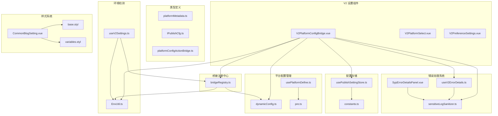
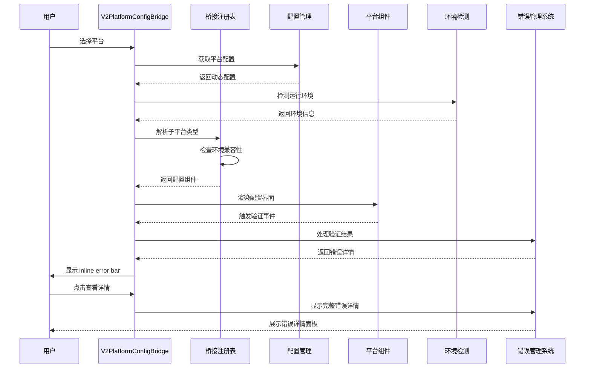
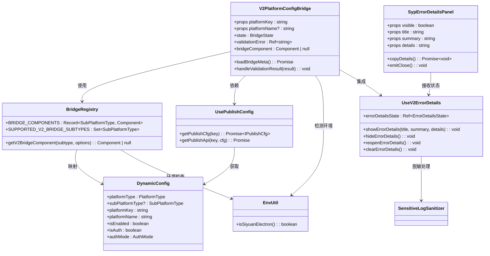
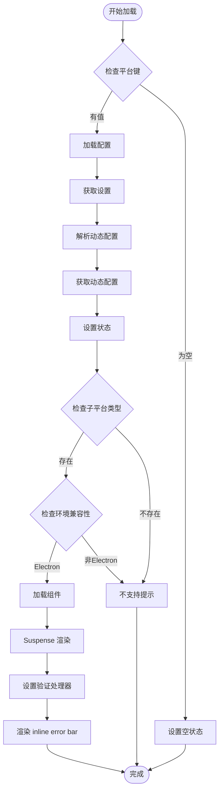
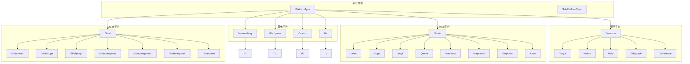
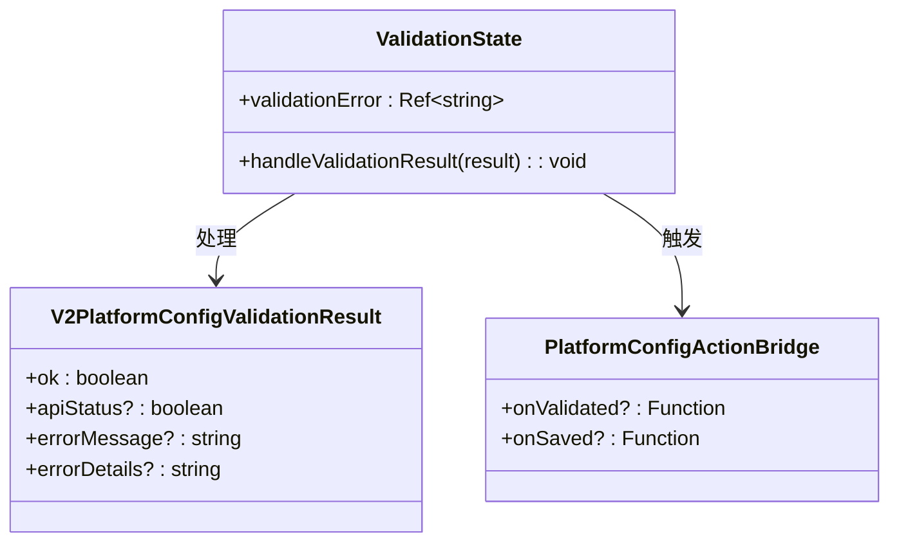
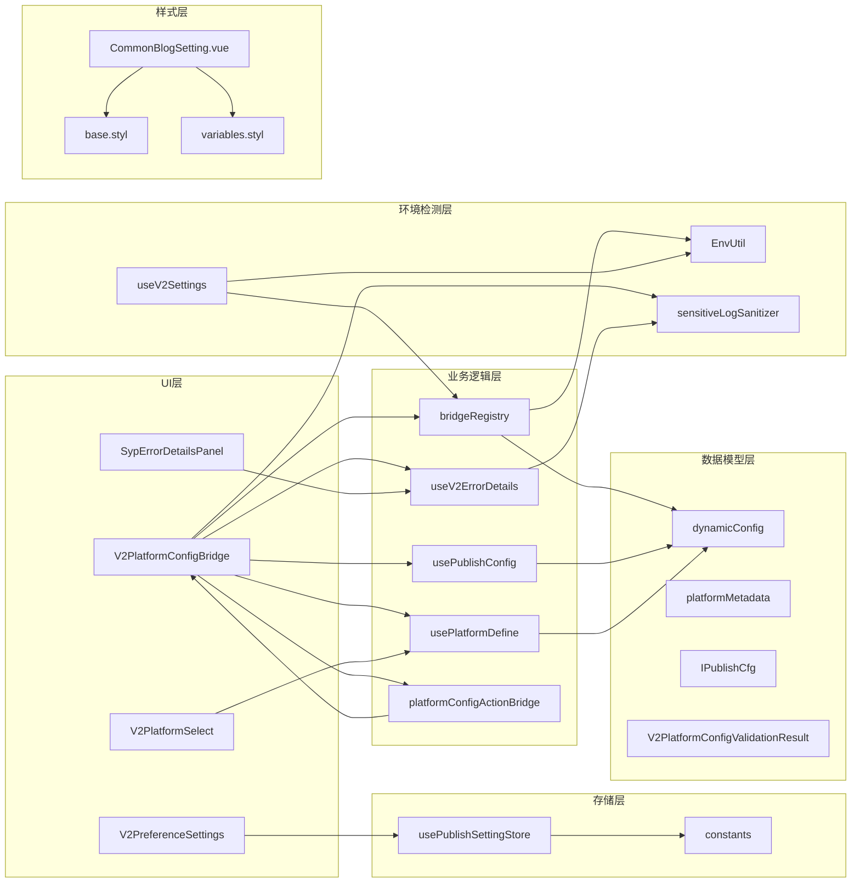
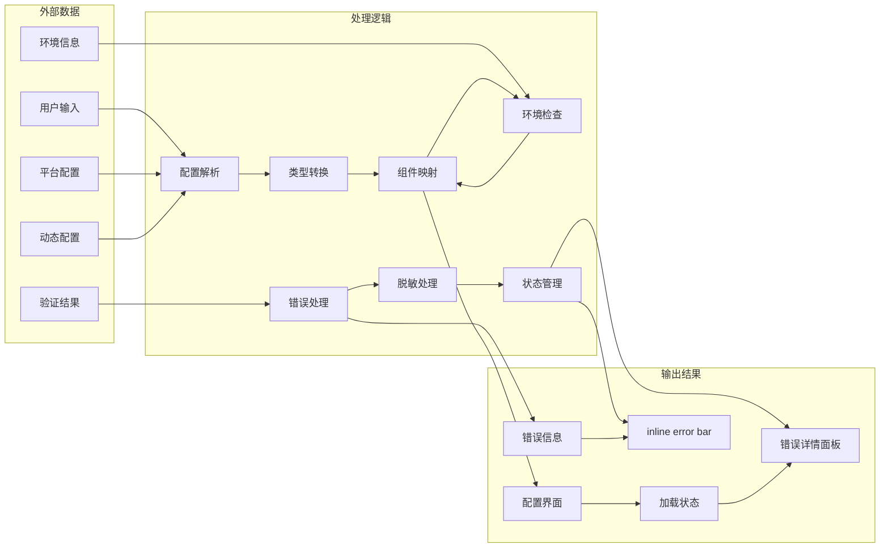

# V2 平台配置桥组件

<cite>
**本文档引用的文件**
- [V2PlatformConfigBridge.vue](file://src/components/v2/settings/V2PlatformConfigBridge.vue)
- [bridgeRegistry.ts](file://src/components/v2/settings/bridge/bridgeRegistry.ts)
- [dynamicConfig.ts](file://src/platforms/dynamicConfig.ts)
- [usePublishConfig.ts](file://src/composables/usePublishConfig.ts)
- [usePlatformDefine.ts](file://src/composables/usePlatformDefine.ts)
- [pre.ts](file://src/platforms/pre.ts)
- [V2PlatformSelect.vue](file://src/components/v2/settings/V2PlatformSelect.vue)
- [V2PreferenceSettings.vue](file://src/components/v2/settings/V2PreferenceSettings.vue)
- [usePublishSettingStore.ts](file://src/stores/usePublishSettingStore.ts)
- [constants.ts](file://src/utils/constants.ts)
- [platformMetadata.ts](file://src/models/platformMetadata.ts)
- [IPublishCfg.ts](file://src/types/IPublishCfg.ts)
- [EnvUtil.ts](file://src/utils/EnvUtil.ts)
- [useV2Settings.ts](file://src/composables/v2/useV2Settings.ts)
- [CommonBlogSetting.vue](file://src/components/set/publish/singleplatform/base/CommonBlogSetting.vue)
- [base.styl](file://src/assets/v2/base.styl)
- [variables.styl](file://src/assets/v2/variables.styl)
- [design.md](file://openspec/changes/refactor-ui-v2-foundation/design.md)
- [useV2ErrorDetails.ts](file://src/composables/v2/useV2ErrorDetails.ts)
- [SypErrorDetailsPanel.vue](file://src/components/v2/common/SypErrorDetailsPanel.vue)
- [platformConfigActionBridge.ts](file://src/components/v2/settings/bridge/platformConfigActionBridge.ts)
- [sensitiveLogSanitizer.ts](file://src/utils/sensitiveLogSanitizer.ts)
- [v2ConfigValidatedFlow.spec.ts](file://src/components/v2/v2ConfigValidatedFlow.spec.ts)
- [V2PlatformConfigBridge.spec.ts](file://src/components/v2/settings/V2PlatformConfigBridge.spec.ts)
</cite>

## 更新摘要
**变更内容**
- 新增增强的验证结果处理机制，支持详细的验证状态反馈
- 改进的错误状态管理，集成统一的错误详情面板
- 新增 inline error bar 实现，提供即时的验证失败反馈
- 集成 useV2ErrorDetails 组合式函数，提供完整的错误管理能力
- 实现敏感信息脱敏处理，确保日志和错误信息的安全性
- 增强的验证流程，支持配置验证和发布验证的统一处理

## 目录
1. [简介](#简介)
2. [项目结构](#项目结构)
3. [核心组件](#核心组件)
4. [架构概览](#架构概览)
5. [详细组件分析](#详细组件分析)
6. [验证结果处理增强](#验证结果处理增强)
7. [错误状态管理改进](#错误状态管理改进)
8. [Inline Error Bar 实现](#inline-error-bar-实现)
9. [样式系统改进](#样式系统改进)
10. [响应式设计增强](#响应式设计增强)
11. [依赖关系分析](#依赖关系分析)
12. [性能考虑](#性能考虑)
13. [故障排除指南](#故障排除指南)
14. [结论](#结论)

## 简介

V2 平台配置桥组件是思源笔记发布工具中的核心配置管理模块，负责动态加载和渲染不同平台的配置界面。该组件采用桥接模式设计，能够根据平台类型动态选择相应的配置组件，实现了高度可扩展的平台配置管理架构。

**更新** 该组件现已集成了全新的验证结果处理机制，提供了更完善的错误管理和用户反馈能力。新的架构通过 inline error bar 和统一的错误详情面板，为用户提供了即时且详细的验证失败信息。

**更新** 错误状态管理得到了显著改进，通过 useV2ErrorDetails 组合式函数实现了统一的错误处理机制。该机制支持错误信息的脱敏处理，确保敏感数据不会泄露到控制台或用户界面中。

**更新** 新增的 inline error bar 功能提供了即时的验证失败反馈，用户可以在配置界面中直接看到验证错误，并通过"查看详情"按钮获取完整的错误详情。这种设计大大改善了用户体验，减少了用户在配置过程中遇到问题时的困惑。

**更新** 敏感信息脱敏处理机制的集成确保了系统的安全性，所有包含 Cookie、Authorization、token 等敏感字段的错误信息都会被自动脱敏，保护了用户的隐私安全。

该组件支持多种平台类型，包括通用平台（语雀、Notion、Halo等）、GitHub平台（Hexo、Hugo、Jekyll等）、GitLab平台、Metaweblog平台、WordPress平台、自定义平台和文件系统平台。通过统一的接口和动态组件加载机制，为用户提供了一致的配置体验。

## 项目结构

基于仓库的实际结构，V2 平台配置桥组件位于以下路径：


```mermaid
graph TB
subgraph "V2 设置组件"
A[V2PlatformConfigBridge.vue]
B[V2PlatformSelect.vue]
C[V2PreferenceSettings.vue]
end
subgraph "桥接注册中心"
D[bridgeRegistry.ts]
end
subgraph "平台配置管理"
E[dynamicConfig.ts]
F[usePlatformDefine.ts]
G[pre.ts]
end
subgraph "配置存储"
H[usePublishSettingStore.ts]
I[constants.ts]
end
subgraph "类型定义"
J[platformMetadata.ts]
K[IPublishCfg.ts]
L[platformConfigActionBridge.ts]
end
subgraph "环境检测"
M[EnvUtil.ts]
N[useV2Settings.ts]
end
subgraph "错误处理系统"
O[useV2ErrorDetails.ts]
P[SypErrorDetailsPanel.vue]
Q[sensitiveLogSanitizer.ts]
end
subgraph "样式系统"
R[base.styl]
S[variables.styl]
T[CommonBlogSetting.vue]
end
A --> D
A --> E
A --> H
A --> M
A --> O
A --> Q
D --> E
D --> M
F --> G
H --> I
N --> D
N --> M
O --> Q
P --> Q
T --> R
T --> S
```

**图表来源**
- [V2PlatformConfigBridge.vue:1-322](file://src/components/v2/settings/V2PlatformConfigBridge.vue#L1-L322)
- [bridgeRegistry.ts:1-80](file://src/components/v2/settings/bridge/bridgeRegistry.ts#L1-L80)
- [dynamicConfig.ts:1-540](file://src/platforms/dynamicConfig.ts#L1-L540)
- [useV2Settings.ts:1-250](file://src/composables/v2/useV2Settings.ts#L1-L250)
- [useV2ErrorDetails.ts:1-67](file://src/composables/v2/useV2ErrorDetails.ts#L1-L67)
- [SypErrorDetailsPanel.vue:1-267](file://src/components/v2/common/SypErrorDetailsPanel.vue#L1-L267)
- [platformConfigActionBridge.ts:1-27](file://src/components/v2/settings/bridge/platformConfigActionBridge.ts#L1-L27)
- [sensitiveLogSanitizer.ts:1-62](file://src/utils/sensitiveLogSanitizer.ts#L1-L62)

**章节来源**
- [V2PlatformConfigBridge.vue:1-322](file://src/components/v2/settings/V2PlatformConfigBridge.vue#L1-L322)
- [bridgeRegistry.ts:1-80](file://src/components/v2/settings/bridge/bridgeRegistry.ts#L1-L80)
- [useV2ErrorDetails.ts:1-67](file://src/composables/v2/useV2ErrorDetails.ts#L1-L67)
- [SypErrorDetailsPanel.vue:1-267](file://src/components/v2/common/SypErrorDetailsPanel.vue#L1-L267)

## 核心组件

### V2PlatformConfigBridge 组件

V2PlatformConfigBridge 是整个配置桥的核心组件，负责：

1. **动态组件加载**：根据平台类型动态加载对应的配置组件
2. **状态管理**：处理加载状态、错误状态和配置数据
3. **国际化支持**：提供多语言支持
4. **环境检测**：区分 Electron 和 Web 环境
5. **验证结果处理**：集成验证结果的处理和反馈机制

**更新** 新增的验证结果处理功能包括：
- inline error bar 的实时错误显示
- 验证结果的状态管理
- 与 useV2ErrorDetails 的深度集成
- 敏感信息的自动脱敏处理

**章节来源**
- [V2PlatformConfigBridge.vue:46-108](file://src/components/v2/settings/V2PlatformConfigBridge.vue#L46-L108)
- [V2PlatformConfigBridge.vue:167-175](file://src/components/v2/settings/V2PlatformConfigBridge.vue#L167-L175)

### 桥接注册表

**更新** bridgeRegistry.ts 提供了全新的桥接组件注册机制：

1. **集中式映射管理**：将平台子类型映射到具体的配置组件，替代了之前的硬编码方式
2. **条件加载**：支持基于环境的组件加载（如本地系统仅在 Electron 环境可用）
3. **类型安全**：使用 TypeScript 枚举确保类型安全
4. **动态支持**：通过 SUPPORTED_V2_BRIDGE_SUBTYPES 集合动态跟踪支持的平台类型

**更新** 新增的环境兼容性检查机制确保了平台配置的安全性：
- Fs_LocalSystem 仅在 Electron 环境下可用
- 通过 EnvUtil.isSiyuanElectron() 统一检测环境
- 非 Electron 环境下自动降级处理

**新增** SUPPORTED_V2_BRIDGE_SUBTYPES 集合提供了运行时的平台类型支持检测能力，使得系统能够动态识别和管理支持的平台类型。

**章节来源**
- [bridgeRegistry.ts:69-79](file://src/components/v2/settings/bridge/bridgeRegistry.ts#L69-L79)

### 动态配置管理

dynamicConfig.ts 定义了完整的平台配置模型：

1. **平台类型枚举**：定义了所有支持的平台类型
2. **子平台类型**：细化到具体的平台实现
3. **配置模型**：包含平台的基本信息、认证信息等
4. **工具方法**：提供平台配置的各种操作方法

**章节来源**
- [dynamicConfig.ts:174-242](file://src/platforms/dynamicConfig.ts#L174-L242)

## 架构概览


```mermaid
sequenceDiagram
participant User as 用户
participant Bridge as V2PlatformConfigBridge
participant Registry as 桥接注册表
participant Config as 配置管理
participant Platform as 平台组件
participant Env as 环境检测
participant ErrorMgr as 错误管理系统
User->>Bridge : 选择平台
Bridge->>Config : 获取平台配置
Config-->>Bridge : 返回动态配置
Bridge->>Env : 检测运行环境
Env-->>Bridge : 返回环境信息
Bridge->>Registry : 解析子平台类型
Registry->>Registry : 检查环境兼容性
Registry-->>Bridge : 返回配置组件
Bridge->>Platform : 渲染配置界面
Platform-->>Bridge : 触发验证事件
Bridge->>ErrorMgr : 处理验证结果
ErrorMgr-->>Bridge : 返回错误详情
Bridge->>User : 显示 inline error bar
User->>Bridge : 点击查看详情
Bridge->>ErrorMgr : 显示完整错误详情
ErrorMgr-->>User : 展示错误详情面板
```

**图表来源**
- [V2PlatformConfigBridge.vue:85-108](file://src/components/v2/settings/V2PlatformConfigBridge.vue#L85-L108)
- [bridgeRegistry.ts:69-79](file://src/components/v2/settings/bridge/bridgeRegistry.ts#L69-L79)
- [usePublishConfig.ts:36-64](file://src/composables/usePublishConfig.ts#L36-L64)
- [EnvUtil.ts:27-32](file://src/utils/EnvUtil.ts#L27-L32)
- [useV2ErrorDetails.ts:20-67](file://src/composables/v2/useV2ErrorDetails.ts#L20-L67)

**更新** 该架构采用了典型的桥接模式，将平台配置的显示逻辑与具体平台的实现分离，实现了高内聚低耦合的设计。新的注册表系统提供了更好的可扩展性和维护性，通过集中式的组件映射减少了直接依赖，提高了系统的模块化程度。

**更新** 新的架构集成了统一的错误处理机制，通过 useV2ErrorDetails 提供了完整的错误管理能力。inline error bar 的实现确保了用户能够即时获得验证失败的反馈，而详细的错误详情面板则提供了足够的技术信息支持用户解决问题。

## 详细组件分析

### 组件类图


```mermaid
classDiagram
class V2PlatformConfigBridge {
+props platformKey : string
+props platformName? : string
+state : BridgeState
+validationError : Ref~string~
+loadBridgeMeta() : Promise<void>
+handleValidationResult(result) : void
+bridgeComponent : Component | null
}
class BridgeRegistry {
+BRIDGE_COMPONENTS : Record~SubPlatformType, Component~
+getV2BridgeComponent(subtype, options) : Component | null
+SUPPORTED_V2_BRIDGE_SUBTYPES : Set~SubPlatformType~
}
class DynamicConfig {
+platformType : PlatformType
+subPlatformType? : SubPlatformType
+platformKey : string
+platformName : string
+isEnabled : boolean
+isAuth : boolean
+authMode : AuthMode
}
class UsePublishConfig {
+getPublishCfg(key) : Promise~IPublishCfg~
+getPublishApi(key, cfg) : Promise
}
class EnvUtil {
+isSiyuanElectron() : boolean
}
class UseV2ErrorDetails {
+errorDetailsState : Ref~ErrorDetailsState~
+showErrorDetails(title, summary, details) : void
+hideErrorDetails() : void
+reopenErrorDetails() : void
+clearErrorDetails() : void
}
class SypErrorDetailsPanel {
+props visible : boolean
+props title : string
+props summary : string
+props details : string
+copyDetails() : Promise~void~
+emitClose() : void
}
V2PlatformConfigBridge --> BridgeRegistry : 使用
V2PlatformConfigBridge --> UsePublishConfig : 依赖
V2PlatformConfigBridge --> EnvUtil : 检测环境
V2PlatformConfigBridge --> UseV2ErrorDetails : 集成
BridgeRegistry --> DynamicConfig : 映射
BridgeRegistry --> EnvUtil : 环境检查
UsePublishConfig --> DynamicConfig : 获取
UseV2ErrorDetails --> SensitiveLogSanitizer : 脱敏处理
SypErrorDetailsPanel --> UseV2ErrorDetails : 接收状态
```

**图表来源**
- [V2PlatformConfigBridge.vue:54-72](file://src/components/v2/settings/V2PlatformConfigBridge.vue#L54-L72)
- [bridgeRegistry.ts:31-79](file://src/components/v2/settings/bridge/bridgeRegistry.ts#L31-L79)
- [dynamicConfig.ts:13-113](file://src/platforms/dynamicConfig.ts#L13-L113)
- [usePublishConfig.ts:26-95](file://src/composables/usePublishConfig.ts#L26-L95)
- [EnvUtil.ts:27-32](file://src/utils/EnvUtil.ts#L27-L32)
- [useV2ErrorDetails.ts:13-67](file://src/composables/v2/useV2ErrorDetails.ts#L13-L67)
- [SypErrorDetailsPanel.vue:59-104](file://src/components/v2/common/SypErrorDetailsPanel.vue#L59-L104)

### 配置加载流程


```mermaid
flowchart TD
Start([开始加载]) --> CheckKey{检查平台键}
CheckKey --> |为空| EmptyKey[设置空状态]
CheckKey --> |有值| LoadConfig[加载配置]
LoadConfig --> GetSetting[获取设置]
GetSetting --> ParseDynamic[解析动态配置]
ParseDynamic --> GetDynCfg[获取动态配置]
GetDynCfg --> SetState[设置状态]
SetState --> CheckSubtype{检查子平台类型}
CheckSubtype --> |存在| CheckEnv{检查环境兼容性}
CheckEnv --> |Electron| LoadComponent[加载组件]
CheckEnv --> |非Electron| NoSupport[不支持提示]
CheckSubtype --> |不存在| NoSupport
LoadComponent --> Suspense[Suspense 渲染]
Suspense --> SetupValidation[设置验证处理器]
SetupValidation --> RenderErrorBar[渲染 inline error bar]
RenderErrorBar --> End([完成])
NoSupport --> End
EmptyKey --> End
```

**图表来源**
- [V2PlatformConfigBridge.vue:85-108](file://src/components/v2/settings/V2PlatformConfigBridge.vue#L85-L108)
- [usePublishConfig.ts:36-64](file://src/composables/usePublishConfig.ts#L36-L64)
- [bridgeRegistry.ts:69-79](file://src/components/v2/settings/bridge/bridgeRegistry.ts#L69-L79)

### 平台类型层次结构


```mermaid
graph TB
subgraph "平台类型"
A[PlatformType]
B[SubPlatformType]
end
subgraph "通用平台"
C[Common]
C1[Yuque]
C2[Notion]
C3[Halo]
C4[Telegraph]
C5[Confluence]
end
subgraph "GitHub平台"
D[Github]
D1[Hexo]
D2[Hugo]
D3[Jekyll]
D4[Quartz]
D5[Vuepress]
D6[Vuepress2]
D7[Vitepress]
D8[Astro]
end
subgraph "GitLab平台"
E[Gitlab]
E1[Gitlabhexo]
E2[Gitlabhugo]
E3[Gitlabjekyll]
E4[Gitlabvuepress]
E5[Gitlabvuepress2]
E6[Gitlabvitepress]
E7[Gitlabastro]
end
subgraph "其他平台"
F[Metaweblog]
G[Wordpress]
H[Custom]
I[Fs]
end
A --> C
A --> D
A --> E
A --> F
A --> G
A --> H
A --> I
C --> C1
C --> C2
C --> C3
C --> C4
C --> C5
D --> D1
D --> D2
D --> D3
D --> D4
D --> D5
D --> D6
D --> D7
D --> D8
E --> E1
E --> E2
E --> E3
E --> E4
E --> E5
E --> E6
E --> E7
F --> F1
G --> G1
H --> H1
I --> I1
```

**图表来源**
- [dynamicConfig.ts:126-242](file://src/platforms/dynamicConfig.ts#L126-L242)

**章节来源**
- [dynamicConfig.ts:126-335](file://src/platforms/dynamicConfig.ts#L126-L335)

## 验证结果处理增强

### 验证结果数据结构

**更新** 新增的验证结果处理机制通过 V2PlatformConfigValidationResult 接口提供了完整的验证状态反馈：


```mermaid
classDiagram
class V2PlatformConfigValidationResult {
+ok : boolean
+apiStatus? : boolean
+errorMessage? : string
+errorDetails? : string
}
class ValidationState {
+validationError : Ref~string~
+handleValidationResult(result) : void
}
class PlatformConfigActionBridge {
+onValidated? : Function
+onSaved? : Function
}
ValidationState --> V2PlatformConfigValidationResult : 处理
ValidationState --> PlatformConfigActionBridge : 触发
```

**图表来源**
- [platformConfigActionBridge.ts:12-22](file://src/components/v2/settings/bridge/platformConfigActionBridge.ts#L12-L22)
- [V2PlatformConfigBridge.vue:167-175](file://src/components/v2/settings/V2PlatformConfigBridge.vue#L167-L175)

**更新** 验证结果包含以下关键字段：
- `ok`：验证是否通过的布尔标志
- `apiStatus`：API 状态的可选标志
- `errorMessage`：简短的错误消息
- `errorDetails`：详细的错误描述

### 验证流程集成

**更新** 验证结果处理流程的集成确保了从平台配置到用户反馈的完整链路：

1. **验证触发**：平台配置组件通过 @validated 事件触发验证
2. **结果处理**：V2PlatformConfigBridge.handleValidationResult 处理验证结果
3. **错误显示**：通过 validationError.ref 实时显示 inline error bar
4. **详情处理**：使用 useV2ErrorDetails 提供详细的错误详情
5. **状态同步**：向父组件转发验证结果

**章节来源**
- [V2PlatformConfigBridge.vue:167-175](file://src/components/v2/settings/V2PlatformConfigBridge.vue#L167-L175)
- [platformConfigActionBridge.ts:19-22](file://src/components/v2/settings/bridge/platformConfigActionBridge.ts#L19-L22)

## 错误状态管理改进

### useV2ErrorDetails 组合式函数

**更新** 新增的 useV2ErrorDetails 组合式函数提供了完整的错误状态管理能力：

1. **状态管理**：通过 Ref 管理错误详情的可见性和内容
2. **脱敏处理**：自动对敏感信息进行脱敏处理
3. **生命周期管理**：提供显示、隐藏、清除和重新打开功能
4. **类型安全**：完整的 TypeScript 类型定义

**更新** 错误详情状态的结构包括：
- `visible`：错误详情面板的可见状态
- `title`：错误标题
- `summary`：错误摘要
- `details`：详细错误信息

**章节来源**
- [useV2ErrorDetails.ts:13-67](file://src/composables/v2/useV2ErrorDetails.ts#L13-L67)

### 错误详情面板组件

**更新** SypErrorDetailsPanel 提供了完整的错误详情展示界面：

1. **模态对话框**：全屏覆盖的错误详情面板
2. **复制功能**：一键复制错误详情到剪贴板
3. **键盘导航**：支持 ESC 键关闭和键盘操作
4. **响应式设计**：适配不同屏幕尺寸的设备

**更新** 面板功能包括：
- 错误标题和摘要的清晰展示
- 可复制的详细错误内容
- 关闭和复制按钮的直观操作
- 动画过渡效果提升用户体验

**章节来源**
- [SypErrorDetailsPanel.vue:10-54](file://src/components/v2/common/SypErrorDetailsPanel.vue#L10-L54)
- [SypErrorDetailsPanel.vue:153-161](file://src/components/v2/common/SypErrorDetailsPanel.vue#L153-L161)

## Inline Error Bar 实现

### 实时错误反馈机制

**更新** 新增的 inline error bar 提供了即时的验证失败反馈：

1. **条件渲染**：仅在验证失败时显示
2. **简洁信息**：显示简短的错误摘要
3. **查看详情**：提供"查看详情"按钮跳转到完整错误详情
4. **样式设计**：采用醒目的错误样式提醒用户

**更新** inline error bar 的 HTML 结构：
```html
<div v-if="validationError" class="syp-validation-error-bar" data-testid="syp-validation-error-bar">
  <span class="syp-validation-error-bar__text">{{ validationError }}</span>
  <button
    type="button"
    class="syp-validation-error-bar__action"
    data-testid="syp-validation-error-view-details"
    @click="emit('show-error-details')"
  >
    {{ t("v2.platformConfig.validation.viewDetails") }}
  </button>
</div>
```

**章节来源**
- [V2PlatformConfigBridge.vue:54-65](file://src/components/v2/settings/V2PlatformConfigBridge.vue#L54-L65)

### 样式设计规范

**更新** inline error bar 的样式设计遵循以下规范：

1. **颜色方案**：使用错误主题色 #d32f2f
2. **背景设计**：浅红色背景 #fdecea
3. **布局结构**：左右布局，左侧显示错误信息，右侧显示操作按钮
4. **响应式适配**：在小屏幕上自动调整布局

**更新** 样式特性包括：
- 圆角边框设计
- 适当的内边距和外边距
- 悬停状态的颜色变化
- 12px 字体大小的统一设计

**章节来源**
- [V2PlatformConfigBridge.vue:290-321](file://src/components/v2/settings/V2PlatformConfigBridge.vue#L290-L321)

## 样式系统改进

### 紧凑的Ant Design元素设计

**更新** 新的样式系统引入了紧凑的Ant Design元素设计，提供了更好的用户体验和视觉一致性：

1. **统一的样式变量系统**：通过 variables.styl 定义了完整的样式变量，包括颜色、间距、圆角、阴影等
2. **紧凑的组件尺寸**：采用 Ant Design 的 sm 尺寸规范，按钮高度 24px，内边距 8px，字体大小 12px
3. **一致的视觉设计**：所有表单控件、按钮、输入框等都遵循统一的设计规范
4. **深色模式支持**：完整的深色模式配色方案，确保在不同主题下的一致性

**更新** 表单样式的改进包括：
- 减少了表单项之间的间距，从 16px 降低到 8px
- 统一了标签和内容的高度，确保对齐一致性
- 优化了输入框的内边距和圆角半径
- 改进了按钮的最小高度和内边距

**章节来源**
- [variables.styl:96-117](file://src/assets/v2/variables.styl#L96-L117)
- [V2PlatformConfigBridge.vue:111-220](file://src/components/v2/settings/V2PlatformConfigBridge.vue#L111-L220)

### 统一的样式基线

**更新** base.styl 提供了统一的样式基线，确保所有组件的一致性：

1. **命名空间隔离**：所有样式都包裹在 .syp 命名空间下，避免与思源笔记样式冲突
2. **响应式基础**：提供了完整的响应式基础样式，支持移动端和小屏幕设备
3. **组件样式**：定义了按钮、卡片、输入框、列表等基础组件的样式
4. **布局系统**：提供了网格布局和弹性布局的基础样式

**更新** 新增的响应式样式规则：
- 移动端优先的设计理念
- 自适应的网格布局系统
- 触摸友好的交互元素尺寸
- 优化的字体大小和行高

**章节来源**
- [base.styl:1-433](file://src/assets/v2/base.styl#L1-L433)

### 平台设置组件的样式优化

**更新** CommonBlogSetting.vue 作为基础平台设置组件，采用了全新的紧凑样式设计：

1. **紧凑的表单布局**：减少了表单项之间的垂直间距，提高了空间利用率
2. **统一的控件尺寸**：所有 Element Plus 控件都使用 sm 尺寸，保持视觉一致性
3. **优化的标签设计**：标签采用 12px 字体大小，右对齐，最大宽度 96px
4. **改进的交互反馈**：按钮和输入框的交互状态更加明显

**更新** 样式优化的具体改进：
- 表单项底部间距从 16px 降低到 8px
- 输入框高度从 40px 降低到 30px
- 按钮高度从 40px 降低到 30px
- 圆角半径从 8px 降低到 8px（保持一致）
- 字体大小统一为 12px

**章节来源**
- [CommonBlogSetting.vue:540-615](file://src/components/set/publish/singleplatform/base/CommonBlogSetting.vue#L540-L615)

## 响应式设计增强

### 移动端适配

**更新** 新的响应式设计确保了在各种设备上的优质体验：

1. **断点优化**：针对 960px 断点进行了专门优化
2. **触摸友好**：按钮和交互元素的尺寸适合触摸操作
3. **布局调整**：在小屏幕上自动调整布局结构
4. **字体优化**：根据屏幕尺寸调整字体大小

**更新** 响应式布局的具体改进：
- 当屏幕宽度小于 960px 时，设置页面标题字体大小调整为 18px
- 表单项从水平布局改为垂直布局，提高可读性
- 控制器区域宽度调整为 100%，居中对齐
- 卡片网格布局从 2 列调整为 1 列

**章节来源**
- [base.styl:401-433](file://src/assets/v2/base.styl#L401-L433)

### 触摸交互优化

**更新** 针对触摸设备的交互优化：

1. **点击区域增大**：确保按钮和链接有足够的点击区域
2. **手势支持**：优化了滚动和滑动手势的体验
3. **反馈机制**：增强了触摸反馈和视觉反馈
4. **导航优化**：简化了导航结构，便于触摸操作

**更新** 触摸友好的设计元素：
- 按钮最小高度 30px，确保易于点击
- 输入框最小高度 30px，便于触摸输入
- 行间距适当增加，避免误触
- 边距和内边距统一，保持视觉平衡

## 依赖关系分析

### 组件依赖图


```mermaid
graph LR
subgraph "UI层"
A[V2PlatformConfigBridge]
B[V2PlatformSelect]
C[V2PreferenceSettings]
D[SypErrorDetailsPanel]
end
subgraph "业务逻辑层"
E[bridgeRegistry]
F[usePublishConfig]
G[usePlatformDefine]
H[useV2ErrorDetails]
I[platformConfigActionBridge]
end
subgraph "数据模型层"
J[dynamicConfig]
K[platformMetadata]
L[IPublishCfg]
M[V2PlatformConfigValidationResult]
end
subgraph "存储层"
N[usePublishSettingStore]
O[constants]
end
subgraph "环境检测层"
P[EnvUtil]
Q[useV2Settings]
R[sensitiveLogSanitizer]
end
subgraph "样式层"
S[base.styl]
T[variables.styl]
U[CommonBlogSetting.vue]
end
A --> E
A --> F
A --> G
A --> H
A --> I
A --> R
B --> G
C --> N
D --> H
E --> J
E --> P
F --> J
G --> J
H --> R
I --> A
N --> O
Q --> E
Q --> P
U --> S
U --> T
```

**图表来源**
- [V2PlatformConfigBridge.vue:48-52](file://src/components/v2/settings/V2PlatformConfigBridge.vue#L48-L52)
- [bridgeRegistry.ts:29](file://src/components/v2/settings/bridge/bridgeRegistry.ts#L29)
- [usePublishConfig.ts:10-18](file://src/composables/usePublishConfig.ts#L10-L18)
- [useV2ErrorDetails.ts:20](file://src/composables/v2/useV2ErrorDetails.ts#L20)
- [platformConfigActionBridge.ts:24](file://src/components/v2/settings/bridge/platformConfigActionBridge.ts#L24)
- [useV2Settings.ts:3](file://src/composables/v2/useV2Settings.ts#L3)

### 数据流分析


```mermaid
flowchart LR
subgraph "外部数据"
A[用户输入]
B[平台配置]
C[动态配置]
D[环境信息]
E[验证结果]
end
subgraph "处理逻辑"
F[配置解析]
G[类型转换]
H[组件映射]
I[环境检查]
J[错误处理]
K[脱敏处理]
L[状态管理]
end
subgraph "输出结果"
M[配置界面]
N[错误信息]
O[加载状态]
P[inline error bar]
Q[错误详情面板]
end
A --> F
B --> F
C --> F
D --> I
E --> J
J --> K
K --> L
F --> G
G --> H
H --> I
I --> H
H --> M
J --> N
L --> P
L --> Q
M --> O
N --> P
O --> Q
```

**图表来源**
- [usePublishConfig.ts:36-64](file://src/composables/usePublishConfig.ts#L36-L64)
- [bridgeRegistry.ts:69-79](file://src/components/v2/settings/bridge/bridgeRegistry.ts#L69-L79)
- [EnvUtil.ts:27-32](file://src/utils/EnvUtil.ts#L27-L32)
- [useV2ErrorDetails.ts:28-51](file://src/composables/v2/useV2ErrorDetails.ts#L28-L51)
- [sensitiveLogSanitizer.ts:24-46](file://src/utils/sensitiveLogSanitizer.ts#L24-L46)

**更新** 新的注册表系统提供了更清晰的数据流控制，通过集中式的组件映射减少了直接依赖，提高了系统的模块化程度。SUPPORTED_V2_BRIDGE_SUBTYPES 集合的引入使得平台类型的支持检测更加直观和高效。

**更新** 错误处理系统的集成确保了从验证失败到用户反馈的完整流程。useV2ErrorDetails 的状态管理与 SypErrorDetailsPanel 的界面展示形成了完整的错误处理闭环。

**更新** 敏感信息脱敏处理的集成确保了系统的安全性，通过 sanitizeSensitiveForLog 函数对所有可能包含敏感信息的错误内容进行自动脱敏。

**章节来源**
- [usePublishConfig.ts:26-95](file://src/composables/usePublishConfig.ts#L26-L95)
- [bridgeRegistry.ts:1-80](file://src/components/v2/settings/bridge/bridgeRegistry.ts#L1-L80)
- [useV2Settings.ts:60-92](file://src/composables/v2/useV2Settings.ts#L60-L92)
- [useV2ErrorDetails.ts:20-67](file://src/composables/v2/useV2ErrorDetails.ts#L20-L67)

## 性能考虑

### 异步加载优化

V2 平台配置桥组件采用了多种性能优化策略：

1. **Suspense 异步加载**：使用 Vue Suspense 处理异步组件加载，提供更好的用户体验
2. **懒加载机制**：只有在需要时才加载特定平台的配置组件
3. **状态缓存**：避免重复的配置加载操作
4. **条件渲染**：根据平台类型动态决定是否渲染配置界面

### 内存管理

1. **组件卸载清理**：正确处理组件的生命周期，避免内存泄漏
2. **事件监听器清理**：及时移除不必要的事件监听器
3. **计算属性优化**：使用 Vue 的响应式系统优化计算属性的重新计算

**更新** 注册表系统通过集中管理组件映射，减少了重复的组件导入和实例化，提高了内存使用效率。SUPPORTED_V2_BRIDGE_SUBTYPES 集合的使用避免了频繁的类型检查操作，进一步优化了性能。

**更新** 错误处理系统的优化：
- useV2ErrorDetails 通过 Ref 管理状态，避免了不必要的响应式开销
- inline error bar 的条件渲染减少了 DOM 元素的数量
- 敏感信息脱敏处理在内存中进行，避免了重复的字符串操作

**更新** 环境兼容性检查的优化：
- 使用 EnvUtil.isSiyuanElectron() 缓存环境检测结果
- Fs_LocalSystem 的环境检查在组件初始化时进行，避免重复计算
- 非 Electron 环境下的快速失败机制减少不必要的资源消耗

**更新** 样式系统的性能优化：
- 统一的样式变量减少了重复的 CSS 计算
- 紧凑的设计减少了 DOM 元素的数量
- 响应式样式的媒体查询优化了不同设备的渲染性能

## 故障排除指南

### 常见问题及解决方案

#### 平台配置加载失败

**问题描述**：平台配置无法正确加载或显示

**可能原因**：
1. 平台键无效或不存在
2. 动态配置解析失败
3. 组件映射错误
4. 环境不兼容（如 Fs_LocalSystem 在非 Electron 环境）

**解决步骤**：
1. 检查平台键格式是否正确
2. 验证动态配置是否存在于存储中
3. 确认平台类型是否在 SUPPORTED_V2_BRIDGE_SUBTYPES 集合中
4. 检查当前运行环境是否满足平台要求

#### 组件渲染异常

**问题描述**：配置组件无法正常渲染

**可能原因**：
1. 环境不兼容（如本地系统仅在 Electron 环境可用）
2. 组件加载超时
3. 依赖包版本冲突

**解决步骤**：
1. 检查当前运行环境
2. 验证组件依赖是否正确安装
3. 查看浏览器控制台错误信息
4. 确认平台类型是否支持当前环境

#### 验证结果处理异常

**问题描述**：验证失败但没有显示错误信息

**可能原因**：
1. 验证结果处理逻辑异常
2. useV2ErrorDetails 状态管理问题
3. inline error bar 条件渲染错误
4. 敏感信息脱敏处理失败

**解决步骤**：
1. 检查 handleValidationResult 方法是否被正确调用
2. 验证 validationError.ref 是否正确更新
3. 确认 useV2ErrorDetails 的状态是否正确
4. 检查敏感信息脱敏处理是否正常工作

#### 错误详情面板显示问题

**问题描述**：点击"查看详情"无法显示错误详情

**解决步骤**：
1. 检查 useV2ErrorDetails.showErrorDetails 是否被正确调用
2. 验证 SypErrorDetailsPanel 的 visible 状态
3. 确认错误详情内容是否正确传递
4. 检查面板的键盘导航和点击事件

**更新** 环境兼容性检查的故障排除：
- Fs_LocalSystem 在非 Electron 环境下会自动降级为 null，不会抛出异常
- useV2Settings 中的平台列表过滤确保只显示支持的平台
- EnvUtil.isSiyuanElectron() 提供统一的环境检测，避免分散的环境判断

**更新** 错误处理系统的故障排除：
- 检查 V2PlatformConfigBridge 的 @validated 事件是否正确触发
- 验证 useV2ErrorDetails 的状态管理是否正常
- 确认敏感信息脱敏处理的正则表达式是否正确
- 检查 inline error bar 的条件渲染逻辑

**更新** 样式系统的故障排除：
- 检查样式变量是否正确加载
- 验证响应式样式的媒体查询是否生效
- 确认紧凑设计的样式是否正确应用
- 检查深色模式的样式覆盖是否正常

**章节来源**
- [V2PlatformConfigBridge.vue:18-42](file://src/components/v2/settings/V2PlatformConfigBridge.vue#L18-L42)
- [V2PlatformConfigBridge.vue:85-108](file://src/components/v2/settings/V2PlatformConfigBridge.vue#L85-L108)
- [bridgeRegistry.ts:74-76](file://src/components/v2/settings/bridge/bridgeRegistry.ts#L74-L76)
- [useV2ErrorDetails.ts:20-67](file://src/composables/v2/useV2ErrorDetails.ts#L20-L67)

## 结论

V2 平台配置桥组件是一个设计精良的配置管理模块，具有以下特点：

1. **高度可扩展性**：通过桥接模式支持任意数量的平台配置
2. **类型安全**：使用 TypeScript 枚举确保类型安全
3. **环境适应性**：支持多种运行环境（Electron、Web），并提供统一的环境检测机制
4. **用户体验友好**：提供异步加载和错误处理机制
5. **维护性良好**：清晰的代码结构和模块化设计

**更新** 最新的验证结果处理机制显著提升了组件的实用性和用户友好性。通过 inline error bar 和统一的错误详情面板，用户能够在配置过程中获得即时且详细的反馈，大大改善了配置体验。

**更新** 错误状态管理的改进确保了系统的健壮性和安全性。useV2ErrorDetails 的集成提供了完整的错误处理能力，而敏感信息脱敏处理机制则保护了用户的隐私安全。

**更新** 新的架构通过统一的错误处理和验证机制，为整个发布系统提供了更好的质量保障。这种设计不仅提升了用户体验，也为未来的功能扩展奠定了坚实的基础。

**更新** 样式系统的重大改进引入了紧凑的 Ant Design 元素设计和全面的响应式支持，提供了更好的用户体验和视觉一致性。统一的样式变量系统确保了在各种设备上的一致表现。

该组件为思源笔记发布工具提供了强大的平台配置管理能力，是整个系统的重要基础设施。通过合理的架构设计和实现，确保了系统的稳定性和可扩展性。

未来可以考虑的改进方向：
1. 添加更多的平台类型支持
2. 优化组件加载性能
3. 增强错误处理和日志记录
4. 提供更丰富的配置验证机制
5. 扩展注册表系统的功能，支持插件化的平台配置组件
6. 实现动态平台类型的热重载机制
7. 增加平台配置组件的版本管理功能
8. 增强环境检测的粒度，支持更精细的平台可用性控制
9. 进一步优化响应式设计，支持更多设备类型
10. 增强深色模式的自定义能力
11. 集成更多类型的验证结果处理，支持复杂的配置验证场景
12. 扩展错误详情面板的功能，支持错误报告和反馈机制