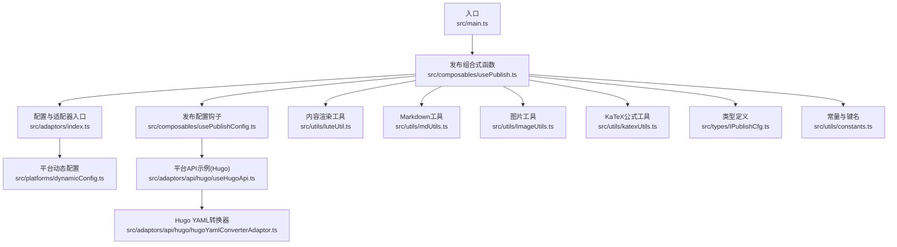
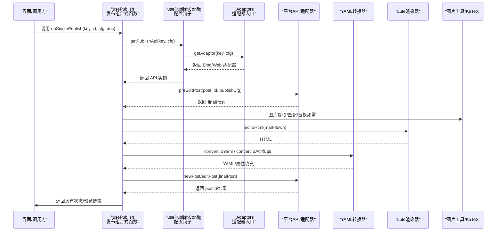
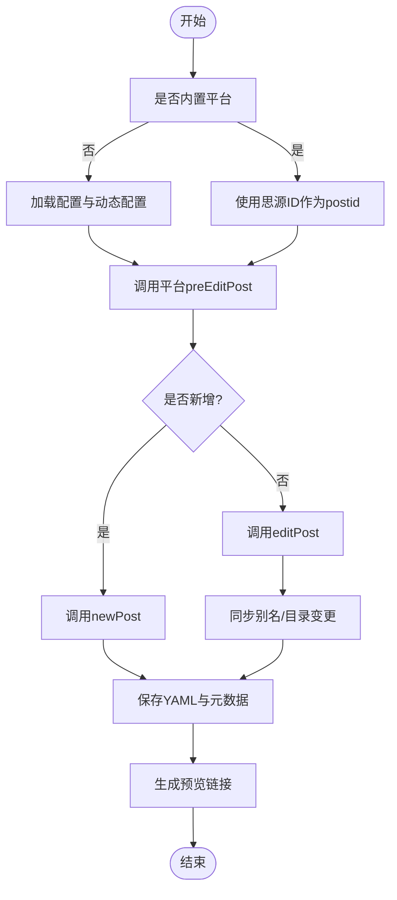
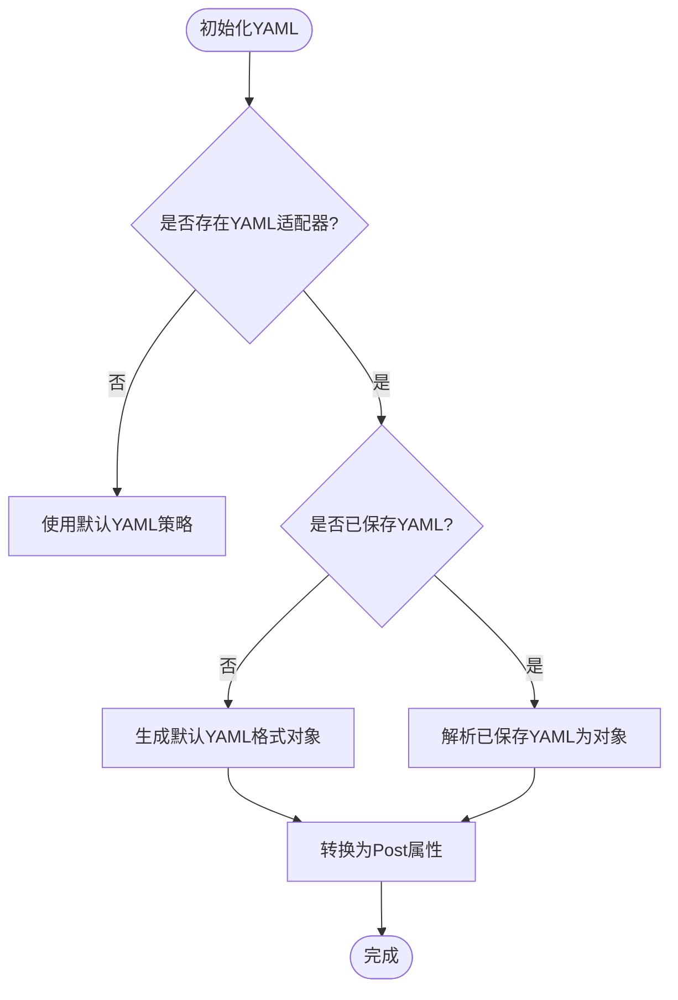
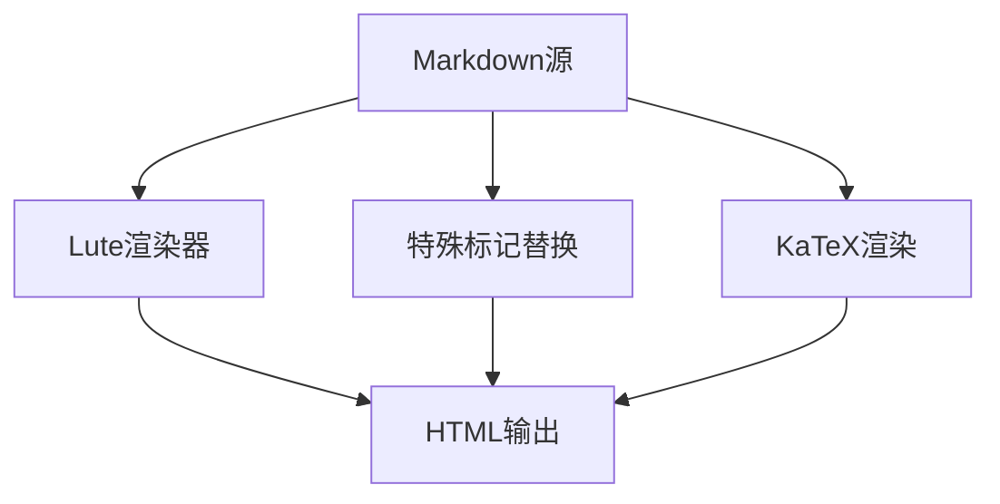
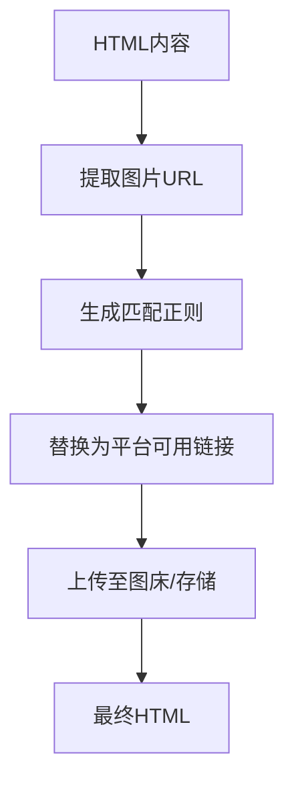
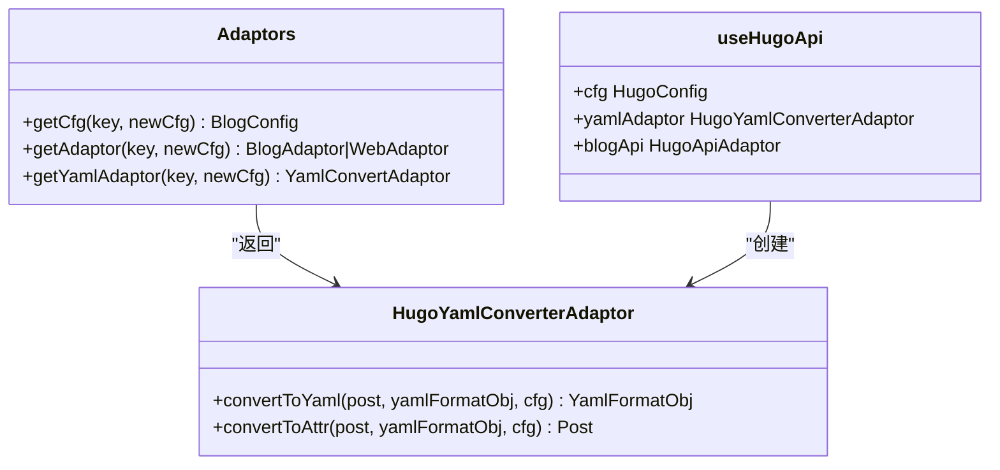
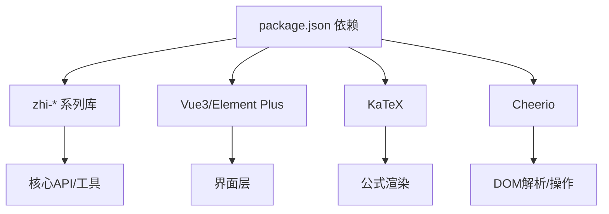

# 内容处理管道

<cite>
**本文引用的文件**   
- [README_zh_CN.md](file://README_zh_CN.md)
- [main.ts](file://src/main.ts)
- [usePublish.ts](file://src/composables/usePublish.ts)
- [usePublishConfig.ts](file://src/composables/usePublishConfig.ts)
- [index.ts](file://src/adaptors/index.ts)
- [dynamicConfig.ts](file://src/platforms/dynamicConfig.ts)
- [IPublishCfg.ts](file://src/types/IPublishCfg.ts)
- [luteUtil.ts](file://src/utils/luteUtil.ts)
- [mdUtils.ts](file://src/utils/mdUtils.ts)
- [ImageUtils.ts](file://src/utils/ImageUtils.ts)
- [katexUtils.ts](file://src/utils/katexUtils.ts)
- [constants.ts](file://src/utils/constants.ts)
- [useHugoApi.ts](file://src/adaptors/api/hugo/useHugoApi.ts)
- [hugoYamlConverterAdaptor.ts](file://src/adaptors/api/hugo/hugoYamlConverterAdaptor.ts)
- [package.json](file://package.json)
</cite>

## 目录
1. [简介](#简介)
2. [项目结构](#项目结构)
3. [核心组件](#核心组件)
4. [架构总览](#架构总览)
5. [详细组件分析](#详细组件分析)
6. [依赖关系分析](#依赖关系分析)
7. [性能考量](#性能考量)
8. [故障排查指南](#故障排查指南)
9. [结论](#结论)
10. [附录](#附录)

## 简介
本技术文档围绕“内容处理管道”展开，系统性阐述从思源笔记内容到目标平台（如语雀、Notion、WordPress、Hugo、Astro 等）的完整发布流程。重点覆盖以下方面：
- 文档解析与转换：Markdown 到 HTML 的渲染、公式渲染、特殊标记处理
- 图片处理与上传：图片提取、匹配与替换、占位符与上传流程衔接
- 链接重写与预览：基于平台配置的预览链接生成与拼接
- 元数据提取与标准化：YAML 配置处理、平台特定字段转换、配置验证
- 平台适配器：适配器选择、调用时机与职责边界
- 配置选项与扩展：动态配置、YAML 规则、文件命名规则、图片存储路径等
- 常见问题与性能优化策略

## 项目结构
该项目采用前端单页应用（Vue 3 + Vite）与适配器模式结合的架构，核心逻辑集中在组合式函数与适配器模块中，平台能力通过统一入口按需加载。

**图表来源**
- [main.ts:15-21](file://src/main.ts#L15-L21)
- [usePublish.ts:70-212](file://src/composables/usePublish.ts#L70-L212)
- [usePublishConfig.ts:36-78](file://src/composables/usePublishConfig.ts#L36-L78)
- [index.ts:65-263](file://src/adaptors/index.ts#L65-L263)
- [dynamicConfig.ts:456-515](file://src/platforms/dynamicConfig.ts#L456-L515)
- [IPublishCfg.ts:21-47](file://src/types/IPublishCfg.ts#L21-L47)
- [luteUtil.ts:23-88](file://src/utils/luteUtil.ts#L23-L88)
- [mdUtils.ts:52-129](file://src/utils/mdUtils.ts#L52-L129)
- [ImageUtils.ts:149-154](file://src/utils/ImageUtils.ts#L149-L154)
- [katexUtils.ts:27-30](file://src/utils/katexUtils.ts#L27-L30)
- [useHugoApi.ts:22-95](file://src/adaptors/api/hugo/useHugoApi.ts#L22-L95)
- [hugoYamlConverterAdaptor.ts:25-123](file://src/adaptors/api/hugo/hugoYamlConverterAdaptor.ts#L25-L123)

**章节来源**
- [main.ts:15-21](file://src/main.ts#L15-L21)
- [README_zh_CN.md:1-100](file://README_zh_CN.md#L1-L100)

## 核心组件
- 发布组合式函数：负责统一的发布/删除流程、预处理、YAML 初始化与转换、属性持久化、预览链接生成与更新。
- 配置与适配器入口：根据平台 key 解析配置、加载适配器与 YAML 转换器。
- 平台动态配置：统一管理平台类型、子类型、授权模式、域名、是否内置等元信息。
- 内容渲染工具：基于 Lute 实现 Markdown 到 HTML 的渲染，并支持公式节点处理。
- Markdown 工具：提供特殊标记替换、人类可读文件名生成等辅助能力。
- 图片工具：提供图片 URL 匹配、提取、存在性判断等能力。
- KaTeX 工具：提供公式渲染为 HTML 字符串的能力。
- 类型与常量：定义发布配置接口、动态配置键名规则、标题长度限制、代理中间件等。

**章节来源**
- [usePublish.ts:70-212](file://src/composables/usePublish.ts#L70-L212)
- [usePublishConfig.ts:36-78](file://src/composables/usePublishConfig.ts#L36-L78)
- [index.ts:65-263](file://src/adaptors/index.ts#L65-L263)
- [dynamicConfig.ts:13-113](file://src/platforms/dynamicConfig.ts#L13-L113)
- [luteUtil.ts:23-88](file://src/utils/luteUtil.ts#L23-L88)
- [mdUtils.ts:52-129](file://src/utils/mdUtils.ts#L52-L129)
- [ImageUtils.ts:149-154](file://src/utils/ImageUtils.ts#L149-L154)
- [katexUtils.ts:27-30](file://src/utils/katexUtils.ts#L27-L30)
- [IPublishCfg.ts:21-47](file://src/types/IPublishCfg.ts#L21-L47)
- [constants.ts:19-53](file://src/utils/constants.ts#L19-L53)

## 架构总览
内容处理管道遵循“配置驱动 + 适配器模式”的设计，核心流程如下：

**图表来源**
- [usePublish.ts:113-171](file://src/composables/usePublish.ts#L113-L171)
- [usePublishConfig.ts:73-78](file://src/composables/usePublishConfig.ts#L73-L78)
- [index.ts:271-467](file://src/adaptors/index.ts#L271-L467)
- [luteUtil.ts:23-88](file://src/utils/luteUtil.ts#L23-L88)
- [ImageUtils.ts:149-154](file://src/utils/ImageUtils.ts#L149-L154)
- [katexUtils.ts:27-30](file://src/utils/katexUtils.ts#L27-L30)

## 详细组件分析

### 发布流程与控制流
- 预处理阶段：调用平台适配器的预编辑接口，生成最终待发布内容。
- 发布/更新分支：根据是否已有 postid 决定新增或更新；更新时同步别名与目录变更。
- 属性持久化：非内置平台将 YAML 与元数据写回思源笔记属性。
- 预览链接：根据平台返回的相对/绝对链接，结合 home 配置拼接完整 URL。

**图表来源**
- [usePublish.ts:70-212](file://src/composables/usePublish.ts#L70-L212)

**章节来源**
- [usePublish.ts:70-212](file://src/composables/usePublish.ts#L70-L212)

### YAML 配置处理机制
- YAML 初始化：若平台提供 YAML 转换器且未保存 YAML，则自动生成默认 YAML；若已保存，则保持最新 YAML。
- 字段映射：将 YAML 中的标题、日期、标签、分类、SEO 等字段映射到 Post 对象属性。
- 平台差异：不同平台（如 Hugo）提供各自的 YAML 规则与默认字段集，支持动态 YAML 配置覆盖。

**图表来源**
- [usePublish.ts:396-425](file://src/composables/usePublish.ts#L396-L425)
- [hugoYamlConverterAdaptor.ts:25-123](file://src/adaptors/api/hugo/hugoYamlConverterAdaptor.ts#L25-L123)

**章节来源**
- [usePublish.ts:396-425](file://src/composables/usePublish.ts#L396-L425)
- [hugoYamlConverterAdaptor.ts:25-123](file://src/adaptors/api/hugo/hugoYamlConverterAdaptor.ts#L25-L123)

### 内容标准化与渲染
- Markdown 到 HTML：通过 Lute 渲染器执行 Markdown 到 HTML 的转换，并自定义公式节点渲染器，确保行内与块级公式正确输出。
- 特殊标记处理：提供正则替换工具，安全地在 Markdown 中替换指定标记，避免误伤代码块、行内代码、公式等区域。
- 公式渲染：对 KaTeX 表达式进行渲染，生成 HTML 字符串，便于后续注入到 HTML 内容中。

**图表来源**
- [luteUtil.ts:23-88](file://src/utils/luteUtil.ts#L23-L88)
- [mdUtils.ts:52-129](file://src/utils/mdUtils.ts#L52-L129)
- [katexUtils.ts:27-30](file://src/utils/katexUtils.ts#L27-L30)

**章节来源**
- [luteUtil.ts:23-88](file://src/utils/luteUtil.ts#L23-L88)
- [mdUtils.ts:52-129](file://src/utils/mdUtils.ts#L52-L129)
- [katexUtils.ts:27-30](file://src/utils/katexUtils.ts#L27-L30)

### 图片处理与上传
- 图片提取：从 HTML 中提取所有图片 URL，支持过滤空值与空白。
- 图片匹配：提供正则生成器，支持精确/模糊匹配、区分大小写、允许查询参数等选项。
- 上传与替换：平台适配器通常负责图片上传与占位符替换，此处提供基础工具支撑。

**图表来源**
- [ImageUtils.ts:149-154](file://src/utils/ImageUtils.ts#L149-L154)
- [ImageUtils.ts:20-51](file://src/utils/ImageUtils.ts#L20-L51)

**章节来源**
- [ImageUtils.ts:149-154](file://src/utils/ImageUtils.ts#L149-L154)
- [ImageUtils.ts:20-51](file://src/utils/ImageUtils.ts#L20-L51)

### 平台适配器与调用时机
- 适配器选择：根据平台 key 与子平台类型，动态加载对应配置、API 与 YAML 转换器。
- 调用时机：在 doSinglePublish 中，先 preEditPost 完成预处理，再根据新增/更新分别调用 newPost 或 editPost；删除时调用 deletePost 并清理属性。
- 示例：Hugo 适配器提供 YAML 转换器、API 适配器、默认配置（如标签、分类、知识空间、图片服务支持等）。

**图表来源**
- [index.ts:475-569](file://src/adaptors/index.ts#L475-L569)
- [hugoYamlConverterAdaptor.ts:25-123](file://src/adaptors/api/hugo/hugoYamlConverterAdaptor.ts#L25-L123)
- [useHugoApi.ts:84-95](file://src/adaptors/api/hugo/useHugoApi.ts#L84-L95)

**章节来源**
- [index.ts:475-569](file://src/adaptors/index.ts#L475-L569)
- [useHugoApi.ts:22-95](file://src/adaptors/api/hugo/useHugoApi.ts#L22-L95)
- [hugoYamlConverterAdaptor.ts:25-123](file://src/adaptors/api/hugo/hugoYamlConverterAdaptor.ts#L25-L123)

### 配置选项与自定义扩展
- 动态配置键名：提供动态平台 key 与 YAML 键名生成规则，确保属性持久化与检索一致性。
- 平台特性开关：如标签启用、分类启用、知识空间启用、图片服务支持等。
- 文件命名与存储：如 Hugo 的 md 文件命名规则、图片存储路径与链接路径等。
- 环境变量回退：当配置为空时，自动从环境变量加载默认值，降低首次配置成本。

**章节来源**
- [dynamicConfig.ts:504-515](file://src/platforms/dynamicConfig.ts#L504-L515)
- [useHugoApi.ts:57-82](file://src/adaptors/api/hugo/useHugoApi.ts#L57-L82)
- [constants.ts:45-45](file://src/utils/constants.ts#L45-L45)

## 依赖关系分析
- 外部库：项目依赖 zhi-* 系列库（博客 API、通用工具、设备、XML-RPC 中间件、GitHub/GitLab 中间件等），以及 Vue3、Element Plus、KaTeX、Cheerio 等。
- 内部模块：发布流程依赖适配器入口、动态配置、类型定义与工具模块；适配器内部再依赖各自平台的配置与转换器。

**图表来源**
- [package.json:59-96](file://package.json#L59-L96)

**章节来源**
- [package.json:59-96](file://package.json#L59-L96)

## 性能考量
- 渲染性能：Lute 渲染与 KaTeX 渲染均为 CPU 密集型，建议在批量处理时采用节流/防抖与异步分批处理。
- 正则匹配：图片 URL 匹配与特殊标记替换应避免全局大文本重复扫描，优先局部范围匹配。
- 适配器缓存：平台配置与适配器实例可按 key 缓存，减少重复初始化开销。
- I/O 优化：图片上传与远程 API 调用建议并发限流与失败重试，避免阻塞主线程。
- 预览链接：仅在必要时生成与更新，避免重复拼接与网络请求。

## 故障排查指南
- 配置缺失：若 posidKey 为空，发布/删除将报错；请检查平台配置与动态配置键名生成规则。
- YAML 解析异常：若 YAML 语法错误，可能导致转换失败；建议开启日志查看具体错误位置。
- 预览链接无效：确认平台返回的是相对路径还是绝对路径，并检查 home 配置是否正确。
- 图片未上传：检查图片工具是否正确提取 URL，平台适配器是否实现上传与替换逻辑。
- 公式渲染失败：确认 KaTeX 表达式格式与渲染上下文，避免与 Markdown 语法冲突。

**章节来源**
- [usePublish.ts:84-96](file://src/composables/usePublish.ts#L84-L96)
- [usePublish.ts:195-203](file://src/composables/usePublish.ts#L195-L203)
- [dynamicConfig.ts:504-515](file://src/platforms/dynamicConfig.ts#L504-L515)

## 结论
本内容处理管道以“配置驱动 + 适配器模式”为核心，实现了从思源笔记到多平台的一致化发布体验。通过 Lute 渲染、KaTeX 公式支持、图片工具与 YAML 转换器，满足了复杂内容的标准化与跨平台迁移需求。动态配置与键名规则保障了属性持久化与元数据管理的稳定性；平台适配器则提供了良好的扩展性与可维护性。建议在生产环境中结合性能优化策略与完善的日志监控，确保大规模内容发布的可靠性与效率。

## 附录
- 常用键名与规则
  - 动态配置键名：用于存储平台动态配置的全局键。
  - 文章 ID 键：用于存储各平台文章 ID 的键规则。
  - YAML 键：用于存储各平台 YAML 的键规则。
- 平台特性示例
  - Hugo：默认启用标签、分类、知识空间；支持图片服务；提供 YAML 转换器与 API 适配器。

**章节来源**
- [constants.ts:19-19](file://src/utils/constants.ts#L19-L19)
- [dynamicConfig.ts:504-515](file://src/platforms/dynamicConfig.ts#L504-L515)
- [useHugoApi.ts:69-82](file://src/adaptors/api/hugo/useHugoApi.ts#L69-L82)