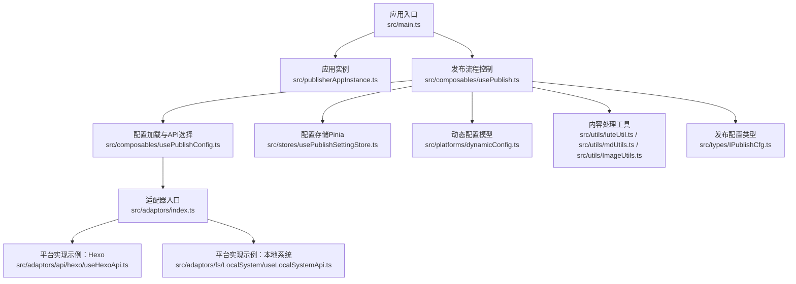
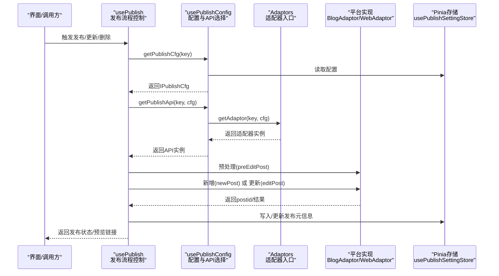
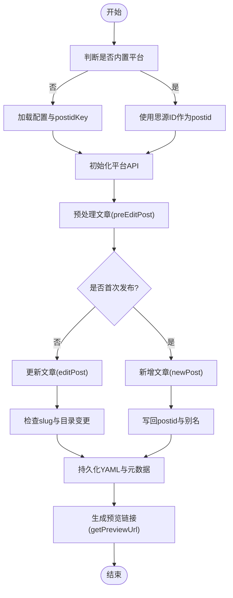
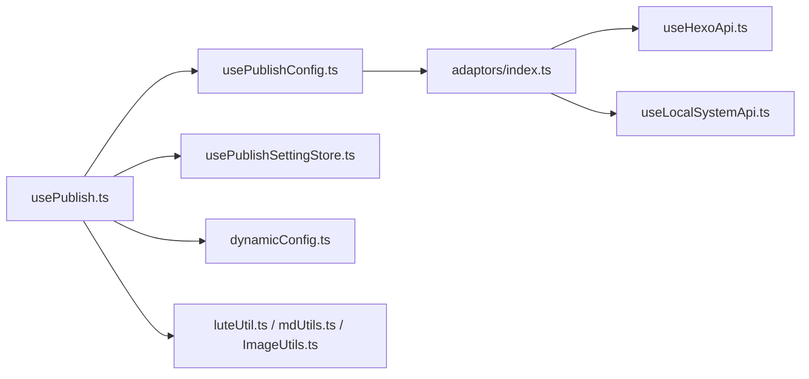

# 发布引擎

<cite>
**本文引用的文件**
- [README_zh_CN.md](file://README_zh_CN.md)
- [src/main.ts](file://src/main.ts)
- [src/publisherAppInstance.ts](file://src/publisherAppInstance.ts)
- [src/composables/usePublish.ts](file://src/composables/usePublish.ts)
- [src/composables/usePublishConfig.ts](file://src/composables/usePublishConfig.ts)
- [src/platforms/dynamicConfig.ts](file://src/platforms/dynamicConfig.ts)
- [src/adaptors/index.ts](file://src/adaptors/index.ts)
- [src/adaptors/api/hexo/useHexoApi.ts](file://src/adaptors/api/hexo/useHexoApi.ts)
- [src/adaptors/fs/LocalSystem/useLocalSystemApi.ts](file://src/adaptors/fs/LocalSystem/useLocalSystemApi.ts)
- [src/utils/mdUtils.ts](file://src/utils/mdUtils.ts)
- [src/utils/ImageUtils.ts](file://src/utils/ImageUtils.ts)
- [src/utils/luteUtil.ts](file://src/utils/luteUtil.ts)
- [src/stores/usePublishSettingStore.ts](file://src/stores/usePublishSettingStore.ts)
- [src/types/IPublishCfg.ts](file://src/types/IPublishCfg.ts)
- [src/models/publishPreferenceCfg.ts](file://src/models/publishPreferenceCfg.ts)
</cite>

## 目录
1. [简介](#简介)
2. [项目结构](#项目结构)
3. [核心组件](#核心组件)
4. [架构总览](#架构总览)
5. [详细组件分析](#详细组件分析)
6. [依赖关系分析](#依赖关系分析)
7. [性能考量](#性能考量)
8. [故障排除指南](#故障排除指南)
9. [结论](#结论)
10. [附录](#附录)

## 简介
本发布引擎面向“思源笔记”生态，提供统一的跨平台发布能力，支持多种博客平台、静态站点生成平台（如 Hexo、Hugo、Astro 等）、文件系统、以及部分网站的网页发布适配器。其核心目标是：
- 将思源笔记中的 Markdown 文档解析并转换为目标平台所需的格式
- 统一的平台适配层，屏蔽不同平台差异
- 动态配置管理与缓存，支持运行时灵活切换平台
- 提供发布、更新、删除、预览链接生成等完整生命周期管理
- 提供内容处理管道（Markdown → HTML、图片处理、链接处理、元数据提取）

## 项目结构
发布引擎采用模块化组织，前端入口负责挂载 Vue 应用；核心发布流程由组合式函数驱动；平台适配器集中于 adaptors；配置与状态管理通过 Pinia Store 与动态配置系统协同；工具类提供 Markdown、图片、渲染等辅助能力。

图示来源
- [src/main.ts:1-22](file://src/main.ts#L1-L22)
- [src/publisherAppInstance.ts:1-50](file://src/publisherAppInstance.ts#L1-L50)
- [src/composables/usePublish.ts:1-560](file://src/composables/usePublish.ts#L1-L560)
- [src/composables/usePublishConfig.ts:1-99](file://src/composables/usePublishConfig.ts#L1-L99)
- [src/adaptors/index.ts:1-573](file://src/adaptors/index.ts#L1-L573)
- [src/adaptors/api/hexo/useHexoApi.ts:1-102](file://src/adaptors/api/hexo/useHexoApi.ts#L1-L102)
- [src/adaptors/fs/LocalSystem/useLocalSystemApi.ts:1-65](file://src/adaptors/fs/LocalSystem/useLocalSystemApi.ts#L1-L65)
- [src/stores/usePublishSettingStore.ts:1-95](file://src/stores/usePublishSettingStore.ts#L1-L95)
- [src/platforms/dynamicConfig.ts:1-534](file://src/platforms/dynamicConfig.ts#L1-L534)
- [src/utils/luteUtil.ts:1-92](file://src/utils/luteUtil.ts#L1-L92)
- [src/utils/mdUtils.ts:1-161](file://src/utils/mdUtils.ts#L1-L161)
- [src/utils/ImageUtils.ts:1-209](file://src/utils/ImageUtils.ts#L1-L209)
- [src/types/IPublishCfg.ts:1-50](file://src/types/IPublishCfg.ts#L1-L50)

章节来源
- [README_zh_CN.md:1-100](file://README_zh_CN.md#L1-L100)
- [src/main.ts:1-22](file://src/main.ts#L1-L22)

## 核心组件
- 发布流程控制：统一的单篇发布、删除、强制删除、预览链接生成与初始化方法，贯穿“预处理 → 新增/更新 → 属性与元数据持久化 → 预览链接生成”的全流程。
- 配置加载与API选择：按平台 key 动态加载配置与适配器，支持运行时切换平台与配置。
- 平台适配器：集中于 adaptors，按平台类型与子类型分发到具体实现，统一对外暴露 BlogAdaptor/WebAdaptor 接口。
- 动态配置系统：定义平台类型、子类型、授权模式、平台键规则、YAML/文章ID键生成等，支撑平台注册与检索。
- 配置存储：基于 Pinia 的异步存储，提供配置读取、更新、缓存与键存在性检查。
- 内容处理工具：Markdown 渲染（Lute）、Markdown 辅助替换、图片正则匹配与提取、HTML 中图片提取等。

章节来源
- [src/composables/usePublish.ts:1-560](file://src/composables/usePublish.ts#L1-L560)
- [src/composables/usePublishConfig.ts:1-99](file://src/composables/usePublishConfig.ts#L1-L99)
- [src/platforms/dynamicConfig.ts:1-534](file://src/platforms/dynamicConfig.ts#L1-L534)
- [src/stores/usePublishSettingStore.ts:1-95](file://src/stores/usePublishSettingStore.ts#L1-L95)
- [src/utils/luteUtil.ts:1-92](file://src/utils/luteUtil.ts#L1-L92)
- [src/utils/mdUtils.ts:1-161](file://src/utils/mdUtils.ts#L1-L161)
- [src/utils/ImageUtils.ts:1-209](file://src/utils/ImageUtils.ts#L1-L209)

## 架构总览
发布引擎采用“配置驱动 + 适配器模式”，核心流程如下：

图示来源
- [src/composables/usePublish.ts:70-212](file://src/composables/usePublish.ts#L70-L212)
- [src/composables/usePublishConfig.ts:36-78](file://src/composables/usePublishConfig.ts#L36-L78)
- [src/adaptors/index.ts:56-467](file://src/adaptors/index.ts#L56-L467)
- [src/stores/usePublishSettingStore.ts:38-59](file://src/stores/usePublishSettingStore.ts#L38-L59)

## 详细组件分析

### 发布流程控制（usePublish）
- 单篇发布：根据是否已发布决定新增或更新；在新增后写回 postid 与别名；在更新后处理 slug 与目录变更带来的 postid 变更；最后持久化 YAML 与元数据。
- 删除与强制删除：删除远端文章并同步清理本地发布信息；强制删除仅清理发布信息与属性。
- 初始化：支持从思源笔记或远端平台初始化文章，合并标题、链接、正文与元数据；生成预览链接。
- 预览链接：优先从平台 API 获取，若为相对路径则拼接站点 home 地址。

图示来源
- [src/composables/usePublish.ts:70-212](file://src/composables/usePublish.ts#L70-L212)
- [src/composables/usePublish.ts:333-343](file://src/composables/usePublish.ts#L333-L343)

章节来源
- [src/composables/usePublish.ts:1-560](file://src/composables/usePublish.ts#L1-L560)

### 配置加载与API选择（usePublishConfig）
- getPublishCfg：从存储读取配置，解析动态配置 JSON，按 key 返回 IPublishCfg（包含 setting、dynamicConfigArray、cfg、dynCfg）。
- getPublishApi：通过 adaptors 获取适配器并构造统一 API 实例，供发布流程调用。

章节来源
- [src/composables/usePublishConfig.ts:1-99](file://src/composables/usePublishConfig.ts#L1-L99)
- [src/types/IPublishCfg.ts:1-50](file://src/types/IPublishCfg.ts#L1-L50)

### 平台适配器入口（Adaptors）
- 按平台 key 解析子平台类型，分发到对应 useXxxApi，返回 cfg、yamlAdaptor、blogApi/webApi。
- 支持常见平台（如 Hexo、Hugo、Astro、GitHub/GitLab 生态、Metaweblog、WordPress、自定义网站等）与文件系统适配器。

章节来源
- [src/adaptors/index.ts:1-573](file://src/adaptors/index.ts#L1-L573)

### 平台适配器示例：Hexo
- useHexoApi：从设置或环境变量加载配置，设置标签/分类/知识空间等特性，创建 HexoYamlConverterAdaptor 与 HexoApiAdaptor。

章节来源
- [src/adaptors/api/hexo/useHexoApi.ts:1-102](file://src/adaptors/api/hexo/useHexoApi.ts#L1-L102)

### 平台适配器示例：本地系统（Fs）
- useLocalSystemApi：加载 LocalSystemConfig，启用标签/分类与图床支持，返回 LocalSystemApiAdaptor 与 YAML 适配器。

章节来源
- [src/adaptors/fs/LocalSystem/useLocalSystemApi.ts:1-65](file://src/adaptors/fs/LocalSystem/useLocalSystemApi.ts#L1-L65)

### 动态配置系统（dynamicConfig）
- 定义平台类型、子类型、授权模式、平台键规则、postidKey/YAML 键生成、平台检索与替换等。
- 提供 getSubPlatformTypeByKey、getNewPlatformKey、getDynPostidKey/getDynYamlKey 等工具方法。

章节来源
- [src/platforms/dynamicConfig.ts:1-534](file://src/platforms/dynamicConfig.ts#L1-L534)

### 配置存储（usePublishSettingStore）
- 基于异步存储封装，提供 getSetting/updateSetting/checkKeyExists/deleteKey，支持缓存与远程数据加载。

章节来源
- [src/stores/usePublishSettingStore.ts:1-95](file://src/stores/usePublishSettingStore.ts#L1-L95)

### 内容处理工具
- Lute 渲染：将 Markdown 转换为 HTML，自定义渲染器处理行内/块级数学公式。
- Markdown 工具：安全替换标记、生成人类可读文件名等。
- 图片工具：生成匹配 img 标签/Markdown 图片的正则，提取图片 URL，判断 HTML 是否包含图片。

章节来源
- [src/utils/luteUtil.ts:1-92](file://src/utils/luteUtil.ts#L1-L92)
- [src/utils/mdUtils.ts:1-161](file://src/utils/mdUtils.ts#L1-L161)
- [src/utils/ImageUtils.ts:1-209](file://src/utils/ImageUtils.ts#L1-L209)

### 发布偏好设置（publishPreferenceCfg）
- 扩展 PreferenceConfig，包含 AI 体验开关、菜单显示控制、别名修改权限等偏好项。

章节来源
- [src/models/publishPreferenceCfg.ts:1-101](file://src/models/publishPreferenceCfg.ts#L1-L101)

## 依赖关系分析
- 组件耦合与内聚
  - usePublish 与 usePublishConfig 强耦合，前者依赖后者提供的配置与 API 实例。
  - usePublishConfig 与 adaptors 弱耦合，通过 key 解析平台实现。
  - 平台适配器内部依赖 PublisherAppInstance（网络、XMLRPC 工具等）与配置对象。
- 外部依赖
  - zhi-blog-api：提供 BlogAdaptor、WebAdaptor、YamlConvertAdaptor、BlogConfig 等抽象。
  - zhi-common：提供字符串、对象、JSON 工具。
  - element-plus：UI 消息提示。
- 潜在循环依赖
  - 适配器与配置加载相互独立，未见循环依赖迹象。

图示来源
- [src/composables/usePublish.ts:1-560](file://src/composables/usePublish.ts#L1-L560)
- [src/composables/usePublishConfig.ts:1-99](file://src/composables/usePublishConfig.ts#L1-L99)
- [src/adaptors/index.ts:1-573](file://src/adaptors/index.ts#L1-L573)
- [src/adaptors/api/hexo/useHexoApi.ts:1-102](file://src/adaptors/api/hexo/useHexoApi.ts#L1-L102)
- [src/adaptors/fs/LocalSystem/useLocalSystemApi.ts:1-65](file://src/adaptors/fs/LocalSystem/useLocalSystemApi.ts#L1-L65)
- [src/stores/usePublishSettingStore.ts:1-95](file://src/stores/usePublishSettingStore.ts#L1-L95)
- [src/platforms/dynamicConfig.ts:1-534](file://src/platforms/dynamicConfig.ts#L1-L534)
- [src/utils/luteUtil.ts:1-92](file://src/utils/luteUtil.ts#L1-L92)
- [src/utils/mdUtils.ts:1-161](file://src/utils/mdUtils.ts#L1-L161)
- [src/utils/ImageUtils.ts:1-209](file://src/utils/ImageUtils.ts#L1-L209)

## 性能考量
- 配置缓存
  - usePublishSettingStore 对配置进行缓存，避免频繁读取存储；更新时同步刷新缓存。
- 并发与批量
  - 当前单篇发布流程为串行，未见显式批量并发处理；如需提升吞吐，可在上层引入任务队列或并发限流。
- 重试机制
  - 未发现内置重试逻辑；可通过外层包装在失败时进行指数退避重试。
- 渲染与替换
  - Lute 渲染与正则替换为 CPU 密集操作，建议对大文档分段处理或延迟执行。
- 图片处理
  - 图片正则匹配与 URL 提取为 O(n) 遍历，注意避免在超大 HTML 上重复扫描。

[本节为通用指导，无需列出章节来源]

## 故障排除指南
- 配置错误（posidKey 为空）
  - 现象：发布/删除时报错“配置错误，posidKey 不能为空，请检查配置”
  - 处理：在平台设置中补齐 posidKey；或通过 usePublishConfig 自动初始化。
- 未找到 postid
  - 现象：删除时提示“未找到postid，无法删除，请手动在平台删除”
  - 处理：确认文章已在目标平台发布；或使用强制删除清理本地发布信息。
- 目录变更导致 postid 变更
  - 现象：更新后提示“文章目录已更改，发布信息已更新”
  - 处理：系统自动更新配置中的 postid；如需保留别名，确保不覆盖 wp_slug。
- 预览链接为空或相对路径
  - 现象：预览链接拼接异常
  - 处理：确保 cfg.home 正确；或平台返回绝对 URL 时直接使用。
- YAML 未保存或适配器缺失
  - 现象：YAML 初始化/转换异常
  - 处理：为支持 YAML 的平台提供适配器；或在无适配器场景下保持默认行为。

章节来源
- [src/composables/usePublish.ts:195-203](file://src/composables/usePublish.ts#L195-L203)
- [src/composables/usePublish.ts:226-273](file://src/composables/usePublish.ts#L226-L273)
- [src/composables/usePublish.ts:158-167](file://src/composables/usePublish.ts#L158-L167)
- [src/composables/usePublish.ts:333-343](file://src/composables/usePublish.ts#L333-L343)
- [src/composables/usePublish.ts:396-425](file://src/composables/usePublish.ts#L396-L425)

## 结论
发布引擎通过“配置驱动 + 适配器模式”实现了对多平台的统一接入，具备完善的发布生命周期管理与动态配置能力。结合内容处理工具链，能够满足从 Markdown 到多平台格式的转换需求。未来可在并发与重试方面进一步增强，以提升大规模发布的稳定性与效率。

[本节为总结性内容，无需列出章节来源]

## 附录

### 使用示例（步骤说明）
- 单篇发布
  - 选择平台 key，准备 IPublishCfg，调用 doSinglePublish，等待返回状态与预览链接。
- 删除文章
  - 调用 doSingleDelete，若远端删除成功则同步清理本地发布信息。
- 强制删除
  - 调用 doForceSingleDelete，仅清理本地发布信息与属性。
- 初始化文章
  - 选择 MethodEnum，调用 initPublishMethods.doInitSinglePage，合并标题、链接、正文与元数据。

章节来源
- [src/composables/usePublish.ts:70-212](file://src/composables/usePublish.ts#L70-L212)
- [src/composables/usePublish.ts:221-280](file://src/composables/usePublish.ts#L221-L280)
- [src/composables/usePublish.ts:432-495](file://src/composables/usePublish.ts#L432-L495)