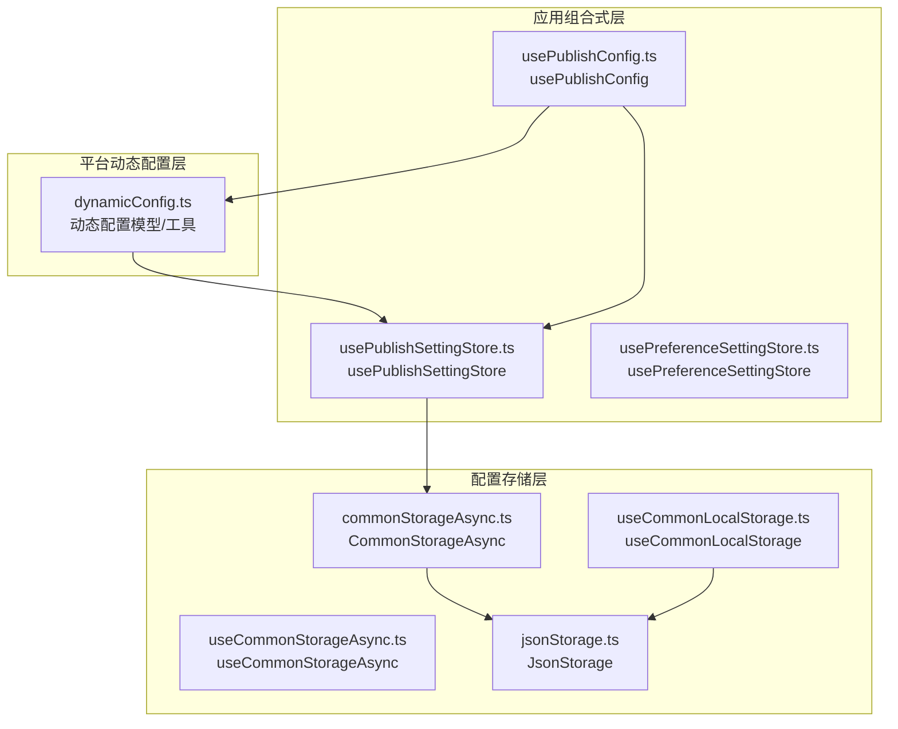
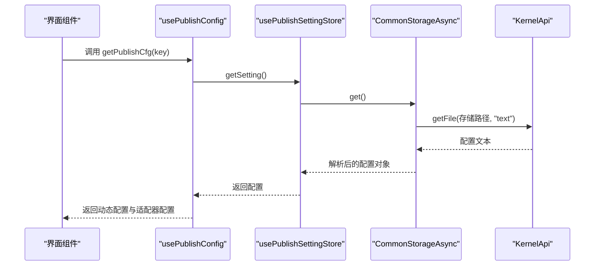
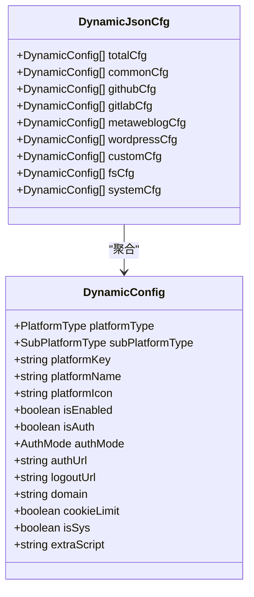
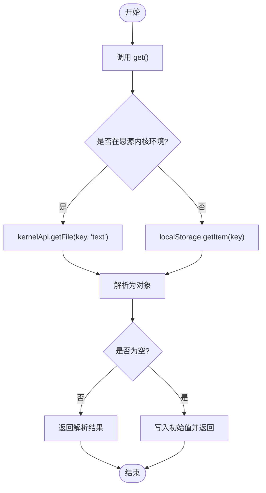
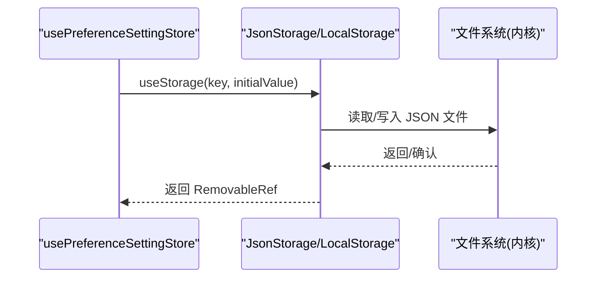
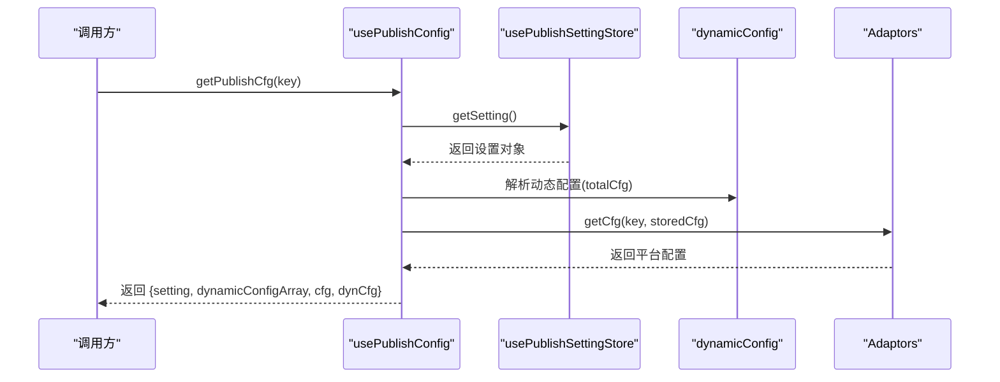
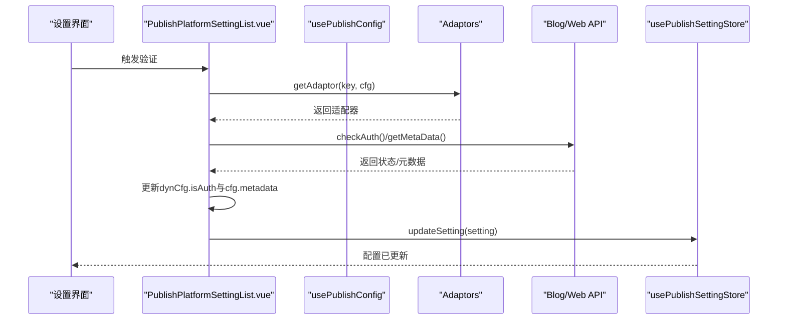
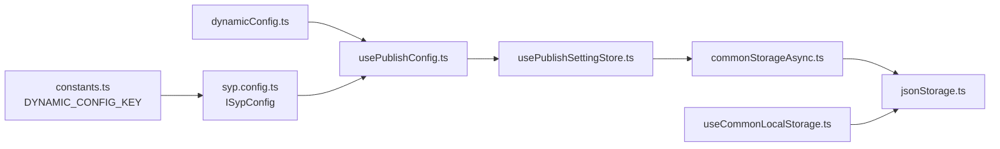

# 发布配置管理

<cite>
**本文引用的文件**
- [dynamicConfig.ts](file://src/platforms/dynamicConfig.ts)
- [usePublishSettingStore.ts](file://src/stores/usePublishSettingStore.ts)
- [usePreferenceSettingStore.ts](file://src/stores/usePreferenceSettingStore.ts)
- [useCommonStorageAsync.ts](file://src/stores/common/useCommonStorageAsync.ts)
- [commonStorageAsync.ts](file://src/stores/common/commonStorageAsync.ts)
- [useCommonLocalStorage.ts](file://src/stores/common/useCommonLocalStorage.ts)
- [jsonStorage.ts](file://src/stores/common/jsonStorage.ts)
- [syp.config.ts](file://syp.config.ts)
- [constants.ts](file://src/utils/constants.ts)
- [usePublishConfig.ts](file://src/composables/usePublishConfig.ts)
- [PublishPlatformSettingList.vue](file://src/components/set/publish/platform/PublishPlatformSettingList.vue)
- [CommonBlogSetting.vue](file://src/components/set/publish/singleplatform/base/CommonBlogSetting.vue)
- [config.ts](file://siyuan/store/config.ts)
- [preferenceConfigManager.ts](file://siyuan/store/preferenceConfigManager.ts)
</cite>

## 目录
1. [简介](#简介)
2. [项目结构](#项目结构)
3. [核心组件](#核心组件)
4. [架构总览](#架构总览)
5. [详细组件分析](#详细组件分析)
6. [依赖关系分析](#依赖关系分析)
7. [性能考量](#性能考量)
8. [故障排查指南](#故障排查指南)
9. [结论](#结论)
10. [附录](#附录)

## 简介
本技术文档围绕“发布配置管理系统”展开，聚焦以下主题：
- 动态配置加载机制：配置文件解析、配置验证、配置缓存策略
- 配置存储与持久化：本地存储、配置同步、版本管理
- 配置继承与覆盖规则：全局配置、平台特定配置、用户自定义配置的优先级处理
- 配置热更新与变更监听
- 最佳实践：配置备份、迁移策略、故障恢复
- 配置调试与问题排查方法

## 项目结构
发布配置管理涉及三层：
- 平台动态配置层：定义平台类型、子类型、动态配置模型与工具函数
- 配置存储层：统一异步存储与本地存储适配，支持在思源内核与浏览器环境切换
- 应用组合式层：对外暴露读取、更新、验证配置的组合式 API

图表来源
- [dynamicConfig.ts:13-534](file://src/platforms/dynamicConfig.ts#L13-L534)
- [usePublishSettingStore.ts:21-94](file://src/stores/usePublishSettingStore.ts#L21-L94)
- [useCommonStorageAsync.ts:22-84](file://src/stores/common/useCommonStorageAsync.ts#L22-L84)
- [commonStorageAsync.ts:24-117](file://src/stores/common/commonStorageAsync.ts#L24-L117)
- [useCommonLocalStorage.ts:27-57](file://src/stores/common/useCommonLocalStorage.ts#L27-L57)
- [jsonStorage.ts:23-110](file://src/stores/common/jsonStorage.ts#L23-L110)
- [usePublishConfig.ts:26-99](file://src/composables/usePublishConfig.ts#L26-L99)

章节来源
- [dynamicConfig.ts:13-534](file://src/platforms/dynamicConfig.ts#L13-L534)
- [usePublishSettingStore.ts:21-94](file://src/stores/usePublishSettingStore.ts#L21-L94)
- [useCommonStorageAsync.ts:22-84](file://src/stores/common/useCommonStorageAsync.ts#L22-L84)
- [commonStorageAsync.ts:24-117](file://src/stores/common/commonStorageAsync.ts#L24-L117)
- [useCommonLocalStorage.ts:27-57](file://src/stores/common/useCommonLocalStorage.ts#L27-L57)
- [jsonStorage.ts:23-110](file://src/stores/common/jsonStorage.ts#L23-L110)
- [usePublishConfig.ts:26-99](file://src/composables/usePublishConfig.ts#L26-L99)

## 核心组件
- 动态配置模型与工具：提供平台类型、子类型、动态配置对象、键规则、查找与替换等能力
- 发布设置存储：基于统一异步存储封装，提供懒加载、缓存、更新、键检测与删除
- 偏好设置存储：基于本地存储封装，支持在思源内核与浏览器间自动切换适配器
- 配置组合式 API：对外提供获取发布配置与发布 API 的能力，并整合动态配置

章节来源
- [dynamicConfig.ts:13-534](file://src/platforms/dynamicConfig.ts#L13-L534)
- [usePublishSettingStore.ts:21-94](file://src/stores/usePublishSettingStore.ts#L21-L94)
- [usePreferenceSettingStore.ts:21-90](file://src/stores/usePreferenceSettingStore.ts#L21-L90)
- [useCommonStorageAsync.ts:22-84](file://src/stores/common/useCommonStorageAsync.ts#L22-L84)
- [useCommonLocalStorage.ts:27-57](file://src/stores/common/useCommonLocalStorage.ts#L27-L57)
- [usePublishConfig.ts:26-99](file://src/composables/usePublishConfig.ts#L26-L99)

## 架构总览
发布配置管理采用“模型-存储-组合式 API”的分层设计：
- 动态配置层：以枚举与工具函数组织平台类型与键规则，确保跨平台一致性
- 存储层：统一抽象异步存储与本地存储，自动识别运行环境（思源内核 vs 浏览器）
- 组合式层：对外暴露简洁 API，负责配置解析、缓存与更新

图表来源
- [usePublishConfig.ts:36-64](file://src/composables/usePublishConfig.ts#L36-L64)
- [usePublishSettingStore.ts:38-48](file://src/stores/usePublishSettingStore.ts#L38-L48)
- [commonStorageAsync.ts:51-79](file://src/stores/common/commonStorageAsync.ts#L51-L79)
- [config.ts:42-45](file://siyuan/store/config.ts#L42-L45)

## 详细组件分析

### 动态配置模型与工具
- 动态配置类：封装平台类型、子类型、授权模式、启用状态、域名、Cookie限制、图标等字段
- 平台类型与子类型枚举：覆盖通用博客、Metaweblog、WordPress、GitHub/GitLab生态、自定义平台、文件系统、系统平台等
- 工具函数：
  - 按类型聚合：将动态配置按类型拆分为多个集合，便于使用
  - 键规则：平台 key 生成、子类型解析、postid/yaml key 生成与反向解析
  - 查找与替换：按 key 查找、替换、删除平台配置

图表来源
- [dynamicConfig.ts:13-113](file://src/platforms/dynamicConfig.ts#L13-L113)
- [dynamicConfig.ts:243-253](file://src/platforms/dynamicConfig.ts#L243-L253)

章节来源
- [dynamicConfig.ts:13-534](file://src/platforms/dynamicConfig.ts#L13-L534)

### 发布设置存储（异步）
- 统一异步存储封装：根据运行环境选择内核 API 或浏览器本地存储
- 序列化策略：根据初始值类型自动推断序列化器，首次访问时写入默认值
- 缓存策略：在内存中缓存最近一次读取结果，减少重复 IO
- 更新策略：更新时写入持久化存储并合并到缓存

图表来源
- [useCommonStorageAsync.ts:45-56](file://src/stores/common/useCommonStorageAsync.ts#L45-L56)
- [commonStorageAsync.ts:51-79](file://src/stores/common/commonStorageAsync.ts#L51-L79)

章节来源
- [usePublishSettingStore.ts:21-94](file://src/stores/usePublishSettingStore.ts#L21-L94)
- [useCommonStorageAsync.ts:22-84](file://src/stores/common/useCommonStorageAsync.ts#L22-L84)
- [commonStorageAsync.ts:24-117](file://src/stores/common/commonStorageAsync.ts#L24-L117)

### 偏好设置存储（本地）
- 本地存储适配：在思源内核中使用 JSON 文件存储，在浏览器中使用 localStorage
- 自动切换：根据设备检测自动选择适配器
- 默认值与只读封装：提供只读引用与默认值填充逻辑

图表来源
- [usePreferenceSettingStore.ts:34-67](file://src/stores/usePreferenceSettingStore.ts#L34-L67)
- [useCommonLocalStorage.ts:43-55](file://src/stores/common/useCommonLocalStorage.ts#L43-L55)
- [jsonStorage.ts:59-75](file://src/stores/common/jsonStorage.ts#L59-L75)

章节来源
- [usePreferenceSettingStore.ts:21-90](file://src/stores/usePreferenceSettingStore.ts#L21-L90)
- [useCommonLocalStorage.ts:27-57](file://src/stores/common/useCommonLocalStorage.ts#L27-L57)
- [jsonStorage.ts:23-110](file://src/stores/common/jsonStorage.ts#L23-L110)

### 配置组合式 API
- 获取发布配置：读取设置、解析动态配置、合并平台配置
- 获取发布 API：根据平台键与配置获取适配器并包装为统一 API

图表来源
- [usePublishConfig.ts:36-64](file://src/composables/usePublishConfig.ts#L36-L64)
- [dynamicConfig.ts:41-42](file://src/platforms/dynamicConfig.ts#L41-L42)
- [syp.config.ts:46-49](file://syp.config.ts#L46-L49)

章节来源
- [usePublishConfig.ts:26-99](file://src/composables/usePublishConfig.ts#L26-L99)
- [syp.config.ts:28-51](file://syp.config.ts#L28-L51)

### 配置验证与变更监听
- 平台配置验证：通过适配器执行授权校验，成功后更新元数据与状态
- 变更监听：更新配置后触发存储写入，前端可通过响应式引用感知变化
- 失败处理：对过期或失效的认证进行提示与登出引导

图表来源
- [PublishPlatformSettingList.vue:319-351](file://src/components/set/publish/platform/PublishPlatformSettingList.vue#L319-L351)
- [CommonBlogSetting.vue:116-172](file://src/components/set/publish/singleplatform/base/CommonBlogSetting.vue#L116-L172)
- [usePublishConfig.ts:73-78](file://src/composables/usePublishConfig.ts#L73-L78)
- [usePublishSettingStore.ts:55-59](file://src/stores/usePublishSettingStore.ts#L55-L59)

章节来源
- [PublishPlatformSettingList.vue:319-351](file://src/components/set/publish/platform/PublishPlatformSettingList.vue#L319-L351)
- [CommonBlogSetting.vue:116-201](file://src/components/set/publish/singleplatform/base/CommonBlogSetting.vue#L116-L201)
- [usePublishConfig.ts:73-78](file://src/composables/usePublishConfig.ts#L73-L78)
- [usePublishSettingStore.ts:55-59](file://src/stores/usePublishSettingStore.ts#L55-L59)

## 依赖关系分析
- 动态配置依赖常量键：动态配置键由常量统一定义，保证全系统唯一性
- 存储层依赖设备检测：根据运行环境自动选择适配器
- 组合式 API 依赖存储层与动态配置层：读取设置并解析动态配置

图表来源
- [constants.ts](file://src/utils/constants.ts#L19)
- [syp.config.ts:28-49](file://syp.config.ts#L28-L49)
- [dynamicConfig.ts:13-534](file://src/platforms/dynamicConfig.ts#L13-L534)
- [usePublishConfig.ts:26-99](file://src/composables/usePublishConfig.ts#L26-L99)
- [usePublishSettingStore.ts:21-94](file://src/stores/usePublishSettingStore.ts#L21-L94)
- [commonStorageAsync.ts:24-117](file://src/stores/common/commonStorageAsync.ts#L24-L117)
- [jsonStorage.ts:23-110](file://src/stores/common/jsonStorage.ts#L23-L110)
- [useCommonLocalStorage.ts:27-57](file://src/stores/common/useCommonLocalStorage.ts#L27-L57)

章节来源
- [constants.ts](file://src/utils/constants.ts#L19)
- [syp.config.ts:28-51](file://syp.config.ts#L28-L51)
- [dynamicConfig.ts:13-534](file://src/platforms/dynamicConfig.ts#L13-L534)
- [usePublishConfig.ts:26-99](file://src/composables/usePublishConfig.ts#L26-L99)
- [usePublishSettingStore.ts:21-94](file://src/stores/usePublishSettingStore.ts#L21-L94)
- [commonStorageAsync.ts:24-117](file://src/stores/common/commonStorageAsync.ts#L24-L117)
- [jsonStorage.ts:23-110](file://src/stores/common/jsonStorage.ts#L23-L110)
- [useCommonLocalStorage.ts:27-57](file://src/stores/common/useCommonLocalStorage.ts#L27-L57)

## 性能考量
- 缓存策略：设置存储在内存中缓存最近一次读取结果，避免重复 IO
- 序列化优化：根据初始值类型自动推断序列化器，减少不必要的转换
- 环境适配：在思源内核中使用内核 API，避免浏览器兼容性问题；在浏览器中使用 localStorage，降低开销
- 懒加载：首次访问才初始化默认值并写入存储，减少启动时延

## 故障排查指南
- 配置无法加载
  - 检查存储路径与键是否正确
  - 在思源内核环境中确认内核 API 可用
  - 参考日志定位异常
- 配置验证失败
  - 检查平台授权状态与元数据
  - 若出现过期，按提示进行登出并重新授权
- 配置未生效
  - 确认更新流程已完成存储写入
  - 检查响应式引用是否已刷新

章节来源
- [usePublishSettingStore.ts:38-48](file://src/stores/usePublishSettingStore.ts#L38-L48)
- [PublishPlatformSettingList.vue:337-351](file://src/components/set/publish/platform/PublishPlatformSettingList.vue#L337-L351)
- [CommonBlogSetting.vue:116-172](file://src/components/set/publish/singleplatform/base/CommonBlogSetting.vue#L116-L172)

## 结论
本系统通过清晰的分层设计与统一的存储适配，实现了跨平台、可扩展、可维护的发布配置管理。动态配置模型确保了平台类型的统一与可演进，异步存储与本地存储适配保障了在不同运行环境下的稳定性，组合式 API 则提供了简洁一致的使用体验。

## 附录

### 配置继承与覆盖规则
- 全局配置：来自设置存储的默认配置
- 平台特定配置：按平台键存储的独立配置
- 用户自定义配置：在设置界面中更新后写入存储
- 优先级处理：用户自定义配置覆盖平台特定配置；平台特定配置覆盖全局配置；若某层级缺失，则回退到上一层级

章节来源
- [syp.config.ts:28-51](file://syp.config.ts#L28-L51)
- [usePublishSettingStore.ts:55-59](file://src/stores/usePublishSettingStore.ts#L55-L59)
- [usePublishConfig.ts:36-64](file://src/composables/usePublishConfig.ts#L36-L64)

### 配置热更新与变更监听
- 热更新：更新设置后立即写入存储并合并到内存缓存
- 变更监听：通过响应式引用与存储适配器实现变更通知

章节来源
- [usePublishSettingStore.ts:55-59](file://src/stores/usePublishSettingStore.ts#L55-L59)
- [useCommonStorageAsync.ts:58-61](file://src/stores/common/useCommonStorageAsync.ts#L58-L61)

### 配置备份与迁移
- 备份：建议定期导出存储文件或通过 UI 导出配置
- 迁移：新版本引入的键或结构变化时，遵循存储层的初始化与写入逻辑

章节来源
- [useCommonStorageAsync.ts:50-55](file://src/stores/common/useCommonStorageAsync.ts#L50-L55)
- [commonStorageAsync.ts:98-113](file://src/stores/common/commonStorageAsync.ts#L98-L113)

### 配置调试与问题排查
- 日志记录：各层均包含日志输出，便于定位问题
- 错误处理：对异常进行捕获与提示，必要时引导用户登出并重新授权

章节来源
- [commonStorageAsync.ts:51-79](file://src/stores/common/commonStorageAsync.ts#L51-L79)
- [PublishPlatformSettingList.vue:337-351](file://src/components/set/publish/platform/PublishPlatformSettingList.vue#L337-L351)