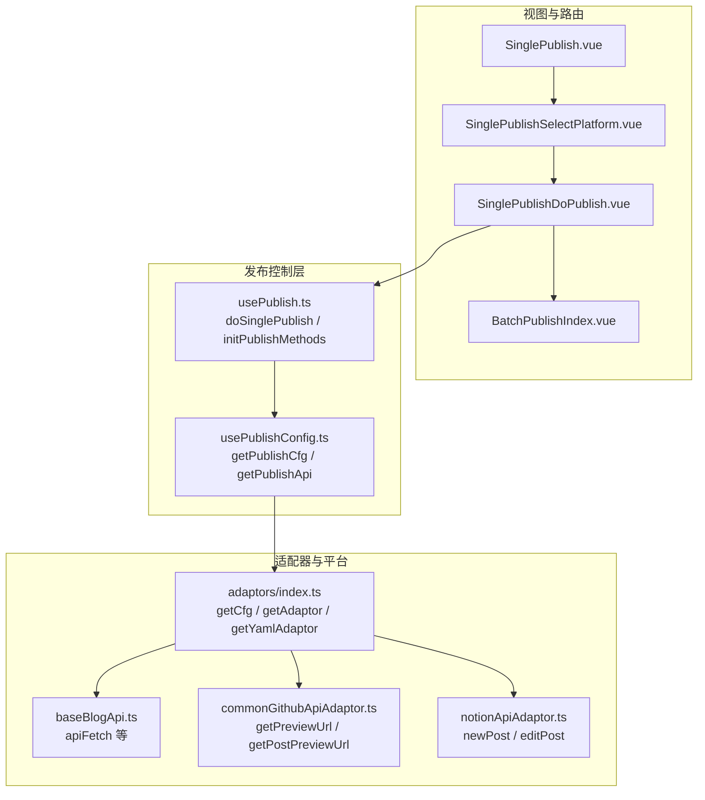
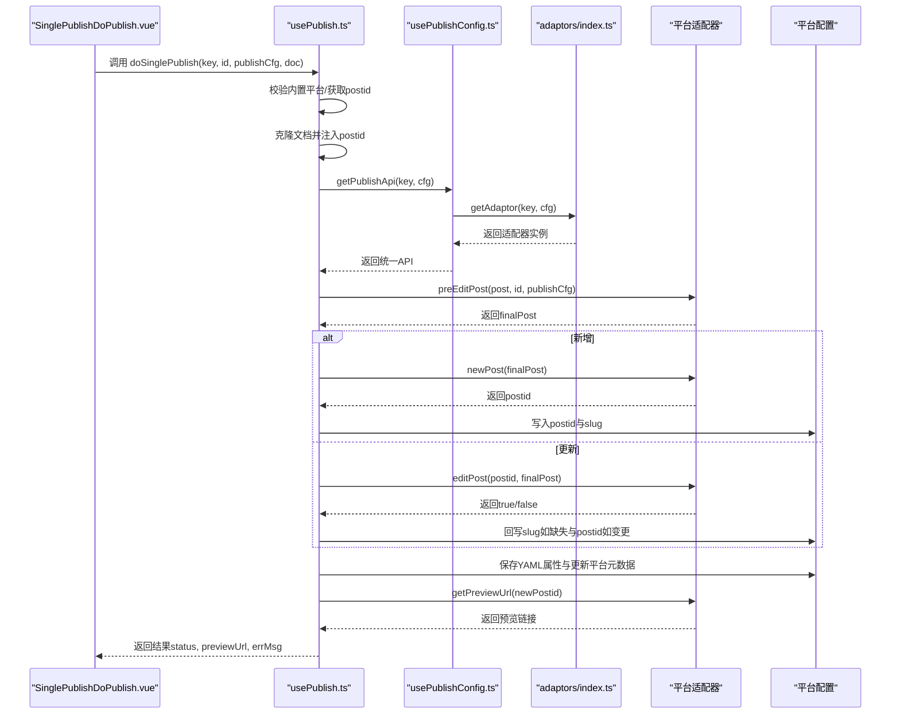
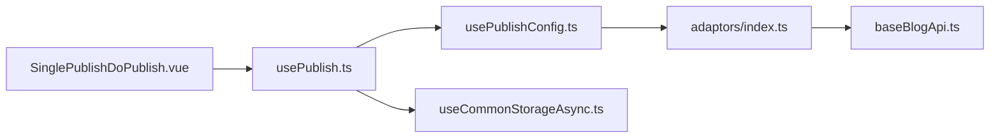

# 核心发布逻辑

<cite>
**本文档引用的文件**
- [usePublish.ts](file://src/composables/usePublish.ts)
- [usePublishConfig.ts](file://src/composables/usePublishConfig.ts)
- [adaptors/index.ts](file://src/adaptors/index.ts)
- [SinglePublishDoPublish.vue](file://src/components/publish/SinglePublishDoPublish.vue)
- [SinglePublishSelectPlatform.vue](file://src/components/publish/SinglePublishSelectPlatform.vue)
- [BatchPublishIndex.vue](file://src/components/publish/BatchPublishIndex.vue)
- [baseBlogApi.ts](file://src/adaptors/api/base/baseBlogApi.ts)
- [commonGithubApiAdaptor.ts](file://src/adaptors/api/base/github/commonGithubApiAdaptor.ts)
- [notionApiAdaptor.ts](file://src/adaptors/api/notion/notionApiAdaptor.ts)
- [baseExtendApi.ts](file://src/adaptors/base/baseExtendApi.ts)
- [SinglePublish.vue](file://src/pages/SinglePublish.vue)
- [useCommonStorageAsync.ts](file://src/stores/common/useCommonStorageAsync.ts)
</cite>

## 目录
1. [简介](#简介)
2. [项目结构](#项目结构)
3. [核心组件](#核心组件)
4. [架构总览](#架构总览)
5. [详细组件分析](#详细组件分析)
6. [依赖关系分析](#依赖关系分析)
7. [性能考量](#性能考量)
8. [故障排查指南](#故障排查指南)
9. [结论](#结论)
10. [附录](#附录)

## 简介
本文件聚焦“核心发布逻辑”，围绕 doSinglePublish 方法的完整执行流程进行深入技术解析，涵盖文档预处理、平台适配器初始化、新增文章发布、文章更新处理、属性保存与元数据同步、预览链接生成机制以及错误处理策略。同时提供调用发布 API 的示例路径、新增与更新两种模式的区别说明、性能优化建议与最佳实践。

## 项目结构
发布系统采用“组合式函数 + 适配器模式”的架构设计：
- 发布控制层：通过 usePublish 提供统一的发布入口与流程编排
- 配置与适配器层：通过 usePublishConfig 与 Adaptors 统一加载平台配置与适配器
- 平台适配层：各平台（博客 API、Web 站点、静态站点）实现各自的 newPost/editPost/getPreviewUrl 等能力
- 视图与路由层：SinglePublish 系列组件负责用户交互与调用发布流程

图表来源
- [SinglePublish.vue:10-22](file://src/pages/SinglePublish.vue#L10-L22)
- [SinglePublishSelectPlatform.vue:30-88](file://src/components/publish/SinglePublishSelectPlatform.vue#L30-L88)
- [SinglePublishDoPublish.vue:41-123](file://src/components/publish/SinglePublishDoPublish.vue#L41-L123)
- [BatchPublishIndex.vue:32-131](file://src/components/publish/BatchPublishIndex.vue#L32-L131)
- [usePublish.ts:70-212](file://src/composables/usePublish.ts#L70-L212)
- [usePublishConfig.ts:40-98](file://src/composables/usePublishConfig.ts#L40-L98)
- [adaptors/index.ts:56-573](file://src/adaptors/index.ts#L56-L573)
- [baseBlogApi.ts:93-119](file://src/adaptors/api/base/baseBlogApi.ts#L93-L119)
- [commonGithubApiAdaptor.ts:225-249](file://src/adaptors/api/base/github/commonGithubApiAdaptor.ts#L225-L249)
- [notionApiAdaptor.ts:45-74](file://src/adaptors/api/notion/notionApiAdaptor.ts#L45-L74)

章节来源
- [SinglePublish.vue:10-22](file://src/pages/SinglePublish.vue#L10-L22)
- [SinglePublishDoPublish.vue:41-123](file://src/components/publish/SinglePublishDoPublish.vue#L41-L123)
- [usePublish.ts:70-212](file://src/composables/usePublish.ts#L70-L212)
- [usePublishConfig.ts:40-98](file://src/composables/usePublishConfig.ts#L40-L98)
- [adaptors/index.ts:56-573](file://src/adaptors/index.ts#L56-L573)

## 核心组件
- doSinglePublish：统一的单篇发布入口，负责校验、初始化、预处理、新增/更新、属性与元数据保存、预览链接生成与错误处理
- initPublishMethods：提供 slug 初始化、平台属性初始化、单篇初始化（新增/更新）、批量合并/覆盖策略
- getPublishApi：根据平台 key 动态加载适配器与配置，封装为统一的 BlogAdaptor/WebAdaptor
- 平台适配器：实现具体平台的 newPost/editPost/getPreviewUrl 等能力，并在必要时处理 postid 变更与别名回写

章节来源
- [usePublish.ts:70-212](file://src/composables/usePublish.ts#L70-L212)
- [usePublish.ts:352-547](file://src/composables/usePublish.ts#L352-L547)
- [usePublishConfig.ts:73-78](file://src/composables/usePublishConfig.ts#L73-L78)
- [adaptors/index.ts:271-467](file://src/adaptors/index.ts#L271-L467)

## 架构总览
doSinglePublish 的执行路径如下：

图表来源
- [usePublish.ts:70-212](file://src/composables/usePublish.ts#L70-L212)
- [usePublishConfig.ts:73-78](file://src/composables/usePublishConfig.ts#L73-L78)
- [adaptors/index.ts:271-467](file://src/adaptors/index.ts#L271-L467)

## 详细组件分析

### doSinglePublish 方法详解
- 输入参数
  - key：平台标识
  - id：思源笔记文档 ID
  - publishCfg：包含 setting、cfg、dynCfg 的发布配置对象
  - doc：原始 Post 文档
- 关键步骤
  1) 校验与 postid 获取
     - 内置平台：直接使用 id 作为 postid
     - 自定义平台：从 setting 中按 cfg.posidKey 读取 postid；若为空则标记为新增
  2) 初始化与克隆
     - 克隆 doc，确保每次发布使用新副本
     - 将 postid 注入到 post.postid
  3) 适配器初始化
     - 通过 getPublishApi(key, cfg) 获取适配器实例
  4) 文档预处理
     - 调用 api.preEditPost 对 Post 进行平台化预处理（如 YAML 解析、摘要/标签/分类映射、Markdown/HTML 转换等）
  5) 新增或更新
     - 新增：调用 api.newPost(finalPost)，写入 postid 与 wp_slug 到 setting
     - 更新：调用 api.editPost(postid, finalPost)
       - 若平台返回新的 postid（如目录变更），则回写 setting 并提示
       - 若历史文章未生成 slug，回写 wp_slug；否则保持不变
  6) 属性与元数据保存
     - 内置平台：跳过属性保存
     - 自定义平台：写入 YAML 属性到块属性；更新平台元数据（标签、分类、模板）
  7) 预览链接生成
     - 通过 getPostPreviewUrl(api, id, cfg) 获取最新预览链接
  8) 错误处理
     - 捕获异常，记录国际化错误消息并通过内核推送错误提示，设置发布状态为失败

章节来源
- [usePublish.ts:70-212](file://src/composables/usePublish.ts#L70-L212)

### 发布前校验机制
- 内置平台检测
  - 通过 pre.systemCfg 判断 key 是否为内置平台，内置平台直接使用 id 作为 postid
- 配置验证
  - cfg.posidKey 必须存在，否则抛出配置错误
- postid 获取
  - 从 setting[id][posidKey] 读取；若为空则标记为新增
- 外链引用处理（扩展）
  - 在 baseExtendApi 中对“外链引用未发布”场景进行校验与提示，支持忽略策略

章节来源
- [usePublish.ts:83-97](file://src/composables/usePublish.ts#L83-L97)
- [baseExtendApi.ts:677-710](file://src/adaptors/base/baseExtendApi.ts#L677-L710)

### 新增与更新两种模式的区别
- 新增模式
  - 调用 api.newPost(finalPost)，返回 postid
  - 将 postid 与 wp_slug 写入 setting[id]
- 更新模式
  - 调用 api.editPost(postid, finalPost)
  - 若平台返回新的 postid（如目录变更），回写 setting 并提示
  - 若历史文章未生成 slug，回写 wp_slug；否则保持不变
- 特殊平台行为
  - Notion：editPost 实际通过删除旧页并新建页面实现，随后回写新的 postid

章节来源
- [usePublish.ts:120-171](file://src/composables/usePublish.ts#L120-L171)
- [notionApiAdaptor.ts:50-69](file://src/adaptors/api/notion/notionApiAdaptor.ts#L50-L69)

### 预览链接生成机制
- getPostPreviewUrl 流程
  - 从 setting 中读取最新 postid
  - 调用 api.getPreviewUrl(newPostid)
  - 若返回相对路径，拼接 cfg.home 作为绝对路径
- 平台适配器示例
  - GitHub：通过模板替换生成预览 URL
  - Telegraph：基于配置中的 previewUrl 模板渲染

章节来源
- [usePublish.ts:333-343](file://src/composables/usePublish.ts#L333-L343)
- [commonGithubApiAdaptor.ts:225-249](file://src/adaptors/api/base/github/commonGithubApiAdaptor.ts#L225-L249)
- [telegraphApiAdaptor.ts:288-298](file://src/adaptors/api/telegraph/telegraphApiAdaptor.ts#L288-L298)

### 错误处理策略
- doSinglePublish
  - 捕获异常，设置 errMsg，推送错误消息，发布状态置为失败
- 图片上传失败处理（扩展）
  - 在 baseExtendApi 中对特定错误进行忽略或提示，避免阻断整体发布流程
- 删除与强制删除
  - doSingleDelete：校验 postid，调用 api.deletePost，删除成功后清理 setting 与块属性
  - doForceSingleDelete：强制移除发布信息与属性，不调用平台 API

章节来源
- [usePublish.ts:195-203](file://src/composables/usePublish.ts#L195-L203)
- [baseExtendApi.ts:535-551](file://src/adaptors/base/baseExtendApi.ts#L535-L551)
- [usePublish.ts:221-331](file://src/composables/usePublish.ts#L221-L331)

### 调用发布 API 的示例路径
- 单篇发布入口
  - SinglePublishDoPublish.vue.handlePublish：遍历系统内置平台与目标平台，逐个调用 doSinglePublish
  - 调用路径：SinglePublishDoPublish.vue -> usePublish.doSinglePublish
- 批量发布入口
  - BatchPublishIndex.vue.handlePublish：根据选择的平台列表循环发布，自定义平台会先通过 initPublishMethods.assignInitAttrs 初始化属性
- 平台适配器加载
  - usePublishConfig.getPublishApi -> adaptors.getAdaptor -> adaptors.index.ts

章节来源
- [SinglePublishDoPublish.vue:104-123](file://src/components/publish/SinglePublishDoPublish.vue#L104-L123)
- [BatchPublishIndex.vue:120-131](file://src/components/publish/BatchPublishIndex.vue#L120-L131)
- [usePublishConfig.ts:73-78](file://src/composables/usePublishConfig.ts#L73-L78)
- [adaptors/index.ts:271-467](file://src/adaptors/index.ts#L271-L467)

### 平台适配器初始化与 API 封装
- getCfg：根据平台 key 返回对应配置类实例
- getAdaptor：根据平台 key 返回适配器实例（BlogAdaptor/WebAdaptor）
- getYamlAdaptor：返回 YAML 转换适配器（部分平台支持）

章节来源
- [usePublishConfig.ts:66-98](file://src/composables/usePublishConfig.ts#L66-L98)
- [adaptors/index.ts:65-263](file://src/adaptors/index.ts#L65-L263)
- [adaptors/index.ts:271-467](file://src/adaptors/index.ts#L271-L467)
- [adaptors/index.ts:475-569](file://src/adaptors/index.ts#L475-L569)

## 依赖关系分析
- 组件耦合
  - SinglePublishDoPublish.vue 依赖 usePublish，间接依赖 usePublishConfig 与 adaptors
  - usePublish 依赖 usePublishConfig、useSiyuanApi、usePlatformMetadataStore
  - usePublishConfig 依赖 Adaptors 与动态配置
- 外部依赖
  - 平台 API：通过 apiFetch 统一封装网络请求
  - 存储：通过 useCommonStorageAsync 管理异步存储

图表来源
- [SinglePublishDoPublish.vue:41-123](file://src/components/publish/SinglePublishDoPublish.vue#L41-L123)
- [usePublish.ts:44-52](file://src/composables/usePublish.ts#L44-L52)
- [usePublishConfig.ts:40-98](file://src/composables/usePublishConfig.ts#L40-L98)
- [adaptors/index.ts:56-573](file://src/adaptors/index.ts#L56-L573)
- [baseBlogApi.ts:93-119](file://src/adaptors/api/base/baseBlogApi.ts#L93-L119)
- [useCommonStorageAsync.ts:22-64](file://src/stores/common/useCommonStorageAsync.ts#L22-L64)

章节来源
- [usePublish.ts:44-52](file://src/composables/usePublish.ts#L44-L52)
- [usePublishConfig.ts:40-98](file://src/composables/usePublishConfig.ts#L40-L98)
- [adaptors/index.ts:56-573](file://src/adaptors/index.ts#L56-L573)
- [baseBlogApi.ts:93-119](file://src/adaptors/api/base/baseBlogApi.ts#L93-L119)
- [useCommonStorageAsync.ts:22-64](file://src/stores/common/useCommonStorageAsync.ts#L22-L64)

## 性能考量
- 避免重复克隆：在 doSinglePublish 中仅在必要时克隆 Post，减少内存占用
- 批量发布顺序：BatchPublishIndex.vue 已按平台顺序循环发布，建议在 UI 层增加并发控制与进度反馈
- 网络请求优化：baseBlogApi.ts 的 apiFetch 支持多种编码与代理，合理设置超时与重试策略
- YAML 处理：initPublishMethods.assignInitAttrs 中的 YAML 解析与转换应在首次保存时完成，后续尽量复用
- 预览链接缓存：可在应用层缓存最近一次的预览链接，减少重复计算

## 故障排查指南
- 配置错误（posidKey 为空）
  - 现象：抛出“配置错误，posidKey 不能为空，请检查配置”
  - 排查：确认平台配置中已正确填写 posidKey
- 未找到 postid（删除/更新）
  - 现象：删除流程抛出“未找到postid，无法删除，请手动在平台删除”
  - 排查：检查 setting 中是否存在该文档的发布信息
- 图片上传失败
  - 现象：平台图片上传失败但文章可能已发布成功
  - 排查：查看开发者工具日志，确认是否为特定平台的 422 等状态码
- 外链引用未发布
  - 现象：提示“引用的文档尚未发布，请删除此外链再发布，或者先发布外链文章”
  - 排查：先发布被引用的文章，或在偏好设置中启用忽略策略

章节来源
- [usePublish.ts:89-92](file://src/composables/usePublish.ts#L89-L92)
- [usePublish.ts:235-237](file://src/composables/usePublish.ts#L235-L237)
- [baseExtendApi.ts:535-551](file://src/adaptors/base/baseExtendApi.ts#L535-L551)
- [baseExtendApi.ts:686-689](file://src/adaptors/base/baseExtendApi.ts#L686-L689)

## 结论
doSinglePublish 作为核心发布流程的统一入口，通过清晰的校验、预处理、新增/更新分支、属性与元数据保存以及预览链接生成，实现了跨平台的一致性发布体验。配合平台适配器与配置加载机制，系统具备良好的扩展性与稳定性。建议在实际使用中遵循本文的最佳实践与性能优化建议，以获得更可靠的发布效果。

## 附录
- 调用发布 API 的推荐流程
  - 单篇发布：SinglePublishDoPublish.vue.handlePublish -> usePublish.doSinglePublish
  - 批量发布：BatchPublishIndex.vue.handlePublish -> initPublishMethods.assignInitAttrs -> doSinglePublish
- 关键实现位置
  - doSinglePublish：[usePublish.ts:70-212](file://src/composables/usePublish.ts#L70-L212)
  - 预览链接生成：[usePublish.ts:333-343](file://src/composables/usePublish.ts#L333-L343)
  - 平台适配器加载：[usePublishConfig.ts:73-78](file://src/composables/usePublishConfig.ts#L73-L78)、[adaptors/index.ts:271-467](file://src/adaptors/index.ts#L271-L467)
  - 新增/更新实现：[usePublish.ts:120-171](file://src/composables/usePublish.ts#L120-L171)、[notionApiAdaptor.ts:50-69](file://src/adaptors/api/notion/notionApiAdaptor.ts#L50-L69)
  - 错误处理：[usePublish.ts:195-203](file://src/composables/usePublish.ts#L195-L203)、[baseExtendApi.ts:535-551](file://src/adaptors/base/baseExtendApi.ts#L535-L551)