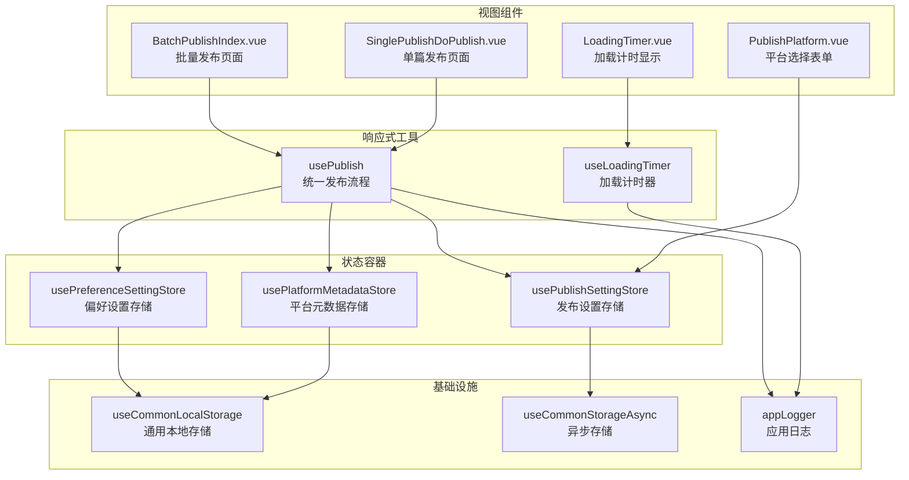
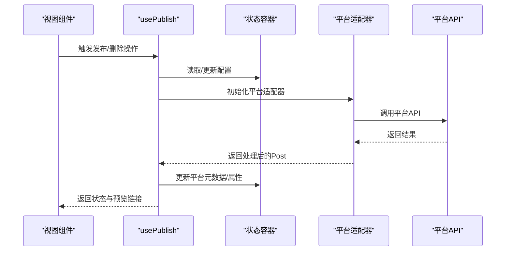
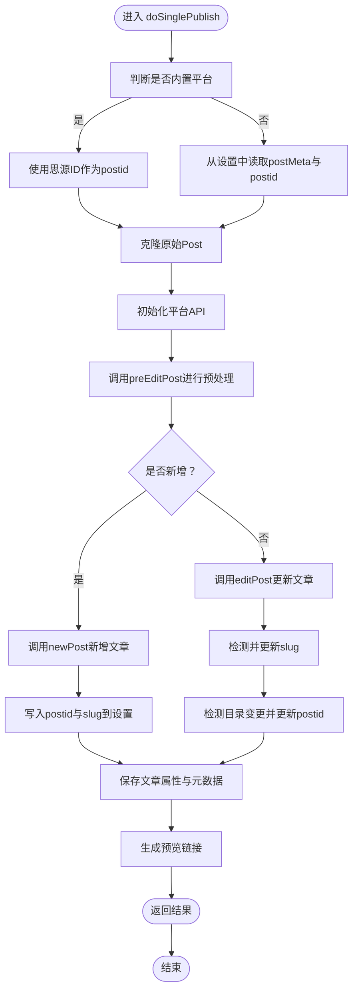
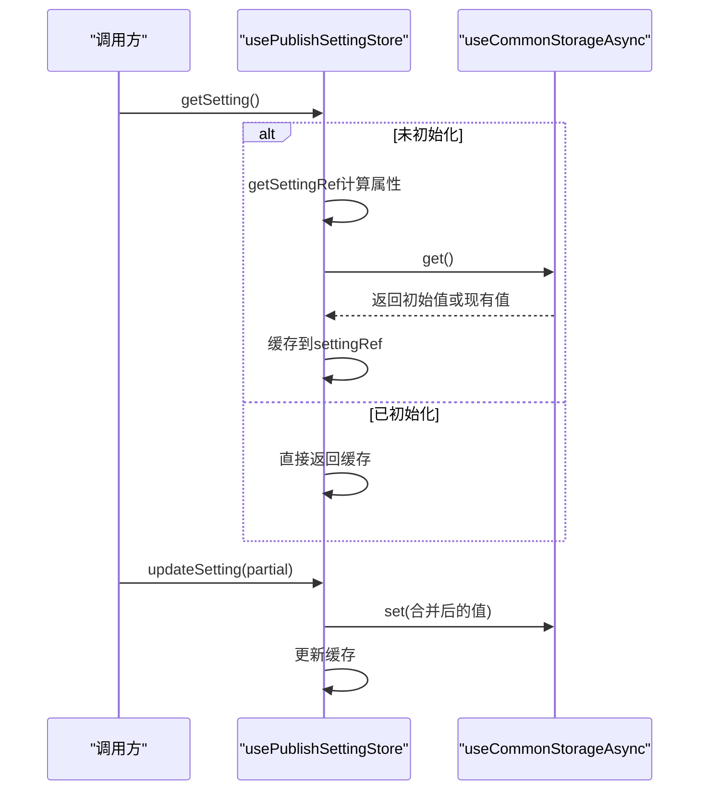
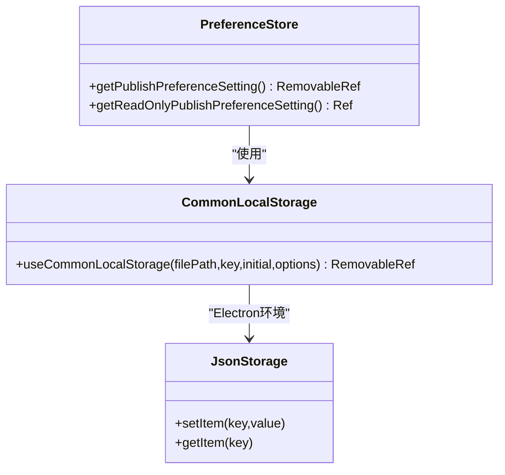
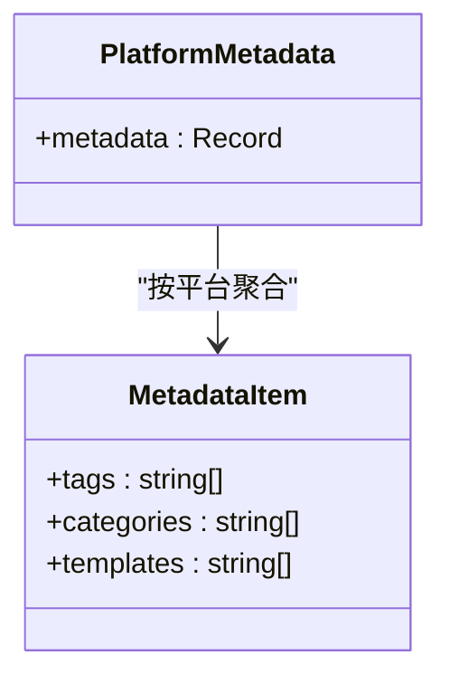
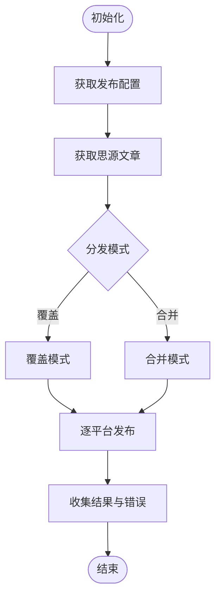
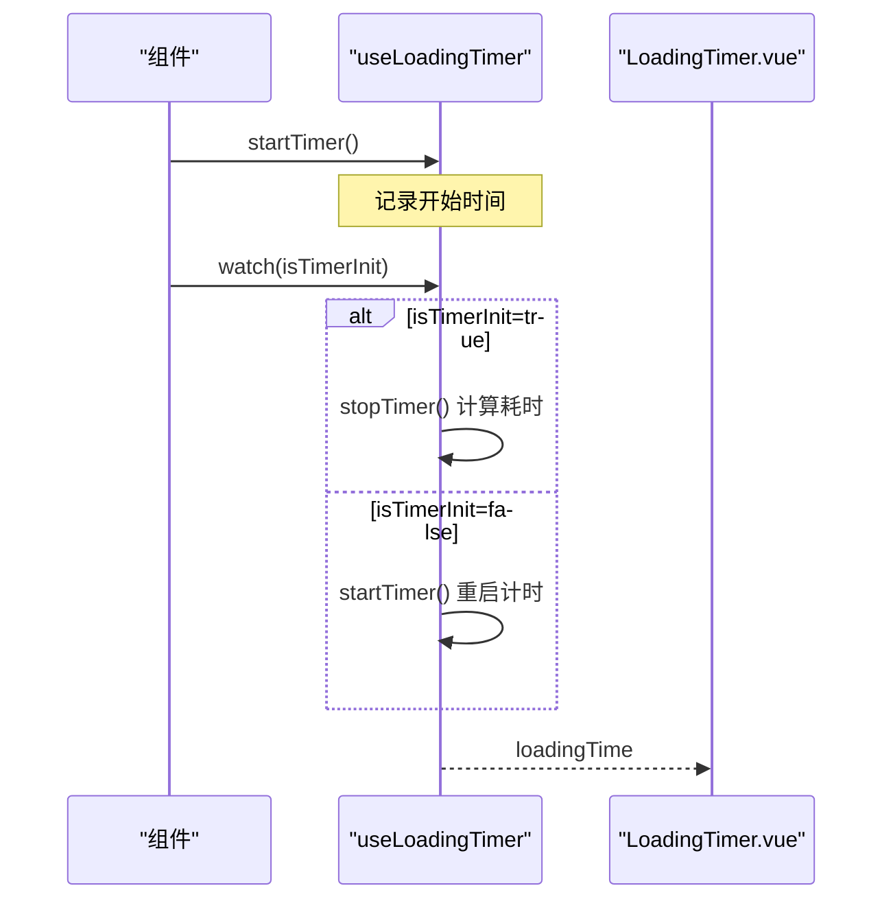
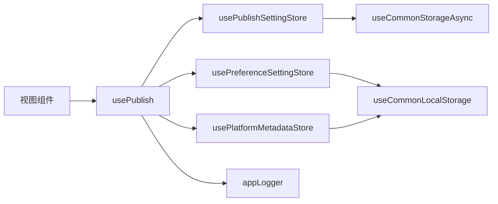

# 状态管理系统

<cite>
**本文引用的文件**
- [usePublish.ts](file://src/composables/usePublish.ts)
- [usePublishSettingStore.ts](file://src/stores/usePublishSettingStore.ts)
- [usePreferenceSettingStore.ts](file://src/stores/usePreferenceSettingStore.ts)
- [usePlatformMetadataStore.ts](file://src/stores/usePlatformMetadataStore.ts)
- [useCommonLocalStorage.ts](file://src/stores/common/useCommonLocalStorage.ts)
- [useCommonStorageAsync.ts](file://src/stores/common/useCommonStorageAsync.ts)
- [platformMetadata.ts](file://src/models/platformMetadata.ts)
- [publishPreferenceCfg.ts](file://src/models/publishPreferenceCfg.ts)
- [appLogger.ts](file://src/utils/appLogger.ts)
- [BatchPublishIndex.vue](file://src/components/publish/BatchPublishIndex.vue)
- [PublishPlatform.vue](file://src/components/publish/form/PublishPlatform.vue)
- [LoadingTimer.vue](file://src/components/common/LoadingTimer.vue)
- [useLoadingTimer.ts](file://src/composables/useLoadingTimer.ts)
- [SinglePublishDoPublish.vue](file://src/components/publish/SinglePublishDoPublish.vue)
- [useQuartzApi.ts](file://src/adaptors/api/quartz/useQuartzApi.ts)
- [useNotionApi.ts](file://src/adaptors/api/notion/useNotionApi.ts)
- [usePublishConfig.spec.ts](file://src/composables/usePublishConfig.spec.ts)
</cite>

## 目录
1. [引言](#引言)
2. [项目结构](#项目结构)
3. [核心组件](#核心组件)
4. [架构总览](#架构总览)
5. [详细组件分析](#详细组件分析)
6. [依赖分析](#依赖分析)
7. [性能考虑](#性能考虑)
8. [故障排查指南](#故障排查指南)
9. [结论](#结论)
10. [附录](#附录)

## 引言
本文件系统性梳理“状态管理系统”的设计与实现，聚焦以下关键主题：
- 发布状态管理：发布进度跟踪、状态同步、状态持久化
- 响应式状态设计与实现：Vue 3 响应式系统、状态更新策略、性能优化
- 多状态协调：发布状态、配置状态、平台元数据状态的同步与一致性
- 状态重置与清理：错误状态恢复、中间状态清理
- 状态监控与调试：状态变更追踪、性能分析
- 最佳实践与常见陷阱

## 项目结构
围绕状态管理的关键文件分布如下：
- 状态容器层（Pinia/本地存储）：发布设置、偏好设置、平台元数据
- 响应式组合式工具：统一发布流程、加载计时器
- 视图层组件：批量发布、平台选择、加载计时显示
- 日志与测试：应用日志、单元测试

**图表来源**
- [usePublishSettingStore.ts:21-94](file://src/stores/usePublishSettingStore.ts#L21-L94)
- [usePreferenceSettingStore.ts:21-86](file://src/stores/usePreferenceSettingStore.ts#L21-L86)
- [usePlatformMetadataStore.ts:21-124](file://src/stores/usePlatformMetadataStore.ts#L21-L124)
- [usePublish.ts:44-557](file://src/composables/usePublish.ts#L44-L557)
- [useLoadingTimer.ts:20-54](file://src/composables/useLoadingTimer.ts#L20-L54)
- [BatchPublishIndex.vue:89-350](file://src/components/publish/BatchPublishIndex.vue#L89-L350)
- [PublishPlatform.vue:40-86](file://src/components/publish/form/PublishPlatform.vue#L40-L86)
- [LoadingTimer.vue:14-33](file://src/components/common/LoadingTimer.vue#L14-L33)
- [useCommonLocalStorage.ts:27-57](file://src/stores/common/useCommonLocalStorage.ts#L27-L57)
- [useCommonStorageAsync.ts:22-84](file://src/stores/common/useCommonStorageAsync.ts#L22-L84)
- [appLogger.ts:37-39](file://src/utils/appLogger.ts#L37-L39)

**章节来源**
- [usePublishSettingStore.ts:21-94](file://src/stores/usePublishSettingStore.ts#L21-L94)
- [usePreferenceSettingStore.ts:21-86](file://src/stores/usePreferenceSettingStore.ts#L21-L86)
- [usePlatformMetadataStore.ts:21-124](file://src/stores/usePlatformMetadataStore.ts#L21-L124)
- [usePublish.ts:44-557](file://src/composables/usePublish.ts#L44-L557)
- [useCommonLocalStorage.ts:27-57](file://src/stores/common/useCommonLocalStorage.ts#L27-L57)
- [useCommonStorageAsync.ts:22-84](file://src/stores/common/useCommonStorageAsync.ts#L22-L84)
- [BatchPublishIndex.vue:89-350](file://src/components/publish/BatchPublishIndex.vue#L89-L350)
- [PublishPlatform.vue:40-86](file://src/components/publish/form/PublishPlatform.vue#L40-L86)
- [LoadingTimer.vue:14-33](file://src/components/common/LoadingTimer.vue#L14-L33)
- [useLoadingTimer.ts:20-54](file://src/composables/useLoadingTimer.ts#L20-L54)
- [appLogger.ts:37-39](file://src/utils/appLogger.ts#L37-L39)

## 核心组件
- 发布状态容器（usePublish）
  - 统一处理“新增/更新/删除”三类发布操作
  - 维护单篇发布表单状态（加载、进度、错误信息）
  - 调用平台 API 完成预处理、发布、更新、删除
  - 同步平台元数据与文章属性
- 配置状态容器（usePublishSettingStore）
  - 提供发布设置的读取与更新
  - 支持异步存储与缓存，确保首次访问时初始化
- 偏好设置容器（usePreferenceSettingStore）
  - 提供发布偏好设置的本地存储
  - 支持从思源笔记窗口注入 AI 配置
- 平台元数据容器（usePlatformMetadataStore）
  - 维护各平台的标签、分类、模板等元数据
  - 提供去重合并与增量更新能力
- 通用存储适配（useCommonLocalStorage/useCommonStorageAsync）
  - 在 Electron/浏览器环境下自动切换存储适配器
  - 提供类型安全的序列化与反序列化
- 响应式工具（usePublish/useLoadingTimer）
  - 使用 reactive/readonly/watch 管理响应式状态
  - 提供加载计时器与状态变更追踪

**章节来源**
- [usePublish.ts:44-557](file://src/composables/usePublish.ts#L44-L557)
- [usePublishSettingStore.ts:21-94](file://src/stores/usePublishSettingStore.ts#L21-L94)
- [usePreferenceSettingStore.ts:21-86](file://src/stores/usePreferenceSettingStore.ts#L21-L86)
- [usePlatformMetadataStore.ts:21-124](file://src/stores/usePlatformMetadataStore.ts#L21-L124)
- [useCommonLocalStorage.ts:27-57](file://src/stores/common/useCommonLocalStorage.ts#L27-L57)
- [useCommonStorageAsync.ts:22-84](file://src/stores/common/useCommonStorageAsync.ts#L22-L84)
- [useLoadingTimer.ts:20-54](file://src/composables/useLoadingTimer.ts#L20-L54)

## 架构总览
发布状态管理贯穿“视图层 -> 响应式工具 -> 状态容器 -> 平台适配器 -> 平台 API”的链路。

**图表来源**
- [usePublish.ts:70-212](file://src/composables/usePublish.ts#L70-L212)
- [usePublishSettingStore.ts:38-59](file://src/stores/usePublishSettingStore.ts#L38-L59)
- [usePlatformMetadataStore.ts:83-122](file://src/stores/usePlatformMetadataStore.ts#L83-L122)
- [useQuartzApi.ts:32-60](file://src/adaptors/api/quartz/useQuartzApi.ts#L32-L60)
- [useNotionApi.ts:31-56](file://src/adaptors/api/notion/useNotionApi.ts#L31-L56)

## 详细组件分析

### 组件A：统一发布流程（usePublish）
- 数据结构与职责
  - singleFormData：维护单篇发布的响应式状态（加载、进度、错误）
  - doSinglePublish/doSingleDelete/doForceSingleDelete：封装发布/删除主流程
  - initPublishMethods：初始化文章属性（别名、YAML、平台元数据）
- 关键流程
  - 预处理：调用平台 API 的 preEditPost 完成内容适配
  - 新增/更新：根据 postid 判定；新增写入配置并更新属性；更新时处理别名与目录变更
  - 删除：删除远端文章后清理本地发布信息与属性
  - 元数据同步：更新平台元数据并写入文章属性
- 性能与健壮性
  - 使用 cloneDeep 保证每次发布使用独立副本
  - 异常捕获统一设置错误状态并推送消息
  - 预览链接拼接支持相对路径与绝对路径

**图表来源**
- [usePublish.ts:70-212](file://src/composables/usePublish.ts#L70-L212)

**章节来源**
- [usePublish.ts:55-212](file://src/composables/usePublish.ts#L55-L212)

### 组件B：发布设置存储（usePublishSettingStore）
- 设计要点
  - 使用 Pinia 定义 store，基于 useCommonStorageAsync 实现异步持久化
  - getSettingRef 计算属性实现懒加载与缓存
  - updateSetting 支持部分更新并刷新缓存
- 状态生命周期
  - 首次访问触发初始化，随后走缓存读取
  - 更新后合并新值并写回存储

**图表来源**
- [usePublishSettingStore.ts:28-59](file://src/stores/usePublishSettingStore.ts#L28-L59)
- [useCommonStorageAsync.ts:44-61](file://src/stores/common/useCommonStorageAsync.ts#L44-L61)

**章节来源**
- [usePublishSettingStore.ts:21-94](file://src/stores/usePublishSettingStore.ts#L21-L94)
- [useCommonStorageAsync.ts:22-84](file://src/stores/common/useCommonStorageAsync.ts#L22-L84)

### 组件C：偏好设置存储（usePreferenceSettingStore）
- 设计要点
  - 基于 useCommonLocalStorage，提供可移除引用
  - 支持从思源笔记窗口注入 AI 配置，动态覆盖默认值
  - 提供只读包装，避免外部误改
- 环境适配
  - Electron 环境使用 JsonStorage，浏览器环境使用 window.localStorage

**图表来源**
- [usePreferenceSettingStore.ts:34-81](file://src/stores/usePreferenceSettingStore.ts#L34-L81)
- [useCommonLocalStorage.ts:43-55](file://src/stores/common/useCommonLocalStorage.ts#L43-L55)

**章节来源**
- [usePreferenceSettingStore.ts:21-86](file://src/stores/usePreferenceSettingStore.ts#L21-L86)
- [useCommonLocalStorage.ts:27-57](file://src/stores/common/useCommonLocalStorage.ts#L27-L57)

### 组件D：平台元数据存储（usePlatformMetadataStore）
- 设计要点
  - 维护 PlatformMetadata 结构，按平台聚合标签、分类、模板
  - 提供去重合并与增量更新，避免重复写入
  - 支持只读访问，保障数据一致性
- 数据模型

**图表来源**
- [platformMetadata.ts:16-47](file://src/models/platformMetadata.ts#L16-L47)

**章节来源**
- [usePlatformMetadataStore.ts:21-124](file://src/stores/usePlatformMetadataStore.ts#L21-L124)
- [platformMetadata.ts:16-47](file://src/models/platformMetadata.ts#L16-L47)

### 组件E：批量发布与状态协调（BatchPublishIndex.vue）
- 多状态协调
  - 合并/覆盖两种分发模式，分别对关键词与分类去重合并
  - 维护成功/失败结果列表，统计错误数量
  - 通过 initPublishMethods.assignInitAttrs 与 assignInitSlug 初始化平台相关属性
- 状态同步
  - 与 PublishPlatform.vue 通过 emitSyncDynList 同步所选平台列表
  - 与 LoadingTimer.vue 协作展示加载耗时

**图表来源**
- [BatchPublishIndex.vue:104-156](file://src/components/publish/BatchPublishIndex.vue#L104-L156)
- [BatchPublishIndex.vue:134-146](file://src/components/publish/BatchPublishIndex.vue#L134-L146)

**章节来源**
- [BatchPublishIndex.vue:89-350](file://src/components/publish/BatchPublishIndex.vue#L89-L350)

### 组件F：加载计时器与调试（useLoadingTimer/LoadingTimer.vue）
- 计时逻辑
  - useLoadingTimer 基于 watch 监听 isTimerInit，在启动/停止之间切换计时
  - LoadingTimer.vue 将毫秒数渲染为用户提示
- 调试价值
  - 便于定位慢点与异常耗时环节

**图表来源**
- [useLoadingTimer.ts:20-54](file://src/composables/useLoadingTimer.ts#L20-L54)
- [LoadingTimer.vue:14-33](file://src/components/common/LoadingTimer.vue#L14-L33)

**章节来源**
- [useLoadingTimer.ts:20-54](file://src/composables/useLoadingTimer.ts#L20-L54)
- [LoadingTimer.vue:14-33](file://src/components/common/LoadingTimer.vue#L14-L33)

## 依赖分析
- 组件耦合
  - usePublish 依赖 usePublishSettingStore、usePlatformMetadataStore、usePublishConfig
  - 视图组件依赖 usePublish 与 store，形成“视图 -> 响应式工具 -> 状态容器”的单向依赖
- 外部依赖
  - Vue 3 响应式系统（reactive/readonly/watch）
  - @vueuse/core（useStorage、useStorageAsync）
  - 平台适配器（如 Quartz、Notion）通过工厂方式注入

**图表来源**
- [usePublish.ts:48-52](file://src/composables/usePublish.ts#L48-L52)
- [usePublishSettingStore.ts:25-26](file://src/stores/usePublishSettingStore.ts#L25-L26)
- [usePreferenceSettingStore.ts:36-38](file://src/stores/usePreferenceSettingStore.ts#L36-L38)
- [usePlatformMetadataStore.ts:34-37](file://src/stores/usePlatformMetadataStore.ts#L34-L37)
- [useCommonStorageAsync.ts:27-63](file://src/stores/common/useCommonStorageAsync.ts#L27-L63)
- [useCommonLocalStorage.ts:33-34](file://src/stores/common/useCommonLocalStorage.ts#L33-L34)
- [appLogger.ts:37-39](file://src/utils/appLogger.ts#L37-L39)

**章节来源**
- [usePublish.ts:48-52](file://src/composables/usePublish.ts#L48-L52)
- [usePublishSettingStore.ts:25-26](file://src/stores/usePublishSettingStore.ts#L25-L26)
- [usePreferenceSettingStore.ts:36-38](file://src/stores/usePreferenceSettingStore.ts#L36-L38)
- [usePlatformMetadataStore.ts:34-37](file://src/stores/usePlatformMetadataStore.ts#L34-L37)
- [useCommonStorageAsync.ts:27-63](file://src/stores/common/useCommonStorageAsync.ts#L27-L63)
- [useCommonLocalStorage.ts:33-34](file://src/stores/common/useCommonLocalStorage.ts#L33-L34)
- [appLogger.ts:37-39](file://src/utils/appLogger.ts#L37-L39)

## 性能考虑
- 响应式更新策略
  - 使用 reactive 管理局部状态，避免不必要的全局刷新
  - 使用 readonly 包装只读数据，减少不必要订阅
- 序列化与存储
  - 根据初始值类型自动选择序列化器，减少序列化开销
  - 异步存储在首次访问时写入默认值，避免后续重复初始化
- 并发与批处理
  - 批量发布采用顺序循环，避免并发写冲突；若需提升吞吐，可在业务允许范围内引入并发限制
- 渲染优化
  - 仅在状态变化时触发 UI 更新；对高频状态使用防抖/节流（如搜索/过滤场景）

[本节为通用指导，无需列出具体文件来源]

## 故障排查指南
- 常见问题与定位
  - 配置缺失：检查 usePublishSettingStore 的 getSetting 是否返回空；确认 updateSetting 是否正确写入
  - 平台初始化失败：检查平台适配器初始化逻辑（如 Quartz/Notion），确认配置键与 posidKey 是否存在
  - 发布失败：查看 usePublish 的异常分支，关注错误消息与日志输出
- 调试方法
  - 使用 appLogger 输出关键节点日志，结合 LoadingTimer.vue 观察耗时
  - 在 usePublishConfig.spec.ts 中运行测试用例，验证配置解析与 API 初始化
- 清理与重置
  - 删除文章后清理本地发布信息与属性，确保下次发布不受历史残留影响
  - 强制删除用于跳过远端校验，直接清除本地发布标记

**章节来源**
- [usePublish.ts:195-203](file://src/composables/usePublish.ts#L195-L203)
- [usePublish.ts:226-273](file://src/composables/usePublish.ts#L226-L273)
- [usePublish.ts:289-331](file://src/composables/usePublish.ts#L289-L331)
- [usePublishConfig.spec.ts:35-51](file://src/composables/usePublishConfig.spec.ts#L35-L51)
- [appLogger.ts:37-39](file://src/utils/appLogger.ts#L37-L39)

## 结论
该状态管理系统通过“响应式工具 + 状态容器 + 通用存储适配”的分层设计，实现了发布状态的全链路管理。其特点包括：
- 明确的状态边界与职责划分
- 健壮的异常处理与日志追踪
- 可扩展的平台适配与元数据聚合
- 友好的性能与调试支持

建议在后续迭代中进一步完善并发发布、状态快照与回滚、以及更细粒度的性能指标采集。

[本节为总结性内容，无需列出具体文件来源]

## 附录
- 最佳实践
  - 优先使用组合式工具封装复杂流程，保持视图简洁
  - 对外暴露只读引用，避免跨模块误改
  - 在关键路径加入日志与计时，便于问题定位
- 常见陷阱
  - 忽略 deepClone 导致状态污染
  - 直接修改 store 缓存而非通过 update 接口
  - 平台配置键缺失导致初始化失败

[本节为通用指导，无需列出具体文件来源]