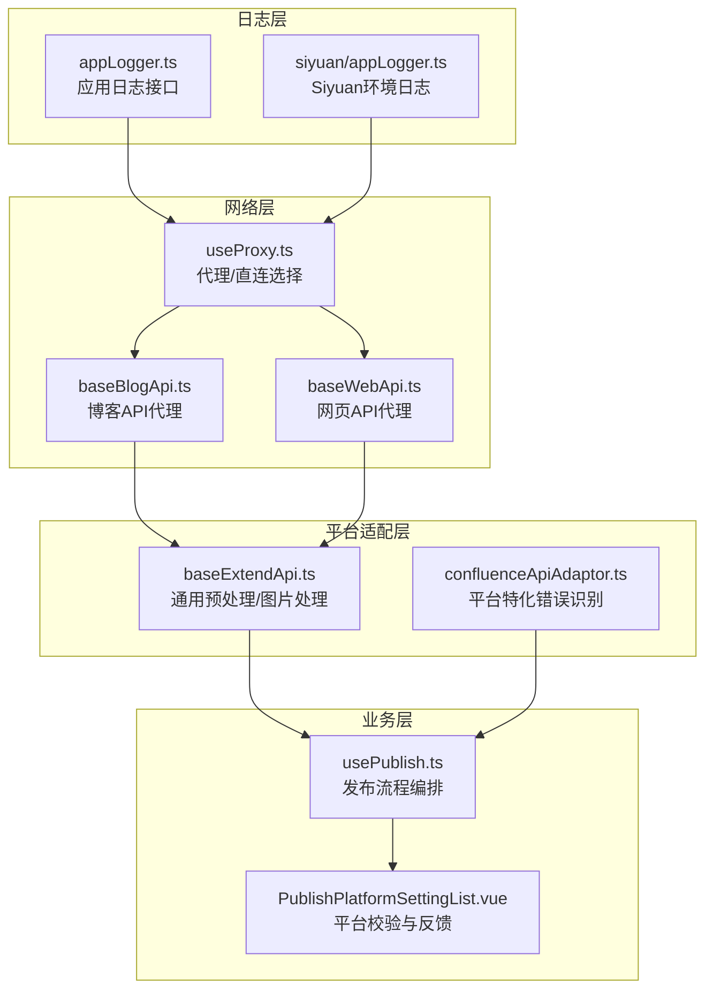
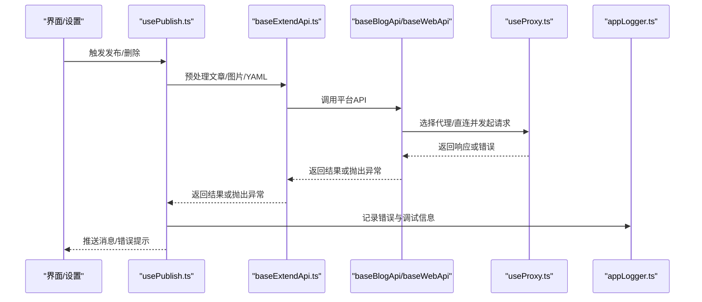
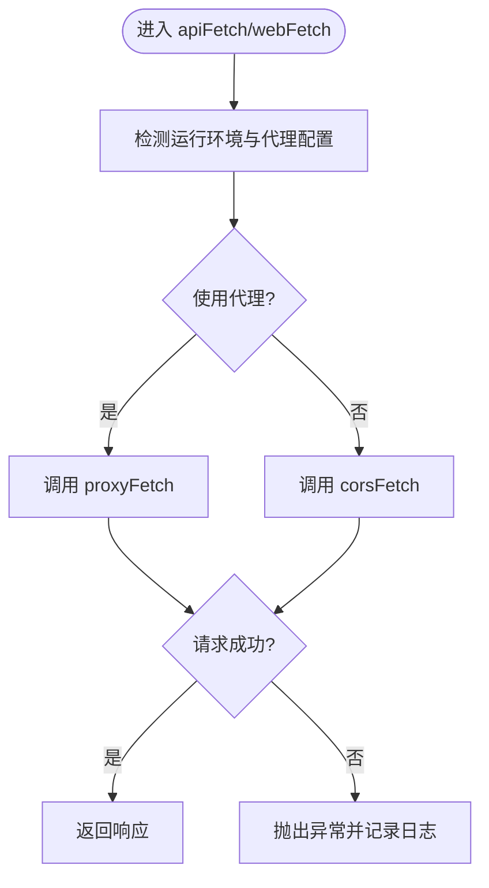
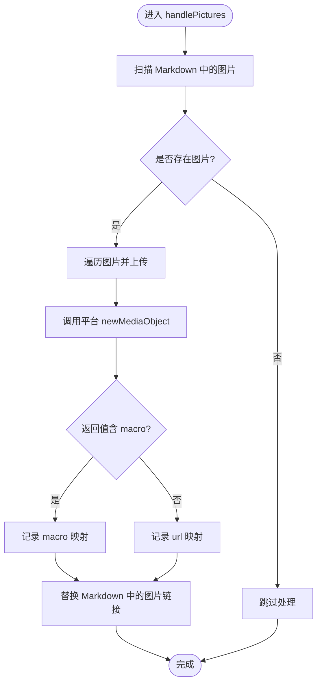
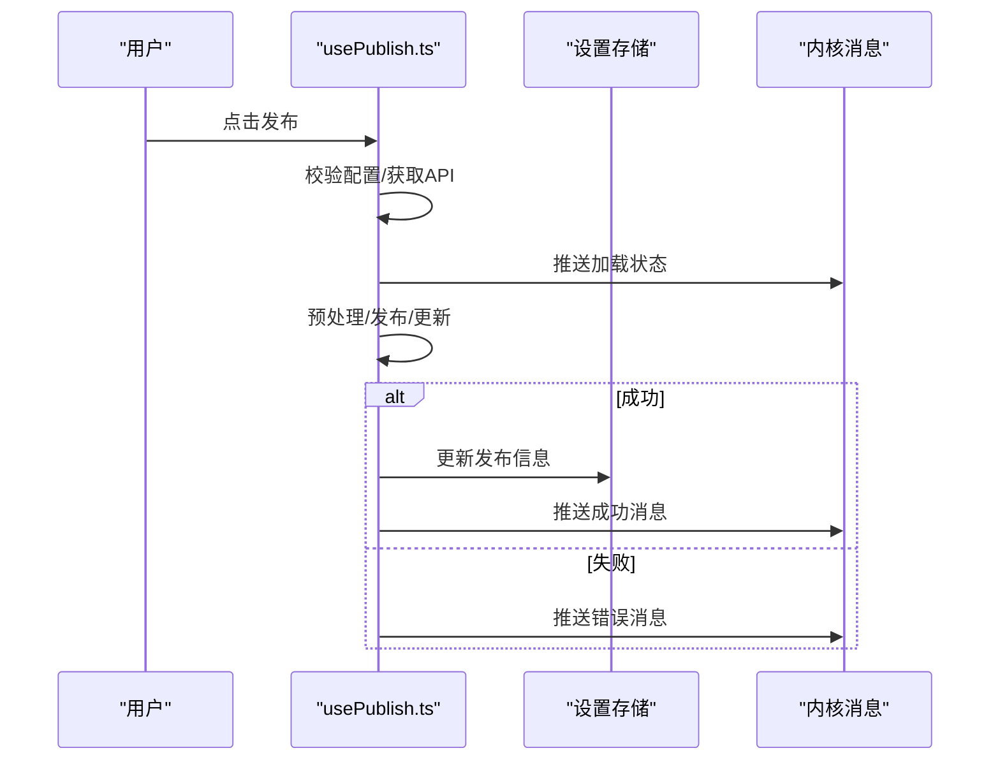
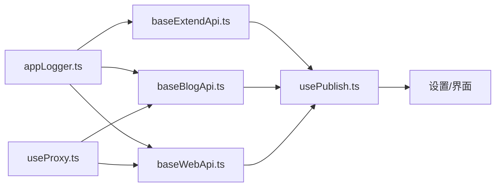

# 错误处理与恢复

<cite>
**本文引用的文件**
- [src/utils/BaseErrors.ts](file://src/utils/BaseErrors.ts)
- [src/adaptors/base/baseExtendApi.ts](file://src/adaptors/base/baseExtendApi.ts)
- [src/adaptors/api/base/baseBlogApi.ts](file://src/adaptors/api/base/baseBlogApi.ts)
- [src/adaptors/web/base/baseWebApi.ts](file://src/adaptors/web/base/baseWebApi.ts)
- [src/composables/useProxy.ts](file://src/composables/useProxy.ts)
- [src/utils/appLogger.ts](file://src/utils/appLogger.ts)
- [siyuan/appLogger.ts](file://siyuan/appLogger.ts)
- [src/utils/constants.ts](file://src/utils/constants.ts)
- [src/components/set/publish/platform/PublishPlatformSettingList.vue](file://src/components/set/publish/platform/PublishPlatformSettingList.vue)
- [src/composables/usePublish.ts](file://src/composables/usePublish.ts)
- [src/adaptors/api/confluence/confluenceApiAdaptor.ts](file://src/adaptors/api/confluence/confluenceApiAdaptor.ts)
</cite>

## 目录
1. [简介](#简介)
2. [项目结构](#项目结构)
3. [核心组件](#核心组件)
4. [架构总览](#架构总览)
5. [详细组件分析](#详细组件分析)
6. [依赖分析](#依赖分析)
7. [性能考虑](#性能考虑)
8. [故障排查指南](#故障排查指南)
9. [结论](#结论)
10. [附录](#附录)

## 简介
本文件聚焦于“发布插件”在发布流程中的错误处理与恢复机制，涵盖网络错误、平台错误、配置错误、数据错误等类型的错误分类与处理策略；详述自动重试、降级处理、回滚策略等恢复手段；阐述日志记录与分析体系（日志级别、格式、追踪）；解释用户友好的错误提示（本地化、可视化反馈、帮助信息）；并提供前置检查、异常捕获、健康检查等预防与监控方法，以及常见错误场景的解决方案与最佳实践。

## 项目结构
围绕错误处理与恢复的关键模块如下：
- 日志系统：统一日志接口与实现，贯穿各层
- 代理与网络层：统一的代理/直连选择与错误传播
- 平台适配层：博客/网页两类适配器封装，统一错误处理
- 业务编排层：发布流程编排、错误收集与用户反馈
- 平台特化层：如 Confluence 等平台的错误识别与恢复

图表来源
- [src/utils/appLogger.ts:1-46](file://src/utils/appLogger.ts#L1-L46)
- [siyuan/appLogger.ts:1-57](file://siyuan/appLogger.ts#L1-L57)
- [src/composables/useProxy.ts:41-83](file://src/composables/useProxy.ts#L41-L83)
- [src/adaptors/api/base/baseBlogApi.ts:93-150](file://src/adaptors/api/base/baseBlogApi.ts#L93-L150)
- [src/adaptors/web/base/baseWebApi.ts:150-199](file://src/adaptors/web/base/baseWebApi.ts#L150-L199)
- [src/adaptors/base/baseExtendApi.ts:466-596](file://src/adaptors/base/baseExtendApi.ts#L466-L596)
- [src/adaptors/api/confluence/confluenceApiAdaptor.ts:174-205](file://src/adaptors/api/confluence/confluenceApiAdaptor.ts#L174-L205)
- [src/composables/usePublish.ts:70-212](file://src/composables/usePublish.ts#L70-L212)
- [src/components/set/publish/platform/PublishPlatformSettingList.vue:319-351](file://src/components/set/publish/platform/PublishPlatformSettingList.vue#L319-L351)

章节来源
- [src/utils/appLogger.ts:1-46](file://src/utils/appLogger.ts#L1-L46)
- [siyuan/appLogger.ts:1-57](file://siyuan/appLogger.ts#L1-L57)
- [src/composables/useProxy.ts:41-83](file://src/composables/useProxy.ts#L41-L83)
- [src/adaptors/api/base/baseBlogApi.ts:93-150](file://src/adaptors/api/base/baseBlogApi.ts#L93-L150)
- [src/adaptors/web/base/baseWebApi.ts:150-199](file://src/adaptors/web/base/baseWebApi.ts#L150-L199)
- [src/adaptors/base/baseExtendApi.ts:466-596](file://src/adaptors/base/baseExtendApi.ts#L466-L596)
- [src/adaptors/api/confluence/confluenceApiAdaptor.ts:174-205](file://src/adaptors/api/confluence/confluenceApiAdaptor.ts#L174-L205)
- [src/composables/usePublish.ts:70-212](file://src/composables/usePublish.ts#L70-L212)
- [src/components/set/publish/platform/PublishPlatformSettingList.vue:319-351](file://src/components/set/publish/platform/PublishPlatformSettingList.vue#L319-L351)

## 核心组件
- 日志系统：提供 debug/info/warn/error 四级日志接口，支持在开发/生产环境切换与输出增强
- 代理与网络层：根据运行环境自动选择代理或直连，统一封装 fetch/formFetch，保留错误上下文
- 平台适配层：在图片上传、外链替换、YAML/正文处理等关键步骤进行错误捕获与差异化处理
- 业务编排层：在发布/删除流程中集中捕获异常，生成用户可理解的错误消息，并推送内核消息
- 平台特化层：针对特定平台（如 Confluence）识别重复附件等错误，提取文件名并进行降级处理

章节来源
- [src/utils/appLogger.ts:23-46](file://src/utils/appLogger.ts#L23-L46)
- [siyuan/appLogger.ts:40-56](file://siyuan/appLogger.ts#L40-L56)
- [src/composables/useProxy.ts:41-83](file://src/composables/useProxy.ts#L41-L83)
- [src/adaptors/base/baseExtendApi.ts:466-596](file://src/adaptors/base/baseExtendApi.ts#L466-L596)
- [src/composables/usePublish.ts:70-212](file://src/composables/usePublish.ts#L70-L212)
- [src/adaptors/api/confluence/confluenceApiAdaptor.ts:174-205](file://src/adaptors/api/confluence/confluenceApiAdaptor.ts#L174-L205)

## 架构总览
发布流程中的错误处理遵循“分层捕获、逐层降级、统一反馈”的原则。网络层负责跨域与代理选择；适配层负责平台差异与特化逻辑；业务层负责流程编排与用户反馈；日志层贯穿始终，提供可追踪性。

图表来源
- [src/composables/usePublish.ts:70-212](file://src/composables/usePublish.ts#L70-L212)
- [src/adaptors/base/baseExtendApi.ts:90-106](file://src/adaptors/base/baseExtendApi.ts#L90-L106)
- [src/adaptors/api/base/baseBlogApi.ts:93-150](file://src/adaptors/api/base/baseBlogApi.ts#L93-L150)
- [src/adaptors/web/base/baseWebApi.ts:150-199](file://src/adaptors/web/base/baseWebApi.ts#L150-L199)
- [src/composables/useProxy.ts:41-83](file://src/composables/useProxy.ts#L41-L83)
- [src/utils/appLogger.ts:1-46](file://src/utils/appLogger.ts#L1-L46)

## 详细组件分析

### 日志系统与错误追踪
- 日志接口：提供 debug/info/warn/error 四级方法，便于按严重程度分级
- 环境适配：开发模式下可启用增强输出，Siyuan 环境下可切换日志输出目标
- 使用方式：在各层组件中统一通过 createAppLogger/createSiyuanAppLogger 创建实例，贯穿请求、处理、异常路径

章节来源
- [src/utils/appLogger.ts:23-46](file://src/utils/appLogger.ts#L23-L46)
- [siyuan/appLogger.ts:40-56](file://siyuan/appLogger.ts#L40-L56)

### 代理与网络层（网络错误处理）
- 自动选择：根据运行环境与配置自动选择 Siyuan 代理或中间件代理
- 统一封装：apiFetch/webFetch 提供一致的请求签名，支持强制代理、编码参数
- 错误传播：底层异常透传至上层，结合日志定位问题

图表来源
- [src/composables/useProxy.ts:41-83](file://src/composables/useProxy.ts#L41-L83)
- [src/adaptors/api/base/baseBlogApi.ts:93-150](file://src/adaptors/api/base/baseBlogApi.ts#L93-L150)
- [src/adaptors/web/base/baseWebApi.ts:150-199](file://src/adaptors/web/base/baseWebApi.ts#L150-L199)

章节来源
- [src/composables/useProxy.ts:41-83](file://src/composables/useProxy.ts#L41-L83)
- [src/adaptors/api/base/baseBlogApi.ts:93-150](file://src/adaptors/api/base/baseBlogApi.ts#L93-L150)
- [src/adaptors/web/base/baseWebApi.ts:150-199](file://src/adaptors/web/base/baseWebApi.ts#L150-L199)

### 平台适配层（平台错误与数据错误）
- 图片处理：对平台自带图片上传进行批量处理，捕获异常并区分“可忽略错误”（如宏模式下的特定错误），其余错误统一提示并记录
- 外链替换：对外部块引用进行预处理，若未发布则抛错或按配置忽略
- YAML/正文处理：根据平台适配器生成/合并 YAML，同步正文与 HTML，保证发布内容一致性

图表来源
- [src/adaptors/base/baseExtendApi.ts:466-596](file://src/adaptors/base/baseExtendApi.ts#L466-L596)

章节来源
- [src/adaptors/base/baseExtendApi.ts:466-596](file://src/adaptors/base/baseExtendApi.ts#L466-L596)

### 业务编排层（配置错误与流程错误）
- 发布流程：集中捕获配置错误（如 posidKey 为空）、平台返回异常，生成用户可读错误消息并通过内核推送
- 删除流程：检测 postid，删除后清理属性与发布信息；异常时同样推送错误消息
- 强制删除：即便未在平台存在，也允许清理本地发布信息

图表来源
- [src/composables/usePublish.ts:70-212](file://src/composables/usePublish.ts#L70-L212)

章节来源
- [src/composables/usePublish.ts:70-212](file://src/composables/usePublish.ts#L70-L212)

### 平台特化层（Confluence 特定错误）
- 错误识别：从错误信息中提取重复附件的文件名，或回退到结果列表取第一个附件
- 降级处理：当无法提取文件名时，抛出明确错误，避免静默失败

章节来源
- [src/adaptors/api/confluence/confluenceApiAdaptor.ts:174-205](file://src/adaptors/api/confluence/confluenceApiAdaptor.ts#L174-L205)

### 用户友好错误提示（本地化与可视化）
- 本地化：使用 i18n 提示“失败”等消息，配合错误堆栈与日志定位问题
- 可视化反馈：通过内核消息推送短时提示，必要时弹出确认框引导用户处理（如登出重认证）

章节来源
- [src/components/set/publish/platform/PublishPlatformSettingList.vue:319-351](file://src/components/set/publish/platform/PublishPlatformSettingList.vue#L319-L351)
- [src/components/set/publish/platform/PublishPlatformSettingList.vue:380-414](file://src/components/set/publish/platform/PublishPlatformSettingList.vue#L380-L414)

## 依赖分析
- 日志依赖：各层通过统一日志接口创建实例，避免耦合具体实现
- 网络依赖：baseBlogApi/baseWebApi 依赖 useProxy 提供的代理/直连能力
- 平台依赖：baseExtendApi 在图片处理、外链替换、YAML处理等环节依赖平台适配器与工具库
- 业务依赖：usePublish 依赖平台元数据、设置存储与内核消息推送

图表来源
- [src/utils/appLogger.ts:1-46](file://src/utils/appLogger.ts#L1-L46)
- [src/adaptors/base/baseExtendApi.ts:1-739](file://src/adaptors/base/baseExtendApi.ts#L1-L739)
- [src/adaptors/api/base/baseBlogApi.ts:1-205](file://src/adaptors/api/base/baseBlogApi.ts#L1-L205)
- [src/adaptors/web/base/baseWebApi.ts:1-256](file://src/adaptors/web/base/baseWebApi.ts#L1-L256)
- [src/composables/useProxy.ts:41-83](file://src/composables/useProxy.ts#L41-L83)
- [src/composables/usePublish.ts:1-560](file://src/composables/usePublish.ts#L1-L560)

章节来源
- [src/utils/appLogger.ts:1-46](file://src/utils/appLogger.ts#L1-L46)
- [src/adaptors/base/baseExtendApi.ts:1-739](file://src/adaptors/base/baseExtendApi.ts#L1-L739)
- [src/adaptors/api/base/baseBlogApi.ts:1-205](file://src/adaptors/api/base/baseBlogApi.ts#L1-L205)
- [src/adaptors/web/base/baseWebApi.ts:1-256](file://src/adaptors/web/base/baseWebApi.ts#L1-L256)
- [src/composables/useProxy.ts:41-83](file://src/composables/useProxy.ts#L41-L83)
- [src/composables/usePublish.ts:1-560](file://src/composables/usePublish.ts#L1-L560)

## 性能考虑
- 代理选择：优先使用代理减少跨域限制带来的额外开销；仅在必要时强制代理
- 批量上传：图片上传采用循环批量处理，避免阻塞主线程；对在线图片进行跳过判断，减少无效请求
- 日志级别：生产环境建议使用 info/warn/error，避免过多 debug 输出影响性能

## 故障排查指南
- 网络错误
  - 症状：跨域失败、请求超时
  - 排查：确认代理配置与运行环境；查看日志中“Using legency/cors fetch”分支
  - 处理：切换代理/直连；检查平台 CORS 设置
- 平台错误
  - 症状：图片上传失败、重复附件、宏替换异常
  - 排查：查看图片上传异常与 Confluence 错误信息提取逻辑
  - 处理：按平台特性进行降级（如宏/链接替换）；记录并提示用户查看开发者工具
- 配置错误
  - 症状：posidKey 为空、未找到 postid、未发布外链
  - 排查：检查发布配置与平台元数据；确认是否已发布
  - 处理：完善配置；提供外链发布指引
- 数据错误
  - 症状：YAML 解析失败、正文/HTML 不一致
  - 排查：检查 YAML 适配器与转换流程
  - 处理：回退默认策略；确保 YAML 与正文同步

章节来源
- [src/adaptors/api/base/baseBlogApi.ts:93-150](file://src/adaptors/api/base/baseBlogApi.ts#L93-L150)
- [src/adaptors/web/base/baseWebApi.ts:150-199](file://src/adaptors/web/base/baseWebApi.ts#L150-L199)
- [src/adaptors/base/baseExtendApi.ts:466-596](file://src/adaptors/base/baseExtendApi.ts#L466-L596)
- [src/adaptors/api/confluence/confluenceApiAdaptor.ts:174-205](file://src/adaptors/api/confluence/confluenceApiAdaptor.ts#L174-L205)
- [src/composables/usePublish.ts:70-212](file://src/composables/usePublish.ts#L70-L212)

## 结论
本项目通过“分层日志、统一代理、平台适配、流程编排与特化处理”的设计，在发布过程中实现了对网络、平台、配置与数据等多类错误的系统化处理。结合本地化提示与可视化反馈，提升了用户体验；通过可追踪的日志与清晰的错误路径，降低了故障排查成本。建议在后续版本中进一步引入自动重试与健康检查机制，以提升稳定性与可观测性。

## 附录

### 错误分类与处理策略
- 网络错误
  - 策略：自动切换代理/直连；记录请求上下文；提示用户检查网络与代理配置
- 平台错误
  - 策略：识别平台特有问题（如重复附件）；进行降级处理（宏/链接替换）；记录并提示
- 配置错误
  - 策略：前置校验（如 posidKey）；提供明确错误提示；引导用户完善配置
- 数据错误
  - 策略：YAML/正文一致性校验；回退默认策略；记录差异以便修复

### 自动重试、降级与回滚
- 自动重试：可在网络层或平台层对幂等请求进行有限次数重试
- 降级处理：图片上传失败时保留原文链接或使用备用方案；外链未发布时按配置忽略或报错
- 回滚策略：发布成功但属性写入失败时，回滚至上次状态并提示用户重试

### 日志级别与格式
- 级别：debug/info/warn/error
- 格式：统一日志接口，支持附加对象参数；Siyuan 环境下可增强输出
- 追踪：在关键路径（代理选择、请求发起、异常抛出）记录上下文，便于定位

### 用户友好提示
- 本地化：使用 i18n 提示“失败”等消息
- 可视化：通过内核消息推送短时提示；必要时弹出确认框
- 帮助信息：在平台校验失败时提供登出重认证指引与 FAQ 链接

### 预防与监控
- 前置检查：发布前校验配置、外链状态、图片有效性
- 异常捕获：在业务编排层集中捕获异常并生成用户可读消息
- 健康检查：定期校验平台元数据与代理连通性