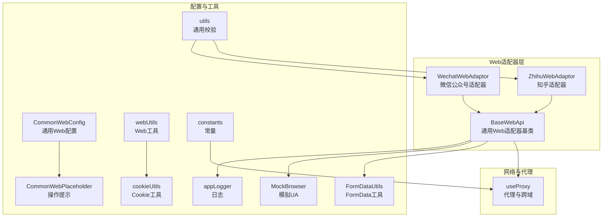
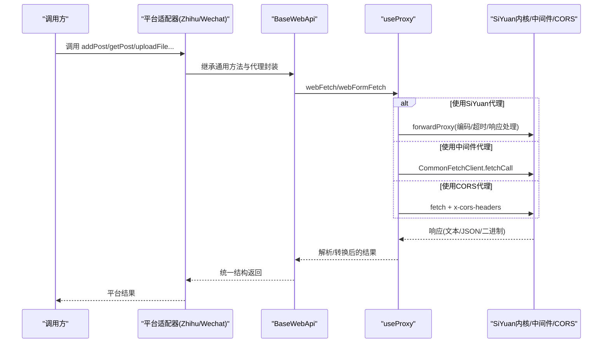
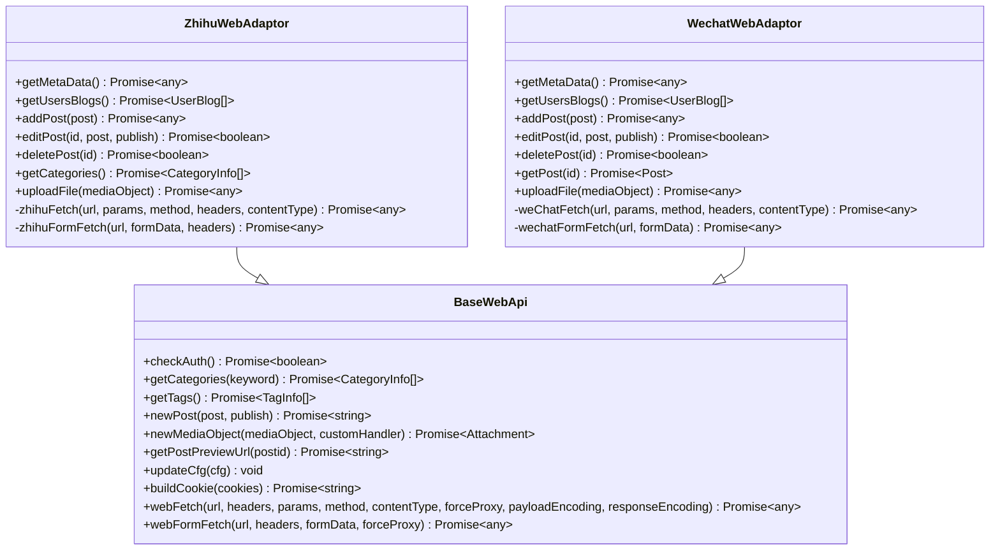
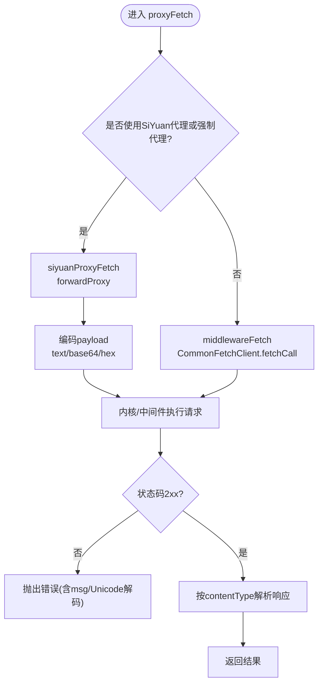
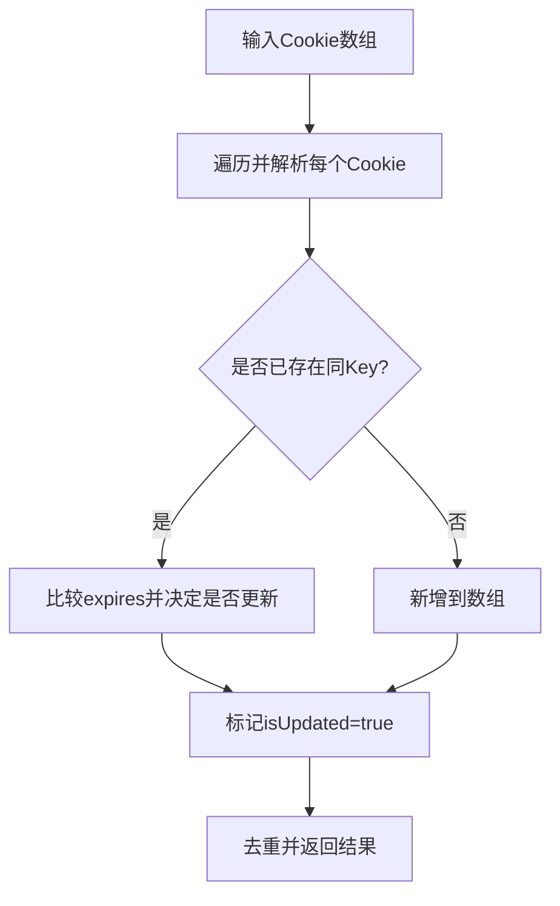
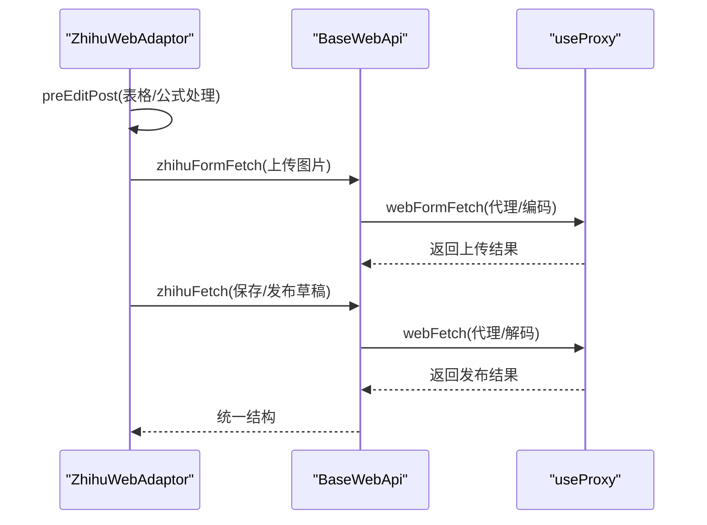
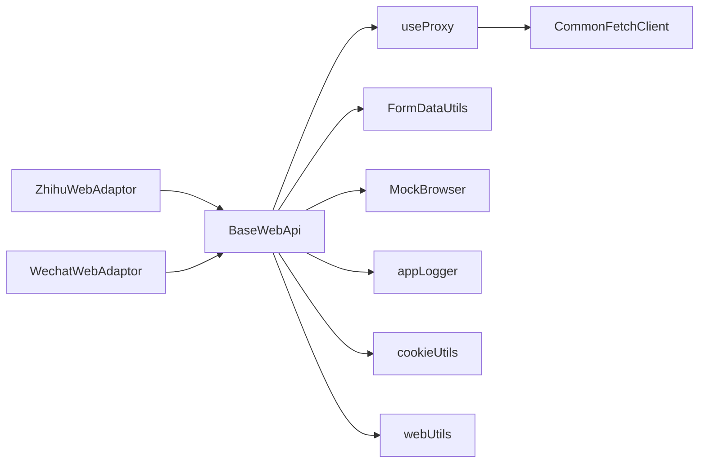

# Web基础架构

<cite>
**本文引用的文件**
- [src/adaptors/web/base/baseWebApi.ts](file://src/adaptors/web/base/baseWebApi.ts)
- [src/adaptors/web/base/commonWebConfig.ts](file://src/adaptors/web/base/commonWebConfig.ts)
- [src/adaptors/web/base/commonWebPlaceholder.ts](file://src/adaptors/web/base/commonWebPlaceholder.ts)
- [src/adaptors/web/base/webUtils.ts](file://src/adaptors/web/base/webUtils.ts)
- [src/adaptors/web/zhihu/zhihuWebAdaptor.ts](file://src/adaptors/web/zhihu/zhihuWebAdaptor.ts)
- [src/adaptors/web/wechat/wechatWebAdaptor.ts](file://src/adaptors/web/wechat/wechatWebAdaptor.ts)
- [src/adaptors/web/zhihu/zhihuUtils.ts](file://src/adaptors/web/zhihu/zhihuUtils.ts)
- [src/composables/useProxy.ts](file://src/composables/useProxy.ts)
- [src/utils/FormDataUtils.ts](file://src/utils/FormDataUtils.ts)
- [src/utils/MockBrowser.ts](file://src/utils/MockBrowser.ts)
- [src/utils/cookieUtils.ts](file://src/utils/cookieUtils.ts)
- [src/utils/BaseErrors.ts](file://src/utils/BaseErrors.ts)
- [src/utils/appLogger.ts](file://src/utils/appLogger.ts)
- [src/utils/utils.ts](file://src/utils/utils.ts)
- [src/utils/constants.ts](file://src/utils/constants.ts)
</cite>

## 目录
1. [简介](#简介)
2. [项目结构](#项目结构)
3. [核心组件](#核心组件)
4. [架构总览](#架构总览)
5. [详细组件分析](#详细组件分析)
6. [依赖关系分析](#依赖关系分析)
7. [性能考量](#性能考量)
8. [故障排查指南](#故障排查指南)
9. [结论](#结论)
10. [附录](#附录)

## 简介
本文件面向“Web平台适配器基础架构”，系统化阐述通用Web适配器的架构设计、基础API接口、公共配置机制，以及Cookie管理、会话保持、跨域处理与安全防护策略。同时提供WebUtils工具函数使用指南、错误处理机制与调试技巧，并总结扩展点与自定义开发规范，帮助开发者快速理解并高效扩展各Web平台适配器。

## 项目结构
Web适配器位于 src/adaptors/web 下，采用“基类 + 平台实现”的分层组织方式：
- 基类与公共能力：baseWebApi.ts、commonWebConfig.ts、commonWebPlaceholder.ts、webUtils.ts
- 平台适配器示例：zhihuWebAdaptor.ts、wechatWebAdaptor.ts 等
- 代理与网络层：useProxy.ts（封装SiYuan内核代理、中间件代理、CORS代理）
- 工具与辅助：FormDataUtils.ts、MockBrowser.ts、cookieUtils.ts、appLogger.ts、constants.ts、utils.ts、BaseErrors.ts

图表来源
- [src/adaptors/web/base/baseWebApi.ts:36-253](file://src/adaptors/web/base/baseWebApi.ts#L36-L253)
- [src/adaptors/web/zhihu/zhihuWebAdaptor.ts:29-456](file://src/adaptors/web/zhihu/zhihuWebAdaptor.ts#L29-L456)
- [src/adaptors/web/wechat/wechatWebAdaptor.ts:29-568](file://src/adaptors/web/wechat/wechatWebAdaptor.ts#L29-L568)
- [src/adaptors/web/base/commonWebConfig.ts:16-44](file://src/adaptors/web/base/commonWebConfig.ts#L16-L44)
- [src/adaptors/web/base/commonWebPlaceholder.ts:15-15](file://src/adaptors/web/base/commonWebPlaceholder.ts#L15-L15)
- [src/adaptors/web/base/webUtils.ts:15-44](file://src/adaptors/web/base/webUtils.ts#L15-L44)
- [src/composables/useProxy.ts:27-318](file://src/composables/useProxy.ts#L27-L318)
- [src/utils/FormDataUtils.ts:19-47](file://src/utils/FormDataUtils.ts#L19-L47)
- [src/utils/MockBrowser.ts:13-36](file://src/utils/MockBrowser.ts#L13-L36)
- [src/utils/cookieUtils.ts:18-116](file://src/utils/cookieUtils.ts#L18-L116)
- [src/utils/appLogger.ts:37-39](file://src/utils/appLogger.ts#L37-L39)
- [src/utils/utils.ts:23-93](file://src/utils/utils.ts#L23-L93)
- [src/utils/constants.ts:10-54](file://src/utils/constants.ts#L10-L54)

章节来源
- [src/adaptors/web/base/baseWebApi.ts:36-253](file://src/adaptors/web/base/baseWebApi.ts#L36-L253)
- [src/adaptors/web/base/commonWebConfig.ts:16-44](file://src/adaptors/web/base/commonWebConfig.ts#L16-L44)
- [src/adaptors/web/base/commonWebPlaceholder.ts:15-15](file://src/adaptors/web/base/commonWebPlaceholder.ts#L15-L15)
- [src/adaptors/web/base/webUtils.ts:15-44](file://src/adaptors/web/base/webUtils.ts#L15-L44)
- [src/adaptors/web/zhihu/zhihuWebAdaptor.ts:29-456](file://src/adaptors/web/zhihu/zhihuWebAdaptor.ts#L29-L456)
- [src/adaptors/web/wechat/wechatWebAdaptor.ts:29-568](file://src/adaptors/web/wechat/wechatWebAdaptor.ts#L29-L568)
- [src/composables/useProxy.ts:27-318](file://src/composables/useProxy.ts#L27-L318)
- [src/utils/FormDataUtils.ts:19-47](file://src/utils/FormDataUtils.ts#L19-L47)
- [src/utils/MockBrowser.ts:13-36](file://src/utils/MockBrowser.ts#L13-L36)
- [src/utils/cookieUtils.ts:18-116](file://src/utils/cookieUtils.ts#L18-L116)
- [src/utils/appLogger.ts:37-39](file://src/utils/appLogger.ts#L37-L39)
- [src/utils/utils.ts:23-93](file://src/utils/utils.ts#L23-L93)
- [src/utils/constants.ts:10-54](file://src/utils/constants.ts#L10-L54)

## 核心组件
- BaseWebApi：Web适配器基类，提供统一的认证检查、分类/标签获取、媒体上传、预览URL生成、Cookie构建、通用fetch封装等能力；内置代理与跨域处理逻辑。
- CommonWebConfig/CommonWebPlaceholder：统一的Web配置模型与操作提示占位符，便于各平台继承与定制。
- useProxy：统一代理入口，支持SiYuan内核代理、中间件代理与CORS代理，自动选择最优路径并处理编码与响应。
- 平台适配器：如ZhihuWebAdaptor、WechatWebAdaptor，基于BaseWebApi扩展具体平台的API差异（如表单上传、特定Headers、UA等）。
- 工具类：webUtils（Cookie读取）、cookieUtils（Cookie数组合并/解析）、FormDataUtils（获取FormData/Blob与专用fetch）、MockBrowser（模拟UA）、appLogger（日志）、utils（适配器校验）、constants（常量）。

章节来源
- [src/adaptors/web/base/baseWebApi.ts:36-253](file://src/adaptors/web/base/baseWebApi.ts#L36-L253)
- [src/adaptors/web/base/commonWebConfig.ts:16-44](file://src/adaptors/web/base/commonWebConfig.ts#L16-L44)
- [src/adaptors/web/base/commonWebPlaceholder.ts:15-15](file://src/adaptors/web/base/commonWebPlaceholder.ts#L15-L15)
- [src/composables/useProxy.ts:27-318](file://src/composables/useProxy.ts#L27-L318)
- [src/adaptors/web/zhihu/zhihuWebAdaptor.ts:29-456](file://src/adaptors/web/zhihu/zhihuWebAdaptor.ts#L29-L456)
- [src/adaptors/web/wechat/wechatWebAdaptor.ts:29-568](file://src/adaptors/web/wechat/wechatWebAdaptor.ts#L29-L568)
- [src/adaptors/web/base/webUtils.ts:15-44](file://src/adaptors/web/base/webUtils.ts#L15-L44)
- [src/utils/cookieUtils.ts:18-116](file://src/utils/cookieUtils.ts#L18-L116)
- [src/utils/FormDataUtils.ts:19-47](file://src/utils/FormDataUtils.ts#L19-L47)
- [src/utils/MockBrowser.ts:13-36](file://src/utils/MockBrowser.ts#L13-L36)
- [src/utils/appLogger.ts:37-39](file://src/utils/appLogger.ts#L37-L39)
- [src/utils/utils.ts:23-93](file://src/utils/utils.ts#L23-L93)
- [src/utils/constants.ts:10-54](file://src/utils/constants.ts#L10-L54)

## 架构总览
Web适配器采用“基类+平台实现+代理层”的三层架构：
- 基类层：封装通用API与网络代理，屏蔽平台差异。
- 平台层：按平台特性扩展API细节（Headers、表单上传、UA、业务流程）。
- 代理层：根据环境与配置自动选择代理或CORS路径，统一处理编码与响应。

图表来源
- [src/adaptors/web/base/baseWebApi.ts:150-248](file://src/adaptors/web/base/baseWebApi.ts#L150-L248)
- [src/composables/useProxy.ts:53-188](file://src/composables/useProxy.ts#L53-L188)

章节来源
- [src/adaptors/web/base/baseWebApi.ts:150-248](file://src/adaptors/web/base/baseWebApi.ts#L150-L248)
- [src/composables/useProxy.ts:53-188](file://src/composables/useProxy.ts#L53-L188)

## 详细组件分析

### BaseWebApi 通用Web适配器基类
- 职责
  - 提供统一的认证检查、分类/标签获取、媒体上传、预览URL生成、Cookie构建等能力。
  - 封装webFetch/webFormFetch，统一代理与跨域处理，支持多种编码与响应类型。
  - 提供updateCfg动态更新配置的能力。
- 关键点
  - 代理选择：优先SiYuan内核代理，其次中间件代理，最后CORS代理；可通过forceProxy强制代理。
  - 编码策略：payloadEncoding与responseEncoding支持text/base64/hex等，满足不同平台需求。
  - 表单上传：webFormFetch在非Siyuan环境中走代理，在Siyuan环境中使用专用FormData fetch以规避限制。
  - Headers与UA：统一注入Cookie与MockBrowser UA，增强兼容性。
- 扩展建议
  - 平台特有API在子类中实现，复用基类代理与工具。
  - 如需特殊预处理，重写preEditPost即可。

图表来源
- [src/adaptors/web/base/baseWebApi.ts:36-253](file://src/adaptors/web/base/baseWebApi.ts#L36-L253)
- [src/adaptors/web/zhihu/zhihuWebAdaptor.ts:29-456](file://src/adaptors/web/zhihu/zhihuWebAdaptor.ts#L29-L456)
- [src/adaptors/web/wechat/wechatWebAdaptor.ts:29-568](file://src/adaptors/web/wechat/wechatWebAdaptor.ts#L29-L568)

章节来源
- [src/adaptors/web/base/baseWebApi.ts:36-253](file://src/adaptors/web/base/baseWebApi.ts#L36-L253)

### 代理与跨域处理（useProxy）
- 代理选择策略
  - isUseSiyuanProxy为真或forceProxy为真时，使用SiYuan内核forwardProxy；否则使用中间件代理（CommonFetchClient）。
  - 当无可用代理且未强制代理时，回退至CORS代理，通过x-cors-headers传递敏感Header。
- 编码与响应
  - 支持payloadEncoding与responseEncoding多格式；JSON/HTML/XML按类型处理；其他类型直接透传。
  - 对CORS代理返回的headers进行二次解析，统一输出结构。
- 异常处理
  - 非2xx状态码抛出错误，优先解析body中的msg字段，否则进行Unicode解码后抛出。

图表来源
- [src/composables/useProxy.ts:53-315](file://src/composables/useProxy.ts#L53-L315)

章节来源
- [src/composables/useProxy.ts:53-315](file://src/composables/useProxy.ts#L53-L315)

### Cookie管理与会话保持
- Cookie构建
  - BaseWebApi.buildCookie将ElectronCookie数组拼接为字符串，供Headers使用。
- Cookie工具
  - cookieUtils：支持Cookie数组合并（按expires比较与强制覆盖）、按key检索、从字符串解析、对象解析等。
  - webUtils：从Cookie字符串读取指定键值。
- 会话保持
  - 平台适配器在请求头中统一注入Cookie，确保登录态持久有效。
  - MockBrowser提供稳定UA，提升平台兼容性。

图表来源
- [src/adaptors/web/base/baseWebApi.ts:86-88](file://src/adaptors/web/base/baseWebApi.ts#L86-L88)
- [src/utils/cookieUtils.ts:28-58](file://src/utils/cookieUtils.ts#L28-L58)
- [src/adaptors/web/base/webUtils.ts:23-40](file://src/adaptors/web/base/webUtils.ts#L23-L40)

章节来源
- [src/adaptors/web/base/baseWebApi.ts:86-88](file://src/adaptors/web/base/baseWebApi.ts#L86-L88)
- [src/utils/cookieUtils.ts:28-58](file://src/utils/cookieUtils.ts#L28-L58)
- [src/adaptors/web/base/webUtils.ts:23-40](file://src/adaptors/web/base/webUtils.ts#L23-L40)

### 平台适配器示例：知乎与微信公众号
- 知乎（ZhihuWebAdaptor）
  - 通过zhihuFetch/zhihuFormFetch封装请求，统一注入Cookie与UA。
  - 图片上传：先MD5计算hash，再结合阿里OSS上传；支持轮询等待处理完成。
  - 正文处理：表格与数学公式转换，适配知乎渲染。
- 微信公众号（WechatWebAdaptor）
  - 通过DOM脚本解析commonData获取token与用户信息，校验登录状态。
  - 表单上传：构造大量字段参数，使用wechatFormFetch提交。
  - 图片上传：拼接带签名的上传URL，上传后返回CDN地址。

图表来源
- [src/adaptors/web/zhihu/zhihuWebAdaptor.ts:131-320](file://src/adaptors/web/zhihu/zhihuWebAdaptor.ts#L131-L320)
- [src/adaptors/web/base/baseWebApi.ts:150-248](file://src/adaptors/web/base/baseWebApi.ts#L150-L248)
- [src/composables/useProxy.ts:53-188](file://src/composables/useProxy.ts#L53-L188)

章节来源
- [src/adaptors/web/zhihu/zhihuWebAdaptor.ts:99-320](file://src/adaptors/web/zhihu/zhihuWebAdaptor.ts#L99-L320)
- [src/adaptors/web/wechat/wechatWebAdaptor.ts:95-493](file://src/adaptors/web/wechat/wechatWebAdaptor.ts#L95-L493)

### 配置机制与占位符
- CommonWebConfig：继承WebConfig，设置主页、API地址、用户名、密码、页面类型、预览URL、功能开关等。
- CommonWebPlaceholder：继承WebPlaceholder，作为平台提示文案占位符。
- 平台适配器通过cfg.password注入Cookie，通过cfg.username等字段承载平台标识。

章节来源
- [src/adaptors/web/base/commonWebConfig.ts:16-44](file://src/adaptors/web/base/commonWebConfig.ts#L16-L44)
- [src/adaptors/web/base/commonWebPlaceholder.ts:15-15](file://src/adaptors/web/base/commonWebPlaceholder.ts#L15-L15)

### WebUtils工具函数使用指南
- 读取Cookie：readCookie(key, cookieString)，从字符串中解析指定键值，解码后返回。
- 适用场景：从Headers或页面脚本中提取Cookie片段，配合BaseWebApi构建完整Cookie。

章节来源
- [src/adaptors/web/base/webUtils.ts:15-44](file://src/adaptors/web/base/webUtils.ts#L15-L44)

### 错误处理机制与调试技巧
- 错误处理
  - useProxy：非2xx状态码统一抛错，优先解析body.msg，否则进行Unicode解码后抛出。
  - 平台适配器：捕获并包装平台特定错误（如知乎/微信公众号的错误信息），保证上层一致的异常语义。
  - BaseError：定义基础错误枚举，便于统一识别。
- 调试技巧
  - 日志：使用createAppLogger输出debug/info/warn/error，开发模式下可结合eruda查看。
  - 代理路径：通过isUseSiyuanProxy与forceProxy切换代理路径，定位问题。
  - 表单上传：在非Siyuan环境中使用base64编码，避免跨域限制；在Siyuan中使用专用FormData fetch。
  - UA与Headers：统一注入Cookie与MockBrowser UA，减少平台反爬干扰。

章节来源
- [src/composables/useProxy.ts:284-295](file://src/composables/useProxy.ts#L284-L295)
- [src/adaptors/web/zhihu/zhihuWebAdaptor.ts:139-141](file://src/adaptors/web/zhihu/zhihuWebAdaptor.ts#L139-L141)
- [src/adaptors/web/wechat/wechatWebAdaptor.ts:226-228](file://src/adaptors/web/wechat/wechatWebAdaptor.ts#L226-L228)
- [src/utils/BaseErrors.ts:13-18](file://src/utils/BaseErrors.ts#L13-L18)
- [src/utils/appLogger.ts:37-39](file://src/utils/appLogger.ts#L37-L39)

## 依赖关系分析
- 组件耦合
  - 平台适配器强依赖BaseWebApi提供的代理与工具；弱依赖useProxy与工具类。
  - BaseWebApi依赖useProxy、FormDataUtils、MockBrowser、appLogger等。
- 外部依赖
  - zhi-blog-api：WebApi、WebConfig、WebPlaceholder、BlogConfig、Post、MediaObject等类型。
  - zhi-fetch-middleware：CommonFetchClient中间件代理。
  - simple-xmlrpc：XML-RPC序列化与反序列化。
  - lodash-es、cheerio、crypto-js等第三方库。

图表来源
- [src/adaptors/web/base/baseWebApi.ts:36-253](file://src/adaptors/web/base/baseWebApi.ts#L36-L253)
- [src/adaptors/web/zhihu/zhihuWebAdaptor.ts:29-456](file://src/adaptors/web/zhihu/zhihuWebAdaptor.ts#L29-L456)
- [src/adaptors/web/wechat/wechatWebAdaptor.ts:29-568](file://src/adaptors/web/wechat/wechatWebAdaptor.ts#L29-L568)
- [src/composables/useProxy.ts:38-95](file://src/composables/useProxy.ts#L38-L95)
- [src/utils/FormDataUtils.ts:19-47](file://src/utils/FormDataUtils.ts#L19-L47)
- [src/utils/MockBrowser.ts:13-36](file://src/utils/MockBrowser.ts#L13-L36)
- [src/utils/cookieUtils.ts:18-116](file://src/utils/cookieUtils.ts#L18-L116)
- [src/adaptors/web/base/webUtils.ts:15-44](file://src/adaptors/web/base/webUtils.ts#L15-L44)

章节来源
- [src/adaptors/web/base/baseWebApi.ts:36-253](file://src/adaptors/web/base/baseWebApi.ts#L36-L253)
- [src/composables/useProxy.ts:38-95](file://src/composables/useProxy.ts#L38-L95)

## 性能考量
- 代理路径选择
  - 在SiYuan环境中优先使用forwardProxy，减少CORS与跨域开销。
  - 非SiYuan环境使用base64编码传输，避免复杂Multipart解析成本。
- 编码策略
  - payloadEncoding与responseEncoding按需选择，避免不必要的解码/编码。
- 图片上传
  - 知乎采用MD5哈希与OSS直传，减少中间环节；轮询等待处理完成时注意节流与超时控制。
- 日志与调试
  - 开发模式开启详细日志，生产模式关闭或降级，避免影响性能。

## 故障排查指南
- 常见问题
  - 登录失效：检查cfg.password是否正确，Headers中Cookie是否注入。
  - 跨域失败：确认isUseSiyuanProxy与corsProxyUrl配置，必要时使用forceProxy。
  - 表单上传失败：在非Siyuan环境使用base64编码；在Siyuan环境使用专用FormData fetch。
  - 平台特定错误：查看平台适配器抛出的错误信息，定位API调用参数与Headers。
- 排查步骤
  - 打开日志，观察proxyFetch/webFetch/webFormFetch调用链路。
  - 切换代理路径，确认是否为代理层问题。
  - 校验Cookie数组合并逻辑，确保expires较新的Cookie生效。
  - 检查UA与Headers，确保符合平台要求。

章节来源
- [src/composables/useProxy.ts:129-188](file://src/composables/useProxy.ts#L129-L188)
- [src/utils/cookieUtils.ts:28-58](file://src/utils/cookieUtils.ts#L28-L58)
- [src/adaptors/web/base/baseWebApi.ts:150-248](file://src/adaptors/web/base/baseWebApi.ts#L150-L248)

## 结论
Web适配器基础架构通过“基类+平台实现+代理层”的清晰分层，实现了跨平台的一致性与可扩展性。借助统一的代理与跨域处理、完善的Cookie管理与会话保持、以及丰富的工具与日志体系，开发者可以快速扩展新的Web平台适配器，并在复杂网络环境下稳定运行。

## 附录

### 扩展点与自定义开发规范
- 继承BaseWebApi
  - 实现平台特有API：getMetaData、addPost、editPost、deletePost、uploadFile等。
  - 复用webFetch/webFormFetch与代理层，避免重复造轮子。
- 配置与占位符
  - 使用CommonWebConfig初始化基础配置；在平台适配器中补充平台特有字段。
  - 使用CommonWebPlaceholder提供用户提示文案。
- Cookie与Headers
  - 通过cfg.password注入Cookie；统一注入MockBrowser UA。
  - 使用cookieUtils与webUtils进行Cookie解析与读取。
- 表单上传
  - 非Siyuan环境：使用webFormFetch并设置payloadEncoding为base64。
  - Siyuan环境：使用FormDataUtils获取专用fetch，避免跨域限制。
- 错误处理
  - 平台适配器内部捕获并包装错误；遵循统一的错误语义。
  - 使用appLogger输出调试信息，便于定位问题。

章节来源
- [src/adaptors/web/base/baseWebApi.ts:36-253](file://src/adaptors/web/base/baseWebApi.ts#L36-L253)
- [src/adaptors/web/base/commonWebConfig.ts:16-44](file://src/adaptors/web/base/commonWebConfig.ts#L16-L44)
- [src/adaptors/web/base/commonWebPlaceholder.ts:15-15](file://src/adaptors/web/base/commonWebPlaceholder.ts#L15-L15)
- [src/adaptors/web/base/webUtils.ts:15-44](file://src/adaptors/web/base/webUtils.ts#L15-L44)
- [src/utils/cookieUtils.ts:18-116](file://src/utils/cookieUtils.ts#L18-L116)
- [src/utils/FormDataUtils.ts:19-47](file://src/utils/FormDataUtils.ts#L19-L47)
- [src/utils/MockBrowser.ts:13-36](file://src/utils/MockBrowser.ts#L13-L36)
- [src/utils/appLogger.ts:37-39](file://src/utils/appLogger.ts#L37-L39)
- [src/utils/utils.ts:23-93](file://src/utils/utils.ts#L23-L93)