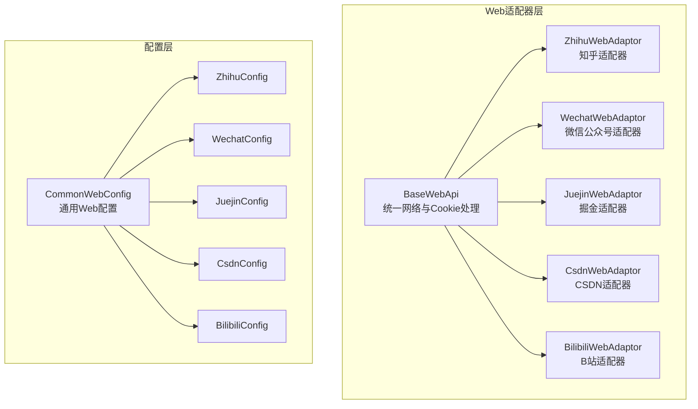
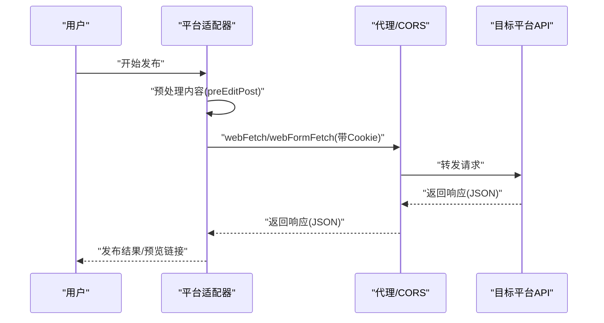
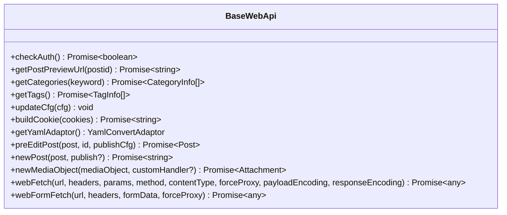
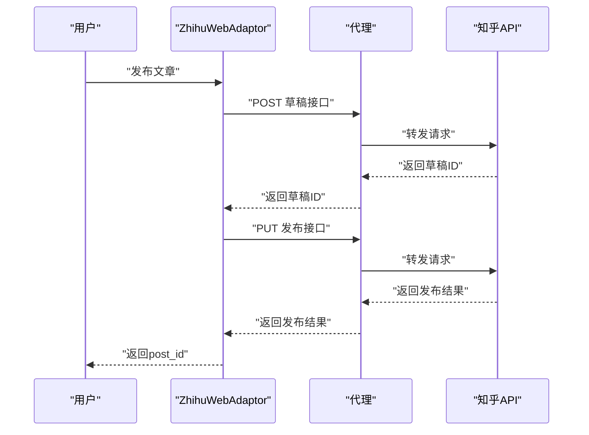
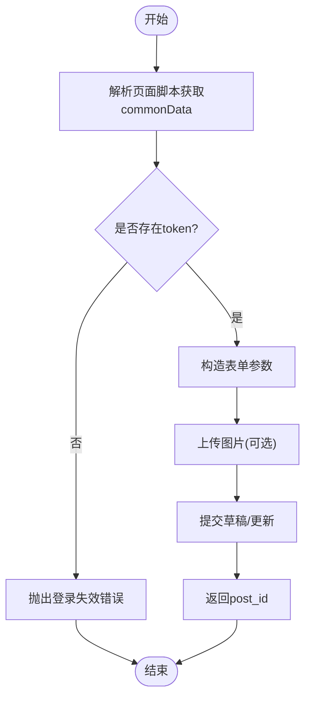
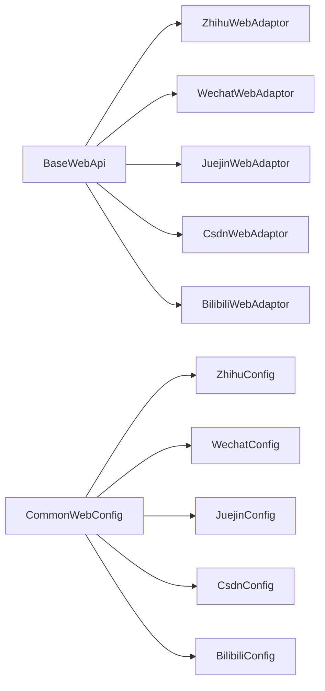

# Web平台适配器

<cite>
**本文档引用的文件**
- [baseWebApi.ts](file://src/adaptors/web/base/baseWebApi.ts)
- [commonWebConfig.ts](file://src/adaptors/web/base/commonWebConfig.ts)
- [webUtils.ts](file://src/adaptors/web/base/webUtils.ts)
- [zhihuWebAdaptor.ts](file://src/adaptors/web/zhihu/zhihuWebAdaptor.ts)
- [zhihuConfig.ts](file://src/adaptors/web/zhihu/zhihuConfig.ts)
- [wechatWebAdaptor.ts](file://src/adaptors/web/wechat/wechatWebAdaptor.ts)
- [wechatConfig.ts](file://src/adaptors/web/wechat/wechatConfig.ts)
- [juejinWebAdaptor.ts](file://src/adaptors/web/juejin/juejinWebAdaptor.ts)
- [juejinConfig.ts](file://src/adaptors/web/juejin/juejinConfig.ts)
- [csdnWebAdaptor.ts](file://src/adaptors/web/csdn/csdnWebAdaptor.ts)
- [csdnConfig.ts](file://src/adaptors/web/csdn/csdnConfig.ts)
- [bilibiliWebAdaptor.ts](file://src/adaptors/web/bilibili/bilibiliWebAdaptor.ts)
- [bilibiliConfig.ts](file://src/adaptors/web/bilibili/bilibiliConfig.ts)
- [README_zh_CN.md](file://README_zh_CN.md)
</cite>

## 目录
1. [简介](#简介)
2. [项目结构](#项目结构)
3. [核心组件](#核心组件)
4. [架构概览](#架构概览)
5. [详细组件分析](#详细组件分析)
6. [依赖关系分析](#依赖关系分析)
7. [性能考量](#性能考量)
8. [故障排除指南](#故障排除指南)
9. [结论](#结论)

## 简介
本项目是一个面向Web平台的适配器系统，专注于将内容从思源笔记发布到多个社交媒体与内容社区平台。适配器遵循统一的Web API接口，通过Cookie认证与平台特定的请求协议完成登录、内容发布、图片上传与预览等功能。本文档深入解释Web平台的特殊适配需求，涵盖登录认证、内容格式转换、图片处理机制、Cookie管理与会话保持策略，并提供跨域处理与安全考虑的解决方案。

## 项目结构
Web平台适配器位于 `src/adaptors/web/` 目录下，采用“平台专属适配器 + 通用基类”的分层设计：
- 通用基类：`baseWebApi.ts` 提供统一的网络请求、Cookie构建、媒体上传与代理转发能力
- 平台配置：`commonWebConfig.ts` 定义通用Web配置项，各平台在自身配置类中继承并覆盖特性
- 平台适配器：按平台划分目录，如知乎(zhihu)、微信公众号(wechat)、掘金(juejin)、CSDN(csdn)、B站(bilibili)

**图表来源**
- [baseWebApi.ts:36-256](file://src/adaptors/web/base/baseWebApi.ts#L36-L256)
- [commonWebConfig.ts:16-45](file://src/adaptors/web/base/commonWebConfig.ts#L16-L45)
- [zhihuWebAdaptor.ts:29-459](file://src/adaptors/web/zhihu/zhihuWebAdaptor.ts#L29-L459)
- [wechatWebAdaptor.ts:29-571](file://src/adaptors/web/wechat/wechatWebAdaptor.ts#L29-L571)
- [juejinWebAdaptor.ts:22-369](file://src/adaptors/web/juejin/juejinWebAdaptor.ts#L22-L369)
- [csdnWebAdaptor.ts:25-558](file://src/adaptors/web/csdn/csdnWebAdaptor.ts#L25-L558)
- [bilibiliWebAdaptor.ts:26-517](file://src/adaptors/web/bilibili/bilibiliWebAdaptor.ts#L26-L517)

**章节来源**
- [baseWebApi.ts:36-256](file://src/adaptors/web/base/baseWebApi.ts#L36-L256)
- [commonWebConfig.ts:16-45](file://src/adaptors/web/base/commonWebConfig.ts#L16-L45)

## 核心组件
- BaseWebApi：提供统一的网络请求方法(webFetch/webFormFetch)、Cookie构建(buildCookie)、媒体上传(newMediaObject)、预处理(preEditPost)等能力；内置代理与CORS处理逻辑，确保跨域场景下的稳定访问
- CommonWebConfig：定义平台通用配置项，如首页、API地址、页面类型、密码类型、预览URL、标签/分类开关等
- 平台适配器：在各自适配器中实现平台特有的登录校验(getMetaData)、内容发布(addPost/editPost)、图片上传(uploadFile)、分类/标签获取(getCategories/getTags)等

**章节来源**
- [baseWebApi.ts:86-248](file://src/adaptors/web/base/baseWebApi.ts#L86-L248)
- [commonWebConfig.ts:16-45](file://src/adaptors/web/base/commonWebConfig.ts#L16-L45)

## 架构概览
Web平台适配器的整体工作流如下：
- 登录认证：通过平台提供的登录页面或API进行登录，获取Cookie；适配器以Cookie作为认证载体
- 内容预处理：在发布前对Markdown/HTML进行平台特定的格式转换
- 发布流程：构造平台API所需的参数，调用webFetch或webFormFetch发起请求
- 图片处理：根据平台要求生成签名或直传，返回可访问的URL
- 预览与管理：生成预览链接，支持查询、编辑、删除操作

**图表来源**
- [baseWebApi.ts:150-248](file://src/adaptors/web/base/baseWebApi.ts#L150-L248)
- [zhihuWebAdaptor.ts:131-165](file://src/adaptors/web/zhihu/zhihuWebAdaptor.ts#L131-L165)
- [wechatWebAdaptor.ts:95-234](file://src/adaptors/web/wechat/wechatWebAdaptor.ts#L95-L234)
- [juejinWebAdaptor.ts:74-136](file://src/adaptors/web/juejin/juejinWebAdaptor.ts#L74-L136)
- [csdnWebAdaptor.ts:157-204](file://src/adaptors/web/csdn/csdnWebAdaptor.ts#L157-L204)
- [bilibiliWebAdaptor.ts:87-219](file://src/adaptors/web/bilibili/bilibiliWebAdaptor.ts#L87-L219)

## 详细组件分析

### 基类：BaseWebApi
- 统一网络请求
  - webFetch：支持JSON与表单请求，自动选择代理或CORS路径，支持payload/response编码
  - webFormFetch：针对FormData场景的封装，自动处理Base64编解码与浏览器环境差异
- Cookie管理
  - buildCookie：将ElectronCookie数组拼接为Cookie字符串
  - WebUtils：提供从Cookie字符串读取指定键值的能力
- 媒体上传
  - newMediaObject：统一媒体对象返回结构，便于上层使用
- 预处理与兼容
  - preEditPost：调用基类扩展适配器进行通用预处理
  - newPost：兼容旧版API，统一返回post_id

**图表来源**
- [baseWebApi.ts:36-256](file://src/adaptors/web/base/baseWebApi.ts#L36-L256)

**章节来源**
- [baseWebApi.ts:86-248](file://src/adaptors/web/base/baseWebApi.ts#L86-L248)
- [webUtils.ts:15-44](file://src/adaptors/web/base/webUtils.ts#L15-L44)

### 配置基类：CommonWebConfig
- 定义平台通用字段：home、apiUrl、username、password、middlewareUrl、previewUrl、pageType、密码类型等
- 控制平台特性开关：tagEnabled、cateEnabled、knowledgeSpaceEnabled、allowPreviewUrlChange等
- 占位符：placeholder用于UI提示文案

**章节来源**
- [commonWebConfig.ts:16-45](file://src/adaptors/web/base/commonWebConfig.ts#L16-L45)

### 知乎适配器：ZhihuWebAdaptor
- 登录校验：通过API获取当前用户元数据，判断登录状态
- 内容发布：先保存为草稿，再执行发布；支持设置评论权限、目录等
- 内容格式：对表格与数学公式进行平台化处理
- 图片上传：计算图片哈希，调用平台图片接口，必要时通过OSS直传
- 预览链接：生成专栏文章链接

**图表来源**
- [zhihuWebAdaptor.ts:131-165](file://src/adaptors/web/zhihu/zhihuWebAdaptor.ts#L131-L165)

**章节来源**
- [zhihuWebAdaptor.ts:43-165](file://src/adaptors/web/zhihu/zhihuWebAdaptor.ts#L43-L165)
- [zhihuConfig.ts:16-39](file://src/adaptors/web/zhihu/zhihuConfig.ts#L16-L39)

### 微信公众号适配器：WechatWebAdaptor
- 登录校验：解析页面脚本中的commonData，提取token与用户信息
- 内容发布：构造大量表单参数，调用后台接口创建/更新草稿
- 图片上传：通过平台提供的上传接口，附带ticket、token、seq等参数
- 预览链接：基于token与文章ID生成编辑链接

**图表来源**
- [wechatWebAdaptor.ts:30-93](file://src/adaptors/web/wechat/wechatWebAdaptor.ts#L30-L93)

**章节来源**
- [wechatWebAdaptor.ts:30-493](file://src/adaptors/web/wechat/wechatWebAdaptor.ts#L30-L493)
- [wechatConfig.ts:16-33](file://src/adaptors/web/wechat/wechatConfig.ts#L16-L33)

### 掘金适配器：JuejinWebAdaptor
- 登录校验：调用用户信息接口，校验返回数据
- 内容发布：先创建草稿，再调用发布接口；支持分类与标签选择
- 摘要处理：对摘要长度进行规范，满足平台要求
- 预览链接：从配置中替换占位符

**章节来源**
- [juejinWebAdaptor.ts:23-203](file://src/adaptors/web/juejin/juejinWebAdaptor.ts#L23-L203)
- [juejinConfig.ts:16-38](file://src/adaptors/web/juejin/juejinConfig.ts#L16-L38)

### CSDN适配器：CsdnWebAdaptor
- 登录校验：调用用户信息接口
- 内容发布：支持Markdown与HTML混合内容，构造多处参数
- 图片上传：支持两种签名直传流程，验证文件扩展名
- 预览链接：从Cookie中解析用户ID，动态替换占位符

**章节来源**
- [csdnWebAdaptor.ts:39-303](file://src/adaptors/web/csdn/csdnWebAdaptor.ts#L39-L303)
- [csdnConfig.ts:16-34](file://src/adaptors/web/csdn/csdnConfig.ts#L16-L34)

### B站适配器：BilibiliWebAdaptor
- 登录校验：调用用户电子钱包接口，判断登录状态
- 内容发布：解析Markdown为平台专用结构，构造opus_req参数
- 图片上传：上传封面图，返回URL
- 编辑限制：当编辑次数用尽时自动保存为草稿
- 预览链接：从postid中解析动态ID

**章节来源**
- [bilibiliWebAdaptor.ts:29-392](file://src/adaptors/web/bilibili/bilibiliWebAdaptor.ts#L29-L392)
- [bilibiliConfig.ts:19-52](file://src/adaptors/web/bilibili/bilibiliConfig.ts#L19-L52)

## 依赖关系分析
- 适配器依赖关系
  - 所有平台适配器均继承BaseWebApi，复用网络与Cookie处理能力
  - 平台配置类继承CommonWebConfig，统一配置项与特性开关
- 外部依赖
  - 代理与CORS：通过useProxy与webFetch/webFormFetch实现跨域访问
  - 图片上传：部分平台使用OSS直传，需正确设置签名与回调参数
  - 用户代理：MockBrowser提供User-Agent模拟，避免平台反爬策略

**图表来源**
- [baseWebApi.ts:36-256](file://src/adaptors/web/base/baseWebApi.ts#L36-L256)
- [commonWebConfig.ts:16-45](file://src/adaptors/web/base/commonWebConfig.ts#L16-L45)
- [zhihuWebAdaptor.ts:29-459](file://src/adaptors/web/zhihu/zhihuWebAdaptor.ts#L29-L459)
- [wechatWebAdaptor.ts:29-571](file://src/adaptors/web/wechat/wechatWebAdaptor.ts#L29-L571)
- [juejinWebAdaptor.ts:22-369](file://src/adaptors/web/juejin/juejinWebAdaptor.ts#L22-L369)
- [csdnWebAdaptor.ts:25-558](file://src/adaptors/web/csdn/csdnWebAdaptor.ts#L25-L558)
- [bilibiliWebAdaptor.ts:26-517](file://src/adaptors/web/bilibili/bilibiliWebAdaptor.ts#L26-L517)

**章节来源**
- [baseWebApi.ts:36-256](file://src/adaptors/web/base/baseWebApi.ts#L36-L256)
- [commonWebConfig.ts:16-45](file://src/adaptors/web/base/commonWebConfig.ts#L16-L45)

## 性能考量
- 代理与CORS选择
  - 当存在可用代理时优先使用代理路径，减少CORS带来的额外开销
  - 对于表单上传，优先使用webFormFetch以避免Base64编解码成本
- 图片上传优化
  - 仅在必要时进行签名直传，避免重复签名与网络往返
  - 对大文件上传建议分块或压缩，减少传输时间
- 内容预处理
  - 在适配器中尽量一次性完成格式转换，减少重复处理
- 缓存与重试
  - 对频繁调用的列表接口可增加缓存策略，降低平台压力
  - 对临时性错误可增加指数退避重试，提升成功率

## 故障排除指南
- 登录失效
  - 症状：平台返回未登录或token过期
  - 处理：重新登录获取最新Cookie，更新配置；检查Cookie有效期与作用域
- 跨域与CORS错误
  - 症状：浏览器报跨域错误或代理不可用
  - 处理：确认middlewareUrl与corsAnywhereUrl配置；在webFetch中强制使用代理
- 图片上传失败
  - 症状：签名失败、直传失败或返回错误信息
  - 处理：检查签名参数、回调配置与文件扩展名；确认OSS服务可用
- 发布参数错误
  - 症状：平台返回参数校验失败
  - 处理：核对适配器中构造的参数结构与必填字段；参考平台文档逐项比对
- 编辑限制
  - 症状：编辑次数用尽，无法直接更新
  - 处理：自动保存为草稿，等待次日恢复或手动处理草稿

**章节来源**
- [baseWebApi.ts:150-248](file://src/adaptors/web/base/baseWebApi.ts#L150-L248)
- [wechatWebAdaptor.ts:411-437](file://src/adaptors/web/wechat/wechatWebAdaptor.ts#L411-L437)
- [bilibiliWebAdaptor.ts:261-275](file://src/adaptors/web/bilibili/bilibiliWebAdaptor.ts#L261-L275)

## 结论
Web平台适配器通过统一的基类与平台化的适配器实现了对多个社交媒体与内容社区的高效集成。其核心优势在于：
- 统一的网络与Cookie处理，简化跨域与认证复杂度
- 平台特定的内容与图片处理，保证发布质量与兼容性
- 可扩展的配置体系，便于新增平台与调整特性

在实际使用中，建议重点关注Cookie管理、跨域代理与图片直传策略，并结合平台特性进行参数与格式的适配，以获得最佳的发布体验。