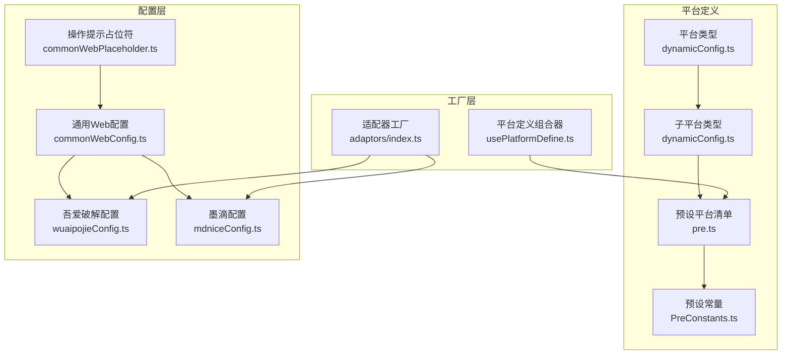
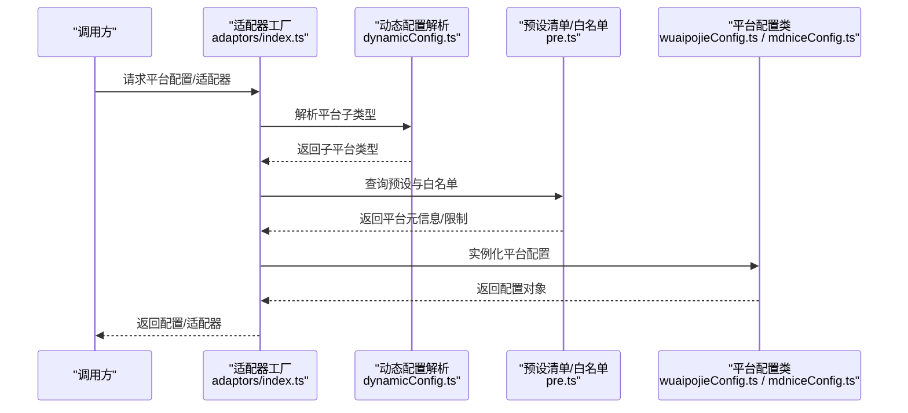
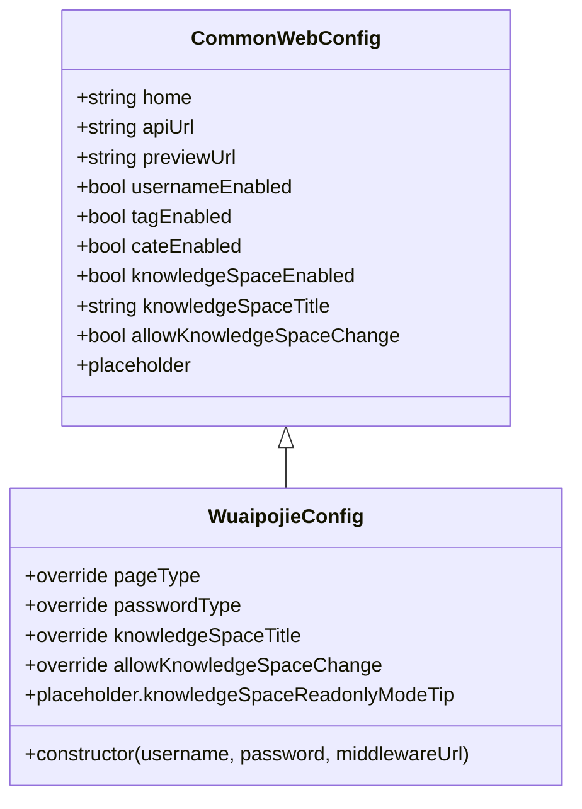
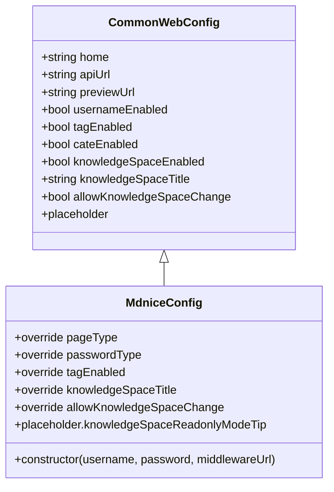
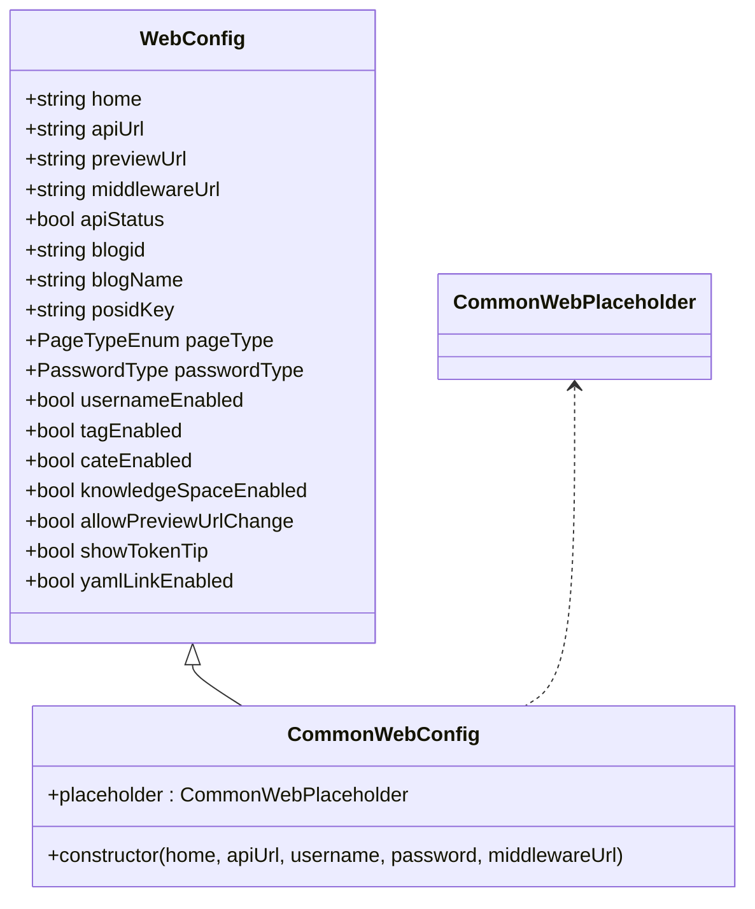
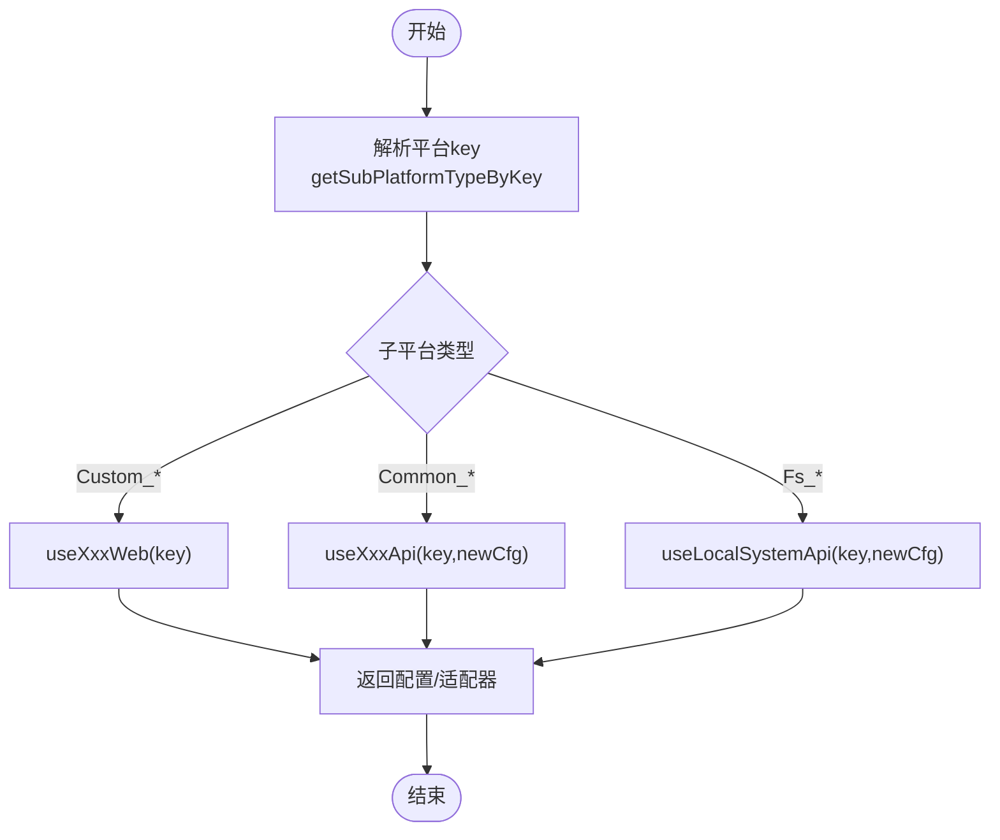
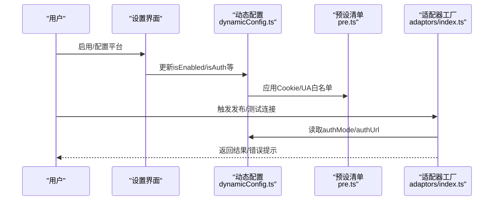
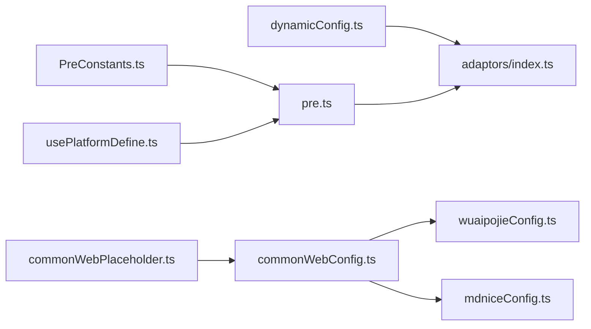

# 专业平台

<cite>
**本文引用的文件**
- [src/adaptors/web/wuaipojie/wuaipojieConfig.ts](file://src/adaptors/web/wuaipojie/wuaipojieConfig.ts)
- [src/adaptors/web/mdnice/mdniceConfig.ts](file://src/adaptors/web/mdnice/mdniceConfig.ts)
- [src/adaptors/web/base/commonWebConfig.ts](file://src/adaptors/web/base/commonWebConfig.ts)
- [src/adaptors/web/base/commonWebPlaceholder.ts](file://src/adaptors/web/base/commonWebPlaceholder.ts)
- [src/adaptors/index.ts](file://src/adaptors/index.ts)
- [src/platforms/pre.ts](file://src/platforms/pre.ts)
- [src/platforms/dynamicConfig.ts](file://src/platforms/dynamicConfig.ts)
- [src/platforms/PreConstants.ts](file://src/platforms/PreConstants.ts)
- [src/composables/usePlatformDefine.ts](file://src/composables/usePlatformDefine.ts)
- [src/models/platformMetadata.ts](file://src/models/platformMetadata.ts)
- [src/utils/EnvUtil.ts](file://src/utils/EnvUtil.ts)
</cite>

## 目录
1. [简介](#简介)
2. [项目结构](#项目结构)
3. [核心组件](#核心组件)
4. [架构总览](#架构总览)
5. [详细组件分析](#详细组件分析)
6. [依赖关系分析](#依赖关系分析)
7. [性能考量](#性能考量)
8. [故障排查指南](#故障排查指南)
9. [结论](#结论)
10. [附录](#附录)

## 简介
本文件面向“专业平台适配器”的技术文档，聚焦于 wuaipojie（吾爱破解）与 mdnice（墨滴）两大专业平台在本项目中的适配实现。文档将从架构设计、配置模型、API/网站授权集成、认证与权限管理、数据同步机制、性能优化与扩展性等方面进行系统化阐述，并提供可视化图示帮助读者快速理解。

## 项目结构
围绕“专业平台适配器”，本项目采用“平台类型 + 子平台类型 + 配置 + 适配器工厂”的分层组织方式：
- 平台类型与子类型：通过动态配置枚举定义平台族谱，如 Custom（自定义网站类）、Github/Gitlab（静态站点类）等。
- 配置层：每个平台提供独立的配置类，继承通用 Web 配置基类，覆盖页面类型、密码类型、知识空间、占位提示等特性。
- 工厂层：统一对外暴露 getCfg/getAdaptor/getYamlAdaptor，按平台 key 解析并返回对应配置或适配器实例。
- 预设与白名单：平台预设清单、Cookie/UA 限制与白名单、额外脚本等，保障跨域与浏览器行为兼容。

**图表来源**
- [src/platforms/dynamicConfig.ts:174-238](file://src/platforms/dynamicConfig.ts#L174-L238)
- [src/platforms/pre.ts:101-438](file://src/platforms/pre.ts#L101-L438)
- [src/platforms/PreConstants.ts:10-19](file://src/platforms/PreConstants.ts#L10-L19)
- [src/adaptors/web/base/commonWebConfig.ts:16-44](file://src/adaptors/web/base/commonWebConfig.ts#L16-L44)
- [src/adaptors/web/wuaipojie/wuaipojieConfig.ts:16-32](file://src/adaptors/web/wuaipojie/wuaipojieConfig.ts#L16-L32)
- [src/adaptors/web/mdnice/mdniceConfig.ts:16-32](file://src/adaptors/web/mdnice/mdniceConfig.ts#L16-L32)
- [src/adaptors/web/base/commonWebPlaceholder.ts:15-16](file://src/adaptors/web/base/commonWebPlaceholder.ts#L15-L16)
- [src/adaptors/index.ts:56-263](file://src/adaptors/index.ts#L56-L263)
- [src/composables/usePlatformDefine.ts:18-82](file://src/composables/usePlatformDefine.ts#L18-L82)

**章节来源**
- [src/platforms/dynamicConfig.ts:174-238](file://src/platforms/dynamicConfig.ts#L174-L238)
- [src/platforms/pre.ts:101-438](file://src/platforms/pre.ts#L101-L438)
- [src/platforms/PreConstants.ts:10-19](file://src/platforms/PreConstants.ts#L10-L19)
- [src/adaptors/web/base/commonWebConfig.ts:16-44](file://src/adaptors/web/base/commonWebConfig.ts#L16-L44)
- [src/adaptors/web/wuaipojie/wuaipojieConfig.ts:16-32](file://src/adaptors/web/wuaipojie/wuaipojieConfig.ts#L16-L32)
- [src/adaptors/web/mdnice/mdniceConfig.ts:16-32](file://src/adaptors/web/mdnice/mdniceConfig.ts#L16-L32)
- [src/adaptors/web/base/commonWebPlaceholder.ts:15-16](file://src/adaptors/web/base/commonWebPlaceholder.ts#L15-L16)
- [src/adaptors/index.ts:56-263](file://src/adaptors/index.ts#L56-L263)
- [src/composables/usePlatformDefine.ts:18-82](file://src/composables/usePlatformDefine.ts#L18-L82)

## 核心组件
- 平台类型与子类型：通过枚举定义平台族谱，支持通用平台、静态站点、Metaweblog、WordPress、自定义网站、文件系统、系统内置等。
- 动态配置：承载平台启用状态、授权模式、登录/退出地址、域名、Cookie 限制、是否内置、额外脚本等元信息。
- 通用 Web 配置：抽象出主页、API 地址、页面类型、密码类型、知识空间、占位提示等公共能力。
- 专业平台配置：wuaipojie 与 mdnice 继承通用配置，覆盖页面类型、密码类型、标签/分类/知识空间开关、只读提示等。
- 适配器工厂：根据平台 key 返回配置或适配器实例，屏蔽平台差异。
- 预设与白名单：集中管理 Cookie/UA 限制、登录地址、域名、额外脚本等，确保跨域与浏览器行为兼容。

**章节来源**
- [src/platforms/dynamicConfig.ts:13-113](file://src/platforms/dynamicConfig.ts#L13-L113)
- [src/adaptors/web/base/commonWebConfig.ts:16-44](file://src/adaptors/web/base/commonWebConfig.ts#L16-L44)
- [src/adaptors/web/wuaipojie/wuaipojieConfig.ts:16-32](file://src/adaptors/web/wuaipojie/wuaipojieConfig.ts#L16-L32)
- [src/adaptors/web/mdnice/mdniceConfig.ts:16-32](file://src/adaptors/web/mdnice/mdniceConfig.ts#L16-L32)
- [src/adaptors/index.ts:56-263](file://src/adaptors/index.ts#L56-L263)
- [src/platforms/pre.ts:20-45](file://src/platforms/pre.ts#L20-L45)

## 架构总览
下图展示“平台类型 → 子平台类型 → 配置 → 适配器”的解析链路，以及预设清单与白名单对适配过程的影响。

**图表来源**
- [src/adaptors/index.ts:56-263](file://src/adaptors/index.ts#L56-L263)
- [src/platforms/dynamicConfig.ts:397-418](file://src/platforms/dynamicConfig.ts#L397-L418)
- [src/platforms/pre.ts:20-45](file://src/platforms/pre.ts#L20-L45)
- [src/adaptors/web/wuaipojie/wuaipojieConfig.ts:16-32](file://src/adaptors/web/wuaipojie/wuaipojieConfig.ts#L16-L32)
- [src/adaptors/web/mdnice/mdniceConfig.ts:16-32](file://src/adaptors/web/mdnice/mdniceConfig.ts#L16-L32)

## 详细组件分析

### 吾爱破解（wuaipojie）适配器
- 配置要点
  - 主页与 API 地址：明确站点与接口根地址。
  - 页面类型：HTML 页面。
  - 密码类型：Cookie 类型，需以 Cookie 方式鉴权。
  - 用户名字段：启用用户名输入。
  - 标签/分类：不支持。
  - 知识空间：启用；标题为“帖子”；单选类型；不允许切换。
  - 预览链接模板：基于 threadid 的模板。
  - 占位提示：在只读模式下给出不可编辑所属帖子的提示。
- 适用场景
  - 需要将内容发布到“吾爱破解”论坛的帖子中，且受其 Cookie 鉴权与知识空间限制。
- 关键实现参考
  - 配置类继承通用 Web 配置，覆盖页面类型、密码类型、知识空间等属性。
  - 工厂层通过子平台类型映射到具体配置类。

**图表来源**
- [src/adaptors/web/base/commonWebConfig.ts:16-44](file://src/adaptors/web/base/commonWebConfig.ts#L16-L44)
- [src/adaptors/web/wuaipojie/wuaipojieConfig.ts:16-32](file://src/adaptors/web/wuaipojie/wuaipojieConfig.ts#L16-L32)

**章节来源**
- [src/adaptors/web/wuaipojie/wuaipojieConfig.ts:16-32](file://src/adaptors/web/wuaipojie/wuaipojieConfig.ts#L16-L32)
- [src/adaptors/web/base/commonWebConfig.ts:16-44](file://src/adaptors/web/base/commonWebConfig.ts#L16-L44)
- [src/adaptors/index.ts:56-263](file://src/adaptors/index.ts#L56-L263)

### 墨滴（mdnice）适配器
- 配置要点
  - 主页与 API 地址：明确站点与接口根地址。
  - 页面类型：HTML 页面。
  - 密码类型：Cookie 类型，需以 Cookie 方式鉴权。
  - 用户名字段：启用用户名输入。
  - 标签：支持标签。
  - 分类：不支持。
  - 知识空间：启用；标题为“文章”；单选类型；不允许切换。
  - 预览链接模板：基于 postid 的模板。
  - 占位提示：在只读模式下给出不可编辑所属文章的提示。
- 适用场景
  - 需要将内容发布到“墨滴”平台的文章中，且受其 Cookie 鉴权与知识空间限制。
- 关键实现参考
  - 配置类继承通用 Web 配置，覆盖页面类型、密码类型、标签支持、知识空间等属性。
  - 工厂层通过子平台类型映射到具体配置类。

**图表来源**
- [src/adaptors/web/base/commonWebConfig.ts:16-44](file://src/adaptors/web/base/commonWebConfig.ts#L16-L44)
- [src/adaptors/web/mdnice/mdniceConfig.ts:16-32](file://src/adaptors/web/mdnice/mdniceConfig.ts#L16-L32)

**章节来源**
- [src/adaptors/web/mdnice/mdniceConfig.ts:16-32](file://src/adaptors/web/mdnice/mdniceConfig.ts#L16-L32)
- [src/adaptors/web/base/commonWebConfig.ts:16-44](file://src/adaptors/web/base/commonWebConfig.ts#L16-L44)
- [src/adaptors/index.ts:56-263](file://src/adaptors/index.ts#L56-L263)

### 通用 Web 配置与占位提示
- 通用 Web 配置
  - 继承自 WebConfig，提供主页、API 地址、页面类型、密码类型、预览链接、用户名/标签/分类/知识空间开关、中间件地址、占位提示等默认值。
  - 通过构造函数注入用户名、密码、中间件地址等参数。
- 占位提示
  - 通过 CommonWebPlaceholder 扩展 WebPlaceholder，用于在 UI 层显示操作提示与只读模式提示。

**图表来源**
- [src/adaptors/web/base/commonWebConfig.ts:16-44](file://src/adaptors/web/base/commonWebConfig.ts#L16-L44)
- [src/adaptors/web/base/commonWebPlaceholder.ts:15-16](file://src/adaptors/web/base/commonWebPlaceholder.ts#L15-L16)

**章节来源**
- [src/adaptors/web/base/commonWebConfig.ts:16-44](file://src/adaptors/web/base/commonWebConfig.ts#L16-L44)
- [src/adaptors/web/base/commonWebPlaceholder.ts:15-16](file://src/adaptors/web/base/commonWebPlaceholder.ts#L15-L16)

### 适配器工厂与平台解析
- 工厂方法
  - getCfg：根据平台 key 返回配置对象。
  - getAdaptor：根据平台 key 返回适配器实例。
  - getYamlAdaptor：根据平台 key 返回 YAML 转换适配器（部分平台支持）。
- 解析逻辑
  - 通过 getSubPlatformTypeByKey 解析子平台类型，再在 switch 中映射到具体 useXxxApi/useXxxWeb。
  - 对于自定义网站类（WEBSITE），不传入新配置参数，直接返回配置。

**图表来源**
- [src/adaptors/index.ts:56-263](file://src/adaptors/index.ts#L56-L263)
- [src/platforms/dynamicConfig.ts:397-418](file://src/platforms/dynamicConfig.ts#L397-L418)

**章节来源**
- [src/adaptors/index.ts:56-263](file://src/adaptors/index.ts#L56-L263)
- [src/platforms/dynamicConfig.ts:397-418](file://src/platforms/dynamicConfig.ts#L397-L418)

### 认证流程、权限管理与数据同步
- 认证模式
  - API 模式：通过 API Key 或 Token 进行鉴权（适用于通用平台与静态站点）。
  - 网站模式（WEBSITE）：通过浏览器登录目标站点，依赖 Cookie 鉴权（适用于知乎、CSDN、微信公众号、简书、掘金、哔哩哔哩、小红书等）。
- 权限管理
  - 动态配置包含 isEnabled/isAuth、authMode、authUrl/logoutUrl、domain、cookieLimit 等字段，用于控制平台启用、授权状态与登录地址。
  - 预设清单中包含 Cookie 白名单与 UA 白名单，用于绕过部分站点的反爬/反跨域限制。
- 数据同步
  - 平台元数据模型支持标签、分类、模板三类元数据，便于在发布前拉取/缓存平台侧可用资源。
  - 动态平台 key 与文章 ID、YAML 存储键分离，避免冲突并支持多平台并行。

**图表来源**
- [src/platforms/dynamicConfig.ts:13-113](file://src/platforms/dynamicConfig.ts#L13-L113)
- [src/platforms/pre.ts:20-45](file://src/platforms/pre.ts#L20-L45)
- [src/adaptors/index.ts:56-263](file://src/adaptors/index.ts#L56-L263)

**章节来源**
- [src/platforms/dynamicConfig.ts:13-113](file://src/platforms/dynamicConfig.ts#L13-L113)
- [src/platforms/pre.ts:20-45](file://src/platforms/pre.ts#L20-L45)
- [src/adaptors/index.ts:56-263](file://src/adaptors/index.ts#L56-L263)

### 性能优化策略与扩展性考虑
- 性能优化
  - 配置与适配器按需加载：通过工厂按 key 解析，避免一次性初始化全部平台。
  - 预设与白名单集中管理：减少重复判断与网络请求。
  - 元数据缓存：平台元数据（标签/分类/模板）可缓存至存储，降低重复拉取成本。
- 扩展性
  - 动态配置支持新增平台类型与子类型，无需修改核心逻辑。
  - 额外脚本（extraScript）支持针对特定站点的浏览器行为定制。
  - 环境检测：在 Electron 环境下启用本地文件系统等能力。

**章节来源**
- [src/platforms/dynamicConfig.ts:397-418](file://src/platforms/dynamicConfig.ts#L397-L418)
- [src/platforms/pre.ts:20-45](file://src/platforms/pre.ts#L20-L45)
- [src/models/platformMetadata.ts:16-47](file://src/models/platformMetadata.ts#L16-L47)
- [src/utils/EnvUtil.ts:27-32](file://src/utils/EnvUtil.ts#L27-L32)

## 依赖关系分析
- 平台类型与子类型：定义平台族谱，决定适配器工厂的分支逻辑。
- 预设清单与白名单：影响 Cookie/UA 行为与登录地址，间接影响认证与发布成功率。
- 通用配置与平台配置：通用配置提供默认能力，平台配置覆盖差异化需求。
- 工厂与组合器：工厂负责解析与实例化，组合器负责平台定义的聚合与查询。

**图表来源**
- [src/platforms/dynamicConfig.ts:174-238](file://src/platforms/dynamicConfig.ts#L174-L238)
- [src/adaptors/index.ts:56-263](file://src/adaptors/index.ts#L56-L263)
- [src/platforms/pre.ts:101-438](file://src/platforms/pre.ts#L101-L438)
- [src/platforms/PreConstants.ts:10-19](file://src/platforms/PreConstants.ts#L10-L19)
- [src/adaptors/web/base/commonWebConfig.ts:16-44](file://src/adaptors/web/base/commonWebConfig.ts#L16-L44)
- [src/adaptors/web/wuaipojie/wuaipojieConfig.ts:16-32](file://src/adaptors/web/wuaipojie/wuaipojieConfig.ts#L16-L32)
- [src/adaptors/web/mdnice/mdniceConfig.ts:16-32](file://src/adaptors/web/mdnice/mdniceConfig.ts#L16-L32)
- [src/adaptors/web/base/commonWebPlaceholder.ts:15-16](file://src/adaptors/web/base/commonWebPlaceholder.ts#L15-L16)
- [src/composables/usePlatformDefine.ts:18-82](file://src/composables/usePlatformDefine.ts#L18-L82)

**章节来源**
- [src/platforms/dynamicConfig.ts:174-238](file://src/platforms/dynamicConfig.ts#L174-L238)
- [src/adaptors/index.ts:56-263](file://src/adaptors/index.ts#L56-L263)
- [src/platforms/pre.ts:101-438](file://src/platforms/pre.ts#L101-L438)
- [src/platforms/PreConstants.ts:10-19](file://src/platforms/PreConstants.ts#L10-L19)
- [src/adaptors/web/base/commonWebConfig.ts:16-44](file://src/adaptors/web/base/commonWebConfig.ts#L16-L44)
- [src/adaptors/web/wuaipojie/wuaipojieConfig.ts:16-32](file://src/adaptors/web/wuaipojie/wuaipojieConfig.ts#L16-L32)
- [src/adaptors/web/mdnice/mdniceConfig.ts:16-32](file://src/adaptors/web/mdnice/mdniceConfig.ts#L16-L32)
- [src/adaptors/web/base/commonWebPlaceholder.ts:15-16](file://src/adaptors/web/base/commonWebPlaceholder.ts#L15-L16)
- [src/composables/usePlatformDefine.ts:18-82](file://src/composables/usePlatformDefine.ts#L18-L82)

## 性能考量
- 按需初始化：仅在需要时解析平台 key 并实例化配置/适配器，避免全局初始化开销。
- 缓存策略：平台元数据与常用配置可缓存，减少重复网络请求与计算。
- 白名单与预设：集中管理 Cookie/UA 限制，减少运行时判断分支。
- 环境感知：在 Electron 环境下启用本地文件系统能力，避免不必要的网络请求。

[本节为通用指导，无需列出具体文件来源]

## 故障排查指南
- Cookie/UA 限制导致无法登录
  - 检查预设清单中的 Cookie 白名单与 UA 白名单，确认目标站点是否在白名单内。
  - 若不在白名单，需在 extraPreCfg 中添加相应站点条目。
- 预览链接或知识空间异常
  - 检查平台配置中的 previewUrl、knowledgeSpaceTitle、allowKnowledgeSpaceChange 等字段是否正确覆盖。
- 发布失败或鉴权失败
  - 确认 authMode 与 authUrl 是否正确；对于网站模式，需确保浏览器已登录目标站点并持有有效 Cookie。
- 平台未出现在列表
  - 检查平台 key 是否符合动态平台 key 规则，或是否在预设清单中启用。

**章节来源**
- [src/platforms/pre.ts:20-45](file://src/platforms/pre.ts#L20-L45)
- [src/adaptors/web/wuaipojie/wuaipojieConfig.ts:16-32](file://src/adaptors/web/wuaipojie/wuaipojieConfig.ts#L16-L32)
- [src/adaptors/web/mdnice/mdniceConfig.ts:16-32](file://src/adaptors/web/mdnice/mdniceConfig.ts#L16-L32)
- [src/platforms/dynamicConfig.ts:397-418](file://src/platforms/dynamicConfig.ts#L397-L418)

## 结论
本项目通过“平台类型 + 子平台类型 + 通用配置 + 专用配置 + 工厂解析”的架构，实现了对专业平台（如 wuaipojie、mdnice）的高可维护性与强扩展性适配。借助预设清单与白名单机制，能够有效应对不同站点的 Cookie/UA 限制；通过元数据模型与缓存策略，进一步提升发布效率与稳定性。未来可在以下方面持续演进：
- 扩展更多专业平台的专用配置与适配器。
- 引入更细粒度的发布前置检查与重试机制。
- 增强平台元数据的增量更新与版本管理。

[本节为总结性内容，无需列出具体文件来源]

## 附录
- 关键术语
  - 平台类型：Common/Github/Gitlab/Metaweblog/Wordpress/Custom/Fs/System。
  - 子平台类型：如 Yuque、Hexo、Hugo、Jekyll、Vuepress、Vitepress、Astro、Cnblogs、Typecho、Jvue、Wordpress、Wordpressdotcom、Zhihu、CSDN、Wechat、Jianshu、Juejin、Haloweb、Bilibili、Xiaohongshu、LocalSystem 等。
  - 认证模式：API（API Key/Token）与 WEBSITE（Cookie）两种。
- 平台 key 规则
  - 由平台类型与子平台类型组合，并附加唯一 ID，形如 “type_SubType-id”。

**章节来源**
- [src/platforms/dynamicConfig.ts:428-437](file://src/platforms/dynamicConfig.ts#L428-L437)
- [src/platforms/dynamicConfig.ts:397-418](file://src/platforms/dynamicConfig.ts#L397-L418)