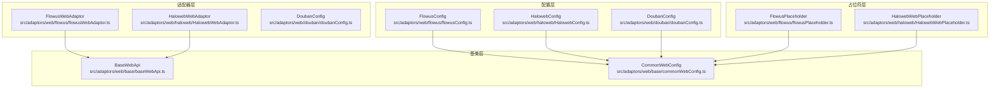
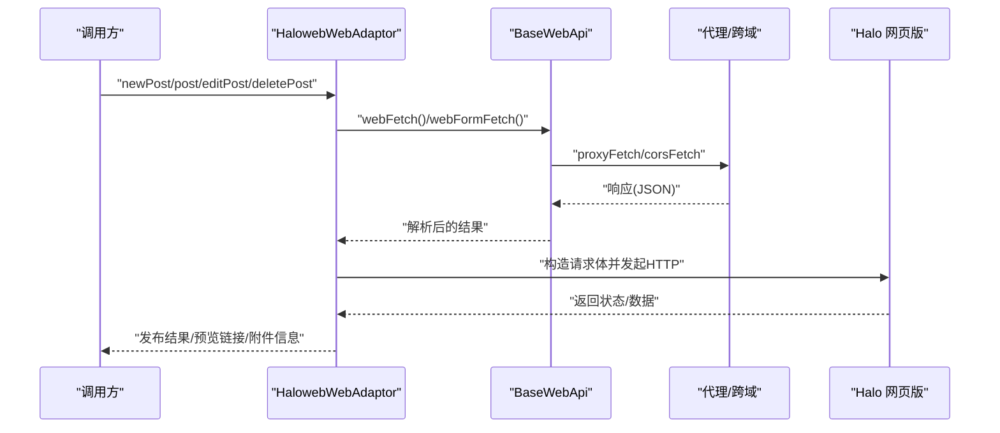
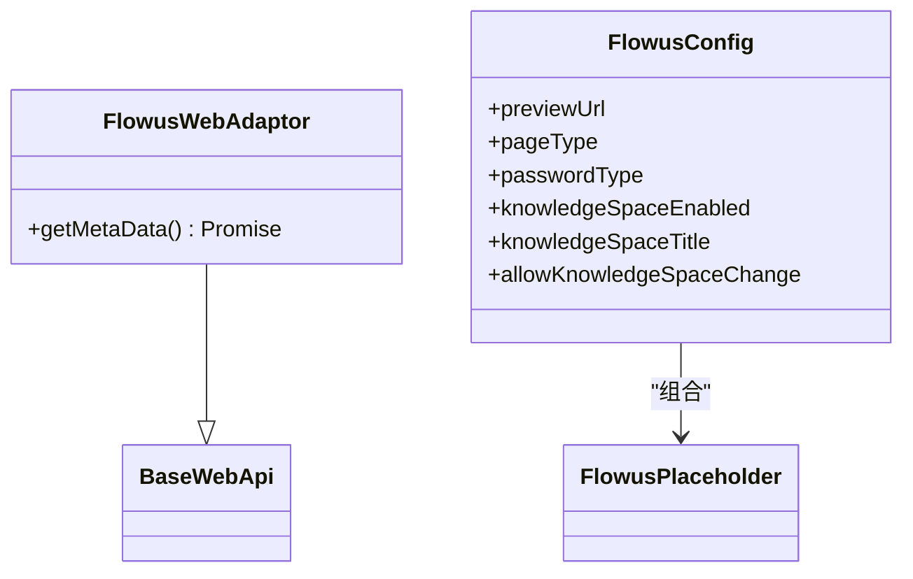
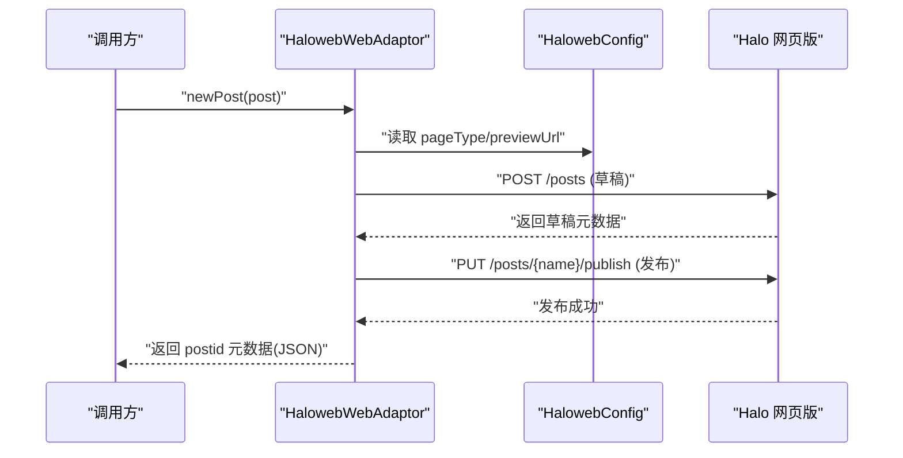
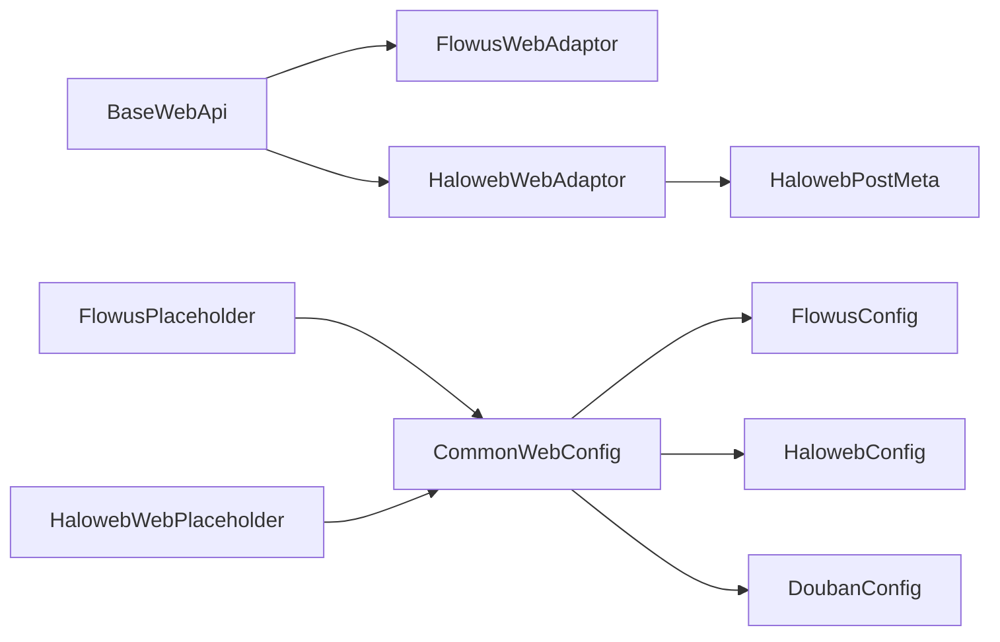

# 内容社区平台

<cite>
**本文引用的文件**
- [flowusWebAdaptor.ts](file://src/adaptors/web/flowus/flowusWebAdaptor.ts)
- [flowusConfig.ts](file://src/adaptors/web/flowus/flowusConfig.ts)
- [flowusPlaceholder.ts](file://src/adaptors/web/flowus/flowusPlaceholder.ts)
- [HalowebWebAdaptor.ts](file://src/adaptors/web/haloweb/HalowebWebAdaptor.ts)
- [HalowebConfig.ts](file://src/adaptors/web/haloweb/HalowebConfig.ts)
- [HalowebPostMeta.ts](file://src/adaptors/web/haloweb/HalowebPostMeta.ts)
- [HalowebWebPlaceholder.ts](file://src/adaptors/web/haloweb/HalowebWebPlaceholder.ts)
- [doubanConfig.ts](file://src/adaptors/web/douban/doubanConfig.ts)
- [baseWebApi.ts](file://src/adaptors/web/base/baseWebApi.ts)
- [commonWebConfig.ts](file://src/adaptors/web/base/commonWebConfig.ts)
</cite>

## 目录
1. [简介](#简介)
2. [项目结构](#项目结构)
3. [核心组件](#核心组件)
4. [架构总览](#架构总览)
5. [组件详解](#组件详解)
6. [依赖关系分析](#依赖关系分析)
7. [性能与可靠性](#性能与可靠性)
8. [故障排查指南](#故障排查指南)
9. [结论](#结论)
10. [附录](#附录)

## 简介
本文件面向内容社区平台适配器的使用者与维护者，系统化梳理 FlowUs、HaloWeb、豆瓣等平台在本项目中的适配方案。重点覆盖以下方面：
- 内容创作工具集成：如何通过适配器将内容从源系统发布到目标平台
- 评论系统对接与社交互动：平台能力边界与扩展建议
- 内容模板管理、主题定制与用户体验优化：基于配置与占位符的可扩展性
- 版权保护与UGC审核：平台侧策略与适配器层面的注意事项

## 项目结构
围绕“网页授权适配器”这一核心，项目采用按平台分层的组织方式：
- 适配器层：每个平台一个适配器类，负责具体平台的认证、读写、媒体上传等
- 配置层：每个平台一个配置类，定义首页、API地址、页面类型、密码类型、启用功能等
- 占位符层：用于国际化提示文案与交互引导
- 基类层：统一的网页授权基类，封装通用的网络请求、Cookie拼接、表单上传等

图表来源
- [flowusWebAdaptor.ts:1-53](file://src/adaptors/web/flowus/flowusWebAdaptor.ts#L1-L53)
- [HalowebWebAdaptor.ts:1-548](file://src/adaptors/web/haloweb/HalowebWebAdaptor.ts#L1-L548)
- [flowusConfig.ts:1-35](file://src/adaptors/web/flowus/flowusConfig.ts#L1-L35)
- [HalowebConfig.ts:1-37](file://src/adaptors/web/haloweb/HalowebConfig.ts#L1-L37)
- [doubanConfig.ts:1-38](file://src/adaptors/web/douban/doubanConfig.ts#L1-L38)
- [baseWebApi.ts:1-256](file://src/adaptors/web/base/baseWebApi.ts#L1-L256)
- [commonWebConfig.ts:1-45](file://src/adaptors/web/base/commonWebConfig.ts#L1-L45)

章节来源
- [flowusWebAdaptor.ts:1-53](file://src/adaptors/web/flowus/flowusWebAdaptor.ts#L1-L53)
- [HalowebWebAdaptor.ts:1-548](file://src/adaptors/web/haloweb/HalowebWebAdaptor.ts#L1-L548)
- [flowusConfig.ts:1-35](file://src/adaptors/web/flowus/flowusConfig.ts#L1-L35)
- [HalowebConfig.ts:1-37](file://src/adaptors/web/haloweb/HalowebConfig.ts#L1-L37)
- [doubanConfig.ts:1-38](file://src/adaptors/web/douban/doubanConfig.ts#L1-L38)
- [baseWebApi.ts:1-256](file://src/adaptors/web/base/baseWebApi.ts#L1-L256)
- [commonWebConfig.ts:1-45](file://src/adaptors/web/base/commonWebConfig.ts#L1-L45)

## 核心组件
- FlowusWebAdaptor：提供 FlowUs 平台元数据获取能力，当前以只读元数据为主，支持 Markdown 页面类型与知识空间（根页面）概念
- HalowebWebAdaptor：提供 Halo 网页版的完整生命周期能力，包括文章增删改查、分类/标签同步、媒体上传、预览链接生成等
- DoubanConfig：豆瓣平台的配置示例，展示如何启用标签与分类、页面类型与密码类型等
- BaseWebApi：网页授权适配器基类，封装统一的网络请求、Cookie拼接、表单上传、代理与CORS处理
- CommonWebConfig：通用网页配置基类，集中管理首页、API地址、页面类型、功能开关、占位符等

章节来源
- [flowusWebAdaptor.ts:21-38](file://src/adaptors/web/flowus/flowusWebAdaptor.ts#L21-L38)
- [HalowebWebAdaptor.ts:21-37](file://src/adaptors/web/haloweb/HalowebWebAdaptor.ts#L21-L37)
- [doubanConfig.ts:16-34](file://src/adaptors/web/douban/doubanConfig.ts#L16-L34)
- [baseWebApi.ts:36-63](file://src/adaptors/web/base/baseWebApi.ts#L36-L63)
- [commonWebConfig.ts:16-44](file://src/adaptors/web/base/commonWebConfig.ts#L16-L44)

## 架构总览
适配器通过“配置 + 基类 + 平台实现”的分层设计，确保不同平台在统一接口下运行。请求路径支持代理或CORS两种模式，适配器内部根据环境自动选择最优通道。

图表来源
- [HalowebWebAdaptor.ts:478-508](file://src/adaptors/web/haloweb/HalowebWebAdaptor.ts#L478-L508)
- [baseWebApi.ts:150-199](file://src/adaptors/web/base/baseWebApi.ts#L150-L199)
- [baseWebApi.ts:209-248](file://src/adaptors/web/base/baseWebApi.ts#L209-L248)

## 组件详解

### FlowUs 适配器
- 角色定位：提供 FlowUs 元数据获取能力，当前未实现文章 CRUD 与分类/标签同步
- 关键点
  - 元数据字段包含平台标识、显示名、图标、主页、支持类型等
  - 页面类型为 Markdown，知识空间启用且不可变更，具备只读提示
- 适用场景：仅需读取用户与空间信息，或作为占位适配器

图表来源
- [flowusWebAdaptor.ts:21-38](file://src/adaptors/web/flowus/flowusWebAdaptor.ts#L21-L38)
- [flowusConfig.ts:16-32](file://src/adaptors/web/flowus/flowusConfig.ts#L16-L32)
- [flowusPlaceholder.ts:12-12](file://src/adaptors/web/flowus/flowusPlaceholder.ts#L12-L12)

章节来源
- [flowusWebAdaptor.ts:21-38](file://src/adaptors/web/flowus/flowusWebAdaptor.ts#L21-L38)
- [flowusConfig.ts:16-32](file://src/adaptors/web/flowus/flowusConfig.ts#L16-L32)
- [flowusPlaceholder.ts:12-12](file://src/adaptors/web/flowus/flowusPlaceholder.ts#L12-L12)

### HaloWeb 适配器
- 角色定位：完整的 Halo 网页版适配器，覆盖文章生命周期、分类/标签管理、媒体上传、预览链接生成
- 关键流程
  - 元数据：读取站点信息，推导主页与图标
  - 文章新增：构造文章与内容对象，先保存草稿再发布；生成自定义 postid 元数据
  - 文章编辑：加载最新版本，更新标题/摘要/正文/分类/标签/发布时间，重新发布
  - 删除：调用回收站接口
  - 分类/标签：若不存在则自动创建，支持多选分类
  - 媒体上传：构造 FormData，上传至附件接口，返回附件信息
  - 预览：根据配置替换占位符生成预览 URL
- 安全与鉴权：通过 Cookie 注入请求头，适配网页版登录态

图表来源
- [HalowebWebAdaptor.ts:75-168](file://src/adaptors/web/haloweb/HalowebWebAdaptor.ts#L75-L168)
- [HalowebConfig.ts:16-33](file://src/adaptors/web/haloweb/HalowebConfig.ts#L16-L33)

章节来源
- [HalowebWebAdaptor.ts:21-37](file://src/adaptors/web/haloweb/HalowebWebAdaptor.ts#L21-L37)
- [HalowebWebAdaptor.ts:75-168](file://src/adaptors/web/haloweb/HalowebWebAdaptor.ts#L75-L168)
- [HalowebWebAdaptor.ts:170-233](file://src/adaptors/web/haloweb/HalowebWebAdaptor.ts#L170-L233)
- [HalowebWebAdaptor.ts:247-258](file://src/adaptors/web/haloweb/HalowebWebAdaptor.ts#L247-L258)
- [HalowebWebAdaptor.ts:260-290](file://src/adaptors/web/haloweb/HalowebWebAdaptor.ts#L260-L290)
- [HalowebWebAdaptor.ts:292-348](file://src/adaptors/web/haloweb/HalowebWebAdaptor.ts#L292-L348)
- [HalowebWebAdaptor.ts:359-362](file://src/adaptors/web/haloweb/HalowebWebAdaptor.ts#L359-L362)
- [HalowebWebAdaptor.ts:364-405](file://src/adaptors/web/haloweb/HalowebWebAdaptor.ts#L364-L405)
- [HalowebWebAdaptor.ts:407-443](file://src/adaptors/web/haloweb/HalowebWebAdaptor.ts#L407-L443)
- [HalowebWebAdaptor.ts:445-473](file://src/adaptors/web/haloweb/HalowebWebAdaptor.ts#L445-L473)
- [HalowebWebAdaptor.ts:478-508](file://src/adaptors/web/haloweb/HalowebWebAdaptor.ts#L478-L508)
- [HalowebWebAdaptor.ts:517-544](file://src/adaptors/web/haloweb/HalowebWebAdaptor.ts#L517-L544)
- [HalowebConfig.ts:16-33](file://src/adaptors/web/haloweb/HalowebConfig.ts#L16-L33)
- [HalowebPostMeta.ts](file://src/adaptors/web/haloweb/HalowebPostMeta.ts)

### 豆瓣配置
- 角色定位：示例配置，展示如何启用标签与分类、页面类型与密码类型等
- 关键点
  - 页面类型为 Markdown
  - 密码类型为 Cookie
  - 启用标签与分类，禁用知识空间

章节来源
- [doubanConfig.ts:16-34](file://src/adaptors/web/douban/doubanConfig.ts#L16-L34)

### 基类与通用配置
- BaseWebApi
  - 提供统一的网络请求方法：webFetch、webFormFetch
  - 自动选择代理或 CORS 通道，支持多种编码与响应解码
  - 支持 Cookie 拼接与 Electron Cookie 转换
- CommonWebConfig
  - 统一管理首页、API地址、页面类型、功能开关、占位符等
  - 为各平台提供一致的配置入口

章节来源
- [baseWebApi.ts:150-199](file://src/adaptors/web/base/baseWebApi.ts#L150-L199)
- [baseWebApi.ts:209-248](file://src/adaptors/web/base/baseWebApi.ts#L209-L248)
- [commonWebConfig.ts:16-44](file://src/adaptors/web/base/commonWebConfig.ts#L16-L44)

## 依赖关系分析
- 平台适配器依赖基类提供的网络与工具能力
- 配置类决定平台行为（页面类型、密码类型、功能开关）
- 占位符类承载提示文案，便于国际化与本地化
- HaloWeb 适配器内部依赖 HaloUtils、FormDataUtils、sypIdUtil 等工具模块

图表来源
- [baseWebApi.ts:36-63](file://src/adaptors/web/base/baseWebApi.ts#L36-L63)
- [flowusWebAdaptor.ts:21-38](file://src/adaptors/web/flowus/flowusWebAdaptor.ts#L21-L38)
- [HalowebWebAdaptor.ts:21-37](file://src/adaptors/web/haloweb/HalowebWebAdaptor.ts#L21-L37)
- [flowusConfig.ts:16-32](file://src/adaptors/web/flowus/flowusConfig.ts#L16-L32)
- [HalowebConfig.ts:16-33](file://src/adaptors/web/haloweb/HalowebConfig.ts#L16-L33)
- [doubanConfig.ts:16-34](file://src/adaptors/web/douban/doubanConfig.ts#L16-L34)
- [flowusPlaceholder.ts:12-12](file://src/adaptors/web/flowus/flowusPlaceholder.ts#L12-L12)
- [HalowebWebPlaceholder.ts:12-12](file://src/adaptors/web/haloweb/HalowebWebPlaceholder.ts#L12-L12)
- [HalowebPostMeta.ts](file://src/adaptors/web/haloweb/HalowebPostMeta.ts)

## 性能与可靠性
- 请求通道选择
  - 优先使用代理通道，避免浏览器同源限制；在特定环境下回退到 CORS 通道
  - 表单上传时统一采用 base64 编解码，保证跨环境一致性
- 错误处理
  - Halo 上传与表单提交错误会抛出明确异常，便于上层捕获与提示
  - 文章删除失败会抛出异常，确保调用方感知
- 可靠性建议
  - 在网络不稳定环境下，建议开启代理通道并适当增加重试
  - 对媒体上传与文章发布采用幂等策略（如草稿先行），减少重复操作

## 故障排查指南
- 认证失败
  - 检查密码类型与 Cookie 是否正确注入
  - 确认平台登录态有效，必要时刷新登录
- 发布失败
  - 查看 Halo 适配器返回的错误信息，确认草稿保存与发布步骤是否成功
  - 核对分类/标签是否存在，必要时允许自动创建
- 媒体上传失败
  - 检查 FormData 构造与后端接口参数
  - 确认附件策略与分组参数正确
- 预览链接异常
  - 校验 previewUrl 中占位符替换逻辑，确保 slug/name/year/month/day 正确

章节来源
- [HalowebWebAdaptor.ts:538-540](file://src/adaptors/web/haloweb/HalowebWebAdaptor.ts#L538-L540)
- [HalowebWebAdaptor.ts:254-257](file://src/adaptors/web/haloweb/HalowebWebAdaptor.ts#L254-L257)
- [HalowebWebAdaptor.ts:235-245](file://src/adaptors/web/haloweb/HalowebWebAdaptor.ts#L235-L245)

## 结论
本适配器体系以“配置驱动 + 基类复用 + 平台实现”的方式，实现了 FlowUs、HaloWeb、豆瓣等平台的差异化适配。其中 HaloWeb 提供了最完整的功能闭环，适合需要深度集成的场景；FlowUs 当前聚焦元数据与知识空间；Douban 则展示了最小可用配置示例。通过占位符与配置的灵活组合，可在不修改核心代码的前提下扩展更多平台与功能。

## 附录
- 内容模板管理与主题定制
  - 通过页面类型（Markdown/HTML）与占位符（previewUrl、placeholder）实现模板化输出与主题风格控制
- 社交互动与评论系统
  - 本仓库未内置评论系统对接逻辑，建议在目标平台开启原生评论或通过第三方服务接入
- 版权保护与UGC审核
  - 平台侧策略由各平台自行制定；适配器层建议在发布前进行敏感词过滤与合规检查，并保留发布记录以便追溯